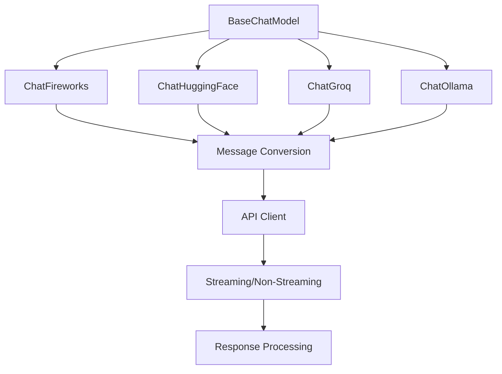
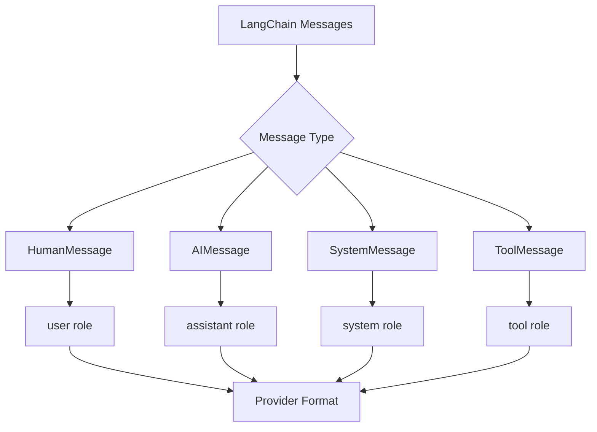
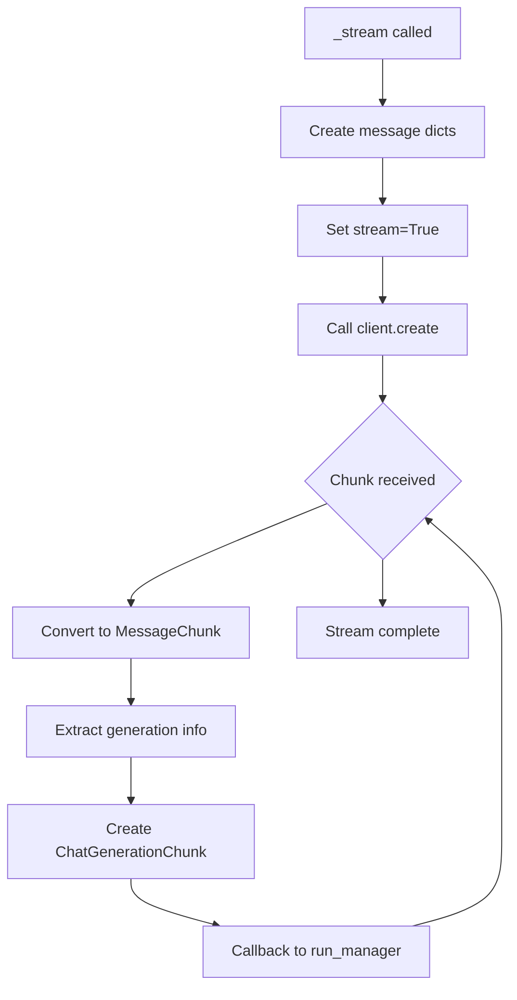
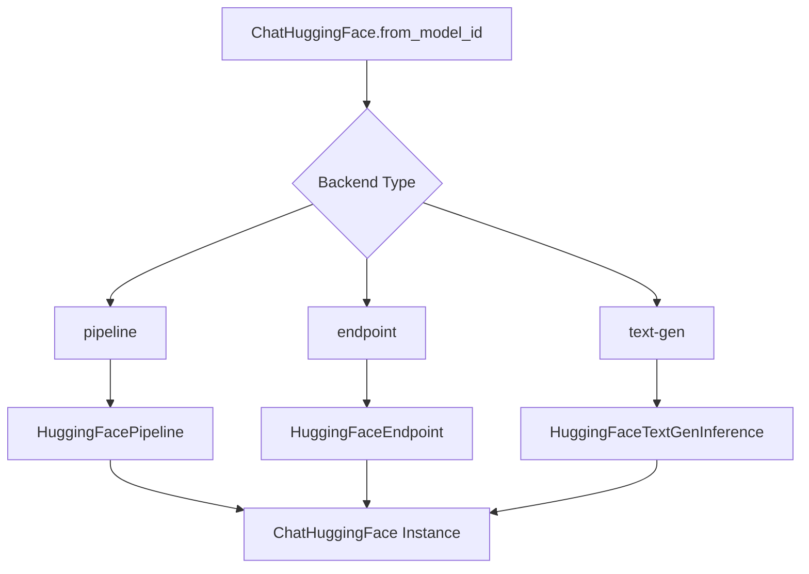
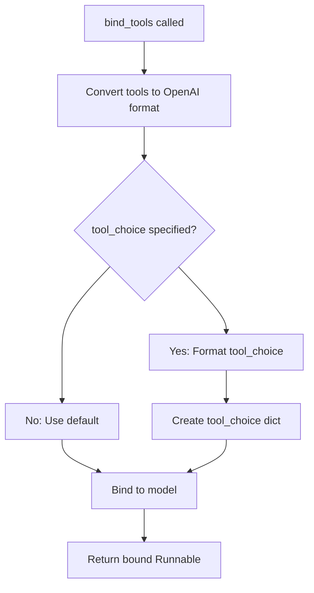
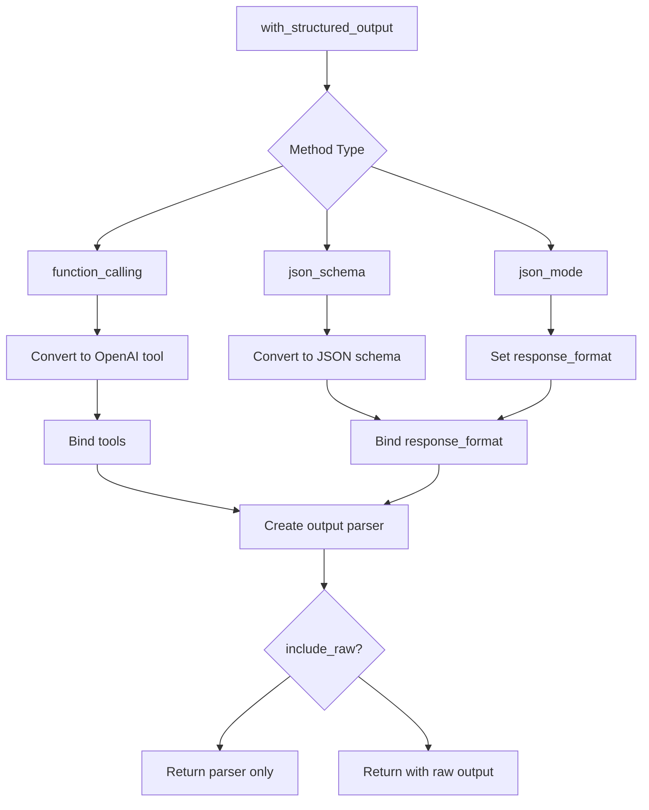
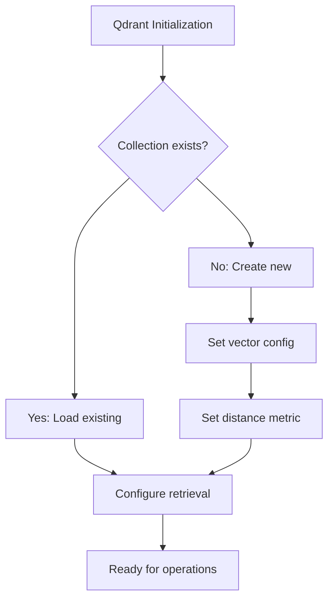
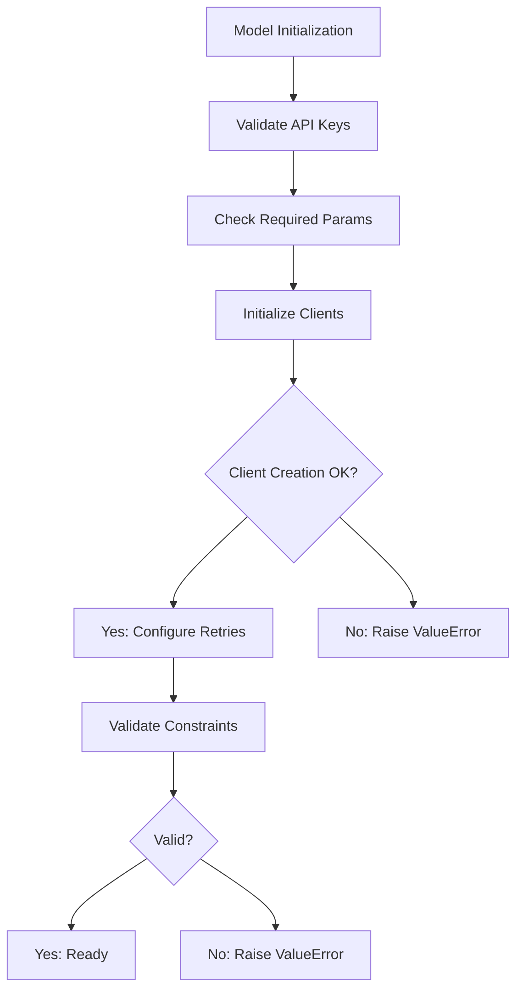

# Additional Partner Packages

## Introduction

LangChain's Partner Integrations ecosystem provides a modular architecture for integrating various third-party services and platforms into LangChain applications. These partner packages extend LangChain's core functionality by providing specialized implementations for chat models, vector stores, and other components from different providers. Each partner package is maintained as a separate library under the `libs/partners/` directory, allowing users to install only the integrations they need while maintaining consistent interfaces through LangChain's base abstractions.

This document covers the architecture, implementation patterns, and key features of several major partner integrations including Fireworks AI, Hugging Face, Chroma, Qdrant, Groq, and Ollama. These integrations demonstrate common patterns for implementing chat models and vector stores while adapting to each provider's unique API characteristics.

## Chat Model Integrations

### Common Architecture Pattern

All partner chat model implementations inherit from `BaseChatModel` and follow a consistent pattern for message conversion, streaming, and structured output support. The core architecture involves:



Each chat model implementation provides:
- Message format conversion between LangChain and provider-specific formats
- Synchronous and asynchronous generation methods
- Streaming support with token-by-token callbacks
- Tool/function calling capabilities
- Structured output formatting

Sources: [chat_models.py:1-100](../../../libs/partners/fireworks/langchain_fireworks/chat_models.py#L1-L100), [huggingface.py:1-100](../../../libs/partners/huggingface/langchain_huggingface/chat_models/huggingface.py#L1-L100)

### Message Conversion System

All chat model integrations implement bidirectional message conversion between LangChain's message types and provider-specific formats:



The conversion functions handle:
- Role mapping (user, assistant, system, tool, function)
- Tool call serialization and deserialization
- Additional metadata preservation
- Content formatting (text, tool calls, function calls)

Sources: [chat_models.py:74-165](../../../libs/partners/fireworks/langchain_fireworks/chat_models.py#L74-L165), [huggingface.py:92-165](../../../libs/partners/huggingface/langchain_huggingface/chat_models/huggingface.py#L92-L165)

### Fireworks AI Integration

The `ChatFireworks` class provides integration with Fireworks AI's chat completion API. Key features include:

| Feature | Description |
|---------|-------------|
| Model Profiles | Pre-configured settings for specific models via `_MODEL_PROFILES` |
| Streaming | Token-by-token streaming with usage metadata |
| Tool Calling | OpenAI-compatible tool/function calling |
| Structured Output | Support for `function_calling`, `json_mode`, and `json_schema` methods |
| API Configuration | Customizable base URL, timeout, and retry settings |

**Configuration Parameters:**

```python
model_name: str  # Model identifier (e.g., "accounts/fireworks/models/gpt-oss-120b")
temperature: float | None  # Sampling temperature
max_tokens: int | None  # Maximum tokens to generate
streaming: bool = False  # Enable streaming responses
fireworks_api_key: SecretStr  # API authentication key
fireworks_api_base: str | None  # Custom API base URL
request_timeout: float | tuple | None  # Request timeout configuration
max_retries: int | None  # Maximum retry attempts
```

Sources: [chat_models.py:229-280](../../../libs/partners/fireworks/langchain_fireworks/chat_models.py#L229-L280)

#### Streaming Implementation

The Fireworks integration implements streaming through the `_stream` method, which processes chunks as they arrive:



The streaming process includes:
- Chunk-by-chunk message conversion
- Usage metadata tracking in final chunks
- Logprobs extraction when available
- Real-time callback notifications

Sources: [chat_models.py:363-400](../../../libs/partners/fireworks/langchain_fireworks/chat_models.py#L363-L400)

### Hugging Face Integration

The `ChatHuggingFace` class serves as a wrapper around multiple Hugging Face LLM implementations, supporting:

- `HuggingFaceTextGenInference` - Text Generation Inference server
- `HuggingFaceEndpoint` - Hosted inference endpoints
- `HuggingFaceHub` - Hub API
- `HuggingFacePipeline` - Local pipeline execution

**Backend Selection Flow:**



Sources: [huggingface.py:457-506](../../../libs/partners/huggingface/langchain_huggingface/chat_models/huggingface.py#L457-L506)

#### Property Inheritance System

The Hugging Face integration implements automatic property inheritance from the wrapped LLM:

```python
property_mappings = {
    "temperature": "temperature",
    "max_tokens": "max_new_tokens",  # Different naming convention
    "top_p": "top_p",
    "seed": "seed",
    "streaming": "streaming",
    "stop": "stop_sequences",
}
```

This ensures that configuration set on the underlying LLM is automatically available to the chat wrapper without duplication.

Sources: [huggingface.py:391-428](../../../libs/partners/huggingface/langchain_huggingface/chat_models/huggingface.py#L391-L428)

### Tool Calling Support

Both Fireworks and Hugging Face integrations implement `bind_tools` for function calling:



Tool choice options include:
- `'auto'` - Model decides whether to call a tool
- `'any'` - Model must call one of the provided tools
- `'none'` - Model should not call any tools
- Specific tool name - Model must call the named tool
- Boolean `True` - Requires exactly one tool, forces its use

Sources: [chat_models.py:533-580](../../../libs/partners/fireworks/langchain_fireworks/chat_models.py#L533-L580), [huggingface.py:1057-1101](../../../libs/partners/huggingface/langchain_huggingface/chat_models/huggingface.py#L1057-L1101)

### Structured Output Methods

Chat models support three methods for structured output generation:

| Method | Description | Use Case |
|--------|-------------|----------|
| `function_calling` | Uses tool-calling API to enforce schema | Most reliable, requires tool support |
| `json_schema` | Passes JSON schema to model's structured output feature | Provider-specific structured output |
| `json_mode` | Enables JSON output mode without strict schema | Flexible JSON generation |

**Structured Output Flow:**



Sources: [chat_models.py:582-877](../../../libs/partners/fireworks/langchain_fireworks/chat_models.py#L582-L877)

## Vector Store Integrations

### Chroma Integration

The `Chroma` vector store integration provides a wrapper around ChromaDB for document storage and similarity search. Key architectural components:

**Initialization Parameters:**

| Parameter | Type | Description |
|-----------|------|-------------|
| `collection_name` | str | Name of the collection (default: "langchain") |
| `embedding_function` | Embeddings | Embedding model for vectorization |
| `persist_directory` | str | Directory for persistent storage |
| `client_settings` | Settings | ChromaDB client configuration |
| `collection_metadata` | dict | Metadata for the collection |
| `client` | ClientAPI | Pre-configured ChromaDB client |

The integration supports both ephemeral (in-memory) and persistent storage modes, with automatic client initialization based on configuration.

Sources: [vectorstores.py:1-100](../../../libs/partners/chroma/langchain_chroma/vectorstores.py#L1-L100)

### Qdrant Integration

The `Qdrant` vector store provides integration with Qdrant's vector search engine. The implementation includes:

**Collection Management:**



**Supported Distance Metrics:**
- Cosine similarity
- Euclidean distance
- Dot product
- Manhattan distance

The Qdrant integration supports advanced features like:
- Filtered search with metadata conditions
- Batch operations for efficiency
- Asynchronous operations
- Custom vector configurations per collection

Sources: [vectorstores.py:1-100](../../../libs/partners/qdrant/langchain_qdrant/vectorstores.py#L1-L100)

## Model Profiles System

Several integrations implement a model profiles system for pre-configured model settings:

```python
_MODEL_PROFILES = cast("ModelProfileRegistry", _PROFILES)

def _get_default_model_profile(model_name: str) -> ModelProfile:
    default = _MODEL_PROFILES.get(model_name) or {}
    return default.copy()
```

Model profiles provide:
- Default parameter values per model
- Capability flags (tool calling, streaming, etc.)
- Context window sizes
- Token limits
- Provider-specific optimizations

This allows automatic configuration based on the model identifier, reducing manual setup requirements.

Sources: [chat_models.py:64-68](../../../libs/partners/fireworks/langchain_fireworks/chat_models.py#L64-L68), [huggingface.py:83-86](../../../libs/partners/huggingface/langchain_huggingface/chat_models/huggingface.py#L83-L86)

## Usage Metadata Tracking

All chat model integrations track token usage through a consistent metadata structure:

```python
usage_metadata = {
    "input_tokens": usage.get("prompt_tokens", 0),
    "output_tokens": usage.get("completion_tokens", 0),
    "total_tokens": usage.get("total_tokens", input_tokens + output_tokens),
}
```

Usage tracking is available in:
- Non-streaming responses (in `AIMessage.usage_metadata`)
- Streaming responses (in final chunk when `stream_usage=True`)
- Generation info (for backward compatibility)

The metadata enables cost tracking, rate limiting, and performance monitoring across different providers.

Sources: [chat_models.py:218-228](../../../libs/partners/fireworks/langchain_fireworks/chat_models.py#L218-L228), [huggingface.py:252-262](../../../libs/partners/huggingface/langchain_huggingface/chat_models/huggingface.py#L252-L262)

## Error Handling and Validation

Partner integrations implement comprehensive validation at initialization:



Common validation checks include:
- API key presence and format
- Parameter range validation (e.g., `n >= 1`, `n == 1` when streaming)
- Client initialization success
- Model availability verification
- Endpoint URL validation

Sources: [chat_models.py:281-310](../../../libs/partners/fireworks/langchain_fireworks/chat_models.py#L281-L310)

## Asynchronous Operations

All major chat model integrations provide async variants of core methods:

| Sync Method | Async Method | Purpose |
|-------------|--------------|---------|
| `_generate` | `_agenerate` | Generate chat completions |
| `_stream` | `_astream` | Stream response chunks |
| `invoke` | `ainvoke` | High-level generation (inherited) |
| `stream` | `astream` | High-level streaming (inherited) |

Async implementations use the same client libraries but with async-specific methods (`acreate`, `chat_completion` with async iterators), enabling efficient concurrent operations in async applications.

Sources: [chat_models.py:451-486](../../../libs/partners/fireworks/langchain_fireworks/chat_models.py#L451-L486), [huggingface.py:576-620](../../../libs/partners/huggingface/langchain_huggingface/chat_models/huggingface.py#L576-L620)

## Summary

LangChain's partner integrations provide a consistent, modular approach to incorporating third-party AI services. By standardizing interfaces through base classes like `BaseChatModel` while allowing provider-specific optimizations, these integrations enable developers to switch between providers with minimal code changes. The common patterns for message conversion, streaming, tool calling, and structured output ensure a uniform developer experience across different AI platforms, while features like model profiles and usage tracking provide production-ready capabilities for monitoring and optimization.