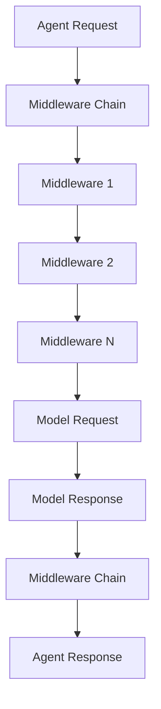
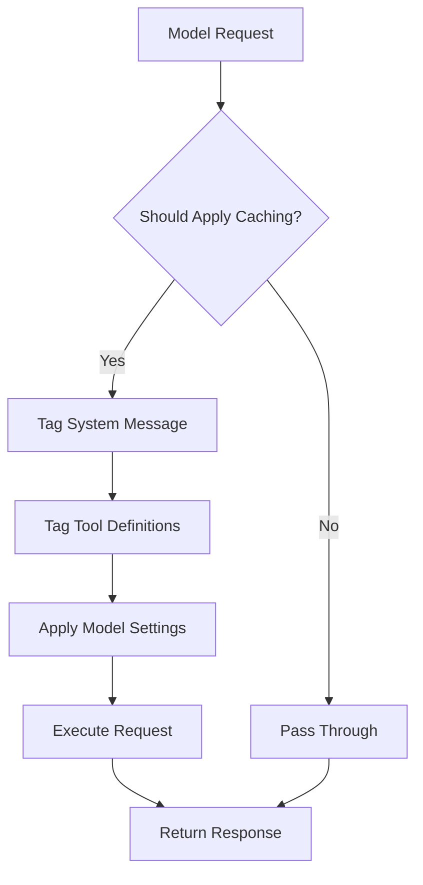
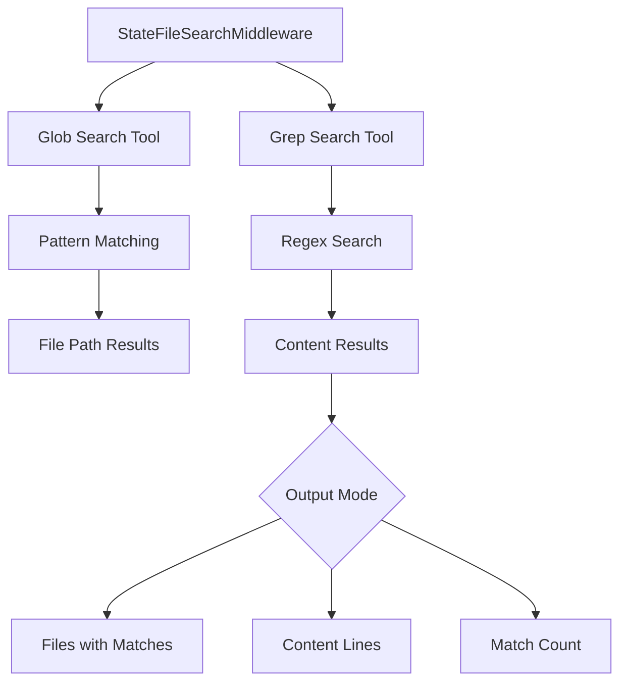
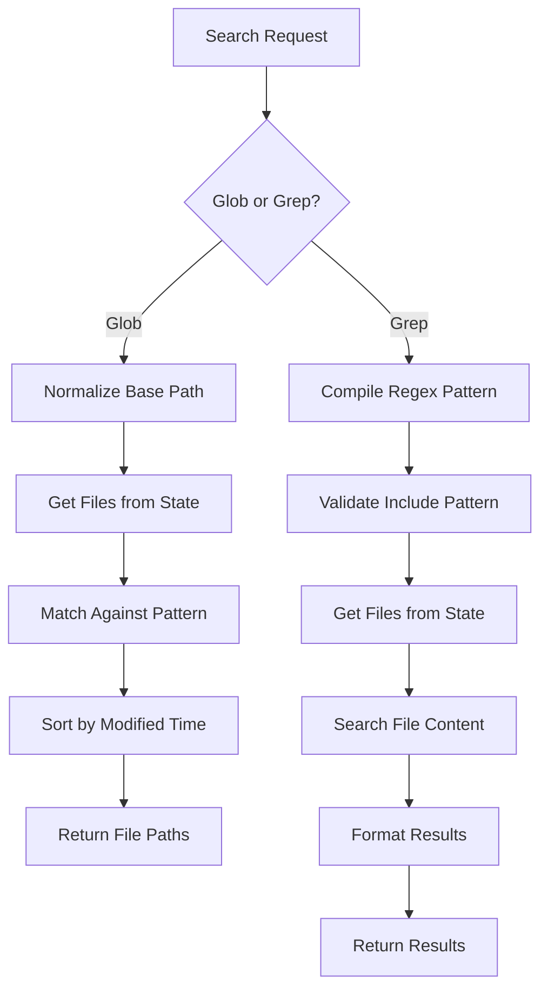
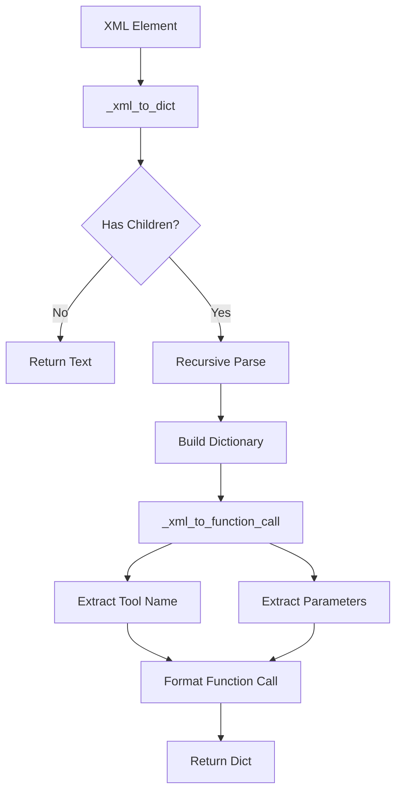

# Anthropic Integration & Provider Middleware

The Anthropic integration provides comprehensive support for Claude models within the LangChain framework, offering both core chat model implementations and a sophisticated middleware system for enhancing agent capabilities. This integration enables developers to build LLM-powered applications using Anthropic's Claude models with composable components, advanced tool-calling capabilities, and performance optimizations. The middleware layer extends the base functionality with features like prompt caching, file system operations, bash tool execution, and file search capabilities, making it suitable for complex agentic workflows.

The integration is organized into two primary layers: the core chat model implementation (`ChatAnthropic` and `AnthropicLLM`) and a middleware system that provides reusable, composable enhancements for agent-based applications. This architecture allows developers to incrementally adopt advanced features while maintaining clean separation of concerns.

Sources: [langchain_anthropic/__init__.py:1-17](../../../libs/partners/anthropic/langchain_anthropic/__init__.py#L1-L17), [langchain_anthropic/middleware/__init__.py:1-27](../../../libs/partners/anthropic/langchain_anthropic/middleware/__init__.py#L1-L27)

## Core Components

### Package Structure

The Anthropic partner package exposes the following core components:

| Component | Type | Description |
|-----------|------|-------------|
| `ChatAnthropic` | Chat Model | Primary chat model implementation for Claude |
| `AnthropicLLM` | LLM | Legacy LLM interface for Claude models |
| `convert_to_anthropic_tool` | Function | Utility for converting tools to Anthropic format |
| `__version__` | String | Package version identifier |

Sources: [langchain_anthropic/__init__.py:5-16](../../../libs/partners/anthropic/langchain_anthropic/__init__.py#L5-L16)

### Middleware Components

The middleware system provides seven specialized middleware classes for enhancing agent capabilities:

| Middleware | Purpose |
|------------|---------|
| `AnthropicPromptCachingMiddleware` | Optimizes API usage by caching conversation prefixes |
| `ClaudeBashToolMiddleware` | Enables bash command execution |
| `FilesystemClaudeMemoryMiddleware` | Provides file-based memory storage |
| `FilesystemClaudeTextEditorMiddleware` | Enables file editing on filesystem |
| `StateClaudeMemoryMiddleware` | Provides state-based memory storage |
| `StateClaudeTextEditorMiddleware` | Enables file editing in agent state |
| `StateFileSearchMiddleware` | Provides glob and grep search over state files |

Sources: [langchain_anthropic/middleware/__init__.py:3-25](../../../libs/partners/anthropic/langchain_anthropic/middleware/__init__.py#L3-L25)

## Middleware Architecture

### Agent Middleware Framework

All middleware components inherit from the `AgentMiddleware` base class, which provides a consistent interface for intercepting and modifying model requests and responses. The middleware pattern enables developers to compose multiple enhancements without modifying the core agent logic.



The middleware framework supports both synchronous and asynchronous execution through `wrap_model_call` and `awrap_model_call` methods, allowing middleware to intercept requests before they reach the model and modify responses after model execution.

Sources: [langchain_anthropic/middleware/prompt_caching.py:10-23](../../../libs/partners/anthropic/langchain_anthropic/middleware/prompt_caching.py#L10-L23)

## Prompt Caching Middleware

### Overview

The `AnthropicPromptCachingMiddleware` optimizes API usage by implementing Anthropic's prompt caching feature, which caches conversation prefixes to reduce token costs and improve response times. This middleware strategically applies cache control breakpoints to system messages, tool definitions, and message sequences.

Sources: [langchain_anthropic/middleware/prompt_caching.py:26-59](../../../libs/partners/anthropic/langchain_anthropic/middleware/prompt_caching.py#L26-L59)

### Cache Control Strategy

The middleware applies cache control breakpoints to three key areas:

1. **System Message**: Tags the last content block of the system message with `cache_control` to cache static system prompt content
2. **Tools**: Tags all tool definitions with `cache_control` to cache tool schemas across turns
3. **Last Cacheable Block**: Tags the last cacheable block of the message sequence using Anthropic's automatic caching feature



Sources: [langchain_anthropic/middleware/prompt_caching.py:40-59](../../../libs/partners/anthropic/langchain_anthropic/middleware/prompt_caching.py#L40-L59)

### Configuration Parameters

| Parameter | Type | Default | Description |
|-----------|------|---------|-------------|
| `type` | Literal["ephemeral"] | "ephemeral" | The type of cache to use |
| `ttl` | Literal["5m", "1h"] | "5m" | Time to live for the cache |
| `min_messages_to_cache` | int | 0 | Minimum number of messages before caching activates |
| `unsupported_model_behavior` | Literal["ignore", "warn", "raise"] | "warn" | Behavior when unsupported model is used |

Sources: [langchain_anthropic/middleware/prompt_caching.py:61-86](../../../libs/partners/anthropic/langchain_anthropic/middleware/prompt_caching.py#L61-L86)

### Implementation Details

The middleware implements both synchronous and asynchronous model call wrappers:

```python
def wrap_model_call(
    self,
    request: ModelRequest,
    handler: Callable[[ModelRequest], ModelResponse],
) -> ModelCallResult:
    """Modify the model request to add cache control blocks."""
    if not self._should_apply_caching(request):
        return handler(request)

    return handler(self._apply_caching(request))
```

The caching logic validates that the model is a `ChatAnthropic` instance and checks if the message count meets the minimum threshold before applying cache control tags.

Sources: [langchain_anthropic/middleware/prompt_caching.py:130-157](../../../libs/partners/anthropic/langchain_anthropic/middleware/prompt_caching.py#L130-L157)

### System Message Tagging

The `_tag_system_message` function modifies system messages to include cache control:

- For string content, it wraps the text in a dictionary with `cache_control`
- For list content, it adds `cache_control` to the last block
- Returns the original message unchanged if no modification is needed

Sources: [langchain_anthropic/middleware/prompt_caching.py:160-195](../../../libs/partners/anthropic/langchain_anthropic/middleware/prompt_caching.py#L160-L195)

### Tool Tagging Strategy

The `_tag_tools` function applies cache control only to the last tool in the list to minimize explicit cache breakpoints (Anthropic limits these to 4 per request). Since tool definitions are sent as a contiguous block, a single breakpoint on the last tool caches the entire set.

```python
def _tag_tools(
    tools: list[Any] | None,
    cache_control: dict[str, str],
) -> list[Any] | None:
    """Tag the last tool with cache_control via its extras dict."""
    if not tools:
        return tools

    last = tools[-1]
    if not isinstance(last, BaseTool):
        return tools

    new_extras = {**(last.extras or {}), "cache_control": cache_control}
    return [*tools[:-1], last.model_copy(update={"extras": new_extras})]
```

Sources: [langchain_anthropic/middleware/prompt_caching.py:198-227](../../../libs/partners/anthropic/langchain_anthropic/middleware/prompt_caching.py#L198-L227)

## File Search Middleware

### Overview

The `StateFileSearchMiddleware` provides two powerful search tools for searching through virtual files stored in agent state: Glob for file pattern matching and Grep for content search using regular expressions. This middleware is designed to work with state-based file systems created by text editor and memory tool middleware.

Sources: [langchain_anthropic/middleware/file_search.py:1-8](../../../libs/partners/anthropic/langchain_anthropic/middleware/file_search.py#L1-L8)

### Search Tools



Sources: [langchain_anthropic/middleware/file_search.py:67-104](../../../libs/partners/anthropic/langchain_anthropic/middleware/file_search.py#L67-L104)

### Glob Search Tool

The `glob_search` tool provides fast file pattern matching that works with any codebase size. It supports glob patterns like `**/*.js` or `src/**/*.ts` and returns matching file paths sorted by modification time.

**Parameters:**

| Parameter | Type | Default | Description |
|-----------|------|---------|-------------|
| `pattern` | str | Required | The glob pattern to match files against |
| `path` | str | "/" | The directory to search in |

**Returns:** Newline-separated list of matching file paths, sorted by modification time (most recently modified first), or `'No files found'` if no matches.

Sources: [langchain_anthropic/middleware/file_search.py:106-130](../../../libs/partners/anthropic/langchain_anthropic/middleware/file_search.py#L106-L130)

### Grep Search Tool

The `grep_search` tool provides fast content search using regular expressions with flexible output modes and file filtering capabilities.

**Parameters:**

| Parameter | Type | Default | Description |
|-----------|------|---------|-------------|
| `pattern` | str | Required | Regular expression pattern to search for |
| `path` | str | "/" | Directory to search in |
| `include` | str \| None | None | File pattern to filter (e.g., `'*.js'`, `'*.{ts,tsx}'`) |
| `output_mode` | Literal | "files_with_matches" | Output format: `'files_with_matches'`, `'content'`, or `'count'` |

**Output Modes:**

- `files_with_matches`: Only file paths containing matches
- `content`: Matching lines with file:line:content format
- `count`: Count of matches per file

Sources: [langchain_anthropic/middleware/file_search.py:132-158](../../../libs/partners/anthropic/langchain_anthropic/middleware/file_search.py#L132-L158)

### Pattern Expansion

The middleware includes sophisticated pattern expansion logic for handling brace patterns like `*.{py,pyi}`:

```python
def _expand_include_patterns(pattern: str) -> list[str] | None:
    """Expand brace patterns like `*.{py,pyi}` into a list of globs."""
    if "}" in pattern and "{" not in pattern:
        return None

    expanded: list[str] = []

    def _expand(current: str) -> None:
        start = current.find("{")
        if start == -1:
            expanded.append(current)
            return
        # ... recursive expansion logic
```

The expansion function recursively processes nested brace patterns and validates them against regex compilation to ensure they're valid glob patterns.

Sources: [langchain_anthropic/middleware/file_search.py:18-52](../../../libs/partners/anthropic/langchain_anthropic/middleware/file_search.py#L18-L52)

### Search Implementation Flow



The glob search implementation handles special cases like `**` patterns that require matching both with and without the prefix for files in the base directory. The grep search compiles regex patterns for validation and applies optional include filters before searching file content line by line.

Sources: [langchain_anthropic/middleware/file_search.py:168-235](../../../libs/partners/anthropic/langchain_anthropic/middleware/file_search.py#L168-L235)

### State Schema

The middleware operates on the `AnthropicToolsState` schema and defaults to searching the `text_editor_files` state key. This can be configured to search `memory_files` for memory tool integration:

```python
def __init__(
    self,
    *,
    state_key: str = "text_editor_files",
) -> None:
    """Initialize the search middleware.
    
    Args:
        state_key: State key to search
            Use `'memory_files'` to search memory tool files.
    """
    self.state_key = state_key
```

Sources: [langchain_anthropic/middleware/file_search.py:89-104](../../../libs/partners/anthropic/langchain_anthropic/middleware/file_search.py#L89-L104)

## Experimental Tool-Calling Support

### XML-Based Tool Format

The experimental module provides legacy XML-based tool-calling support for Anthropic models that don't support native function calling. This system uses a structured XML format for tool definitions and invocations.

**System Prompt Template:**

```
In this environment you have access to a set of tools you can use to answer the user's question.

You may call them like this:
<function_calls>
<invoke>
<tool_name>$TOOL_NAME</tool_name>
<parameters>
<$PARAMETER_NAME>$PARAMETER_VALUE</$PARAMETER_NAME>
...
</parameters>
</invoke>
</function_calls>

Here are the tools available:
<tools>
{formatted_tools}
</tools>
```

Sources: [langchain_anthropic/experimental.py:11-26](../../../libs/partners/anthropic/langchain_anthropic/experimental.py#L11-L26)

### Tool Definition Format

Tools are defined using a nested XML structure with name, description, and parameter specifications:

```
<tool_description>
<tool_name>{tool_name}</tool_name>
<description>{tool_description}</description>
<parameters>
{formatted_parameters}
</parameters>
</tool_description>
```

Each parameter includes name, type, and description:

```
<parameter>
<name>{parameter_name}</name>
<type>{parameter_type}</type>
<description>{parameter_description}</description>
</parameter>
```

Sources: [langchain_anthropic/experimental.py:28-42](../../../libs/partners/anthropic/langchain_anthropic/experimental.py#L28-L42)

### XML Parsing and Conversion

The module provides functions to parse XML tool invocations back into structured function calls:



The `_xml_to_function_call` function converts XML invoke elements into standardized function call dictionaries with proper type handling for arrays and objects based on the tool schema.

Sources: [langchain_anthropic/experimental.py:79-115](../../../libs/partners/anthropic/langchain_anthropic/experimental.py#L79-L115)

### Type Handling

The experimental module includes sophisticated type inference for parameters that support JSON Schema constructs:

```python
def _get_type(parameter: dict[str, Any]) -> str:
    if "type" in parameter:
        return parameter["type"]
    if "anyOf" in parameter:
        return json.dumps({"anyOf": parameter["anyOf"]})
    if "allOf" in parameter:
        return json.dumps({"allOf": parameter["allOf"]})
    return json.dumps(parameter)
```

This function handles standard types as well as JSON Schema composition keywords like `anyOf` and `allOf`, serializing complex type definitions as JSON strings.

Sources: [langchain_anthropic/experimental.py:45-53](../../../libs/partners/anthropic/langchain_anthropic/experimental.py#L45-L53)

## Integration Usage

### Basic Middleware Composition

The middleware system is designed for composition, allowing developers to combine multiple middleware components in an agent:

```python
from langchain.agents import create_agent
from langchain.agents.middleware import (
    StateTextEditorToolMiddleware,
    StateFileSearchMiddleware,
)

agent = create_agent(
    model=model,
    tools=[],
    middleware=[
        StateTextEditorToolMiddleware(),
        StateFileSearchMiddleware(),
    ],
)
```

Sources: [langchain_anthropic/middleware/file_search.py:72-87](../../../libs/partners/anthropic/langchain_anthropic/middleware/file_search.py#L72-L87)

### Dependency Requirements

The middleware components have specific dependency requirements:

- **Prompt Caching Middleware**: Requires both `langchain` and `langchain-anthropic` packages
- **File Search Middleware**: Requires `langchain` for the agent middleware framework
- **Other Middleware**: Specific dependencies are documented in their respective modules

The prompt caching middleware provides clear error messages when dependencies are missing:

```python
try:
    from langchain.agents.middleware.types import (
        AgentMiddleware,
        ModelCallResult,
        ModelRequest,
        ModelResponse,
    )
except ImportError as e:
    msg = (
        "AnthropicPromptCachingMiddleware requires 'langchain' to be installed. "
        "This middleware is designed for use with LangChain agents. "
        "Install it with: pip install langchain"
    )
    raise ImportError(msg) from e
```

Sources: [langchain_anthropic/middleware/prompt_caching.py:15-23](../../../libs/partners/anthropic/langchain_anthropic/middleware/prompt_caching.py#L15-L23)

## Summary

The Anthropic integration provides a comprehensive solution for building Claude-powered applications within the LangChain framework. The core chat model implementation offers robust support for Claude's capabilities, while the middleware system extends functionality with performance optimizations, file system operations, and advanced search capabilities. The modular architecture enables developers to compose exactly the features they need, from simple chat interactions to complex agentic workflows with prompt caching, file manipulation, and content search. The integration's emphasis on clean abstractions, comprehensive error handling, and flexible configuration makes it suitable for both simple prototypes and production applications.

Sources: [langchain_anthropic/__init__.py:1-17](../../../libs/partners/anthropic/langchain_anthropic/__init__.py#L1-L17), [langchain_anthropic/middleware/__init__.py:1-27](../../../libs/partners/anthropic/langchain_anthropic/middleware/__init__.py#L1-L27), [langchain_anthropic/middleware/prompt_caching.py:26-59](../../../libs/partners/anthropic/langchain_anthropic/middleware/prompt_caching.py#L26-L59), [langchain_anthropic/middleware/file_search.py:67-104](../../../libs/partners/anthropic/langchain_anthropic/middleware/file_search.py#L67-L104), [langchain_anthropic/experimental.py:11-26](../../../libs/partners/anthropic/langchain_anthropic/experimental.py#L11-L26)