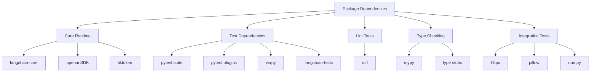
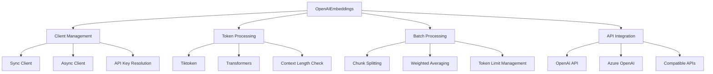
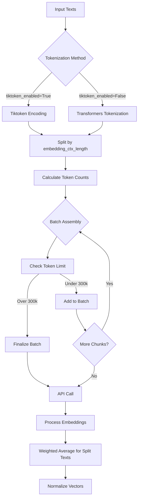
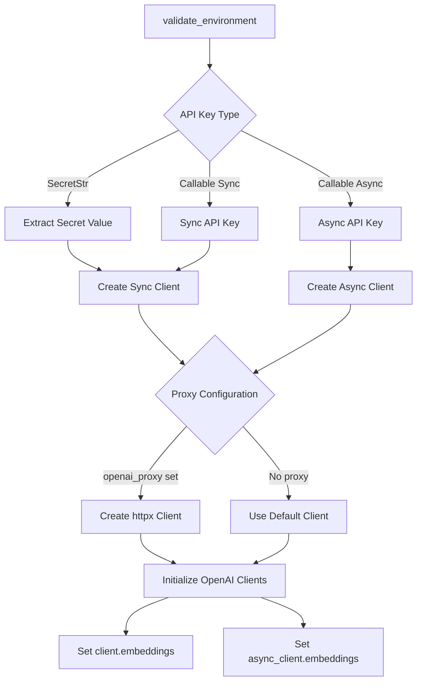
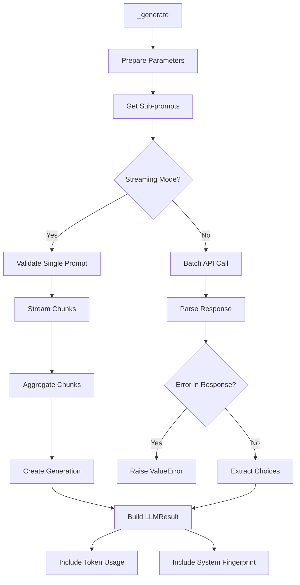
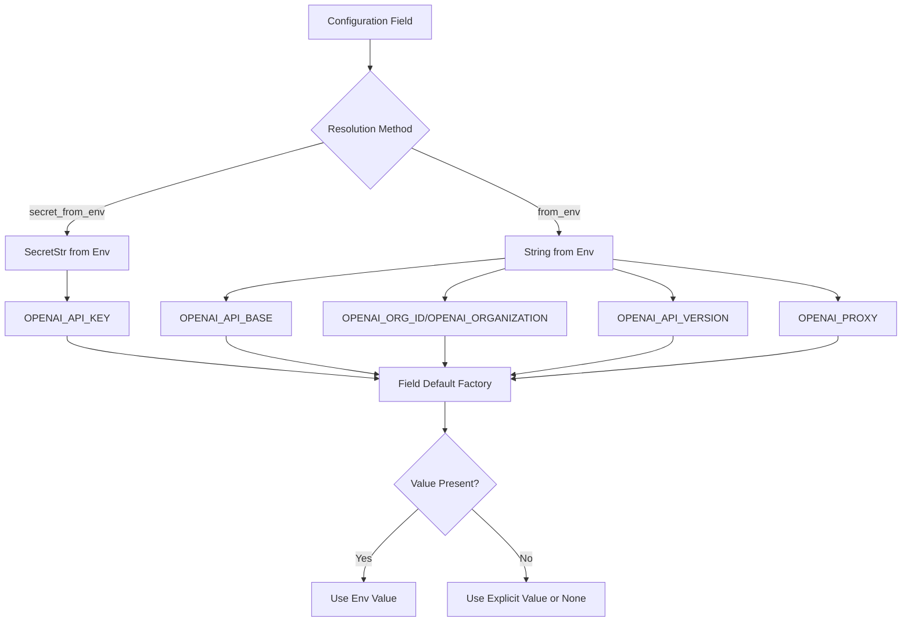
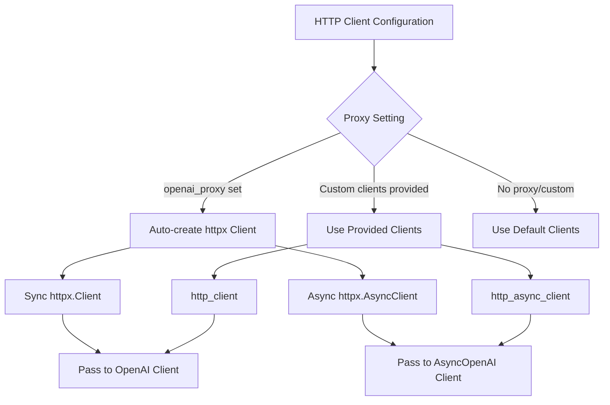

# Partner Package Architecture & OpenAI Integration

## Introduction

The LangChain partner package architecture provides a modular approach to integrating third-party LLM providers and services. The `langchain-openai` package exemplifies this architecture, offering a comprehensive integration layer between LangChain and OpenAI's API services. This package is structured as an independent, production-stable module that provides chat models, completion models, embeddings, and tool utilities for both OpenAI and Azure OpenAI services.

The package follows a clean separation of concerns with dedicated modules for different functionality types (chat models, embeddings, LLMs, tools) and implements both synchronous and asynchronous client patterns. It supports multiple deployment scenarios including standard OpenAI API, Azure OpenAI Service, and OpenAI-compatible APIs from providers like OpenRouter, Ollama, and vLLM.

Sources: [pyproject.toml:1-10](../../../libs/partners/openai/pyproject.toml#L1-L10), [__init__.py:1-20](../../../libs/partners/openai/langchain_openai/__init__.py#L1-L20)

## Package Structure and Dependencies

### Core Package Configuration

The `langchain-openai` package is defined as a production-stable integration package with MIT licensing. It supports Python versions 3.10 through 3.14 and maintains strict version constraints on its core dependencies.

| Dependency | Version Constraint | Purpose |
|------------|-------------------|---------|
| langchain-core | >=1.3.0,<2.0.0 | Core LangChain abstractions and base classes |
| openai | >=2.26.0,<3.0.0 | Official OpenAI Python client |
| tiktoken | >=0.7.0,<1.0.0 | Token counting and text encoding |

Sources: [pyproject.toml:14-26](../../../libs/partners/openai/pyproject.toml#L14-L26)

### Public API Surface

The package exposes a carefully curated set of public classes and utilities through its `__init__.py` module:

```python
__all__ = [
    "AzureChatOpenAI",
    "AzureOpenAI",
    "AzureOpenAIEmbeddings",
    "ChatOpenAI",
    "OpenAI",
    "OpenAIEmbeddings",
    "StreamChunkTimeoutError",
    "custom_tool",
]
```

This design provides clear entry points for different use cases: standard OpenAI integration, Azure-specific implementations, and utility functions for streaming and tool creation.

Sources: [__init__.py:3-18](../../../libs/partners/openai/langchain_openai/__init__.py#L3-L18)

### Development and Testing Infrastructure

The package includes comprehensive dependency groups for different development scenarios:



Sources: [pyproject.toml:33-66](../../../libs/partners/openai/pyproject.toml#L33-L66)

## Embeddings Architecture

### Base Embeddings Class Design

The `OpenAIEmbeddings` class serves as the foundation for embedding functionality, implementing the `Embeddings` interface from `langchain_core`. It supports both synchronous and asynchronous operations with sophisticated token management and batching capabilities.



Sources: [base.py:51-250](../../../libs/partners/openai/langchain_openai/embeddings/base.py#L51-L250)

### Key Configuration Parameters

The embeddings class provides extensive configuration options for different deployment scenarios:

| Parameter | Type | Default | Description |
|-----------|------|---------|-------------|
| model | str | "text-embedding-ada-002" | Model name to use for embeddings |
| dimensions | int \| None | None | Output embedding dimensions (text-embedding-3+ only) |
| embedding_ctx_length | int | 8191 | Maximum tokens to embed at once |
| chunk_size | int | 1000 | Maximum texts per batch |
| tiktoken_enabled | bool | True | Use tiktoken vs HuggingFace tokenization |
| check_embedding_ctx_length | bool | True | Automatically split long inputs |
| skip_empty | bool | False | Skip empty strings or raise error |
| show_progress_bar | bool | False | Display progress during embedding |

Sources: [base.py:175-236](../../../libs/partners/openai/langchain_openai/embeddings/base.py#L175-L236)

### Token Processing and Batching Strategy

The embeddings implementation includes sophisticated token management to handle the API's 300,000 token per request limit while respecting the model's context length:



The token processing implementation handles both tiktoken and transformers-based tokenization:

```python
def _tokenize(
    self, texts: list[str], chunk_size: int
) -> tuple[Iterable[int], list[list[int] | str], list[int], list[int]]:
    """Tokenize and batch input texts.
    
    Splits texts based on `embedding_ctx_length` and groups them into batches
    of size `chunk_size`.
    """
```

Sources: [base.py:299-392](../../../libs/partners/openai/langchain_openai/embeddings/base.py#L299-L392), [base.py:13-15](../../../libs/partners/openai/langchain_openai/embeddings/base.py#L13-L15)

### Embedding Aggregation for Long Texts

When texts exceed the context length and are split into chunks, the implementation performs weighted averaging and normalization:

```python
def _process_batched_chunked_embeddings(
    num_texts: int,
    tokens: list[list[int] | str],
    batched_embeddings: list[list[float]],
    indices: list[int],
    skip_empty: bool,
) -> list[list[float] | None]:
    # Weighted average calculation
    total_weight = sum(num_tokens_in_batch[i])
    average = [
        sum(
            val * weight
            for val, weight in zip(embedding, num_tokens_in_batch[i], strict=False)
        )
        / total_weight
        for embedding in zip(*_result, strict=False)
    ]
    
    # Vector normalization
    magnitude = sum(val**2 for val in average) ** 0.5
    embeddings.append([val / magnitude for val in average])
```

This approach ensures that longer texts split across multiple API calls produce a single, coherent embedding vector that accounts for the relative importance of each chunk.

Sources: [base.py:18-70](../../../libs/partners/openai/langchain_openai/embeddings/base.py#L18-L70)

### Client Initialization and API Key Resolution

The embeddings class implements a sophisticated client initialization pattern that supports multiple API key formats:



Sources: [base.py:281-364](../../../libs/partners/openai/langchain_openai/embeddings/base.py#L281-L364)

## LLM Completion Models

### BaseOpenAI Architecture

The `BaseOpenAI` class provides the foundational implementation for OpenAI's completion models (non-chat), inheriting from `BaseLLM` in langchain-core:

| Key Feature | Implementation Details |
|-------------|----------------------|
| Model Support | gpt-3.5-turbo-instruct, legacy completion models |
| Streaming | Both sync and async streaming with token-by-token callbacks |
| Batching | Configurable batch size for multiple prompts |
| Token Management | Automatic token counting and context size validation |
| Retry Logic | Configurable retry attempts with exponential backoff |

Sources: [base.py:71-225](../../../libs/partners/openai/langchain_openai/llms/base.py#L71-L225)

### Context Size Management

The implementation includes comprehensive model-to-context-size mappings for token limit validation:

```python
@staticmethod
def modelname_to_contextsize(modelname: str) -> int:
    """Calculate the maximum number of tokens possible to generate for a model."""
    model_token_mapping = {
        "gpt-5.2": 400_000,
        "gpt-5.2-2025-12-11": 400_000,
        "gpt-5.1": 400_000,
        # ... extensive model mappings
        "gpt-4o-mini": 128_000,
        "gpt-4o": 128_000,
        "gpt-3.5-turbo-instruct": 4096,
        # ... legacy models
    }
```

This allows automatic calculation of available tokens for generation based on prompt length.

Sources: [base.py:511-587](../../../libs/partners/openai/langchain_openai/llms/base.py#L511-L587)

### Generation Flow

The generation process handles both streaming and non-streaming modes with comprehensive error handling:



Sources: [base.py:354-454](../../../libs/partners/openai/langchain_openai/llms/base.py#L354-L454)

### Streaming Implementation

The streaming functionality provides real-time token generation with callback support:

```python
def _stream(
    self,
    prompt: str,
    stop: list[str] | None = None,
    run_manager: CallbackManagerForLLMRun | None = None,
    **kwargs: Any,
) -> Iterator[GenerationChunk]:
    params = {**self._invocation_params, **kwargs, "stream": True}
    self.get_sub_prompts(params, [prompt], stop)  # this mutates params
    for stream_resp in self.client.create(prompt=prompt, **params):
        if not isinstance(stream_resp, dict):
            stream_resp = stream_resp.model_dump()
        chunk = _stream_response_to_generation_chunk(stream_resp)
        
        if run_manager:
            run_manager.on_llm_new_token(
                chunk.text,
                chunk=chunk,
                verbose=self.verbose,
                logprobs=(
                    chunk.generation_info["logprobs"]
                    if chunk.generation_info
                    else None
                ),
            )
        yield chunk
```

Sources: [base.py:281-306](../../../libs/partners/openai/langchain_openai/llms/base.py#L281-L306)

## Configuration and Environment Management

### Environment Variable Resolution

The package implements a sophisticated environment variable resolution system using utility functions from `langchain_core`:



The implementation supports multiple environment variable names for the same configuration (e.g., `OPENAI_ORG_ID` and `OPENAI_ORGANIZATION`):

```python
openai_organization: str | None = Field(
    alias="organization",
    default_factory=from_env(
        ["OPENAI_ORG_ID", "OPENAI_ORGANIZATION"], default=None
    ),
)
```

Sources: [base.py:194-209](../../../libs/partners/openai/langchain_openai/embeddings/base.py#L194-L209), [base.py:162-170](../../../libs/partners/openai/langchain_openai/llms/base.py#L162-L170)

### Model Validation and Extra Parameters

Both embeddings and LLM classes implement a two-phase validation pattern using Pydantic's `model_validator`:

1. **Pre-validation (`mode="before"`)**: Collects extra parameters into `model_kwargs`
2. **Post-validation (`mode="after"`)**: Validates environment and initializes clients

```python
@model_validator(mode="before")
@classmethod
def build_extra(cls, values: dict[str, Any]) -> Any:
    """Build extra kwargs from additional params that were passed in."""
    all_required_field_names = get_pydantic_field_names(cls)
    extra = values.get("model_kwargs", {})
    for field_name in list(values):
        if field_name in extra:
            msg = f"Found {field_name} supplied twice."
            raise ValueError(msg)
        if field_name not in all_required_field_names:
            warnings.warn(
                f"""WARNING! {field_name} is not default parameter.
                {field_name} was transferred to model_kwargs.
                Please confirm that {field_name} is what you intended."""
            )
            extra[field_name] = values.pop(field_name)
```

This pattern allows users to pass model-specific parameters that aren't explicitly defined in the class schema while preventing accidental parameter duplication.

Sources: [base.py:245-269](../../../libs/partners/openai/langchain_openai/embeddings/base.py#L245-L269), [base.py:226-231](../../../libs/partners/openai/langchain_openai/llms/base.py#L226-L231)

## Testing and Quality Assurance

### Test Configuration

The package includes comprehensive pytest configuration with multiple markers for different test types:

```toml
[tool.pytest.ini_options]
addopts = "--snapshot-warn-unused --strict-markers --strict-config --durations=5 --cov=langchain_openai"
markers = [
    "requires: mark tests as requiring a specific library",
    "compile: mark placeholder test used to compile integration tests without running them",
    "scheduled: mark tests to run in scheduled testing",
]
asyncio_mode = "auto"
filterwarnings = [
    "ignore::langchain_core._api.beta_decorator.LangChainBetaWarning",
]
```

Sources: [pyproject.toml:98-109](../../../libs/partners/openai/pyproject.toml#L98-L109)

### Linting and Type Checking

The package enforces strict code quality standards using Ruff for linting and Mypy for type checking:

| Tool | Configuration | Purpose |
|------|--------------|---------|
| Ruff | `select = ["ALL"]` with specific ignores | Comprehensive linting with formatter compatibility |
| Mypy | `disallow_untyped_defs = "True"` | Strict type checking for all definitions |
| Pydocstyle | `convention = "google"` | Google-style docstring enforcement |

The Ruff configuration explicitly ignores certain rules to maintain compatibility with the formatter and avoid overly strict complexity checks:

```toml
ignore = [
    "COM812",  # Messes with the formatter
    "ISC001",  # Messes with the formatter
    "PERF203", # Rarely useful
    "C901",    # Complex functions
    "PLR0912", # Too many branches
    "PLR0913", # Too many arguments
]
```

Sources: [pyproject.toml:84-96](../../../libs/partners/openai/pyproject.toml#L84-L96), [pyproject.toml:78-80](../../../libs/partners/openai/pyproject.toml#L78-L80)

## OpenAI-Compatible API Support

### Non-OpenAI Provider Configuration

The package is designed to work with OpenAI-compatible APIs from various providers. The embeddings class documentation provides specific guidance for these scenarios:

```python
"""
!!! note "OpenAI-compatible APIs (e.g. OpenRouter, Ollama, vLLM)"

    When using a non-OpenAI provider, set
    `check_embedding_ctx_length=False` to send raw text instead of tokens
    (which many providers don't support), and optionally set
    `encoding_format` to `'float'` to avoid base64 encoding issues:

    ```python
    from langchain_openai import OpenAIEmbeddings

    embeddings = OpenAIEmbeddings(
        model="...",
        base_url="...",
        check_embedding_ctx_length=False,
    )
    ```
"""
```

This configuration bypasses tokenization entirely, which is critical for providers that don't support tiktoken or have different tokenization schemes.

Sources: [base.py:141-152](../../../libs/partners/openai/langchain_openai/embeddings/base.py#L141-L152)

### Custom HTTP Client Support

Both embeddings and LLM classes support custom HTTP clients for advanced networking scenarios:



The implementation validates that proxy and custom clients aren't specified simultaneously:

```python
if self.openai_proxy and (self.http_client or self.http_async_client):
    openai_proxy = self.openai_proxy
    http_client = self.http_client
    http_async_client = self.http_async_client
    msg = (
        "Cannot specify 'openai_proxy' if one of "
        "'http_client'/'http_async_client' is already specified. Received:\n"
        f"{openai_proxy=}\n{http_client=}\n{http_async_client=}"
    )
    raise ValueError(msg)
```

Sources: [base.py:311-322](../../../libs/partners/openai/langchain_openai/embeddings/base.py#L311-L322), [base.py:251-252](../../../libs/partners/openai/langchain_openai/llms/base.py#L251-L252)

## Summary

The LangChain OpenAI partner package demonstrates a robust architecture for third-party integrations, featuring comprehensive support for embeddings, completion models, and chat models (via separate modules). The design emphasizes flexibility through extensive configuration options, reliability through sophisticated error handling and retry logic, and performance through intelligent batching and token management. The package's support for both OpenAI and Azure deployments, along with compatibility with OpenAI-like APIs from other providers, makes it a versatile foundation for LLM-powered applications. The strict testing requirements, type checking, and linting standards ensure production-grade code quality suitable for enterprise deployments.