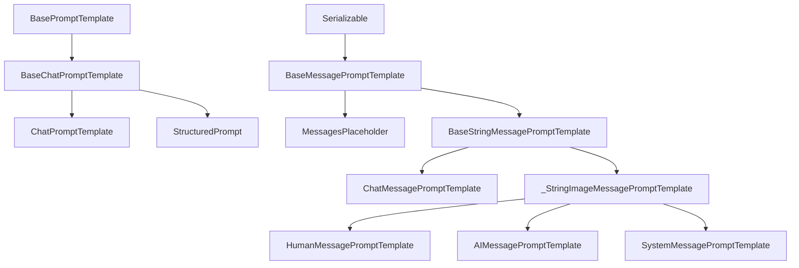
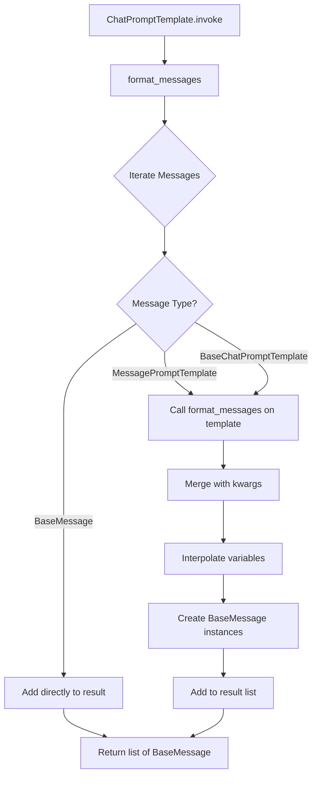
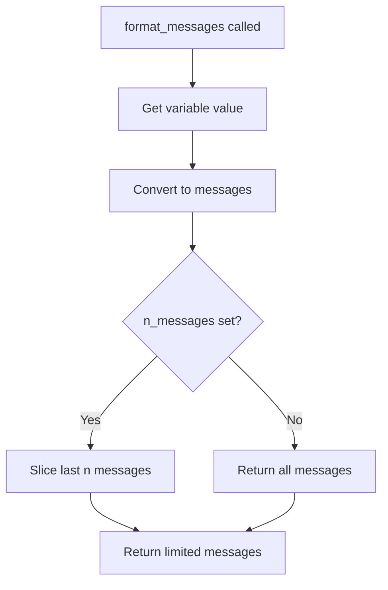
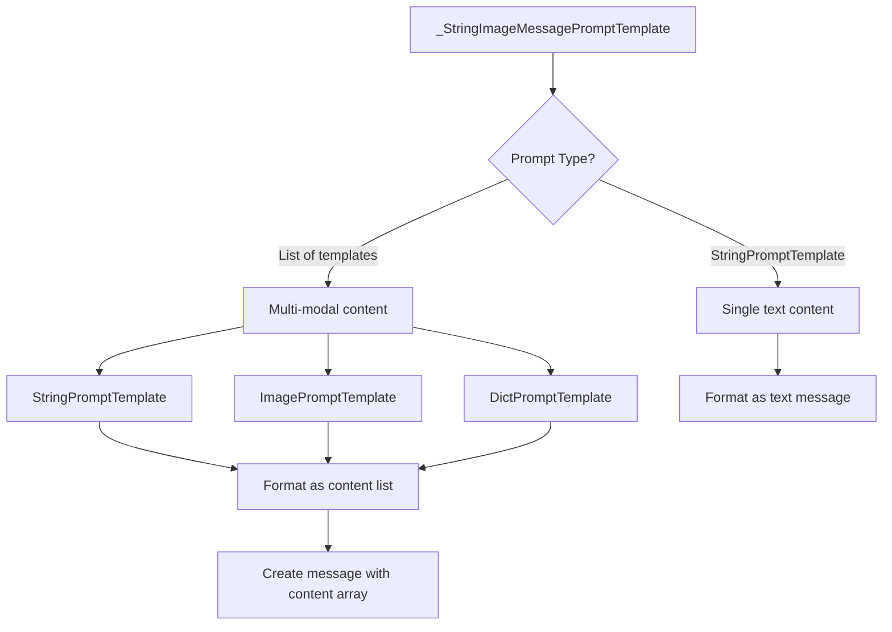
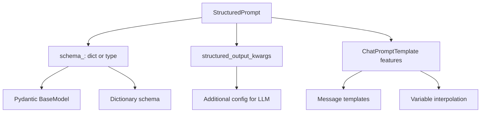
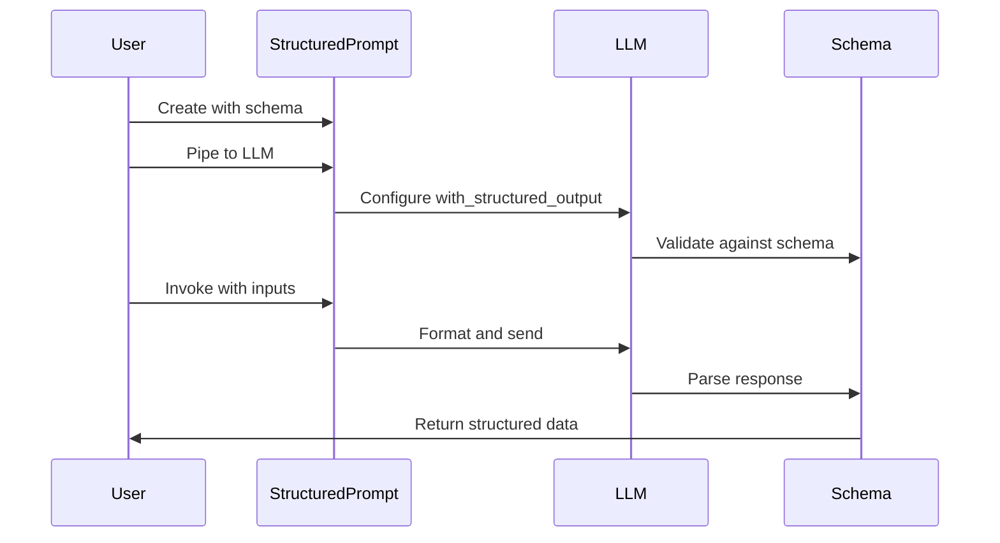
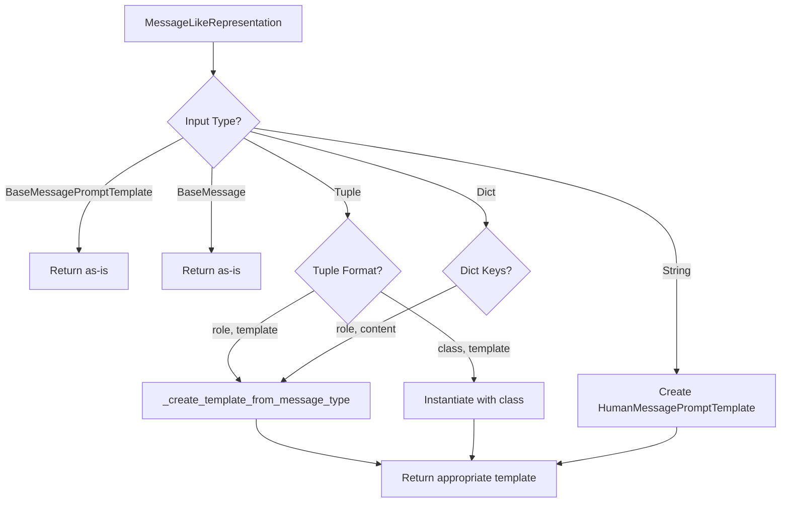

# Chat Prompt Templates & Structured Prompts

Chat Prompt Templates provide a powerful and flexible system for building conversational prompts in LangChain. These templates allow developers to create structured, reusable prompt definitions that combine multiple message types (system, human, AI), support variable interpolation, and handle complex multi-modal content including text and images. The system is designed to work seamlessly with chat-based language models, providing type-safe message construction and dynamic content injection.

The prompt template system consists of several key components: `ChatPromptTemplate` as the primary orchestrator, various message-specific templates (`HumanMessagePromptTemplate`, `AIMessagePromptTemplate`, `SystemMessagePromptTemplate`), `MessagesPlaceholder` for dynamic message insertion, and `StructuredPrompt` for enforcing structured outputs. These components work together to enable everything from simple single-message prompts to complex multi-turn conversations with chat history management.

## Core Architecture

### Class Hierarchy

The chat prompt template system is built on a hierarchical class structure that provides abstraction and specialization for different message types and use cases.



Sources: [chat.py:1-1500](../../../libs/core/langchain_core/prompts/chat.py#L1-L1500), [message.py:1-90](../../../libs/core/langchain_core/prompts/message.py#L1-L90), [structured.py:1-150](../../../libs/core/langchain_core/prompts/structured.py#L1-L150)

### Key Components

| Component | Purpose | Base Class |
|-----------|---------|------------|
| `ChatPromptTemplate` | Main template for composing multi-message prompts | `BaseChatPromptTemplate` |
| `MessagesPlaceholder` | Placeholder for dynamic message lists | `BaseMessagePromptTemplate` |
| `HumanMessagePromptTemplate` | Template for human/user messages | `_StringImageMessagePromptTemplate` |
| `AIMessagePromptTemplate` | Template for AI/assistant messages | `_StringImageMessagePromptTemplate` |
| `SystemMessagePromptTemplate` | Template for system messages | `_StringImageMessagePromptTemplate` |
| `ChatMessagePromptTemplate` | Template for custom role messages | `BaseStringMessagePromptTemplate` |
| `StructuredPrompt` | Template with enforced structured output schema | `ChatPromptTemplate` |

Sources: [chat.py:53-90](../../../libs/core/langchain_core/prompts/chat.py#L53-L90), [chat.py:423-465](../../../libs/core/langchain_core/prompts/chat.py#L423-L465), [chat.py:777-950](../../../libs/core/langchain_core/prompts/chat.py#L777-L950), [structured.py:23-50](../../../libs/core/langchain_core/prompts/structured.py#L23-L50)

## ChatPromptTemplate

`ChatPromptTemplate` is the primary class for creating conversational prompts. It manages a sequence of messages and handles variable interpolation across all message templates.

### Initialization and Message Formats

The template accepts messages in multiple formats for flexibility:

1. `BaseMessagePromptTemplate` - Direct template objects
2. `BaseMessage` - Concrete message instances
3. 2-tuple of `(message_type, template)` - e.g., `('human', '{user_input}')`
4. 2-tuple of `(message_class, template)` - Using message class types
5. String - Shorthand for `('human', template)`
6. Dictionary with `'role'` and `'content'` keys

```python
def __init__(
    self,
    messages: Sequence[MessageLikeRepresentation],
    *,
    template_format: PromptTemplateFormat = "f-string",
    **kwargs: Any,
) -> None:
    """Create a chat prompt template from a variety of message formats."""
    messages_ = [
        _convert_to_message_template(message, template_format)
        for message in messages
    ]
    
    # Automatically infer input variables from messages
    input_vars: set[str] = set()
    optional_variables: set[str] = set()
    partial_vars: dict[str, Any] = {}
    for message in messages_:
        if isinstance(message, MessagesPlaceholder) and message.optional:
            partial_vars[message.variable_name] = []
            optional_variables.add(message.variable_name)
        elif isinstance(
            message, (BaseChatPromptTemplate, BaseMessagePromptTemplate)
        ):
            input_vars.update(message.input_variables)
```

Sources: [chat.py:777-850](../../../libs/core/langchain_core/prompts/chat.py#L777-L850)

### Template Format Support

The system supports three template formats for variable interpolation:

| Format | Description | Example |
|--------|-------------|---------|
| `f-string` | Python f-string style (default) | `"Hello {name}"` |
| `mustache` | Mustache template syntax | `"Hello {{name}}"` |
| `jinja2` | Jinja2 template engine | `"Hello {{ name }}"` |

Sources: [chat.py:777-850](../../../libs/core/langchain_core/prompts/chat.py#L777-L850), [string.py](../../../libs/core/langchain_core/prompts/string.py)

### Message Formatting Flow



Sources: [chat.py:1097-1120](../../../libs/core/langchain_core/prompts/chat.py#L1097-L1120)

### Creating Templates

The `from_messages` class method provides a convenient way to create templates:

```python
@classmethod
def from_messages(
    cls,
    messages: Sequence[MessageLikeRepresentation],
    template_format: PromptTemplateFormat = "f-string",
) -> ChatPromptTemplate:
    """Create a chat prompt template from a variety of message formats."""
    return cls(messages, template_format=template_format)
```

Sources: [chat.py:1020-1050](../../../libs/core/langchain_core/prompts/chat.py#L1020-L1050)

### Template Composition

Templates support composition through the `+` operator, allowing developers to combine multiple templates:

```python
def __add__(self, other: Any) -> ChatPromptTemplate:
    """Combine two prompt templates."""
    partials = {**self.partial_variables}
    
    if hasattr(other, "partial_variables") and other.partial_variables:
        partials.update(other.partial_variables)
    
    # Allow for easy combining
    if isinstance(other, ChatPromptTemplate):
        return ChatPromptTemplate(messages=self.messages + other.messages).partial(
            **partials
        )
    if isinstance(
        other, (BaseMessagePromptTemplate, BaseMessage, BaseChatPromptTemplate)
    ):
        return ChatPromptTemplate(messages=[*self.messages, other]).partial(
            **partials
        )
```

Sources: [chat.py:877-910](../../../libs/core/langchain_core/prompts/chat.py#L877-L910)

## MessagesPlaceholder

`MessagesPlaceholder` is a specialized template component that allows dynamic insertion of message lists into a prompt template. This is particularly useful for chat history management.

### Core Features

| Feature | Description | Default |
|---------|-------------|---------|
| `variable_name` | Name of the variable containing messages | Required |
| `optional` | Whether the variable must be provided | `False` |
| `n_messages` | Maximum number of messages to include | `None` (all) |

Sources: [chat.py:53-90](../../../libs/core/langchain_core/prompts/chat.py#L53-L90)

### Usage Pattern

```python
class MessagesPlaceholder(BaseMessagePromptTemplate):
    """Prompt template that assumes variable is already list of messages."""
    
    variable_name: str
    optional: bool = False
    n_messages: PositiveInt | None = None
    
    def format_messages(self, **kwargs: Any) -> list[BaseMessage]:
        """Format messages from kwargs."""
        value = (
            kwargs.get(self.variable_name, [])
            if self.optional
            else kwargs[self.variable_name]
        )
        if not isinstance(value, list):
            msg = (
                f"variable {self.variable_name} should be a list of base messages, "
                f"got {value} of type {type(value)}"
            )
            raise ValueError(msg)
        value = convert_to_messages(value)
        if self.n_messages:
            value = value[-self.n_messages :]
        return value
```

Sources: [chat.py:53-136](../../../libs/core/langchain_core/prompts/chat.py#L53-L136)

### Message Limiting

The `n_messages` parameter provides automatic message history truncation:



Sources: [chat.py:117-136](../../../libs/core/langchain_core/prompts/chat.py#L117-L136)

## Message-Specific Templates

### String and Image Message Templates

The `_StringImageMessagePromptTemplate` class provides the foundation for human, AI, and system message templates, supporting both text and multi-modal content.



Sources: [chat.py:423-465](../../../libs/core/langchain_core/prompts/chat.py#L423-L465)

### Template Creation from Various Formats

The `from_template` class method handles multiple input formats:

```python
@classmethod
def from_template(
    cls: type[Self],
    template: str
    | list[str | _TextTemplateParam | _ImageTemplateParam | dict[str, Any]],
    template_format: PromptTemplateFormat = "f-string",
    *,
    partial_variables: dict[str, Any] | None = None,
    **kwargs: Any,
) -> Self:
    """Create a class from a string template."""
    if isinstance(template, str):
        prompt: StringPromptTemplate | list = PromptTemplate.from_template(
            template,
            template_format=template_format,
            partial_variables=partial_variables,
        )
        return cls(prompt=prompt, **kwargs)
```

Sources: [chat.py:468-530](../../../libs/core/langchain_core/prompts/chat.py#L468-L530)

### Multi-Modal Content Support

Templates support mixing text and images in a single message:

| Content Type | Template Structure | Result Type |
|--------------|-------------------|-------------|
| Text | `{"text": "Hello {name}"}` or string | `{"type": "text", "text": "..."}` |
| Image URL | `{"image_url": "https://.../{id}.png"}` | `{"type": "image_url", "image_url": {...}}` |
| Image with detail | `{"image_url": {"url": "...", "detail": "high"}}` | `{"type": "image_url", "image_url": {...}}` |
| Dictionary | `{"custom_key": "value"}` | Pass-through dictionary |

Sources: [chat.py:531-610](../../../libs/core/langchain_core/prompts/chat.py#L531-L610)

### Message Formatting Implementation

```python
def format(self, **kwargs: Any) -> BaseMessage:
    """Format the prompt template."""
    if isinstance(self.prompt, StringPromptTemplate):
        text = self.prompt.format(**kwargs)
        return self._msg_class(
            content=text, additional_kwargs=self.additional_kwargs
        )
    content: list = []
    for prompt in self.prompt:
        inputs = {var: kwargs[var] for var in prompt.input_variables}
        if isinstance(prompt, StringPromptTemplate):
            formatted_text: str = prompt.format(**inputs)
            if formatted_text != "":
                content.append({"type": "text", "text": formatted_text})
        elif isinstance(prompt, ImagePromptTemplate):
            formatted_image: ImageURL = prompt.format(**inputs)
            content.append({"type": "image_url", "image_url": formatted_image})
        elif isinstance(prompt, DictPromptTemplate):
            formatted_dict: dict[str, Any] = prompt.format(**inputs)
            content.append(formatted_dict)
    return self._msg_class(
        content=content, additional_kwargs=self.additional_kwargs
    )
```

Sources: [chat.py:625-665](../../../libs/core/langchain_core/prompts/chat.py#L625-L665)

## Structured Prompts

`StructuredPrompt` extends `ChatPromptTemplate` to enforce structured output schemas, automatically configuring language models to return data in a specific format.

### Architecture



Sources: [structured.py:23-80](../../../libs/core/langchain_core/prompts/structured.py#L23-L80)

### Initialization

```python
def __init__(
    self,
    messages: Sequence[MessageLikeRepresentation],
    schema_: dict | type[BaseModel] | None = None,
    *,
    structured_output_kwargs: dict[str, Any] | None = None,
    template_format: PromptTemplateFormat = "f-string",
    **kwargs: Any,
) -> None:
    """Create a structured prompt template."""
    schema_ = schema_ or kwargs.pop("schema", None)
    if not schema_:
        err_msg = (
            "Must pass in a non-empty structured output schema. Received: "
            f"{schema_}"
        )
        raise ValueError(err_msg)
    structured_output_kwargs = structured_output_kwargs or {}
    for k in set(kwargs).difference(get_pydantic_field_names(self.__class__)):
        structured_output_kwargs[k] = kwargs.pop(k)
```

Sources: [structured.py:32-62](../../../libs/core/langchain_core/prompts/structured.py#L32-L62)

### Piping to Language Models

The `pipe` method automatically configures the language model with structured output:

```python
def pipe(
    self,
    *others: Runnable[Any, Other] | ...,
    name: str | None = None,
) -> RunnableSerializable[dict, Other]:
    """Pipe the structured prompt to a language model."""
    if (others and isinstance(others[0], BaseLanguageModel)) or hasattr(
        others[0], "with_structured_output"
    ):
        return RunnableSequence(
            self,
            others[0].with_structured_output(
                self.schema_, **self.structured_output_kwargs
            ),
            *others[1:],
            name=name,
        )
    msg = "Structured prompts need to be piped to a language model."
    raise NotImplementedError(msg)
```

Sources: [structured.py:122-148](../../../libs/core/langchain_core/prompts/structured.py#L122-L148)

### Usage Pattern



Sources: [structured.py:23-148](../../../libs/core/langchain_core/prompts/structured.py#L23-L148)

## Supporting Template Types

### ImagePromptTemplate

Handles image content in multi-modal messages with URL and detail specifications:

```python
class ImagePromptTemplate(BasePromptTemplate[ImageURL]):
    """Image prompt template for a multimodal model."""
    
    template: dict = Field(default_factory=dict)
    template_format: PromptTemplateFormat = "f-string"
    
    def format(self, **kwargs: Any) -> ImageURL:
        """Format the prompt with the inputs."""
        formatted = {}
        for k, v in self.template.items():
            if isinstance(v, str):
                formatted[k] = DEFAULT_FORMATTER_MAPPING[self.template_format](
                    v, **kwargs
                )
            else:
                formatted[k] = v
        url = kwargs.get("url") or formatted.get("url")
        # ... validation and output construction
        output: ImageURL = {"url": url}
        if detail:
            output["detail"] = cast("Literal['auto', 'low', 'high']", detail)
        return output
```

Sources: [image.py:13-120](../../../libs/core/langchain_core/prompts/image.py#L13-L120)

### DictPromptTemplate

Processes dictionary structures with variable interpolation in values:

```python
class DictPromptTemplate(RunnableSerializable[dict, dict]):
    """Template represented by a dictionary.
    
    Recognizes variables in f-string or mustache formatted string dict values.
    Does NOT recognize variables in dict keys. Applies recursively.
    """
    
    template: dict[str, Any]
    template_format: Literal["f-string", "mustache"]
    
    def format(self, **kwargs: Any) -> dict[str, Any]:
        """Format the prompt with the inputs."""
        return _insert_input_variables(self.template, kwargs, self.template_format)
```

Sources: [dict.py:15-80](../../../libs/core/langchain_core/prompts/dict.py#L15-L80)

### Recursive Variable Extraction

The dictionary template recursively processes nested structures:

```python
def _get_input_variables(
    template: dict, template_format: Literal["f-string", "mustache"]
) -> list[str]:
    input_variables = []
    for v in template.values():
        if isinstance(v, str):
            input_variables += get_template_variables(v, template_format)
        elif isinstance(v, dict):
            input_variables += _get_input_variables(v, template_format)
        elif isinstance(v, (list, tuple)):
            for x in v:
                if isinstance(x, str):
                    input_variables += get_template_variables(x, template_format)
                elif isinstance(x, dict):
                    input_variables += _get_input_variables(x, template_format)
    return list(set(input_variables))
```

Sources: [dict.py:115-135](../../../libs/core/langchain_core/prompts/dict.py#L115-135)

## Template Validation and Variable Management

### Input Variable Inference

The system automatically infers input variables from message templates:

```python
@model_validator(mode="before")
@classmethod
def validate_input_variables(cls, values: dict) -> Any:
    """Validate input variables."""
    messages = values["messages"]
    input_vars: set = set()
    optional_variables = set()
    input_types: dict[str, Any] = values.get("input_types", {})
    for message in messages:
        if isinstance(message, (BaseMessagePromptTemplate, BaseChatPromptTemplate)):
            input_vars.update(message.input_variables)
        if isinstance(message, MessagesPlaceholder):
            if "partial_variables" not in values:
                values["partial_variables"] = {}
            if (
                message.optional
                and message.variable_name not in values["partial_variables"]
            ):
                values["partial_variables"][message.variable_name] = []
                optional_variables.add(message.variable_name)
            if message.variable_name not in input_types:
                input_types[message.variable_name] = list[AnyMessage]
```

Sources: [chat.py:912-970](../../../libs/core/langchain_core/prompts/chat.py#L912-L970)

### Partial Variable Application

Templates support partial application of variables:

```python
def partial(self, **kwargs: Any) -> ChatPromptTemplate:
    """Get a new `ChatPromptTemplate` with some input variables already filled in."""
    prompt_dict = self.__dict__.copy()
    prompt_dict["input_variables"] = list(
        set(self.input_variables).difference(kwargs)
    )
    prompt_dict["partial_variables"] = {**self.partial_variables, **kwargs}
    return type(self)(**prompt_dict)
```

Sources: [chat.py:1147-1170](../../../libs/core/langchain_core/prompts/chat.py#L1147-L1170)

## Message Conversion and Type Handling

### Conversion Flow



Sources: [chat.py:1270-1350](../../../libs/core/langchain_core/prompts/chat.py#L1270-L1350)

### Message Type Mapping

```python
def _create_template_from_message_type(
    message_type: str,
    template: str | list,
    template_format: PromptTemplateFormat = "f-string",
) -> BaseMessagePromptTemplate:
    """Create a message prompt template from a message type and template string."""
    if message_type in {"human", "user"}:
        message: BaseMessagePromptTemplate = HumanMessagePromptTemplate.from_template(
            template, template_format=template_format
        )
    elif message_type in {"ai", "assistant"}:
        message = AIMessagePromptTemplate.from_template(
            cast("str", template), template_format=template_format
        )
    elif message_type == "system":
        message = SystemMessagePromptTemplate.from_template(
            cast("str", template), template_format=template_format
        )
    elif message_type == "placeholder":
        # ... placeholder handling logic
```

Sources: [chat.py:1202-1268](../../../libs/core/langchain_core/prompts/chat.py#L1202-L1268)

## Summary

The Chat Prompt Templates system in LangChain provides a comprehensive framework for building conversational AI applications. Through `ChatPromptTemplate`, developers can compose multi-message prompts with automatic variable interpolation and type-safe message construction. The `MessagesPlaceholder` component enables dynamic chat history management with optional message limiting, while specialized message templates (`HumanMessagePromptTemplate`, `AIMessagePromptTemplate`, `SystemMessagePromptTemplate`) support both simple text and complex multi-modal content including images.

The `StructuredPrompt` extension adds schema enforcement capabilities, automatically configuring language models to return data in specified formats. Supporting components like `ImagePromptTemplate` and `DictPromptTemplate` handle specialized content types, with recursive processing for nested structures. The entire system emphasizes flexibility through multiple input formats, automatic variable inference, partial variable application, and composability through operator overloading, making it suitable for applications ranging from simple single-turn interactions to complex multi-turn conversations with structured outputs.

Sources: [chat.py](../../../libs/core/langchain_core/prompts/chat.py), [structured.py](../../../libs/core/langchain_core/prompts/structured.py), [message.py](../../../libs/core/langchain_core/prompts/message.py), [image.py](../../../libs/core/langchain_core/prompts/image.py), [dict.py](../../../libs/core/langchain_core/prompts/dict.py)