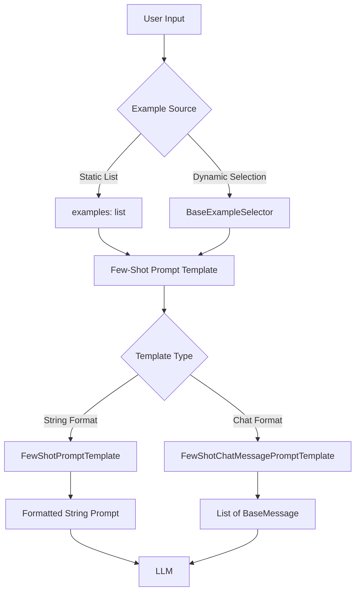
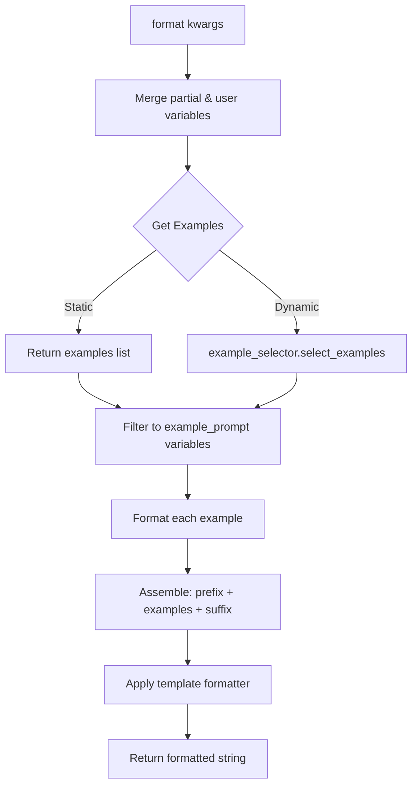
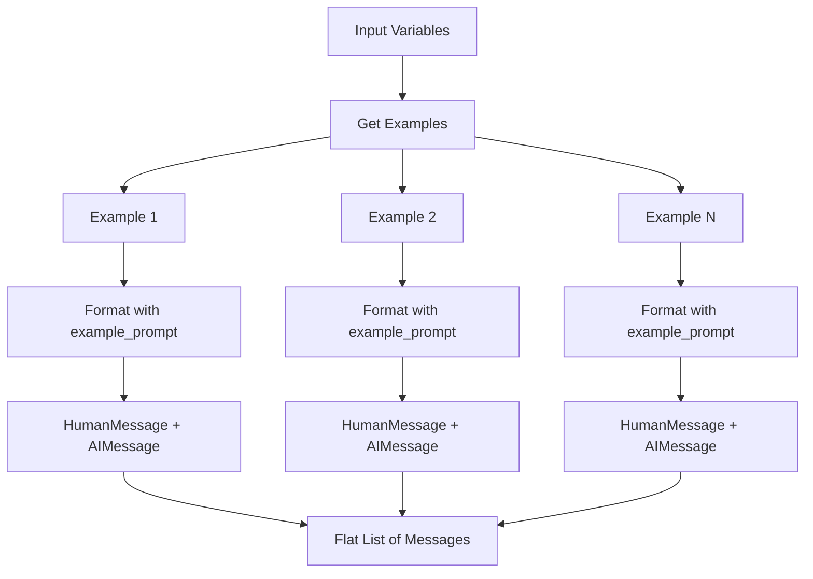
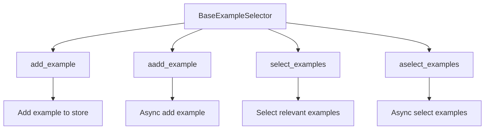
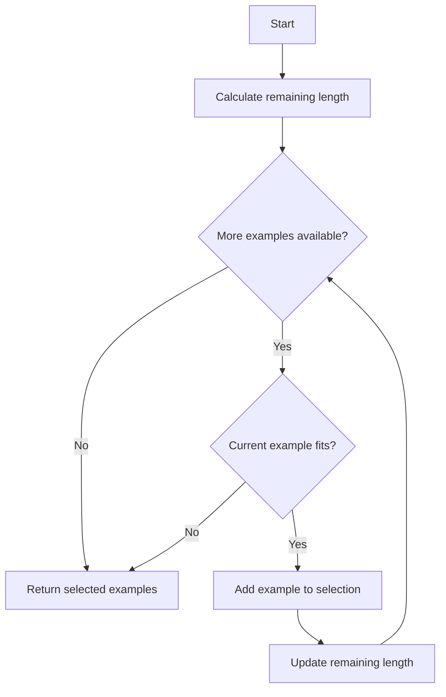
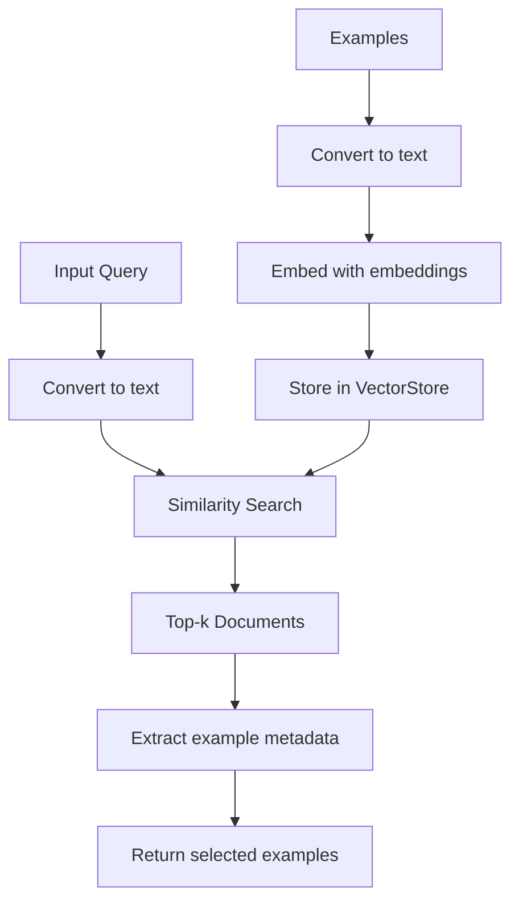
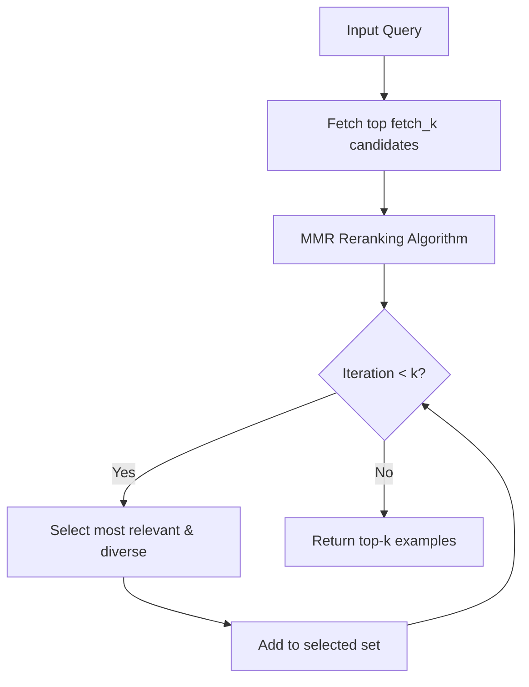

# Few-Shot Prompts & Example Selectors

## Introduction

Few-shot prompting is a powerful technique in LangChain that enables language models to learn from examples provided directly in the prompt. The framework provides specialized prompt templates and example selectors that allow developers to include relevant examples dynamically or statically within prompts, improving model performance on specific tasks without fine-tuning. The system consists of two main components: **Few-Shot Prompt Templates** that structure how examples are formatted and integrated into prompts, and **Example Selectors** that intelligently choose which examples to include based on various criteria such as semantic similarity, length constraints, or maximum marginal relevance.

This architecture supports both traditional string-based prompts and modern chat-based message formats, enabling flexible integration across different LLM interfaces. The framework provides both synchronous and asynchronous operations throughout, ensuring compatibility with modern async Python applications.

Sources: [few_shot.py:1-10](../../../libs/core/langchain_core/prompts/few_shot.py#L1-L10), [base.py:1-10](../../../libs/core/langchain_core/example_selectors/base.py#L1-L10)

## Architecture Overview

The few-shot prompting system is built on a modular architecture with clear separation between prompt formatting and example selection logic:



The architecture separates concerns between example management (selection/storage) and prompt construction (formatting/assembly), allowing each component to be independently configured and extended.

Sources: [few_shot.py:23-85](../../../libs/core/langchain_core/prompts/few_shot.py#L23-L85), [base.py:8-47](../../../libs/core/langchain_core/example_selectors/base.py#L8-L47)

## Core Components

### Base Mixin: _FewShotPromptTemplateMixin

The `_FewShotPromptTemplateMixin` provides the foundational logic shared across all few-shot prompt templates. It enforces that exactly one of `examples` or `example_selector` must be provided, preventing configuration errors.

| Property | Type | Description |
|----------|------|-------------|
| `examples` | `list[dict] \| None` | Static list of example dictionaries to include in the prompt |
| `example_selector` | `BaseExampleSelector \| None` | Dynamic selector that chooses examples based on input variables |

The mixin implements validation logic to ensure proper configuration:

```python
@model_validator(mode="before")
@classmethod
def check_examples_and_selector(cls, values: dict) -> Any:
    """Check that one and only one of `examples`/`example_selector` are provided."""
    examples = values.get("examples")
    example_selector = values.get("example_selector")
    if examples and example_selector:
        msg = "Only one of 'examples' and 'example_selector' should be provided"
        raise ValueError(msg)

    if examples is None and example_selector is None:
        msg = "One of 'examples' and 'example_selector' should be provided"
        raise ValueError(msg)

    return values
```

Sources: [few_shot.py:23-85](../../../libs/core/langchain_core/prompts/few_shot.py#L23-L85), [few_shot.py:44-66](../../../libs/core/langchain_core/prompts/few_shot.py#L44-L66)

### FewShotPromptTemplate

The `FewShotPromptTemplate` class handles string-based few-shot prompts, assembling a final prompt from prefix, examples, and suffix components.

#### Key Configuration Parameters

| Parameter | Type | Default | Description |
|-----------|------|---------|-------------|
| `example_prompt` | `PromptTemplate` | Required | Template for formatting individual examples |
| `suffix` | `str` | Required | Template string placed after examples |
| `prefix` | `str` | `""` | Template string placed before examples |
| `example_separator` | `str` | `"\n\n"` | String used to join prompt sections |
| `template_format` | `Literal["f-string", "jinja2"]` | `"f-string"` | Format style for templates |
| `validate_template` | `bool` | `False` | Whether to validate template consistency |

#### Formatting Flow



The formatting process involves several steps executed in sequence:

1. **Variable Merging**: Combines partial variables with user-provided inputs
2. **Example Retrieval**: Gets examples from static list or dynamic selector
3. **Example Filtering**: Extracts only the variables needed by `example_prompt`
4. **Example Formatting**: Formats each example using `example_prompt`
5. **Assembly**: Joins prefix, formatted examples, and suffix with separators
6. **Final Formatting**: Applies the template formatter to inject remaining variables

Sources: [few_shot.py:87-190](../../../libs/core/langchain_core/prompts/few_shot.py#L87-L190), [few_shot.py:149-172](../../../libs/core/langchain_core/prompts/few_shot.py#L149-L172)

### FewShotChatMessagePromptTemplate

The `FewShotChatMessagePromptTemplate` extends few-shot prompting to chat-based message formats, producing lists of `BaseMessage` objects instead of strings.

#### Message Structure

Chat-based few-shot prompts create conversational structures with alternating roles:



Each example is formatted using the `example_prompt` (which can be a `BaseMessagePromptTemplate` or `BaseChatPromptTemplate`), producing one or more messages per example. These are then flattened into a single list.

#### Example Usage Pattern

The class documentation provides a comprehensive example of creating a math Q&A prompt:

```python
examples = [
    {"input": "2+2", "output": "4"},
    {"input": "2+3", "output": "5"},
]

example_prompt = ChatPromptTemplate.from_messages(
    [
        ("human", "What is {input}?"),
        ("ai", "{output}"),
    ]
)

few_shot_prompt = FewShotChatMessagePromptTemplate(
    examples=examples,
    example_prompt=example_prompt,
)

final_prompt = ChatPromptTemplate.from_messages(
    [
        ("system", "You are a helpful AI Assistant"),
        few_shot_prompt,
        ("human", "{input}"),
    ]
)
```

Sources: [few_shot.py:192-352](../../../libs/core/langchain_core/prompts/few_shot.py#L192-L352), [few_shot.py:210-268](../../../libs/core/langchain_core/prompts/few_shot.py#L210-L268)

### FewShotPromptWithTemplates

The `FewShotPromptWithTemplates` class is an alternative implementation where prefix and suffix are themselves `StringPromptTemplate` objects rather than plain strings, providing additional flexibility.

| Parameter | Type | Description |
|-----------|------|-------------|
| `prefix` | `StringPromptTemplate \| None` | Template object for prefix section |
| `suffix` | `StringPromptTemplate` | Template object for suffix section (required) |
| `example_prompt` | `PromptTemplate` | Template for individual examples |
| `example_separator` | `str` | Separator between sections |

The key difference in formatting is that prefix and suffix are formatted with their own subset of input variables, extracted based on their `input_variables` attributes:

```python
# Create the overall prefix.
if self.prefix is None:
    prefix = ""
else:
    prefix_kwargs = {
        k: v for k, v in kwargs.items() if k in self.prefix.input_variables
    }
    for k in prefix_kwargs:
        kwargs.pop(k)
    prefix = self.prefix.format(**prefix_kwargs)
```

Sources: [few_shot_with_templates.py:1-175](../../../libs/core/langchain_core/prompts/few_shot_with_templates.py#L1-L175), [few_shot_with_templates.py:87-106](../../../libs/core/langchain_core/prompts/few_shot_with_templates.py#L87-L106)

## Example Selectors

Example selectors implement the `BaseExampleSelector` interface to dynamically choose which examples to include in prompts based on input variables.

### BaseExampleSelector Interface

The abstract base class defines the contract all example selectors must implement:



| Method | Signature | Description |
|--------|-----------|-------------|
| `add_example` | `(example: dict[str, str]) -> Any` | Add new example to internal storage |
| `aadd_example` | `async (example: dict[str, str]) -> Any` | Async version of add_example |
| `select_examples` | `(input_variables: dict[str, str]) -> list[dict]` | Select examples based on input |
| `aselect_examples` | `async (input_variables: dict[str, str]) -> list[dict]` | Async version of select_examples |

The base class provides default async implementations that delegate to synchronous methods using `run_in_executor`:

```python
async def aadd_example(self, example: dict[str, str]) -> Any:
    """Async add new example to store."""
    return await run_in_executor(None, self.add_example, example)
```

Sources: [base.py:8-47](../../../libs/core/langchain_core/example_selectors/base.py#L8-L47), [base.py:22-31](../../../libs/core/langchain_core/example_selectors/base.py#L22-L31)

### LengthBasedExampleSelector

The `LengthBasedExampleSelector` chooses examples based on length constraints, ensuring the total prompt doesn't exceed a maximum length.

#### Configuration

| Parameter | Type | Default | Description |
|-----------|------|---------|-------------|
| `examples` | `list[dict]` | Required | List of available examples |
| `example_prompt` | `PromptTemplate` | Required | Template for formatting examples |
| `max_length` | `int` | `2048` | Maximum total prompt length |
| `get_text_length` | `Callable[[str], int]` | `_get_length_based` | Function to measure text length |
| `example_text_lengths` | `list[int]` | `[]` | Cached lengths of formatted examples |

#### Selection Algorithm

The selector uses a greedy algorithm to fit as many examples as possible within the length constraint:



The selection process:

1. Calculates initial remaining length: `max_length - length(input_variables)`
2. Iterates through examples in order
3. For each example, checks if it fits in remaining space
4. Adds example if it fits, breaks if it doesn't
5. Returns all examples that fit

```python
def select_examples(self, input_variables: dict[str, str]) -> list[dict]:
    inputs = " ".join(input_variables.values())
    remaining_length = self.max_length - self.get_text_length(inputs)
    i = 0
    examples = []
    while remaining_length > 0 and i < len(self.examples):
        new_length = remaining_length - self.example_text_lengths[i]
        if new_length < 0:
            break
        examples.append(self.examples[i])
        remaining_length = new_length
        i += 1
    return examples
```

Sources: [length_based.py:1-100](../../../libs/core/langchain_core/example_selectors/length_based.py#L1-L100), [length_based.py:71-90](../../../libs/core/langchain_core/example_selectors/length_based.py#L71-L90)

### SemanticSimilarityExampleSelector

The `SemanticSimilarityExampleSelector` uses vector similarity search to find examples most relevant to the input query.

#### Architecture



#### Configuration Parameters

| Parameter | Type | Default | Description |
|-----------|------|---------|-------------|
| `vectorstore` | `VectorStore` | Required | Vector database containing examples |
| `k` | `int` | `4` | Number of examples to select |
| `example_keys` | `list[str] \| None` | `None` | Keys to filter in returned examples |
| `input_keys` | `list[str] \| None` | `None` | Keys to use for similarity search |
| `vectorstore_kwargs` | `dict[str, Any] \| None` | `None` | Additional args for similarity search |

#### Example-to-Text Conversion

The selector converts examples to searchable text using the `sorted_values` helper function:

```python
@staticmethod
def _example_to_text(example: dict[str, str], input_keys: list[str] | None) -> str:
    if input_keys:
        return " ".join(sorted_values({key: example[key] for key in input_keys}))
    return " ".join(sorted_values(example))
```

This ensures consistent text representation by sorting dictionary keys and joining values.

#### Factory Method

The class provides a convenient factory method to create a selector from a list of examples:

```python
@classmethod
def from_examples(
    cls,
    examples: list[dict],
    embeddings: Embeddings,
    vectorstore_cls: type[VectorStore],
    k: int = 4,
    input_keys: list[str] | None = None,
    *,
    example_keys: list[str] | None = None,
    vectorstore_kwargs: dict | None = None,
    **vectorstore_cls_kwargs: Any,
) -> SemanticSimilarityExampleSelector:
```

Sources: [semantic_similarity.py:1-183](../../../libs/core/langchain_core/example_selectors/semantic_similarity.py#L1-L183), [semantic_similarity.py:82-119](../../../libs/core/langchain_core/example_selectors/semantic_similarity.py#L82-L119)

### MaxMarginalRelevanceExampleSelector

The `MaxMarginalRelevanceExampleSelector` extends semantic similarity selection with diversity optimization using Maximum Marginal Relevance (MMR).

#### MMR Algorithm

MMR balances relevance and diversity by:
1. Fetching more candidates than needed (`fetch_k`)
2. Selecting examples that are relevant to the query but diverse from already-selected examples
3. Returning the top `k` examples

| Parameter | Type | Default | Description |
|-----------|------|---------|-------------|
| `fetch_k` | `int` | `20` | Number of candidates to fetch for reranking |
| `k` | `int` | `4` | Final number of examples to return |

#### Selection Process



The selector delegates to the vectorstore's `max_marginal_relevance_search` method:

```python
def select_examples(self, input_variables: dict[str, str]) -> list[dict]:
    example_docs = self.vectorstore.max_marginal_relevance_search(
        self._example_to_text(input_variables, self.input_keys),
        k=self.k,
        fetch_k=self.fetch_k,
    )
    return self._documents_to_examples(example_docs)
```

This approach was shown to improve performance in research on few-shot learning, as noted in the class documentation referencing https://arxiv.org/pdf/2211.13892.pdf.

Sources: [semantic_similarity.py:186-322](../../../libs/core/langchain_core/example_selectors/semantic_similarity.py#L186-L322), [semantic_similarity.py:195-208](../../../libs/core/langchain_core/example_selectors/semantic_similarity.py#L195-L208)

## Async Support

All prompt templates and example selectors provide full async support through parallel method implementations:

### Async Method Pairs

| Sync Method | Async Method | Purpose |
|-------------|--------------|---------|
| `format` | `aformat` | Format prompt to string |
| `format_messages` | `aformat_messages` | Format prompt to message list |
| `add_example` | `aadd_example` | Add example to selector |
| `select_examples` | `aselect_examples` | Select examples based on input |

### Async Implementation Pattern

The async methods follow a consistent pattern of awaiting sub-operations:

```python
async def aformat(self, **kwargs: Any) -> str:
    """Async format the prompt with inputs generating a string."""
    kwargs = self._merge_partial_and_user_variables(**kwargs)
    # Get the examples to use.
    examples = await self._aget_examples(**kwargs)
    examples = [
        {k: e[k] for k in self.example_prompt.input_variables} for e in examples
    ]
    # Format the examples.
    example_strings = [
        await self.example_prompt.aformat(**example) for example in examples
    ]
    # Create the overall template.
    pieces = [self.prefix, *example_strings, self.suffix]
    template = self.example_separator.join([piece for piece in pieces if piece])

    # Format the template with the input variables.
    return DEFAULT_FORMATTER_MAPPING[self.template_format](template, **kwargs)
```

Sources: [few_shot.py:174-190](../../../libs/core/langchain_core/prompts/few_shot.py#L174-L190), [semantic_similarity.py:121-138](../../../libs/core/langchain_core/example_selectors/semantic_similarity.py#L121-L138)

## Integration with LangChain Ecosystem

### Module Organization

The few-shot prompting system is organized across the LangChain core library:

```
libs/core/langchain_core/
├── prompts/
│   ├── few_shot.py                    # Main few-shot templates
│   └── few_shot_with_templates.py     # Template-based variant
└── example_selectors/
    ├── __init__.py                     # Public API exports
    ├── base.py                         # Base interface
    ├── length_based.py                 # Length-based selector
    └── semantic_similarity.py          # Similarity-based selectors
```

### Public API Exports

The example selectors module exposes a clean public API through `__init__.py`:

```python
__all__ = (
    "BaseExampleSelector",
    "LengthBasedExampleSelector",
    "MaxMarginalRelevanceExampleSelector",
    "SemanticSimilarityExampleSelector",
    "sorted_values",
)
```

The module uses lazy imports via `__getattr__` for efficient loading:

```python
def __getattr__(attr_name: str) -> object:
    module_name = _dynamic_imports.get(attr_name)
    result = import_attr(attr_name, module_name, __spec__.parent)
    globals()[attr_name] = result
    return result
```

Sources: [__init__.py:1-37](../../../libs/core/langchain_core/example_selectors/__init__.py#L1-L37)

### Serialization Support

Few-shot prompt templates explicitly disable serialization when using example selectors:

```python
@deprecated(
    since="1.2.21",
    removal="2.0.0",
    alternative="Use `dumpd`/`dumps` from `langchain_core.load` to serialize "
    "prompts and `load`/`loads` to deserialize them.",
)
def save(self, file_path: Path | str) -> None:
    """Save the prompt template to a file."""
    if self.example_selector:
        msg = "Saving an example selector is not currently supported"
        raise ValueError(msg)
    return super().save(file_path)
```

This limitation exists because example selectors often contain complex state (like vector stores) that cannot be easily serialized.

Sources: [few_shot.py:196-210](../../../libs/core/langchain_core/prompts/few_shot.py#L196-L210), [few_shot_with_templates.py:155-168](../../../libs/core/langchain_core/prompts/few_shot_with_templates.py#L155-L168)

## Usage Patterns and Best Practices

### Static vs Dynamic Examples

**Static examples** are appropriate when:
- The example set is small and fixed
- All examples are relevant to all inputs
- No external dependencies are needed

**Dynamic selection** is preferable when:
- Large example pools exist
- Examples should be tailored to specific inputs
- Length constraints require adaptive selection
- Semantic relevance improves performance

### Template Format Selection

The framework supports multiple template formats through the `template_format` parameter:

| Format | Use Case | Features |
|--------|----------|----------|
| `f-string` | Simple variable substitution | Fast, Python-native, limited logic |
| `jinja2` | Complex templating needs | Loops, conditionals, filters |

### Input Variable Management

Few-shot templates handle input variables intelligently:

1. **Automatic Detection**: If `validate_template=False`, input variables are auto-detected from prefix and suffix
2. **Validation Mode**: If `validate_template=True`, validates that declared input variables match template usage
3. **Partial Variables**: Supports pre-filling variables via `partial_variables`

```python
@model_validator(mode="after")
def template_is_valid(self) -> Self:
    """Check that prefix, suffix, and input variables are consistent."""
    if self.validate_template:
        check_valid_template(
            self.prefix + self.suffix,
            self.template_format,
            self.input_variables + list(self.partial_variables),
        )
    elif self.template_format:
        self.input_variables = [
            var
            for var in get_template_variables(
                self.prefix + self.suffix, self.template_format
            )
            if var not in self.partial_variables
        ]
    return self
```

Sources: [few_shot.py:117-133](../../../libs/core/langchain_core/prompts/few_shot.py#L117-L133)

## Summary

The few-shot prompting system in LangChain provides a comprehensive framework for incorporating examples into prompts, supporting both static and dynamic example selection strategies. The architecture cleanly separates prompt formatting concerns from example selection logic, enabling flexible composition and extension. Key features include full async support, multiple template formats, chat and string-based outputs, and sophisticated selection algorithms including semantic similarity and maximum marginal relevance. The system integrates seamlessly with LangChain's broader ecosystem of vector stores, embeddings, and chat models, making it a powerful tool for improving LLM performance through in-context learning.

Sources: [few_shot.py](../../../libs/core/langchain_core/prompts/few_shot.py), [base.py](../../../libs/core/langchain_core/example_selectors/base.py), [semantic_similarity.py](../../../libs/core/langchain_core/example_selectors/semantic_similarity.py), [length_based.py](../../../libs/core/langchain_core/example_selectors/length_based.py), [few_shot_with_templates.py](../../../libs/core/langchain_core/prompts/few_shot_with_templates.py)