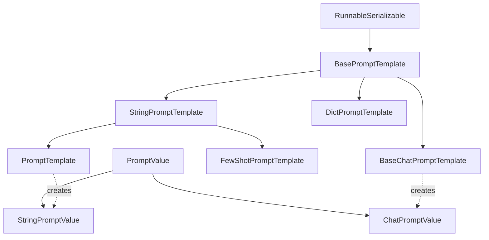
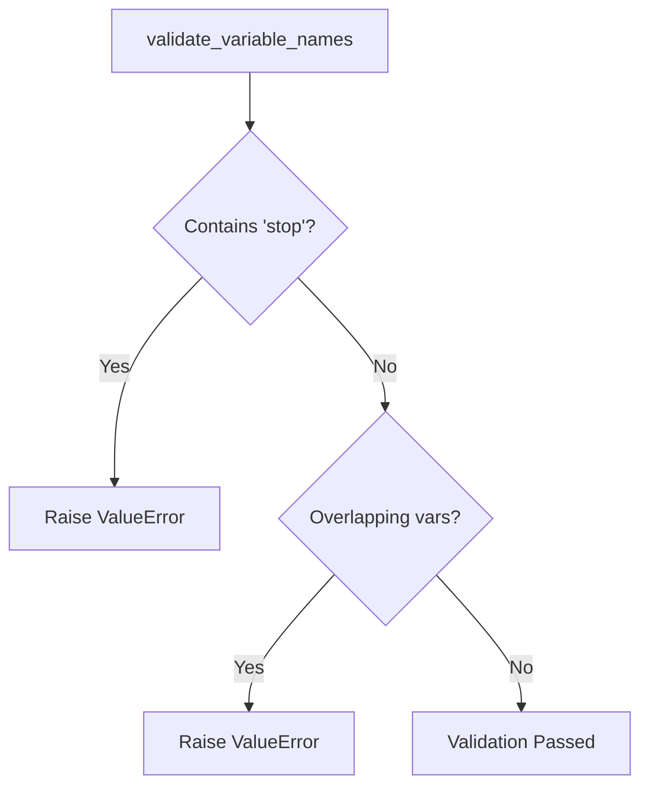
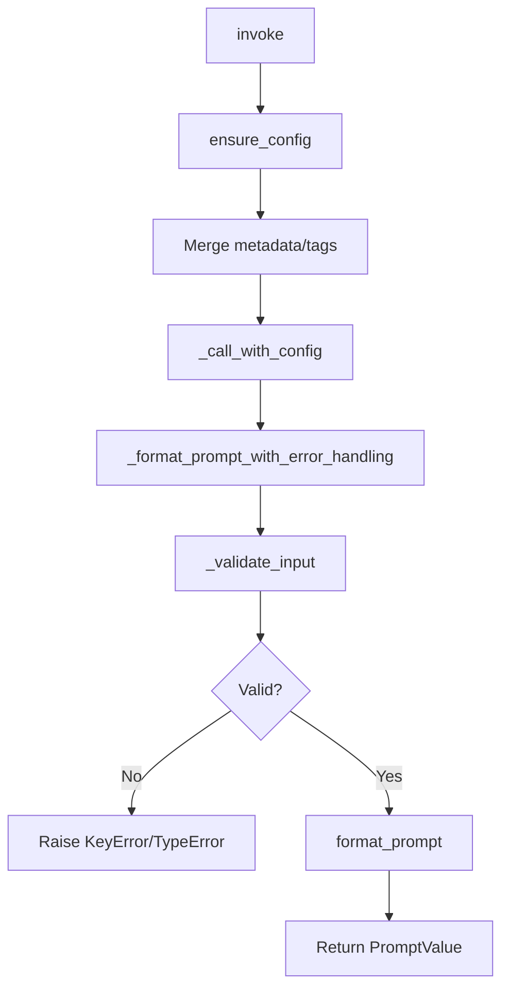
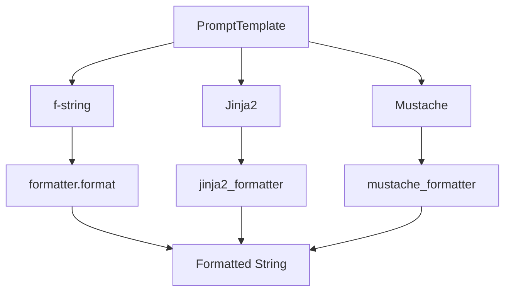
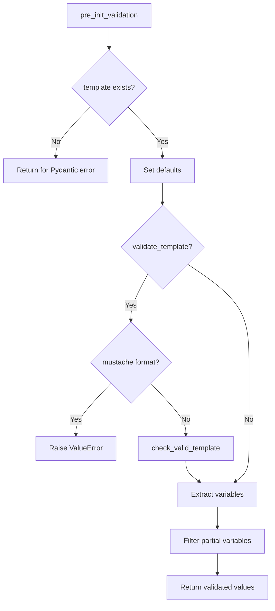
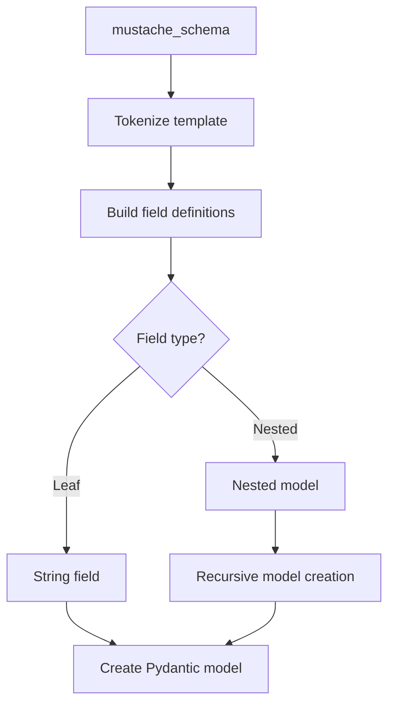
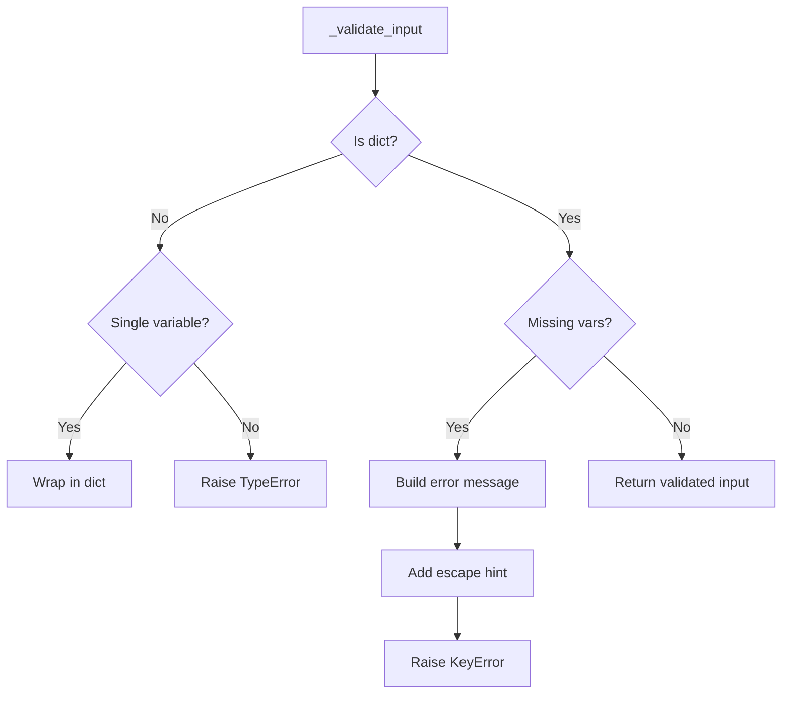

# Prompt Template Base & String Prompts

Prompt templates are the foundational components in LangChain for constructing inputs to language models. They provide a structured way to create, format, and manage prompts by combining static text with dynamic variables. The prompt template system consists of base abstract classes that define the core interface and concrete implementations for string-based prompts, supporting multiple template formats including f-strings, Jinja2, and Mustache.

This page covers the base prompt template architecture (`BasePromptTemplate`) and string-based prompt implementations (`StringPromptTemplate` and `PromptTemplate`), which handle text-generation model inputs. These components enable developers to create reusable, composable prompt structures with variable substitution, partial variables, validation, and serialization capabilities.

Sources: [prompts/__init__.py:1-10](../../../libs/core/langchain_core/prompts/__init__.py#L1-L10), [prompts/base.py:1-20](../../../libs/core/langchain_core/prompts/base.py#L1-L20)

## Architecture Overview

The prompt template system follows a hierarchical class structure with clear separation of concerns:



**Key Components:**

- **BasePromptTemplate**: Abstract base class defining the core interface for all prompt templates
- **StringPromptTemplate**: Abstract class for prompts that output strings
- **PromptTemplate**: Concrete implementation supporting f-string, Jinja2, and Mustache formats
- **PromptValue**: Abstract representation of formatted prompt output

Sources: [prompts/base.py:47-95](../../../libs/core/langchain_core/prompts/base.py#L47-L95), [prompts/string.py:309-320](../../../libs/core/langchain_core/prompts/string.py#L309-L320), [prompt_values.py:17-36](../../../libs/core/langchain_core/prompt_values.py#L17-L36)

## BasePromptTemplate

`BasePromptTemplate` is the foundational abstract class for all prompt templates in LangChain. It extends `RunnableSerializable` to integrate with LangChain's execution framework and provides the core interface for prompt construction, validation, and formatting.

### Core Attributes

| Attribute | Type | Description |
|-----------|------|-------------|
| `input_variables` | `list[str]` | Names of variables required as inputs to the prompt |
| `optional_variables` | `list[str]` | Names of optional variables (auto-inferred, not required from user) |
| `input_types` | `dict[str, Any]` | Type specifications for input variables (defaults to string) |
| `output_parser` | `BaseOutputParser \| None` | Optional parser for LLM output |
| `partial_variables` | `Mapping[str, Any]` | Variables pre-populated in the template |
| `metadata` | `dict[str, Any] \| None` | Metadata for tracing |
| `tags` | `list[str] \| None` | Tags for tracing |

Sources: [prompts/base.py:51-79](../../../libs/core/langchain_core/prompts/base.py#L51-L79)

### Variable Validation

The base template enforces strict validation rules to prevent conflicts and reserved name usage:



The validator checks:
1. **Reserved names**: The variable name `'stop'` is prohibited in both `input_variables` and `partial_variables` as it's used internally
2. **No overlaps**: Input variables and partial variables must be mutually exclusive sets

Sources: [prompts/base.py:81-106](../../../libs/core/langchain_core/prompts/base.py#L81-L106)

### Input Schema Generation

The template dynamically generates Pydantic schemas for input validation based on configured variables:

```python
def get_input_schema(self, config: RunnableConfig | None = None) -> type[BaseModel]:
    required_input_variables = {
        k: (self.input_types.get(k, str), ...) for k in self.input_variables
    }
    optional_input_variables = {
        k: (self.input_types.get(k, str), None) for k in self.optional_variables
    }
    return create_model_v2(
        "PromptInput",
        field_definitions={**required_input_variables, **optional_input_variables},
    )
```

This creates a dynamic Pydantic model where:
- Required variables use `...` (Ellipsis) to indicate they must be provided
- Optional variables default to `None`
- Types are retrieved from `input_types` or default to `str`

Sources: [prompts/base.py:122-138](../../../libs/core/langchain_core/prompts/base.py#L122-L138)

### Invocation Flow



The invocation process includes:
1. **Configuration management**: Merging template metadata and tags with runtime config
2. **Input validation**: Checking for missing variables and type correctness
3. **Error handling**: Providing detailed error messages with escape hints
4. **Tracing**: Automatic integration with LangChain's tracing system (run_type="prompt")

Sources: [prompts/base.py:140-183](../../../libs/core/langchain_core/prompts/base.py#L140-L183)

### Partial Variables

Partial variables allow pre-populating template values, creating reusable prompt variants:

```python
def partial(self, **kwargs: str | Callable[[], str]) -> BasePromptTemplate:
    prompt_dict = self.__dict__.copy()
    prompt_dict["input_variables"] = list(
        set(self.input_variables).difference(kwargs)
    )
    prompt_dict["partial_variables"] = {**self.partial_variables, **kwargs}
    return type(self)(**prompt_dict)
```

Partial variables can be:
- **Static values**: Pre-set strings
- **Callable functions**: Evaluated at format time (e.g., for timestamps)

Sources: [prompts/base.py:202-214](../../../libs/core/langchain_core/prompts/base.py#L202-L214)

## StringPromptTemplate

`StringPromptTemplate` is an abstract class that specializes `BasePromptTemplate` for string-based prompts. It provides the bridge between the base template interface and concrete string formatting implementations.

### Key Characteristics

| Feature | Description |
|---------|-------------|
| **Output Type** | Always returns `StringPromptValue` |
| **Format Method** | Abstract method requiring implementation |
| **Namespace** | `["langchain", "prompts", "base"]` |
| **Pretty Printing** | Built-in visualization support |

Sources: [prompts/string.py:309-320](../../../libs/core/langchain_core/prompts/string.py#L309-L320)

### Prompt Value Conversion

The class implements both synchronous and asynchronous prompt formatting:

```python
def format_prompt(self, **kwargs: Any) -> PromptValue:
    return StringPromptValue(text=self.format(**kwargs))

async def aformat_prompt(self, **kwargs: Any) -> PromptValue:
    return StringPromptValue(text=await self.aformat(**kwargs))
```

This wraps the formatted string in a `StringPromptValue` object, which can be converted to either:
- Plain text via `to_string()`
- Message format via `to_messages()` (creates a `HumanMessage`)

Sources: [prompts/string.py:322-337](../../../libs/core/langchain_core/prompts/string.py#L322-L337), [prompt_values.py:51-66](../../../libs/core/langchain_core/prompt_values.py#L51-L66)

### Pretty Representation

The template provides visualization capabilities for debugging and documentation:

```python
def pretty_repr(self, html: bool = False) -> str:
    dummy_vars = {
        input_var: "{" + f"{input_var}" + "}" for input_var in self.input_variables
    }
    if html:
        dummy_vars = {
            k: get_colored_text(v, "yellow") for k, v in dummy_vars.items()
        }
    return self.format(**dummy_vars)
```

This creates a formatted representation with placeholder values, optionally with HTML color coding for interactive environments.

Sources: [prompts/string.py:341-360](../../../libs/core/langchain_core/prompts/string.py#L341-L360)

## PromptTemplate

`PromptTemplate` is the primary concrete implementation of string-based prompts, supporting three template formats: f-string, Jinja2, and Mustache.

### Template Formats



| Format | Syntax Example | Use Case |
|--------|----------------|----------|
| **f-string** | `"Hello {name}"` | Default, simple variable substitution |
| **Jinja2** | `"Hello {{ name }}"` | Complex logic, filters, loops |
| **Mustache** | `"Hello {{name}}"` | Logic-less templates, nested data |

Sources: [prompts/prompt.py:17-60](../../../libs/core/langchain_core/prompts/prompt.py#L17-L60), [prompts/string.py:80-98](../../../libs/core/langchain_core/prompts/string.py#L80-L98)

### Initialization and Validation

The template uses a pre-initialization validator to ensure consistency:



The validation process:
1. Sets default values for `template_format` and `partial_variables`
2. Optionally validates template syntax (not supported for Mustache)
3. Automatically extracts input variables from the template
4. Removes partial variables from the input variable list

Sources: [prompts/prompt.py:77-111](../../../libs/core/langchain_core/prompts/prompt.py#L77-L111)

### Template Format Security

**⚠️ Security Warning for Jinja2:**

Jinja2 templates pose security risks if sourced from untrusted inputs. The framework uses `SandboxedEnvironment` as a mitigation:

```python
def jinja2_formatter(template: str, /, **kwargs: Any) -> str:
    if not _HAS_JINJA2:
        raise ImportError(...)
    return SandboxedEnvironment().from_string(template).render(**kwargs)
```

The sandbox blocks access to dunder attributes (e.g., `__class__`, `__globals__`) but still allows regular attribute access and method calls. This is a **best-effort measure**, not a security guarantee.

**Recommendation**: Always prefer f-string format unless Jinja2 features are absolutely necessary, and never accept Jinja2 templates from untrusted sources.

Sources: [prompts/string.py:34-68](../../../libs/core/langchain_core/prompts/string.py#L34-L68), [prompts/prompt.py:23-42](../../../libs/core/langchain_core/prompts/prompt.py#L23-L42)

### Factory Methods

The class provides multiple construction patterns:

#### from_template (Recommended)

```python
@classmethod
def from_template(
    cls,
    template: str,
    *,
    template_format: PromptTemplateFormat = "f-string",
    partial_variables: dict[str, Any] | None = None,
    **kwargs: Any,
) -> PromptTemplate:
    input_variables = get_template_variables(template, template_format)
    partial_variables_ = partial_variables or {}

    if partial_variables_:
        input_variables = [
            var for var in input_variables if var not in partial_variables_
        ]

    return cls(
        input_variables=input_variables,
        template=template,
        template_format=template_format,
        partial_variables=partial_variables_,
        **kwargs,
    )
```

This method automatically extracts variables from the template, eliminating manual specification.

Sources: [prompts/prompt.py:163-202](../../../libs/core/langchain_core/prompts/prompt.py#L163-L202)

#### from_file

Loads templates from external files:

```python
@classmethod
def from_file(
    cls,
    template_file: str | Path,
    encoding: str | None = None,
    **kwargs: Any,
) -> PromptTemplate:
    template = Path(template_file).read_text(encoding=encoding)
    return cls.from_template(template=template, **kwargs)
```

Useful for managing large templates or templates shared across multiple applications.

Sources: [prompts/prompt.py:143-161](../../../libs/core/langchain_core/prompts/prompt.py#L143-L161)

#### from_examples

Creates prompts from example lists:

```python
@classmethod
def from_examples(
    cls,
    examples: list[str],
    suffix: str,
    input_variables: list[str],
    example_separator: str = "\n\n",
    prefix: str = "",
    **kwargs: Any,
) -> PromptTemplate:
    template = example_separator.join([prefix, *examples, suffix])
    return cls(input_variables=input_variables, template=template, **kwargs)
```

Designed for few-shot learning scenarios where examples are provided programmatically.

Sources: [prompts/prompt.py:120-141](../../../libs/core/langchain_core/prompts/prompt.py#L120-L141)

### Template Combination

Prompt templates support concatenation via the `+` operator:

```python
def __add__(self, other: Any) -> PromptTemplate:
    if isinstance(other, PromptTemplate):
        if self.template_format != other.template_format:
            raise ValueError("Cannot add templates of different formats")
        input_variables = list(
            set(self.input_variables) | set(other.input_variables)
        )
        template = self.template + other.template
        validate_template = self.validate_template and other.validate_template
        partial_variables = dict(self.partial_variables.items())
        for k, v in other.partial_variables.items():
            if k in partial_variables:
                raise ValueError("Cannot have same variable partialed twice.")
            partial_variables[k] = v
        return PromptTemplate(...)
    elif isinstance(other, str):
        prompt = PromptTemplate.from_template(other, template_format=self.template_format)
        return self + prompt
    raise NotImplementedError(...)
```

This enables modular prompt construction by combining smaller templates.

Sources: [prompts/prompt.py:113-148](../../../libs/core/langchain_core/prompts/prompt.py#L113-L148)

## Template Variable Extraction

The system provides format-specific variable extraction mechanisms:

### F-String Variables

```python
def validate_f_string_template(template: str) -> list[str]:
    input_variables = set()
    for var, format_spec in _parse_f_string_fields(template):
        if "." in var or "[" in var or "]" in var:
            raise ValueError("Variable names cannot contain attribute access or indexing")
        if var.isdigit():
            raise ValueError("Variable names cannot be all digits")
        if format_spec and ("{" in format_spec or "}" in format_spec):
            raise ValueError("Nested replacement fields are not allowed")
        input_variables.add(var)
    return sorted(input_variables)
```

**Restrictions:**
- No attribute access (`.`) or indexing (`[]`)
- No numeric-only variable names (interpreted as positional args)
- No nested format specifiers

Sources: [prompts/string.py:163-190](../../../libs/core/langchain_core/prompts/string.py#L163-L190)

### Jinja2 Variables

```python
def _get_jinja2_variables_from_template(template: str) -> set[str]:
    if not _HAS_JINJA2:
        raise ImportError(...)
    env = SandboxedEnvironment()
    ast = env.parse(template)
    return meta.find_undeclared_variables(ast)
```

Uses Jinja2's AST parser to find undeclared variables, supporting complex template structures.

Sources: [prompts/string.py:104-113](../../../libs/core/langchain_core/prompts/string.py#L104-L113)

### Mustache Variables

```python
def mustache_template_vars(template: str) -> set[str]:
    variables: set[str] = set()
    section_depth = 0
    for type_, key in mustache.tokenize(template):
        if type_ == "end":
            section_depth -= 1
        elif (
            type_ in {"variable", "section", "inverted section", "no escape"}
            and key != "."
            and section_depth == 0
        ):
            variables.add(key.split(".")[0])
        if type_ in {"section", "inverted section"}:
            section_depth += 1
    return variables
```

Extracts only top-level variables (e.g., `person` from `{{person.name}}`), tracking section depth to handle nested structures.

Sources: [prompts/string.py:123-144](../../../libs/core/langchain_core/prompts/string.py#L123-L144)

## Mustache Schema Generation

For Mustache templates, the system generates dynamic Pydantic schemas reflecting the template structure:



The schema generation process:

1. **Tokenization**: Parse Mustache template into tokens
2. **Field tracking**: Distinguish between leaf variables and nested sections
3. **Recursive model creation**: Build nested Pydantic models for complex structures

```python
def mustache_schema(template: str) -> type[BaseModel]:
    fields = {}
    prefix: tuple[str, ...] = ()
    section_stack: list[tuple[str, ...]] = []
    for type_, key in mustache.tokenize(template):
        if key == ".":
            continue
        if type_ == "end":
            if section_stack:
                prefix = section_stack.pop()
        elif type_ in {"section", "inverted section"}:
            section_stack.append(prefix)
            prefix += tuple(key.split("."))
            fields[prefix] = False
        elif type_ in {"variable", "no escape"}:
            fields[prefix + tuple(key.split("."))] = True
    # ... field processing and model creation
    return _create_model_recursive("PromptInput", defs)
```

This enables type-safe input validation for complex Mustache templates with nested data structures.

Sources: [prompts/string.py:147-175](../../../libs/core/langchain_core/prompts/string.py#L147-L175), [prompts/string.py:178-189](../../../libs/core/langchain_core/prompts/string.py#L178-L189)

## Document Formatting

The framework provides utilities for formatting documents into strings using prompt templates:

### Synchronous Formatting

```python
def format_document(doc: Document, prompt: BasePromptTemplate[str]) -> str:
    base_info = {"page_content": doc.page_content, **doc.metadata}
    missing_metadata = set(prompt.input_variables).difference(base_info)
    if len(missing_metadata) > 0:
        required_metadata = [
            iv for iv in prompt.input_variables if iv != "page_content"
        ]
        raise ValueError(f"Document prompt requires documents to have metadata variables...")
    return prompt.format(**{k: base_info[k] for k in prompt.input_variables})
```

### Asynchronous Formatting

```python
async def aformat_document(doc: Document, prompt: BasePromptTemplate[str]) -> str:
    return await prompt.aformat(**_get_document_info(doc, prompt))
```

**Document Information Sources:**
1. `page_content`: Mapped to variable named "page_content"
2. `metadata`: Each metadata field becomes a variable with the same name

This pattern is commonly used in retrieval-augmented generation (RAG) pipelines to format retrieved documents.

Sources: [prompts/base.py:279-337](../../../libs/core/langchain_core/prompts/base.py#L279-L337)

## Serialization and Persistence

### Dictionary Representation

```python
def dict(self, **kwargs: Any) -> dict:
    prompt_dict = super().model_dump(**kwargs)
    with contextlib.suppress(NotImplementedError):
        prompt_dict["_type"] = self._prompt_type
    return prompt_dict
```

Adds a `_type` field to the serialized representation for type identification during deserialization.

Sources: [prompts/base.py:235-249](../../../libs/core/langchain_core/prompts/base.py#L235-L249)

### File Persistence (Deprecated)

The `save` method supports JSON and YAML formats but is deprecated in favor of `dumpd`/`dumps` from `langchain_core.load`:

```python
def save(self, file_path: Path | str) -> None:
    if self.partial_variables:
        raise ValueError("Cannot save prompt with partial variables.")
    
    prompt_dict = self.dict()
    if "_type" not in prompt_dict:
        raise NotImplementedError(f"Prompt {self} does not support saving.")
    
    save_path = Path(file_path)
    directory_path = save_path.parent
    directory_path.mkdir(parents=True, exist_ok=True)
    
    resolved_path = save_path.resolve()
    if resolved_path.suffix == ".json":
        with resolved_path.open("w", encoding="utf-8") as f:
            json.dump(prompt_dict, f, indent=4)
    elif resolved_path.suffix.endswith((".yaml", ".yml")):
        with resolved_path.open("w", encoding="utf-8") as f:
            yaml.dump(prompt_dict, f, default_flow_style=False)
    else:
        raise ValueError(f"{save_path} must be json or yaml")
```

**Limitations:**
- Cannot save templates with partial variables (they must be fully resolved)
- Template must implement `_prompt_type` property

Sources: [prompts/base.py:251-277](../../../libs/core/langchain_core/prompts/base.py#L251-L277)

## Error Handling and Validation

The system provides comprehensive error handling with detailed messages:

### Input Validation Errors



Error messages include:
- Expected vs. received variable lists
- Escape hints for variables intended as literal text (e.g., `{{variable}}` instead of `{variable}`)
- Error codes for programmatic handling

Sources: [prompts/base.py:140-165](../../../libs/core/langchain_core/prompts/base.py#L140-L165)

### Template Validation

```python
def check_valid_template(
    template: str, template_format: str, input_variables: list[str]
) -> None:
    try:
        validator_func = DEFAULT_VALIDATOR_MAPPING[template_format]
    except KeyError as exc:
        raise ValueError(
            f"Invalid template format {template_format!r}, should be one of"
            f" {list(DEFAULT_FORMATTER_MAPPING)}."
        ) from exc
    if template_format == "f-string":
        validate_f_string_template(template)
    try:
        validator_func(template, input_variables)
    except (KeyError, IndexError) as exc:
        raise ValueError(
            "Invalid prompt schema; check for mismatched or missing input parameters"
            f" from {input_variables}."
        ) from exc
```

Validates template syntax and variable consistency before runtime, catching errors early in development.

Sources: [prompts/string.py:193-218](../../../libs/core/langchain_core/prompts/string.py#L193-L218)

## Summary

The prompt template base and string prompt system in LangChain provides a robust, extensible foundation for constructing language model inputs. Key features include:

- **Multiple template formats**: Support for f-string, Jinja2, and Mustache with format-specific variable extraction
- **Type safety**: Dynamic Pydantic schema generation for input validation
- **Partial variables**: Reusable templates with pre-populated values
- **Composition**: Template combination via operator overloading
- **Security**: Sandboxed Jinja2 execution with clear security warnings
- **Integration**: Seamless integration with LangChain's runnable and tracing infrastructure
- **Document formatting**: Specialized utilities for RAG pipelines

The architecture balances flexibility with safety, providing developers with powerful tools for prompt engineering while maintaining type safety and validation throughout the prompt lifecycle.

Sources: [prompts/base.py](../../../libs/core/langchain_core/prompts/base.py), [prompts/string.py](../../../libs/core/langchain_core/prompts/string.py), [prompts/prompt.py](../../../libs/core/langchain_core/prompts/prompt.py), [prompt_values.py](../../../libs/core/langchain_core/prompt_values.py), [prompts/__init__.py](../../../libs/core/langchain_core/prompts/__init__.py)