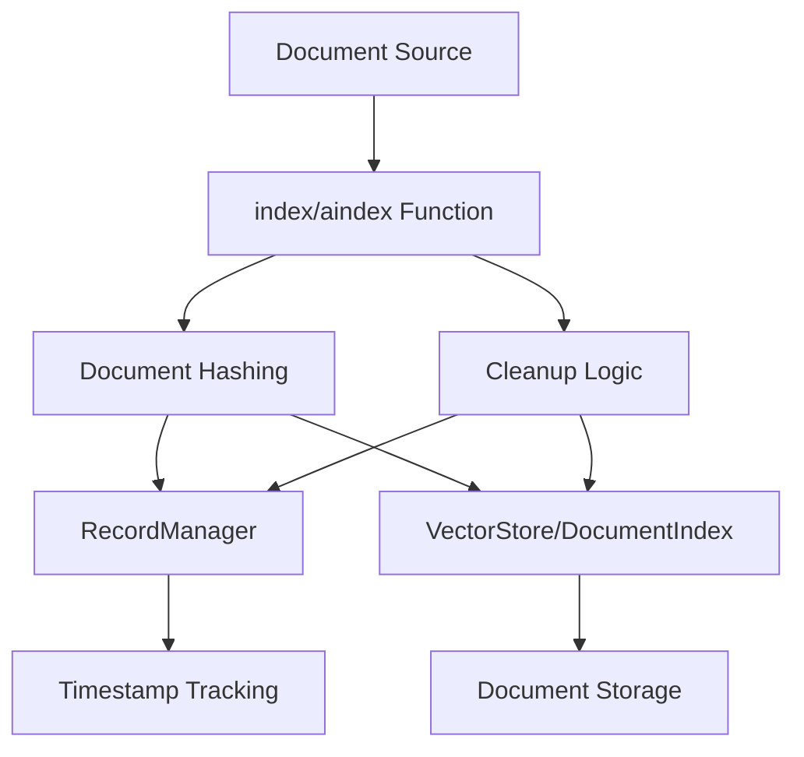
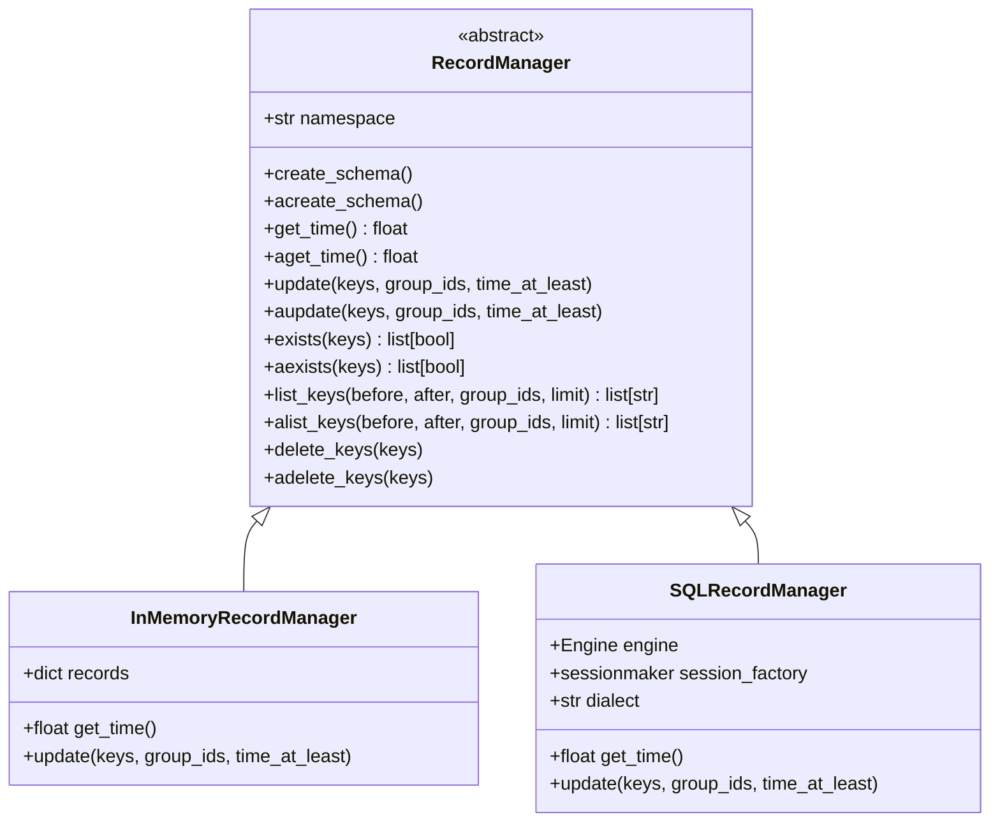
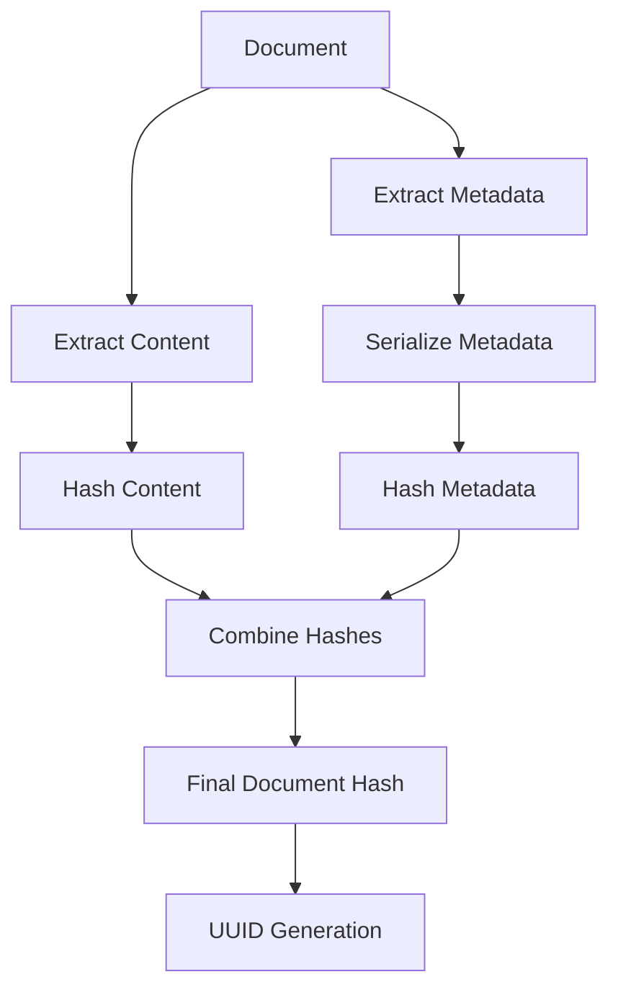
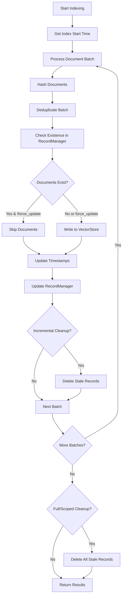
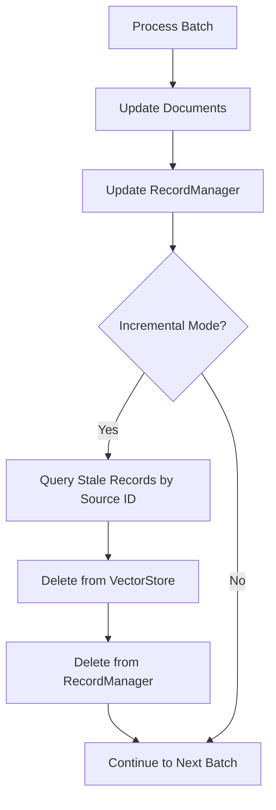
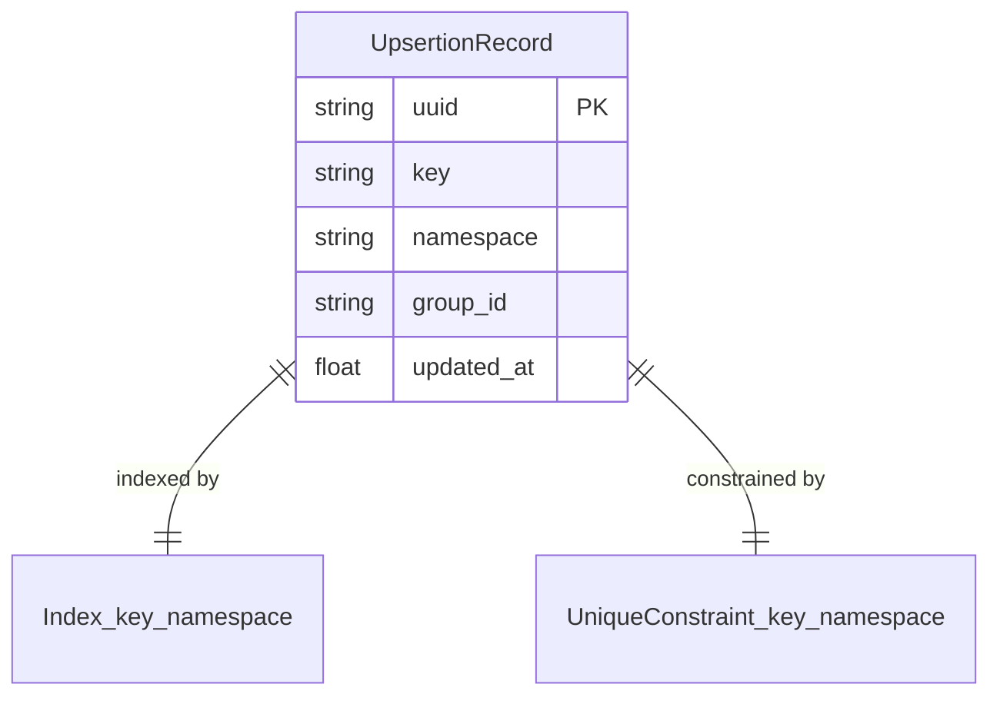
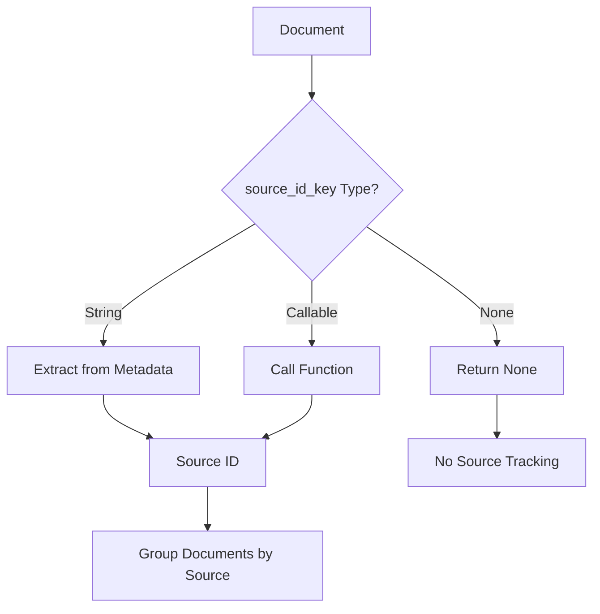
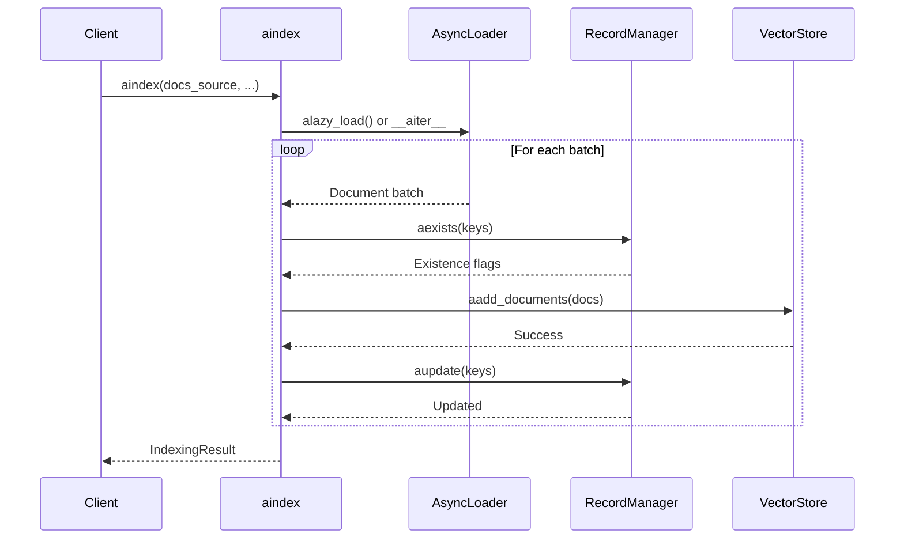

# Indexing API & Record Management

The Indexing API & Record Management system in LangChain provides a robust framework for managing document lifecycle within vector stores. This system addresses critical challenges in document indexing: avoiding duplicate content, preventing unnecessary re-indexing of unchanged documents, and maintaining synchronization between vector stores and their record management layer. The architecture consists of two primary components: the `index`/`aindex` functions that orchestrate the indexing process, and the `RecordManager` abstraction that tracks document state through timestamped records.

Sources: [libs/core/langchain_core/indexing/__init__.py:1-8](../../../libs/core/langchain_core/indexing/__init__.py#L1-L8), [libs/core/langchain_core/indexing/api.py:1-4](../../../libs/core/langchain_core/indexing/api.py#L1-L4)

## Architecture Overview

The indexing system follows a layered architecture where the indexing API functions coordinate between document sources, vector stores, and record managers to maintain data consistency.



The system operates by computing content-based hashes for documents, tracking these hashes with timestamps in the record manager, and using this metadata to make intelligent decisions about which documents need updating, skipping, or deletion.

Sources: [libs/core/langchain_core/indexing/api.py:80-118](../../../libs/core/langchain_core/indexing/api.py#L80-L118)

## Core Components

### Indexing Functions

The system provides two primary entry points for indexing operations:

| Function | Type | Description |
|----------|------|-------------|
| `index()` | Synchronous | Indexes documents from loaders or iterables into vector stores with deduplication and cleanup |
| `aindex()` | Asynchronous | Async variant of index() supporting async document sources and operations |

Both functions share the same operational logic but differ in their execution model to support both synchronous and asynchronous workflows.

Sources: [libs/core/langchain_core/indexing/api.py:271-332](../../../libs/core/langchain_core/indexing/api.py#L271-L332), [libs/core/langchain_core/indexing/api.py:617-678](../../../libs/core/langchain_core/indexing/api.py#L617-L678)

### RecordManager Abstract Base Class

The `RecordManager` serves as the persistence layer for tracking document indexing state:



The abstract base class defines the contract for tracking which documents have been indexed and when. Each record associates a document key with a timestamp and optional group ID.

Sources: [libs/core/langchain_core/indexing/base.py:18-140](../../../libs/core/langchain_core/indexing/base.py#L18-L140)

### DocumentIndex Interface

The `DocumentIndex` abstraction extends `BaseRetriever` to provide a unified interface for document storage systems:

| Method | Purpose | Return Type |
|--------|---------|-------------|
| `upsert()` | Insert or update documents by ID | `UpsertResponse` |
| `delete()` | Remove documents by ID | `DeleteResponse` |
| `get()` | Retrieve documents by ID | `list[Document]` |

This interface allows the indexing system to work with both traditional `VectorStore` implementations and newer `DocumentIndex` implementations through a common API.

Sources: [libs/core/langchain_core/indexing/base.py:298-447](../../../libs/core/langchain_core/indexing/base.py#L298-L447)

## Document Hashing & Deduplication

### Hash Generation

The system uses content-based hashing to generate unique identifiers for documents:



The hashing process supports multiple algorithms with varying security characteristics:

| Algorithm | Security Level | Use Case |
|-----------|---------------|----------|
| `sha1` | Low (deprecated) | Legacy compatibility, emits warning |
| `sha256` | High | Recommended for new applications |
| `sha512` | Very High | Maximum security requirements |
| `blake2b` | High | Performance-optimized secure hashing |

Sources: [libs/core/langchain_core/indexing/api.py:120-170](../../../libs/core/langchain_core/indexing/api.py#L120-L170), [libs/core/langchain_core/indexing/api.py:172-238](../../../libs/core/langchain_core/indexing/api.py#L172-L238)

### Deduplication Strategy

Within-batch deduplication occurs before indexing to prevent redundant storage:

```python
def _deduplicate_in_order(
    hashed_documents: Iterable[Document],
) -> Iterator[Document]:
    """Deduplicate a list of hashed documents while preserving order."""
    seen: set[str] = set()

    for hashed_doc in hashed_documents:
        if hashed_doc.id not in seen:
            seen.add(cast("str", hashed_doc.id))
            yield hashed_doc
```

This function maintains document order while removing duplicates based on their computed hash IDs, ensuring each unique document appears only once per batch.

Sources: [libs/core/langchain_core/indexing/api.py:95-105](../../../libs/core/langchain_core/indexing/api.py#L95-L105)

## Indexing Workflow

### Main Indexing Process

The indexing operation follows a multi-stage workflow:



The workflow ensures data consistency by writing to the vector store first, then updating the record manager only after successful writes.

Sources: [libs/core/langchain_core/indexing/api.py:382-538](../../../libs/core/langchain_core/indexing/api.py#L382-L538)

### Batch Processing

Documents are processed in configurable batch sizes to balance memory usage and performance:

```python
def _batch(size: int, iterable: Iterable[T]) -> Iterator[list[T]]:
    """Utility batching function."""
    it = iter(iterable)
    while True:
        chunk = list(islice(it, size))
        if not chunk:
            return
        yield chunk
```

The batching mechanism allows efficient processing of large document collections without loading everything into memory simultaneously.

Sources: [libs/core/langchain_core/indexing/api.py:80-88](../../../libs/core/langchain_core/indexing/api.py#L80-L88)

## Cleanup Modes

The indexing system supports multiple cleanup strategies to manage stale documents:

| Mode | Behavior | When to Use |
|------|----------|-------------|
| `None` | No automatic deletion | When manual control is needed |
| `incremental` | Delete stale docs by source ID during indexing | Continuous updates, minimize duplicates |
| `full` | Delete all stale docs after indexing completes | Complete dataset refresh |
| `scoped_full` | Delete stale docs only for seen source IDs | Partial dataset updates |

### Incremental Cleanup

Incremental cleanup removes outdated documents continuously during indexing:



This mode requires `source_id_key` to be specified, as it uses source IDs to identify which documents belong to the current indexing operation.

Sources: [libs/core/langchain_core/indexing/api.py:519-538](../../../libs/core/langchain_core/indexing/api.py#L519-L538)

### Full and Scoped Full Cleanup

Full cleanup modes execute after all documents are indexed:

```python
if cleanup == "full" or (
    cleanup == "scoped_full" and scoped_full_cleanup_source_ids
):
    delete_group_ids: Sequence[str] | None = None
    if cleanup == "scoped_full":
        delete_group_ids = list(scoped_full_cleanup_source_ids)
    while uids_to_delete := record_manager.list_keys(
        group_ids=delete_group_ids, before=index_start_dt, limit=cleanup_batch_size
    ):
        _delete(destination, uids_to_delete)
        record_manager.delete_keys(uids_to_delete)
        num_deleted += len(uids_to_delete)
```

The `scoped_full` mode tracks source IDs encountered during indexing and only deletes stale records matching those source IDs, providing a middle ground between incremental and full cleanup.

Sources: [libs/core/langchain_core/indexing/api.py:540-553](../../../libs/core/langchain_core/indexing/api.py#L540-L553)

## RecordManager Implementations

### InMemoryRecordManager

The in-memory implementation provides a lightweight option for testing and development:

```python
class InMemoryRecordManager(RecordManager):
    """An in-memory record manager for testing purposes."""

    def __init__(self, namespace: str) -> None:
        super().__init__(namespace)
        self.records: dict[str, _Record] = {}
        self.namespace = namespace
```

This implementation stores records in a Python dictionary with each key mapping to a record containing `group_id` and `updated_at` fields.

Sources: [libs/core/langchain_core/indexing/base.py:149-159](../../../libs/core/langchain_core/indexing/base.py#L149-L159)

### SQLRecordManager

The SQL-based implementation provides persistent storage using SQLAlchemy:



The `UpsertionRecord` table schema ensures efficient querying and prevents duplicate key-namespace pairs:

| Column | Type | Constraints | Purpose |
|--------|------|-------------|---------|
| `uuid` | String | Primary Key, Indexed | Unique record identifier |
| `key` | String | Indexed, Unique with namespace | Document hash/ID |
| `namespace` | String | Indexed, Unique with key | Logical grouping |
| `group_id` | String | Indexed, Nullable | Source document identifier |
| `updated_at` | Float | Indexed | Last update timestamp |

Sources: [libs/langchain/langchain_classic/indexes/_sql_record_manager.py:33-62](../../../libs/langchain/langchain_classic/indexes/_sql_record_manager.py#L33-L62)

### Time Management

Accurate timestamp management is critical for preventing data loss:

```python
def get_time(self) -> float:
    """Get the current server time as a timestamp."""
    with self._make_session() as session:
        if self.dialect == "sqlite":
            query = text("SELECT (julianday('now') - 2440587.5) * 86400.0;")
        elif self.dialect == "postgresql":
            query = text("SELECT EXTRACT (EPOCH FROM CURRENT_TIMESTAMP);")
        else:
            raise NotImplementedError(f"Not implemented for dialect {self.dialect}")
        
        dt = session.execute(query).scalar()
        if isinstance(dt, decimal.Decimal):
            dt = float(dt)
        return dt
```

The implementation retrieves time directly from the database server to ensure monotonic clock behavior and prevent time drift issues between application and database servers.

Sources: [libs/langchain/langchain_classic/indexes/_sql_record_manager.py:129-151](../../../libs/langchain/langchain_classic/indexes/_sql_record_manager.py#L129-L151)

## IndexingResult

The indexing operation returns detailed metrics about the operation:

```python
class IndexingResult(TypedDict):
    """Return a detailed a breakdown of the result of the indexing operation."""

    num_added: int
    """Number of added documents."""
    num_updated: int
    """Number of updated documents because they were not up to date."""
    num_deleted: int
    """Number of deleted documents."""
    num_skipped: int
    """Number of skipped documents because they were already up to date."""
```

These metrics enable monitoring and debugging of indexing operations, providing visibility into how many documents were processed in each category.

Sources: [libs/core/langchain_core/indexing/api.py:257-268](../../../libs/core/langchain_core/indexing/api.py#L257-L268)

## Source ID Management

Source IDs provide a mechanism to track the original source of documents:



The `source_id_key` parameter accepts three types:

- `None`: No source tracking
- `str`: Metadata key containing the source ID
- `Callable[[Document], str]`: Custom function to extract source ID

Source IDs are essential for incremental and scoped_full cleanup modes, as they identify which documents belong together.

Sources: [libs/core/langchain_core/indexing/api.py:56-74](../../../libs/core/langchain_core/indexing/api.py#L56-L74)

## Async Support

The system provides comprehensive async support through parallel implementations:



The async implementation mirrors the synchronous version but uses async/await patterns throughout, supporting async document loaders and async vector store operations.

Sources: [libs/core/langchain_core/indexing/api.py:617-900](../../../libs/core/langchain_core/indexing/api.py#L617-L900)

## InMemoryDocumentIndex

An in-memory implementation of `DocumentIndex` for testing and simple use cases:

```python
@beta(message="Introduced in version 0.2.29. Underlying abstraction subject to change.")
class InMemoryDocumentIndex(DocumentIndex):
    """In memory document index."""

    store: dict[str, Document] = Field(default_factory=dict)
    top_k: int = 4
```

This implementation stores documents in a dictionary and provides basic search functionality based on query term frequency in document content.

Sources: [libs/core/langchain_core/indexing/in_memory.py:14-24](../../../libs/core/langchain_core/indexing/in_memory.py#L14-L24)

## Error Handling

The system includes robust error handling for various failure scenarios:

```python
class IndexingException(LangChainException):
    """Raised when an indexing operation fails."""
```

Common error scenarios include:

- Invalid cleanup mode specification
- Missing source_id_key when required
- VectorStore lacking required methods (delete, add_documents)
- Type mismatches between expected and actual vector store types
- Metadata serialization failures during hashing
- Time synchronization issues between application and database

Sources: [libs/core/langchain_core/indexing/api.py:107-109](../../../libs/core/langchain_core/indexing/api.py#L107-L109), [libs/core/langchain_core/indexing/api.py:339-377](../../../libs/core/langchain_core/indexing/api.py#L339-L377)

## Configuration Parameters

The indexing functions accept numerous configuration parameters:

| Parameter | Type | Default | Description |
|-----------|------|---------|-------------|
| `batch_size` | int | 100 | Number of documents to process per batch |
| `cleanup` | str \| None | None | Cleanup strategy: incremental, full, scoped_full, or None |
| `source_id_key` | str \| Callable \| None | None | How to extract source IDs from documents |
| `cleanup_batch_size` | int | 1000 | Batch size for cleanup operations |
| `force_update` | bool | False | Re-index documents even if unchanged |
| `key_encoder` | str \| Callable | "sha1" | Hashing algorithm or custom encoder function |
| `upsert_kwargs` | dict \| None | None | Additional arguments for vector store upsert |

These parameters provide fine-grained control over indexing behavior, performance characteristics, and data consistency guarantees.

Sources: [libs/core/langchain_core/indexing/api.py:271-332](../../../libs/core/langchain_core/indexing/api.py#L271-L332)

## Summary

The Indexing API & Record Management system provides a comprehensive solution for managing document lifecycle in vector stores. By combining content-based hashing, timestamp tracking, and flexible cleanup strategies, it prevents duplicate content and unnecessary re-indexing while maintaining data consistency. The architecture supports both synchronous and asynchronous workflows, multiple storage backends through the RecordManager abstraction, and various cleanup modes to suit different use cases. The system's design emphasizes reliability through server-side timestamp management, pessimistic write ordering, and comprehensive error handling, making it suitable for production deployments requiring robust document indexing capabilities.