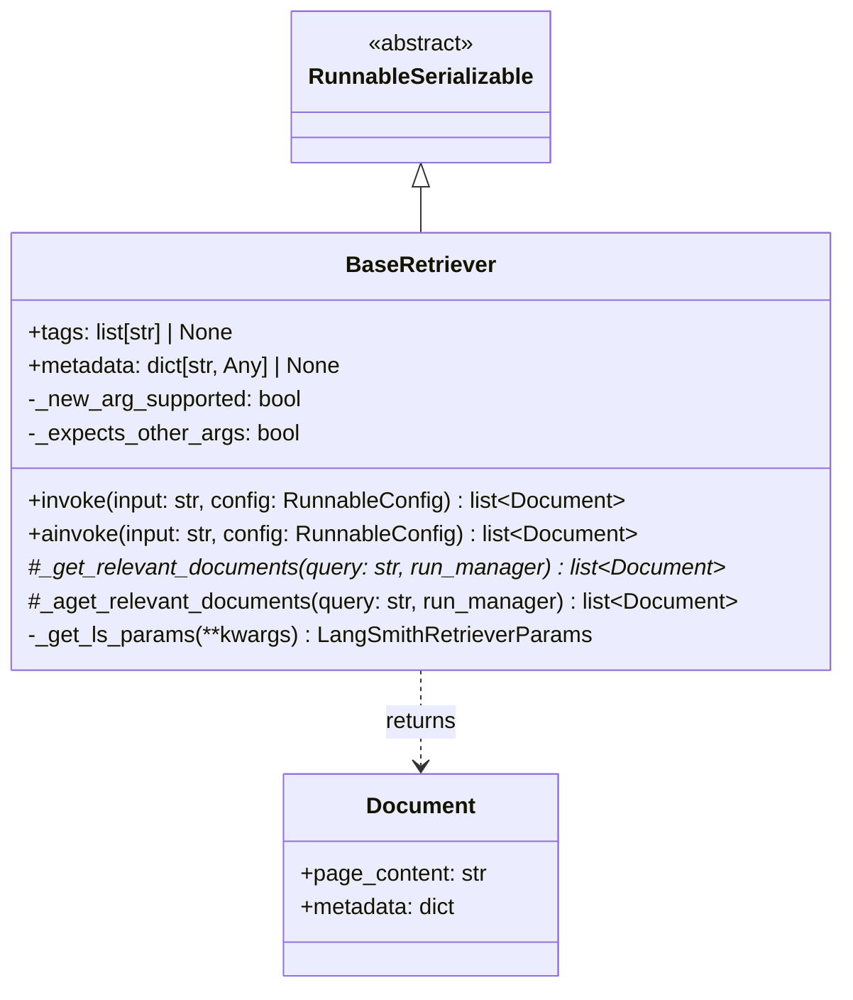
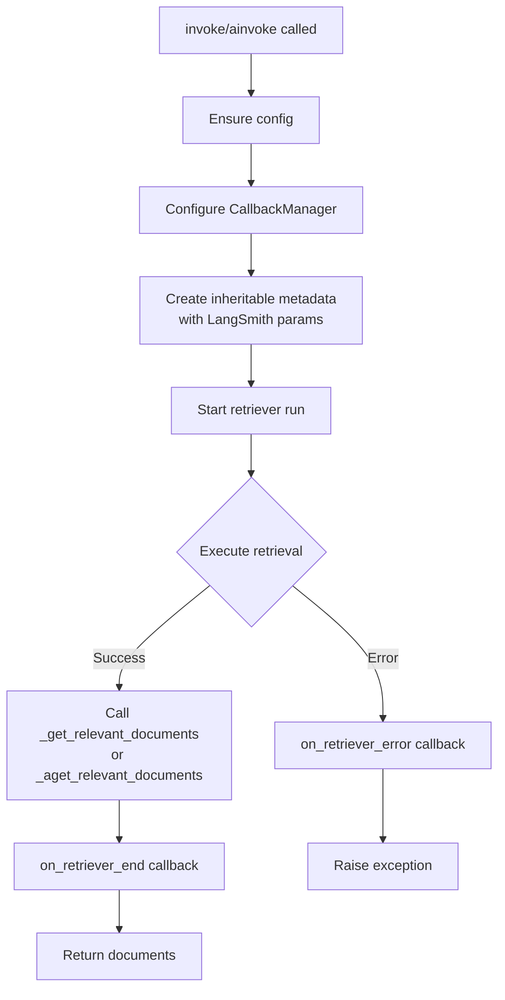
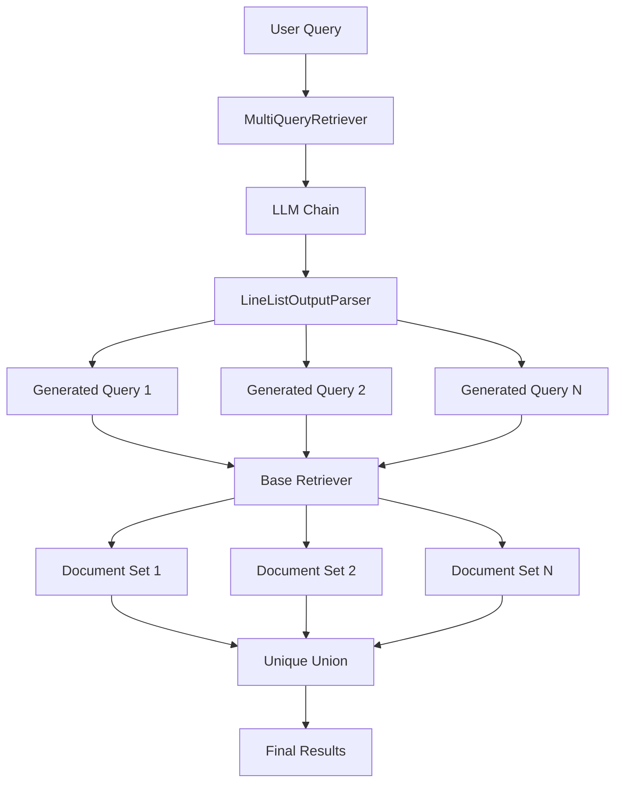
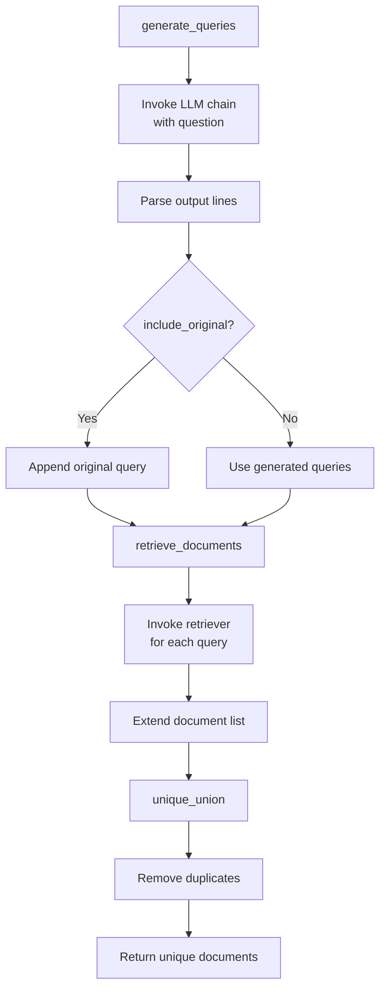
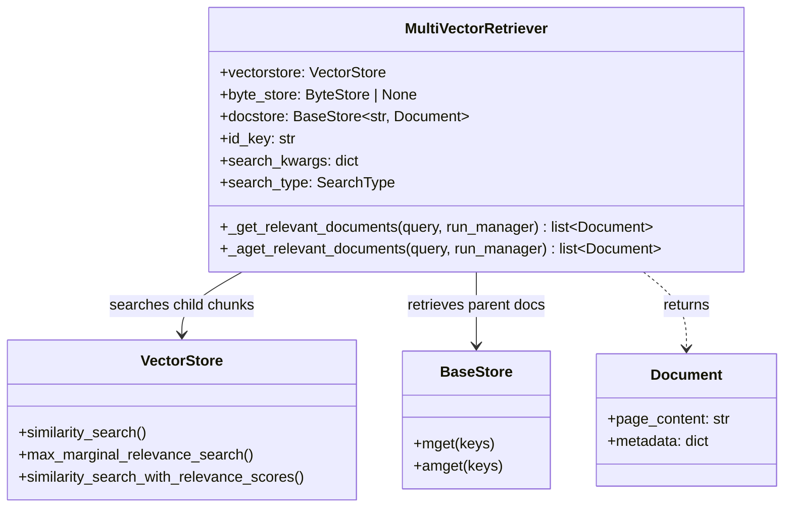
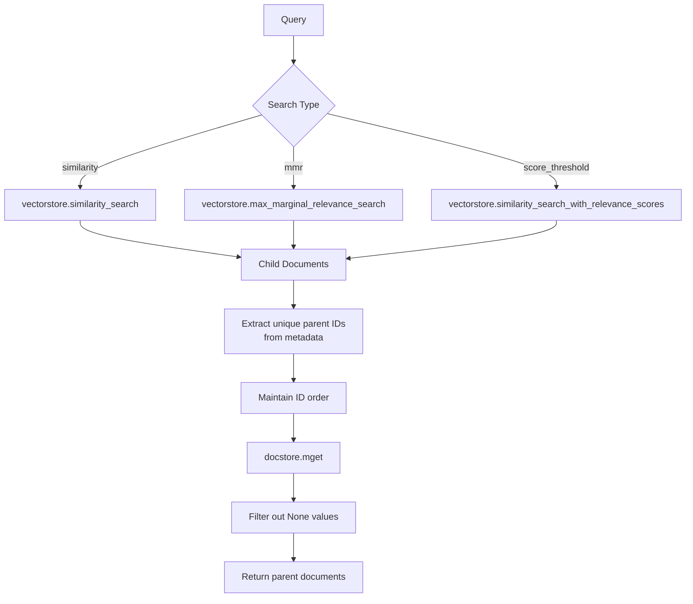
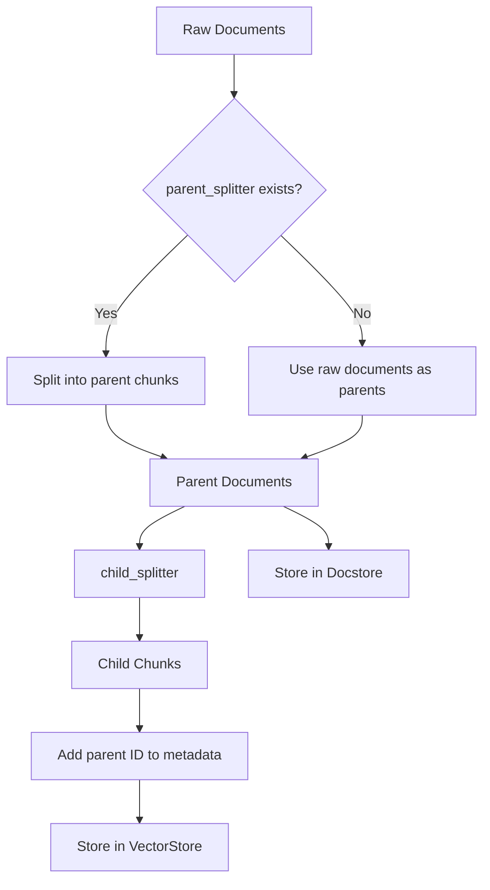
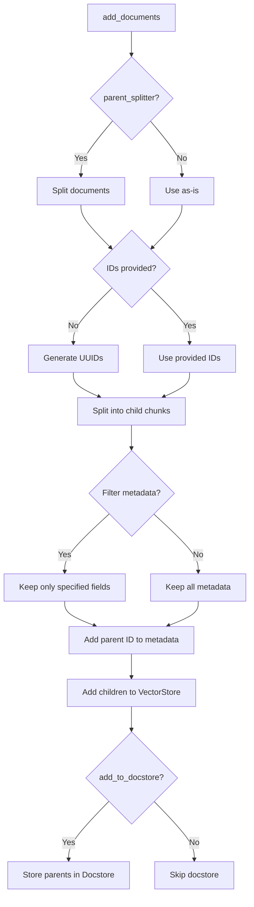
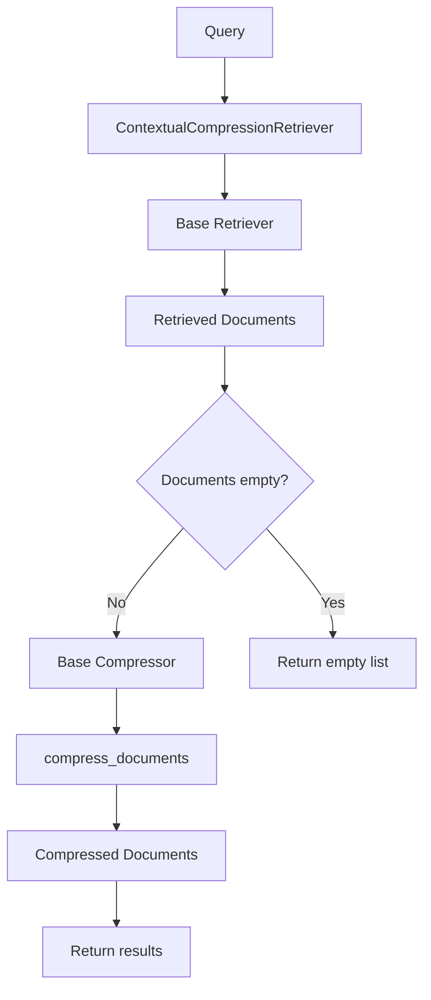
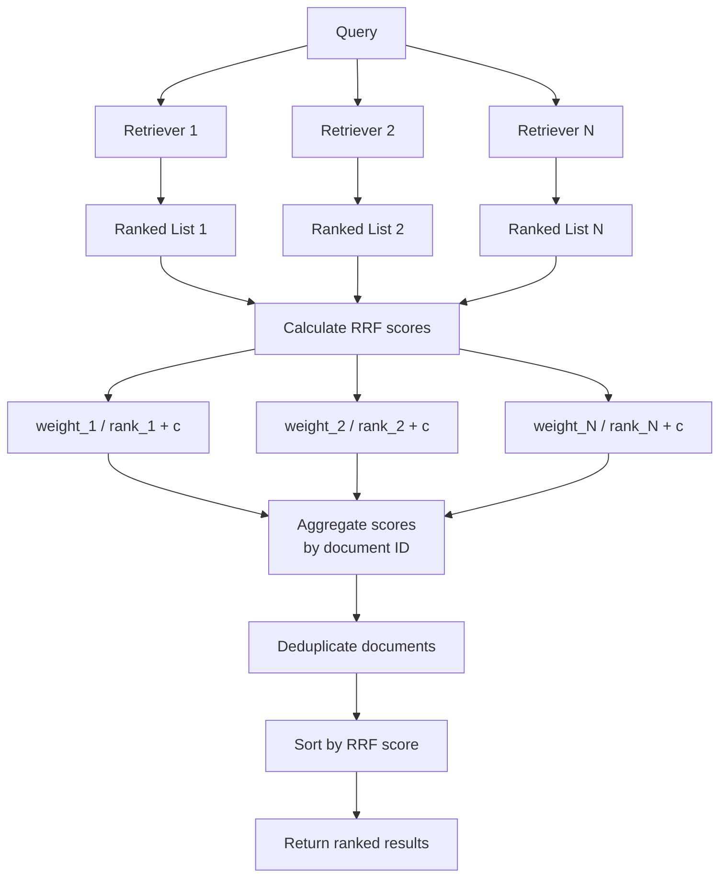

# Retriever Base & Advanced Retrievers

## Introduction

The Retriever system in LangChain provides a flexible and extensible framework for retrieving relevant documents based on text queries. At its core, the retriever abstraction is more general than a vector store—while vector stores can serve as the backbone of a retriever, the system supports various retrieval strategies and patterns. The `BaseRetriever` class serves as the foundation, implementing the `Runnable` interface to enable composability with other LangChain components through standard methods like `invoke`, `ainvoke`, `batch`, and `abatch`.

Beyond the base retriever, LangChain offers several advanced retriever implementations that address specific retrieval challenges: multi-query generation for overcoming distance-based search limitations, multi-vector retrieval for handling document chunking strategies, parent document retrieval for balancing embedding granularity with context preservation, contextual compression for filtering retrieved results, and ensemble retrieval for combining multiple retrieval strategies. These advanced retrievers enable sophisticated RAG (Retrieval-Augmented Generation) pipelines that can be tailored to specific application requirements.

Sources: [retrievers.py:1-10](../../../libs/core/langchain_core/retrievers.py#L1-L10), [__init__.py:1-6](../../../libs/langchain/langchain_classic/retrievers/__init__.py#L1-L6)

## Base Retriever Architecture

### Core Abstractions

The `BaseRetriever` class is an abstract base class that defines the contract for all retriever implementations in LangChain. It extends `RunnableSerializable` with type parameters `RetrieverInput` (str) and `RetrieverOutput` (list[Document]), making it fully compatible with LangChain's composable runnable interface.

Key type definitions:
- `RetrieverInput`: String type representing the query
- `RetrieverOutput`: List of `Document` objects representing retrieved results
- `RetrieverLike`: Any `Runnable` that accepts `RetrieverInput` and returns `RetrieverOutput`
- `RetrieverOutputLike`: Any `Runnable` that returns `RetrieverOutput`

Sources: [retrievers.py:28-32](../../../libs/core/langchain_core/retrievers.py#L28-L32)

### LangSmith Integration

The retriever system includes built-in tracing support for LangSmith through the `LangSmithRetrieverParams` typed dictionary. This enables tracking of retriever operations with metadata about the retriever name, vector store provider, embedding provider, and embedding model.

| Parameter | Type | Required | Description |
|-----------|------|----------|-------------|
| `ls_retriever_name` | str | No | Name identifier for the retriever |
| `ls_vector_store_provider` | str \| None | No | Vector store backend provider |
| `ls_embedding_provider` | str \| None | No | Embedding model provider |
| `ls_embedding_model` | str \| None | No | Specific embedding model used |

Sources: [retrievers.py:35-45](../../../libs/core/langchain_core/retrievers.py#L35-L45)

### BaseRetriever Class Structure



The `BaseRetriever` includes metadata fields that are associated with each retriever call and passed to callback handlers. The `tags` field allows identifying specific retriever instances with their use cases, while the `metadata` field provides additional contextual information.

Sources: [retrievers.py:47-143](../../../libs/core/langchain_core/retrievers.py#L47-L143)

### Retriever Invocation Flow

The retriever execution follows a consistent pattern with callback management and error handling:



The invocation process handles both synchronous and asynchronous execution paths, with automatic callback management and LangSmith tracing integration. The system also supports backward compatibility with retrievers that don't accept the `run_manager` parameter.

Sources: [retrievers.py:157-226](../../../libs/core/langchain_core/retrievers.py#L157-L226)

### Implementation Requirements

When implementing a custom retriever, developers must override the `_get_relevant_documents` method. Optionally, an async-native implementation can be provided by overriding `_aget_relevant_documents`. If the async method is not overridden, the base class automatically provides a default implementation that runs the synchronous method in an executor.

The `__init_subclass__` hook inspects the signature of `_get_relevant_documents` to determine:
- Whether the implementation supports the `run_manager` parameter (`_new_arg_supported`)
- Whether the implementation expects additional arguments beyond `query` and `run_manager` (`_expects_other_args`)

Sources: [retrievers.py:112-132](../../../libs/core/langchain_core/retrievers.py#L112-L132), [retrievers.py:245-266](../../../libs/core/langchain_core/retrievers.py#L245-L266)

## Multi-Query Retriever

### Overview

The `MultiQueryRetriever` addresses limitations of distance-based similarity search by generating multiple perspectives of a user query. It uses an LLM to create alternative phrasings of the original question, retrieves documents for each variation, and returns the unique union of all results. This approach helps overcome the semantic gap that can occur when a user's query phrasing doesn't match the document's phrasing, even when they refer to the same concept.

Sources: [multi_query.py:1-10](../../../libs/langchain/langchain_classic/retrievers/multi_query.py#L1-L10), [multi_query.py:37-42](../../../libs/langchain/langchain_classic/retrievers/multi_query.py#L37-L42)

### Architecture



Sources: [multi_query.py:37-61](../../../libs/langchain/langchain_classic/retrievers/multi_query.py#L37-L61)

### Key Components

| Component | Type | Description |
|-----------|------|-------------|
| `retriever` | BaseRetriever | The underlying retriever to query documents from |
| `llm_chain` | Runnable | Chain for generating alternative query versions |
| `verbose` | bool | Whether to log generated queries (default: True) |
| `parser_key` | str | Deprecated parameter, no longer used |
| `include_original` | bool | Whether to include the original query in the generated set |

The default prompt template instructs the LLM to generate 3 different versions of the user question to help overcome distance-based similarity search limitations:

```python
DEFAULT_QUERY_PROMPT = PromptTemplate(
    input_variables=["question"],
    template="""You are an AI language model assistant. Your task is
    to generate 3 different versions of the given user
    question to retrieve relevant documents from a vector  database.
    By generating multiple perspectives on the user question,
    your goal is to help the user overcome some of the limitations
    of distance-based similarity search. Provide these alternative
    questions separated by newlines. Original question: {question}""",
)
```

Sources: [multi_query.py:24-35](../../../libs/langchain/langchain_classic/retrievers/multi_query.py#L24-L35), [multi_query.py:44-61](../../../libs/langchain/langchain_classic/retrievers/multi_query.py#L44-L61)

### Query Generation and Retrieval Process



The retrieval process executes in parallel for async operations using `asyncio.gather`, while the synchronous version processes queries sequentially. Document uniqueness is determined by comparing document objects directly, removing duplicates while preserving order.

Sources: [multi_query.py:102-145](../../../libs/langchain/langchain_classic/retrievers/multi_query.py#L102-L145), [multi_query.py:147-177](../../../libs/langchain/langchain_classic/retrievers/multi_query.py#L147-L177)

### LineListOutputParser

The `LineListOutputParser` is a simple output parser that splits the LLM response into individual lines and filters out empty lines:

```python
class LineListOutputParser(BaseOutputParser[list[str]]):
    """Output parser for a list of lines."""

    @override
    def parse(self, text: str) -> list[str]:
        lines = text.strip().split("\n")
        return list(filter(None, lines))  # Remove empty lines
```

Sources: [multi_query.py:14-21](../../../libs/langchain/langchain_classic/retrievers/multi_query.py#L14-L21)

## Multi-Vector Retriever

### Concept and Use Case

The `MultiVectorRetriever` is designed for scenarios where documents are split into smaller chunks for embedding and vector search, but retrieval should return the original parent documents rather than individual chunks. This pattern is commonly used in RAG pipelines to improve answer grounding while preserving full document context.

The retriever works by:
1. Performing similarity (or MMR) search over embedded child chunks
2. Collecting unique parent document IDs from chunk metadata
3. Fetching and returning the corresponding parent documents from the docstore

Sources: [multi_vector.py:1-26](../../../libs/langchain/langchain_classic/retrievers/multi_vector.py#L1-L26)

### Search Types

The retriever supports three search strategies defined by the `SearchType` enum:

| Search Type | Description |
|-------------|-------------|
| `similarity` | Standard similarity search |
| `similarity_score_threshold` | Similarity search with a minimum score threshold |
| `mmr` | Maximal Marginal Relevance reranking of similarity search |

Sources: [multi_vector.py:17-24](../../../libs/langchain/langchain_classic/retrievers/multi_vector.py#L17-L24)

### Component Structure



The `id_key` field (default: "doc_id") specifies which metadata field in child chunks contains the parent document ID. The `search_kwargs` dictionary allows passing parameters to the underlying vector store search methods.

Sources: [multi_vector.py:27-50](../../../libs/langchain/langchain_classic/retrievers/multi_vector.py#L27-L50)

### Retrieval Flow



The retrieval process maintains the order of IDs as they appear in the search results, ensuring that the most relevant parent documents appear first. The implementation filters out any `None` values that might result from missing documents in the docstore.

Sources: [multi_vector.py:58-90](../../../libs/langchain/langchain_classic/retrievers/multi_vector.py#L58-L90)

### Storage Integration

The retriever uses a two-tier storage approach:
- **VectorStore**: Stores embeddings of child chunks for similarity search
- **BaseStore/ByteStore**: Stores full parent documents for retrieval

The `_shim_docstore` validator ensures backward compatibility by converting a `ByteStore` to a document store if provided:

```python
@model_validator(mode="before")
@classmethod
def _shim_docstore(cls, values: dict) -> Any:
    byte_store = values.get("byte_store")
    docstore = values.get("docstore")
    if byte_store is not None:
        docstore = create_kv_docstore(byte_store)
    elif docstore is None:
        msg = "You must pass a `byte_store` parameter."
        raise ValueError(msg)
    values["docstore"] = docstore
    return values
```

Sources: [multi_vector.py:52-63](../../../libs/langchain/langchain_classic/retrievers/multi_vector.py#L52-L63)

## Parent Document Retriever

### Motivation and Design

The `ParentDocumentRetriever` extends `MultiVectorRetriever` to address a fundamental tension in document retrieval:
1. Small documents enable embeddings that accurately reflect specific meanings
2. Long documents preserve context that might be lost in smaller chunks

This retriever strikes a balance by splitting and storing small chunks for embedding, but retrieving larger parent documents (or the original raw documents) during query time.

Sources: [parent_document_retriever.py:1-38](../../../libs/langchain/langchain_classic/retrievers/parent_document_retriever.py#L1-L38)

### Text Splitting Strategy



The retriever uses two text splitters:
- **parent_splitter** (optional): Creates intermediate parent documents from raw documents
- **child_splitter** (required): Creates small chunks from parent documents for embedding

Sources: [parent_document_retriever.py:11-63](../../../libs/langchain/langchain_classic/retrievers/parent_document_retriever.py#L11-L63)

### Configuration

| Field | Type | Required | Description |
|-------|------|----------|-------------|
| `child_splitter` | TextSplitter | Yes | Splitter for creating child documents |
| `parent_splitter` | TextSplitter \| None | No | Splitter for creating parent documents; if None, raw documents are parents |
| `child_metadata_fields` | Sequence[str] \| None | No | Metadata fields to preserve in child documents; if None, keep all |

Sources: [parent_document_retriever.py:11-63](../../../libs/langchain/langchain_classic/retrievers/parent_document_retriever.py#L11-L63)

### Document Addition Process



The `add_documents` method supports both synchronous and asynchronous operations (`aadd_documents`). The `add_to_docstore` parameter allows skipping docstore updates when parent documents are already stored, which is useful when adding new child chunks to existing parents.

Sources: [parent_document_retriever.py:65-140](../../../libs/langchain/langchain_classic/retrievers/parent_document_retriever.py#L65-L140)

### Metadata Filtering

The `child_metadata_fields` parameter controls which metadata fields are preserved in child documents:

```python
if self.child_metadata_fields is not None:
    for _doc in sub_docs:
        _doc.metadata = {
            k: _doc.metadata[k] for k in self.child_metadata_fields
        }
```

This filtering reduces storage overhead in the vector store by keeping only essential metadata fields in the child chunks, while the full metadata remains available in the parent documents stored in the docstore.

Sources: [parent_document_retriever.py:83-88](../../../libs/langchain/langchain_classic/retrievers/parent_document_retriever.py#L83-L88)

## Contextual Compression Retriever

### Purpose

The `ContextualCompressionRetriever` wraps a base retriever and applies compression to the retrieved documents. This pattern is useful for filtering, summarizing, or otherwise reducing retrieved documents to only the most relevant information for a given query.

Sources: [contextual_compression.py:1-15](../../../libs/langchain/langchain_classic/retrievers/contextual_compression.py#L1-L15)

### Architecture



The retriever follows a simple two-stage pipeline: first retrieve documents using the base retriever, then compress them using the base compressor. If no documents are retrieved, the compression step is skipped.

Sources: [contextual_compression.py:18-59](../../../libs/langchain/langchain_classic/retrievers/contextual_compression.py#L18-L59)

### Components

| Component | Type | Description |
|-----------|------|-------------|
| `base_compressor` | BaseDocumentCompressor | Compressor for filtering/reducing retrieved documents |
| `base_retriever` | RetrieverLike | Base retriever for getting relevant documents |

The `base_retriever` is typed as `RetrieverLike`, meaning it can be any runnable that accepts a string query and returns a list of documents. This flexibility allows composition with various retriever implementations.

Sources: [contextual_compression.py:18-26](../../../libs/langchain/langchain_classic/retrievers/contextual_compression.py#L18-L26)

### Synchronous and Asynchronous Execution

Both synchronous and asynchronous implementations follow the same pattern:

```python
def _get_relevant_documents(
    self,
    query: str,
    *,
    run_manager: CallbackManagerForRetrieverRun,
    **kwargs: Any,
) -> list[Document]:
    docs = self.base_retriever.invoke(
        query,
        config={"callbacks": run_manager.get_child()},
        **kwargs,
    )
    if docs:
        compressed_docs = self.base_compressor.compress_documents(
            docs,
            query,
            callbacks=run_manager.get_child(),
        )
        return list(compressed_docs)
    return []
```

The implementation properly propagates callbacks through child operations using `run_manager.get_child()`, ensuring proper tracing and monitoring of both retrieval and compression stages.

Sources: [contextual_compression.py:29-59](../../../libs/langchain/langchain_classic/retrievers/contextual_compression.py#L29-L59)

## Ensemble Retriever

### Weighted Rank Fusion

The `EnsembleRetriever` combines results from multiple retrievers using weighted Reciprocal Rank Fusion (RRF). This technique addresses the challenge of merging ranked lists from different retrieval systems by considering both the rank position and a weighting factor for each retriever.

The RRF formula for each document is:
```
RRF_score = Σ(weight_i / (rank_i + c))
```

where `c` is a constant (default: 60) that controls the balance between high-ranked and lower-ranked items.

Sources: [ensemble.py:1-11](../../../libs/langchain/langchain_classic/retrievers/ensemble.py#L1-L11), [ensemble.py:406-420](../../../libs/langchain/langchain_classic/retrievers/ensemble.py#L406-L420)

### Configuration

| Field | Type | Default | Description |
|-------|------|---------|-------------|
| `retrievers` | list[RetrieverLike] | Required | List of retrievers to ensemble |
| `weights` | list[float] | Equal weights | Weights corresponding to each retriever |
| `c` | int | 60 | Constant for rank fusion formula |
| `id_key` | str \| None | None | Metadata key for document identification; if None, uses page_content |

The `weights` validator automatically sets equal weights if none are provided, and validates that the number of weights matches the number of retrievers:

```python
@model_validator(mode="before")
@classmethod
def _set_weights(cls, values: dict[str, Any]) -> Any:
    weights = values.get("weights")
    
    if not weights:
        n_retrievers = len(values["retrievers"])
        values["weights"] = [1 / n_retrievers] * n_retrievers
        return values
    
    retrievers = values["retrievers"]
    if len(weights) != len(retrievers):
        msg = (
            "Length of weights must match number of retrievers "
            f"(got {len(weights)} weights for {len(retrievers)} retrievers)."
        )
        raise ValueError(msg)
```

Sources: [ensemble.py:67-103](../../../libs/langchain/langchain_classic/retrievers/ensemble.py#L67-L103)

### Rank Fusion Process



The fusion process handles document deduplication intelligently. Documents are identified either by their `page_content` or by a specified metadata field (`id_key`). Duplicate documents across retrievers have their RRF scores accumulated, giving them higher rankings.

Sources: [ensemble.py:289-346](../../../libs/langchain/langchain_classic/retrievers/ensemble.py#L289-L346)

### Parallel Execution

The ensemble retriever executes all underlying retrievers in parallel:

**Synchronous:**
```python
retriever_docs = [
    retriever.invoke(
        query,
        patch_config(
            config,
            callbacks=run_manager.get_child(tag=f"retriever_{i + 1}"),
        ),
    )
    for i, retriever in enumerate(self.retrievers)
]
```

**Asynchronous:**
```python
retriever_docs = await asyncio.gather(
    *[
        retriever.ainvoke(
            query,
            patch_config(
                config,
                callbacks=run_manager.get_child(tag=f"retriever_{i + 1}"),
            ),
        )
        for i, retriever in enumerate(self.retrievers)
    ],
)
```

Each retriever is tagged with a unique identifier (`retriever_1`, `retriever_2`, etc.) for tracing purposes.

Sources: [ensemble.py:289-313](../../../libs/langchain/langchain_classic/retrievers/ensemble.py#L289-L313), [ensemble.py:328-346](../../../libs/langchain/langchain_classic/retrievers/ensemble.py#L328-L346)

### Document Uniqueness

The `unique_by_key` utility function ensures document deduplication while preserving order:

```python
def unique_by_key(iterable: Iterable[T], key: Callable[[T], H]) -> Iterator[T]:
    """Yield unique elements of an iterable based on a key function.

    Args:
        iterable: The iterable to filter.
        key: A function that returns a hashable key for each element.

    Yields:
        Unique elements of the iterable based on the key function.
    """
    seen = set()
    for e in iterable:
        if (k := key(e)) not in seen:
            seen.add(k)
            yield e
```

This function is used in the final sorting step to deduplicate documents before returning them, ensuring each unique document appears only once in the final result set.

Sources: [ensemble.py:38-52](../../../libs/langchain/langchain_classic/retrievers/ensemble.py#L38-L52), [ensemble.py:425-444](../../../libs/langchain/langchain_classic/retrievers/ensemble.py#L425-L444)

## Available Retriever Implementations

LangChain provides a comprehensive set of retriever implementations beyond the core advanced retrievers. The following table summarizes retrievers available through the `langchain_community` package:

| Retriever | Module | Description |
|-----------|--------|-------------|
| AmazonKendraRetriever | langchain_community.retrievers | AWS Kendra enterprise search |
| AmazonKnowledgeBasesRetriever | langchain_community.retrievers | AWS Knowledge Bases integration |
| ArceeRetriever | langchain_community.retrievers | Arcee AI retrieval |
| ArxivRetriever | langchain_community.retrievers | Academic paper search via Arxiv |
| AzureAISearchRetriever | langchain_community.retrievers | Azure Cognitive Search |
| BM25Retriever | langchain_community.retrievers | BM25 ranking algorithm |
| ChaindeskRetriever | langchain_community.retrievers | Chaindesk platform integration |
| CohereRagRetriever | langchain_community.retrievers | Cohere RAG API |
| ElasticSearchBM25Retriever | langchain_community.retrievers | Elasticsearch with BM25 |
| GoogleVertexAISearchRetriever | langchain_community.retrievers | Google Vertex AI Search |
| KNNRetriever | langchain_community.retrievers | K-Nearest Neighbors |
| MilvusRetriever | langchain_community.retrievers | Milvus vector database |
| PineconeHybridSearchRetriever | langchain_community.retrievers | Pinecone hybrid search |
| PubMedRetriever | langchain_community.retrievers | Medical literature search |
| SVMRetriever | langchain_community.retrievers | Support Vector Machine ranking |
| TavilySearchAPIRetriever | langchain_community.retrievers | Tavily search API |
| TFIDFRetriever | langchain_community.retrievers | TF-IDF ranking |
| WikipediaRetriever | langchain_community.retrievers | Wikipedia article search |
| ZepRetriever | langchain_community.retrievers | Zep memory store |

Additional advanced retrievers in the core package include:
- **MergerRetriever**: Merges results from multiple retrievers
- **RePhraseQueryRetriever**: Rephrases queries before retrieval
- **SelfQueryRetriever**: Constructs structured queries from natural language
- **TimeWeightedVectorStoreRetriever**: Considers document recency in ranking

Sources: [__init__.py:13-118](../../../libs/langchain/langchain_classic/retrievers/__init__.py#L13-L118)

## Summary

The LangChain retriever system provides a robust foundation for building sophisticated document retrieval pipelines. The `BaseRetriever` abstract class establishes a consistent interface with built-in callback management, LangSmith tracing, and full compatibility with the Runnable protocol. Advanced retrievers extend this foundation to address specific retrieval challenges:

- **MultiQueryRetriever** overcomes query phrasing limitations through LLM-generated query variations
- **MultiVectorRetriever** enables chunk-based embedding while returning full parent documents
- **ParentDocumentRetriever** balances embedding granularity with context preservation through dual text splitting
- **ContextualCompressionRetriever** filters and refines retrieved results for improved relevance
- **EnsembleRetriever** combines multiple retrieval strategies using weighted rank fusion

These components can be composed together or with other LangChain primitives to create powerful RAG applications tailored to specific use cases. The consistent interface and comprehensive callback support ensure that retrieval operations are observable, traceable, and maintainable in production environments.