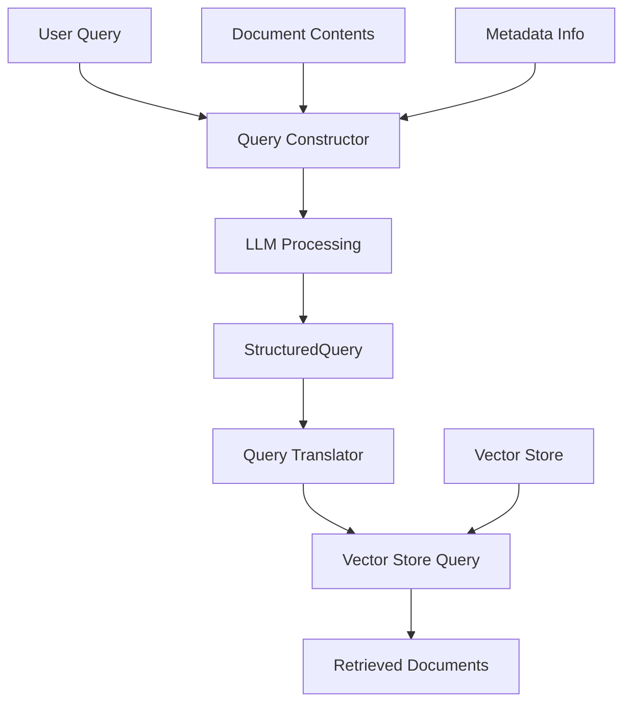
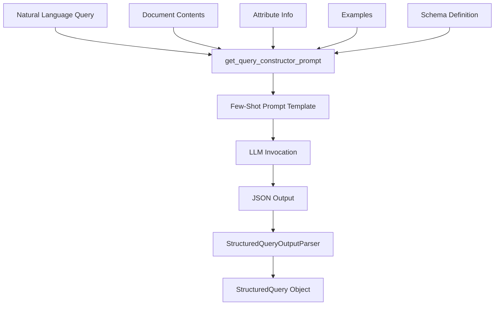
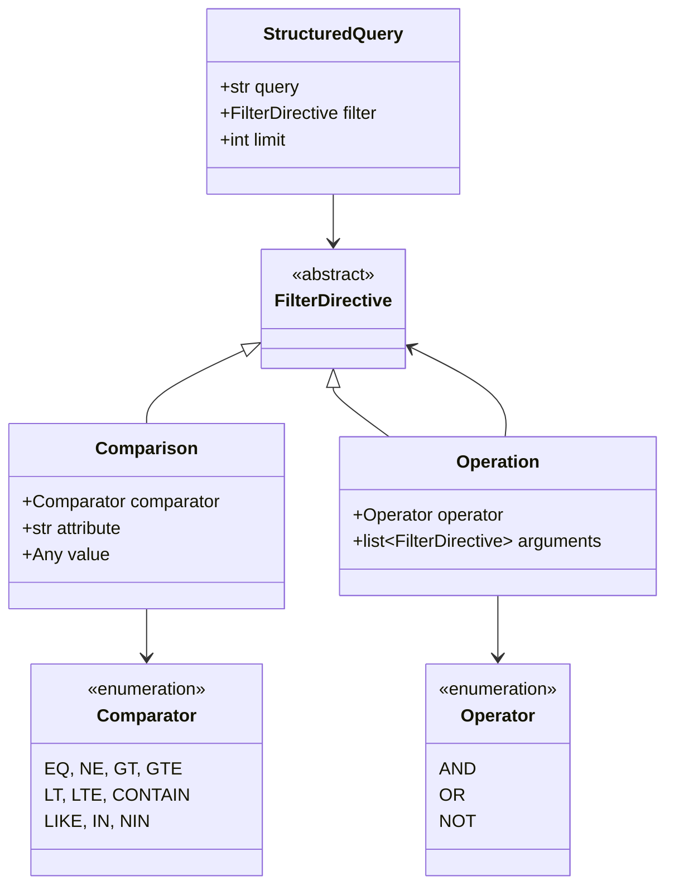
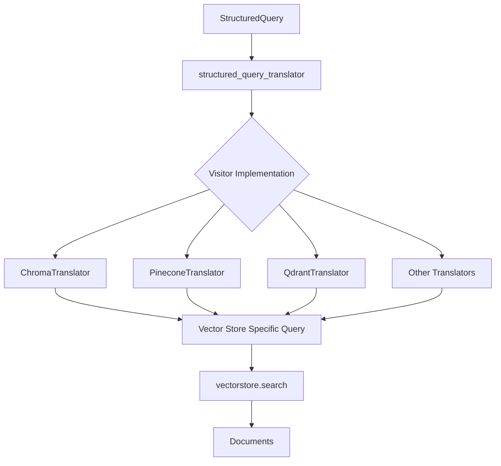
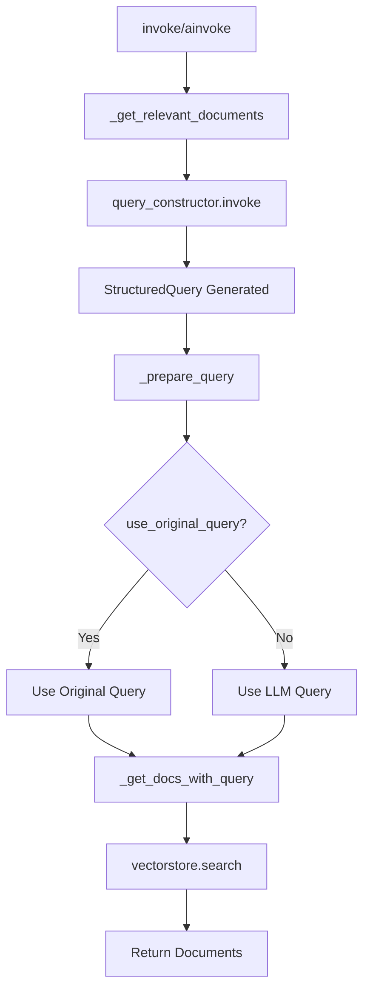
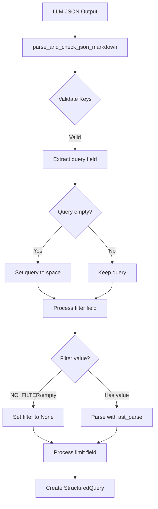
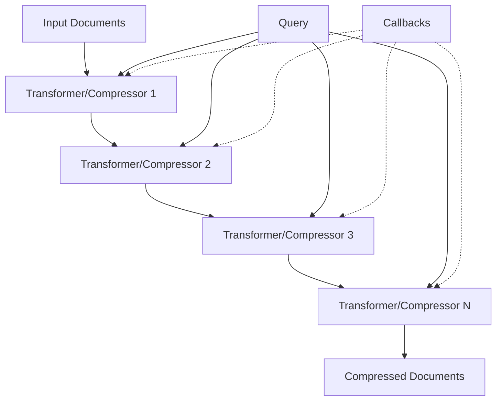
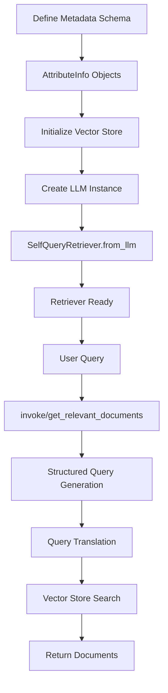
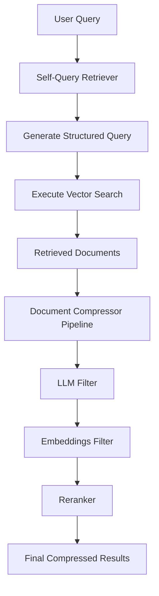
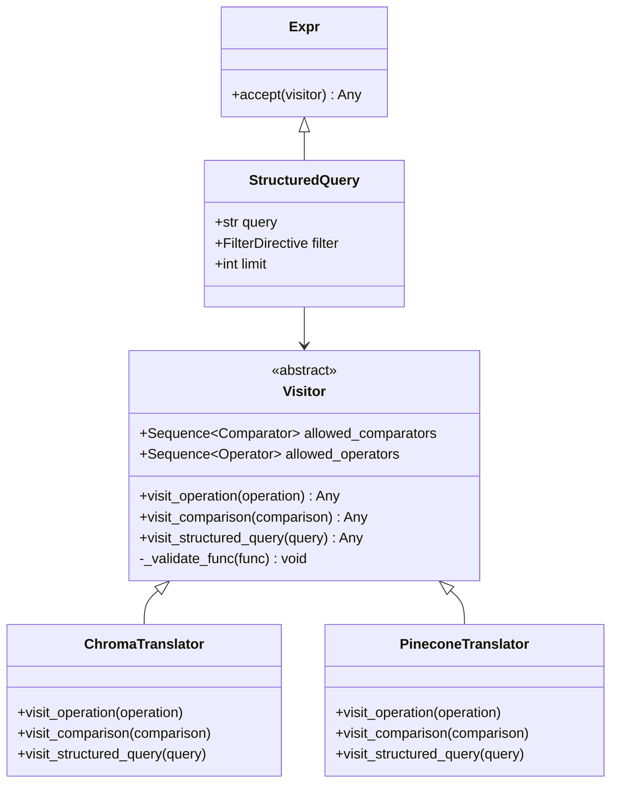

# Self-Query Retriever & Document Compressors

## Introduction

The Self-Query Retriever and Document Compressors are advanced retrieval components within the LangChain framework designed to enhance document retrieval and ranking capabilities. The Self-Query Retriever enables natural language queries to be automatically translated into structured queries with filters and metadata conditions, allowing users to query vector stores using conversational language while the system intelligently generates appropriate filters. Document Compressors provide a pipeline-based approach to post-process and refine retrieved documents through filtering, extraction, reranking, and transformation operations, improving the relevance and quality of results before they are returned to the application.

These components work together to create sophisticated retrieval workflows: the Self-Query Retriever handles intelligent query construction and execution against vector stores, while Document Compressors refine the results through various compression and ranking strategies. This modular architecture allows developers to build powerful retrieval systems that understand user intent and return highly relevant, compressed document sets.

## Self-Query Retriever Architecture

### Overview

The `SelfQueryRetriever` is a specialized retriever that generates and executes structured queries over its own data source by leveraging a language model to translate natural language queries into structured filter conditions. The retriever combines vector similarity search with metadata filtering, enabling complex queries that go beyond simple semantic search.

Sources: [base.py:1-10](../../../libs/langchain/langchain_classic/retrievers/self_query/base.py#L1-L10)



### Core Components

The Self-Query Retriever consists of several key components that work together to process queries:

| Component | Type | Description |
|-----------|------|-------------|
| `vectorstore` | `VectorStore` | The underlying vector store from which documents will be retrieved |
| `query_constructor` | `Runnable[dict, StructuredQuery]` | Chain for generating vector store queries from natural language |
| `structured_query_translator` | `Visitor` | Translates internal query language into VectorStore-specific search parameters |
| `search_type` | `str` | The search type to perform (default: "similarity") |
| `search_kwargs` | `dict` | Additional keyword arguments for vector store search |
| `use_original_query` | `bool` | Whether to use original query instead of LLM-revised query |

Sources: [base.py:225-241](../../../libs/langchain/langchain_classic/retrievers/self_query/base.py#L225-L241)

### Query Construction Process

The query construction process transforms natural language into structured queries with filters:



The `load_query_constructor_runnable` function creates a runnable chain that processes queries through several stages:

1. **Prompt Construction**: Builds a few-shot prompt with document contents, metadata attributes, and example queries
2. **LLM Processing**: The language model generates a structured JSON response
3. **Output Parsing**: Parses the JSON into a `StructuredQuery` object containing the query string, filters, and optional limit

Sources: [base.py:374-430](../../../libs/langchain/langchain_classic/retrievers/self_query/base.py#L374-L430)

### Structured Query Representation

The structured query system uses a well-defined internal representation:



Sources: [structured_query.py:1-160](../../../libs/core/langchain_core/structured_query.py#L1-L160)

### Query Translation and Execution

The retriever translates structured queries into vector store-specific formats using the Visitor pattern:



The `_prepare_query` method processes the structured query and prepares search parameters:

Sources: [base.py:249-261](../../../libs/langchain/langchain_classic/retrievers/self_query/base.py#L249-L261)

### Supported Vector Stores

The Self-Query Retriever supports numerous vector store backends through built-in translators:

| Vector Store | Translator Class | Package |
|--------------|-----------------|---------|
| AstraDB | `AstraDBTranslator` | langchain-astradb / langchain-community |
| Chroma | `ChromaTranslator` | langchain-chroma / langchain-community |
| Pinecone | `PineconeTranslator` | langchain-pinecone / langchain-community |
| Qdrant | `QdrantTranslator` | langchain-qdrant / langchain-community |
| Elasticsearch | `ElasticsearchTranslator` | langchain-elasticsearch / langchain-community |
| Milvus | `MilvusTranslator` | langchain-milvus / langchain-community |
| MongoDB Atlas | `MongoDBAtlasTranslator` | langchain-mongodb / langchain-community |
| PGVector | `PGVectorTranslator` | langchain-postgres / langchain-community |
| Weaviate | `WeaviateTranslator` | langchain-weaviate / langchain-community |
| Redis | `RedisTranslator` | langchain-community |
| Neo4j | `Neo4jTranslator` | langchain-neo4j / langchain-community |

Sources: [base.py:30-182](../../../libs/langchain/langchain_classic/retrievers/self_query/base.py#L30-L182)

### Query Parser Implementation

The query parser uses the Lark parsing library to transform filter strings into structured representations:

```python
GRAMMAR = r"""
    ?program: func_call
    ?expr: func_call
        | value

    func_call: CNAME "(" [args] ")"

    ?value: SIGNED_INT -> int
        | SIGNED_FLOAT -> float
        | DATE -> date
        | DATETIME -> datetime
        | list
        | string
        | ("false" | "False" | "FALSE") -> false
        | ("true" | "True" | "TRUE") -> true
"""
```

The `QueryTransformer` class implements the Lark `Transformer` interface to convert parsed tokens into `FilterDirective` objects:

Sources: [parser.py:23-46](../../../libs/langchain/langchain_classic/chains/query_constructor/parser.py#L23-L46), [parser.py:60-85](../../../libs/langchain/langchain_classic/chains/query_constructor/parser.py#L60-L85)

### Retrieval Flow

The complete retrieval flow for synchronous and asynchronous operations:



Sources: [base.py:271-298](../../../libs/langchain/langchain_classic/retrievers/self_query/base.py#L271-L298)

### Factory Method

The `from_llm` class method provides a convenient way to instantiate a Self-Query Retriever:

| Parameter | Type | Description |
|-----------|------|-------------|
| `llm` | `BaseLanguageModel` | Language model for generating queries |
| `vectorstore` | `VectorStore` | Vector store for document retrieval |
| `document_contents` | `str` | Description of document page contents |
| `metadata_field_info` | `Sequence[AttributeInfo]` | Metadata field information |
| `structured_query_translator` | `Visitor` (optional) | Custom translator (auto-detected if None) |
| `chain_kwargs` | `dict` (optional) | Additional query constructor arguments |
| `enable_limit` | `bool` | Whether to enable limit operator |
| `use_original_query` | `bool` | Use original vs. LLM-revised query |

Sources: [base.py:300-372](../../../libs/langchain/langchain_classic/retrievers/self_query/base.py#L300-L372)

## Query Constructor Chain

### Prompt Engineering

The query constructor uses few-shot prompting to teach the LLM how to generate structured queries. The prompt includes:

- **Schema Definition**: Describes the JSON structure with allowed comparators and operators
- **Examples**: Demonstrates query transformations from natural language to structured format
- **Document Context**: Provides information about document contents and available metadata attributes

Sources: [base.py:158-207](../../../libs/langchain/langchain_classic/chains/query_constructor/base.py#L158-L207)

### Output Parsing

The `StructuredQueryOutputParser` handles the conversion of LLM output to structured query objects:



The parser validates that required keys (`query` and `filter`) are present and handles special cases:
- Empty queries are replaced with a space character
- `"NO_FILTER"` or empty filter values result in `None`
- The `limit` field is optional and removed if not specified

Sources: [base.py:27-60](../../../libs/langchain/langchain_classic/chains/query_constructor/base.py#L27-L60)

### Filter Validation and Fixing

The system can optionally fix invalid filter directives by removing disallowed operators, comparators, or attributes:

```python
def fix_filter_directive(
    filter: FilterDirective | None,
    *,
    allowed_comparators: Sequence[Comparator] | None = None,
    allowed_operators: Sequence[Operator] | None = None,
    allowed_attributes: Sequence[str] | None = None,
) -> FilterDirective | None:
```

The `fix_filter_directive` function recursively processes filter trees:
- Removes `Comparison` nodes with disallowed comparators or attributes
- Removes `Operation` nodes with disallowed operators
- Simplifies single-argument AND/OR operations to just the argument
- Returns `None` if all arguments are filtered out

Sources: [base.py:63-109](../../../libs/langchain/langchain_classic/chains/query_constructor/base.py#L63-L109)

## Document Compressors

### Overview

Document Compressors provide post-retrieval processing to refine and improve the quality of retrieved documents. They implement the `BaseDocumentCompressor` interface and can be chained together in pipelines for multi-stage processing.

Sources: [__init__.py:1-38](../../../libs/langchain/langchain_classic/retrievers/document_compressors/__init__.py#L1-L38)

### Available Compressor Types

| Compressor | Purpose | Key Features |
|------------|---------|--------------|
| `LLMChainExtractor` | Extract relevant passages using LLM | Uses language model to identify and extract relevant content |
| `LLMChainFilter` | Filter documents using LLM | Binary relevance classification via language model |
| `LLMListwiseRerank` | Rerank documents using LLM | Listwise ranking approach with language model |
| `CohereRerank` | Rerank using Cohere API | Leverages Cohere's reranking model |
| `CrossEncoderReranker` | Rerank using cross-encoder | Uses cross-encoder models for relevance scoring |
| `EmbeddingsFilter` | Filter by embedding similarity | Removes documents below similarity threshold |
| `FlashrankRerank` | Fast reranking | Efficient reranking implementation |

Sources: [__init__.py:7-21](../../../libs/langchain/langchain_classic/retrievers/document_compressors/__init__.py#L7-L21)

### Document Compressor Pipeline

The `DocumentCompressorPipeline` chains multiple transformers and compressors in sequence:



The pipeline processes documents through each transformer in order:
1. Checks if the transformer is a `BaseDocumentCompressor` or `BaseDocumentTransformer`
2. For compressors, passes the query and optionally callbacks
3. For transformers, only passes documents (no query needed)
4. Returns the final transformed/compressed document set

Sources: [base.py:1-64](../../../libs/langchain/langchain_classic/retrievers/document_compressors/base.py#L1-L64)

### Synchronous and Asynchronous Processing

The pipeline supports both synchronous and asynchronous document processing:

```python
def compress_documents(
    self,
    documents: Sequence[Document],
    query: str,
    callbacks: Callbacks | None = None,
) -> Sequence[Document]:
    """Transform a list of documents."""
    for _transformer in self.transformers:
        if isinstance(_transformer, BaseDocumentCompressor):
            # Handle compressor with optional callbacks
        elif isinstance(_transformer, BaseDocumentTransformer):
            # Handle transformer without query
```

The async version (`acompress_documents`) follows the same logic but uses `await` for asynchronous operations. Both methods inspect the transformer's signature to determine if it accepts callbacks.

Sources: [base.py:17-64](../../../libs/langchain/langchain_classic/retrievers/document_compressors/base.py#L17-L64)

## Integration Patterns

### Self-Query Retriever Usage

The typical workflow for using the Self-Query Retriever:



### Combining Retrievers and Compressors

Self-Query Retrievers can be combined with Document Compressors for enhanced retrieval:



This pattern combines the intelligent query construction of Self-Query Retriever with the refinement capabilities of Document Compressors to produce highly relevant, filtered results.

## Visitor Pattern for Query Translation

### Architecture

The Visitor pattern enables extensible translation of structured queries into vector store-specific formats:



The `Visitor` base class defines the interface for translating structured queries. Each vector store implements its own translator that converts the internal query representation into the store's native query format.

Sources: [structured_query.py:14-52](../../../libs/core/langchain_core/structured_query.py#L14-L52)

### Validation

The visitor validates operators and comparators against allowed lists:

```python
def _validate_func(self, func: Operator | Comparator) -> None:
    if (
        isinstance(func, Operator)
        and self.allowed_operators is not None
        and func not in self.allowed_operators
    ):
        # Raise error for disallowed operator
    if (
        isinstance(func, Comparator)
        and self.allowed_comparators is not None
        and func not in self.allowed_comparators
    ):
        # Raise error for disallowed comparator
```

This ensures that only supported operations are translated for each vector store backend.

Sources: [structured_query.py:24-40](../../../libs/core/langchain_core/structured_query.py#L24-L40)

## Summary

The Self-Query Retriever and Document Compressors represent sophisticated components in LangChain's retrieval ecosystem. The Self-Query Retriever bridges natural language and structured database queries, enabling users to express complex filtering and search requirements conversationally while the system automatically generates appropriate metadata filters and search parameters. With support for over 15 vector store backends and a flexible visitor-based translation system, it provides a unified interface for advanced retrieval across diverse storage systems.

Document Compressors complement this capability by providing a modular pipeline architecture for post-retrieval refinement. Through filtering, extraction, and reranking operations, they ensure that only the most relevant document content reaches the application layer. Together, these components enable developers to build retrieval systems that understand user intent, execute precise queries, and return optimally compressed, highly relevant results—essential capabilities for production LLM applications that require both accuracy and efficiency.