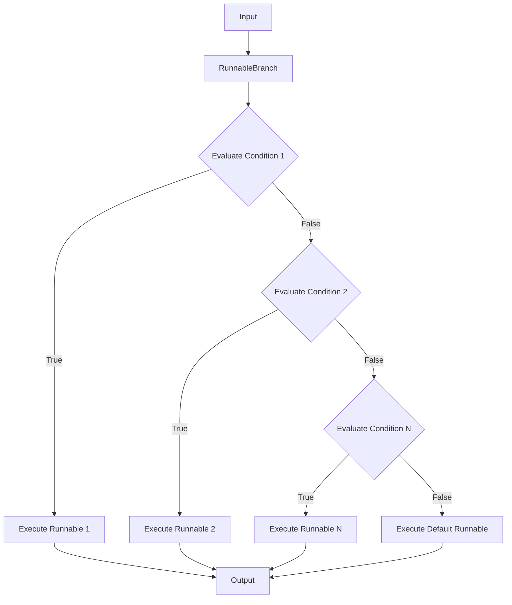
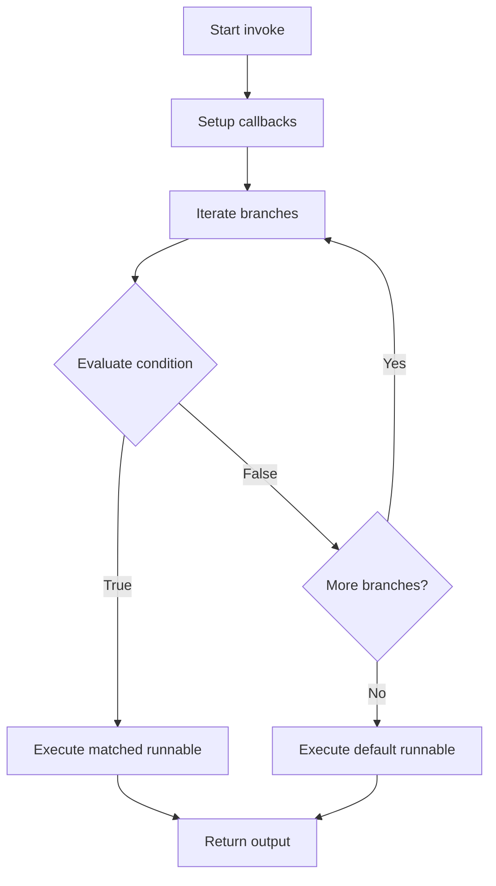
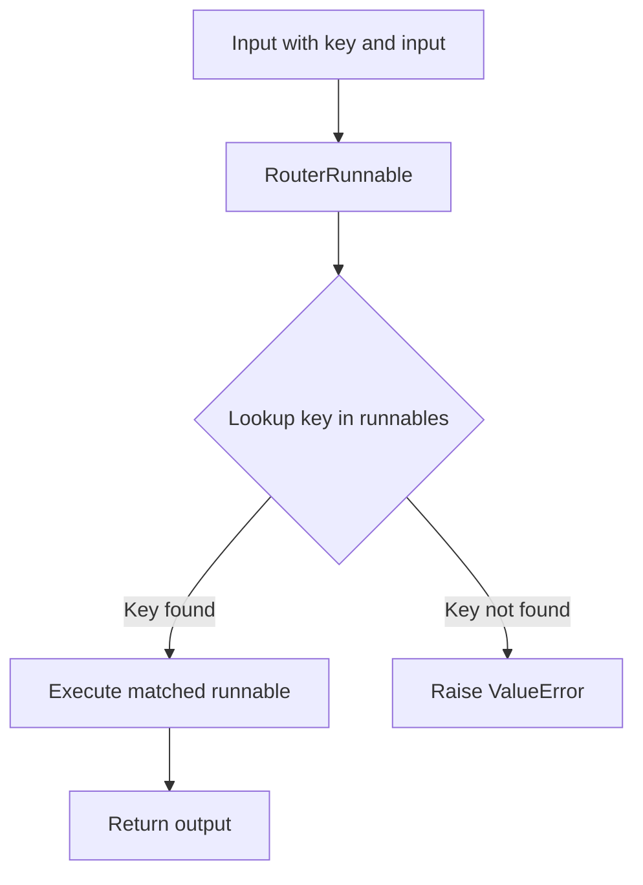
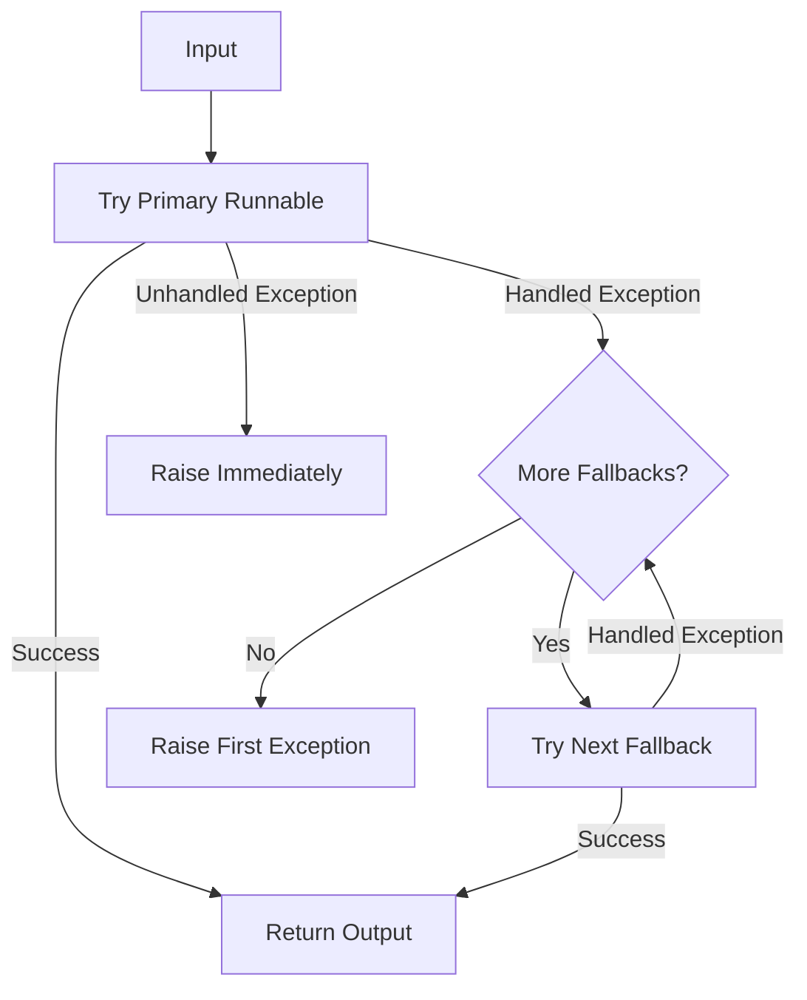
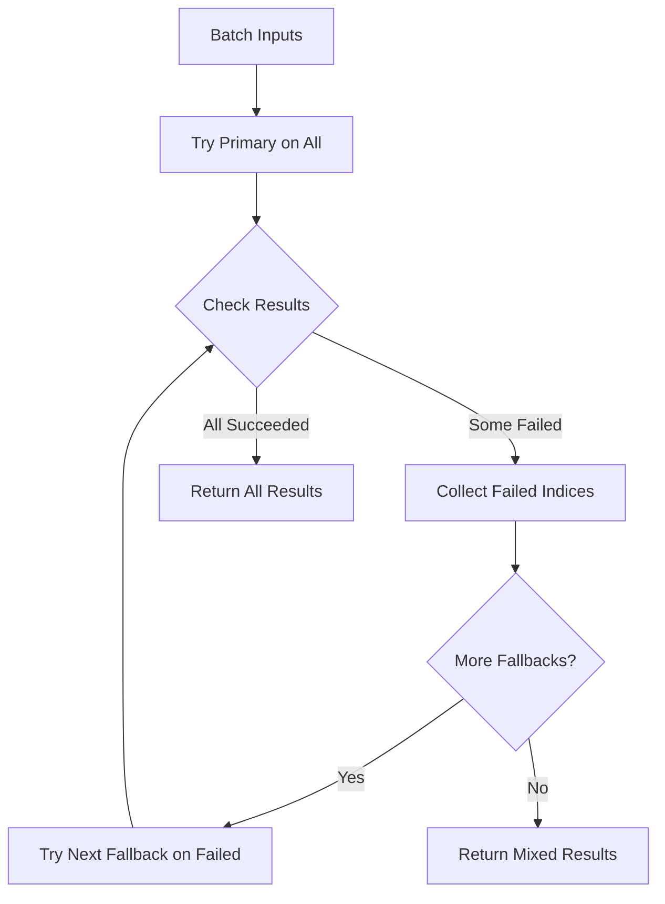
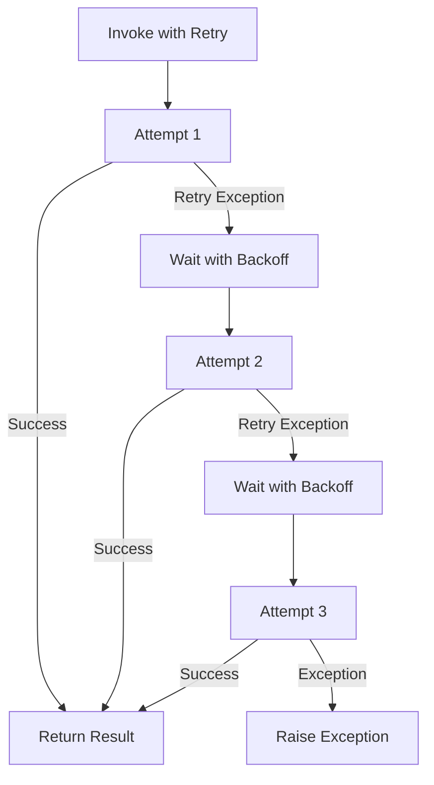
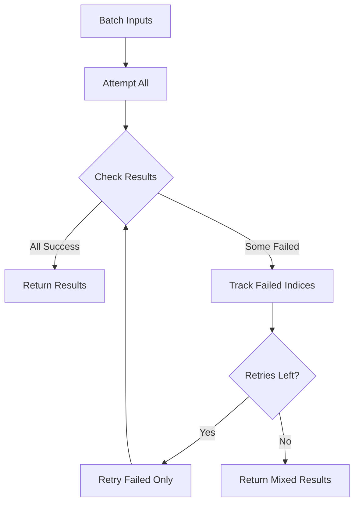

# Runnable Composition: Branch, Router, Fallbacks & Retry

## Introduction

LangChain's LCEL (LangChain Expression Language) provides powerful composition primitives that enable developers to build robust, fault-tolerant chains with conditional logic and error handling. This page covers four essential composition patterns: **RunnableBranch** for conditional routing based on evaluated conditions, **RouterRunnable** for key-based dispatching, **RunnableWithFallbacks** for graceful degradation when components fail, and **RunnableRetry** for automatic retry logic with exponential backoff. These primitives allow developers to create sophisticated LLM applications that can handle multiple execution paths, recover from transient failures, and provide resilient behavior in production environments.

All four components extend the base `Runnable` interface and support the full suite of invocation methods including `invoke`, `ainvoke`, `batch`, `abatch`, `stream`, and `astream`, making them composable with any other LCEL components.

Sources: [branch.py:1-20](../../../libs/core/langchain_core/runnables/branch.py#L1-L20), [router.py:1-20](../../../libs/core/langchain_core/runnables/router.py#L1-L20), [fallbacks.py:1-30](../../../libs/core/langchain_core/runnables/fallbacks.py#L1-L30), [retry.py:1-30](../../../libs/core/langchain_core/runnables/retry.py#L1-L30)

## RunnableBranch: Conditional Execution

### Overview

`RunnableBranch` is a `RunnableSerializable` that selects which branch to execute based on evaluated conditions. It evaluates a sequence of `(condition, runnable)` pairs in order and executes the first runnable whose condition returns `True`. If no conditions match, a default runnable is executed.

Sources: [branch.py:35-60](../../../libs/core/langchain_core/runnables/branch.py#L35-L60)

### Architecture



### Key Components

| Component | Type | Description |
|-----------|------|-------------|
| `branches` | `Sequence[tuple[Runnable[Input, bool], Runnable[Input, Output]]]` | List of (condition, runnable) pairs evaluated in order |
| `default` | `Runnable[Input, Output]` | Runnable executed when no condition evaluates to True |

Sources: [branch.py:62-66](../../../libs/core/langchain_core/runnables/branch.py#L62-L66)

### Initialization and Validation

The `RunnableBranch` constructor accepts a variable number of arguments where all but the last are `(condition, runnable)` tuples, and the last argument is the default runnable. The constructor performs several validations:

- Requires at least 2 branches (minimum of 1 conditional branch + 1 default)
- Validates that the default is a `Runnable`, `Callable`, or `Mapping`
- Ensures each branch is a tuple or list of exactly length 2
- Coerces conditions and runnables to `Runnable` instances using `coerce_to_runnable`

```python
def __init__(
    self,
    *branches: tuple[
        Runnable[Input, bool]
        | Callable[[Input], bool]
        | Callable[[Input], Awaitable[bool]],
        RunnableLike,
    ]
    | RunnableLike,
) -> None:
    if len(branches) < _MIN_BRANCHES:
        msg = "RunnableBranch requires at least two branches"
        raise ValueError(msg)
```

Sources: [branch.py:68-108](../../../libs/core/langchain_core/runnables/branch.py#L68-L108)

### Execution Flow

The `invoke` method evaluates conditions sequentially and executes the first matching branch:



Each condition and runnable execution is tracked with child callbacks tagged as `condition:N` and `branch:N` respectively, enabling detailed observability.

Sources: [branch.py:135-178](../../../libs/core/langchain_core/runnables/branch.py#L135-L178)

### Usage Example

```python
from langchain_core.runnables import RunnableBranch

branch = RunnableBranch(
    (lambda x: isinstance(x, str), lambda x: x.upper()),
    (lambda x: isinstance(x, int), lambda x: x + 1),
    (lambda x: isinstance(x, float), lambda x: x * 2),
    lambda x: "goodbye",
)

branch.invoke("hello")  # "HELLO"
branch.invoke(None)  # "goodbye"
```

Sources: [branch.py:45-58](../../../libs/core/langchain_core/runnables/branch.py#L45-L58)

### Streaming Support

`RunnableBranch` supports streaming through `stream()` and `astream()` methods. The implementation evaluates conditions to select a branch, then streams output from the selected runnable. It attempts to aggregate streamed chunks by adding them together, tracking whether aggregation is supported.

Sources: [branch.py:218-284](../../../libs/core/langchain_core/runnables/branch.py#L218-L284)

## RouterRunnable: Key-Based Routing

### Overview

`RouterRunnable` is a `RunnableSerializable` that routes inputs to different runnables based on a key specified in the input. Unlike `RunnableBranch` which evaluates conditions, `RouterRunnable` performs direct dictionary-based lookup.

Sources: [router.py:30-60](../../../libs/core/langchain_core/runnables/router.py#L30-L60)

### Input Format

The router expects a `RouterInput` typed dictionary with two keys:

| Field | Type | Description |
|-------|------|-------------|
| `key` | `str` | The key identifying which runnable to execute |
| `input` | `Any` | The actual input to pass to the selected runnable |

```python
class RouterInput(TypedDict):
    """Router input."""
    key: str
    """The key to route on."""
    input: Any
    """The input to pass to the selected `Runnable`."""
```

Sources: [router.py:38-44](../../../libs/core/langchain_core/runnables/router.py#L38-L44)

### Architecture



### Initialization

The constructor accepts a mapping of keys to runnables and coerces all values to `Runnable` instances:

```python
def __init__(
    self,
    runnables: Mapping[str, Runnable[Any, Output] | Callable[[Any], Output]],
) -> None:
    super().__init__(
        runnables={key: coerce_to_runnable(r) for key, r in runnables.items()}
    )
```

Sources: [router.py:61-73](../../../libs/core/langchain_core/runnables/router.py#L61-L73)

### Execution Methods

All execution methods (`invoke`, `ainvoke`, `batch`, `abatch`, `stream`, `astream`) follow the same pattern:

1. Extract the `key` and `input` from the input dictionary
2. Validate that the key exists in the `runnables` mapping
3. Delegate to the corresponding runnable's method

If the key is not found, a `ValueError` is raised with a descriptive message.

Sources: [router.py:88-106](../../../libs/core/langchain_core/runnables/router.py#L88-L106)

### Batch Processing

The `batch` and `abatch` methods optimize batch processing by grouping inputs by key and invoking each runnable once with all matching inputs:

```python
def batch(
    self,
    inputs: list[RouterInput],
    config: RunnableConfig | list[RunnableConfig] | None = None,
    *,
    return_exceptions: bool = False,
    **kwargs: Any | None,
) -> list[Output]:
    keys = [input_["key"] for input_ in inputs]
    actual_inputs = [input_["input"] for input_ in inputs]
    runnables = [self.runnables[key] for key in keys]
    # Execute with executor for parallel processing
```

Sources: [router.py:108-142](../../../libs/core/langchain_core/runnables/router.py#L108-L142)

### Usage Example

```python
from langchain_core.runnables.router import RouterRunnable
from langchain_core.runnables import RunnableLambda

add = RunnableLambda(func=lambda x: x + 1)
square = RunnableLambda(func=lambda x: x**2)

router = RouterRunnable(runnables={"add": add, "square": square})
router.invoke({"key": "square", "input": 3})  # Returns 9
```

Sources: [router.py:49-58](../../../libs/core/langchain_core/runnables/router.py#L49-L58)

## RunnableWithFallbacks: Error Recovery

### Overview

`RunnableWithFallbacks` wraps a primary runnable with a sequence of fallback runnables that are tried in order if the primary fails. This enables graceful degradation when external APIs experience issues or other transient failures occur.

Sources: [fallbacks.py:33-95](../../../libs/core/langchain_core/runnables/fallbacks.py#L33-L95)

### Configuration

| Attribute | Type | Default | Description |
|-----------|------|---------|-------------|
| `runnable` | `Runnable[Input, Output]` | Required | The primary runnable to execute first |
| `fallbacks` | `Sequence[Runnable[Input, Output]]` | Required | Sequence of fallback runnables tried in order |
| `exceptions_to_handle` | `tuple[type[BaseException], ...]` | `(Exception,)` | Exception types that trigger fallback logic |
| `exception_key` | `str \| None` | `None` | If set, exceptions are passed to fallbacks under this key |

Sources: [fallbacks.py:97-118](../../../libs/core/langchain_core/runnables/fallbacks.py#L97-L118)

### Exception Handling Flow



### Invoke Implementation

The `invoke` method iterates through the primary runnable and all fallbacks, catching specified exceptions:

```python
def invoke(
    self, input: Input, config: RunnableConfig | None = None, **kwargs: Any
) -> Output:
    first_error = None
    last_error = None
    for runnable in self.runnables:
        try:
            if self.exception_key and last_error is not None:
                input[self.exception_key] = last_error
            output = runnable.invoke(input, config, **kwargs)
        except self.exceptions_to_handle as e:
            if first_error is None:
                first_error = e
            last_error = e
        except BaseException as e:
            run_manager.on_chain_error(e)
            raise
        else:
            run_manager.on_chain_end(output)
            return output
    raise first_error
```

Sources: [fallbacks.py:153-194](../../../libs/core/langchain_core/runnables/fallbacks.py#L153-L194)

### Exception Key Feature

When `exception_key` is specified, the runnable passes the previous exception to subsequent fallbacks as part of the input dictionary. This allows fallbacks to access error information and potentially provide context-aware responses:

```python
if self.exception_key and last_error is not None:
    input[self.exception_key] = last_error
```

This feature requires that inputs be dictionaries when enabled.

Sources: [fallbacks.py:164-169](../../../libs/core/langchain_core/runnables/fallbacks.py#L164-L169)

### Batch Processing with Fallbacks

The `batch` method implements sophisticated fallback logic for batch operations:

1. Attempts to process all inputs with the primary runnable
2. Tracks which inputs succeeded and which failed
3. For failed inputs, retries with the next fallback
4. Continues until all inputs succeed or all fallbacks are exhausted
5. Returns results in the original input order



Sources: [fallbacks.py:235-297](../../../libs/core/langchain_core/runnables/fallbacks.py#L235-L297)

### Dynamic Method Forwarding

`RunnableWithFallbacks` implements `__getattr__` to forward method calls that return new runnables to both the primary and all fallback runnables. This enables chaining methods like `bind_tools()` across all runnables:

```python
def __getattr__(self, name: str) -> Any:
    attr = getattr(self.runnable, name)
    if _returns_runnable(attr):
        @wraps(attr)
        def wrapped(*args: Any, **kwargs: Any) -> Any:
            new_runnable = attr(*args, **kwargs)
            new_fallbacks = []
            for fallback in self.fallbacks:
                fallback_attr = getattr(fallback, name)
                new_fallbacks.append(fallback_attr(*args, **kwargs))
            return self.__class__(
                **{**self.model_dump(), "runnable": new_runnable, "fallbacks": new_fallbacks}
            )
        return wrapped
    return attr
```

Sources: [fallbacks.py:584-637](../../../libs/core/langchain_core/runnables/fallbacks.py#L584-L637)

### Usage Example

```python
from langchain_core.chat_models.openai import ChatOpenAI
from langchain_core.chat_models.anthropic import ChatAnthropic

model = ChatAnthropic(model="claude-sonnet-4-6").with_fallbacks(
    [ChatOpenAI(model="gpt-5.4-mini")]
)
# Will usually use ChatAnthropic, but fallback to ChatOpenAI
# if ChatAnthropic fails.
model.invoke("hello")
```

Sources: [fallbacks.py:69-78](../../../libs/core/langchain_core/runnables/fallbacks.py#L69-L78)

## RunnableRetry: Automatic Retry Logic

### Overview

`RunnableRetry` is a `RunnableBindingBase` that adds automatic retry logic with exponential backoff to any runnable. It's particularly useful for network calls to external APIs that may experience transient failures.

Sources: [retry.py:33-100](../../../libs/core/langchain_core/runnables/retry.py#L33-L100)

### Configuration Parameters

| Parameter | Type | Default | Description |
|-----------|------|---------|-------------|
| `retry_exception_types` | `tuple[type[BaseException], ...]` | `(Exception,)` | Exception types that trigger retry |
| `wait_exponential_jitter` | `bool` | `True` | Whether to add jitter to exponential backoff |
| `exponential_jitter_params` | `ExponentialJitterParams \| None` | `None` | Parameters for backoff: initial, max, exp_base, jitter |
| `max_attempt_number` | `int` | `3` | Maximum number of retry attempts |

Sources: [retry.py:102-122](../../../libs/core/langchain_core/runnables/retry.py#L102-L122)

### Exponential Backoff Configuration

The `ExponentialJitterParams` TypedDict defines parameters for the `tenacity.wait_exponential_jitter` strategy:

```python
class ExponentialJitterParams(TypedDict, total=False):
    """Parameters for `tenacity.wait_exponential_jitter`."""
    initial: float
    """Initial wait."""
    max: float
    """Maximum wait."""
    exp_base: float
    """Base for exponential backoff."""
    jitter: float
    """Random additional wait sampled from random.uniform(0, jitter)."""
```

Sources: [retry.py:25-35](../../../libs/core/langchain_core/runnables/retry.py#L25-L35)

### Retry Mechanism



### Tenacity Integration

`RunnableRetry` uses the `tenacity` library for retry logic, configuring it based on the instance parameters:

```python
@property
def _kwargs_retrying(self) -> dict[str, Any]:
    kwargs: dict[str, Any] = {}
    
    if self.max_attempt_number:
        kwargs["stop"] = stop_after_attempt(self.max_attempt_number)
    
    if self.wait_exponential_jitter:
        kwargs["wait"] = wait_exponential_jitter(
            **(self.exponential_jitter_params or {})
        )
    
    if self.retry_exception_types:
        kwargs["retry"] = retry_if_exception_type(self.retry_exception_types)
    
    return kwargs
```

Sources: [retry.py:124-140](../../../libs/core/langchain_core/runnables/retry.py#L124-L140)

### Invoke with Retry

The `_invoke` method wraps the parent's invoke in a retry loop using tenacity's `Retrying` context manager:

```python
def _invoke(
    self,
    input_: Input,
    run_manager: "CallbackManagerForChainRun",
    config: RunnableConfig,
    **kwargs: Any,
) -> Output:
    for attempt in self._sync_retrying(reraise=True):
        with attempt:
            result = super().invoke(
                input_,
                self._patch_config(config, run_manager, attempt.retry_state),
                **kwargs,
            )
        if attempt.retry_state.outcome and not attempt.retry_state.outcome.failed:
            attempt.retry_state.set_result(result)
    return result
```

Each retry attempt is tracked with a callback tag `retry:attempt:N` for observability.

Sources: [retry.py:161-177](../../../libs/core/langchain_core/runnables/retry.py#L161-L177)

### Batch Retry Logic

The batch retry implementation is sophisticated, tracking which inputs succeeded and retrying only the failed ones:



The implementation maintains a `results_map` dictionary to track successful executions and only retries inputs that haven't succeeded yet:

```python
def _batch(
    self,
    inputs: list[Input],
    run_manager: list["CallbackManagerForChainRun"],
    config: list[RunnableConfig],
    **kwargs: Any,
) -> list[Output | Exception]:
    results_map: dict[int, Output] = {}
    
    for attempt in self._sync_retrying():
        with attempt:
            remaining_indices = [
                i for i in range(len(inputs)) if i not in results_map
            ]
            if not remaining_indices:
                break
            # Process only remaining inputs
            pending_inputs = [inputs[i] for i in remaining_indices]
            result = super().batch(pending_inputs, ...)
            # Map successful results back to original indices
```

Sources: [retry.py:193-244](../../../libs/core/langchain_core/runnables/retry.py#L193-L244)

### Usage Example

```python
from langchain_core.runnables import RunnableLambda

def foo(input) -> None:
    '''Fake function that raises an exception.'''
    raise ValueError(f"Invoking foo failed. At time {time.time()}")

runnable = RunnableLambda(foo)

runnable_with_retries = runnable.with_retry(
    retry_if_exception_type=(ValueError,),
    wait_exponential_jitter=True,
    stop_after_attempt=2,
    exponential_jitter_params={"initial": 2},
)
```

Sources: [retry.py:46-65](../../../libs/core/langchain_core/runnables/retry.py#L46-L65)

### Streaming Behavior

Unlike other methods, `stream()` and `transform()` are intentionally **not retried** because retrying a stream is not intuitive - partial results may have already been yielded to the consumer.

Sources: [retry.py:319-321](../../../libs/core/langchain_core/runnables/retry.py#L319-L321)

## Best Practices

### Scope of Retry Logic

Keep retry logic scoped to the specific component likely to fail rather than wrapping entire chains:

```python
# Good: Retry only the model call
chain = template | model.with_retry()

# Bad: Retry the entire chain
chain = template | model
retryable_chain = chain.with_retry()
```

Sources: [retry.py:89-100](../../../libs/core/langchain_core/runnables/retry.py#L89-L100)

### Choosing Exceptions to Retry

Only retry on transient errors like network issues or rate limits (5xx server errors, 429 Too Many Requests), not on permanent failures like invalid inputs or authentication errors.

Sources: [retry.py:102-109](../../../libs/core/langchain_core/runnables/retry.py#L102-L109)

### Combining Patterns

These composition primitives can be combined for sophisticated control flow:

```python
from langchain_core.runnables import RunnableBranch

# Branch with fallbacks on each path
branch = RunnableBranch(
    (condition1, runnable1.with_fallbacks([fallback1]).with_retry()),
    (condition2, runnable2.with_fallbacks([fallback2]).with_retry()),
    default_runnable.with_retry()
)
```

## Summary

LangChain's composition primitives provide powerful tools for building robust LLM applications. `RunnableBranch` enables conditional logic based on evaluated conditions, `RouterRunnable` provides efficient key-based routing, `RunnableWithFallbacks` ensures graceful degradation through fallback chains, and `RunnableRetry` adds automatic retry with exponential backoff. All four components are fully integrated with LCEL, support all invocation methods (sync, async, batch, streaming), and provide comprehensive callback integration for observability. These primitives can be combined to create sophisticated control flow patterns that handle real-world production scenarios including API failures, rate limits, and conditional processing paths.

Sources: [branch.py](../../../libs/core/langchain_core/runnables/branch.py), [router.py](../../../libs/core/langchain_core/runnables/router.py), [fallbacks.py](../../../libs/core/langchain_core/runnables/fallbacks.py), [retry.py](../../../libs/core/langchain_core/runnables/retry.py), [history.py](../../../libs/core/langchain_core/runnables/history.py)