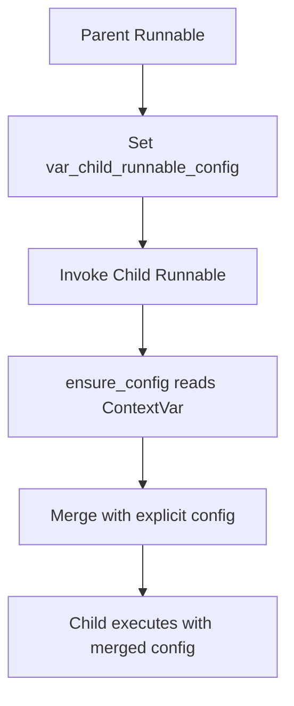
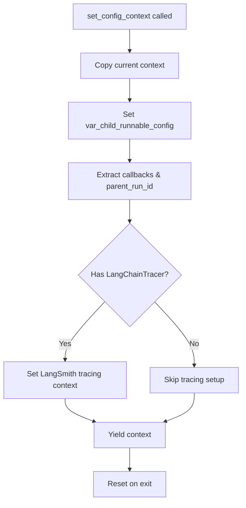
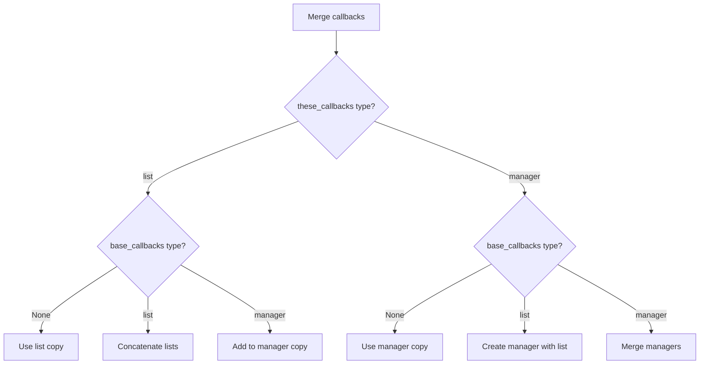
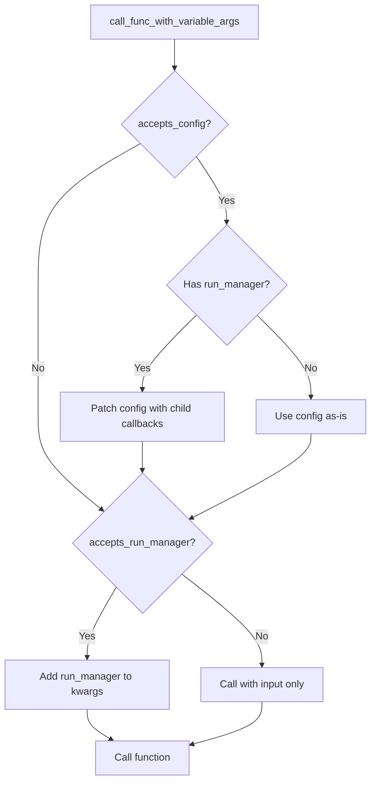
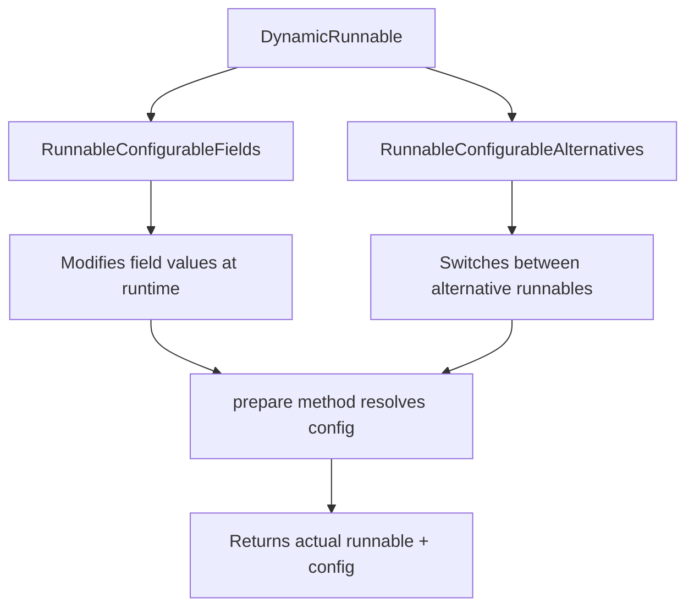
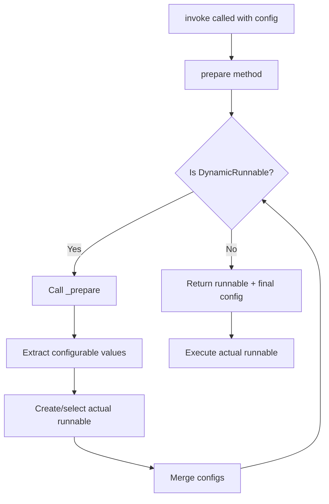

# Runnable Configuration & Execution Context

The Runnable Configuration & Execution Context system provides a comprehensive framework for managing runtime behavior, execution parameters, and contextual information across LangChain's composable `Runnable` objects. This system enables fine-grained control over how chains, agents, and other components execute, including callback management, concurrency limits, recursion controls, and dynamic configuration of runnable properties. The configuration mechanism supports both explicit parameter passing and implicit context propagation through Python's `ContextVar` system, allowing parent runnables to automatically share configuration with their children without explicit parameter threading.

Sources: [config.py:1-10](../../../libs/core/langchain_core/runnables/config.py#L1-L10), [config.py:53-124](../../../libs/core/langchain_core/runnables/config.py#L53-L124)

## RunnableConfig Structure

The `RunnableConfig` is a `TypedDict` that serves as the central configuration object for all runnable executions. It uses `total=False` to allow partial configurations that can be merged together, supporting both explicit configuration and automatic propagation through the execution context.

### Core Configuration Fields

| Field | Type | Description | Default |
|-------|------|-------------|---------|
| `tags` | `list[str]` | Tags for filtering and organizing calls across the execution tree | `[]` |
| `metadata` | `dict[str, Any]` | JSON-serializable metadata passed to callbacks and tracing | `{}` |
| `callbacks` | `Callbacks` | Callback handlers for the execution (list, manager, or None) | `None` |
| `run_name` | `str` | Custom name for the tracer run | Class name |
| `max_concurrency` | `int \| None` | Maximum parallel calls allowed | ThreadPoolExecutor default |
| `recursion_limit` | `int` | Maximum recursion depth to prevent infinite loops | `25` |
| `configurable` | `dict[str, Any]` | Runtime values for dynamically configurable fields | `{}` |
| `run_id` | `uuid.UUID \| None` | Unique identifier for the tracer run | Auto-generated |

Sources: [config.py:53-124](../../../libs/core/langchain_core/runnables/config.py#L53-L124), [config.py:126-140](../../../libs/core/langchain_core/runnables/config.py#L126-L140)

### Configuration Key Categories

The system distinguishes between different types of configuration keys for proper merging and propagation behavior:

```python
CONFIG_KEYS = [
    "tags",
    "metadata",
    "callbacks",
    "run_name",
    "max_concurrency",
    "recursion_limit",
    "configurable",
    "run_id",
]

COPIABLE_KEYS = [
    "tags",
    "metadata",
    "callbacks",
    "configurable",
]
```

`COPIABLE_KEYS` are deep-copied during configuration merging to prevent unintended mutations across execution contexts.

Sources: [config.py:126-140](../../../libs/core/langchain_core/runnables/config.py#L126-L140)

## Context Propagation System

The configuration system uses Python's `ContextVar` mechanism to automatically propagate configuration from parent to child runnables without explicit parameter passing. This enables a clean API where child components automatically inherit relevant configuration.



Sources: [config.py:156-158](../../../libs/core/langchain_core/runnables/config.py#L156-L158), [config.py:195-228](../../../libs/core/langchain_core/runnables/config.py#L195-L228)

### Context Variable Management

The global context variable `var_child_runnable_config` stores the configuration that should be inherited by child runnables:

```python
var_child_runnable_config: ContextVar[RunnableConfig | None] = ContextVar(
    "child_runnable_config", default=None
)
```

The `set_config_context` function manages both the configuration context and LangSmith tracing context:



Sources: [config.py:195-228](../../../libs/core/langchain_core/runnables/config.py#L195-L228), [config.py:161-193](../../../libs/core/langchain_core/runnables/config.py#L161-L193)

### Configuration Merging with ensure_config

The `ensure_config` function is the central mechanism for creating a complete configuration by merging defaults, context variables, and explicit parameters:

```python
def ensure_config(config: RunnableConfig | None = None) -> RunnableConfig:
    """Ensure that a config is a dict with all keys present."""
    empty = RunnableConfig(
        tags=[],
        metadata={},
        callbacks=None,
        recursion_limit=DEFAULT_RECURSION_LIMIT,
        configurable={},
    )
    if var_config := var_child_runnable_config.get():
        empty.update(...)
    if config is not None:
        empty.update(...)
    return empty
```

The merge order is: defaults → context variable → explicit config, with special handling for `COPIABLE_KEYS` to prevent mutation.

Sources: [config.py:230-269](../../../libs/core/langchain_core/runnables/config.py#L230-L269)

## Configuration Operations

### Patching Configurations

The `patch_config` function creates a modified copy of a configuration with specific overrides:

```python
def patch_config(
    config: RunnableConfig | None,
    *,
    callbacks: BaseCallbackManager | None = None,
    recursion_limit: int | None = None,
    max_concurrency: int | None = None,
    run_name: str | None = None,
    configurable: dict[str, Any] | None = None,
) -> RunnableConfig:
```

When callbacks are replaced, `run_name` and `run_id` are automatically cleared to prevent mismatched tracing information.

Sources: [config.py:298-333](../../../libs/core/langchain_core/runnables/config.py#L298-L333)

### Merging Multiple Configurations

The `merge_configs` function combines multiple configurations with sophisticated merge logic for different field types:

| Field Type | Merge Strategy |
|------------|----------------|
| `metadata` | Dictionary merge (later values override) |
| `tags` | Union of all tags, sorted and deduplicated |
| `configurable` | Dictionary merge (later values override) |
| `callbacks` | Complex merging supporting list and manager combinations |
| `recursion_limit` | Use non-default value if present |
| Other fields | Later non-null values override earlier ones |

Sources: [config.py:336-392](../../../libs/core/langchain_core/runnables/config.py#L336-L392)

### Callback Merging Logic

The callbacks field requires special handling due to supporting three types: `None`, `list[handler]`, or callback manager:



Sources: [config.py:355-377](../../../libs/core/langchain_core/runnables/config.py#L355-L377)

## Batch Configuration Handling

The `get_config_list` function standardizes configuration handling for batch operations, supporting both single and per-input configurations:

```python
def get_config_list(
    config: RunnableConfig | Sequence[RunnableConfig] | None, length: int
) -> list[RunnableConfig]:
```

Special handling ensures that `run_id` is only used for the first element when a single config with `run_id` is provided for multiple inputs, preventing duplicate run IDs.

Sources: [config.py:272-295](../../../libs/core/langchain_core/runnables/config.py#L272-L295)

## Callback Manager Integration

The configuration system provides factory functions to create callback managers from configurations, ensuring proper inheritance of tags, metadata, and callbacks:

```python
def get_callback_manager_for_config(config: RunnableConfig) -> CallbackManager:
    return CallbackManager.configure(
        inheritable_callbacks=config.get("callbacks"),
        inheritable_tags=config.get("tags"),
        inheritable_metadata=config.get("metadata"),
        langsmith_inheritable_metadata=_get_langsmith_inheritable_metadata_from_config(
            config
        ),
    )
```

The system automatically extracts LangSmith-compatible metadata from the `configurable` dict, excluding sensitive keys like `api_key`.

Sources: [config.py:470-502](../../../libs/core/langchain_core/runnables/config.py#L470-L502), [config.py:143-153](../../../libs/core/langchain_core/runnables/config.py#L143-L153)

## Variable Argument Function Calls

The system provides utilities to call functions that may optionally accept `config` and/or `run_manager` parameters, enabling backward compatibility and flexible API design:



Sources: [config.py:395-432](../../../libs/core/langchain_core/runnables/config.py#L395-L432), [config.py:435-467](../../../libs/core/langchain_core/runnables/config.py#L435-L467)

## Concurrency Management

### ContextThreadPoolExecutor

The `ContextThreadPoolExecutor` extends Python's `ThreadPoolExecutor` to copy the current execution context to worker threads, ensuring that `ContextVar` values (including `var_child_runnable_config`) are preserved:

```python
class ContextThreadPoolExecutor(ThreadPoolExecutor):
    def submit(self, func: Callable[P, T], *args: P.args, **kwargs: P.kwargs) -> Future[T]:
        return super().submit(
            cast("Callable[..., T]", partial(copy_context().run, func, *args, **kwargs))
        )
```

This ensures that child runnables executed in thread pools maintain access to their parent's configuration context.

Sources: [config.py:505-545](../../../libs/core/langchain_core/runnables/config.py#L505-L545)

### Executor Factory

The `get_executor_for_config` context manager creates executors with appropriate concurrency limits:

```python
@contextmanager
def get_executor_for_config(
    config: RunnableConfig | None,
) -> Generator[Executor, None, None]:
    config = config or {}
    with ContextThreadPoolExecutor(
        max_workers=config.get("max_concurrency")
    ) as executor:
        yield executor
```

Sources: [config.py:548-562](../../../libs/core/langchain_core/runnables/config.py#L548-L562)

### Async Execution with Context

The `run_in_executor` function handles async execution of sync functions while preserving context and handling `StopIteration` exceptions:

```python
async def run_in_executor(
    executor_or_config: Executor | RunnableConfig | None,
    func: Callable[P, T],
    *args: P.args,
    **kwargs: P.kwargs,
) -> T:
    def wrapper() -> T:
        try:
            return func(*args, **kwargs)
        except StopIteration as exc:
            # StopIteration can't be set on an asyncio.Future
            raise RuntimeError from exc
```

Sources: [config.py:565-590](../../../libs/core/langchain_core/runnables/config.py#L565-L590)

## Dynamic Configuration with Configurable Fields

The configurable system allows runnables to expose fields that can be modified at runtime without creating new instances. This is implemented through the `DynamicRunnable` hierarchy.

### DynamicRunnable Architecture



Sources: [configurable.py:35-70](../../../libs/core/langchain_core/runnables/configurable.py#L35-L70)

### RunnableConfigurableFields

This class enables runtime modification of runnable attributes through the configuration system:

```python
class RunnableConfigurableFields(DynamicRunnable[Input, Output]):
    fields: dict[str, AnyConfigurableField]
    
    def _prepare(
        self, config: RunnableConfig | None = None
    ) -> tuple[Runnable[Input, Output], RunnableConfig]:
        config = ensure_config(config)
        specs_by_id = {spec.id: (key, spec) for key, spec in self.fields.items()}
        configurable_fields = {
            specs_by_id[k][0]: v
            for k, v in config.get("configurable", {}).items()
            if k in specs_by_id and isinstance(specs_by_id[k][1], ConfigurableField)
        }
```

The `prepare` method extracts configured values from `config["configurable"]` and creates a new instance with those values.

Sources: [configurable.py:245-313](../../../libs/core/langchain_core/runnables/configurable.py#L245-L313)

### Configuration Specifications

Three types of configurable field specifications are supported:

| Type | Description | Use Case |
|------|-------------|----------|
| `ConfigurableField` | Simple field with runtime value | Temperature, model name, etc. |
| `ConfigurableFieldSingleOption` | Single choice from predefined options | Model selection from enum |
| `ConfigurableFieldMultiOption` | Multiple choices from options | Multiple retriever sources |

Sources: [utils.py:740-807](../../../libs/core/langchain_core/runnables/utils.py#L740-L807)

### RunnableConfigurableAlternatives

This class enables switching between entirely different runnable implementations at runtime:

```python
class RunnableConfigurableAlternatives(DynamicRunnable[Input, Output]):
    which: ConfigurableField
    alternatives: dict[str, Runnable[Input, Output] | Callable[[], Runnable[Input, Output]]]
    default_key: str = "default"
    prefix_keys: bool
```

The `which` field determines which alternative to use, with optional key prefixing to namespace configurations for different alternatives.

Sources: [configurable.py:384-444](../../../libs/core/langchain_core/runnables/configurable.py#L384-L444)

### Preparation Flow



Sources: [configurable.py:103-111](../../../libs/core/langchain_core/runnables/configurable.py#L103-L111)

## Execution Method Implementations

The `DynamicRunnable` class implements all standard runnable methods by delegating to the prepared runnable:

### Synchronous Invocation

```python
def invoke(
    self, input: Input, config: RunnableConfig | None = None, **kwargs: Any
) -> Output:
    runnable, config = self.prepare(config)
    return runnable.invoke(input, config, **kwargs)
```

### Batch Processing

For batch operations, the system optimizes by checking if all inputs resolve to the same default runnable:

```python
def batch(self, inputs: list[Input], config: ..., **kwargs) -> list[Output]:
    configs = get_config_list(config, len(inputs))
    prepared = [self.prepare(c) for c in configs]
    
    if all(p is self.default for p, _ in prepared):
        return self.default.batch(inputs, [c for _, c in prepared], **kwargs)
```

Sources: [configurable.py:113-183](../../../libs/core/langchain_core/runnables/configurable.py#L113-L183)

## Rate Limiting Integration

While not directly part of the configuration system, rate limiters integrate with the execution context through the runnable invocation flow. The `BaseRateLimiter` provides both sync and async token acquisition:

```python
class BaseRateLimiter(abc.ABC):
    @abc.abstractmethod
    def acquire(self, *, blocking: bool = True) -> bool:
        """Attempt to acquire the necessary tokens for the rate limiter."""
    
    @abc.abstractmethod
    async def aacquire(self, *, blocking: bool = True) -> bool:
        """Async version of acquire."""
```

The `InMemoryRateLimiter` implements a token bucket algorithm with thread-safe token consumption.

Sources: [rate_limiters.py:1-10](../../../libs/core/langchain_core/rate_limiters.py#L1-L10), [rate_limiters.py:13-56](../../../libs/core/langchain_core/rate_limiters.py#L13-L56)

## Global Settings

LangChain provides global settings that affect execution behavior across all runnables:

```python
# Global variables
_verbose: bool = False
_debug: bool = False
_llm_cache: Optional["BaseCache"] = None

# Accessor functions
def get_verbose() -> bool: ...
def set_verbose(value: bool) -> None: ...
def get_debug() -> bool: ...
def set_debug(value: bool) -> None: ...
def get_llm_cache() -> Optional["BaseCache"]: ...
def set_llm_cache(value: Optional["BaseCache"]) -> None: ...
```

These settings are accessed through getter/setter functions to ensure proper behavior with concurrent usage.

Sources: [globals.py:1-67](../../../libs/core/langchain_core/globals.py#L1-L67)

## Summary

The Runnable Configuration & Execution Context system provides a sophisticated, multi-layered approach to managing runtime behavior in LangChain applications. Through the combination of explicit configuration parameters, automatic context propagation via `ContextVar`, and dynamic configuration capabilities, the system enables both simple and complex execution patterns. The configuration merging logic ensures predictable behavior when combining configurations from multiple sources, while the context-aware thread pool executor maintains configuration consistency across concurrent executions. The dynamic configuration system (configurable fields and alternatives) allows for flexible, runtime-adaptable components without sacrificing type safety or execution efficiency. This architecture supports LangChain's composable design philosophy by ensuring that configuration flows naturally through chains of runnables while still allowing fine-grained control when needed.