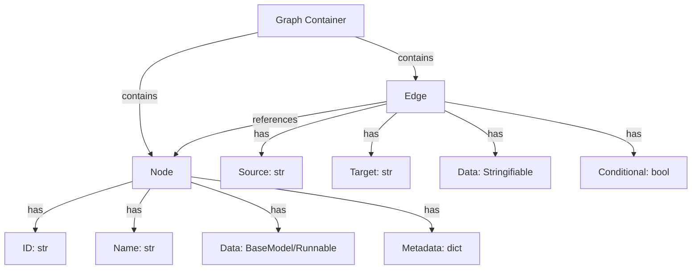
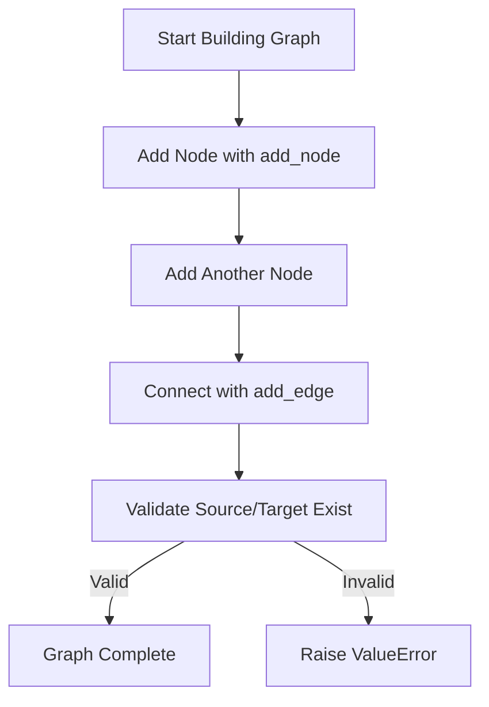
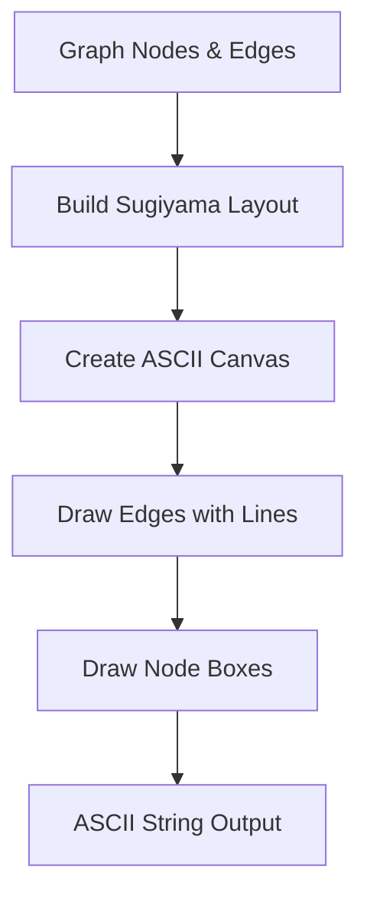
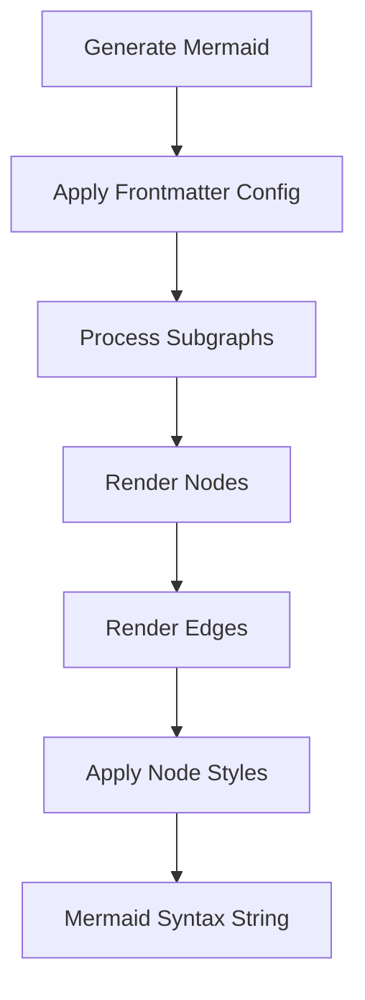
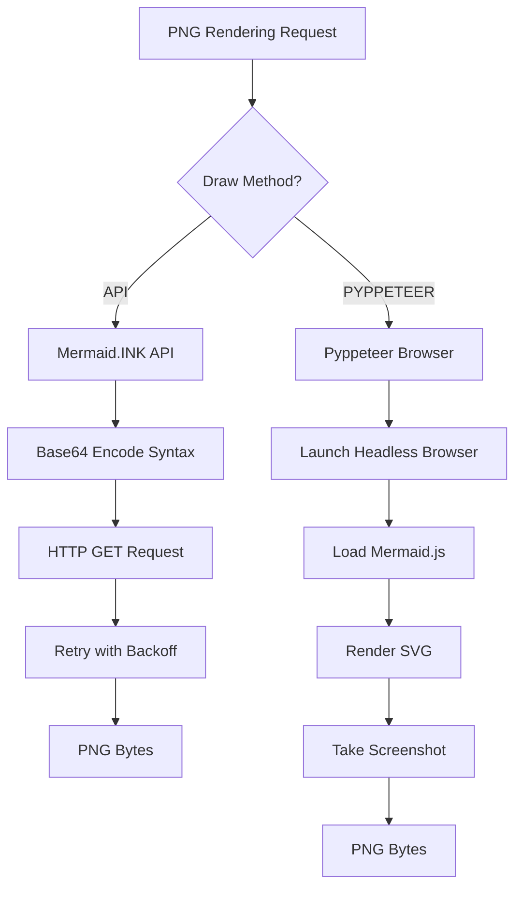
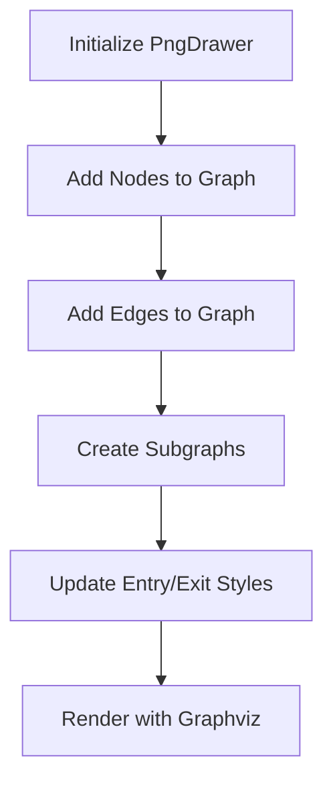

# Runnable Graph Visualization

The Runnable Graph Visualization system in LangChain provides a comprehensive framework for representing, manipulating, and rendering execution graphs of `Runnable` objects. This system enables developers to visualize the structure and flow of complex LangChain applications, including chains, agents, and workflows, through multiple output formats including ASCII art, PNG images, and Mermaid diagrams. The visualization capabilities are essential for debugging, documentation, and understanding the composition of LLM-powered applications built with LangChain's Expression Language (LCEL).

The core visualization infrastructure is built around a `Graph` data structure that maintains nodes and edges representing the computational flow. This graph can be exported to various formats, making it accessible for different use cases from terminal-based debugging to web-based documentation.

Sources: [graph.py:1-50](../../../libs/core/langchain_core/runnables/graph.py#L1-L50)

## Core Graph Data Structure

### Graph Components

The graph system is built on three fundamental components that work together to represent the structure of Runnable objects:



| Component | Description | Key Attributes |
|-----------|-------------|----------------|
| **Node** | Represents a single step or component in the execution graph | `id`, `name`, `data`, `metadata` |
| **Edge** | Represents a connection between two nodes | `source`, `target`, `data`, `conditional` |
| **Graph** | Container for nodes and edges with manipulation methods | `nodes` (dict), `edges` (list) |

Sources: [graph.py:65-120](../../../libs/core/langchain_core/runnables/graph.py#L65-L120)

### Node Structure

The `Node` class is implemented as a `NamedTuple` providing immutable node representations with the following structure:

```python
class Node(NamedTuple):
    id: str
    name: str
    data: type[BaseModel] | RunnableType | None
    metadata: dict[str, Any] | None
```

Nodes can represent different types of data:
- **Schema nodes**: Pydantic BaseModel classes representing input/output schemas
- **Runnable nodes**: Actual Runnable objects in the execution chain
- **Unknown nodes**: Other data types or placeholder nodes

Sources: [graph.py:83-110](../../../libs/core/langchain_core/runnables/graph.py#L83-L110)

### Edge Structure

Edges define the flow between nodes and support conditional branching:

```python
class Edge(NamedTuple):
    source: str
    target: str
    data: Stringifiable | None = None
    conditional: bool = False
```

The `conditional` flag distinguishes between deterministic edges (solid lines in visualizations) and conditional branches (dotted lines), which is crucial for representing complex control flow in agent systems.

Sources: [graph.py:65-81](../../../libs/core/langchain_core/runnables/graph.py#L65-L81)

## Graph Construction and Manipulation

### Building Graphs

The `Graph` class provides methods for programmatically constructing graph representations:

| Method | Purpose | Returns |
|--------|---------|---------|
| `add_node()` | Adds a new node to the graph | `Node` |
| `add_edge()` | Adds an edge between two existing nodes | `Edge` |
| `remove_node()` | Removes a node and all connected edges | `None` |
| `extend()` | Merges another graph into the current one | `tuple[Node, Node]` |



The `add_node()` method automatically generates unique UUIDs for node identification if not provided, ensuring no ID collisions:

```python
def add_node(
    self,
    data: type[BaseModel] | RunnableType | None,
    id: str | None = None,
    *,
    metadata: dict[str, Any] | None = None,
) -> Node:
    if id is not None and id in self.nodes:
        msg = f"Node with id {id} already exists"
        raise ValueError(msg)
    id_ = id or self.next_id()
    node = Node(id=id_, data=data, metadata=metadata, name=node_data_str(id_, data))
    self.nodes[node.id] = node
    return node
```

Sources: [graph.py:240-280](../../../libs/core/langchain_core/runnables/graph.py#L240-L280)

### Graph Traversal and Analysis

The graph provides utility methods to identify entry and exit points:

- **`first_node()`**: Identifies the single node with no incoming edges (the entry point)
- **`last_node()`**: Identifies the single node with no outgoing edges (the exit point)
- **`trim_first_node()`**: Removes the first node if it can be safely removed
- **`trim_last_node()`**: Removes the last node if it can be safely removed

These methods are essential for graph normalization and visualization, ensuring that schema nodes can be trimmed when they don't add semantic value to the visual representation.

Sources: [graph.py:341-384](../../../libs/core/langchain_core/runnables/graph.py#L341-L384), [graph.py:579-618](../../../libs/core/langchain_core/runnables/graph.py#L579-L618)

## ASCII Visualization

### ASCII Canvas System

The ASCII visualization system uses a custom canvas-based rendering approach with the Sugiyama layout algorithm for hierarchical graph drawing:



The `AsciiCanvas` class provides primitive drawing operations:

| Method | Purpose | Parameters |
|--------|---------|------------|
| `point()` | Draw a single character | `x`, `y`, `char` |
| `line()` | Draw a line between two points | `x0`, `y0`, `x1`, `y1`, `char` |
| `text()` | Draw text starting at a position | `x`, `y`, `text` |
| `box()` | Draw a rectangular box | `x0`, `y0`, `width`, `height` |

Sources: [graph_ascii.py:50-145](../../../libs/core/langchain_core/runnables/graph_ascii.py#L50-L145)

### Layout Algorithm

The ASCII renderer uses the `grandalf` library to compute optimal node positions using the Sugiyama layout algorithm, which minimizes edge crossings in hierarchical graphs:

```python
sug = SugiyamaLayout(graph.C[0])
graph = graph.C[0]
roots = list(filter(lambda x: len(x.e_in()) == 0, graph.sV))

sug.init_all(roots=roots, optimize=True)
sug.yspace = VertexViewer.HEIGHT
sug.xspace = minw
sug.route_edge = route_with_lines
sug.draw()
```

The layout respects vertex dimensions defined by `VertexViewer`, which calculates box boundaries based on node label lengths. Edges are drawn before boxes to ensure node labels remain visible and unobstructed.

Sources: [graph_ascii.py:147-180](../../../libs/core/langchain_core/runnables/graph_ascii.py#L147-L180), [graph_ascii.py:183-255](../../../libs/core/langchain_core/runnables/graph_ascii.py#L183-L255)

## Mermaid Visualization

### Mermaid Syntax Generation

The Mermaid visualization system generates Mermaid.js-compatible graph syntax with support for advanced features:

**Key Features:**
- Subgraph support for nested components
- Conditional edge styling (solid vs. dotted lines)
- Node metadata rendering
- Customizable curve styles and themes
- Frontmatter configuration for theme customization



The `draw_mermaid()` function supports extensive customization:

| Parameter | Type | Purpose | Default |
|-----------|------|---------|---------|
| `with_styles` | `bool` | Include styling information | `True` |
| `curve_style` | `CurveStyle` | Edge curve style | `LINEAR` |
| `node_colors` | `NodeStyles` | Custom node colors | `None` |
| `wrap_label_n_words` | `int` | Words per line in labels | `9` |
| `frontmatter_config` | `dict` | Mermaid theme configuration | `None` |

Sources: [graph_mermaid.py:48-110](../../../libs/core/langchain_core/runnables/graph_mermaid.py#L48-L110)

### Subgraph Handling

The Mermaid renderer intelligently groups nodes into subgraphs based on colon-separated prefixes in node IDs:

```python
for key, node in nodes.items():
    if ":" in key:
        prefix = ":".join(key.split(":")[:-1])
        subgraph_nodes.setdefault(prefix, {})[key] = node
    else:
        regular_nodes[key] = node
```

This enables visualization of nested workflows and parallel execution branches. The system prevents duplicate subgraphs and properly nests multi-level hierarchies.

Sources: [graph_mermaid.py:130-155](../../../libs/core/langchain_core/runnables/graph_mermaid.py#L130-L155)

### Safe ID Generation

To ensure Mermaid compatibility with special characters and Unicode, the system converts node labels to safe identifiers:

```python
def _to_safe_id(label: str) -> str:
    allowed = string.ascii_letters + string.digits + "_-"
    out = [ch if ch in allowed else "\\" + format(ord(ch), "x") for ch in label]
    return "".join(out)
```

This allows graphs to include nodes with names in any language or containing special characters without breaking Mermaid syntax.

Sources: [graph_mermaid.py:260-272](../../../libs/core/langchain_core/runnables/graph_mermaid.py#L260-L272)

## PNG Rendering

### Rendering Methods

The system supports two distinct methods for rendering graphs as PNG images:



| Method | Advantages | Requirements | Use Case |
|--------|-----------|--------------|----------|
| **API** | No local dependencies, fast | Internet connection | Default, CI/CD pipelines |
| **PYPPETEER** | Offline rendering, no rate limits | `pyppeteer` package | Air-gapped environments |

Sources: [graph_mermaid.py:277-319](../../../libs/core/langchain_core/runnables/graph_mermaid.py#L277-L319)

### API Rendering with Retry Logic

The API method uses the Mermaid.INK service with exponential backoff retry logic:

```python
for attempt in range(max_retries + 1):
    try:
        response = requests.get(image_url, timeout=10, proxies=proxies)
        if response.status_code == requests.codes.ok:
            return response.content
        
        if (requests.codes.internal_server_error <= response.status_code 
            and attempt < max_retries):
            sleep_time = retry_delay * (2**attempt) * (0.5 + 0.5 * random.random())
            time.sleep(sleep_time)
            continue
    except (requests.RequestException, requests.Timeout) as e:
        # Retry logic...
```

The system supports custom base URLs for self-hosted Mermaid rendering services, with proper security considerations for SSRF prevention.

Sources: [graph_mermaid.py:407-490](../../../libs/core/langchain_core/runnables/graph_mermaid.py#L407-L490)

### Pyppeteer Browser Rendering

The Pyppeteer method provides full offline rendering capabilities:

```python
async def _render_mermaid_using_pyppeteer(
    mermaid_syntax: str,
    output_file_path: str | None = None,
    background_color: str | None = "white",
    padding: int = 10,
    device_scale_factor: int = 3,
) -> bytes:
    browser = await launch()
    page = await browser.newPage()
    
    await page.goto("about:blank")
    await page.addScriptTag(
        {"url": "https://cdn.jsdelivr.net/npm/mermaid/dist/mermaid.min.js"}
    )
    # Render and screenshot...
```

This method uses a headless Chrome instance to render the Mermaid diagram with high DPI support (`device_scale_factor: 3`) for crisp images.

Sources: [graph_mermaid.py:321-375](../../../libs/core/langchain_core/runnables/graph_mermaid.py#L321-L375)

## GraphViz PNG Rendering

### PngDrawer Implementation

The `PngDrawer` class provides an alternative PNG rendering approach using Pygraphviz and Graphviz:



The drawer supports custom label overrides through the `LabelsDict` structure:

```python
class PngDrawer:
    def __init__(
        self,
        fontname: str | None = None,
        labels: LabelsDict | None = None
    ) -> None:
        self.fontname = fontname or "arial"
        self.labels = labels or LabelsDict(nodes={}, edges={})
```

Sources: [graph_png.py:18-60](../../../libs/core/langchain_core/runnables/graph_png.py#L18-L60)

### Styling and Customization

The PngDrawer applies distinct visual styles to different node types:

| Node Type | Fill Color | Purpose |
|-----------|-----------|---------|
| Default | Yellow | Standard nodes |
| First Node | Light Blue | Entry point |
| Last Node | Orange | Exit point |

Edges can be styled as solid (deterministic) or dotted (conditional), with custom labels rendered in underlined format.

Sources: [graph_png.py:62-107](../../../libs/core/langchain_core/runnables/graph_png.py#L62-L107)

## JSON Serialization

### Export Format

The graph system provides JSON serialization for programmatic access and integration:

```python
def to_json(self, *, with_schemas: bool = False) -> dict[str, list[dict[str, Any]]]:
    stable_node_ids = {
        node.id: i if is_uuid(node.id) else node.id
        for i, node in enumerate(self.nodes.values())
    }
    
    return {
        "nodes": [
            {
                "id": stable_node_ids[node.id],
                **node_data_json(node, with_schemas=with_schemas),
            }
            for node in self.nodes.values()
        ],
        "edges": edges,
    }
```

The serialization system converts UUID-based node IDs to stable integer indices for consistent output, while preserving custom node IDs. The `with_schemas` parameter controls whether full Pydantic schemas are included for schema nodes.

Sources: [graph.py:215-238](../../../libs/core/langchain_core/runnables/graph.py#L215-L238)

### Node Data Serialization

The `node_data_json()` function handles different node data types appropriately:

**Node Data Types:**
- **Runnable nodes**: Serialized with LangChain ID and name
- **Schema nodes**: Can include full JSON schema or just name
- **Unknown nodes**: Serialized as string representation

```python
def node_data_json(
    node: Node, *, with_schemas: bool = False
) -> dict[str, str | dict[str, Any]]:
    if isinstance(node.data, RunnableSerializable):
        json = {
            "type": "runnable",
            "data": {
                "id": node.data.lc_id(),
                "name": node_data_str(node.id, node.data),
            },
        }
    elif inspect.isclass(node.data) and is_basemodel_subclass(node.data):
        json = (
            {"type": "schema", "data": node.data.model_json_schema(...)}
            if with_schemas
            else {"type": "schema", "data": node_data_str(node.id, node.data)}
        )
    # Additional cases...
```

Sources: [graph.py:159-213](../../../libs/core/langchain_core/runnables/graph.py#L159-L213)

## Configuration and Customization

### Curve Styles

The Mermaid renderer supports 12 different curve styles for edge rendering:

| Curve Style | Description | Visual Effect |
|-------------|-------------|---------------|
| `BASIS` | B-spline curve | Smooth curves |
| `LINEAR` | Straight lines | Direct connections |
| `STEP` | Step function | Right-angle transitions |
| `CARDINAL` | Cardinal spline | Controlled smoothness |
| `CATMULL_ROM` | Catmull-Rom spline | Smooth interpolation |
| `MONOTONE_X` | Monotone in X | Prevents overshooting |

Sources: [graph.py:121-133](../../../libs/core/langchain_core/runnables/graph.py#L121-L133)

### Node Styling

The `NodeStyles` dataclass defines color schemes for different node types:

```python
@dataclass
class NodeStyles:
    default: str = "fill:#f2f0ff,line-height:1.2"
    first: str = "fill-opacity:0"
    last: str = "fill:#bfb6fc"
```

These styles are applied automatically in Mermaid diagrams to distinguish entry points, exit points, and intermediate nodes.

Sources: [graph.py:136-146](../../../libs/core/langchain_core/runnables/graph.py#L136-L146)

### Frontmatter Configuration

Mermaid diagrams support extensive theming through frontmatter configuration:

```python
frontmatter_config = {
    "config": {
        "theme": "neutral",
        "look": "handDrawn",
        "themeVariables": {"primaryColor": "#e2e2e2"},
        "flowchart": {"curve": curve_style.value}
    }
}
```

This configuration is converted to YAML and prepended to the Mermaid syntax, allowing full control over diagram appearance including themes, colors, and rendering styles.

Sources: [graph_mermaid.py:112-128](../../../libs/core/langchain_core/runnables/graph_mermaid.py#L112-L128)

## Usage Patterns and Integration

### Basic Usage

The graph visualization system is typically accessed through the `get_graph()` method on any Runnable object:

```python
sequence = prompt | llm | parser
graph = sequence.get_graph()

# ASCII visualization
print(graph.draw_ascii())

# Mermaid visualization
mermaid_syntax = graph.draw_mermaid()

# PNG export
png_bytes = graph.draw_mermaid_png()
```

Sources: [test_graph.py:12-40](../../../libs/core/tests/unit_tests/runnables/test_graph.py#L12-L40)

### Complex Chain Visualization

The system handles complex chains with parallel execution and conditional branching:

```python
sequence = (
    prompt
    | llm
    | {
        "as_list": list_parser,
        "as_str": conditional_str_parser,
    }
)
graph = sequence.get_graph()
```

This creates a graph with branching execution paths, properly visualized with both deterministic and conditional edges.

Sources: [test_graph.py:96-130](../../../libs/core/tests/unit_tests/runnables/test_graph.py#L96-L130)

## Summary

The Runnable Graph Visualization system provides a comprehensive, multi-format approach to visualizing LangChain execution graphs. Through its flexible architecture supporting ASCII, Mermaid, and PNG outputs, it enables developers to understand, debug, and document complex LLM applications. The system's support for subgraphs, conditional edges, and extensive customization options makes it suitable for everything from simple chains to complex multi-agent workflows. With both online and offline rendering capabilities, the visualization system adapts to different deployment environments while maintaining consistent, high-quality output.

Sources: [graph.py:1-618](../../../libs/core/langchain_core/runnables/graph.py#L1-L618), [graph_ascii.py:1-255](../../../libs/core/langchain_core/runnables/graph_ascii.py#L1-L255), [graph_mermaid.py:1-490](../../../libs/core/langchain_core/runnables/graph_mermaid.py#L1-L490), [graph_png.py:1-152](../../../libs/core/langchain_core/runnables/graph_png.py#L1-L152), [test_graph.py:1-700](../../../libs/core/tests/unit_tests/runnables/test_graph.py#L1-L700)