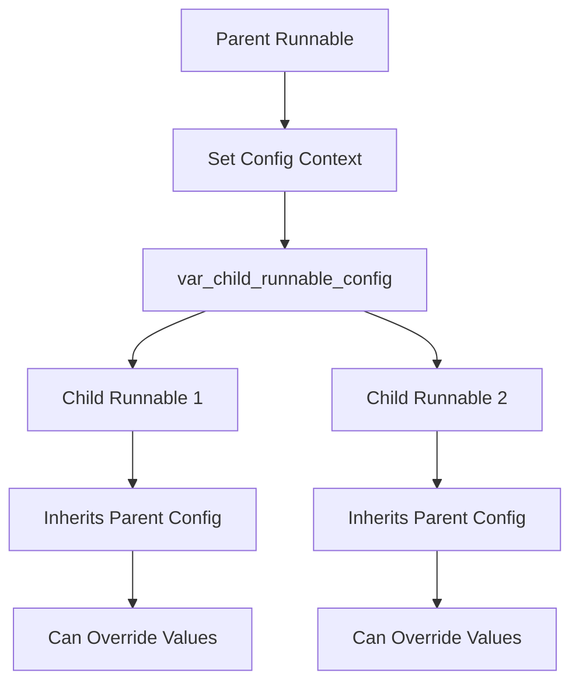
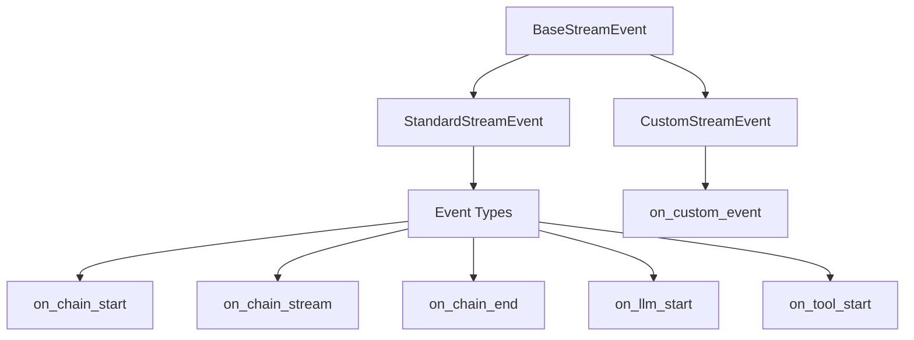
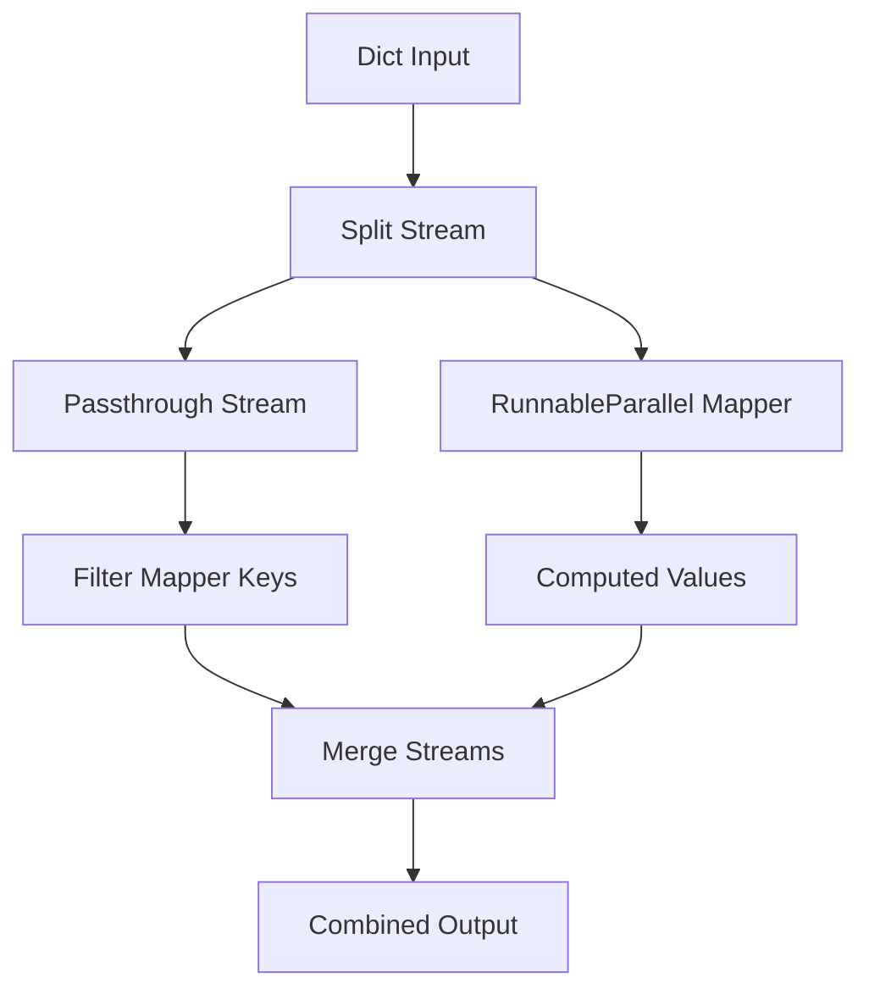
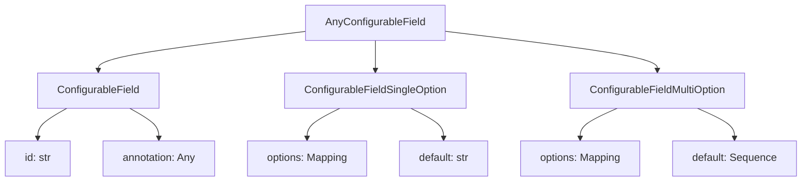

# Runnable Interface & Base Classes

The Runnable interface and its base classes form the foundation of LangChain's Expression Language (LCEL), providing a declarative approach to building production-grade LLM-powered applications. The Runnable abstraction enables composable components that inherently support synchronous, asynchronous, batch, and streaming operations without additional implementation effort. This design allows servers hosting LCEL-based programs to scale efficiently under high concurrent loads while providing responsive user experiences through streaming of intermediate outputs.

The core architecture consists of several base classes and utility types that define configuration, execution patterns, and data flow mechanisms. These primitives enable developers to chain operations, parallelize execution, handle errors gracefully, and maintain consistent behavior across different execution modes.

Sources: [runnables/__init__.py:1-15](../../../libs/core/langchain_core/runnables/__init__.py#L1-L15)

## Core Components

### Runnable Base Classes

The Runnable ecosystem provides several fundamental base classes that serve different purposes in building composable LLM applications:

| Class | Purpose | Key Characteristics |
|-------|---------|---------------------|
| `Runnable` | Abstract base interface | Defines core methods: `invoke`, `ainvoke`, `batch`, `stream`, `astream` |
| `RunnableSerializable` | Serializable Runnable | Extends `Runnable` with serialization capabilities |
| `RunnableSequence` | Sequential composition | Chains multiple Runnables in sequence |
| `RunnableParallel` / `RunnableMap` | Parallel execution | Executes multiple Runnables concurrently |
| `RunnableLambda` | Function wrapper | Wraps arbitrary functions as Runnables |
| `RunnableGenerator` | Generator support | Handles streaming generators |
| `RunnableBinding` | Configuration binding | Binds configuration to Runnables |

Sources: [runnables/__init__.py:20-34](../../../libs/core/langchain_core/runnables/__init__.py#L20-L34)

### Configuration System

The `RunnableConfig` TypedDict defines the configuration schema for all Runnable executions. It uses `total=False` to support partial configs and enable config propagation from parent to child runnables through context variables.

```python
class RunnableConfig(TypedDict, total=False):
    tags: list[str]
    metadata: dict[str, Any]
    callbacks: Callbacks
    run_name: str
    max_concurrency: int | None
    recursion_limit: int
    configurable: dict[str, Any]
    run_id: uuid.UUID | None
```

Sources: [runnables/config.py:62-124](../../../libs/core/langchain_core/runnables/config.py#L62-L124)

#### Configuration Fields

| Field | Type | Description | Default |
|-------|------|-------------|---------|
| `tags` | `list[str]` | Tags for filtering calls and sub-calls | `[]` |
| `metadata` | `dict[str, Any]` | JSON-serializable metadata passed to callbacks | `{}` |
| `callbacks` | `Callbacks` | Callback handlers for tracing and monitoring | `None` |
| `run_name` | `str` | Custom name for tracer run | Class name |
| `max_concurrency` | `int \| None` | Maximum parallel calls limit | `None` |
| `recursion_limit` | `int` | Maximum recursion depth | `25` |
| `configurable` | `dict[str, Any]` | Runtime values for configurable fields | `{}` |
| `run_id` | `uuid.UUID \| None` | Unique identifier for the run | Auto-generated |

Sources: [runnables/config.py:64-124](../../../libs/core/langchain_core/runnables/config.py#L64-L124), [runnables/config.py:127-137](../../../libs/core/langchain_core/runnables/config.py#L127-L137)

## Configuration Management

### Context-Based Configuration Propagation

LangChain uses Python's `ContextVar` to automatically propagate configuration from parent to child Runnables without explicit parameter passing:

```python
var_child_runnable_config: ContextVar[RunnableConfig | None] = ContextVar(
    "child_runnable_config", default=None
)
```

This mechanism allows child Runnables to inherit configuration from their parent context, with the ability to merge and override specific values.

Sources: [runnables/config.py:151-153](../../../libs/core/langchain_core/runnables/config.py#L151-L153)



### Configuration Utilities

The configuration system provides several utility functions for managing and merging configurations:

#### ensure_config

Ensures a config is properly initialized with all required keys, merging values from the context variable and provided config:

```python
def ensure_config(config: RunnableConfig | None = None) -> RunnableConfig:
    empty = RunnableConfig(
        tags=[],
        metadata={},
        callbacks=None,
        recursion_limit=DEFAULT_RECURSION_LIMIT,
        configurable={},
    )
    if var_config := var_child_runnable_config.get():
        empty.update(...)
    if config is not None:
        empty.update(...)
    return empty
```

Sources: [runnables/config.py:213-261](../../../libs/core/langchain_core/runnables/config.py#L213-L261)

#### merge_configs

Merges multiple configs with intelligent handling of different field types:

- **metadata**: Deep merge of dictionaries
- **tags**: Sorted union of all tags
- **configurable**: Deep merge of dictionaries
- **callbacks**: Special merging logic for callback managers and handler lists
- **recursion_limit**: Uses non-default value if present

Sources: [runnables/config.py:333-383](../../../libs/core/langchain_core/runnables/config.py#L333-L383)

#### patch_config

Creates a new config by selectively updating specific fields without modifying the original:

```python
def patch_config(
    config: RunnableConfig | None,
    *,
    callbacks: BaseCallbackManager | None = None,
    recursion_limit: int | None = None,
    max_concurrency: int | None = None,
    run_name: str | None = None,
    configurable: dict[str, Any] | None = None,
) -> RunnableConfig:
```

Sources: [runnables/config.py:303-330](../../../libs/core/langchain_core/runnables/config.py#L303-L330)

## Streaming Events System

### Event Schema

The streaming events system provides real-time visibility into Runnable execution through structured events. Events follow a standardized schema defined by `BaseStreamEvent` and its variants:



Sources: [runnables/schema.py:80-126](../../../libs/core/langchain_core/runnables/schema.py#L80-L126)

### Event Structure

| Field | Type | Description |
|-------|------|-------------|
| `event` | `str` | Event name format: `on_[runnable_type]_(start\|stream\|end)` |
| `run_id` | `str` | Unique ID for tracking execution |
| `tags` | `list[str]` | Inherited tags from parent Runnables |
| `metadata` | `dict[str, Any]` | Metadata bound to or passed at runtime |
| `parent_ids` | `Sequence[str]` | List of parent run IDs (root to immediate parent) |
| `name` | `str` | Name of the Runnable that generated the event |
| `data` | `EventData` | Event-specific data payload |

Sources: [runnables/schema.py:80-126](../../../libs/core/langchain_core/runnables/schema.py#L80-L126)

### Event Data Payload

The `EventData` TypedDict contains different fields depending on the event type:

```python
class EventData(TypedDict, total=False):
    input: Any  # Available at START or END
    error: NotRequired[BaseException]  # Only if exception raised
    output: Any  # Only at END
    chunk: Any  # Streaming chunks (addable)
    tool_call_id: NotRequired[str | None]  # For tool error events
```

Sources: [runnables/schema.py:12-54](../../../libs/core/langchain_core/runnables/schema.py#L12-L54)

### Runnable Types

Events are categorized by runnable type:

- **llm**: Non-chat language models
- **chat_model**: Chat-based language models
- **prompt**: Prompt templates (e.g., `ChatPromptTemplate`)
- **tool**: Tools defined via `@tool` decorator or inheriting from `Tool`/`BaseTool`
- **chain**: Most Runnable objects fall into this category

Sources: [runnables/schema.py:88-103](../../../libs/core/langchain_core/runnables/schema.py#L88-L103)

### Event Lifecycle Example

```python
from langchain_core.runnables import RunnableLambda

async def reverse(s: str) -> str:
    return s[::-1]

chain = RunnableLambda(func=reverse)
events = [event async for event in chain.astream_events("hello")]

# Produces:
# 1. on_chain_start: {"data": {"input": "hello"}, "name": "reverse", ...}
# 2. on_chain_stream: {"data": {"chunk": "olleh"}, "name": "reverse", ...}
# 3. on_chain_end: {"data": {"output": "olleh"}, "name": "reverse", ...}
```

Sources: [runnables/schema.py:60-78](../../../libs/core/langchain_core/runnables/schema.py#L60-L78)

## Passthrough Runnables

### RunnablePassthrough

`RunnablePassthrough` acts as an identity function that can optionally execute side-effect functions while passing input through unchanged. It's particularly useful for maintaining original values while adding computed fields.

```python
class RunnablePassthrough(RunnableSerializable[Other, Other]):
    func: Callable[[Other], None] | Callable[[Other, RunnableConfig], None] | None = None
    afunc: Callable[[Other], Awaitable[None]] | ... | None = None
```

**Key Features:**
- Passes input through unchanged
- Can execute sync/async side-effect functions
- Supports streaming with function execution on final aggregated input
- Used with `.assign()` to add new keys to dictionaries

Sources: [runnables/passthrough.py:49-157](../../../libs/core/langchain_core/runnables/passthrough.py#L49-L157)

#### Usage Patterns

```python
# Basic passthrough
runnable = RunnableParallel(
    origin=RunnablePassthrough(), 
    modified=lambda x: x + 1
)
runnable.invoke(1)  # {'origin': 1, 'modified': 2}

# With assign to add computed fields
runnable = {
    "llm1": fake_llm,
    "llm2": fake_llm,
} | RunnablePassthrough.assign(
    total_chars=lambda inputs: len(inputs["llm1"] + inputs["llm2"])
)
```

Sources: [runnables/passthrough.py:56-101](../../../libs/core/langchain_core/runnables/passthrough.py#L56-L101)

### RunnableAssign

`RunnableAssign` merges dictionary inputs with outputs from a `RunnableParallel` mapper, effectively adding new key-value pairs based on transformation logic:



Sources: [runnables/passthrough.py:286-338](../../../libs/core/langchain_core/runnables/passthrough.py#L286-L338)

**Implementation Details:**
- Uses `safetee`/`atee` to split input stream for parallel processing
- Filters out mapper keys from passthrough to avoid duplication
- Executes mapper in background using executor for sync operations
- Merges passthrough and mapper outputs

Sources: [runnables/passthrough.py:419-491](../../../libs/core/langchain_core/runnables/passthrough.py#L419-L491)

### RunnablePick

`RunnablePick` selectively extracts keys from dictionary inputs with type-dependent return behavior:

- **Single key (str)**: Returns the value directly
- **Multiple keys (list)**: Returns a dictionary with selected keys

```python
input_data = {"name": "John", "age": 30, "city": "New York"}

# Single key
RunnablePick(keys="name").invoke(input_data)  # "John"

# Multiple keys
RunnablePick(keys=["name", "age"]).invoke(input_data)  # {'name': 'John', 'age': 30}
```

Sources: [runnables/passthrough.py:581-646](../../../libs/core/langchain_core/runnables/passthrough.py#L581-L646)

## Utility Functions and Types

### Configurable Fields

The framework provides several types for making Runnable attributes configurable at runtime:



Sources: [runnables/utils.py:607-676](../../../libs/core/langchain_core/runnables/utils.py#L607-L676)

#### ConfigurableField

Represents a field that can be configured with any value of the specified type:

```python
class ConfigurableField(NamedTuple):
    id: str
    name: str | None = None
    description: str | None = None
    annotation: Any | None = None
    is_shared: bool = False
```

Sources: [runnables/utils.py:607-625](../../../libs/core/langchain_core/runnables/utils.py#L607-L625)

#### ConfigurableFieldSingleOption

Represents a field with predefined options and a single default value:

```python
class ConfigurableFieldSingleOption(NamedTuple):
    id: str
    options: Mapping[str, Any]
    default: str
    name: str | None = None
    description: str | None = None
    is_shared: bool = False
```

Sources: [runnables/utils.py:628-647](../../../libs/core/langchain_core/runnables/utils.py#L628-L647)

### Concurrency Control

#### ContextThreadPoolExecutor

A custom `ThreadPoolExecutor` that copies the current context to child threads, ensuring proper propagation of context variables:

```python
class ContextThreadPoolExecutor(ThreadPoolExecutor):
    def submit(self, func: Callable[P, T], *args: P.args, **kwargs: P.kwargs) -> Future[T]:
        return super().submit(
            cast("Callable[..., T]", partial(copy_context().run, func, *args, **kwargs))
        )
```

Sources: [runnables/config.py:444-471](../../../libs/core/langchain_core/runnables/config.py#L444-L471)

#### gather_with_concurrency

Gathers coroutines with a semaphore-based concurrency limit:

```python
async def gather_with_concurrency(n: int | None, *coros: Coroutine) -> list:
    if n is None:
        return await asyncio.gather(*coros)
    
    semaphore = asyncio.Semaphore(n)
    return await asyncio.gather(*(gated_coro(semaphore, c) for c in coros))
```

Sources: [runnables/utils.py:46-61](../../../libs/core/langchain_core/runnables/utils.py#L46-L61)

### Function Introspection

The framework includes utilities for analyzing function signatures and behavior:

| Function | Purpose |
|----------|---------|
| `accepts_run_manager` | Checks if callable accepts `run_manager` parameter |
| `accepts_config` | Checks if callable accepts `config` parameter |
| `accepts_context` | Checks if callable accepts `context` parameter |
| `is_async_generator` | Type guard for async generator functions |
| `is_async_callable` | Type guard for async callables |

Sources: [runnables/utils.py:64-98](../../../libs/core/langchain_core/runnables/utils.py#L64-98), [runnables/utils.py:767-793](../../../libs/core/langchain_core/runnables/utils.py#L767-L793)

### AddableDict

A special dictionary type that supports addition operations, useful for merging streaming chunks:

```python
class AddableDict(dict[str, Any]):
    def __add__(self, other: AddableDict) -> AddableDict:
        chunk = AddableDict(self)
        for key in other:
            if key not in chunk or chunk[key] is None:
                chunk[key] = other[key]
            elif other[key] is not None:
                try:
                    added = chunk[key] + other[key]
                except TypeError:
                    added = other[key]
                chunk[key] = added
        return chunk
```

Sources: [runnables/utils.py:551-582](../../../libs/core/langchain_core/runnables/utils.py#L551-L582)

## Execution Helpers

### Variable Argument Calling

The framework provides helpers to call functions that may optionally accept `run_manager` and/or `config` parameters:

```python
def call_func_with_variable_args(
    func: Callable,
    input: Input,
    config: RunnableConfig,
    run_manager: CallbackManagerForChainRun | None = None,
    **kwargs: Any,
) -> Output:
    if accepts_config(func):
        if run_manager is not None:
            kwargs["config"] = patch_config(config, callbacks=run_manager.get_child())
        else:
            kwargs["config"] = config
    if run_manager is not None and accepts_run_manager(func):
        kwargs["run_manager"] = run_manager
    return func(input, **kwargs)
```

Sources: [runnables/config.py:386-416](../../../libs/core/langchain_core/runnables/config.py#L386-L416)

### Executor Management

The `get_executor_for_config` context manager provides a properly configured executor:

```python
@contextmanager
def get_executor_for_config(
    config: RunnableConfig | None,
) -> Generator[Executor, None, None]:
    config = config or {}
    with ContextThreadPoolExecutor(
        max_workers=config.get("max_concurrency")
    ) as executor:
        yield executor
```

Sources: [runnables/config.py:474-486](../../../libs/core/langchain_core/runnables/config.py#L474-L486)

### Async Execution

The `run_in_executor` function handles running synchronous functions in an executor with proper context propagation:

```python
async def run_in_executor(
    executor_or_config: Executor | RunnableConfig | None,
    func: Callable[P, T],
    *args: P.args,
    **kwargs: P.kwargs,
) -> T:
    def wrapper() -> T:
        try:
            return func(*args, **kwargs)
        except StopIteration as exc:
            # Convert StopIteration to RuntimeError for asyncio compatibility
            raise RuntimeError from exc
```

Sources: [runnables/config.py:489-523](../../../libs/core/langchain_core/runnables/config.py#L489-L523)

## Summary

The Runnable interface and base classes provide a comprehensive foundation for building composable, production-ready LLM applications. The architecture emphasizes:

1. **Unified Interface**: All Runnables support invoke, batch, stream, and their async variants
2. **Configuration Management**: Sophisticated config merging and propagation via context variables
3. **Streaming Support**: Built-in event system for real-time execution visibility
4. **Composability**: Passthrough, assign, and pick operations for flexible data flow
5. **Concurrency Control**: Thread pool executors and semaphores for efficient parallel execution
6. **Type Safety**: Strong typing with TypedDict and Protocol definitions

This design enables developers to focus on application logic while the framework handles execution patterns, configuration propagation, tracing, and error handling consistently across all components.

Sources: [runnables/__init__.py:1-15](../../../libs/core/langchain_core/runnables/__init__.py#L1-L15), [runnables/config.py:1-523](../../../libs/core/langchain_core/runnables/config.py#L1-L523), [runnables/schema.py:1-126](../../../libs/core/langchain_core/runnables/schema.py#L1-L126), [runnables/passthrough.py:1-646](../../../libs/core/langchain_core/runnables/passthrough.py#L1-L646), [runnables/utils.py:1-793](../../../libs/core/langchain_core/runnables/utils.py#L1-L793)