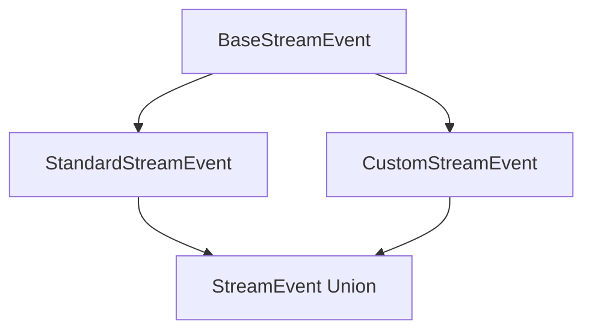
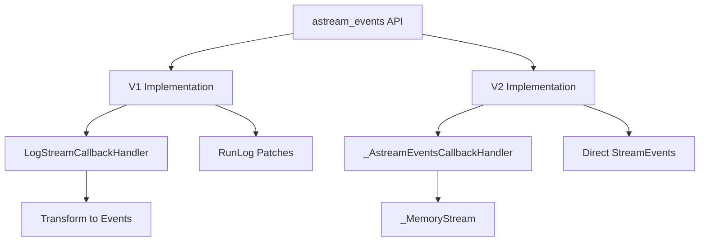
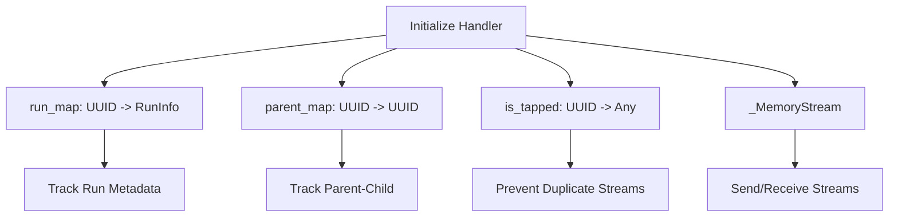
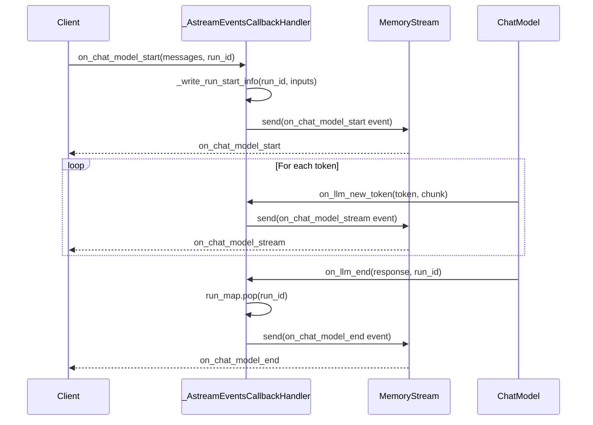
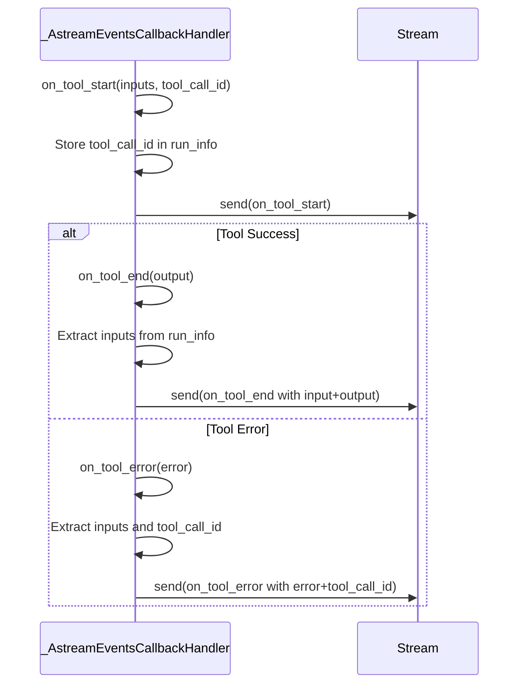
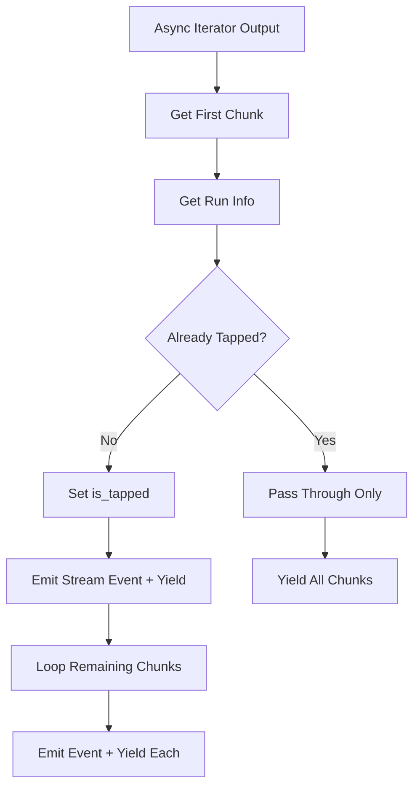
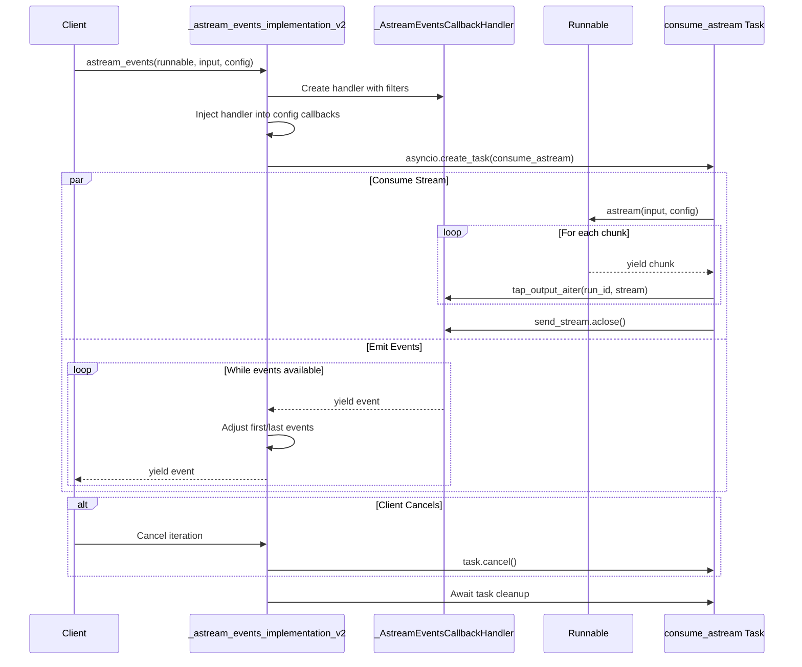
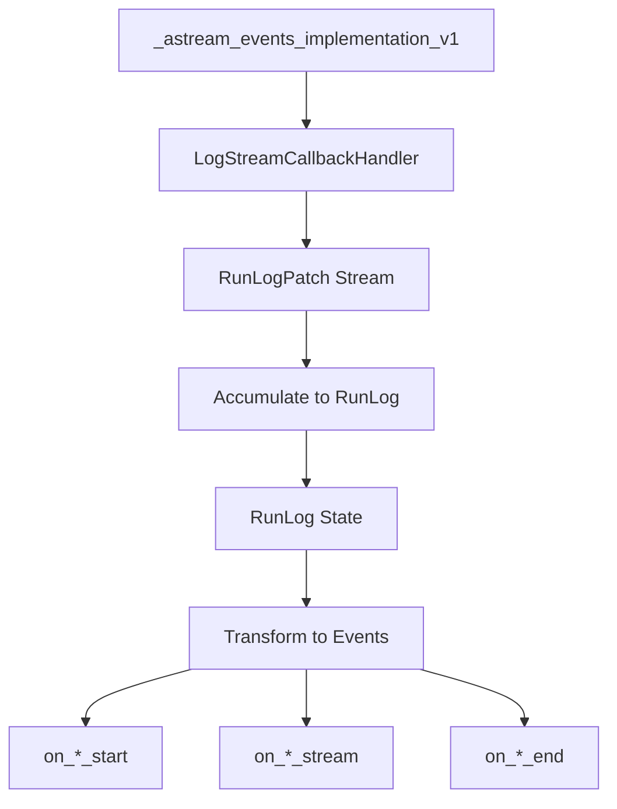
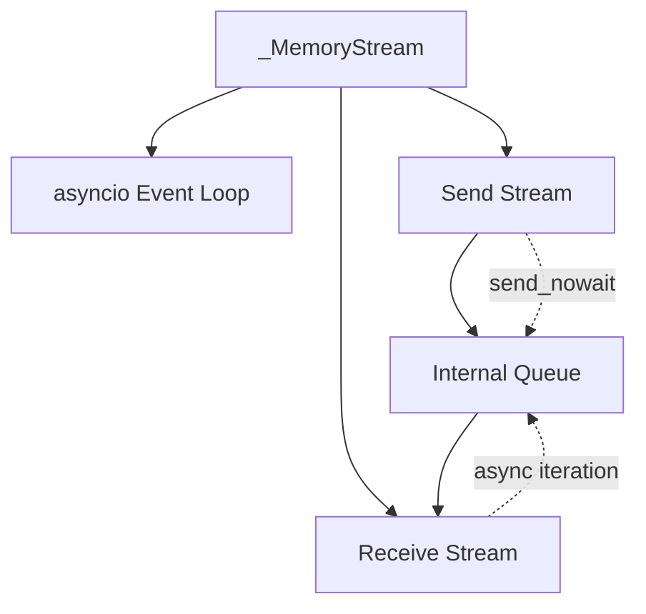

# Streaming & Event System (astream_events)

The `astream_events` API provides a powerful, fine-grained streaming interface for observing the execution of LangChain `Runnable` objects in real-time. This event-driven system enables developers to monitor and react to various stages of execution—including starts, streams, and completions—across all components in a chain, from LLMs and chat models to tools, retrievers, and custom chains. The system generates standardized `StreamEvent` objects that capture comprehensive execution metadata, outputs, and errors, making it ideal for building responsive UIs, debugging complex chains, and implementing custom monitoring solutions.

The event system supports two implementation versions (v1 and v2) with different performance characteristics and capabilities, particularly around parent ID tracking and streaming optimizations. It integrates deeply with LangChain's callback system and provides flexible filtering mechanisms to control which events are surfaced based on component names, types, and tags.

Sources: [langchain_core/runnables/schema.py:1-200](../../../langchain_core/runnables/schema.py#L1-L200), [langchain_core/tracers/event_stream.py:1-100](../../../langchain_core/tracers/event_stream.py#L1-L100)

## Event Schema and Data Structures

### StreamEvent Types

The event system defines two primary event types: `StandardStreamEvent` and `CustomStreamEvent`, both inheriting from `BaseStreamEvent`. Standard events follow LangChain's conventions for tracking `Runnable` execution, while custom events allow users to emit arbitrary data during execution.



Sources: [langchain_core/runnables/schema.py:90-175](../../../langchain_core/runnables/schema.py#L90-L175)

### BaseStreamEvent Structure

All streaming events share a common base structure containing essential tracking and metadata fields:

| Field | Type | Description |
|-------|------|-------------|
| `event` | `str` | Event name format: `on_[runnable_type]_(start\|stream\|end)` |
| `run_id` | `str` | Randomly generated UUID to track execution |
| `tags` | `list[str]` (optional) | Tags inherited from parent `Runnable` objects |
| `metadata` | `dict[str, Any]` (optional) | Metadata bound to or passed at runtime |
| `parent_ids` | `Sequence[str]` | List of parent run IDs from root to immediate parent |

The `event` field categorizes events by runnable type (`llm`, `chat_model`, `prompt`, `tool`, `chain`) and lifecycle stage (`start`, `stream`, `end`). Parent IDs enable hierarchical tracking of nested `Runnable` invocations, though this feature is only supported in v2 of the API.

Sources: [langchain_core/runnables/schema.py:91-159](../../../langchain_core/runnables/schema.py#L91-L159)

### EventData Structure

The `EventData` TypedDict defines the payload structure for standard stream events, with fields that vary based on the event lifecycle stage:

| Field | Type | Availability | Description |
|-------|------|--------------|-------------|
| `input` | `Any` | START or END | Input passed to the `Runnable`; may be unavailable at START for streaming inputs |
| `output` | `Any` | END only | Final output of the `Runnable` |
| `chunk` | `Any` | STREAM only | Streaming chunk supporting addition to reconstruct output |
| `error` | `BaseException` | ERROR only | Exception raised during execution (added in langchain-core 1.0.0) |
| `tool_call_id` | `str \| None` | ERROR only | Tool call ID for linking errors to specific tool invocations |

The `chunk` field is particularly important for streaming scenarios, as chunks support addition operations and can be aggregated to produce the final output. For `Runnable` objects that stream their inputs, the complete input is only available at the END event after the input stream is fully consumed.

Sources: [langchain_core/runnables/schema.py:18-66](../../../langchain_core/runnables/schema.py#L18-L66)

### StandardStreamEvent Example

The following example demonstrates the event sequence generated by a simple `RunnableLambda`:

```python
from langchain_core.runnables import RunnableLambda

async def reverse(s: str) -> str:
    return s[::-1]

chain = RunnableLambda(func=reverse)
events = [event async for event in chain.astream_events("hello")]
```

This produces three events:
1. **on_chain_start**: Contains input `"hello"` and metadata
2. **on_chain_stream**: Contains chunk `"olleh"`
3. **on_chain_end**: Contains output `"olleh"`

Sources: [langchain_core/runnables/schema.py:68-113](../../../langchain_core/runnables/schema.py#L68-L113)

### CustomStreamEvent

Custom events allow users to emit arbitrary data during execution using the `on_custom_event` callback. These events have a fixed event type but flexible data payloads:

```python
class CustomStreamEvent(BaseStreamEvent):
    event: Literal["on_custom_event"]
    name: str  # User-defined event name
    data: Any  # Free-form data
```

Sources: [langchain_core/runnables/schema.py:168-175](../../../langchain_core/runnables/schema.py#L168-L175)

## Event Stream Implementation Architecture

### Two-Version Architecture

The `astream_events` API provides two distinct implementations with different trade-offs:



**V1 Implementation** uses the `LogStreamCallbackHandler` and transforms `RunLog` patches into `StreamEvent` objects. It does not support parent ID tracking (always returns empty list) and has higher overhead due to the transformation layer.

**V2 Implementation** uses `_AstreamEventsCallbackHandler` to generate `StreamEvent` objects directly, supports full parent ID tracking, and includes optimizations for tapping into streaming outputs without duplication.

Sources: [langchain_core/tracers/event_stream.py:480-720](../../../langchain_core/tracers/event_stream.py#L480-L720)

### Callback Handler: _AstreamEventsCallbackHandler

The v2 implementation centers on `_AstreamEventsCallbackHandler`, an async callback handler that intercepts `Runnable` lifecycle events and converts them to `StreamEvent` objects:



The handler maintains three critical data structures:

1. **run_map**: Maps run IDs to `RunInfo` containing name, tags, metadata, run type, inputs, parent run ID, and optional tool call ID
2. **parent_map**: Maintains parent-child relationships between runs for hierarchical tracking
3. **is_tapped**: Tracks which runs have already been tapped for streaming to prevent duplicate events

Sources: [langchain_core/tracers/event_stream.py:116-177](../../../langchain_core/tracers/event_stream.py#L116-L177)

### Event Filtering System

Both implementations support comprehensive filtering through the `_RootEventFilter` class:

| Filter Type | Parameter | Description |
|-------------|-----------|-------------|
| Include by name | `include_names` | Only include runs with matching names |
| Include by type | `include_types` | Only include runs with matching types (llm, chain, tool, etc.) |
| Include by tags | `include_tags` | Only include runs with any matching tag |
| Exclude by name | `exclude_names` | Exclude runs with matching names |
| Exclude by type | `exclude_types` | Exclude runs with matching types |
| Exclude by tags | `exclude_tags` | Exclude runs with any matching tag |

Filters are applied with AND logic between categories and OR logic within categories. Events are included if they match any include filter (or all if no include filters specified) and don't match any exclude filter.

Sources: [langchain_core/tracers/event_stream.py:140-155](../../../langchain_core/tracers/event_stream.py#L140-L155)

## Event Lifecycle and Callback Hooks

### Runnable Type Event Mappings

The event system generates different event types based on the `Runnable` component:

```mermaid
graph TD
    LLM[LLM Non-Chat]
    ChatModel[Chat Model]
    Chain[Chain/Prompt]
    Tool[Tool]
    Retriever[Retriever]
    
    LLM --> LLMStart[on_llm_start]
    LLM --> LLMStream[on_llm_stream]
    LLM --> LLMEnd[on_llm_end]
    
    ChatModel --> ChatStart[on_chat_model_start]
    ChatModel --> ChatStream[on_chat_model_stream]
    ChatModel --> ChatEnd[on_chat_model_end]
    
    Chain --> ChainStart[on_chain_start]
    Chain --> ChainStream[on_chain_stream]
    Chain --> ChainEnd[on_chain_end]
    
    Tool --> ToolStart[on_tool_start]
    Tool --> ToolEnd[on_tool_end]
    Tool --> ToolError[on_tool_error]
    
    Retriever --> RetrieverStart[on_retriever_start]
    Retriever --> RetrieverEnd[on_retriever_end]
```



Sources: [langchain_core/runnables/schema.py:117-137](../../../langchain_core/runnables/schema.py#L117-L137)

### Chat Model Event Flow

The chat model lifecycle demonstrates the complete event flow with input/output handling:



The `on_chat_model_start` callback stores the input messages in `run_info["inputs"]` and emits a start event. During streaming, `on_llm_new_token` generates stream events with message chunks. Finally, `on_llm_end` extracts the final message from the response and emits an end event with both input and output.

Sources: [langchain_core/tracers/event_stream.py:224-268](../../../langchain_core/tracers/event_stream.py#L224-L268), [langchain_core/tracers/event_stream.py:358-412](../../../langchain_core/tracers/event_stream.py#L358-L412)

### Tool Execution with Error Handling

Tool events include special handling for tool call IDs and error tracking:



The `tool_call_id` field enables stateless agent implementations to link errors back to specific tool invocations. This ID is stored during `on_tool_start` and included in error events.

Sources: [langchain_core/tracers/event_stream.py:471-512](../../../langchain_core/tracers/event_stream.py#L471-L512)

### Parent ID Tracking

The v2 implementation tracks parent-child relationships through the `parent_map` and generates hierarchical parent ID lists:

```python
def _get_parent_ids(self, run_id: UUID) -> list[str]:
    """Get the parent IDs of a run (non-recursively) cast to strings."""
    parent_ids = []
    
    while parent_id := self.parent_map.get(run_id):
        str_parent_id = str(parent_id)
        if str_parent_id in parent_ids:
            raise AssertionError("Circular parent reference detected")
        parent_ids.append(str_parent_id)
        run_id = parent_id
    
    # Return in reverse order: root parent first, immediate parent last
    return parent_ids[::-1]
```

This method walks up the parent chain from the current run to the root, building an ordered list that represents the execution hierarchy. The list is reversed so the first element is the root parent.

Sources: [langchain_core/tracers/event_stream.py:179-196](../../../langchain_core/tracers/event_stream.py#L179-L196)

## Streaming Output Optimization

### Tap Output Mechanism

The v2 implementation includes a sophisticated "tap" mechanism to intercept streaming outputs without duplication:



The `tap_output_aiter` method implements atomic check-and-set semantics using a sentinel object to ensure only the first tap emits events:

```python
async def tap_output_aiter(
    self, run_id: UUID, output: AsyncIterator[T]
) -> AsyncIterator[T]:
    sentinel = object()
    tap = self.is_tapped.setdefault(run_id, sentinel)
    first = await anext(output, sentinel)
    
    if first is sentinel:
        return  # Empty iterator
    
    run_info = self.run_map.get(run_id)
    if run_info is None:
        yield cast("T", first)
        return  # Run finished, no events
    
    if tap is sentinel:
        # First to tap - issue stream events
        event = {...}
        self._send({**event, "data": {"chunk": first}}, run_info["run_type"])
        yield cast("T", first)
        
        async for chunk in output:
            self._send({**event, "data": {"chunk": chunk}}, run_info["run_type"])
            yield chunk
    else:
        # Already tapped - just pass through
        yield cast("T", first)
        async for chunk in output:
            yield chunk
```

This ensures that even if multiple consumers try to tap the same output stream, only one will generate events while all receive the data.

Sources: [langchain_core/tracers/event_stream.py:206-260](../../../langchain_core/tracers/event_stream.py#L206-L260)

### Synchronous Iterator Tapping

The system also supports synchronous iterators through `tap_output_iter`, which implements identical logic for non-async contexts:

```python
def tap_output_iter(self, run_id: UUID, output: Iterator[T]) -> Iterator[T]:
    sentinel = object()
    tap = self.is_tapped.setdefault(run_id, sentinel)
    first = next(output, sentinel)
    # ... similar logic to async version
```

Sources: [langchain_core/tracers/event_stream.py:262-304](../../../langchain_core/tracers/event_stream.py#L262-L304)

## V2 Implementation Flow

### Complete Execution Sequence

The v2 implementation orchestrates the entire streaming event flow through careful coordination of callbacks, streams, and async tasks:



The implementation creates a background task to consume the runnable's output stream while simultaneously yielding events from the handler's receive stream. Special handling adjusts the first event to include the actual input and removes redundant input from the final event.

Sources: [langchain_core/tracers/event_stream.py:722-837](../../../langchain_core/tracers/event_stream.py#L722-L837)

### First and Last Event Adjustments

The v2 implementation applies special transformations to the first and last events:

```python
first_event_sent = False
first_event_run_id = None

async for event in event_streamer:
    if not first_event_sent:
        first_event_sent = True
        # Override input with actual passed value
        event["data"]["input"] = value
        first_event_run_id = event["run_id"]
        yield event
        continue
    
    # Remove redundant input from root end event
    if (
        event["run_id"] == first_event_run_id
        and event["event"].endswith("_end")
        and "input" in event["data"]
    ):
        del event["data"]["input"]
    
    yield event
```

This workaround addresses an issue where inputs aren't available until the entire input stream is consumed. The first event is guaranteed to include the correct input, and the end event avoids duplication.

Sources: [langchain_core/tracers/event_stream.py:802-826](../../../langchain_core/tracers/event_stream.py#L802-L826)

## V1 Implementation Flow

### LogStream-Based Architecture

The v1 implementation builds on the `LogStreamCallbackHandler` and `RunLog` infrastructure:



The v1 flow uses `_astream_log_implementation` to generate `RunLogPatch` objects, accumulates them into a `RunLog` state, and then transforms the log entries into `StreamEvent` objects.

Sources: [langchain_core/tracers/event_stream.py:480-720](../../../langchain_core/tracers/event_stream.py#L480-L720)

### Event Generation from RunLog

The v1 implementation iterates through `RunLog` operations and generates events based on log entry state:

```python
for path in paths:
    log_entry: LogEntry = run_log.state["logs"][path]
    
    if log_entry["end_time"] is None:
        event_type = "stream" if log_entry["streamed_output"] else "start"
    else:
        event_type = "end"
    
    if event_type == "start":
        inputs = log_entry.get("inputs")
        if inputs is not None:
            data["input"] = inputs
    
    if event_type == "end":
        data["input"] = log_entry.get("inputs")
        data["output"] = log_entry["final_output"]
    
    if event_type == "stream":
        data = {"chunk": log_entry["streamed_output"][0]}
        log_entry["streamed_output"] = []  # Clear to avoid duplicates
    
    yield StandardStreamEvent(
        event=f"on_{log_entry['type']}_{event_type}",
        name=log_entry["name"],
        run_id=log_entry["id"],
        tags=log_entry["tags"],
        metadata=log_entry["metadata"],
        data=data,
        parent_ids=[],  # Not supported in v1
    )
```

The v1 implementation always returns empty `parent_ids` lists, as hierarchical tracking is not supported in this version.

Sources: [langchain_core/tracers/event_stream.py:631-695](../../../langchain_core/tracers/event_stream.py#L631-L695)

## RunInfo and Metadata Tracking

### RunInfo Structure

The `RunInfo` TypedDict stores essential metadata for each run:

```python
class RunInfo(TypedDict):
    name: str
    tags: list[str]
    metadata: dict[str, Any]
    run_type: str
    inputs: NotRequired[Any]
    parent_run_id: UUID | None
    tool_call_id: NotRequired[str | None]
```

This structure is populated during the `_write_run_start_info` method and stored in the handler's `run_map`. The `inputs` field is marked `NotRequired` because some runnables don't know their inputs until execution completes (particularly those that stream inputs).

Sources: [langchain_core/tracers/event_stream.py:68-88](../../../langchain_core/tracers/event_stream.py#L68-L88)

### Name Assignment Logic

Run names are assigned through a fallback hierarchy:

```python
def _assign_name(name: str | None, serialized: dict[str, Any] | None) -> str:
    if name is not None:
        return name
    if serialized is not None:
        if "name" in serialized:
            return cast("str", serialized["name"])
        if "id" in serialized:
            return cast("str", serialized["id"][-1])
    return "Unnamed"
```

This function first uses the explicit name parameter, then falls back to the serialized object's name or ID fields, and finally defaults to "Unnamed" if no information is available.

Sources: [langchain_core/tracers/event_stream.py:90-101](../../../langchain_core/tracers/event_stream.py#L90-L101)

## Memory Stream Infrastructure

### _MemoryStream Implementation

Both implementations rely on `_MemoryStream` for thread-safe, async-safe event delivery:



The `_MemoryStream` provides separate send and receive stream interfaces backed by an internal queue, enabling producer-consumer patterns across async boundaries. The send stream supports `send_nowait` for synchronous sends from callback handlers, while the receive stream provides async iteration.

Sources: [langchain_core/tracers/event_stream.py:157-162](../../../langchain_core/tracers/event_stream.py#L157-L162)

## Custom Event Emission

### on_custom_event Callback

Users can emit custom events during execution using the `on_custom_event` callback:

```python
async def on_custom_event(
    self,
    name: str,
    data: Any,
    *,
    run_id: UUID,
    tags: list[str] | None = None,
    metadata: dict[str, Any] | None = None,
    **kwargs: Any,
) -> None:
    event = CustomStreamEvent(
        event="on_custom_event",
        run_id=str(run_id),
        name=name,
        tags=tags or [],
        metadata=metadata or {},
        data=data,
        parent_ids=self._get_parent_ids(run_id),
    )
    self._send(event, name)
```

Custom events are filtered using the event name rather than a run type, allowing flexible filtering of user-defined events.

Sources: [langchain_core/tracers/event_stream.py:306-327](../../../langchain_core/tracers/event_stream.py#L306-L327)

## Token Streaming for LLMs

### on_llm_new_token Handler

The `on_llm_new_token` callback handles streaming tokens from both chat models and non-chat LLMs:

```python
async def on_llm_new_token(
    self,
    token: str,
    *,
    chunk: GenerationChunk | ChatGenerationChunk | None = None,
    run_id: UUID,
    parent_run_id: UUID | None = None,
    **kwargs: Any,
) -> None:
    run_info = self.run_map.get(run_id)
    if run_info is None:
        raise AssertionError(f"Run ID {run_id} not found")
    
    if self.is_tapped.get(run_id):
        return  # Already tapped, skip
    
    if run_info["run_type"] == "chat_model":
        event = "on_chat_model_stream"
        chunk_ = AIMessageChunk(content=token) if chunk is None else chunk.message
    elif run_info["run_type"] == "llm":
        event = "on_llm_stream"
        chunk_ = GenerationChunk(text=token) if chunk is None else chunk
    else:
        raise ValueError(f"Unexpected run type: {run_info['run_type']}")
    
    self._send({
        "event": event,
        "data": {"chunk": chunk_},
        "run_id": str(run_id),
        "name": run_info["name"],
        "tags": run_info["tags"],
        "metadata": run_info["metadata"],
        "parent_ids": self._get_parent_ids(run_id),
    }, run_info["run_type"])
```

The handler checks if the output has already been tapped (to avoid duplication) and constructs appropriate chunk types based on whether it's a chat model or regular LLM.

Sources: [langchain_core/tracers/event_stream.py:329-382](../../../langchain_core/tracers/event_stream.py#L329-L382)

## Integration with Callback System

### Config Injection

Both implementations inject their callback handlers into the runnable's configuration:

```python
config = ensure_config(config)
callbacks = config.get("callbacks")

if callbacks is None:
    config["callbacks"] = [event_streamer]
elif isinstance(callbacks, list):
    config["callbacks"] = [*callbacks, event_streamer]
elif isinstance(callbacks, BaseCallbackManager):
    callbacks = callbacks.copy()
    callbacks.add_handler(event_streamer, inherit=True)
    config["callbacks"] = callbacks
else:
    raise ValueError(f"Unexpected type for callbacks: {callbacks}")
```

This injection ensures the event handler receives all callback invocations during runnable execution. The handler is added to existing callbacks rather than replacing them, preserving any user-configured callbacks.

Sources: [langchain_core/tracers/event_stream.py:776-793](../../../langchain_core/tracers/event_stream.py#L776-L793)

## Summary

The `astream_events` API provides a comprehensive, production-ready system for observing LangChain execution in real-time. The v2 implementation offers superior performance and full parent ID tracking through the `_AstreamEventsCallbackHandler`, which intercepts lifecycle callbacks and generates standardized `StreamEvent` objects. The system's sophisticated filtering, tap mechanism for streaming outputs, and integration with the callback infrastructure make it suitable for building responsive UIs, debugging complex chains, and implementing custom observability solutions. The event schema's flexibility—supporting standard lifecycle events, custom user events, and detailed error tracking—ensures developers have complete visibility into their LangChain applications.

Sources: [langchain_core/runnables/schema.py](../../../langchain_core/runnables/schema.py), [langchain_core/tracers/event_stream.py](../../../langchain_core/tracers/event_stream.py), [langchain_core/tracers/log_stream.py](../../../langchain_core/tracers/log_stream.py), [langchain_core/tracers/_streaming.py](../../../langchain_core/tracers/_streaming.py), [langchain_core/callbacks/streaming_stdout.py](../../../langchain_core/callbacks/streaming_stdout.py)