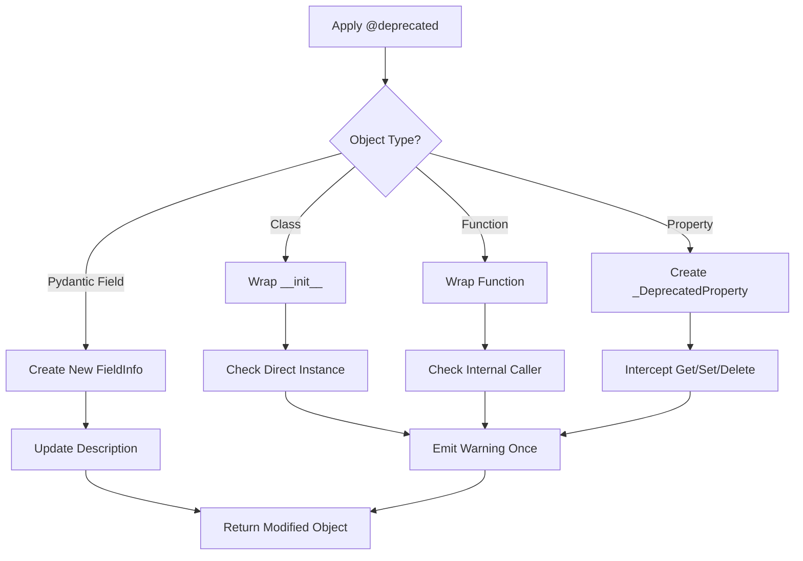
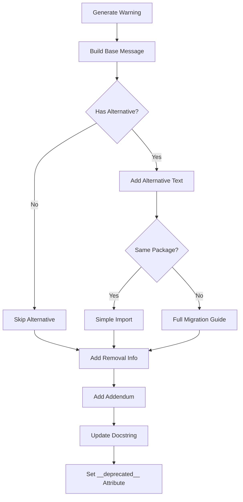
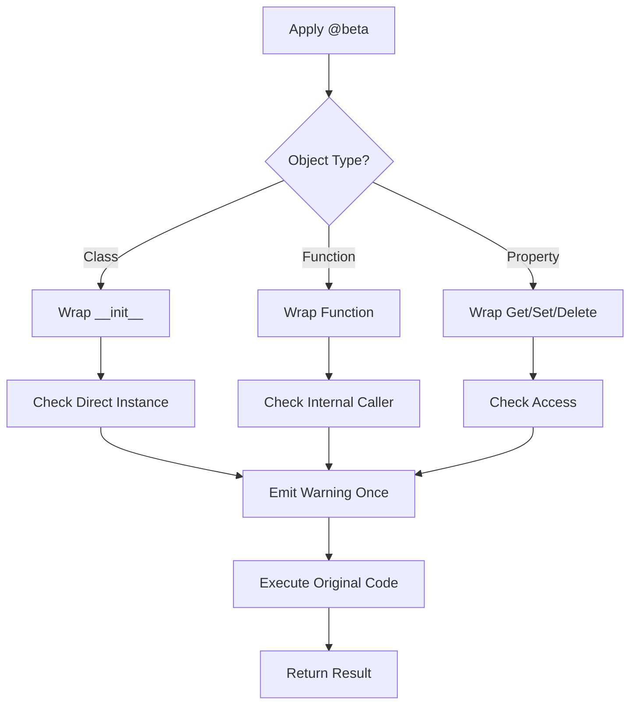
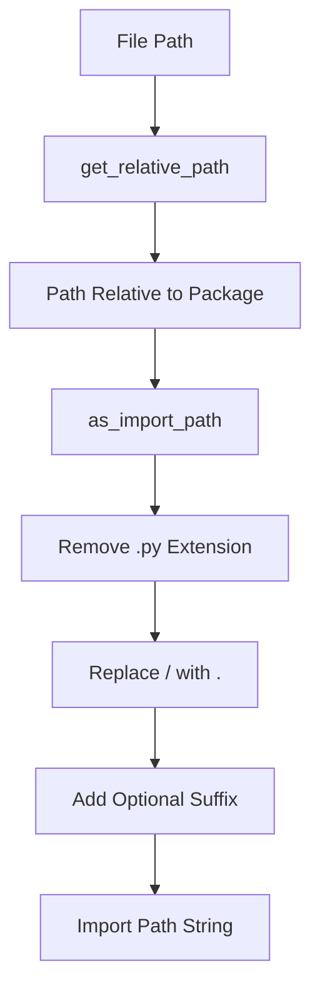

# API Lifecycle: Deprecation & Beta Decorators

The LangChain framework provides a comprehensive internal API lifecycle management system to handle the evolution of its codebase. This system consists of decorators and utilities for marking APIs as deprecated or beta, issuing standardized warnings to users, and maintaining backward compatibility during transitions. The `langchain_core._api` module contains the core functionality for managing deprecation warnings and beta annotations, enabling LangChain developers to communicate API changes effectively while giving users time to migrate to newer alternatives.

This module is explicitly marked for internal use only and is not intended for external consumption. It provides a structured approach to API lifecycle management, adapted from matplotlib's deprecation system, with custom warning classes and decorator implementations that integrate seamlessly with LangChain's architecture.

Sources: [_api/__init__.py:1-9](../../../libs/core/langchain_core/_api/__init__.py#L1-L9), [deprecation.py:1-11](../../../libs/core/langchain_core/_api/deprecation.py#L1-L11), [beta_decorator.py:1-11](../../../libs/core/langchain_core/_api/beta_decorator.py#L1-L11)

## Module Architecture

The `_api` module is organized into several specialized submodules, each handling specific aspects of API lifecycle management:

```mermaid
graph TD
    A[_api Module] --> B[deprecation.py]
    A --> C[beta_decorator.py]
    A --> D[internal.py]
    A --> E[path.py]
    B --> F[LangChainDeprecationWarning]
    B --> G[@deprecated decorator]
    B --> H[warn_deprecated]
    C --> I[LangChainBetaWarning]
    C --> J[@beta decorator]
    C --> K[warn_beta]
    D --> L[is_caller_internal]
    E --> M[get_relative_path]
    E --> N[as_import_path]
```

The module uses lazy loading through dynamic imports to reduce initial import time and avoid circular dependencies. The `__getattr__` function dynamically imports attributes from submodules only when they are accessed.

Sources: [_api/__init__.py:31-64](../../../libs/core/langchain_core/_api/__init__.py#L31-L64)

## Deprecation System

### Core Components

The deprecation system provides a standardized way to mark APIs as deprecated and issue warnings to users. It consists of custom warning classes, a decorator for marking deprecated code, and utility functions for managing warnings.

| Component | Type | Purpose |
|-----------|------|---------|
| `LangChainDeprecationWarning` | Warning Class | Standard deprecation warnings for users |
| `LangChainPendingDeprecationWarning` | Warning Class | Warnings for future deprecations |
| `@deprecated` | Decorator | Marks functions, classes, or properties as deprecated |
| `warn_deprecated` | Function | Issues standardized deprecation warnings |
| `suppress_langchain_deprecation_warning` | Context Manager | Temporarily suppresses deprecation warnings |
| `surface_langchain_deprecation_warnings` | Function | Re-enables deprecation warnings |

Sources: [deprecation.py:38-41](../../../libs/core/langchain_core/_api/deprecation.py#L38-L41), [deprecation.py:66-128](../../../libs/core/langchain_core/_api/deprecation.py#L66-L128)

### The @deprecated Decorator

The `@deprecated` decorator is the primary interface for marking APIs as deprecated. It supports a wide range of parameters to customize the deprecation message and behavior:

```python
def deprecated(
    since: str,
    *,
    message: str = "",
    name: str = "",
    alternative: str = "",
    alternative_import: str = "",
    pending: bool = False,
    obj_type: str = "",
    addendum: str = "",
    removal: str = "",
    package: str = "",
) -> Callable[[T], T]:
```

**Key Parameters:**

| Parameter | Type | Description |
|-----------|------|-------------|
| `since` | str | The release version when deprecation began (required) |
| `message` | str | Custom deprecation message (overrides default) |
| `alternative` | str | Alternative API to use instead |
| `alternative_import` | str | Fully qualified import path for alternative |
| `pending` | bool | Use PendingDeprecationWarning instead |
| `removal` | str | Expected removal version |
| `addendum` | str | Additional text appended to message |
| `package` | str | Package name of deprecated object |

Sources: [deprecation.py:66-128](../../../libs/core/langchain_core/_api/deprecation.py#L66-L128)

### Deprecation Flow

The decorator follows a sophisticated flow to handle different types of objects (functions, classes, properties, Pydantic fields):



The decorator uses the `is_caller_internal()` function to avoid issuing warnings when LangChain's own internal code calls deprecated APIs, ensuring warnings are only shown to external users.

Sources: [deprecation.py:130-398](../../../libs/core/langchain_core/_api/deprecation.py#L130-L398), [internal.py:4-26](../../../libs/core/langchain_core/_api/internal.py#L4-L26)

### Warning Message Generation

The system automatically generates comprehensive warning messages with multiple components:



The message includes the deprecation version, removal timeline, alternative APIs, and migration instructions. For cross-package migrations, it provides detailed installation and import instructions.

Sources: [deprecation.py:476-542](../../../libs/core/langchain_core/_api/deprecation.py#L476-L542)

### Docstring Modification

The decorator automatically updates the docstring of deprecated objects to include a prominent deprecation notice:

```python
new_doc = f"""\
!!! deprecated "{since} {details} {removal_str}"

{old_doc}\
"""
```

This ensures that documentation tools and IDEs can display the deprecation information to users. The decorator also sets the `__deprecated__` attribute for PEP 702 compliance, enabling modern IDEs and type checkers to recognize deprecated APIs.

Sources: [deprecation.py:355-365](../../../libs/core/langchain_core/_api/deprecation.py#L355-L365), [deprecation.py:19-32](../../../libs/core/langchain_core/_api/deprecation.py#L19-L32)

### Handling Different Object Types

#### Classes

For classes, the decorator wraps the `__init__` method and only emits warnings when direct instances are created (not for subclasses):

```python
def warn_if_direct_instance(
    self: Any, *args: Any, **kwargs: Any
) -> Any:
    """Warn that the class is in beta."""
    nonlocal warned
    if not warned and type(self) is obj and not is_caller_internal():
        warned = True
        emit_warning()
    return wrapped(self, *args, **kwargs)
```

Sources: [deprecation.py:192-204](../../../libs/core/langchain_core/_api/deprecation.py#L192-L204)

#### Properties

For properties, a custom `_DeprecatedProperty` class intercepts all access operations:

```python
class _DeprecatedProperty(property):
    """A deprecated property."""

    def __get__(self, instance: Any, owner: type | None = None) -> Any:
        if instance is not None or owner is not None:
            emit_warning()
        if self.fget is None:
            return None
        return self.fget(instance)

    def __set__(self, instance: Any, value: Any) -> None:
        if instance is not None:
            emit_warning()
        if self.fset is not None:
            self.fset(instance, value)
```

Sources: [deprecation.py:268-289](../../../libs/core/langchain_core/_api/deprecation.py#L268-L289)

#### Pydantic Fields

The decorator supports both Pydantic v1 and v2 FieldInfo objects, creating new instances with updated descriptions:

```python
def finalize(_: Callable[..., Any], new_doc: str, /) -> T:
    return cast(
        "T",
        FieldInfo(
            default=obj.default,
            default_factory=obj.default_factory,
            description=new_doc,
            alias=obj.alias,
            exclude=obj.exclude,
        ),
    )
```

Sources: [deprecation.py:244-257](../../../libs/core/langchain_core/_api/deprecation.py#L244-L257)

### Parameter Renaming Utility

The module provides a specialized decorator for handling parameter renames:

```python
@rename_parameter(since="3.1", removal="4.0", old="bad_name", new="good_name")
def func(good_name): ...
```

This decorator intercepts calls with the old parameter name, issues a deprecation warning, and transparently maps it to the new parameter name.

Sources: [deprecation.py:572-627](../../../libs/core/langchain_core/_api/deprecation.py#L572-L627)

## Beta System

### Core Components

The beta system marks APIs that are actively being developed and may change. It uses a similar architecture to the deprecation system but with different semantics:

| Component | Type | Purpose |
|-----------|------|---------|
| `LangChainBetaWarning` | Warning Class | Warnings for beta features |
| `@beta` | Decorator | Marks functions, classes, or properties as beta |
| `warn_beta` | Function | Issues standardized beta warnings |
| `suppress_langchain_beta_warning` | Context Manager | Temporarily suppresses beta warnings |
| `surface_langchain_beta_warnings` | Function | Re-enables beta warnings |

Sources: [beta_decorator.py:21-24](../../../libs/core/langchain_core/_api/beta_decorator.py#L21-L24), [beta_decorator.py:31-62](../../../libs/core/langchain_core/_api/beta_decorator.py#L31-L62)

### The @beta Decorator

The `@beta` decorator has a simpler parameter set compared to `@deprecated` since beta features don't have removal schedules:

```python
def beta(
    *,
    message: str = "",
    name: str = "",
    obj_type: str = "",
    addendum: str = "",
) -> Callable[[T], T]:
```

The decorator follows the same pattern of wrapping different object types and using `is_caller_internal()` to avoid warning internal code.

Sources: [beta_decorator.py:31-62](../../../libs/core/langchain_core/_api/beta_decorator.py#L31-L62), [beta_decorator.py:64-171](../../../libs/core/langchain_core/_api/beta_decorator.py#L64-L171)

### Beta Warning Flow



Sources: [beta_decorator.py:64-171](../../../libs/core/langchain_core/_api/beta_decorator.py#L64-L171)

### Beta Message Generation

Beta warnings use a simpler message format emphasizing active development:

```python
if not message:
    message = ""

    if obj_type:
        message += f"The {obj_type} `{name}`"
    else:
        message += f"`{name}`"

    message += " is in beta. It is actively being worked on, so the API may change."

    if addendum:
        message += f" {addendum}"
```

The docstring is updated with a beta annotation block:

```python
new_doc = f".. beta::\n   {details}\n\n{old_doc}\n"
```

Sources: [beta_decorator.py:191-213](../../../libs/core/langchain_core/_api/beta_decorator.py#L191-L213), [beta_decorator.py:159-160](../../../libs/core/langchain_core/_api/beta_decorator.py#L159-L160)

## Internal Caller Detection

The `is_caller_internal()` function is crucial for both deprecation and beta systems. It inspects the call stack to determine if the caller is internal LangChain code:

```python
def is_caller_internal(depth: int = 2) -> bool:
    """Return whether the caller at `depth` of this function is internal."""
    try:
        frame = inspect.currentframe()
    except AttributeError:
        return False
    if frame is None:
        return False
    try:
        for _ in range(depth):
            frame = frame.f_back
            if frame is None:
                return False
        # Directly access the module name from the frame's global variables
        module_globals = frame.f_globals
        caller_module_name = cast("str", module_globals.get("__name__", ""))
        return caller_module_name.startswith("langchain")
    finally:
        del frame
```

This prevents warnings from being issued when LangChain's internal code uses deprecated or beta APIs, ensuring users only see warnings for their own code.

Sources: [internal.py:4-26](../../../libs/core/langchain_core/_api/internal.py#L4-L26)

## Path Utilities

The `path.py` module provides utilities for converting file paths to import paths, which is useful for generating accurate import instructions in warning messages:



### Key Functions

| Function | Purpose | Example |
|----------|---------|---------|
| `get_relative_path` | Convert absolute path to relative | `/path/to/langchain_core/module.py` → `module.py` |
| `as_import_path` | Convert file path to import path | `langchain_core/module.py` → `langchain_core.module` |

Sources: [path.py:1-51](../../../libs/core/langchain_core/_api/path.py#L1-L51)

## Warning Management

### Suppression Context Managers

Both systems provide context managers for temporarily suppressing warnings, useful in test code or when intentionally using deprecated/beta APIs:

```python
@contextlib.contextmanager
def suppress_langchain_deprecation_warning() -> Generator[None, None, None]:
    """Context manager to suppress `LangChainDeprecationWarning`."""
    with warnings.catch_warnings():
        warnings.simplefilter("ignore", LangChainDeprecationWarning)
        warnings.simplefilter("ignore", LangChainPendingDeprecationWarning)
        yield
```

Sources: [deprecation.py:401-408](../../../libs/core/langchain_core/_api/deprecation.py#L401-L408), [beta_decorator.py:174-179](../../../libs/core/langchain_core/_api/beta_decorator.py#L174-L179)

### Warning Surfacing

Functions to explicitly enable warnings that may have been filtered by default:

```python
def surface_langchain_deprecation_warnings() -> None:
    """Unmute LangChain deprecation warnings."""
    warnings.filterwarnings(
        "default",
        category=LangChainPendingDeprecationWarning,
    )

    warnings.filterwarnings(
        "default",
        category=LangChainDeprecationWarning,
    )
```

Sources: [deprecation.py:545-556](../../../libs/core/langchain_core/_api/deprecation.py#L545-L556), [beta_decorator.py:216-221](../../../libs/core/langchain_core/_api/beta_decorator.py#L216-L221)

## Validation and Error Handling

The deprecation system includes validation logic to prevent invalid decorator configurations:

```python
def _validate_deprecation_params(
    removal: str,
    alternative: str,
    alternative_import: str,
    *,
    pending: bool,
) -> None:
    """Validate the deprecation parameters."""
    if pending and removal:
        msg = "A pending deprecation cannot have a scheduled removal"
        raise ValueError(msg)
    if alternative and alternative_import:
        msg = "Cannot specify both alternative and alternative_import"
        raise ValueError(msg)

    if alternative_import and "." not in alternative_import:
        msg = (
            "alternative_import must be a fully qualified module path. Got "
            f" {alternative_import}"
        )
        raise ValueError(msg)
```

This ensures that developers use the decorators correctly and receive clear error messages for invalid configurations.

Sources: [deprecation.py:50-63](../../../libs/core/langchain_core/_api/deprecation.py#L50-L63)

## Async Function Support

Both decorators support async functions through separate wrapper implementations:

```python
async def awarning_emitting_wrapper(*args: Any, **kwargs: Any) -> Any:
    """Same as warning_emitting_wrapper, but for async functions."""
    nonlocal warned
    if not warned and not is_caller_internal():
        warned = True
        emit_warning()
    return await wrapped(*args, **kwargs)
```

The decorator automatically detects async functions using `inspect.iscoroutinefunction()` and applies the appropriate wrapper.

Sources: [deprecation.py:164-171](../../../libs/core/langchain_core/_api/deprecation.py#L164-L171), [beta_decorator.py:99-106](../../../libs/core/langchain_core/_api/beta_decorator.py#L99-L106)

## Summary

The LangChain API lifecycle management system provides a robust, well-architected solution for handling API evolution. The deprecation system enables graceful transitions by warning users about deprecated APIs while maintaining backward compatibility, with comprehensive support for classes, functions, properties, and Pydantic fields. The beta system allows developers to ship experimental features with appropriate warnings about API stability. Both systems integrate seamlessly with LangChain's architecture through internal caller detection, ensuring warnings are only shown to external users. The module's lazy loading design, comprehensive validation, and support for async functions demonstrate careful attention to developer experience and system performance.

Sources: [_api/__init__.py:1-75](../../../libs/core/langchain_core/_api/__init__.py#L1-L75), [deprecation.py:1-627](../../../libs/core/langchain_core/_api/deprecation.py#L1-L627), [beta_decorator.py:1-221](../../../libs/core/langchain_core/_api/beta_decorator.py#L1-L221)