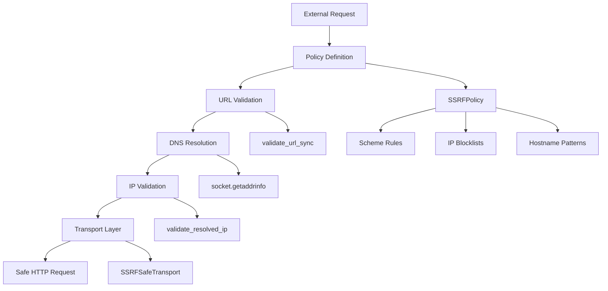
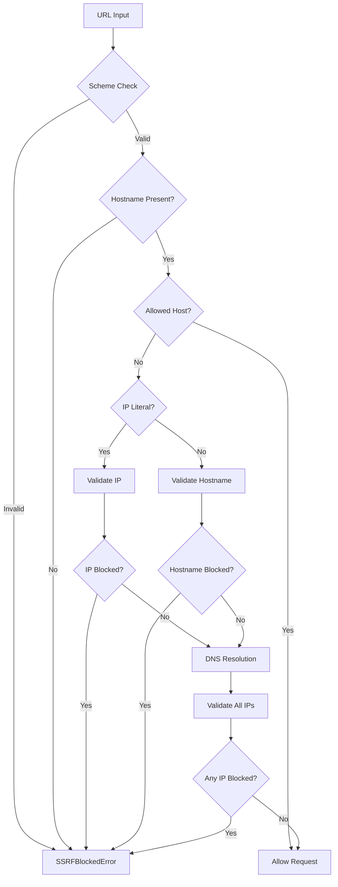
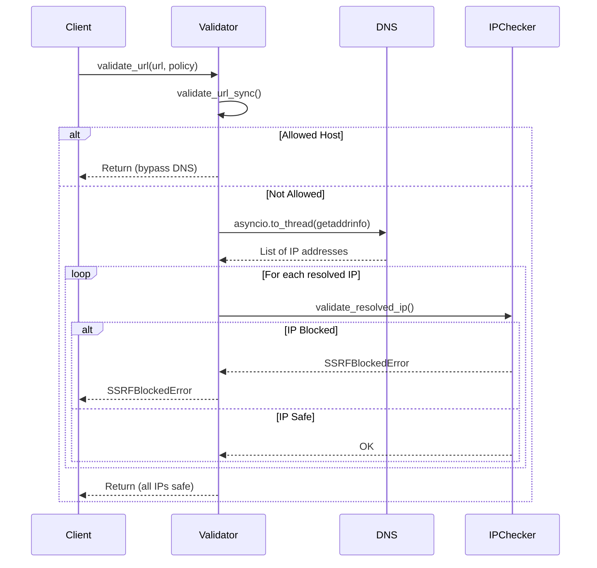
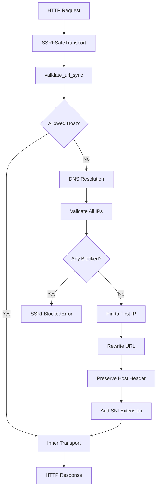

# Security: SSRF Protection & Transport Policies

## Introduction

The SSRF (Server-Side Request Forgery) Protection module is an **internal security layer** within LangChain Core that prevents malicious or accidental requests to private networks, cloud metadata endpoints, and other sensitive resources. This module is explicitly marked as internal (`_security` prefix) and is not part of the public API—it may change without notice. The protection system operates at multiple layers: URL validation, DNS resolution checking, and custom HTTP transports that enforce security policies before any network request is made.

The module provides both synchronous and asynchronous validation mechanisms, integrates with Pydantic for model-level URL validation, and offers drop-in replacements for `httpx` clients that automatically enforce SSRF policies. This comprehensive approach ensures that LLM-powered applications built with LangChain cannot be exploited to access internal services or leak sensitive metadata from cloud environments.

*Sources: [_security/__init__.py:1-12](../../../libs/core/langchain_core/_security/__init__.py#L1-L12)*

## Architecture Overview

The SSRF protection system is organized into four primary components that work together to provide defense-in-depth:



*Sources: [_security/__init__.py:13-37](../../../libs/core/langchain_core/_security/__init__.py#L13-L37), [_security/_policy.py:1-10](../../../libs/core/langchain_core/_security/_policy.py#L1-L10)*

## Core Components

### SSRFPolicy

The `SSRFPolicy` is an immutable, frozen dataclass that defines the security rules for validating URLs and IP addresses. It centralizes all configuration for what should be blocked or allowed.

| Field | Type | Default | Description |
|-------|------|---------|-------------|
| `allowed_schemes` | `frozenset[str]` | `{"http", "https"}` | URL schemes permitted for requests |
| `block_private_ips` | `bool` | `True` | Block RFC 1918 private networks and other reserved ranges |
| `block_localhost` | `bool` | `True` | Block loopback addresses (127.0.0.0/8, ::1) |
| `block_cloud_metadata` | `bool` | `True` | Block cloud provider metadata endpoints (always enforced) |
| `block_k8s_internal` | `bool` | `True` | Block Kubernetes internal DNS (*.svc.cluster.local) |
| `allowed_hosts` | `frozenset[str]` | `frozenset()` | Explicit allowlist bypassing all checks |
| `additional_blocked_cidrs` | `tuple` | `()` | Custom CIDR ranges to block |

*Sources: [_security/_policy.py:96-109](../../../libs/core/langchain_core/_security/_policy.py#L96-L109)*

### Blocked Network Ranges

The module maintains comprehensive blocklists for IPv4 and IPv6 addresses covering private networks, reserved ranges, and cloud-specific endpoints:

**IPv4 Blocked Networks:**
- RFC 1918 private networks: `10.0.0.0/8`, `172.16.0.0/12`, `192.168.0.0/16`
- Loopback: `127.0.0.0/8`
- Link-local: `169.254.0.0/16` (also used by cloud metadata)
- Shared address space: `100.64.0.0/10`
- Documentation/testing: `192.0.2.0/24`, `198.51.100.0/24`, `203.0.113.0/24`
- Multicast and reserved: `224.0.0.0/4`, `240.0.0.0/4`

**IPv6 Blocked Networks:**
- Loopback: `::1/128`
- Unique local addresses: `fc00::/7`
- Link-local: `fe80::/10`
- Multicast: `ff00::/8`
- IPv4-mapped: `::ffff:0:0/96`
- NAT64 prefixes: `64:ff9b::/96`, `64:ff9b:1::/48`

*Sources: [_security/_policy.py:12-59](../../../libs/core/langchain_core/_security/_policy.py#L12-L59)*

### Cloud Metadata Protection

Cloud metadata endpoints are **always blocked** regardless of the `block_private_ips` setting, as they represent a critical security boundary. The module protects against both direct IP access and hostname-based access:

**Protected IP Addresses:**
- `169.254.169.254` - AWS, GCP, Azure, DigitalOcean, Oracle Cloud
- `169.254.170.2` - AWS ECS task metadata
- `169.254.170.23` - AWS EKS Pod Identity Agent
- `100.100.100.200` - Alibaba Cloud metadata
- `fd00:ec2::254` - AWS EC2 IMDSv2 over IPv6
- `fd00:ec2::23` - AWS EKS Pod Identity Agent (IPv6)
- `fe80::a9fe:a9fe` - OpenStack Nova metadata (IPv6 link-local)

**Protected Hostnames:**
- `metadata.google.internal`
- `metadata.amazonaws.com`
- `metadata`
- `instance-data`

*Sources: [_security/_policy.py:61-85](../../../libs/core/langchain_core/_security/_policy.py#L61-L85)*

## Validation Flow

The SSRF protection system employs a multi-stage validation process that checks URLs at increasing levels of detail:



*Sources: [_security/_policy.py:178-215](../../../libs/core/langchain_core/_security/_policy.py#L178-L215), [_security/_policy.py:218-248](../../../libs/core/langchain_core/_security/_policy.py#L218-L248)*

### Synchronous Validation

The `validate_url_sync` function performs initial validation without DNS resolution, suitable for Pydantic validators and synchronous contexts:

1. **Scheme Validation**: Ensures the URL scheme is in `allowed_schemes`
2. **Hostname Extraction**: Verifies a hostname is present
3. **Allowlist Check**: Bypasses all checks if hostname is in `allowed_hosts`
4. **IP Literal Check**: If hostname is an IP address, validates it directly
5. **Hostname Pattern Check**: Validates against blocked hostname patterns

```python
def validate_url_sync(url: str, policy: SSRFPolicy = SSRFPolicy()) -> None:
    """Synchronous URL validation (no DNS resolution).

    Suitable for Pydantic validators and other sync contexts. Checks scheme
    and hostname patterns only - use `validate_url` for full DNS-aware checking.

    Raises:
        SSRFBlockedError: If the URL violates the policy.
    """
    parsed = urllib.parse.urlparse(url)

    scheme = (parsed.scheme or "").lower()
    if scheme not in policy.allowed_schemes:
        msg = f"scheme '{scheme}' not allowed"
        raise SSRFBlockedError(msg)

    hostname = parsed.hostname
    if not hostname:
        msg = "missing hostname"
        raise SSRFBlockedError(msg)
    # ... additional validation
```

*Sources: [_security/_policy.py:218-248](../../../libs/core/langchain_core/_security/_policy.py#L218-L248)*

### Asynchronous Validation

The `validate_url` function extends synchronous validation with full DNS resolution and IP checking:



*Sources: [_security/_policy.py:178-215](../../../libs/core/langchain_core/_security/_policy.py#L178-L215)*

### IP Address Validation

The `validate_resolved_ip` function checks individual IP addresses against the policy's blocklists:

1. **Parse IP**: Convert string to `ipaddress.IPv4Address` or `ipaddress.IPv6Address`
2. **Extract Embedded IPv4**: Check for IPv4-mapped IPv6 or NAT64 addresses
3. **Network Range Check**: Test against blocked CIDR ranges
4. **Loopback Check**: Independent check for localhost addresses
5. **Cloud Metadata Check**: Independent check for cloud provider endpoints

The function uses a helper `_ip_in_blocked_networks` that returns a reason string if the IP falls within any blocked range:

```python
def _ip_in_blocked_networks(
    addr: ipaddress.IPv4Address | ipaddress.IPv6Address,
    policy: SSRFPolicy,
) -> str | None:
    """Return a reason string if *addr* falls in a blocked range, else None."""
    if isinstance(addr, ipaddress.IPv4Address):
        if policy.block_private_ips:
            for net in _BLOCKED_IPV4_NETWORKS:
                if addr in net:
                    return "private IP range"
    # ... additional checks
```

*Sources: [_security/_policy.py:119-175](../../../libs/core/langchain_core/_security/_policy.py#L119-L175)*

### IPv6 Special Handling

The module includes sophisticated handling for IPv6 addresses that may embed IPv4 addresses:

**IPv4-Mapped IPv6**: Addresses like `::ffff:192.168.1.1` that embed an IPv4 address in the last 32 bits.

**NAT64 Prefixes**: IPv6 addresses using well-known prefixes (`64:ff9b::/96`, `64:ff9b:1::/48`) that translate to IPv4.

```python
def _extract_embedded_ipv4(
    addr: ipaddress.IPv6Address,
) -> ipaddress.IPv4Address | None:
    """Extract an embedded IPv4 from IPv4-mapped or NAT64 IPv6 addresses."""
    # Check ipv4_mapped first (covers ::ffff:x.x.x.x)
    if addr.ipv4_mapped is not None:
        return addr.ipv4_mapped

    # Check NAT64 prefixes — embedded IPv4 is in the last 4 bytes
    if addr in _NAT64_PREFIX or addr in _NAT64_DISCOVERY_PREFIX:
        raw = addr.packed
        return ipaddress.IPv4Address(raw[-4:])

    return None
```

This ensures that attackers cannot bypass IPv4 blocklists by encoding private addresses as IPv6.

*Sources: [_security/_policy.py:88-93](../../../libs/core/langchain_core/_security/_policy.py#L88-L93), [_security/_policy.py:112-128](../../../libs/core/langchain_core/_security/_policy.py#L112-L128)*

## Transport Layer Protection

### SSRFSafeTransport Architecture

The `SSRFSafeTransport` class is a custom `httpx.AsyncBaseTransport` that enforces SSRF policies at the HTTP client level. This provides defense-in-depth by validating every request, including redirects:



*Sources: [_security/_transport.py:1-23](../../../libs/core/langchain_core/_transport.py#L1-L23)*

### Request Handling Flow

The transport's `handle_async_request` method implements a sophisticated request interception and validation flow:

1. **URL Validation**: Calls `validate_url_sync` to check scheme and hostname patterns
2. **Allowlist Bypass**: If hostname is in `allowed_hosts`, forwards request directly
3. **DNS Resolution**: Uses `socket.getaddrinfo` to resolve all IP addresses
4. **IP Validation**: Validates **every** resolved IP against the policy
5. **IP Pinning**: Rewrites the request URL to use the first validated IP
6. **Header Preservation**: Maintains original `Host` header for virtual hosting
7. **SNI Configuration**: For HTTPS, sets `sni_hostname` extension for correct TLS validation

```python
async def handle_async_request(
    self,
    request: httpx.Request,
) -> httpx.Response:
    hostname = request.url.host or ""
    scheme = request.url.scheme.lower()

    # 1-3. Scheme, hostname, and pattern checks (reuse sync validator).
    try:
        validate_url_sync(str(request.url), self._policy)
    except SSRFBlockedError:
        raise

    # Allowed-hosts bypass - skip DNS/IP validation entirely.
    allowed = {h.lower() for h in _effective_allowed_hosts(self._policy)}
    if hostname.lower() in allowed:
        return await self._inner.handle_async_request(request)

    # 4. DNS resolution
    port = request.url.port or (443 if scheme == "https" else 80)
    try:
        addrinfo = await asyncio.to_thread(
            socket.getaddrinfo,
            hostname,
            port,
            type=socket.SOCK_STREAM,
        )
    except socket.gaierror as exc:
        raise SSRFBlockedError("DNS resolution failed") from exc
    # ... validation and pinning
```

*Sources: [_security/_transport.py:45-103](../../../libs/core/langchain_core/_transport.py#L45-L103)*

### Synchronous Transport

The `SSRFSafeSyncTransport` class provides identical protection for synchronous HTTP clients, mirroring the async transport's logic without `asyncio`:

```python
class SSRFSafeSyncTransport(httpx.BaseTransport):
    """httpx sync transport that validates DNS results against an SSRF policy.

    Sync mirror of `SSRFSafeTransport`. See that class for full documentation.
    """

    def __init__(
        self,
        policy: SSRFPolicy = SSRFPolicy(),
        **transport_kwargs: object,
    ) -> None:
        self._policy = policy
        self._inner = httpx.HTTPTransport(**transport_kwargs)

    def handle_request(
        self,
        request: httpx.Request,
    ) -> httpx.Response:
        # ... identical validation logic using sync socket.getaddrinfo
```

*Sources: [_security/_transport.py:117-177](../../../libs/core/langchain_core/_transport.py#L117-L177)*

### Client Factory Functions

The module provides factory functions that create pre-configured `httpx` clients with SSRF protection:

| Function | Returns | Description |
|----------|---------|-------------|
| `ssrf_safe_client()` | `httpx.Client` | Synchronous client with SSRF protection |
| `ssrf_safe_async_client()` | `httpx.AsyncClient` | Asynchronous client with SSRF protection |

Both factories:
- Accept a `policy` parameter for custom security rules
- Forward transport-specific kwargs (`verify`, `cert`, `trust_env`, `http1`, `http2`, `limits`, `retries`) to the inner transport
- Forward all other kwargs to the client constructor
- Default to `follow_redirects=True` and `max_redirects=10`

```python
def ssrf_safe_async_client(
    policy: SSRFPolicy = SSRFPolicy(),
    **kwargs: object,
) -> httpx.AsyncClient:
    """Create an `httpx.AsyncClient` with SSRF protection.

    Drop-in replacement for `httpx.AsyncClient(...)` - callers just swap
    the constructor call.  Transport-specific kwargs (`verify`, `cert`,
    `retries`, etc.) are forwarded to the inner `AsyncHTTPTransport`;
    everything else goes to the `AsyncClient`.
    """
    transport_kwargs: dict[str, object] = {}
    client_kwargs: dict[str, object] = {}
    for key, value in kwargs.items():
        if key in _TRANSPORT_KWARGS:
            transport_kwargs[key] = value
        else:
            client_kwargs[key] = value

    transport = SSRFSafeTransport(policy=policy, **transport_kwargs)

    # Apply defaults only if not overridden by caller.
    client_kwargs.setdefault("follow_redirects", True)
    client_kwargs.setdefault("max_redirects", 10)

    return httpx.AsyncClient(
        transport=transport,
        **client_kwargs,
    )
```

*Sources: [_security/_transport.py:180-232](../../../libs/core/langchain_core/_transport.py#L180-L232)*

## Pydantic Integration

The module provides Pydantic-compatible URL validators and annotated types for model-level SSRF protection:

### Validation Functions

Three validation functions support different security profiles:

| Function | Private IPs | HTTP Allowed | Use Case |
|----------|-------------|--------------|----------|
| `_validate_url_ssrf_strict` | ❌ Blocked | ✅ Allowed | Production APIs |
| `_validate_url_ssrf_https_only` | ❌ Blocked | ❌ HTTPS only | High-security environments |
| `_validate_url_ssrf_relaxed` | ✅ Allowed | ✅ Allowed | Development/testing |

### Annotated Types

Pre-configured Pydantic types with SSRF validation:

```python
# Annotated types with SSRF protection
SSRFProtectedUrl = Annotated[HttpUrl, BeforeValidator(_validate_url_ssrf_strict)]
SSRFProtectedUrlRelaxed = Annotated[
    HttpUrl, BeforeValidator(_validate_url_ssrf_relaxed)
]
SSRFProtectedHttpsUrl = Annotated[
    HttpUrl, BeforeValidator(_validate_url_ssrf_https_only)
]
SSRFProtectedHttpsUrlStr = Annotated[
    str, BeforeValidator(_validate_url_ssrf_https_only)
]
```

These types can be used directly in Pydantic models to automatically validate URLs during model instantiation:

```python
from pydantic import BaseModel
from langchain_core._security._ssrf_protection import SSRFProtectedUrl

class WebhookConfig(BaseModel):
    callback_url: SSRFProtectedUrl  # Automatically validated
```

*Sources: [_security/_ssrf_protection.py:88-111](../../../libs/core/langchain_core/_security/_ssrf_protection.py#L88-L111)*

### Legacy Wrapper Functions

The `validate_safe_url` function provides a legacy interface that wraps the policy-based validation system:

```python
def validate_safe_url(
    url: str | AnyHttpUrl,
    *,
    allow_private: bool = False,
    allow_http: bool = True,
) -> str:
    """Validate a URL for SSRF protection.

    This function validates URLs to prevent Server-Side Request Forgery (SSRF) attacks
    by blocking requests to private networks and cloud metadata endpoints.

    Args:
        url: The URL to validate (string or Pydantic HttpUrl).
        allow_private: If `True`, allows private IPs and localhost (for development).
                      Cloud metadata endpoints are ALWAYS blocked.
        allow_http: If `True`, allows both HTTP and HTTPS.  If `False`, only HTTPS.

    Returns:
        The validated URL as a string.

    Raises:
        ValueError: If URL is invalid or potentially dangerous.
    """
```

This function converts boolean flags to an `SSRFPolicy` and performs synchronous validation with DNS resolution. It raises `ValueError` (not `SSRFBlockedError`) for compatibility with existing internal callers.

*Sources: [_security/_ssrf_protection.py:31-86](../../../libs/core/langchain_core/_security/_ssrf_protection.py#L31-L86)*

## Exception Handling

### SSRFBlockedError

The module defines a single exception type for all SSRF-related blocks:

```python
class SSRFBlockedError(Exception):
    """Raised when a request is blocked by SSRF protection policy."""

    def __init__(self, reason: str) -> None:
        self.reason = reason
        super().__init__(f"SSRF blocked: {reason}")
```

The exception includes a `reason` attribute with a human-readable explanation of why the request was blocked:

- `"private IP range"` - IP in RFC 1918 or other reserved ranges
- `"localhost address"` - Loopback address (127.x.x.x or ::1)
- `"cloud metadata endpoint"` - Cloud provider metadata service
- `"Kubernetes internal DNS"` - *.svc.cluster.local hostname
- `"scheme 'X' not allowed"` - Disallowed URL scheme
- `"DNS resolution failed"` - Unable to resolve hostname
- `"invalid IP address"` - Malformed IP address

*Sources: [_security/_exceptions.py:1-9](../../../libs/core/langchain_core/_exceptions.py#L1-L9)*

## Environment-Specific Behavior

### Local Development Bypass

The module includes special handling for local development environments:

1. **Test Environment Bypass**: When `LANGCHAIN_ENV=local_test`, hostnames starting with "test" and containing "server" bypass all validation
2. **Local Environment Allowlist**: When `LANGCHAIN_ENV` starts with "local", `localhost` and `testserver` are automatically added to `allowed_hosts`

```python
def _effective_allowed_hosts(policy: SSRFPolicy) -> frozenset[str]:
    """Return allowed_hosts, augmented for local environments."""
    extra: set[str] = set()
    if os.environ.get("LANGCHAIN_ENV", "").startswith("local"):
        extra.update({"localhost", "testserver"})
    if extra:
        return policy.allowed_hosts | frozenset(extra)
    return policy.allowed_hosts
```

This allows developers to test against local services without disabling security entirely.

*Sources: [_security/_policy.py:151-160](../../../libs/core/langchain_core/_security/_policy.py#L151-L160), [_security/_ssrf_protection.py:40-47](../../../libs/core/langchain_core/_security/_ssrf_protection.py#L40-L47)*

## Security Guarantees

The SSRF protection module provides the following security guarantees when properly integrated:

1. **Defense-in-Depth**: Multiple validation layers (scheme, hostname, DNS, IP) ensure bypasses are difficult
2. **DNS Rebinding Protection**: IP validation occurs after DNS resolution, preventing time-of-check/time-of-use attacks
3. **IPv6 Awareness**: Detects and blocks IPv4 addresses embedded in IPv6 (IPv4-mapped, NAT64)
4. **Cloud Metadata Protection**: Always blocks cloud metadata endpoints, even when private IPs are allowed
5. **Redirect Safety**: Transport-level validation re-checks every redirect target
6. **TLS Certificate Validation**: IP pinning preserves SNI for correct certificate verification

### Known Limitations

- **Internal Module**: Not part of public API; may change without notice
- **Performance Impact**: DNS resolution and IP validation add latency to every request
- **Allowlist Bypass**: `allowed_hosts` completely bypasses all checks—use carefully
- **Test Bypass**: `LANGCHAIN_ENV=local_test` creates a security hole; never use in production

*Sources: [_security/__init__.py:1-12](../../../libs/core/langchain_core/_security/__init__.py#L1-L12), [_security/_transport.py:26-44](../../../libs/core/langchain_core/_transport.py#L26-L44)*

## Summary

The SSRF Protection & Transport Policies module provides comprehensive defense against Server-Side Request Forgery attacks in LangChain applications. Through a combination of policy-based validation, DNS-aware IP checking, and custom HTTP transports, it prevents malicious requests to private networks, cloud metadata services, and other sensitive endpoints. The module's layered architecture—from Pydantic validators to transport-level request interception—ensures that security is enforced consistently across all HTTP operations, with special handling for IPv6, cloud environments, and local development workflows.