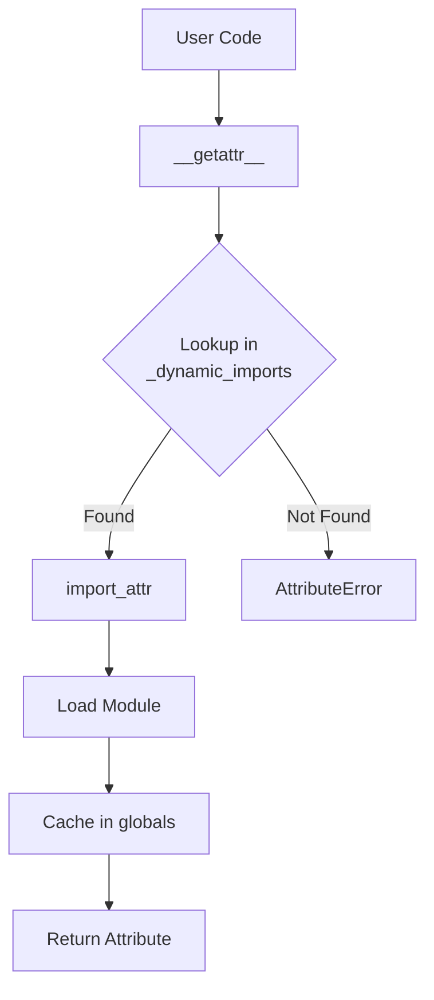
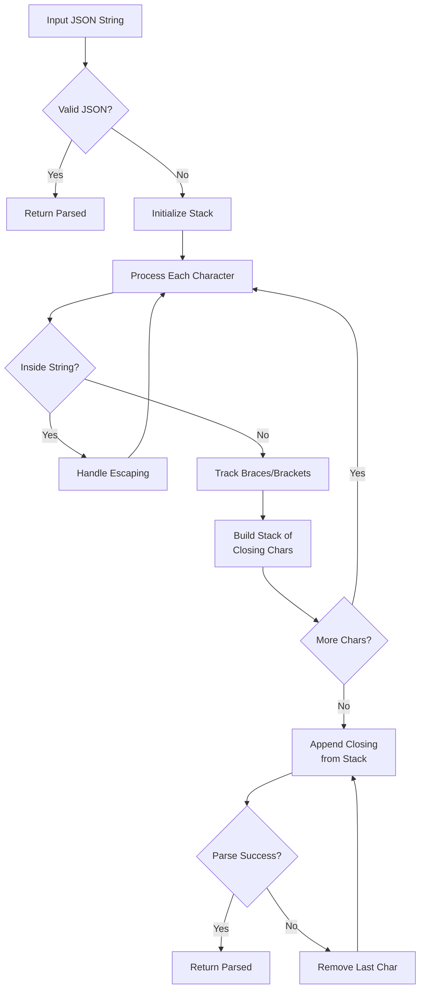
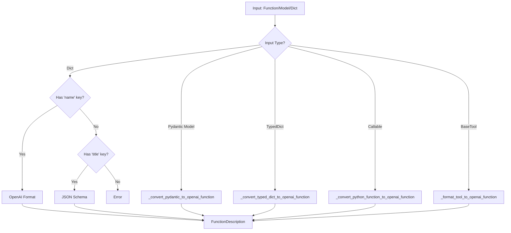
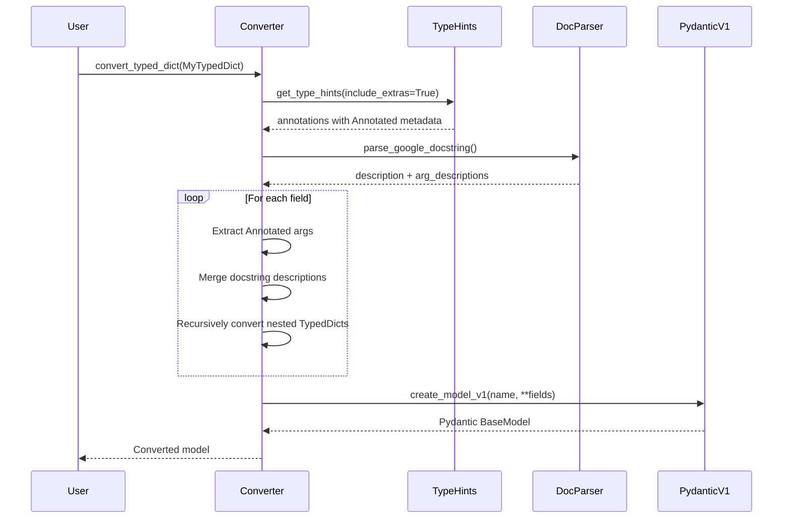
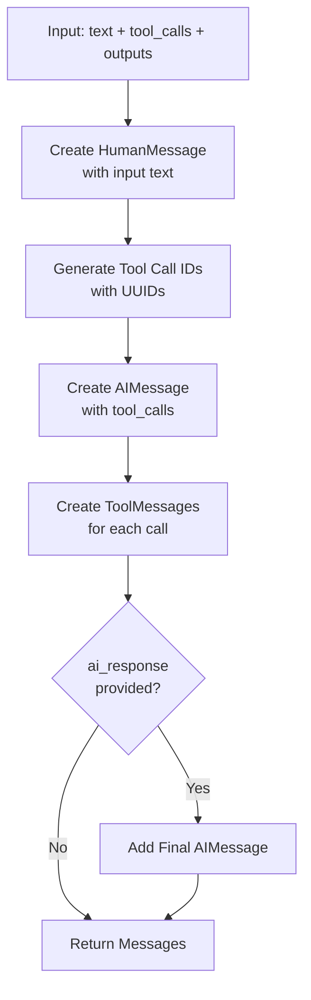

# Utility Modules

The Utility Modules in LangChain Core provide a comprehensive collection of helper functions and utilities that are foundational to the framework's operation. These modules are designed to be self-contained with no dependencies on other LangChain modules, making them the lowest-level building blocks of the framework. They cover a wide range of functionality including environment variable handling, JSON/JSON Schema manipulation, Pydantic model operations, function calling conversions, string formatting, and various helper utilities for async iteration, input/output formatting, and more.

The utility modules are organized into distinct submodules, each focusing on a specific domain of functionality. This modular design promotes code reusability and maintainability across the LangChain ecosystem while providing developers with battle-tested utilities for common tasks like parsing partial JSON, converting Python functions to OpenAI-compatible schemas, and managing Pydantic model compatibility across different versions.

Sources: [libs/core/langchain_core/utils/__init__.py:1-8](../../../libs/core/langchain_core/utils/__init__.py#L1-L8)

## Module Organization and Dynamic Imports

The utility modules employ a sophisticated lazy-loading mechanism to optimize import performance and reduce initial load times. The main `__init__.py` file uses dynamic imports through the `import_attr` function, which defers actual module loading until the specific utility is first accessed.



The dynamic import mapping defines the relationship between exported utilities and their source modules:

| Utility Category | Module Name | Key Functions/Classes |
|-----------------|-------------|----------------------|
| Image utilities | `image` | Image processing helpers |
| Async iteration | `aiter` | `abatch_iterate` |
| Environment | `env` | `get_from_dict_or_env`, `get_from_env` |
| Formatting | `formatting` | `StrictFormatter`, `formatter` |
| Input/Output | `input` | `get_bolded_text`, `get_colored_text`, `print_text` |
| Iteration | `iter` | `batch_iterate` |
| Pydantic | `pydantic` | `pre_init` |
| Strings | `strings` | `comma_list`, `sanitize_for_postgres`, `stringify_dict` |
| General utilities | `utils` | `build_extra_kwargs`, `check_package_version`, `xor_args` |

Sources: [libs/core/langchain_core/utils/__init__.py:51-85](../../../libs/core/langchain_core/utils/__init__.py#L51-L85), [libs/core/langchain_core/utils/__init__.py:88-93](../../../libs/core/langchain_core/utils/__init__.py#L88-L93)

## Environment Variable Management

The environment utilities provide robust methods for retrieving configuration values from dictionaries or environment variables, with fallback mechanisms and validation.

### Key Functions

**`get_from_dict_or_env`** - Retrieves values with multiple key support and environment fallback:

```python
def get_from_dict_or_env(
    data: dict[str, Any],
    key: str | list[str],
    env_key: str,
    default: str | None = None,
) -> str:
```

This function attempts to retrieve a value from a dictionary first, supporting multiple possible keys (useful for backward compatibility), and falls back to an environment variable if not found.

**`get_from_env`** - Direct environment variable retrieval with validation:

```python
def get_from_env(key: str, env_key: str, default: str | None = None) -> str:
```

**`env_var_is_set`** - Checks if an environment variable is set and not a falsy value:

```python
def env_var_is_set(env_var: str) -> bool:
    return env_var in os.environ and os.environ[env_var] not in {
        "",
        "0",
        "false",
        "False",
    }
```

The function explicitly treats empty strings, "0", "false", and "False" as unset values, providing consistent boolean semantics for environment variables.

Sources: [libs/core/langchain_core/utils/env.py:1-76](../../../libs/core/langchain_core/utils/env.py#L1-L76)

## JSON and JSON Schema Utilities

The JSON utilities provide sophisticated parsing and schema manipulation capabilities, essential for handling LLM outputs and OpenAI function calling.

### Partial JSON Parsing

The `parse_partial_json` function handles incomplete JSON strings that may be missing closing braces, which is common when streaming LLM responses:



The parser intelligently handles:
- Unclosed strings by adding closing quotes
- Unescaped newlines by converting them to `\n`
- Missing closing braces/brackets by tracking open structures
- Iterative repair by removing characters until valid JSON is achieved

Sources: [libs/core/langchain_core/utils/json.py:60-110](../../../libs/core/langchain_core/utils/json.py#L60-L110)

### JSON Schema Dereferencing

The `dereference_refs` function resolves JSON Schema `$ref` references, handling complex cases including circular references and mixed `$ref` objects:

```python
def dereference_refs(
    schema_obj: dict,
    *,
    full_schema: dict | None = None,
    skip_keys: Sequence[str] | None = None,
) -> dict:
```

**Reference Resolution Strategy:**

| Reference Type | Handling Approach |
|---------------|-------------------|
| Pure `$ref` | Replace with resolved definition |
| Mixed `$ref` | Merge resolved definition with additional properties |
| Circular `$ref` | Break cycle, preserve non-ref properties |
| Nested `$ref` | Recursively resolve all levels |

The function supports two resolution modes controlled by the `skip_keys` parameter:
- **Shallow mode** (`skip_keys=None`): Only breaks cycles, recurses under `$defs` only
- **Deep mode** (`skip_keys=[]` or list): Fully inlines all nested references, recurses everywhere

Sources: [libs/core/langchain_core/utils/json_schema.py:1-223](../../../libs/core/langchain_core/utils/json_schema.py#L1-L223)

### Markdown JSON Extraction

The `parse_json_markdown` function extracts JSON from markdown code blocks, commonly used when LLMs wrap their JSON responses in triple backticks:

```python
def parse_json_markdown(
    json_string: str, *, parser: Callable[[str], Any] = parse_partial_json
) -> Any:
```

This function first attempts to parse the entire string as JSON, then falls back to extracting content from markdown code blocks using regex pattern matching.

Sources: [libs/core/langchain_core/utils/json.py:113-129](../../../libs/core/langchain_core/utils/json.py#L113-L129)

## Pydantic Utilities and Model Management

The Pydantic utilities provide comprehensive support for working with Pydantic models across both v1 and v2, enabling backward compatibility and advanced model manipulation.

### Version Detection and Compatibility

The module defines constants for version checking and provides helper functions to identify model types:

```python
PYDANTIC_VERSION = version.parse(pydantic.__version__)
PYDANTIC_MAJOR_VERSION = PYDANTIC_VERSION.major
PYDANTIC_MINOR_VERSION = PYDANTIC_VERSION.minor

IS_PYDANTIC_V1 = False
IS_PYDANTIC_V2 = True
```

**Type Checking Functions:**

| Function | Purpose |
|----------|---------|
| `is_pydantic_v1_subclass(cls)` | Check if class is Pydantic v1 BaseModel |
| `is_pydantic_v2_subclass(cls)` | Check if class is Pydantic v2 BaseModel |
| `is_basemodel_subclass(cls)` | Check if class is any Pydantic BaseModel |
| `is_basemodel_instance(obj)` | Check if object is BaseModel instance |

Sources: [libs/core/langchain_core/utils/pydantic.py:42-108](../../../libs/core/langchain_core/utils/pydantic.py#L42-L108)

### Pre-Initialization Decorator

The `pre_init` decorator enables running custom logic before model initialization, with automatic handling of field aliases and defaults:

```mermaid
graph TD
    A[Model Init Called] --> B[@pre_init Decorator]
    B --> C[Check Field Aliases]
    C --> D{populate_by_name<br/>enabled?}
    D -->|Yes| E[Remap Alias to Name]
    D -->|No| F[Continue]
    E --> F
    F --> G{Field Missing<br/>or None?}
    G -->|Yes| H{Has default_factory?}
    H -->|Yes| I[Call Factory]
    H -->|No| J[Use default Value]
    G -->|No| K[Keep Value]
    I --> L[Execute User Function]
    J --> L
    K --> L
    L --> M[Return Values Dict]
```

The decorator uses Pydantic's deprecated `root_validator` for backward compatibility, as it maintains the correct validator execution order that `model_validator(mode="before")` would change.

Sources: [libs/core/langchain_core/utils/pydantic.py:110-157](../../../libs/core/langchain_core/utils/pydantic.py#L110-L157)

### Dynamic Model Creation

The module provides `create_model_v2` for creating Pydantic models dynamically with support for both regular models and root models:

```python
def create_model_v2(
    model_name: str,
    *,
    module_name: str | None = None,
    field_definitions: dict[str, Any] | None = None,
    root: Any | None = None,
) -> type[BaseModel]:
```

**Reserved Name Handling:**

The system automatically remaps fields that collide with Pydantic's internal methods (e.g., `model_dump`, `schema`, `validate`) by prefixing them with `private_` and using aliases:

```python
_RESERVED_NAMES = {key for key in dir(BaseModel) if not key.startswith("_")}

def _remap_field_definitions(field_definitions: dict[str, Any]) -> dict[str, Any]:
    remapped = {}
    for key, value in field_definitions.items():
        if key.startswith("_") or key in _RESERVED_NAMES:
            # Remap to avoid collision
            remapped[f"private_{key}"] = (
                type_,
                Field(alias=key, serialization_alias=key, ...)
            )
```

Sources: [libs/core/langchain_core/utils/pydantic.py:356-424](../../../libs/core/langchain_core/utils/pydantic.py#L356-L424), [libs/core/langchain_core/utils/pydantic.py:426-444](../../../libs/core/langchain_core/utils/pydantic.py#L426-L444)

### Subset Model Creation

The `_create_subset_model` function creates new Pydantic models with only a subset of the original model's fields, useful for partial updates or selective validation:

```python
def _create_subset_model(
    name: str,
    model: TypeBaseModel,
    field_names: list[str],
    *,
    descriptions: dict | None = None,
    fn_description: str | None = None,
) -> type[BaseModel]:
```

The implementation automatically detects whether the input is a Pydantic v1 or v2 model and uses the appropriate creation method, preserving field metadata, defaults, and annotations.

Sources: [libs/core/langchain_core/utils/pydantic.py:238-282](../../../libs/core/langchain_core/utils/pydantic.py#L238-L282)

## Function Calling and OpenAI Schema Conversion

The function calling utilities provide comprehensive support for converting Python functions, Pydantic models, and TypedDicts into OpenAI-compatible function schemas.

### Conversion Architecture



### Core Conversion Functions

**`convert_to_openai_function`** - Main entry point for function conversion:

```python
def convert_to_openai_function(
    function: Mapping[str, Any] | type | Callable | BaseTool,
    *,
    strict: bool | None = None,
) -> dict[str, Any]:
```

This function handles multiple input formats:
- Anthropic format tools with `name` and `input_schema`
- Amazon Bedrock Converse format with `toolSpec`
- Existing OpenAI format (passthrough with optional `strict` addition)
- JSON schemas with `title` field
- Pydantic models (v1 and v2)
- TypedDicts
- LangChain BaseTool instances
- Plain Python callables

Sources: [libs/core/langchain_core/utils/function_calling.py:253-363](../../../libs/core/langchain_core/utils/function_calling.py#L253-L363)

### Strict Mode Support

When `strict=True`, the converter enforces OpenAI's strict mode requirements:

1. All fields become required
2. `additionalProperties: false` is recursively set at all schema levels
3. Applies to all nested objects, arrays, and `anyOf` schemas

```python
def _recursive_set_additional_properties_false(
    schema: dict[str, Any],
) -> dict[str, Any]:
    if isinstance(schema, dict):
        if "required" in schema or ("properties" in schema and not schema["properties"]):
            schema["additionalProperties"] = False
        # Recursively process properties, items, anyOf...
```

Sources: [libs/core/langchain_core/utils/function_calling.py:339-362](../../../libs/core/langchain_core/utils/function_calling.py#L339-L362), [libs/core/langchain_core/utils/function_calling.py:693-715](../../../libs/core/langchain_core/utils/function_calling.py#L693-L715)

### TypedDict to Pydantic Conversion

The system converts TypedDicts to Pydantic models to leverage schema generation, with special handling for `Annotated` types and docstring parsing:



The converter respects `Annotated` types with default values and descriptions:

```python
annotations_ = get_type_hints(typed_dict, include_extras=True)
for arg, arg_type in annotations_.items():
    if get_origin(arg_type) in {Annotated, typing_extensions.Annotated}:
        annotated_args = get_args(arg_type)
        field_kwargs = dict(
            zip(("default", "description"), annotated_args[1:], strict=False)
        )
```

Sources: [libs/core/langchain_core/utils/function_calling.py:519-595](../../../libs/core/langchain_core/utils/function_calling.py#L519-L595)

### Tool Format Conversion

**`convert_to_openai_tool`** - Wraps functions in the OpenAI tool schema:

```python
def convert_to_openai_tool(
    tool: Mapping[str, Any] | type[BaseModel] | Callable | BaseTool,
    *,
    strict: bool | None = None,
) -> dict[str, Any]:
```

This function recognizes well-known OpenAI tool types and passes them through unchanged:

| Tool Type | Description |
|-----------|-------------|
| `function` | Standard function tool |
| `file_search` | File search capability |
| `computer` / `computer_use_preview` | Computer use tools |
| `code_interpreter` | Code execution |
| `mcp` | Model Context Protocol |
| `image_generation` | Image generation tool |
| `web_search` / `web_search_preview` | Web search capabilities |
| `tool_search` | Tool discovery |
| `namespace` | Namespace management |

Sources: [libs/core/langchain_core/utils/function_calling.py:365-476](../../../libs/core/langchain_core/utils/function_calling.py#L365-L476)

### Google-Style Docstring Parsing

The `_parse_google_docstring` function extracts function and argument descriptions from Google-style Python docstrings:

```python
def _parse_google_docstring(
    docstring: str | None,
    args: list[str],
    *,
    error_on_invalid_docstring: bool = False,
) -> tuple[str, dict]:
```

The parser:
- Extracts the main description from blocks before "Args:"
- Parses argument descriptions from the "Args:" section
- Handles multi-line argument descriptions
- Stops at "Returns:" or "Example:" sections
- Validates docstring structure when `error_on_invalid_docstring=True`

Sources: [libs/core/langchain_core/utils/function_calling.py:639-691](../../../libs/core/langchain_core/utils/function_calling.py#L639-L691)

## Type Mappings and Compatibility

The function calling module maintains compatibility mappings for different Python versions and type systems:

```python
PYTHON_TO_JSON_TYPES = {
    "str": "string",
    "int": "integer",
    "float": "number",
    "bool": "boolean",
}

_ORIGIN_MAP: dict[type, Any] = {
    dict: dict,
    list: list,
    tuple: tuple,
    set: set,
    collections.abc.Iterable: typing.Iterable,
    collections.abc.Mapping: typing.Mapping,
    collections.abc.Sequence: typing.Sequence,
    collections.abc.MutableMapping: typing.MutableMapping,
}
# Add UnionType mapping for Python 3.10+
if hasattr(types, "UnionType"):
    _ORIGIN_MAP[types.UnionType] = Union
```

The `_py_38_safe_origin` function ensures type origins are compatible with Python 3.8's type system, which lacks some of the newer `collections.abc` generic types.

Sources: [libs/core/langchain_core/utils/function_calling.py:50-69](../../../libs/core/langchain_core/utils/function_calling.py#L50-L69), [libs/core/langchain_core/utils/function_calling.py:597-599](../../../libs/core/langchain_core/utils/function_calling.py#L597-L599)

## Tool Example Conversion for LLM Training

The `tool_example_to_messages` function converts tool call examples into message sequences suitable for few-shot prompting or fine-tuning:



The function creates a standardized message sequence:
1. **HumanMessage**: Contains the input text
2. **AIMessage**: Contains the tool calls with generated IDs
3. **ToolMessage(s)**: Confirmation messages for each tool call
4. **AIMessage** (optional): Final response after tool execution

```python
@beta()
def tool_example_to_messages(
    input: str,
    tool_calls: list[BaseModel],
    tool_outputs: list[str] | None = None,
    *,
    ai_response: str | None = None,
) -> list[BaseMessage]:
```

This format is optimized for chat models that are "hyper-optimized for agents rather than for an extraction use case."

Sources: [libs/core/langchain_core/utils/function_calling.py:478-546](../../../libs/core/langchain_core/utils/function_calling.py#L478-L546)

## Summary

The LangChain Core utility modules provide a robust foundation for the framework, offering essential functionality across multiple domains. The environment utilities enable flexible configuration management, the JSON utilities handle partial and malformed JSON common in LLM outputs, the Pydantic utilities ensure compatibility across framework versions, and the function calling utilities enable seamless integration with OpenAI's function calling API and similar interfaces.

These utilities are carefully designed to be self-contained, well-tested, and version-aware, making them reliable building blocks for higher-level LangChain components. The lazy-loading architecture ensures optimal performance, while the comprehensive type checking and conversion functions provide developers with powerful tools for working with diverse data formats and model schemas.