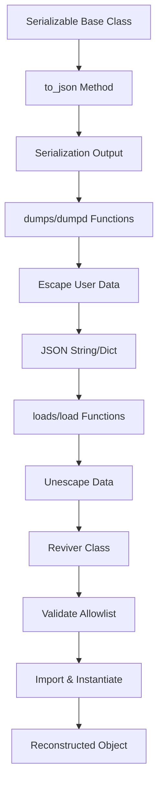
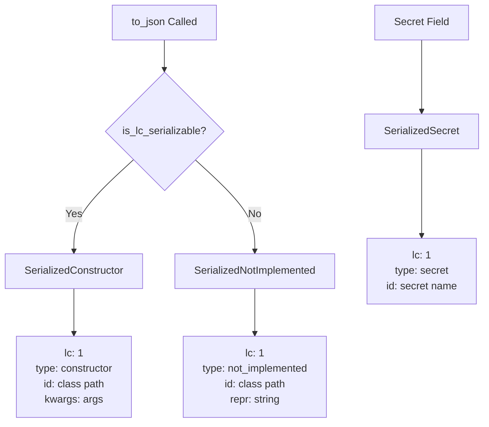
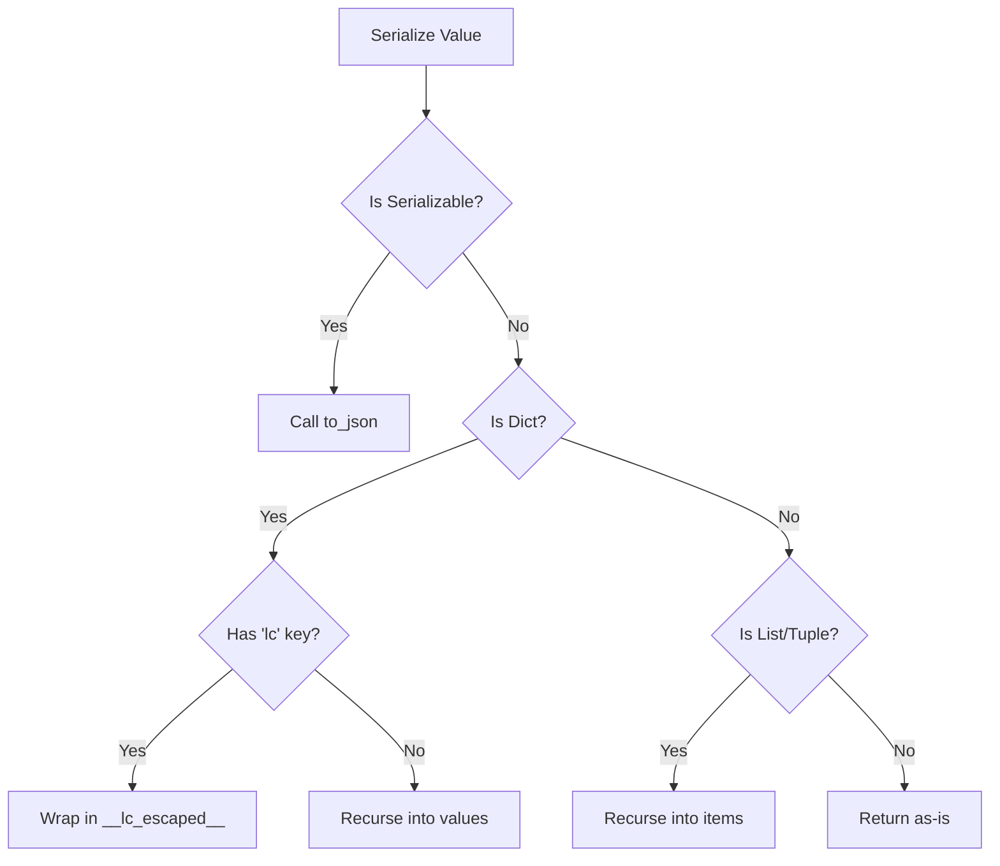
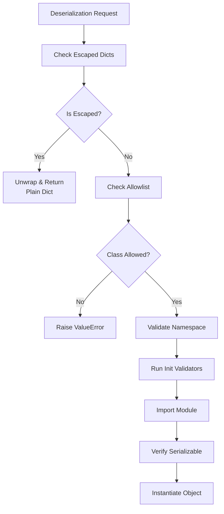
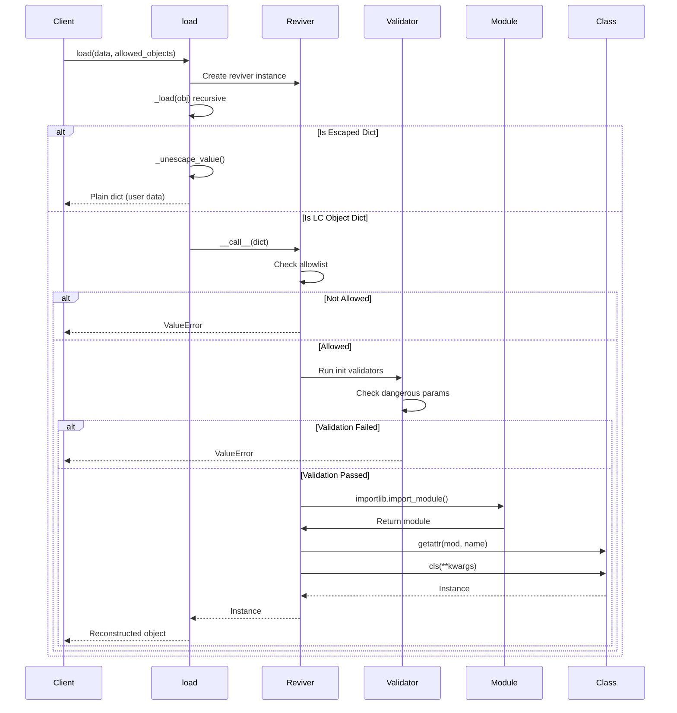
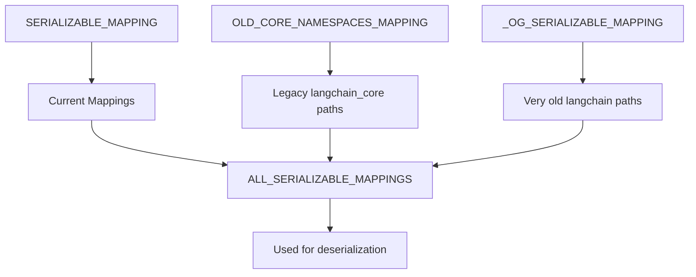
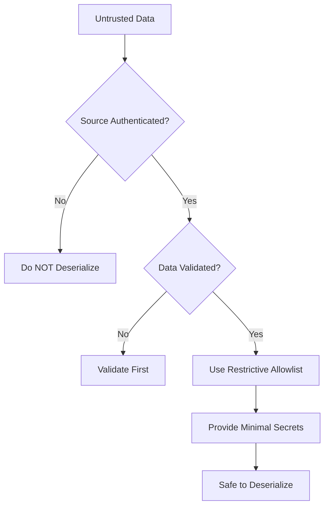

# Serialization Framework (Serializable, dump, load)

The LangChain serialization framework provides a robust system for converting LangChain objects to JSON and reconstructing them from JSON. This framework is built around three core components: the `Serializable` base class that defines how objects serialize themselves, the `dump` functions (`dumps`, `dumpd`) that convert objects to JSON, and the `load` functions (`loads`, `load`) that reconstruct objects from JSON. The framework includes security features to prevent injection attacks and supports versioning to maintain backward compatibility as the codebase evolves.

The serialization system uses an allowlist-based security model where only explicitly permitted classes can be deserialized, protecting against arbitrary code execution. It also employs an escape-based mechanism to distinguish between LangChain objects and user data, preventing malicious payloads from being instantiated as LangChain objects during deserialization.

Sources: [serializable.py:1-10](../../../libs/core/langchain_core/load/serializable.py#L1-L10), [dump.py:1-17](../../../libs/core/langchain_core/load/dump.py#L1-L17), [load.py:1-40](../../../libs/core/langchain_core/load/load.py#L1-L40)

## Architecture Overview

The serialization framework is organized into several key modules that work together to provide safe and reliable object persistence:



The framework consists of:

- **Serializable Base Class**: Defines the interface for serializable objects and provides the `to_json()` method
- **Dump Module**: Converts objects to JSON with escape-based injection protection
- **Load Module**: Reconstructs objects from JSON with allowlist-based security
- **Mapping Module**: Maintains backward compatibility mappings for moved/renamed classes
- **Validation Module**: Implements escape/unescape logic and class-specific validators

Sources: [serializable.py:48-90](../../../libs/core/langchain_core/load/serializable.py#L48-L90), [dump.py:1-17](../../../libs/core/langchain_core/load/dump.py#L1-L17), [load.py:1-40](../../../libs/core/langchain_core/load/load.py#L1-L40)

## Serializable Base Class

The `Serializable` class is an abstract base class that inherits from Pydantic's `BaseModel` and provides the foundation for all serializable LangChain objects.

### Core Properties and Methods

| Method/Property | Purpose | Default Behavior |
|----------------|---------|------------------|
| `is_lc_serializable()` | Class method determining if class can be serialized | Returns `False` (opt-in) |
| `get_lc_namespace()` | Returns module path as namespace | Splits `__module__` on `'.'` |
| `lc_id()` | Returns unique identifier for serialization | Namespace + class name |
| `lc_secrets` | Maps constructor args to secret IDs | Empty dict |
| `lc_attributes` | Additional attributes to serialize | Empty dict |
| `to_json()` | Serializes object to JSON dict | Constructor format or not_implemented |

Sources: [serializable.py:48-90](../../../libs/core/langchain_core/load/serializable.py#L48-L90)

### Serialization Format

The `to_json()` method produces one of three serialization formats:



**SerializedConstructor** format (for serializable objects):
```python
{
    "lc": 1,
    "type": "constructor",
    "id": ["langchain_core", "messages", "ai", "AIMessage"],
    "kwargs": {"content": "Hello", "additional_kwargs": {}}
}
```

**SerializedSecret** format (for sensitive data):
```python
{
    "lc": 1,
    "type": "secret",
    "id": ["OPENAI_API_KEY"]
}
```

**SerializedNotImplemented** format (for non-serializable objects):
```python
{
    "lc": 1,
    "type": "not_implemented",
    "id": ["module", "path", "ClassName"],
    "repr": "<object repr>"
}
```

Sources: [serializable.py:17-45](../../../libs/core/langchain_core/load/serializable.py#L17-L45), [serializable.py:127-191](../../../libs/core/langchain_core/load/serializable.py#L127-L191)

### Field Filtering Logic

The serialization process includes sophisticated logic to determine which fields should be included in the serialized output:

```python
def _is_field_useful(inst: Serializable, key: str, value: Any) -> bool:
    """Check if a field is useful as a constructor argument."""
    field = type(inst).model_fields.get(key)
    if not field:
        return False
    
    if field.is_required():
        return True
    
    # Check if value differs from default
    if value_is_truthy:
        return True
    
    # Special handling for dict/list defaults
    if field.default_factory is dict and isinstance(value, dict):
        return False
    
    if field.default_factory is list and isinstance(value, list):
        return False
    
    return value_neq_default
```

This ensures that only non-default values are serialized, reducing payload size and avoiding unnecessary data transfer.

Sources: [serializable.py:214-261](../../../libs/core/langchain_core/load/serializable.py#L214-L261)

### Secret Handling

Secrets are replaced with special markers during serialization to prevent accidental exposure:

```python
def _replace_secrets(
    root: dict[Any, Any], secrets_map: dict[str, str]
) -> dict[Any, Any]:
    """Replace secret values with secret markers."""
    result = root.copy()
    for path, secret_id in secrets_map.items():
        [*parts, last] = path.split(".")
        current = result
        for part in parts:
            if part not in current:
                break
            current[part] = current[part].copy()
            current = current[part]
        if last in current:
            current[last] = {
                "lc": 1,
                "type": "secret",
                "id": [secret_id],
            }
    return result
```

Sources: [serializable.py:263-285](../../../libs/core/langchain_core/load/serializable.py#L263-L285)

## Dump Functions (Serialization)

The dump module provides two main functions for serializing LangChain objects to JSON format.

### dumps() - Serialize to String

```python
def dumps(obj: Any, *, pretty: bool = False, **kwargs: Any) -> str:
    """Return a JSON string representation of an object.
    
    Plain dicts containing an 'lc' key are automatically escaped to prevent
    confusion with LC serialization format.
    """
```

The function:
1. Converts nested Pydantic models to dicts (special handling for `ChatGeneration` with parsed models)
2. Applies escape-based protection via `_serialize_value()`
3. Returns JSON string (optionally pretty-printed with indentation)

Sources: [dump.py:59-95](../../../libs/core/langchain_core/load/dump.py#L59-L95)

### dumpd() - Serialize to Dict

```python
def dumpd(obj: Any) -> Any:
    """Return a dict representation of an object.
    
    Plain dicts containing an 'lc' key are automatically escaped.
    """
```

Similar to `dumps()` but returns a Python dictionary instead of a JSON string, useful when JSON encoding will be performed later.

Sources: [dump.py:98-112](../../../libs/core/langchain_core/load/dump.py#L98-L112)

### Escape-Based Injection Protection

The serialization process protects against injection attacks by escaping user data that could be confused with LangChain objects:



When a plain dictionary contains an `'lc'` key (which could be mistaken for a LangChain serialization marker), it is wrapped:

```python
{"lc": 1, "user_data": "value"}  # User data
# becomes:
{"__lc_escaped__": {"lc": 1, "user_data": "value"}}
```

This ensures that during deserialization, only dicts explicitly produced by `Serializable.to_json()` are treated as LangChain objects.

Sources: [_validation.py:1-31](../../../libs/core/langchain_core/load/_validation.py#L1-L31), [_validation.py:34-57](../../../libs/core/langchain_core/load/_validation.py#L34-L57), [_validation.py:60-99](../../../libs/core/langchain_core/load/_validation.py#L60-L99)

## Load Functions (Deserialization)

The load module provides secure deserialization with allowlist-based protection and escape handling.

### Security Model

The deserialization system implements multiple layers of security:



**Key Security Features:**

1. **Allowlist-based**: Only classes in the allowlist can be instantiated
2. **Namespace validation**: Import paths must be from trusted namespaces
3. **Init validators**: Class-specific validators prevent dangerous configurations
4. **Escape handling**: User data is never instantiated as LC objects
5. **Secrets control**: Environment variable access is disabled by default

Sources: [load.py:1-123](../../../libs/core/langchain_core/load/load.py#L1-L123)

### Allowlist Modes

The `allowed_objects` parameter controls which classes can be deserialized:

| Mode | Description | Use Case |
|------|-------------|----------|
| `'core'` (default) | Only `langchain_core` classes from mappings | Safe for messages, documents, prompts |
| `'all'` | All classes in serialization mappings | Includes partner integrations |
| `[Class1, Class2, ...]` | Explicit class list | Most restrictive, recommended |
| `[]` | Empty list | Disallow all deserialization |

Sources: [load.py:239-266](../../../libs/core/langchain_core/load/load.py#L239-L266)

### Reviver Class

The `Reviver` class is used as the `object_hook` for JSON deserialization and handles the reconstruction of LangChain objects:

```python
class Reviver:
    """Reviver for JSON objects.
    
    Used as the object_hook for json.loads to reconstruct LangChain objects
    from their serialized JSON representation.
    """
    
    def __init__(
        self,
        allowed_objects: Iterable[AllowedObject] | Literal["all", "core"] = "core",
        secrets_map: dict[str, str] | None = None,
        valid_namespaces: list[str] | None = None,
        secrets_from_env: bool = False,
        additional_import_mappings: dict[tuple[str, ...], tuple[str, ...]] | None = None,
        *,
        ignore_unserializable_fields: bool = False,
        init_validator: InitValidator | None = default_init_validator,
    ) -> None:
        # Initialize allowlist, mappings, validators
```

The reviver processes each dictionary in the JSON tree and:
1. Checks for escaped dicts first (returns unwrapped user data)
2. Checks for secret markers (returns secret value or None)
3. Checks for constructor format (validates and instantiates)
4. Returns plain dicts unchanged

Sources: [load.py:268-359](../../../libs/core/langchain_core/load/load.py#L268-L359)

### Deserialization Flow



Sources: [load.py:575-611](../../../libs/core/langchain_core/load/load.py#L575-L611), [load.py:361-458](../../../libs/core/langchain_core/load/load.py#L361-L458)

### Init Validators

Init validators provide class-specific security checks before instantiation:

**Default Validator** - Blocks Jinja2 templates:
```python
def default_init_validator(
    class_path: tuple[str, ...],
    kwargs: dict[str, Any],
) -> None:
    """Default init validator that blocks jinja2 templates."""
    if kwargs.get("template_format") == "jinja2":
        raise ValueError(
            "Jinja2 templates are not allowed during deserialization for security "
            "reasons. Use 'f-string' template format instead..."
        )
```

**Bedrock Validator** - Prevents SSRF attacks:
```python
def _bedrock_validator(class_path: tuple[str, ...], kwargs: dict[str, Any]) -> None:
    """Blocks deserialization if endpoint_url or base_url parameters are present."""
    dangerous_params = ["endpoint_url", "base_url"]
    found_params = [p for p in dangerous_params if p in kwargs]
    
    if found_params:
        raise ValueError(
            f"Deserialization of {class_name} with {param_str} is not allowed "
            f"for security reasons. These parameters can enable Server-Side Request "
            f"Forgery (SSRF) attacks..."
        )
```

Sources: [load.py:137-159](../../../libs/core/langchain_core/load/load.py#L137-L159), [validators.py:12-46](../../../libs/core/langchain_core/load/validators.py#L12-L46)

### loads() and load() Functions

**loads()** - Deserialize from JSON string:
```python
@beta()
def loads(
    text: str,
    *,
    allowed_objects: Iterable[AllowedObject] | Literal["all", "core"] = "core",
    secrets_map: dict[str, str] | None = None,
    valid_namespaces: list[str] | None = None,
    secrets_from_env: bool = False,
    additional_import_mappings: dict[tuple[str, ...], tuple[str, ...]] | None = None,
    ignore_unserializable_fields: bool = False,
    init_validator: InitValidator | None = default_init_validator,
) -> Any:
    """Revive a LangChain class from a JSON string."""
```

**load()** - Deserialize from parsed JSON object:
```python
@beta()
def load(
    obj: Any,
    *,
    allowed_objects: Iterable[AllowedObject] | Literal["all", "core"] = "core",
    # ... same parameters as loads()
) -> Any:
    """Revive a LangChain class from a JSON object."""
```

Both functions create a `Reviver` instance and recursively process the object tree, checking for escaped dicts before applying the reviver to each dictionary.

Sources: [load.py:461-513](../../../libs/core/langchain_core/load/load.py#L461-L513), [load.py:516-611](../../../libs/core/langchain_core/load/load.py#L516-L611)

## Serialization Mappings

The mapping module maintains backward compatibility by mapping legacy class paths to current import paths.

### Mapping Structure

The framework uses three main mapping dictionaries:



**Mapping Format:**
```python
SERIALIZABLE_MAPPING: dict[tuple[str, ...], tuple[str, ...]] = {
    # Serialized path -> Import path
    ("langchain", "schema", "messages", "AIMessage"): (
        "langchain_core",
        "messages",
        "ai",
        "AIMessage",
    ),
}
```

This allows objects serialized with old LangChain versions (where `AIMessage` was at `langchain.schema.messages.AIMessage`) to be deserialized with new versions (where it's at `langchain_core.messages.ai.AIMessage`).

Sources: [mapping.py:1-25](../../../libs/core/langchain_core/load/mapping.py#L1-L25), [mapping.py:27-65](../../../libs/core/langchain_core/load/mapping.py#L27-L65)

### Key Mapping Categories

| Mapping | Purpose | Example |
|---------|---------|---------|
| `SERIALIZABLE_MAPPING` | Current standard mappings | Messages, prompts, runnables |
| `OLD_CORE_NAMESPACES_MAPPING` | Legacy `langchain_core` paths | Early `langchain_core` versions |
| `_OG_SERIALIZABLE_MAPPING` | Very old `langchain` paths | Pre-split package structure |
| `_JS_SERIALIZABLE_MAPPING` | JavaScript LangChain compatibility | Cross-language serialization |

Sources: [mapping.py:277-370](../../../libs/core/langchain_core/load/mapping.py#L277-L370), [mapping.py:372-588](../../../libs/core/langchain_core/load/mapping.py#L372-L588), [mapping.py:590-683](../../../libs/core/langchain_core/load/mapping.py#L590-L683)

### Default Namespaces

The framework defines trusted namespaces from which classes can be imported:

```python
DEFAULT_NAMESPACES = [
    "langchain",
    "langchain_core",
    "langchain_community",
    "langchain_anthropic",
    "langchain_groq",
    "langchain_google_genai",
    "langchain_aws",
    "langchain_openai",
    "langchain_google_vertexai",
    "langchain_mistralai",
    "langchain_fireworks",
    "langchain_xai",
    "langchain_sambanova",
    "langchain_perplexity",
]
```

Attempting to deserialize a class from an untrusted namespace will raise a `ValueError`.

Sources: [load.py:163-177](../../../libs/core/langchain_core/load/load.py#L163-L177)

## Validation and Escape Logic

The validation module provides the core escape/unescape logic that protects against injection attacks.

### Escape Detection

```python
def _needs_escaping(obj: dict[str, Any]) -> bool:
    """Check if a dict needs escaping.
    
    A dict needs escaping if:
    1. It has an 'lc' key (could be confused with LC serialization format)
    2. It has only the escape key (would be mistaken for an escaped dict)
    """
    return "lc" in obj or (len(obj) == 1 and _LC_ESCAPED_KEY in obj)
```

This prevents two types of confusion:
- User data with `'lc'` key being treated as a LangChain object
- A dict with only `__lc_escaped__` key being treated as an already-escaped dict

Sources: [_validation.py:34-44](../../../libs/core/langchain_core/load/_validation.py#L34-L44)

### Serialization with Escaping

The serialization process recursively processes values and escapes dicts as needed:

```python
def _serialize_value(obj: Any) -> Any:
    """Serialize a value with escaping of user dicts."""
    if isinstance(obj, Serializable):
        return _serialize_lc_object(obj)
    if isinstance(obj, dict):
        if not all(isinstance(k, (str, int, float, bool, type(None))) for k in obj):
            return to_json_not_implemented(obj)
        # Check if dict needs escaping BEFORE recursing
        if _needs_escaping(obj):
            return _escape_dict(obj)
        # Safe dict - recurse into values
        return {k: _serialize_value(v) for k, v in obj.items()}
    # ... handle lists, primitives, etc.
```

Escaping happens **before** recursion to ensure that escaped content is preserved as-is.

Sources: [_validation.py:60-99](../../../libs/core/langchain_core/load/_validation.py#L60-L99)

### Deserialization with Unescaping

During deserialization, escaped dicts are unwrapped and returned as plain user data:

```python
def _unescape_value(obj: Any) -> Any:
    """Unescape a value, processing escape markers.
    
    When an escaped dict is encountered, it's unwrapped and the contents
    are returned AS-IS (no further processing).
    """
    if isinstance(obj, dict):
        if _is_escaped_dict(obj):
            # Unwrap and return user data as-is
            return obj[_LC_ESCAPED_KEY]
        # Regular dict - recurse to find nested escape markers
        return {k: _unescape_value(v) for k, v in obj.items()}
    if isinstance(obj, list):
        return [_unescape_value(item) for item in obj]
    return obj
```

This ensures that escaped user data is never instantiated as LangChain objects, even if it contains `'lc'` keys.

Sources: [_validation.py:127-153](../../../libs/core/langchain_core/load/_validation.py#L127-L153)

## Usage Examples

### Basic Serialization and Deserialization

```python
from langchain_core.load import dumps, loads
from langchain_core.messages import AIMessage

# Serialize
msg = AIMessage(content="Hello, world!")
serialized = dumps(msg)

# Deserialize with default allowlist (core only)
loaded = loads(serialized)

# Deserialize with explicit allowlist (most secure)
loaded = loads(serialized, allowed_objects=[AIMessage])
```

### Handling Secrets

```python
from langchain_core.load import dumps, loads

# Object with secrets
obj = MyLLM(api_key="secret_key_123")

# Serialize (secrets replaced with markers)
serialized = dumps(obj)

# Deserialize with secrets map
loaded = loads(
    serialized,
    secrets_map={"OPENAI_API_KEY": "secret_key_123"}
)
```

### Custom Import Mappings

```python
from langchain_core.load import load

# Add custom mappings for moved classes
loaded = load(
    data,
    additional_import_mappings={
        ("my_old_pkg", "OldClass"): ("my_new_pkg", "module", "NewClass"),
    }
)
```

Sources: [load.py:125-135](../../../libs/core/langchain_core/load/load.py#L125-L135), [load.py:558-573](../../../libs/core/langchain_core/load/load.py#L558-L573)

## Security Best Practices

The framework implements several security layers, but users should follow these best practices:

1. **Use the most restrictive allowlist**: Prefer explicit class lists over `'core'` or `'all'`
2. **Keep `secrets_from_env=False`**: Only enable on fully trusted data
3. **Provide minimal `secrets_map`**: Include only required secrets
4. **Validate untrusted input**: Never deserialize data from unauthenticated sources
5. **Use init validators**: Add custom validators for sensitive classes



The allowlist approach ensures that even if an attacker crafts a malicious payload, only explicitly permitted classes can be instantiated. The escape mechanism ensures that user data is never confused with LangChain objects.

Sources: [load.py:27-123](../../../libs/core/langchain_core/load/load.py#L27-L123), [validators.py:1-10](../../../libs/core/langchain_core/load/validators.py#L1-L10)

## Summary

The LangChain serialization framework provides a comprehensive solution for persisting and reconstructing LangChain objects with multiple layers of security. The `Serializable` base class defines the serialization interface, the dump functions convert objects to JSON with escape-based injection protection, and the load functions reconstruct objects using allowlist-based validation. The mapping system ensures backward compatibility across versions, while the validation module provides both general and class-specific security checks. This architecture enables safe object persistence while maintaining flexibility for legitimate use cases.