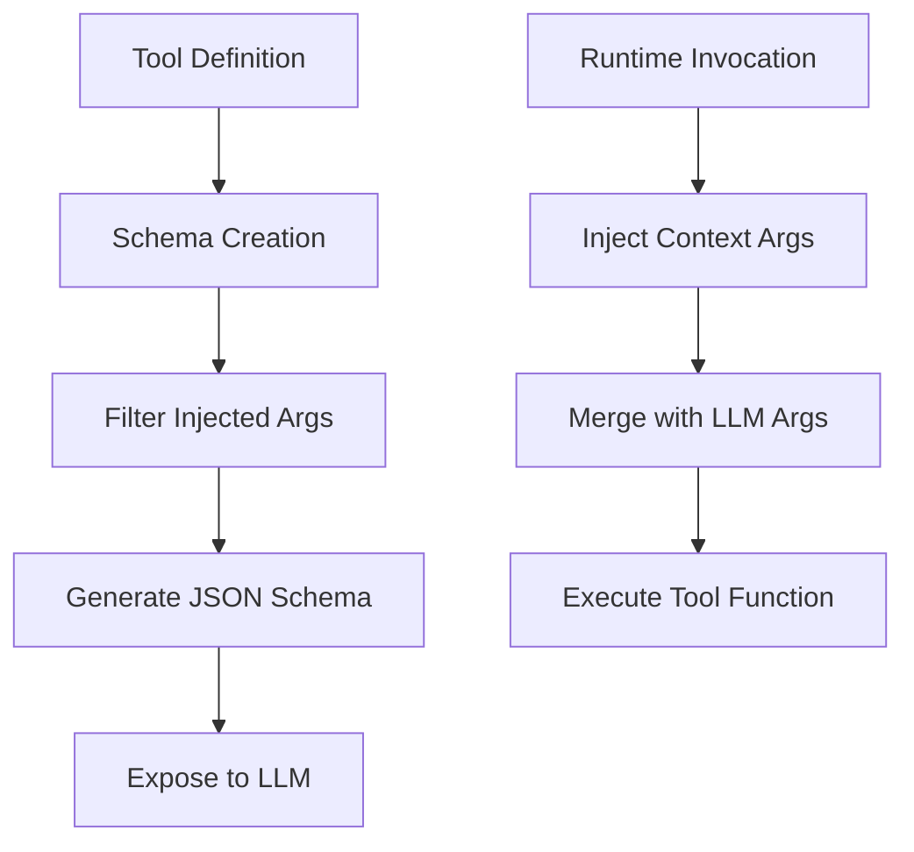
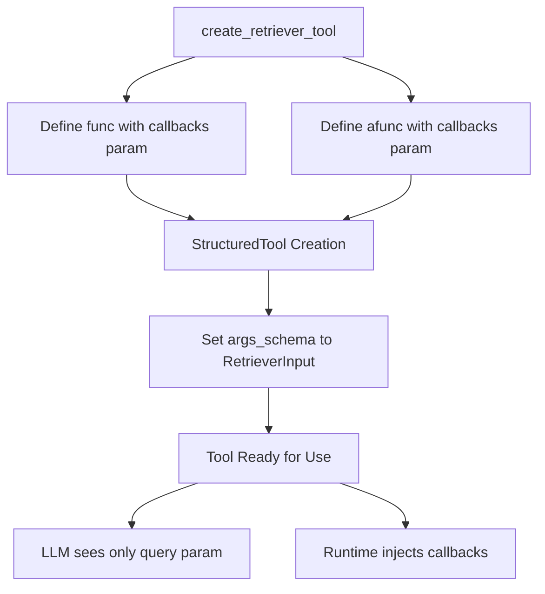
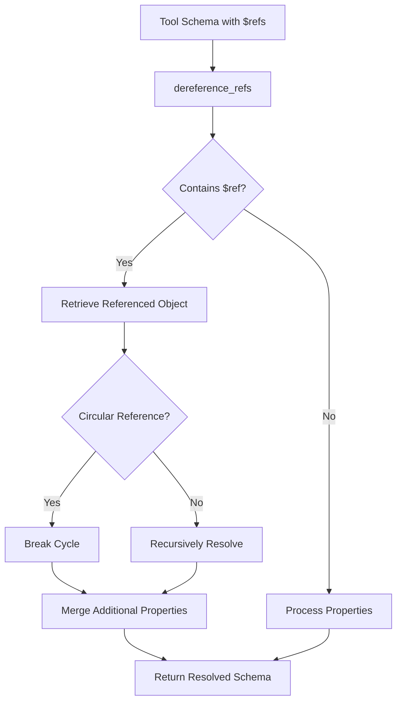
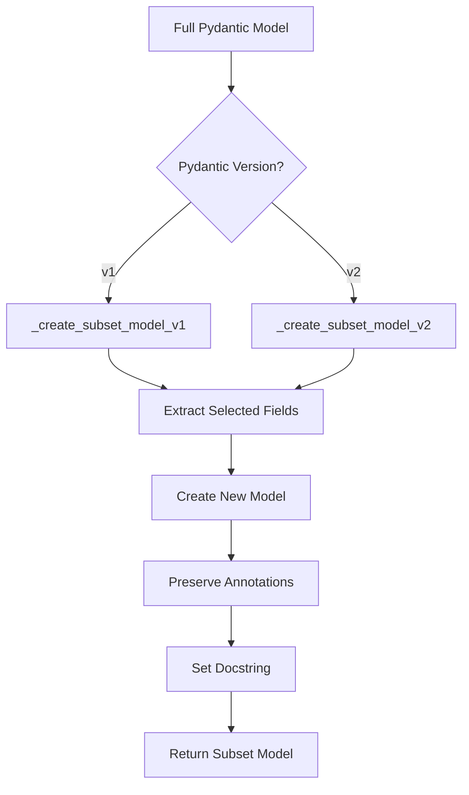
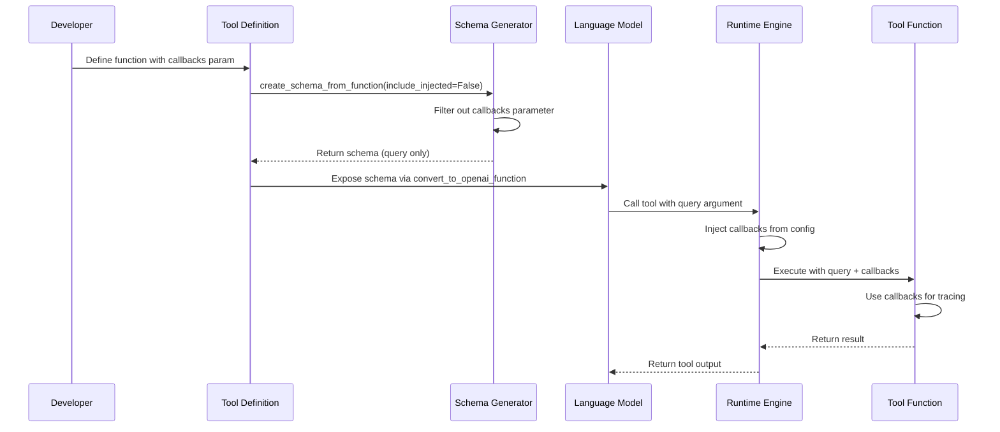

# Tool Argument Injection & Runtime Context

Tool argument injection and runtime context in LangChain refers to the mechanism by which certain parameters can be automatically injected into tool functions at runtime without requiring the language model to explicitly provide them. This feature enables tools to access runtime information such as callbacks, configuration, and other contextual data that should not be part of the tool's schema exposed to the LLM.

The primary use case for argument injection is to provide tools with access to execution context (like callbacks for logging and tracing) while keeping the tool's interface simple and focused on the business logic parameters that the LLM should reason about. This separation ensures that LLMs only see and provide arguments relevant to the tool's core functionality, while infrastructure concerns are handled transparently by the framework.

## Architecture Overview

The argument injection system operates through a multi-stage process involving schema generation, argument filtering, and runtime injection. The system distinguishes between "injected" arguments (provided by the runtime) and "schema" arguments (provided by the LLM).



Sources: [libs/core/langchain_core/tools/retriever.py:1-100](../../../libs/core/langchain_core/tools/retriever.py#L1-L100), [libs/core/langchain_core/utils/function_calling.py:1-100](../../../libs/core/langchain_core/utils/function_calling.py#L1-L100)

## Injected Arguments

### Callbacks Parameter

The most common injected argument is the `callbacks` parameter, which provides access to the callback system for tracing, logging, and monitoring tool execution. The `Callbacks` type is explicitly imported at the module level to enable runtime parameter annotation evaluation.

```python
from langchain_core.callbacks import Callbacks  # noqa: TC001
from langchain_core.documents import Document  # noqa: TC001

def func(
    query: str, callbacks: Callbacks = None
) -> str | tuple[str, list[Document]]:
    docs = retriever.invoke(query, config={"callbacks": callbacks})
    # ... rest of implementation
```

The comment `# noqa: TC001` indicates that these imports cannot be moved to `TYPE_CHECKING` blocks because `StructuredTool`'s function parameter annotations are evaluated at runtime, not just during type checking.

Sources: [libs/core/langchain_core/tools/retriever.py:8-11](../../../libs/core/langchain_core/tools/retriever.py#L8-L11), [libs/core/langchain_core/tools/retriever.py:46-51](../../../libs/core/langchain_core/tools/retriever.py#L46-L51)

### Schema Filtering

When creating tool schemas, injected arguments must be filtered out to prevent them from appearing in the schema exposed to the LLM. The `create_schema_from_function` utility includes an `include_injected` parameter to control this behavior:

```python
model = langchain_core.tools.base.create_schema_from_function(
    func_name,
    function,
    filter_args=(),
    parse_docstring=True,
    error_on_invalid_docstring=False,
    include_injected=False,
)
```

When `include_injected=False`, parameters like `callbacks` are excluded from the generated Pydantic model and subsequent JSON schema, ensuring the LLM only sees business logic parameters.

Sources: [libs/core/langchain_core/utils/function_calling.py:252-258](../../../libs/core/langchain_core/utils/function_calling.py#L252-L258)

## Retriever Tool Example

The `create_retriever_tool` function demonstrates the complete pattern for argument injection in tool creation. It creates a `StructuredTool` with functions that accept both user-provided arguments (from the LLM) and injected runtime arguments.

### Tool Creation Flow



### Implementation Details

The retriever tool defines separate synchronous and asynchronous functions, both accepting the `callbacks` parameter:

| Function | Parameters | Purpose |
|----------|------------|---------|
| `func` | `query: str`, `callbacks: Callbacks = None` | Synchronous retrieval with callback support |
| `afunc` | `query: str`, `callbacks: Callbacks = None` | Asynchronous retrieval with callback support |

The `args_schema` is set to `RetrieverInput`, which only includes the `query` parameter:

```python
class RetrieverInput(BaseModel):
    """Input to the retriever."""

    query: str = Field(description="query to look up in retriever")
```

This ensures that when the tool schema is converted to JSON schema for the LLM, only the `query` parameter appears, while `callbacks` remains available for runtime injection.

Sources: [libs/core/langchain_core/tools/retriever.py:20-24](../../../libs/core/langchain_core/tools/retriever.py#L20-L24), [libs/core/langchain_core/tools/retriever.py:46-73](../../../libs/core/langchain_core/tools/retriever.py#L46-L73)

### Response Format Handling

The retriever tool supports two response formats controlled by the `response_format` parameter:

| Format | Return Type | Description |
|--------|-------------|-------------|
| `"content"` | `str` | Returns only the formatted document content |
| `"content_and_artifact"` | `tuple[str, list[Document]]` | Returns both content and raw documents |

```python
if response_format == "content_and_artifact":
    return (content, docs)
return content
```

This pattern allows tools to provide both user-facing content and structured artifacts for downstream processing, while the LLM only interacts with the schema-defined interface.

Sources: [libs/core/langchain_core/tools/retriever.py:26-73](../../../libs/core/langchain_core/tools/retriever.py#L26-L73)

## JSON Schema Generation and Reference Resolution

### Schema Dereferencing

When converting tool schemas to JSON format for LLM consumption, the system must resolve `$ref` references to inline all type definitions. The `dereference_refs` function handles this process, including support for circular references and mixed `$ref` objects.



The function supports two resolution modes controlled by the `skip_keys` parameter:

| Mode | `skip_keys` Value | Behavior |
|------|-------------------|----------|
| Shallow | `None` (default) | Only recurse under `$defs`, break cycles |
| Deep | Provided (even `[]`) | Recurse all keys, fully inline nested refs |

Sources: [libs/core/langchain_core/utils/json_schema.py:1-200](../../../libs/core/langchain_core/utils/json_schema.py#L1-L200)

### Reference Path Resolution

The `_retrieve_ref` function resolves JSON schema references using URI fragment notation:

```python
def _retrieve_ref(path: str, schema: dict) -> list | dict:
    """Retrieve a referenced object from a JSON schema using a path.
    
    Args:
        path: Reference path starting with `'#'` (e.g., `'#/definitions/MyType'`).
        schema: The JSON schema dictionary to search in.
    """
    components = path.split("/")
    if components[0] != "#":
        msg = (
            "ref paths are expected to be URI fragments, meaning they should start "
            "with #."
        )
        raise ValueError(msg)
```

The function traverses the schema structure following the path components, supporting both dictionary keys and array indices.

Sources: [libs/core/langchain_core/utils/json_schema.py:18-55](../../../libs/core/langchain_core/utils/json_schema.py#L18-L55)

### Handling Mixed $ref Objects

The system supports mixed `$ref` objects that contain both a reference and additional properties:

```python
# Mixed $ref case: merge resolved reference with additional properties
# Additional properties take precedence over resolved properties
merged_result = {}
if isinstance(resolved_reference, dict):
    merged_result.update(resolved_reference)

# Process additional properties and merge them (they override resolved ones)
processed_additional = _process_dict_properties(
    additional_properties,
    full_schema,
    processed_refs,
    skip_keys,
    shallow_refs=shallow_refs,
)
merged_result.update(processed_additional)
```

This allows tool schemas to reference base definitions while overriding specific properties, with additional properties taking precedence over resolved properties.

Sources: [libs/core/langchain_core/utils/json_schema.py:117-137](../../../libs/core/langchain_core/utils/json_schema.py#L117-L137)

## Schema Subset Creation

### Pydantic Model Subsetting

The framework provides utilities to create subset models that include only specific fields from a larger Pydantic model. This is useful when a tool needs to expose only certain parameters to the LLM while maintaining access to the full model internally.



### Version-Specific Implementation

The system handles both Pydantic v1 and v2 through separate implementation paths:

**Pydantic v2 Implementation:**

```python
def _create_subset_model_v2(
    name: str,
    model: type[BaseModel],
    field_names: list[str],
    *,
    descriptions: dict | None = None,
    fn_description: str | None = None,
) -> type[BaseModel]:
    """Create a Pydantic model with a subset of the model fields."""
    descriptions_ = descriptions or {}
    fields = {}
    for field_name in field_names:
        field = model.model_fields[field_name]
        description = descriptions_.get(field_name, field.description)
        field_kwargs: dict[str, Any] = {"description": description}
        if field.default_factory is not None:
            field_kwargs["default_factory"] = field.default_factory
        else:
            field_kwargs["default"] = field.default
```

The v2 implementation preserves field metadata, default factories, and annotations while creating the subset.

Sources: [libs/core/langchain_core/utils/pydantic.py:182-224](../../../libs/core/langchain_core/utils/pydantic.py#L182-L224)

### Field Name Remapping

To avoid collisions with Pydantic's reserved names, the system automatically remaps problematic field names:

```python
def _remap_field_definitions(field_definitions: dict[str, Any]) -> dict[str, Any]:
    """This remaps fields to avoid colliding with internal pydantic fields."""
    remapped = {}
    for key, value in field_definitions.items():
        if key.startswith("_") or key in _RESERVED_NAMES:
            # Let's add a prefix to avoid colliding with internal pydantic fields
            type_, default_ = value
            remapped[f"private_{key}"] = (
                type_,
                Field(
                    default=default_,
                    alias=key,
                    serialization_alias=key,
                    title=key.lstrip("_").replace("_", " ").title(),
                ),
            )
```

Reserved names include all public methods and attributes of `BaseModel`, such as `"model_fields"`, `"model_dump"`, `"model_validate"`, etc.

Sources: [libs/core/langchain_core/utils/pydantic.py:419-445](../../../libs/core/langchain_core/utils/pydantic.py#L419-L445)

## Function Conversion and Schema Generation

### Python Function to OpenAI Function

The `_convert_python_function_to_openai_function` function converts Python functions with type hints and docstrings into OpenAI-compatible function schemas:

```python
def _convert_python_function_to_openai_function(
    function: Callable,
) -> FunctionDescription:
    """Convert a Python function to an OpenAI function-calling API compatible dict.
    
    Assumes the Python function has type hints and a docstring with a description. If
    the docstring has Google Python style argument descriptions, these will be included
    as well.
    """
    func_name = _get_python_function_name(function)
    model = langchain_core.tools.base.create_schema_from_function(
        func_name,
        function,
        filter_args=(),
        parse_docstring=True,
        error_on_invalid_docstring=False,
        include_injected=False,
    )
```

The key parameter here is `include_injected=False`, which ensures that injected arguments like `callbacks` are excluded from the schema.

Sources: [libs/core/langchain_core/utils/function_calling.py:243-259](../../../libs/core/langchain_core/utils/function_calling.py#L243-L259)

### Google Docstring Parsing

The system parses Google-style docstrings to extract function and argument descriptions:

```python
def _parse_google_docstring(
    docstring: str | None,
    args: list[str],
    *,
    error_on_invalid_docstring: bool = False,
) -> tuple[str, dict]:
    """Parse the function and argument descriptions from the docstring of a function.
    
    Assumes the function docstring follows Google Python style guide.
    """
```

The parser identifies the `Args:` block and extracts individual argument descriptions, filtering out runtime-injected arguments like `"run_manager"`, `"callbacks"`, and `"runtime"`:

```python
filtered_annotations = {
    arg
    for arg in args
    if arg not in {"run_manager", "callbacks", "runtime", "return"}
}
```

Sources: [libs/core/langchain_core/utils/function_calling.py:716-782](../../../libs/core/langchain_core/utils/function_calling.py#L716-L782)

## Runtime Context Injection Sequence

The complete flow from tool definition to execution with injected context follows this sequence:



This sequence ensures that:
1. The LLM only sees business logic parameters in the schema
2. Runtime context is automatically injected during execution
3. Tool functions have access to full execution context
4. The separation of concerns is maintained throughout

Sources: [libs/core/langchain_core/tools/retriever.py:46-73](../../../libs/core/langchain_core/tools/retriever.py#L46-L73), [libs/core/langchain_core/utils/function_calling.py:243-259](../../../libs/core/langchain_core/utils/function_calling.py#L243-L259)

## Schema Conversion Pipeline

### Title and Description Handling

When converting schemas to OpenAI function format, the system removes internal `title` fields while preserving the top-level title as the function name:

```python
def _rm_titles(kv: dict, prev_key: str = "") -> dict:
    """Recursively removes `'title'` fields from a JSON schema dictionary.
    
    Remove `'title'` fields from the input JSON schema dictionary,
    except when a `'title'` appears within a property definition under `'properties'`.
    """
    new_kv = {}
    for k, v in kv.items():
        if k == "title":
            # If the value is a nested dict and part of a property under "properties",
            # preserve the title but continue recursion
            if isinstance(v, dict) and prev_key == "properties":
                new_kv[k] = _rm_titles(v, k)
            else:
                # Otherwise, remove this "title" key
                continue
```

This ensures that property titles within the schema are preserved for documentation while removing redundant top-level titles.

Sources: [libs/core/langchain_core/utils/function_calling.py:103-136](../../../libs/core/langchain_core/utils/function_calling.py#L103-L136)

### Strict Mode and Additional Properties

When `strict=True` is specified, the system enforces additional constraints on the schema:

| Constraint | Requirement | Implementation |
|------------|-------------|----------------|
| Required Fields | All fields must be required | Automatically adds all properties to `required` array |
| Additional Properties | Must be explicitly set to `False` | Recursively sets `additionalProperties: false` |
| Nested Objects | All levels must comply | Applies constraints to all nested schemas |

```python
if strict:
    # All fields must be `required`
    parameters = oai_function.get("parameters")
    if isinstance(parameters, dict):
        fields = parameters.get("properties")
        if isinstance(fields, dict) and fields:
            parameters = dict(parameters)
            parameters["required"] = list(fields.keys())
            oai_function["parameters"] = parameters

    # All properties layer needs 'additionalProperties=False'
    oai_function["parameters"] = _recursive_set_additional_properties_false(
        oai_function["parameters"]
    )
```

This ensures that when strict mode is enabled, the LLM's output will exactly match the provided JSON schema.

Sources: [libs/core/langchain_core/utils/function_calling.py:387-414](../../../libs/core/langchain_core/utils/function_calling.py#L387-L414)

## Summary

Tool argument injection and runtime context in LangChain provides a clean separation between LLM-facing tool schemas and internal implementation details. By filtering injected arguments during schema generation and automatically providing them at runtime, the system enables tools to access execution context (callbacks, configuration) without exposing these concerns to the language model. The architecture supports both synchronous and asynchronous execution, multiple response formats, and comprehensive schema conversion including reference resolution, field subsetting, and strict mode validation. This design ensures that tools remain simple and focused from the LLM's perspective while maintaining full access to the runtime environment needed for proper execution, logging, and tracing.