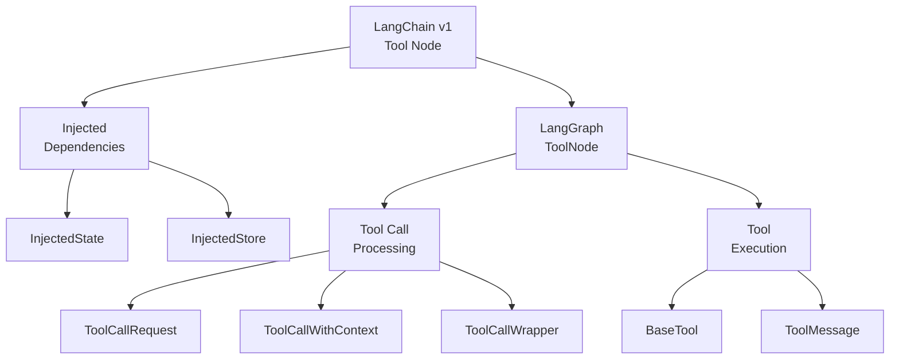
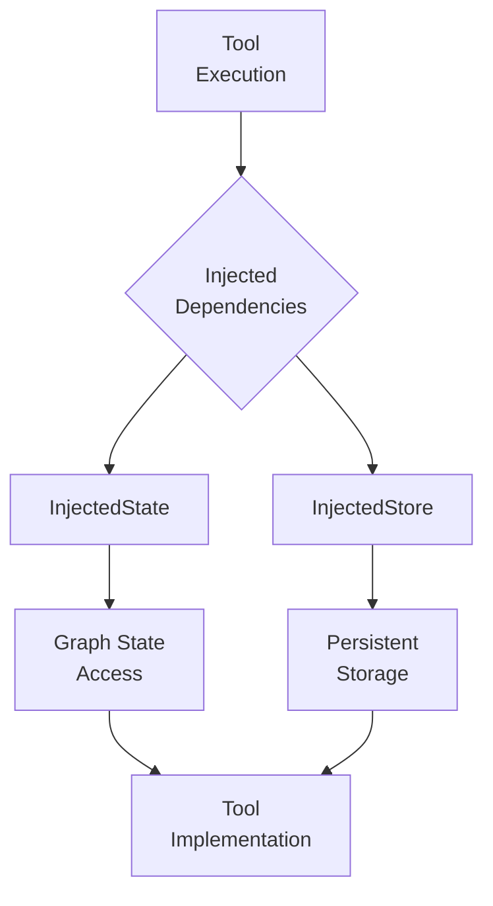
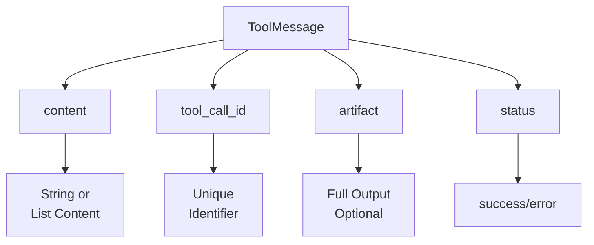
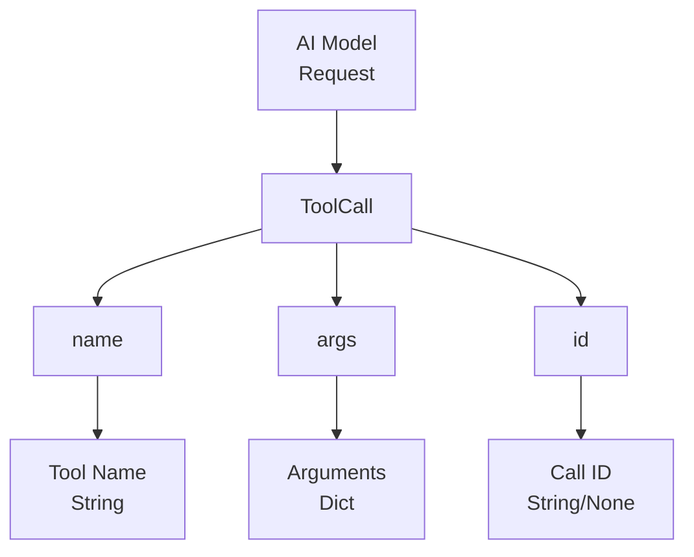
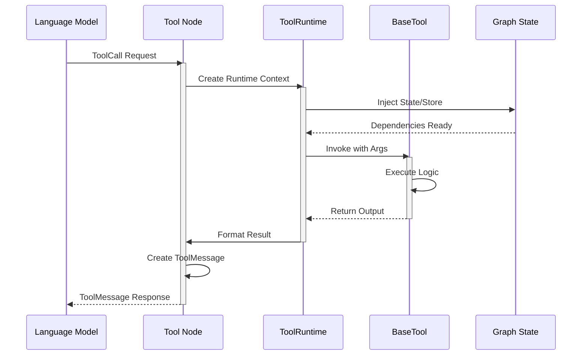
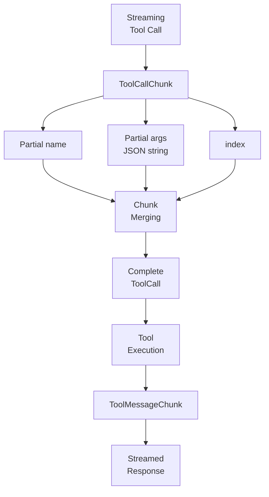
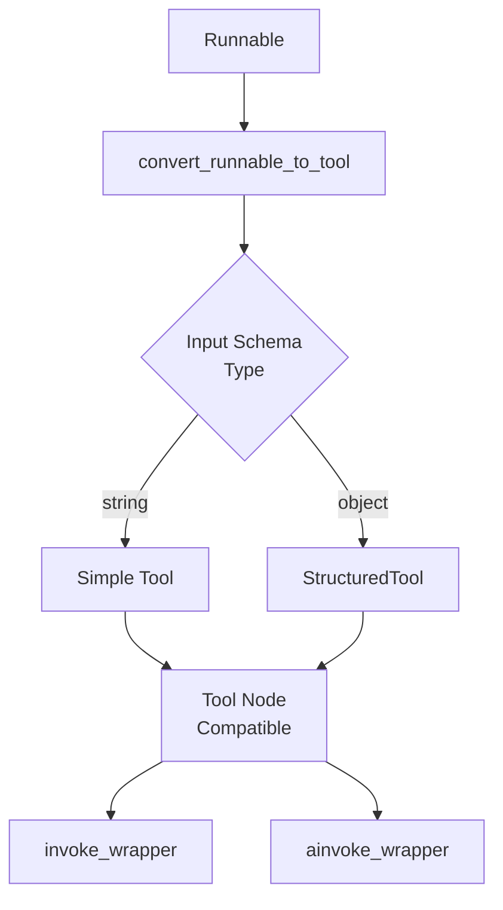
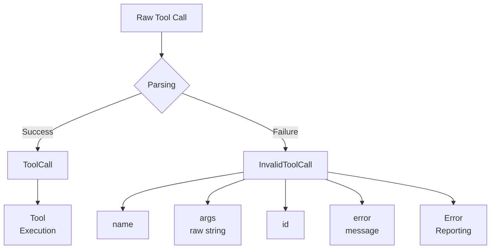
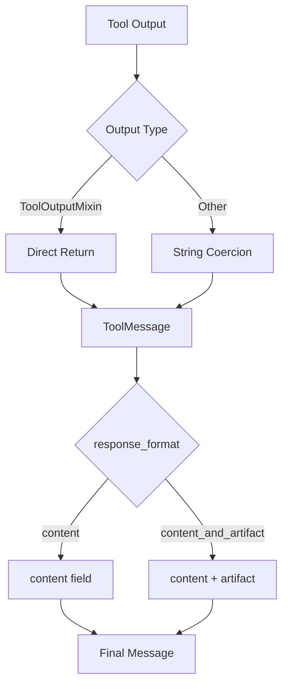

# Tool Node (langchain v1)

The Tool Node is a core component in LangChain v1 for executing tools within agent workflows and graph-based applications. It provides a standardized interface for invoking tools based on requests from language models, handling tool execution, state management, and result formatting. The Tool Node implementation in langchain v1 serves as a compatibility layer that wraps the underlying `ToolNode` from the `langgraph.prebuilt` module, enabling seamless integration between LangChain tools and LangGraph-based agent architectures.

Sources: [libs/langchain_v1/langchain/tools/tool_node.py:1-26](../../../libs/langchain_v1/langchain/tools/tool_node.py#L1-L26)

## Architecture Overview

The Tool Node architecture consists of several interconnected components that facilitate tool execution within LangChain v1 applications:



The Tool Node acts as a bridge between LangChain's tool definitions and LangGraph's execution framework. It imports and re-exports key classes from `langgraph.prebuilt`, providing backward compatibility while leveraging the robust execution capabilities of LangGraph.

Sources: [libs/langchain_v1/langchain/tools/tool_node.py:3-11](../../../libs/langchain_v1/langchain/tools/tool_node.py#L3-L11)

## Core Components

### Tool Node Wrapper

The Tool Node in langchain v1 is implemented as a re-export of the `ToolNode` class from `langgraph.prebuilt.tool_node`. This design allows LangChain v1 to maintain API compatibility while delegating the actual implementation to LangGraph's optimized tool execution engine.

| Component | Source Module | Description |
|-----------|---------------|-------------|
| `ToolNode` | `langgraph.prebuilt.tool_node` | Main class for executing tools in graph workflows |
| `ToolRuntime` | `langgraph.prebuilt` | Runtime context for tool execution |
| `ToolCallRequest` | `langgraph.prebuilt.tool_node` | Represents a request to invoke a tool |
| `ToolCallWithContext` | `langgraph.prebuilt.tool_node` | Tool call enriched with execution context |
| `ToolCallWrapper` | `langgraph.prebuilt.tool_node` | Wrapper for handling tool call lifecycle |

Sources: [libs/langchain_v1/langchain/tools/tool_node.py:3-26](../../../libs/langchain_v1/langchain/tools/tool_node.py#L3-L26)

### Dependency Injection

The Tool Node supports dependency injection to provide tools with access to runtime state and persistent storage:



**InjectedState**: Provides tools with read/write access to the current graph state, enabling stateful tool operations within agent workflows.

**InjectedStore**: Grants tools access to a persistent storage layer for maintaining data across multiple invocations or agent runs.

Sources: [libs/langchain_v1/langchain/tools/tool_node.py:3-5](../../../libs/langchain_v1/langchain/tools/tool_node.py#L3-L5), [libs/langchain_v1/langchain/tools/__init__.py:10-11](../../../libs/langchain_v1/langchain/tools/__init__.py#L10-L11)

## Tool Messages and Communication

### ToolMessage Structure

The `ToolMessage` class represents the result of tool execution, containing the output that gets passed back to the language model or agent:



| Field | Type | Required | Description |
|-------|------|----------|-------------|
| `content` | `str \| list[str \| dict]` | Yes | The main result content sent to the model |
| `tool_call_id` | `str` | Yes | Identifier linking response to the original tool call |
| `artifact` | `Any` | No | Full tool output when content is a subset |
| `status` | `Literal["success", "error"]` | Yes | Execution status (default: "success") |
| `type` | `Literal["tool"]` | Yes | Message type discriminator |

Sources: [libs/core/langchain_core/messages/tool.py:27-95](../../../libs/core/langchain_core/messages/tool.py#L27-L95)

### Content Coercion

The `ToolMessage` class includes validation logic to ensure content is properly formatted:

```python
@model_validator(mode="before")
@classmethod
def coerce_args(cls, values: dict) -> dict:
    """Coerce the model arguments to the correct types."""
    content = values["content"]
    if isinstance(content, tuple):
        content = list(content)

    if not isinstance(content, (str, list)):
        try:
            values["content"] = str(content)
        except ValueError as e:
            msg = (
                "ToolMessage content should be a string or a list of string/dicts. "
                f"Received:\n\n{content=}\n\n which could not be coerced into a "
                "string."
            )
            raise ValueError(msg) from e
```

This validation ensures that tool outputs are always in a format compatible with language model processing, automatically converting non-string types when possible.

Sources: [libs/core/langchain_core/messages/tool.py:96-127](../../../libs/core/langchain_core/messages/tool.py#L96-L127)

### Tool Call Representation

Tool calls from language models are represented using typed dictionaries:



The `ToolCall` TypedDict structure captures the essential information needed to execute a tool:

| Field | Type | Description |
|-------|------|-------------|
| `name` | `str` | The name of the tool to invoke |
| `args` | `dict[str, Any]` | Arguments as key-value pairs |
| `id` | `str \| None` | Unique identifier for tracking concurrent calls |
| `type` | `Literal["tool_call"]` | Type discriminator (optional) |

Sources: [libs/core/langchain_core/messages/tool.py:178-211](../../../libs/core/langchain_core/messages/tool.py#L178-L211)

## Tool Execution Flow

### Request Processing Sequence

The following diagram illustrates the typical flow of tool execution through the Tool Node:



This sequence demonstrates how the Tool Node orchestrates tool execution, managing dependency injection, invocation, and result formatting.

Sources: [libs/langchain_v1/langchain/tools/tool_node.py:3-26](../../../libs/langchain_v1/langchain/tools/tool_node.py#L3-L26), [libs/core/langchain_core/messages/tool.py:27-95](../../../libs/core/langchain_core/messages/tool.py#L27-L95)

### Streaming Support

Tool Node supports streaming execution through `ToolCallChunk` and `ToolMessageChunk` classes:



The `ToolCallChunk` structure enables incremental construction of tool calls during streaming:

| Field | Type | Description |
|-------|------|----------|
| `name` | `str \| None` | Partial or complete tool name |
| `args` | `str \| None` | Partial JSON string of arguments |
| `id` | `str \| None` | Tool call identifier |
| `index` | `int \| None` | Position for merging chunks |

Chunks with the same non-null `index` are merged by concatenating string fields, allowing gradual assembly of complete tool calls.

Sources: [libs/core/langchain_core/messages/tool.py:213-249](../../../libs/core/langchain_core/messages/tool.py#L213-L249)

## Tool Creation and Registration

### The @tool Decorator

LangChain provides a flexible `@tool` decorator for converting Python functions into tools compatible with the Tool Node:

```python
@tool
def search_api(query: str) -> str:
    """Searches the API for the query."""
    return search_results

@tool("search", return_direct=True)
def search_api(query: str) -> str:
    """Searches the API with direct return."""
    return results

@tool(response_format="content_and_artifact")
def search_api(query: str) -> tuple[str, dict]:
    """Returns both content and full artifact."""
    return "partial json", {"full": "object"}
```

The decorator supports multiple invocation patterns and configuration options:

| Parameter | Type | Default | Description |
|-----------|------|---------|-------------|
| `name_or_callable` | `str \| Callable \| None` | `None` | Tool name or function to convert |
| `description` | `str \| None` | `None` | Tool description (overrides docstring) |
| `return_direct` | `bool` | `False` | Whether to return directly without continuing agent loop |
| `args_schema` | `ArgsSchema \| None` | `None` | Explicit argument schema |
| `infer_schema` | `bool` | `True` | Auto-infer schema from function signature |
| `response_format` | `Literal["content", "content_and_artifact"]` | `"content"` | Output format specification |
| `parse_docstring` | `bool` | `False` | Parse Google-style docstrings for arg descriptions |
| `error_on_invalid_docstring` | `bool` | `True` | Raise error on invalid docstring format |
| `extras` | `dict[str, Any] \| None` | `None` | Provider-specific extra fields |

Sources: [libs/core/langchain_core/tools/convert.py:37-251](../../../libs/core/langchain_core/tools/convert.py#L37-L251)

### Runnable to Tool Conversion

The Tool Node can also work with LangChain Runnables converted to tools:



The conversion process adapts Runnables to the Tool interface:

- **String Input**: Creates a simple `Tool` with direct invoke/ainvoke methods
- **Object Input**: Creates a `StructuredTool` with schema-based argument handling
- **Wrapper Functions**: Inject callbacks and format inputs appropriately

Sources: [libs/core/langchain_core/tools/convert.py:433-492](../../../libs/core/langchain_core/tools/convert.py#L433-L492)

## Error Handling and Invalid Tool Calls

### InvalidToolCall Structure

When tool calls cannot be properly parsed or executed, they are represented as `InvalidToolCall` objects:



The `InvalidToolCall` structure preserves information about failed parsing attempts:

| Field | Type | Description |
|-------|------|-------------|
| `name` | `str \| None` | Attempted tool name if parseable |
| `args` | `str \| None` | Raw unparsed arguments string |
| `id` | `str \| None` | Tool call identifier if present |
| `error` | `str \| None` | Error message describing the failure |
| `type` | `Literal["invalid_tool_call"]` | Type discriminator |

Sources: [libs/core/langchain_core/messages/tool.py:285-305](../../../libs/core/langchain_core/messages/tool.py#L285-L305)

### Default Tool Parser

The `default_tool_parser` function provides best-effort parsing of raw tool call data:

```python
def default_tool_parser(
    raw_tool_calls: list[dict],
) -> tuple[list[ToolCall], list[InvalidToolCall]]:
    """Best-effort parsing of tools."""
    tool_calls = []
    invalid_tool_calls = []
    for raw_tool_call in raw_tool_calls:
        if "function" not in raw_tool_call:
            continue
        function_name = raw_tool_call["function"]["name"]
        try:
            function_args = json.loads(raw_tool_call["function"]["arguments"])
            parsed = tool_call(
                name=function_name or "",
                args=function_args or {},
                id=raw_tool_call.get("id"),
            )
            tool_calls.append(parsed)
        except json.JSONDecodeError:
            invalid_tool_calls.append(
                invalid_tool_call(
                    name=function_name,
                    args=raw_tool_call["function"]["arguments"],
                    id=raw_tool_call.get("id"),
                    error=None,
                )
            )
    return tool_calls, invalid_tool_calls
```

This parser attempts JSON decoding of arguments and separates successfully parsed tool calls from invalid ones, enabling graceful degradation and error reporting.

Sources: [libs/core/langchain_core/messages/tool.py:308-342](../../../libs/core/langchain_core/messages/tool.py#L308-L342)

## Integration with Base Tools

### BaseTool Interface

The Tool Node works with tools implementing the `BaseTool` interface from `langchain_core.tools`:

| Component | Description |
|-----------|-------------|
| `BaseTool` | Abstract base class defining the tool interface |
| `InjectedToolArg` | Marker for arguments injected at runtime |
| `InjectedToolCallId` | Marker for injecting the tool call ID |
| `ToolException` | Exception type for tool execution errors |

These components are re-exported through the langchain v1 tools module for convenient access:

Sources: [libs/langchain_v1/langchain/tools/__init__.py:1-18](../../../libs/langchain_v1/langchain/tools/__init__.py#L1-L18)

### Tool Output Handling

Tools can return different types of outputs that the Tool Node processes appropriately:



The `ToolOutputMixin` class marks objects that tools can return directly without string coercion. If a tool returns a non-mixin object, the Tool Node automatically converts it to a string before wrapping it in a `ToolMessage`.

Sources: [libs/core/langchain_core/messages/tool.py:17-24](../../../libs/core/langchain_core/messages/tool.py#L17-L24)

## Message Chunking and Merging

### ToolMessageChunk Addition

The `ToolMessageChunk` class supports streaming by implementing chunk addition:

```python
def __add__(self, other: Any) -> BaseMessageChunk:
    if isinstance(other, ToolMessageChunk):
        if self.tool_call_id != other.tool_call_id:
            msg = "Cannot concatenate ToolMessageChunks with different names."
            raise ValueError(msg)

        return self.__class__(
            tool_call_id=self.tool_call_id,
            content=merge_content(self.content, other.content),
            artifact=merge_obj(self.artifact, other.artifact),
            additional_kwargs=merge_dicts(
                self.additional_kwargs, other.additional_kwargs
            ),
            response_metadata=merge_dicts(
                self.response_metadata, other.response_metadata
            ),
            id=self.id,
            status=_merge_status(self.status, other.status),
        )

    return super().__add__(other)
```

This implementation ensures that:
- Chunks with different `tool_call_id` values cannot be merged
- Content, artifacts, and metadata are intelligently combined
- Status is merged with error precedence (if either chunk has error status, the result is error)

Sources: [libs/core/langchain_core/messages/tool.py:143-167](../../../libs/core/langchain_core/messages/tool.py#L143-L167)

### Status Merging Logic

The status merging function prioritizes error states:

```python
def _merge_status(
    left: Literal["success", "error"], right: Literal["success", "error"]
) -> Literal["success", "error"]:
    return "error" if "error" in {left, right} else "success"
```

This ensures that any error in the streaming sequence is preserved in the final merged message.

Sources: [libs/core/langchain_core/messages/tool.py:368-371](../../../libs/core/langchain_core/messages/tool.py#L368-L371)

## Summary

The Tool Node in LangChain v1 provides a robust abstraction for tool execution within agent workflows and graph-based applications. By wrapping LangGraph's `ToolNode` implementation, it offers backward compatibility while leveraging advanced features like dependency injection, streaming support, and sophisticated error handling. The architecture supports multiple tool creation patterns through the `@tool` decorator and Runnable conversion, with comprehensive message types (`ToolMessage`, `ToolCall`, `InvalidToolCall`) that facilitate reliable communication between language models and tool implementations. The Tool Node's integration with state management and persistent storage through injected dependencies enables complex stateful agent behaviors while maintaining clean separation of concerns.

Sources: [libs/langchain_v1/langchain/tools/tool_node.py](../../../libs/langchain_v1/langchain/tools/tool_node.py), [libs/langchain_v1/langchain/tools/__init__.py](../../../libs/langchain_v1/langchain/tools/__init__.py), [libs/core/langchain_core/messages/tool.py](../../../libs/core/langchain_core/messages/tool.py), [libs/core/langchain_core/tools/convert.py](../../../libs/core/langchain_core/tools/convert.py)