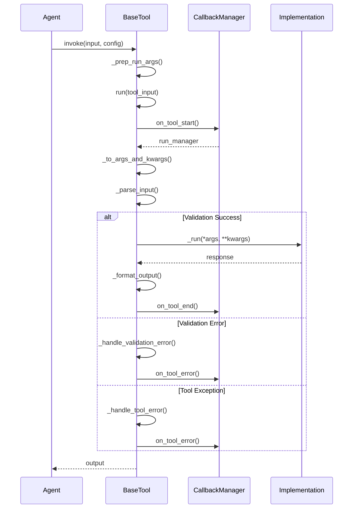
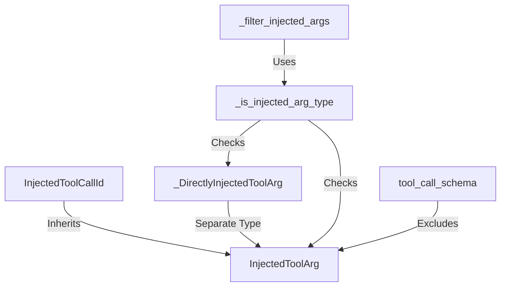
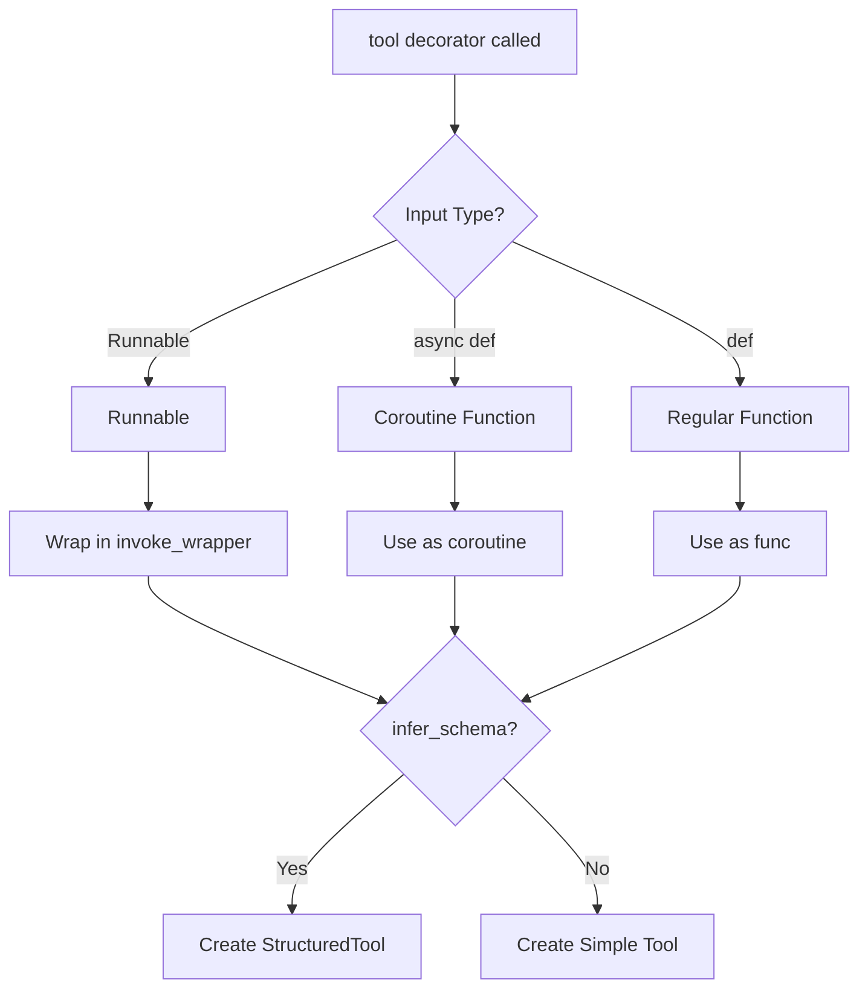
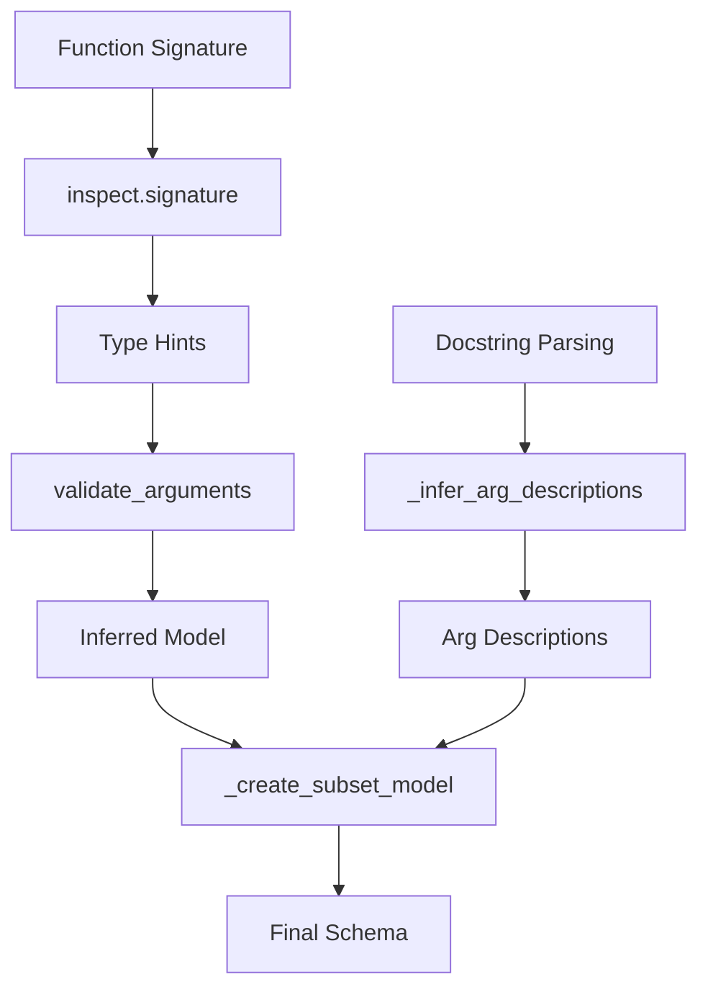
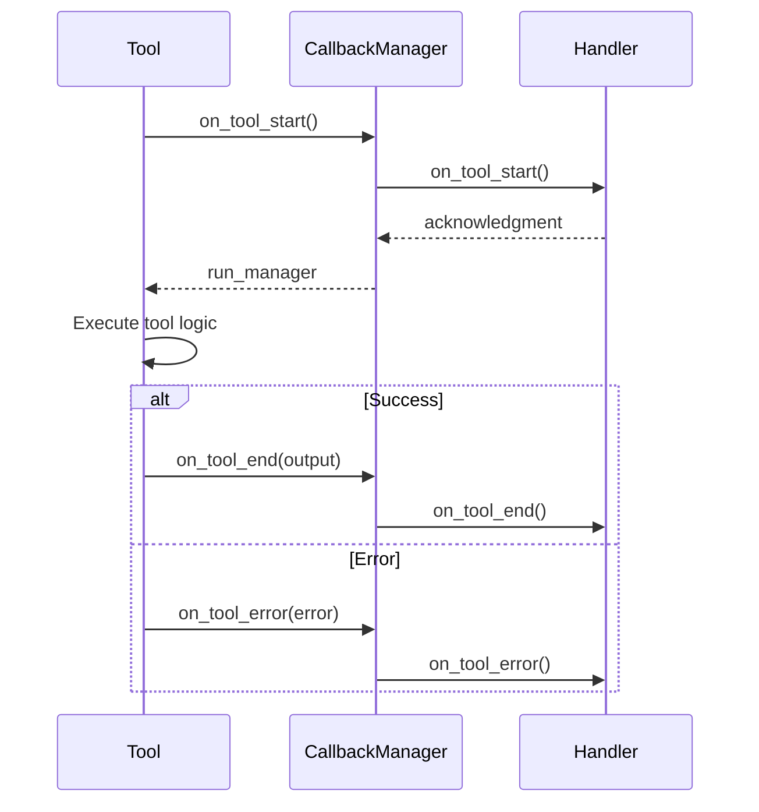

# Tool System: BaseTool, @tool Decorator & StructuredTool

The LangChain tool system provides a comprehensive framework for creating and managing tools that agents use to interact with external systems and perform specific actions. At its core, the system consists of three primary components: the `BaseTool` abstract base class that defines the tool interface, the `@tool` decorator for quickly converting functions into tools, and the `StructuredTool` class for tools that accept multiple structured inputs. This system enables developers to create tools with automatic schema inference, input validation, error handling, and callback support, making it straightforward to extend agent capabilities with custom functionality.

Sources: [tools/__init__.py:1-8](../../../libs/core/langchain_core/tools/__init__.py#L1-L8), [tools/base.py:1-2](../../../libs/core/langchain_core/tools/base.py#L1-L2)

## Architecture Overview

The tool system is organized into several key modules within the `langchain_core.tools` package, each serving a specific purpose in the tool creation and execution lifecycle.

```mermaid
graph TD
    A[tools/__init__.py]
    B[tools/base.py]
    C[tools/convert.py]
    D[tools/structured.py]
    E[tools/simple.py]
    F[tools/render.py]
    
    A -->|Exports| B
    A -->|Exports| C
    A -->|Exports| D
    A -->|Exports| E
    A -->|Exports| F
    
    C -->|Uses| B
    C -->|Creates| D
    C -->|Creates| E
    D -->|Inherits| B
    E -->|Inherits| B
    
    B[BaseTool Abstract Class]
    D[StructuredTool Implementation]
    E[Tool Implementation]
    C[@tool Decorator]
```

The package uses lazy imports through a dynamic import mechanism to optimize loading times. The `__getattr__` function in the main `__init__.py` file handles on-demand imports based on a mapping dictionary.

Sources: [tools/__init__.py:46-60](../../../libs/core/langchain_core/tools/__init__.py#L46-L60)

## BaseTool Abstract Class

### Core Properties and Configuration

`BaseTool` is the abstract base class that all LangChain tools must inherit from. It extends `RunnableSerializable` and defines the essential interface for tool execution.

| Property | Type | Required | Description |
|----------|------|----------|-------------|
| `name` | `str` | Yes | Unique name that clearly communicates the tool's purpose |
| `description` | `str` | Yes | Tells the model how/when/why to use the tool; can include few-shot examples |
| `args_schema` | `ArgsSchema \| None` | No | Pydantic model class or JSON schema dict to validate input arguments |
| `return_direct` | `bool` | No | If `True`, stops the `AgentExecutor` after tool execution |
| `response_format` | `Literal["content", "content_and_artifact"]` | No | Determines output format (content only or content + artifact tuple) |
| `handle_tool_error` | `bool \| str \| Callable` | No | Configures error handling behavior for `ToolException` |
| `handle_validation_error` | `bool \| str \| Callable` | No | Configures error handling for validation errors |
| `extras` | `dict[str, Any] \| None` | No | Provider-specific extra fields (e.g., Anthropic `cache_control`) |

Sources: [tools/base.py:189-252](../../../libs/core/langchain_core/tools/base.py#L189-L252)

### Schema Validation and Annotation

The `BaseTool` class performs validation during subclass creation through `__init_subclass__`. This ensures that the `args_schema` annotation is correctly specified as `Type[BaseModel]` rather than just `BaseModel`.

```python
def __init_subclass__(cls, **kwargs: Any) -> None:
    """Validate the tool class definition during subclass creation."""
    super().__init_subclass__(**kwargs)

    args_schema_type = cls.__annotations__.get("args_schema", None)

    if args_schema_type is not None and args_schema_type == BaseModel:
        # Throw errors for common mis-annotations.
        typehint_mandate = """
class ChildTool(BaseTool):
    ...
    args_schema: Type[BaseModel] = SchemaClass
    ..."""
        name = cls.__name__
        msg = (
            f"Tool definition for {name} must include valid type annotations"
            f" for argument 'args_schema' to behave as expected.\n"
            f"Expected annotation of 'Type[BaseModel]'"
            f" but got '{args_schema_type}'.\n"
            f"Expected class looks like:\n"
            f"{typehint_mandate}"
        )
        raise SchemaAnnotationError(msg)
```

Sources: [tools/base.py:145-176](../../../libs/core/langchain_core/tools/base.py#L145-L176)

### Tool Execution Flow

The tool execution flow involves several stages: input preparation, validation, execution, and output formatting. The following sequence diagram illustrates the synchronous execution path:



Sources: [tools/base.py:418-524](../../../libs/core/langchain_core/tools/base.py#L418-L524)

### Input Parsing and Validation

The `_parse_input` method handles input validation using the tool's `args_schema`. It supports both string and dictionary inputs, and handles special injected arguments like `InjectedToolCallId`.

```python
def _parse_input(
    self, tool_input: str | dict, tool_call_id: str | None
) -> str | dict[str, Any]:
    """Parse and validate tool input using the args schema."""
    input_args = self.args_schema

    if isinstance(tool_input, str):
        if input_args is not None:
            if isinstance(input_args, dict):
                msg = (
                    "String tool inputs are not allowed when "
                    "using tools with JSON schema args_schema."
                )
                raise ValueError(msg)
            key_ = next(iter(get_fields(input_args).keys()))
            if issubclass(input_args, BaseModel):
                input_args.model_validate({key_: tool_input})
            elif issubclass(input_args, BaseModelV1):
                input_args.parse_obj({key_: tool_input})
            else:
                msg = f"args_schema must be a Pydantic BaseModel, got {input_args}"
                raise TypeError(msg)
        return tool_input
```

Sources: [tools/base.py:339-365](../../../libs/core/langchain_core/tools/base.py#L339-L365)

### Injected Arguments System

The tool system supports injected arguments that are provided at runtime rather than by the language model. These arguments are excluded from the tool schema sent to the model.



The `InjectedToolArg` class marks parameters that should be injected at runtime. The `InjectedToolCallId` subclass specifically handles tool call ID injection, which is required when a tool needs to return a properly formatted `ToolMessage`.

Sources: [tools/base.py:844-880](../../../libs/core/langchain_core/tools/base.py#L844-L880)

### Error Handling

The tool system provides flexible error handling through two mechanisms:

1. **Tool Execution Errors**: Handled via `handle_tool_error` property, which can be a boolean, string, or callable
2. **Validation Errors**: Handled via `handle_validation_error` property with similar configuration options

```python
def _handle_tool_error(
    e: ToolException,
    *,
    flag: Literal[True] | str | Callable[[ToolException], str] | None,
) -> str:
    """Handle tool execution errors based on the configured flag."""
    if isinstance(flag, bool):
        content = e.args[0] if e.args else "Tool execution error"
    elif isinstance(flag, str):
        content = flag
    elif callable(flag):
        content = flag(e)
    else:
        msg = (
            f"Got unexpected type of `handle_tool_error`. Expected bool, str "
            f"or callable. Received: {flag}"
        )
        raise ValueError(msg)
    return content
```

Sources: [tools/base.py:707-732](../../../libs/core/langchain_core/tools/base.py#L707-L732), [tools/base.py:682-704](../../../libs/core/langchain_core/tools/base.py#L682-L704)

## The @tool Decorator

### Overview and Usage Patterns

The `@tool` decorator provides a convenient way to convert Python functions and `Runnable` objects into `BaseTool` instances. It supports multiple usage patterns with automatic schema inference.

| Usage Pattern | Example | Result |
|---------------|---------|--------|
| Simple decorator | `@tool`<br>`def my_func():...` | Creates tool with function name |
| Named decorator | `@tool("custom_name")`<br>`def my_func():...` | Creates tool with custom name |
| With parameters | `@tool(return_direct=True)`<br>`def my_func():...` | Creates tool with configuration |
| From Runnable | `tool("name", runnable)` | Converts Runnable to tool |

Sources: [tools/convert.py:48-115](../../../libs/core/langchain_core/tools/convert.py#L48-L115)

### Function Signature and Parameters

The `@tool` decorator accepts numerous configuration parameters:

```python
def tool(
    name_or_callable: str | Callable | None = None,
    runnable: Runnable | None = None,
    *args: Any,
    description: str | None = None,
    return_direct: bool = False,
    args_schema: ArgsSchema | None = None,
    infer_schema: bool = True,
    response_format: Literal["content", "content_and_artifact"] = "content",
    parse_docstring: bool = False,
    error_on_invalid_docstring: bool = True,
    extras: dict[str, Any] | None = None,
) -> BaseTool | Callable[[Callable | Runnable], BaseTool]:
```

Sources: [tools/convert.py:116-134](../../../libs/core/langchain_core/tools/convert.py#L116-L134)

### Docstring Parsing

When `parse_docstring=True`, the decorator attempts to parse Google-style docstrings to extract parameter descriptions. This feature automatically populates the tool schema with detailed argument descriptions.

```python
@tool(parse_docstring=True)
def foo(bar: str, baz: int) -> str:
    """The foo.

    Args:
        bar: The bar.
        baz: The baz.
    """
    return bar
```

The resulting schema includes descriptions for each parameter extracted from the docstring. Invalid docstrings (missing args section, improper whitespace, or undocumented parameters) will raise a `ValueError` when `error_on_invalid_docstring=True`.

Sources: [tools/convert.py:235-288](../../../libs/core/langchain_core/tools/convert.py#L235-L288)

### Tool Creation Logic

The decorator uses an internal factory pattern to create tools. The `_create_tool_factory` function returns a closure that handles the actual tool creation based on the input type:



Sources: [tools/convert.py:301-360](../../../libs/core/langchain_core/tools/convert.py#L301-L360)

### Runnable Conversion

The decorator can convert `Runnable` objects into tools by wrapping their `invoke` and `ainvoke` methods. This requires the Runnable to have an object-type input schema.

```python
if isinstance(dec_func, Runnable):
    runnable = dec_func

    if runnable.input_schema.model_json_schema().get("type") != "object":
        msg = "Runnable must have an object schema."
        raise ValueError(msg)

    async def ainvoke_wrapper(
        callbacks: Callbacks | None = None, **kwargs: Any
    ) -> Any:
        return await runnable.ainvoke(kwargs, {"callbacks": callbacks})

    def invoke_wrapper(
        callbacks: Callbacks | None = None, **kwargs: Any
    ) -> Any:
        return runnable.invoke(kwargs, {"callbacks": callbacks})

    coroutine = ainvoke_wrapper
    func = invoke_wrapper
    schema: ArgsSchema | None = runnable.input_schema
    tool_description = description or repr(runnable)
```

Sources: [tools/convert.py:320-339](../../../libs/core/langchain_core/tools/convert.py#L320-L339)

## StructuredTool Class

### Purpose and Design

`StructuredTool` is designed to handle tools that accept multiple input arguments with structured schemas. Unlike the simple `Tool` class, it can work with complex input types and multiple parameters.

```python
class StructuredTool(BaseTool):
    """Tool that can operate on any number of inputs."""

    description: str = ""

    args_schema: Annotated[ArgsSchema, SkipValidation()] = Field(
        ..., description="The tool schema."
    )
    """The input arguments' schema."""

    func: Callable[..., Any] | None = None
    """The function to run when the tool is called."""

    coroutine: Callable[..., Awaitable[Any]] | None = None
    """The asynchronous version of the function."""
```

Sources: [tools/structured.py:31-49](../../../libs/core/langchain_core/tools/structured.py#L31-L49)

### Factory Method: from_function

The `from_function` class method provides a comprehensive way to create `StructuredTool` instances from regular functions with automatic schema inference.

| Parameter | Type | Default | Description |
|-----------|------|---------|-------------|
| `func` | `Callable \| None` | `None` | Synchronous function to wrap |
| `coroutine` | `Callable \| None` | `None` | Asynchronous function to wrap |
| `name` | `str \| None` | Function name | Tool name |
| `description` | `str \| None` | Docstring | Tool description |
| `return_direct` | `bool` | `False` | Whether to return directly |
| `args_schema` | `ArgsSchema \| None` | `None` | Explicit schema or inferred |
| `infer_schema` | `bool` | `True` | Whether to infer from signature |
| `response_format` | `Literal` | `"content"` | Output format type |
| `parse_docstring` | `bool` | `False` | Parse Google-style docstrings |

Sources: [tools/structured.py:99-138](../../../libs/core/langchain_core/tools/structured.py#L99-L138)

### Schema Creation and Inference

When `infer_schema=True` and no explicit `args_schema` is provided, the system automatically creates a Pydantic schema from the function signature using `create_schema_from_function`.

```python
if args_schema is None and infer_schema:
    # schema name is appended within function
    args_schema = create_schema_from_function(
        name,
        source_function,
        parse_docstring=parse_docstring,
        error_on_invalid_docstring=error_on_invalid_docstring,
        filter_args=_filter_schema_args(source_function),
    )
```

The `_filter_schema_args` function excludes certain arguments from the schema, such as `run_manager`, `callbacks`, and any `RunnableConfig` parameters.

Sources: [tools/structured.py:164-171](../../../libs/core/langchain_core/tools/structured.py#L164-L171), [tools/structured.py:224-229](../../../libs/core/langchain_core/tools/structured.py#L224-L229)

### Execution Methods

`StructuredTool` implements both synchronous and asynchronous execution methods that delegate to the wrapped functions:

```python
def _run(
    self,
    *args: Any,
    config: RunnableConfig,
    run_manager: CallbackManagerForToolRun | None = None,
    **kwargs: Any,
) -> Any:
    """Use the tool."""
    if self.func:
        if run_manager and signature(self.func).parameters.get("callbacks"):
            kwargs["callbacks"] = run_manager.get_child()
        if config_param := _get_runnable_config_param(self.func):
            kwargs[config_param] = config
        return self.func(*args, **kwargs)
    msg = "StructuredTool does not support sync invocation."
    raise NotImplementedError(msg)
```

Sources: [tools/structured.py:66-88](../../../libs/core/langchain_core/tools/structured.py#L66-L88)

### Injected Arguments Handling

`StructuredTool` uses a cached property to identify injected arguments from the function signature:

```python
@functools.cached_property
def _injected_args_keys(self) -> frozenset[str]:
    fn = self.func or self.coroutine
    if fn is None:
        return _EMPTY_SET
    return frozenset(
        k
        for k, v in signature(fn).parameters.items()
        if _is_injected_arg_type(v.annotation)
    )
```

This ensures that injected arguments are properly excluded from the tool schema and handled during execution.

Sources: [tools/structured.py:216-224](../../../libs/core/langchain_core/tools/structured.py#L216-L224)

## Simple Tool Class

### Design and Use Cases

The `Tool` class is designed for simple tools that accept a single string input. It's the simplest form of tool in the LangChain system and is used when complex structured inputs are not needed.

```python
class Tool(BaseTool):
    """Tool that takes in function or coroutine directly."""

    description: str = ""

    func: Callable[..., str] | None
    """The function to run when the tool is called."""

    coroutine: Callable[..., Awaitable[str]] | None = None
    """The asynchronous version of the function."""
```

Sources: [tools/simple.py:30-40](../../../libs/core/langchain_core/tools/simple.py#L30-L40)

### Input Handling

The `Tool` class overrides the `args` property to provide a simple string input schema when no explicit `args_schema` is provided:

```python
@property
def args(self) -> dict:
    """The tool's input arguments."""
    if self.args_schema is not None:
        return super().args
    # For backwards compatibility, if the function signature is ambiguous,
    # assume it takes a single string input.
    return {"tool_input": {"type": "string"}}
```

The `_to_args_and_kwargs` method ensures that only a single input is passed to the tool function, raising a `ToolException` if multiple arguments are detected.

Sources: [tools/simple.py:56-79](../../../libs/core/langchain_core/tools/simple.py#L56-L79)

### Factory Method

The `from_function` class method provides a way to create `Tool` instances with explicit configuration:

```python
@classmethod
def from_function(
    cls,
    func: Callable | None,
    name: str,
    description: str,
    return_direct: bool = False,
    args_schema: ArgsSchema | None = None,
    coroutine: Callable[..., Awaitable[Any]] | None = None,
    **kwargs: Any,
) -> Tool:
    """Initialize tool from a function."""
    if func is None and coroutine is None:
        msg = "Function and/or coroutine must be provided"
        raise ValueError(msg)
    return cls(
        name=name,
        func=func,
        coroutine=coroutine,
        description=description,
        return_direct=return_direct,
        args_schema=args_schema,
        **kwargs,
    )
```

Sources: [tools/simple.py:122-151](../../../libs/core/langchain_core/tools/simple.py#L122-L151)

## Schema Creation System

### create_schema_from_function

The `create_schema_from_function` utility is central to automatic schema inference. It analyzes function signatures and creates Pydantic models that represent the tool's input schema.



The function handles both Pydantic v1 and v2 annotations, automatically detecting which version is in use:

```python
if _function_annotations_are_pydantic_v1(sig, func):
    validated = validate_arguments_v1(func, config=_SchemaConfig)
else:
    with warnings.catch_warnings():
        warnings.simplefilter("ignore", category=PydanticDeprecationWarning)
        validated = validate_arguments(func, config=_SchemaConfig)
```

Sources: [tools/base.py:223-291](../../../libs/core/langchain_core/tools/base.py#L223-L291)

### Argument Filtering

The schema creation process filters out certain arguments that should not be included in the tool schema:

```python
def _get_filtered_args(
    inferred_model: type[BaseModel],
    func: Callable,
    *,
    filter_args: Sequence[str],
    include_injected: bool = True,
) -> dict:
    """Get filtered arguments from a function's signature."""
    schema = inferred_model.model_json_schema()["properties"]
    valid_keys = signature(func).parameters
    return {
        k: schema[k]
        for i, (k, param) in enumerate(valid_keys.items())
        if k not in filter_args
        and (i > 0 or param.name not in {"self", "cls"})
        and (include_injected or not _is_injected_arg_type(param.annotation))
    }
```

By default, `FILTERED_ARGS` includes `"run_manager"` and `"callbacks"`, which are framework-specific parameters.

Sources: [tools/base.py:97-119](../../../libs/core/langchain_core/tools/base.py#L97-L119), [tools/base.py:42](../../../libs/core/langchain_core/tools/base.py#L42)

### Description Inference

The system can infer descriptions from multiple sources with a clear precedence order:

1. Explicit `description` parameter
2. Function docstring
3. `args_schema` description
4. Annotated type hints

```python
def _infer_arg_descriptions(
    fn: Callable,
    *,
    parse_docstring: bool = False,
    error_on_invalid_docstring: bool = False,
) -> tuple[str, dict]:
    """Infer argument descriptions from function docstring and annotations."""
    annotations = typing.get_type_hints(fn, include_extras=True)
    if parse_docstring:
        description, arg_descriptions = _parse_python_function_docstring(
            fn, annotations, error_on_invalid_docstring=error_on_invalid_docstring
        )
    else:
        description = inspect.getdoc(fn) or ""
        arg_descriptions = {}
    if parse_docstring:
        _validate_docstring_args_against_annotations(arg_descriptions, annotations)
    for arg, arg_type in annotations.items():
        if arg in arg_descriptions:
            continue
        if desc := _get_annotation_description(arg_type):
            arg_descriptions[arg] = desc
    return description, arg_descriptions
```

Sources: [tools/base.py:156-183](../../../libs/core/langchain_core/tools/base.py#L156-L183)

## Tool Rendering

### Text Description Rendering

The rendering module provides utilities to convert tool definitions into text formats suitable for display or prompt construction.

```python
def render_text_description(tools: list[BaseTool]) -> str:
    """Render the tool name and description in plain text."""
    descriptions = []
    for tool in tools:
        if hasattr(tool, "func") and tool.func:
            sig = signature(tool.func)
            description = f"{tool.name}{sig} - {tool.description}"
        else:
            description = f"{tool.name} - {tool.description}"

        descriptions.append(description)
    return "\n".join(descriptions)
```

This produces output in the format:
```
search: This tool is used for search
calculator: This tool is used for math
```

Sources: [tools/render.py:11-32](../../../libs/core/langchain_core/tools/render.py#L11-L32)

### Description with Arguments

The `render_text_description_and_args` function includes the tool's argument schema in the output:

```python
def render_text_description_and_args(tools: list[BaseTool]) -> str:
    """Render the tool name, description, and args in plain text."""
    tool_strings = []
    for tool in tools:
        args_schema = str(tool.args)
        if hasattr(tool, "func") and tool.func:
            sig = signature(tool.func)
            description = f"{tool.name}{sig} - {tool.description}"
        else:
            description = f"{tool.name} - {tool.description}"
        tool_strings.append(f"{description}, args: {args_schema}")
    return "\n".join(tool_strings)
```

This produces output showing both the description and the JSON schema of arguments.

Sources: [tools/render.py:35-56](../../../libs/core/langchain_core/tools/render.py#L35-L56)

## Advanced Features

### Response Formats

Tools support two response formats controlled by the `response_format` parameter:

1. **`"content"`** (default): The tool returns content directly, which is interpreted as the content of a `ToolMessage`
2. **`"content_and_artifact"`**: The tool returns a tuple of `(content, artifact)`, allowing separation of display content from raw output data

```python
if self.response_format == "content_and_artifact":
    msg = (
        "Since response_format='content_and_artifact' "
        "a two-tuple of the message content and raw tool output is "
        f"expected. Instead, generated response is of type: "
        f"{type(response)}."
    )
    if not isinstance(response, tuple):
        error_to_raise = ValueError(msg)
    else:
        try:
            content, artifact = response
        except ValueError:
            error_to_raise = ValueError(msg)
else:
    content = response
```

Sources: [tools/base.py:487-502](../../../libs/core/langchain_core/tools/base.py#L487-L502)

### Callback Integration

The tool system integrates deeply with LangChain's callback system, providing hooks for monitoring and tracing tool execution:



The callback manager is configured with tags, metadata, and other contextual information that propagates through the execution chain.

Sources: [tools/base.py:435-449](../../../libs/core/langchain_core/tools/base.py#L435-L449)

### Tool Call ID Tracking

When tools are invoked via model-generated tool calls, the system tracks the `tool_call_id` to maintain correspondence between calls and responses:

```python
def _prep_run_args(
    value: str | dict | ToolCall,
    config: RunnableConfig | None,
    **kwargs: Any,
) -> tuple[str | dict, dict]:
    """Prepare arguments for tool execution."""
    config = ensure_config(config)
    if _is_tool_call(value):
        tool_call_id: str | None = cast("ToolCall", value)["id"]
        tool_input: str | dict = cast("ToolCall", value)["args"].copy()
    else:
        tool_call_id = None
        tool_input = cast("str | dict", value)
    return (
        tool_input,
        dict(
            callbacks=config.get("callbacks"),
            tags=config.get("tags"),
            metadata=config.get("metadata"),
            run_name=config.get("run_name"),
            run_id=config.pop("run_id", None),
            config=config,
            tool_call_id=tool_call_id,
            **kwargs,
        ),
    )
```

This ensures that `ToolMessage` responses can be properly associated with their originating calls.

Sources: [tools/base.py:735-765](../../../libs/core/langchain_core/tools/base.py#L735-L765)

## BaseToolkit

The `BaseToolkit` abstract class provides a way to group related tools together:

```python
class BaseToolkit(BaseModel, ABC):
    """Base class for toolkits containing related tools.

    A toolkit is a collection of related tools that can be used together to accomplish a
    specific task or work with a particular system.
    """

    @abstractmethod
    def get_tools(self) -> list[BaseTool]:
        """Get all tools in the toolkit."""
```

Toolkits are useful for organizing domain-specific tools (e.g., database tools, API tools) and can be loaded and managed as a unit.

Sources: [tools/base.py:990-1001](../../../libs/core/langchain_core/tools/base.py#L990-L1001)

## Summary

The LangChain tool system provides a robust and flexible framework for creating agent tools with three primary approaches: subclassing `BaseTool` for maximum control, using the `@tool` decorator for quick function conversion, and utilizing `StructuredTool` for multi-argument tools with automatic schema inference. The system handles input validation, error management, callback integration, and output formatting automatically, while supporting advanced features like injected arguments, response artifacts, and provider-specific extensions. This architecture enables developers to create tools ranging from simple string-to-string functions to complex multi-parameter operations with full type safety and observability.

Sources: [tools/__init__.py](../../../libs/core/langchain_core/tools/__init__.py), [tools/base.py](../../../libs/core/langchain_core/tools/base.py), [tools/convert.py](../../../libs/core/langchain_core/tools/convert.py), [tools/structured.py](../../../libs/core/langchain_core/tools/structured.py), [tools/simple.py](../../../libs/core/langchain_core/tools/simple.py)