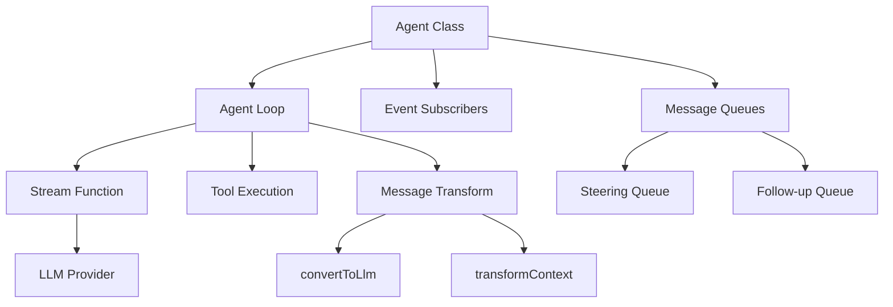
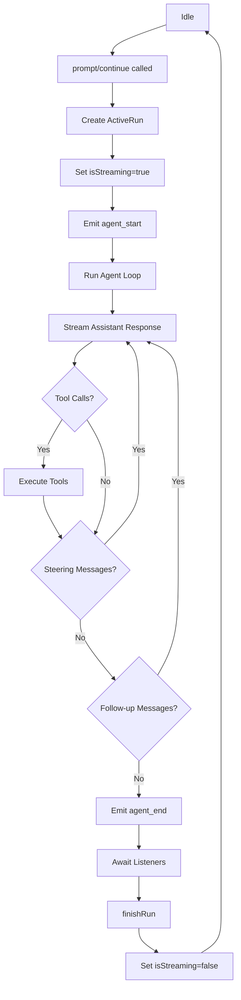
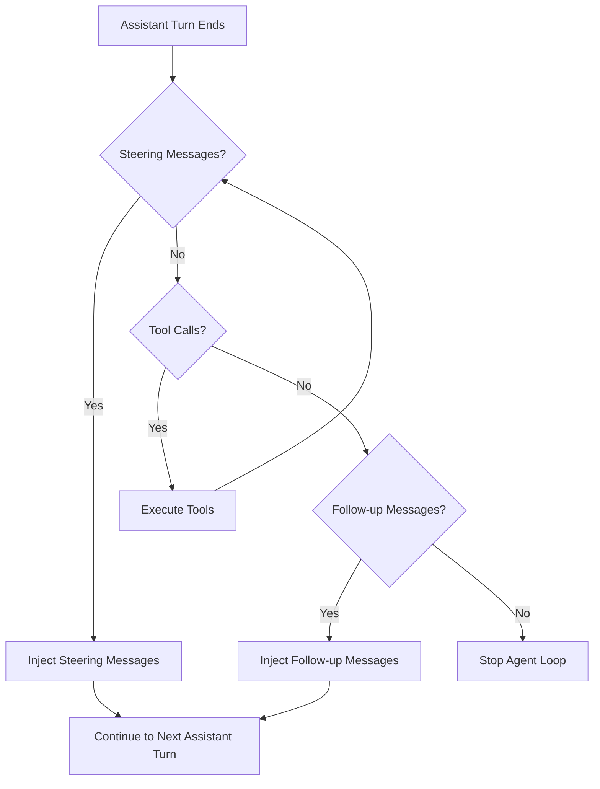
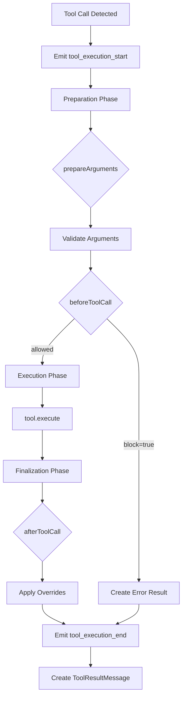

# Agent Class & Lifecycle Management

The `Agent` class is the primary stateful interface for interacting with the AI agent system in the `@pi-agent-core` package. It provides a high-level API for managing conversation state, executing prompts, handling tool calls, and coordinating message flow through steering and follow-up queues. The Agent orchestrates the low-level agent loop, manages lifecycle events, and exposes reactive subscription patterns for UI integration. This architecture separates concerns between stateful session management (Agent) and stateless execution logic (agent-loop), enabling flexible integration patterns while maintaining predictable execution semantics.

Sources: [packages/agent/src/agent.ts:1-600](../../../packages/agent/src/agent.ts#L1-L600)

## Architecture Overview

The agent system is built on three core layers:

1. **Agent Class**: High-level stateful wrapper managing conversation state, queues, and lifecycle coordination
2. **Agent Loop**: Low-level execution engine handling LLM streaming, tool execution, and message flow
3. **Type System**: Comprehensive type definitions for messages, tools, events, and configuration



The Agent class maintains mutable state while the agent loop operates on immutable snapshots, ensuring predictable behavior during concurrent operations.

Sources: [packages/agent/src/agent.ts:44-600](../../../packages/agent/src/agent.ts#L44-L600), [packages/agent/src/agent-loop.ts:1-50](../../../packages/agent/src/agent-loop.ts#L1-L50)

## Agent State Management

### State Structure

The `AgentState` interface defines the public API for agent state, with accessor properties ensuring array immutability:

| Property | Type | Description |
|----------|------|-------------|
| `systemPrompt` | `string` | System prompt sent with each model request |
| `model` | `Model<any>` | Active model used for future turns |
| `thinkingLevel` | `ThinkingLevel` | Requested reasoning level ("off" \| "minimal" \| "low" \| "medium" \| "high" \| "xhigh") |
| `tools` | `AgentTool<any>[]` | Available tools (copied on assignment) |
| `messages` | `AgentMessage[]` | Conversation transcript (copied on assignment) |
| `isStreaming` | `boolean` (readonly) | True while processing, including awaited listeners |
| `streamingMessage` | `AgentMessage?` (readonly) | Partial assistant message during streaming |
| `pendingToolCalls` | `ReadonlySet<string>` (readonly) | Tool call IDs currently executing |
| `errorMessage` | `string?` (readonly) | Error from most recent failed turn |

Sources: [packages/agent/src/types.ts:173-203](../../../packages/agent/src/types.ts#L173-L203)

### Mutable State Implementation

The internal `MutableAgentState` uses getters/setters to enforce array copying semantics:

```typescript
function createMutableAgentState(initialState?: Partial<...>): MutableAgentState {
	let tools = initialState?.tools?.slice() ?? [];
	let messages = initialState?.messages?.slice() ?? [];

	return {
		systemPrompt: initialState?.systemPrompt ?? "",
		model: initialState?.model ?? DEFAULT_MODEL,
		thinkingLevel: initialState?.thinkingLevel ?? "off",
		get tools() { return tools; },
		set tools(nextTools: AgentTool<any>[]) { tools = nextTools.slice(); },
		get messages() { return messages; },
		set messages(nextMessages: AgentMessage[]) { messages = nextMessages.slice(); },
		isStreaming: false,
		streamingMessage: undefined,
		pendingToolCalls: new Set<string>(),
		errorMessage: undefined,
	};
}
```

This pattern prevents external mutations while allowing internal state updates during event processing.

Sources: [packages/agent/src/agent.ts:44-68](../../../packages/agent/src/agent.ts#L44-L68)

## Agent Lifecycle

### Execution Flow

The agent lifecycle consists of distinct phases managed through the `ActiveRun` structure:



Sources: [packages/agent/src/agent.ts:350-400](../../../packages/agent/src/agent.ts#L350-L400), [packages/agent/src/agent-loop.ts:130-200](../../../packages/agent/src/agent-loop.ts#L130-L200)

### Active Run Management

Each execution creates an `ActiveRun` tracking the promise, resolver, and abort controller:

```typescript
type ActiveRun = {
	promise: Promise<void>;
	resolve: () => void;
	abortController: AbortController;
};
```

The `runWithLifecycle` method orchestrates run setup, execution, error handling, and cleanup:

```typescript
private async runWithLifecycle(executor: (signal: AbortSignal) => Promise<void>): Promise<void> {
	if (this.activeRun) {
		throw new Error("Agent is already processing.");
	}

	const abortController = new AbortController();
	let resolvePromise = () => {};
	const promise = new Promise<void>((resolve) => { resolvePromise = resolve; });
	this.activeRun = { promise, resolve: resolvePromise, abortController };

	this._state.isStreaming = true;
	this._state.streamingMessage = undefined;
	this._state.errorMessage = undefined;

	try {
		await executor(abortController.signal);
	} catch (error) {
		await this.handleRunFailure(error, abortController.signal.aborted);
	} finally {
		this.finishRun();
	}
}
```

Sources: [packages/agent/src/agent.ts:315-345](../../../packages/agent/src/agent.ts#L315-L345)

### Event Processing

Events flow through the `processEvents` method, which updates state and awaits all subscribers:

```mermaid
sequenceDiagram
    participant Loop as Agent Loop
    participant Agent as Agent Class
    participant State as Mutable State
    participant Sub1 as Subscriber 1
    participant Sub2 as Subscriber 2

    Loop->>Agent: processEvents(event)
    Agent->>State: Update state based on event type
    Agent->>Sub1: await listener(event, signal)
    Sub1-->>Agent: 
    Agent->>Sub2: await listener(event, signal)
    Sub2-->>Agent: 
    Agent-->>Loop: 
```

The `agent_end` event is emitted before listener settlement, meaning `isStreaming` remains true until all listeners complete.

Sources: [packages/agent/src/agent.ts:365-420](../../../packages/agent/src/agent.ts#L365-L420)

## Message Queue System

### Queue Modes

The agent supports two queue drainage modes for both steering and follow-up queues:

| Mode | Behavior |
|------|----------|
| `"one-at-a-time"` | Drains one message per poll (default) |
| `"all"` | Drains all queued messages at once |

Sources: [packages/agent/src/agent.ts:39-42](../../../packages/agent/src/agent.ts#L39-L42)

### Queue Implementation

The `PendingMessageQueue` class manages message buffering and drainage:

```typescript
class PendingMessageQueue {
	private messages: AgentMessage[] = [];

	constructor(public mode: QueueMode) {}

	enqueue(message: AgentMessage): void {
		this.messages.push(message);
	}

	hasItems(): boolean {
		return this.messages.length > 0;
	}

	drain(): AgentMessage[] {
		if (this.mode === "all") {
			const drained = this.messages.slice();
			this.messages = [];
			return drained;
		}

		const first = this.messages[0];
		if (!first) return [];
		this.messages = this.messages.slice(1);
		return [first];
	}

	clear(): void {
		this.messages = [];
	}
}
```

Sources: [packages/agent/src/agent.ts:70-95](../../../packages/agent/src/agent.ts#L70-L95)

### Steering vs Follow-up Semantics

The agent loop distinguishes between two queue types with different timing:



**Steering messages** are injected after the current assistant turn completes tool execution, allowing mid-conversation intervention. **Follow-up messages** are only processed when the agent would otherwise stop, enabling post-completion continuation.

Sources: [packages/agent/src/agent-loop.ts:130-180](../../../packages/agent/src/agent-loop.ts#L130-L180), [packages/agent/src/agent.ts:200-220](../../../packages/agent/src/agent.ts#L200-L220)

## Prompt Execution

### Prompt API

The `prompt` method supports multiple input formats:

```typescript
async prompt(message: AgentMessage | AgentMessage[]): Promise<void>;
async prompt(input: string, images?: ImageContent[]): Promise<void>;
```

String inputs are automatically converted to user messages with optional image content:

```typescript
private normalizePromptInput(
	input: string | AgentMessage | AgentMessage[],
	images?: ImageContent[],
): AgentMessage[] {
	if (Array.isArray(input)) return input;
	if (typeof input !== "string") return [input];

	const content: Array<TextContent | ImageContent> = [{ type: "text", text: input }];
	if (images && images.length > 0) {
		content.push(...images);
	}
	return [{ role: "user", content, timestamp: Date.now() }];
}
```

Sources: [packages/agent/src/agent.ts:240-265](../../../packages/agent/src/agent.ts#L240-L265)

### Continuation API

The `continue` method resumes execution from the current transcript without adding new messages:

```typescript
async continue(): Promise<void> {
	if (this.activeRun) {
		throw new Error("Agent is already processing. Wait for completion before continuing.");
	}

	const lastMessage = this._state.messages[this._state.messages.length - 1];
	if (!lastMessage) {
		throw new Error("No messages to continue from");
	}

	if (lastMessage.role === "assistant") {
		const queuedSteering = this.steeringQueue.drain();
		if (queuedSteering.length > 0) {
			await this.runPromptMessages(queuedSteering, { skipInitialSteeringPoll: true });
			return;
		}

		const queuedFollowUps = this.followUpQueue.drain();
		if (queuedFollowUps.length > 0) {
			await this.runPromptMessages(queuedFollowUps);
			return;
		}

		throw new Error("Cannot continue from message role: assistant");
	}

	await this.runContinuation();
}
```

When continuing from an assistant message, the method first attempts to drain steering messages, then follow-up messages, before throwing an error.

Sources: [packages/agent/src/agent.ts:240-275](../../../packages/agent/src/agent.ts#L240-L275), [packages/agent/test/e2e.test.ts:180-250](../../../packages/agent/test/e2e.test.ts#L180-L250)

## Agent Loop Integration

### Context Transformation Pipeline

The agent loop applies a two-stage transformation before each LLM call:

```mermaid
graph TD
    A[AgentMessage[]] --> B[transformContext]
    B --> C[Transformed AgentMessage[]]
    C --> D[convertToLlm]
    D --> E[Message[]]
    E --> F[LLM Request]
```

**transformContext** operates at the AgentMessage level for context window management and external context injection. **convertToLlm** converts AgentMessages to LLM-compatible Messages, filtering out UI-only messages.

Sources: [packages/agent/src/types.ts:52-95](../../../packages/agent/src/types.ts#L52-L95), [packages/agent/src/agent-loop.ts:210-230](../../../packages/agent/src/agent-loop.ts#L210-L230)

### Loop Configuration

The `AgentLoopConfig` interface defines the contract between Agent and agent loop:

| Field | Type | Purpose |
|-------|------|---------|
| `model` | `Model<any>` | Target LLM model |
| `convertToLlm` | Function | AgentMessage[] → Message[] transformation |
| `transformContext` | Function? | Pre-conversion context transformation |
| `getApiKey` | Function? | Dynamic API key resolution |
| `getSteeringMessages` | Function? | Steering message polling |
| `getFollowUpMessages` | Function? | Follow-up message polling |
| `toolExecution` | `"sequential"\|"parallel"` | Tool execution strategy |
| `beforeToolCall` | Hook? | Pre-execution tool call hook |
| `afterToolCall` | Hook? | Post-execution tool call hook |

The Agent creates a config snapshot for each run via `createLoopConfig`:

```typescript
private createLoopConfig(options: { skipInitialSteeringPoll?: boolean } = {}): AgentLoopConfig {
	let skipInitialSteeringPoll = options.skipInitialSteeringPoll === true;
	return {
		model: this._state.model,
		reasoning: this._state.thinkingLevel === "off" ? undefined : this._state.thinkingLevel,
		sessionId: this.sessionId,
		onPayload: this.onPayload,
		onResponse: this.onResponse,
		transport: this.transport,
		thinkingBudgets: this.thinkingBudgets,
		maxRetryDelayMs: this.maxRetryDelayMs,
		toolExecution: this.toolExecution,
		beforeToolCall: this.beforeToolCall,
		afterToolCall: this.afterToolCall,
		convertToLlm: this.convertToLlm,
		transformContext: this.transformContext,
		getApiKey: this.getApiKey,
		getSteeringMessages: async () => {
			if (skipInitialSteeringPoll) {
				skipInitialSteeringPoll = false;
				return [];
			}
			return this.steeringQueue.drain();
		},
		getFollowUpMessages: async () => this.followUpQueue.drain(),
	};
}
```

Sources: [packages/agent/src/agent.ts:295-330](../../../packages/agent/src/agent.ts#L295-L330), [packages/agent/src/types.ts:36-120](../../../packages/agent/src/types.ts#L36-L120)

## Tool Execution System

### Tool Execution Modes

The agent supports two execution strategies for tool calls within a single assistant message:

| Mode | Behavior |
|------|----------|
| `"sequential"` | Each tool call is prepared, executed, and finalized before the next starts |
| `"parallel"` | Tool calls are prepared sequentially, then allowed tools execute concurrently; `tool_execution_end` emitted in completion order |

Individual tools can override the global mode via `AgentTool.executionMode`.

Sources: [packages/agent/src/types.ts:28-35](../../../packages/agent/src/types.ts#L28-L35), [packages/agent/src/agent-loop.ts:270-290](../../../packages/agent/src/agent-loop.ts#L270-L290)

### Tool Call Lifecycle

Tool execution proceeds through distinct phases:



Sources: [packages/agent/src/agent-loop.ts:295-450](../../../packages/agent/src/agent-loop.ts#L295-L450)

### Tool Call Hooks

The `beforeToolCall` and `afterToolCall` hooks provide intervention points:

**beforeToolCall** receives validated arguments and can block execution:

```typescript
export interface BeforeToolCallResult {
	block?: boolean;
	reason?: string;
}

export interface BeforeToolCallContext {
	assistantMessage: AssistantMessage;
	toolCall: AgentToolCall;
	args: unknown;
	context: AgentContext;
}
```

**afterToolCall** receives the executed result and can override fields:

```typescript
export interface AfterToolCallResult {
	content?: (TextContent | ImageContent)[];
	details?: unknown;
	isError?: boolean;
	terminate?: boolean;
}

export interface AfterToolCallContext {
	assistantMessage: AssistantMessage;
	toolCall: AgentToolCall;
	args: unknown;
	result: AgentToolResult<any>;
	isError: boolean;
	context: AgentContext;
}
```

Override semantics are field-by-field replacement with no deep merging.

Sources: [packages/agent/src/types.ts:41-78](../../../packages/agent/src/types.ts#L41-L78)

### Parallel Execution Implementation

Parallel mode uses a two-phase approach to maintain source order for tool result messages:

```typescript
async function executeToolCallsParallel(
	currentContext: AgentContext,
	assistantMessage: AssistantMessage,
	toolCalls: AgentToolCall[],
	config: AgentLoopConfig,
	signal: AbortSignal | undefined,
	emit: AgentEventSink,
): Promise<ExecutedToolCallBatch> {
	const finalizedCalls: FinalizedToolCallEntry[] = [];

	// Phase 1: Prepare all tool calls, execute allowed tools concurrently
	for (const toolCall of toolCalls) {
		await emit({ type: "tool_execution_start", ... });
		const preparation = await prepareToolCall(...);
		
		if (preparation.kind === "immediate") {
			// Blocked or validation error
			const finalized = { ... };
			await emitToolExecutionEnd(finalized, emit);
			finalizedCalls.push(finalized);
			continue;
		}

		// Queue async execution
		finalizedCalls.push(async () => {
			const executed = await executePreparedToolCall(...);
			const finalized = await finalizeExecutedToolCall(...);
			await emitToolExecutionEnd(finalized, emit);
			return finalized;
		});
	}

	// Phase 2: Await all executions, emit messages in source order
	const orderedFinalizedCalls = await Promise.all(
		finalizedCalls.map(entry => typeof entry === "function" ? entry() : Promise.resolve(entry))
	);
	
	const messages: ToolResultMessage[] = [];
	for (const finalized of orderedFinalizedCalls) {
		const toolResultMessage = createToolResultMessage(finalized);
		await emitToolResultMessage(toolResultMessage, emit);
		messages.push(toolResultMessage);
	}

	return { messages, terminate: shouldTerminateToolBatch(orderedFinalizedCalls) };
}
```

This ensures `tool_execution_end` events fire as tools complete (for real-time UI updates), while tool result messages appear in the transcript in assistant source order (for LLM context consistency).

Sources: [packages/agent/src/agent-loop.ts:315-370](../../../packages/agent/src/agent-loop.ts#L315-L370)

## Event System

### Event Types

The agent emits hierarchical lifecycle events:

| Event Type | Timing | Payload |
|------------|--------|---------|
| `agent_start` | Run begins | None |
| `agent_end` | Run finishes (before listener settlement) | `messages: AgentMessage[]` |
| `turn_start` | Assistant turn begins | None |
| `turn_end` | Assistant turn finishes | `message: AgentMessage`, `toolResults: ToolResultMessage[]` |
| `message_start` | Message added to transcript | `message: AgentMessage` |
| `message_update` | Assistant message streaming | `message: AgentMessage`, `assistantMessageEvent: AssistantMessageEvent` |
| `message_end` | Message finalized | `message: AgentMessage` |
| `tool_execution_start` | Tool execution begins | `toolCallId`, `toolName`, `args` |
| `tool_execution_update` | Tool streams partial result | `toolCallId`, `toolName`, `args`, `partialResult` |
| `tool_execution_end` | Tool execution finishes | `toolCallId`, `toolName`, `result`, `isError` |

Sources: [packages/agent/src/types.ts:205-220](../../../packages/agent/src/types.ts#L205-L220)

### Subscription Model

The `subscribe` method registers listeners that receive events and the active abort signal:

```typescript
subscribe(listener: (event: AgentEvent, signal: AbortSignal) => Promise<void> | void): () => void {
	this.listeners.add(listener);
	return () => this.listeners.delete(listener);
}
```

Listeners are awaited sequentially in subscription order, and their settlement is part of the run's lifecycle. The agent remains in `isStreaming` state until all `agent_end` listeners complete.

Sources: [packages/agent/src/agent.ts:150-160](../../../packages/agent/src/agent.ts#L150-L160)

### Event Processing Sequence

A typical prompt execution emits events in this order:

```mermaid
sequenceDiagram
    participant Agent
    participant Loop
    participant LLM
    participant Tool

    Agent->>Loop: runAgentLoop(prompts)
    Loop->>Agent: agent_start
    Loop->>Agent: turn_start
    Loop->>Agent: message_start (user)
    Loop->>Agent: message_end (user)
    Loop->>LLM: Stream request
    LLM->>Loop: start event
    Loop->>Agent: message_start (assistant)
    LLM->>Loop: text_delta events
    Loop->>Agent: message_update (assistant)
    LLM->>Loop: toolcall_start
    Loop->>Agent: message_update (assistant)
    LLM->>Loop: done event
    Loop->>Agent: message_end (assistant)
    Loop->>Agent: tool_execution_start
    Loop->>Tool: execute()
    Tool->>Loop: partial results
    Loop->>Agent: tool_execution_update
    Tool->>Loop: final result
    Loop->>Agent: tool_execution_end
    Loop->>Agent: message_start (toolResult)
    Loop->>Agent: message_end (toolResult)
    Loop->>Agent: turn_end
    Loop->>Agent: agent_end
```

Sources: [packages/agent/src/agent-loop.ts:50-130](../../../packages/agent/src/agent-loop.ts#L50-L130), [packages/agent/test/agent.test.ts:180-230](../../../packages/agent/test/agent.test.ts#L180-L230)

## Error Handling and Abort

### Error Propagation

The agent loop is designed to never throw or reject for request/model/runtime failures. Instead, errors are encoded in the event stream and final assistant message:

```typescript
private async handleRunFailure(error: unknown, aborted: boolean): Promise<void> {
	const failureMessage = {
		role: "assistant",
		content: [{ type: "text", text: "" }],
		api: this._state.model.api,
		provider: this._state.model.provider,
		model: this._state.model.id,
		usage: EMPTY_USAGE,
		stopReason: aborted ? "aborted" : "error",
		errorMessage: error instanceof Error ? error.message : String(error),
		timestamp: Date.now(),
	} satisfies AgentMessage;
	this._state.messages.push(failureMessage);
	this._state.errorMessage = failureMessage.errorMessage;
	await this.processEvents({ type: "agent_end", messages: [failureMessage] });
}
```

This ensures the transcript always contains a valid assistant message for UI display, even on failure.

Sources: [packages/agent/src/agent.ts:345-365](../../../packages/agent/src/agent.ts#L345-L365)

### Abort Mechanism

The `abort()` method triggers the active run's abort controller:

```typescript
abort(): void {
	this.activeRun?.abortController.abort();
}
```

The abort signal is passed to:
- The stream function
- Tool execution callbacks
- `beforeToolCall` and `afterToolCall` hooks
- `transformContext` function
- All event subscribers

Tools and hooks are responsible for honoring the signal and terminating gracefully.

Sources: [packages/agent/src/agent.ts:220-225](../../../packages/agent/src/agent.ts#L220-L225), [packages/agent/test/agent.test.ts:130-160](../../../packages/agent/test/agent.test.ts#L130-L160)

## Configuration Options

### Agent Constructor Options

The `AgentOptions` interface provides comprehensive configuration:

| Option | Type | Default | Description |
|--------|------|---------|-------------|
| `initialState` | `Partial<AgentState>` | Empty state | Initial system prompt, model, tools, messages |
| `convertToLlm` | Function | `defaultConvertToLlm` | AgentMessage[] → Message[] transformation |
| `transformContext` | Function? | undefined | Pre-conversion context transformation |
| `streamFn` | Function | `streamSimple` | LLM streaming implementation |
| `getApiKey` | Function? | undefined | Dynamic API key resolver |
| `onPayload` | Function? | undefined | Request payload inspector |
| `onResponse` | Function? | undefined | Response inspector |
| `beforeToolCall` | Hook? | undefined | Pre-execution tool hook |
| `afterToolCall` | Hook? | undefined | Post-execution tool hook |
| `steeringMode` | `QueueMode` | `"one-at-a-time"` | Steering queue drainage mode |
| `followUpMode` | `QueueMode` | `"one-at-a-time"` | Follow-up queue drainage mode |
| `sessionId` | `string?` | undefined | Session identifier for cache-aware backends |
| `thinkingBudgets` | `ThinkingBudgets?` | undefined | Per-level thinking token budgets |
| `transport` | `Transport` | `"sse"` | Preferred transport protocol |
| `maxRetryDelayMs` | `number?` | undefined | Cap for provider retry delays |
| `toolExecution` | `ToolExecutionMode` | `"parallel"` | Default tool execution strategy |

Sources: [packages/agent/src/agent.ts:70-95](../../../packages/agent/src/agent.ts#L70-L95)

### Default Conversion Function

The default `convertToLlm` filters messages to standard LLM roles:

```typescript
function defaultConvertToLlm(messages: AgentMessage[]): Message[] {
	return messages.filter(
		(message) => message.role === "user" || message.role === "assistant" || message.role === "toolResult",
	);
}
```

Custom implementations can transform or filter messages for specific LLM requirements.

Sources: [packages/agent/src/agent.ts:19-25](../../../packages/agent/src/agent.ts#L19-L25)

## Testing and Integration

### Test Coverage

The test suite validates core agent behaviors:

| Test Category | Coverage |
|---------------|----------|
| State management | Initial state, mutators, array copying |
| Subscription | Listener registration, async awaiting, signal propagation |
| Execution control | Concurrent prompt rejection, abort handling |
| Message queues | Steering, follow-up, queue modes |
| Continuation | From user message, from tool result, validation |
| Integration | E2E with faux provider, tool execution, multi-turn |

Sources: [packages/agent/test/agent.test.ts:1-400](../../../packages/agent/test/agent.test.ts#L1-L400), [packages/agent/test/e2e.test.ts:1-350](../../../packages/agent/test/e2e.test.ts#L1-L350)

### Integration Pattern Example

A typical integration pattern with event handling:

```typescript
const agent = new Agent({
	initialState: {
		systemPrompt: "You are a helpful assistant.",
		model: getModel("openai", "gpt-4o"),
		tools: [calculateTool, searchTool],
	},
	sessionId: "user-session-123",
});

// Subscribe to events for UI updates
agent.subscribe((event, signal) => {
	switch (event.type) {
		case "message_update":
			updateStreamingUI(event.message);
			break;
		case "tool_execution_start":
			showToolExecutionIndicator(event.toolName);
			break;
		case "agent_end":
			finalizeUI();
			break;
	}
});

// Execute prompt
await agent.prompt("What is 2+2?");

// Access final state
console.log(agent.state.messages);
```

Sources: [packages/agent/test/e2e.test.ts:50-120](../../../packages/agent/test/e2e.test.ts#L50-L120)

## Summary

The Agent class provides a robust, event-driven interface for managing AI agent sessions with comprehensive lifecycle control, flexible message queueing, and extensible tool execution. Its separation of stateful management (Agent) from stateless execution (agent loop) enables predictable behavior while supporting complex interaction patterns like mid-conversation steering and post-completion follow-ups. The event subscription model with awaited listeners ensures UI consistency, while the abort mechanism and error handling provide reliable execution control. This architecture serves as the foundation for both TUI and web interfaces in the pi-mono project.

Sources: [packages/agent/src/agent.ts:1-600](../../../packages/agent/src/agent.ts#L1-L600), [packages/agent/src/agent-loop.ts:1-450](../../../packages/agent/src/agent-loop.ts#L1-L450), [packages/agent/src/types.ts:1-220](../../../packages/agent/src/types.ts#L1-L220)