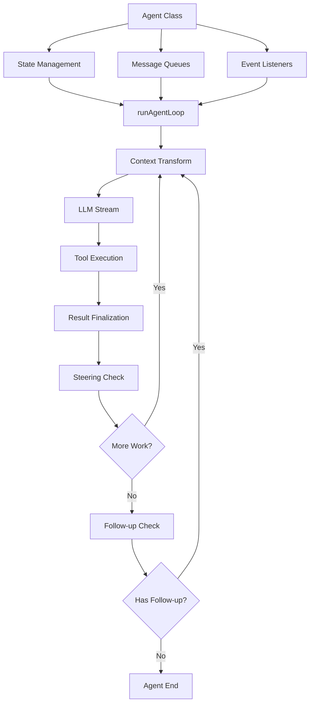
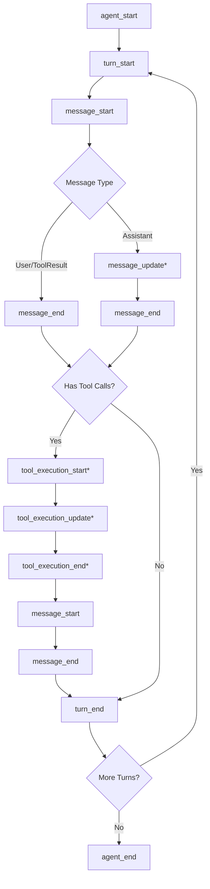
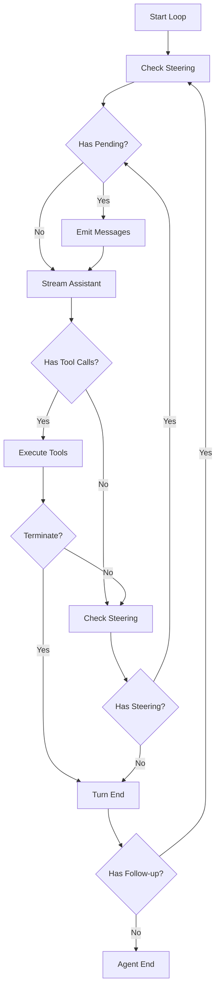

# Agent Loop: Streaming, Tool Execution & Control Flow

The Agent Loop is the core orchestration mechanism within `@pi-agent-core` that manages the conversation flow between users, LLM providers, and tool execution. It implements a sophisticated streaming architecture that handles assistant message generation, tool call preparation and execution, context transformation, and control flow management including steering and follow-up messages. The loop operates on `AgentMessage[]` throughout its lifecycle, only converting to provider-specific `Message[]` at the LLM call boundary, enabling extensibility for custom message types while maintaining compatibility with multiple LLM providers.

The loop supports both sequential and parallel tool execution modes, provides lifecycle hooks for intercepting tool calls before and after execution, and implements a two-tier message queueing system for runtime conversation steering. This architecture enables sophisticated agentic workflows including mid-turn user intervention, context window management, and early termination based on tool results.

Sources: [agent-loop.ts:1-10](../../../packages/agent/src/agent-loop.ts#L1-L10), [types.ts:1-50](../../../packages/agent/src/types.ts#L1-L50)

## Architecture Overview

The agent loop architecture consists of three primary layers: the high-level `Agent` class that manages state and queues, the mid-level loop orchestration functions (`runAgentLoop`, `runAgentLoopContinue`), and the low-level streaming and tool execution primitives. The separation allows for testability, reusability, and clear boundaries between state management, control flow, and execution.



The `Agent` class wraps the loop functions and provides a stateful interface with lifecycle management, while the loop functions themselves are stateless and operate on snapshots of `AgentContext`. This design enables testing loop logic independently of the agent's runtime state.

Sources: [agent.ts:1-50](../../../packages/agent/src/agent.ts#L1-L50), [agent-loop.ts:20-60](../../../packages/agent/src/agent-loop.ts#L20-L60)

## Core Types and Interfaces

### AgentContext and AgentState

The loop operates on two related but distinct types: `AgentContext` (immutable snapshot) and `AgentState` (mutable runtime state).

| Type | Purpose | Ownership | Mutability |
|------|---------|-----------|------------|
| `AgentContext` | Snapshot passed to loop functions | Loop functions | Immutable (copied) |
| `AgentState` | Runtime state with lifecycle tracking | `Agent` class | Mutable via accessors |

```typescript
interface AgentContext {
  systemPrompt: string;
  messages: AgentMessage[];
  tools?: AgentTool<any>[];
}

interface AgentState {
  systemPrompt: string;
  model: Model<any>;
  thinkingLevel: ThinkingLevel;
  set tools(tools: AgentTool<any>[]);
  get tools(): AgentTool<any>[];
  set messages(messages: AgentMessage[]);
  get messages(): AgentMessage[];
  readonly isStreaming: boolean;
  readonly streamingMessage?: AgentMessage;
  readonly pendingToolCalls: ReadonlySet<string>;
  readonly errorMessage?: string;
}
```

The `AgentState` interface uses accessor properties for `tools` and `messages` to enable implementations to copy assigned arrays before storing them, preventing external mutation of internal state.

Sources: [types.ts:147-183](../../../packages/agent/src/types.ts#L147-L183), [agent.ts:50-80](../../../packages/agent/src/agent.ts#L50-L80)

### AgentMessage Extensibility

The `AgentMessage` type is a union of standard LLM messages and custom application messages, enabling apps to extend the message system via TypeScript declaration merging:

```typescript
export type AgentMessage = Message | CustomAgentMessages[keyof CustomAgentMessages];

export interface CustomAgentMessages {
  // Empty by default - apps extend via declaration merging
}
```

This abstraction allows the loop to work with `AgentMessage[]` throughout, deferring conversion to provider-specific `Message[]` until the LLM call boundary via the `convertToLlm` callback.

Sources: [types.ts:139-146](../../../packages/agent/src/types.ts#L139-L146)

### Tool Definition

Tools are defined using the `AgentTool` interface, which extends the base `Tool` interface with execution semantics:

```typescript
export interface AgentTool<TParameters extends TSchema = TSchema, TDetails = any> extends Tool<TParameters> {
  label: string;
  prepareArguments?: (args: unknown) => Static<TParameters>;
  execute: (
    toolCallId: string,
    params: Static<TParameters>,
    signal?: AbortSignal,
    onUpdate?: AgentToolUpdateCallback<TDetails>,
  ) => Promise<AgentToolResult<TDetails>>;
  executionMode?: ToolExecutionMode;
}
```

The `execute` function receives an `onUpdate` callback for streaming partial results during long-running operations, and an `AbortSignal` for cancellation support.

Sources: [types.ts:198-219](../../../packages/agent/src/types.ts#L198-L219), [calculate.ts:1-30](../../../packages/agent/test/utils/calculate.ts#L1-L30), [get-current-time.ts:1-40](../../../packages/agent/test/utils/get-current-time.ts#L1-L40)

## Event Stream Architecture

The agent loop emits a structured sequence of events that enable UI updates, logging, and observability. Events follow a strict lifecycle hierarchy:



Events marked with `*` can occur multiple times within their lifecycle phase. The `message_update` events are only emitted for assistant messages during streaming.

Sources: [types.ts:240-254](../../../packages/agent/src/types.ts#L240-L254), [agent-loop.ts:80-120](../../../packages/agent/src/agent-loop.ts#L80-L120)

### Event Types

| Event Type | Emitted When | Payload |
|------------|--------------|---------|
| `agent_start` | Loop begins execution | None |
| `turn_start` | New assistant turn begins | None |
| `message_start` | Message added to context | `message: AgentMessage` |
| `message_update` | Assistant message streaming | `message: AgentMessage, assistantMessageEvent` |
| `message_end` | Message finalized | `message: AgentMessage` |
| `tool_execution_start` | Tool begins executing | `toolCallId, toolName, args` |
| `tool_execution_update` | Tool streams partial result | `toolCallId, toolName, args, partialResult` |
| `tool_execution_end` | Tool execution completes | `toolCallId, toolName, result, isError` |
| `turn_end` | Assistant turn completes | `message, toolResults` |
| `agent_end` | Loop terminates | `messages: AgentMessage[]` |

The `agent_end` event is the last event emitted, but awaited event listeners for that event are still considered part of the run settlement. The agent only becomes idle after those listeners finish.

Sources: [types.ts:240-254](../../../packages/agent/src/types.ts#L240-L254), [agent.ts:380-450](../../../packages/agent/src/agent.ts#L380-L450)

## Loop Control Flow

### Main Loop Structure

The agent loop implements a nested loop structure with two levels:

1. **Outer loop**: Continues when follow-up messages arrive after the agent would otherwise stop
2. **Inner loop**: Processes tool calls and steering messages



The inner loop continues as long as there are tool calls to execute or steering messages to process. The outer loop continues as long as follow-up messages are available.

Sources: [agent-loop.ts:140-200](../../../packages/agent/src/agent-loop.ts#L140-L200)

### Prompt vs Continue

The loop supports two entry points:

- **`runAgentLoop`**: Starts with new prompt messages, emits events for them, then continues
- **`runAgentLoopContinue`**: Continues from existing context without adding new messages

```typescript
export async function runAgentLoop(
  prompts: AgentMessage[],
  context: AgentContext,
  config: AgentLoopConfig,
  emit: AgentEventSink,
  signal?: AbortSignal,
  streamFn?: StreamFn,
): Promise<AgentMessage[]>

export async function runAgentLoopContinue(
  context: AgentContext,
  config: AgentLoopConfig,
  emit: AgentEventSink,
  signal?: AbortSignal,
  streamFn?: StreamFn,
): Promise<AgentMessage[]>
```

The continue variant requires that the last message in context converts to a `user` or `toolResult` message via `convertToLlm`, as LLM providers reject requests ending with assistant messages.

Sources: [agent-loop.ts:30-85](../../../packages/agent/src/agent-loop.ts#L30-L85)

## LLM Streaming Integration

### Context Transformation Pipeline

Before each LLM call, the agent context passes through a two-stage transformation pipeline:

```mermaid
graph TD
    A[AgentMessage[]] --> B[transformContext]
    B --> C[AgentMessage[]]
    C --> D[convertToLlm]
    D --> E[Message[]]
    E --> F[Build LLM Context]
    F --> G[Stream Response]
```

The `transformContext` hook operates at the `AgentMessage` level and is suitable for context window management or injecting external context. The `convertToLlm` hook converts to provider-specific `Message[]` and filters out UI-only messages.

Sources: [types.ts:42-75](../../../packages/agent/src/types.ts#L42-L75), [agent-loop.ts:205-230](../../../packages/agent/src/agent-loop.ts#L205-L230)

### Streaming Response Handling

The loop integrates with the underlying `streamSimple` function (or custom `StreamFn`) to receive assistant messages:

```typescript
const response = await streamFunction(config.model, llmContext, {
  ...config,
  apiKey: resolvedApiKey,
  signal,
});

for await (const event of response) {
  switch (event.type) {
    case "start":
      // Initialize partial message, add to context, emit message_start
    case "text_delta":
    case "toolcall_delta":
      // Update partial message in context, emit message_update
    case "done":
    case "error":
      // Finalize message, emit message_end
  }
}
```

The loop maintains a partial message in the context during streaming, updating it with each delta event. This enables downstream systems to observe the evolving assistant response in real-time.

Sources: [agent-loop.ts:230-290](../../../packages/agent/src/agent-loop.ts#L230-L290)

### API Key Resolution

The loop supports dynamic API key resolution via the `getApiKey` callback, which is called before each LLM request:

```typescript
const resolvedApiKey =
  (config.getApiKey ? await config.getApiKey(config.model.provider) : undefined) || config.apiKey;
```

This enables short-lived OAuth tokens (e.g., GitHub Copilot) that may expire during long-running tool execution phases to be refreshed automatically.

Sources: [types.ts:76-84](../../../packages/agent/src/types.ts#L76-L84), [agent-loop.ts:240-242](../../../packages/agent/src/agent-loop.ts#L240-L242)

## Tool Execution System

### Execution Modes

The loop supports two tool execution strategies, configurable globally or per-tool:

| Mode | Behavior | Use Case |
|------|----------|----------|
| `sequential` | Tool calls execute one at a time | Tools with side effects, rate limits, or shared resources |
| `parallel` | Tool calls preflight sequentially, then execute concurrently | Independent read-only tools for faster response |

```typescript
export type ToolExecutionMode = "sequential" | "parallel";

export interface AgentTool<TParameters extends TSchema = TSchema, TDetails = any> {
  // ...
  executionMode?: ToolExecutionMode;
}
```

The global mode can be overridden per-tool. If any tool in a batch has `executionMode: "sequential"`, the entire batch executes sequentially.

Sources: [types.ts:19-26](../../../packages/agent/src/types.ts#L19-L26), [types.ts:198-219](../../../packages/agent/src/types.ts#L198-L219), [agent-loop.ts:300-320](../../../packages/agent/src/agent-loop.ts#L300-L320)

### Tool Call Lifecycle

Each tool call passes through a multi-stage lifecycle with hooks for interception and transformation:

```mermaid
sequenceDiagram
    participant Loop
    participant Hooks
    participant Tool
    participant Events

    Loop->>Events: tool_execution_start
    Loop->>Loop: Prepare (validate args)
    Loop->>Hooks: beforeToolCall
    alt Blocked
        Hooks-->>Loop: block=true
        Loop->>Events: tool_execution_end (error)
    else Allowed
        Hooks-->>Loop: continue
        Loop->>Tool: execute()
        Tool-->>Events: tool_execution_update*
        Tool-->>Loop: result
        Loop->>Hooks: afterToolCall
        Hooks-->>Loop: overrides
        Loop->>Loop: Finalize (apply overrides)
        Loop->>Events: tool_execution_end
        Loop->>Events: message_start (toolResult)
        Loop->>Events: message_end (toolResult)
    end
```

The lifecycle stages are: preparation (argument validation), pre-execution hook, execution (with streaming updates), post-execution hook, and finalization (applying overrides).

Sources: [agent-loop.ts:350-500](../../../packages/agent/src/agent-loop.ts#L350-L500)

### Sequential Execution

In sequential mode, tool calls execute fully (prepare → execute → finalize → emit) before the next one starts:

```typescript
async function executeToolCallsSequential(
  currentContext: AgentContext,
  assistantMessage: AssistantMessage,
  toolCalls: AgentToolCall[],
  config: AgentLoopConfig,
  signal: AbortSignal | undefined,
  emit: AgentEventSink,
): Promise<ExecutedToolCallBatch> {
  const finalizedCalls: FinalizedToolCallOutcome[] = [];
  const messages: ToolResultMessage[] = [];

  for (const toolCall of toolCalls) {
    await emit({ type: "tool_execution_start", /* ... */ });
    const preparation = await prepareToolCall(/* ... */);
    // Execute if allowed
    const finalized = /* ... */;
    await emitToolExecutionEnd(finalized, emit);
    const toolResultMessage = createToolResultMessage(finalized);
    await emitToolResultMessage(toolResultMessage, emit);
    finalizedCalls.push(finalized);
    messages.push(toolResultMessage);
  }

  return { messages, terminate: shouldTerminateToolBatch(finalizedCalls) };
}
```

This ensures strict ordering and enables tools to observe results from previous tool calls in the same batch via context updates.

Sources: [agent-loop.ts:330-370](../../../packages/agent/src/agent-loop.ts#L330-L370)

### Parallel Execution

In parallel mode, all tool calls are prepared sequentially (to emit `tool_execution_start` in order), then allowed tools execute concurrently:

```typescript
async function executeToolCallsParallel(
  currentContext: AgentContext,
  assistantMessage: AssistantMessage,
  toolCalls: AgentToolCall[],
  config: AgentLoopConfig,
  signal: AbortSignal | undefined,
  emit: AgentEventSink,
): Promise<ExecutedToolCallBatch> {
  const finalizedCalls: FinalizedToolCallEntry[] = [];

  for (const toolCall of toolCalls) {
    await emit({ type: "tool_execution_start", /* ... */ });
    const preparation = await prepareToolCall(/* ... */);
    if (preparation.kind === "immediate") {
      // Blocked or validation error - finalize immediately
      await emitToolExecutionEnd(finalized, emit);
      finalizedCalls.push(finalized);
    } else {
      // Queue async execution
      finalizedCalls.push(async () => {
        const executed = await executePreparedToolCall(preparation, signal, emit);
        const finalized = await finalizeExecutedToolCall(/* ... */);
        await emitToolExecutionEnd(finalized, emit);
        return finalized;
      });
    }
  }

  // Wait for all executions to complete
  const orderedFinalizedCalls = await Promise.all(
    finalizedCalls.map((entry) => (typeof entry === "function" ? entry() : Promise.resolve(entry)))
  );

  // Emit tool-result messages in assistant source order
  const messages: ToolResultMessage[] = [];
  for (const finalized of orderedFinalizedCalls) {
    const toolResultMessage = createToolResultMessage(finalized);
    await emitToolResultMessage(toolResultMessage, emit);
    messages.push(toolResultMessage);
  }

  return { messages, terminate: shouldTerminateToolBatch(orderedFinalizedCalls) };
}
```

The `tool_execution_end` events are emitted in tool completion order (as each finishes), while tool-result message artifacts are emitted later in assistant source order (preserving the LLM's intended sequence).

Sources: [agent-loop.ts:372-430](../../../packages/agent/src/agent-loop.ts#L372-L430)

### Tool Call Hooks

The loop provides two hooks for intercepting tool execution:

#### beforeToolCall

Called after argument validation but before execution. Can block execution:

```typescript
export interface BeforeToolCallContext {
  assistantMessage: AssistantMessage;
  toolCall: AgentToolCall;
  args: unknown;
  context: AgentContext;
}

export interface BeforeToolCallResult {
  block?: boolean;
  reason?: string;
}
```

Returning `{ block: true }` prevents execution and emits an error tool result with the provided reason (or a default message).

Sources: [types.ts:36-57](../../../packages/agent/src/types.ts#L36-L57), [agent-loop.ts:480-510](../../../packages/agent/src/agent-loop.ts#L480-L510)

#### afterToolCall

Called after execution completes, before events are emitted. Can override result fields:

```typescript
export interface AfterToolCallContext {
  assistantMessage: AssistantMessage;
  toolCall: AgentToolCall;
  args: unknown;
  result: AgentToolResult<any>;
  isError: boolean;
  context: AgentContext;
}

export interface AfterToolCallResult {
  content?: (TextContent | ImageContent)[];
  details?: unknown;
  isError?: boolean;
  terminate?: boolean;
}
```

Merge semantics are field-by-field: provided fields replace the original values in full (no deep merge). Omitted fields keep their original values.

Sources: [types.ts:59-79](../../../packages/agent/src/types.ts#L59-L79), [agent-loop.ts:550-580](../../../packages/agent/src/agent-loop.ts#L550-L580)

### Early Termination

Tools can signal early termination via the `terminate` flag in their result:

```typescript
export interface AgentToolResult<T> {
  content: (TextContent | ImageContent)[];
  details: T;
  terminate?: boolean;
}
```

Early termination only occurs when **every** finalized tool result in the batch sets `terminate: true`. This prevents a single tool from prematurely stopping the agent when other tools in the batch may have important results.

Sources: [types.ts:186-196](../../../packages/agent/src/types.ts#L186-L196), [agent-loop.ts:440-445](../../../packages/agent/src/agent-loop.ts#L440-L445)

## Message Queueing System

The `Agent` class implements a two-tier message queueing system for runtime conversation control:

### Steering Messages

Steering messages are injected **after the current assistant turn finishes** executing its tool calls but **before the next LLM call**. They enable mid-conversation intervention:

```typescript
agent.steer({ role: "user", content: [{ type: "text", text: "Stop and explain your reasoning" }], timestamp: Date.now() });
```

Steering messages do not skip tool calls from the current assistant message. They are processed after those tool calls complete.

Sources: [types.ts:85-95](../../../packages/agent/src/types.ts#L85-L95), [agent.ts:180-200](../../../packages/agent/src/agent.ts#L180-L200)

### Follow-up Messages

Follow-up messages are processed **only after the agent would otherwise stop** (no more tool calls, no steering messages). They enable automated continuation:

```typescript
agent.followUp({ role: "user", content: [{ type: "text", text: "Now optimize the code" }], timestamp: Date.now() });
```

If follow-up messages are available when the agent reaches a natural stopping point, they are drained and the loop continues.

Sources: [types.ts:97-108](../../../packages/agent/src/types.ts#L97-L108), [agent.ts:200-220](../../../packages/agent/src/agent.ts#L200-L220)

### Queue Modes

Both queues support two draining modes:

| Mode | Behavior |
|------|----------|
| `all` | Drain all queued messages at once |
| `one-at-a-time` | Drain one message per poll |

```typescript
type QueueMode = "all" | "one-at-a-time";

agent.steeringMode = "one-at-a-time"; // Default
agent.followUpMode = "one-at-a-time"; // Default
```

The `one-at-a-time` mode enables finer-grained control, allowing the agent to process each message and potentially execute tool calls before receiving the next one.

Sources: [agent.ts:90-120](../../../packages/agent/src/agent.ts#L90-L120)

## Agent State Management

### Mutable State Design

The `Agent` class maintains mutable state using a private `MutableAgentState` object with accessor properties:

```typescript
function createMutableAgentState(initialState?: Partial<...>): MutableAgentState {
  let tools = initialState?.tools?.slice() ?? [];
  let messages = initialState?.messages?.slice() ?? [];

  return {
    systemPrompt: initialState?.systemPrompt ?? "",
    model: initialState?.model ?? DEFAULT_MODEL,
    thinkingLevel: initialState?.thinkingLevel ?? "off",
    get tools() { return tools; },
    set tools(nextTools: AgentTool<any>[]) { tools = nextTools.slice(); },
    get messages() { return messages; },
    set messages(nextMessages: AgentMessage[]) { messages = nextMessages.slice(); },
    isStreaming: false,
    streamingMessage: undefined,
    pendingToolCalls: new Set<string>(),
    errorMessage: undefined,
  };
}
```

The accessors copy assigned arrays to prevent external mutation of internal state. The `isStreaming`, `streamingMessage`, `pendingToolCalls`, and `errorMessage` fields are read-only runtime state managed by the agent.

Sources: [agent.ts:50-85](../../../packages/agent/src/agent.ts#L50-L85)

### Runtime State Tracking

During execution, the agent tracks:

- **`isStreaming`**: True from loop start until `agent_end` listeners finish
- **`streamingMessage`**: Partial assistant message during streaming
- **`pendingToolCalls`**: Set of tool call IDs currently executing
- **`errorMessage`**: Error from the most recent failed/aborted turn

```typescript
private async processEvents(event: AgentEvent): Promise<void> {
  switch (event.type) {
    case "message_start":
      this._state.streamingMessage = event.message;
      break;
    case "message_update":
      this._state.streamingMessage = event.message;
      break;
    case "message_end":
      this._state.streamingMessage = undefined;
      this._state.messages.push(event.message);
      break;
    case "tool_execution_start":
      const pendingToolCalls = new Set(this._state.pendingToolCalls);
      pendingToolCalls.add(event.toolCallId);
      this._state.pendingToolCalls = pendingToolCalls;
      break;
    case "tool_execution_end":
      const pendingToolCalls = new Set(this._state.pendingToolCalls);
      pendingToolCalls.delete(event.toolCallId);
      this._state.pendingToolCalls = pendingToolCalls;
      break;
  }
}
```

The state updates happen before event listeners are invoked, ensuring listeners observe consistent state.

Sources: [agent.ts:380-450](../../../packages/agent/src/agent.ts#L380-L450)

## Error Handling and Abortion

### Error Propagation

The loop follows a strict error handling contract:

- **Configuration callbacks** (`convertToLlm`, `transformContext`, `getApiKey`, `getSteeringMessages`, `getFollowUpMessages`) must not throw. They should return safe fallback values instead.
- **Tool execution** encodes failures in the returned `AgentToolResult` via `isError: true`, not by throwing.
- **Hook failures** (`beforeToolCall`, `afterToolCall`) are caught and converted to error tool results.

When the underlying `streamSimple` function encounters a request/model/runtime failure, it returns a stream with an `error` event and a final `AssistantMessage` with `stopReason: "error"` and `errorMessage` set. The loop propagates this through the event stream and terminates.

Sources: [types.ts:8-17](../../../packages/agent/src/types.ts#L8-L17), [agent-loop.ts:550-580](../../../packages/agent/src/agent-loop.ts#L550-L580)

### Abort Signal Propagation

The agent supports cancellation via `AbortSignal`:

```typescript
agent.abort(); // Abort the current run
await agent.waitForIdle(); // Wait for cleanup
```

The signal is propagated to:
- The `streamSimple` function (or custom `StreamFn`)
- Tool `execute` functions
- Hook callbacks (`beforeToolCall`, `afterToolCall`, `transformContext`)
- Event listeners

When aborted, the loop emits an assistant message with `stopReason: "aborted"` and terminates.

Sources: [agent.ts:140-180](../../../packages/agent/src/agent.ts#L140-L180), [agent.ts:300-350](../../../packages/agent/src/agent.ts#L300-L350)

### Run Lifecycle Management

The agent ensures only one run is active at a time using an `ActiveRun` guard:

```typescript
type ActiveRun = {
  promise: Promise<void>;
  resolve: () => void;
  abortController: AbortController;
};

private async runWithLifecycle(executor: (signal: AbortSignal) => Promise<void>): Promise<void> {
  if (this.activeRun) {
    throw new Error("Agent is already processing.");
  }

  const abortController = new AbortController();
  let resolvePromise = () => {};
  const promise = new Promise<void>((resolve) => { resolvePromise = resolve; });
  this.activeRun = { promise, resolve: resolvePromise, abortController };

  this._state.isStreaming = true;
  try {
    await executor(abortController.signal);
  } catch (error) {
    await this.handleRunFailure(error, abortController.signal.aborted);
  } finally {
    this.finishRun();
  }
}
```

The `activeRun.promise` resolves only after `agent_end` listeners finish, ensuring `waitForIdle()` waits for full settlement.

Sources: [agent.ts:280-340](../../../packages/agent/src/agent.ts#L280-L340)

## Configuration and Extensibility

### AgentLoopConfig

The loop configuration interface consolidates all customization points:

```typescript
export interface AgentLoopConfig extends SimpleStreamOptions {
  model: Model<any>;
  convertToLlm: (messages: AgentMessage[]) => Message[] | Promise<Message[]>;
  transformContext?: (messages: AgentMessage[], signal?: AbortSignal) => Promise<AgentMessage[]>;
  getApiKey?: (provider: string) => Promise<string | undefined> | string | undefined;
  getSteeringMessages?: () => Promise<AgentMessage[]>;
  getFollowUpMessages?: () => Promise<AgentMessage[]>;
  toolExecution?: ToolExecutionMode;
  beforeToolCall?: (context: BeforeToolCallContext, signal?: AbortSignal) => Promise<BeforeToolCallResult | undefined>;
  afterToolCall?: (context: AfterToolCallContext, signal?: AbortSignal) => Promise<AfterToolCallResult | undefined>;
}
```

The configuration is created per-run from the agent's current state and options, enabling dynamic behavior changes between runs.

Sources: [types.ts:28-135](../../../packages/agent/src/types.ts#L28-L135), [agent.ts:220-260](../../../packages/agent/src/agent.ts#L220-L260)

### Custom Stream Functions

The loop supports custom streaming implementations via the `StreamFn` type:

```typescript
export type StreamFn = (
  ...args: Parameters<typeof streamSimple>
) => ReturnType<typeof streamSimple> | Promise<ReturnType<typeof streamSimple>>;
```

Custom stream functions must follow the contract: never throw or reject for request/model/runtime failures; encode failures in the returned stream via protocol events and a final `AssistantMessage` with `stopReason: "error"` or `"aborted"` and `errorMessage`.

Sources: [types.ts:8-17](../../../packages/agent/src/types.ts#L8-L17), [agent.ts:30-50](../../../packages/agent/src/agent.ts#L30-L50)

## Example: Tool Implementation

The test utilities demonstrate complete tool implementations following the agent's contracts:

### Calculate Tool

```typescript
export const calculateTool: AgentTool<typeof calculateSchema, undefined> = {
  label: "Calculator",
  name: "calculate",
  description: "Evaluate mathematical expressions",
  parameters: calculateSchema,
  execute: async (_toolCallId: string, args: CalculateParams) => {
    try {
      const result = new Function(`return ${args.expression}`)();
      return { 
        content: [{ type: "text", text: `${args.expression} = ${result}` }], 
        details: undefined 
      };
    } catch (e: any) {
      throw new Error(e.message || String(e));
    }
  },
};
```

The tool throws on failure rather than returning an error result, delegating error handling to the loop's execution layer.

Sources: [calculate.ts:1-31](../../../packages/agent/test/utils/calculate.ts#L1-L31)

### Get Current Time Tool

```typescript
export const getCurrentTimeTool: AgentTool<typeof getCurrentTimeSchema, { utcTimestamp: number }> = {
  label: "Current Time",
  name: "get_current_time",
  description: "Get the current date and time",
  parameters: getCurrentTimeSchema,
  execute: async (_toolCallId: string, args: GetCurrentTimeParams) => {
    const date = new Date();
    if (args.timezone) {
      try {
        const timeStr = date.toLocaleString("en-US", {
          timeZone: args.timezone,
          dateStyle: "full",
          timeStyle: "long",
        });
        return {
          content: [{ type: "text", text: timeStr }],
          details: { utcTimestamp: date.getTime() },
        };
      } catch (_e) {
        throw new Error(`Invalid timezone: ${args.timezone}. Current UTC time: ${date.toISOString()}`);
      }
    }
    const timeStr = date.toLocaleString("en-US", { dateStyle: "full", timeStyle: "long" });
    return {
      content: [{ type: "text", text: timeStr }],
      details: { utcTimestamp: date.getTime() },
    };
  },
};
```

This tool demonstrates returning structured `details` alongside text content for UI rendering or logging.

Sources: [get-current-time.ts:1-45](../../../packages/agent/test/utils/get-current-time.ts#L1-L45)

## Summary

The Agent Loop implements a sophisticated streaming and tool execution architecture that balances flexibility, observability, and control flow management. Its key design principles include:

- **Message abstraction**: Working with `AgentMessage[]` throughout enables custom message types while maintaining LLM compatibility
- **Event-driven observability**: Structured lifecycle events enable real-time UI updates and comprehensive logging
- **Flexible tool execution**: Sequential and parallel modes with lifecycle hooks support diverse tool requirements
- **Runtime steering**: Two-tier message queues enable mid-conversation intervention and automated continuation
- **Clean separation of concerns**: Stateless loop functions, stateful agent wrapper, and clear boundaries between layers

This architecture enables sophisticated agentic workflows including multi-turn conversations, parallel tool execution, context window management, and graceful error handling across multiple LLM providers.

Sources: [agent-loop.ts:1-600](../../../packages/agent/src/agent-loop.ts#L1-L600), [agent.ts:1-450](../../../packages/agent/src/agent.ts#L1-L450), [types.ts:1-254](../../../packages/agent/src/types.ts#L1-L254)