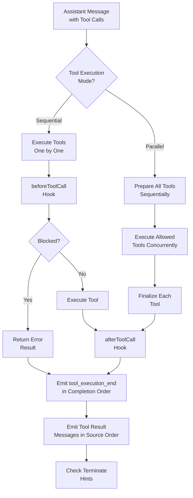
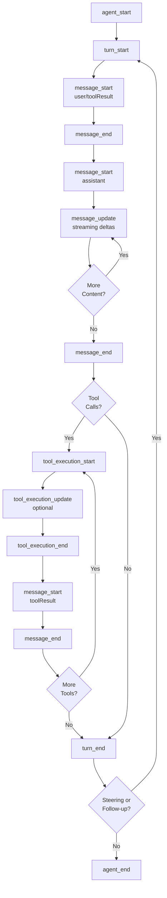
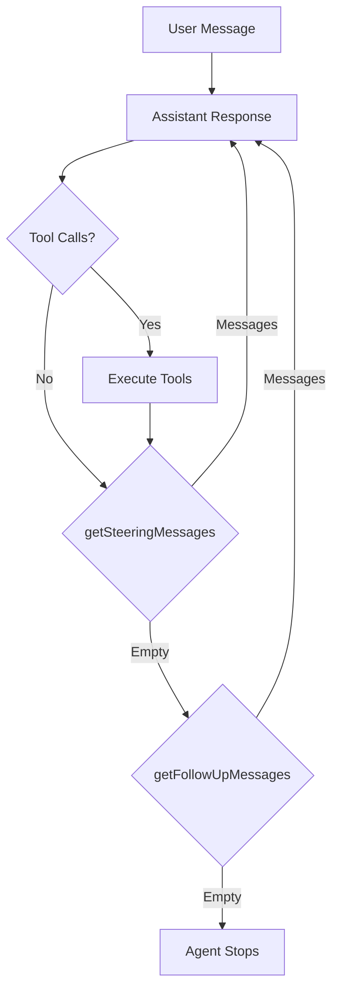
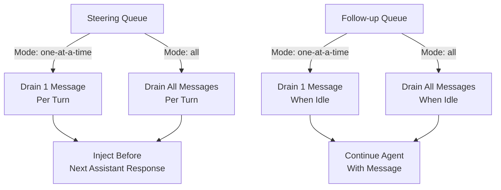
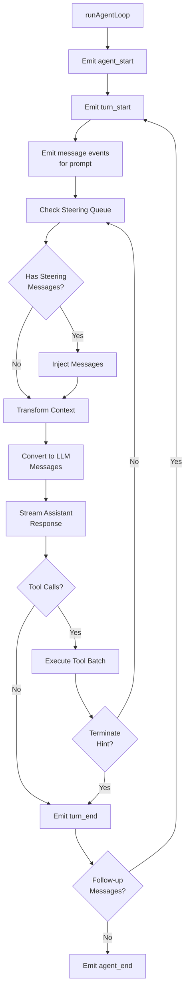

# Agent Package Overview & Types

## Introduction

The `@mariozechner/pi-agent-core` package provides a general-purpose AI agent framework with transport abstraction, state management, and tool execution capabilities. This package serves as the core runtime for building conversational AI agents that can interact with multiple LLM providers, execute tools, and manage complex conversation flows. The agent architecture separates concerns between high-level state management (the `Agent` class), low-level execution logic (the agent loop), and type definitions that enable extensibility and type safety throughout the system.

The package exports four main modules: the core `Agent` class for stateful agent management, loop functions for low-level execution control, proxy utilities for advanced use cases, and a comprehensive type system that supports custom message types and tool definitions. This design allows applications to extend the agent's capabilities through declaration merging while maintaining compatibility with the underlying LLM protocol.

Sources: [packages/agent/src/index.ts:1-8](../../../packages/agent/src/index.ts#L1-L8), [packages/agent/package.json:2-4](../../../packages/agent/package.json#L2-L4)

## Package Structure

The agent package is organized into four primary modules that separate concerns and provide clear extension points:

| Module | Purpose | Key Exports |
|--------|---------|-------------|
| `agent.ts` | Stateful agent wrapper with lifecycle management | `Agent` class, `AgentOptions` |
| `agent-loop.ts` | Low-level execution logic for streaming and tool calls | `agentLoop`, `agentLoopContinue`, `runAgentLoop` |
| `types.ts` | Type definitions and interfaces | `AgentMessage`, `AgentTool`, `AgentEvent`, `AgentLoopConfig` |
| `proxy.ts` | Proxy utilities for advanced scenarios | (not detailed in provided files) |

Sources: [packages/agent/src/index.ts:1-8](../../../packages/agent/src/index.ts#L1-L8)

## Core Type System

### AgentMessage: Extensible Message Protocol

The `AgentMessage` type forms the foundation of the agent's conversation model. It extends the base LLM `Message` type with support for custom application-specific messages through TypeScript declaration merging:

```typescript
export type AgentMessage = Message | CustomAgentMessages[keyof CustomAgentMessages];
```

Applications can extend the message protocol by declaring custom message types:

```typescript
declare module "@mariozechner/agent" {
  interface CustomAgentMessages {
    artifact: ArtifactMessage;
    notification: NotificationMessage;
  }
}
```

This design allows the agent to handle both standard LLM messages (user, assistant, toolResult) and custom messages for UI notifications, artifacts, or other application-specific data without breaking type safety.

Sources: [packages/agent/src/types.ts:99-118](../../../packages/agent/src/types.ts#L99-L118)

### AgentState: Public State Interface

The `AgentState` interface exposes the agent's current state through accessor properties that enforce immutability contracts:

| Property | Type | Description |
|----------|------|-------------|
| `systemPrompt` | `string` | System prompt sent with each model request |
| `model` | `Model<any>` | Active model for future turns |
| `thinkingLevel` | `ThinkingLevel` | Requested reasoning level ("off" \| "minimal" \| "low" \| "medium" \| "high" \| "xhigh") |
| `tools` | `AgentTool<any>[]` | Available tools (setter copies array) |
| `messages` | `AgentMessage[]` | Conversation transcript (setter copies array) |
| `isStreaming` | `boolean` (readonly) | True while processing a prompt |
| `streamingMessage` | `AgentMessage?` (readonly) | Partial assistant message during streaming |
| `pendingToolCalls` | `ReadonlySet<string>` (readonly) | Tool call IDs currently executing |
| `errorMessage` | `string?` (readonly) | Error from most recent failed turn |

The use of accessor properties for `tools` and `messages` allows implementations to copy assigned arrays before storing them, preventing external mutations from affecting internal state.

Sources: [packages/agent/src/types.ts:120-141](../../../packages/agent/src/types.ts#L120-L141)

### Tool Execution Architecture



The agent supports two tool execution modes configurable via `ToolExecutionMode`:

- **Sequential**: Each tool call is prepared, executed, and finalized before the next one starts
- **Parallel**: Tool calls are prepared sequentially, then allowed tools execute concurrently. The `tool_execution_end` event is emitted in tool completion order after each tool is finalized, while tool-result message artifacts are emitted later in assistant source order

Individual tools can override the global execution mode by setting their own `executionMode` property.

Sources: [packages/agent/src/types.ts:22-33](../../../packages/agent/src/types.ts#L22-L33), [packages/agent/src/types.ts:167-176](../../../packages/agent/src/types.ts#L167-L176)

### AgentTool Interface

The `AgentTool` interface extends the base `Tool` definition with agent-specific capabilities:

```typescript
export interface AgentTool<TParameters extends TSchema = TSchema, TDetails = any> extends Tool<TParameters> {
  label: string;
  prepareArguments?: (args: unknown) => Static<TParameters>;
  execute: (
    toolCallId: string,
    params: Static<TParameters>,
    signal?: AbortSignal,
    onUpdate?: AgentToolUpdateCallback<TDetails>,
  ) => Promise<AgentToolResult<TDetails>>;
  executionMode?: ToolExecutionMode;
}
```

Key features include:

- **Label**: Human-readable name for UI display
- **prepareArguments**: Optional compatibility shim for raw tool-call arguments before schema validation
- **execute**: Async function that must throw on failure instead of encoding errors in content
- **onUpdate**: Callback for streaming partial execution updates to the UI
- **executionMode**: Per-tool override for sequential vs. parallel execution

Sources: [packages/agent/src/types.ts:151-176](../../../packages/agent/src/types.ts#L151-L176)

## Agent Lifecycle Events

The agent emits structured events throughout its execution lifecycle, enabling UI updates and observability:



### Event Types

| Event Type | When Emitted | Payload |
|------------|--------------|---------|
| `agent_start` | Beginning of run | None |
| `agent_end` | End of run (after all listeners settle) | `messages: AgentMessage[]` |
| `turn_start` | Beginning of assistant turn | None |
| `turn_end` | End of turn with tool results | `message: AgentMessage`, `toolResults: ToolResultMessage[]` |
| `message_start` | New message begins | `message: AgentMessage` |
| `message_update` | Assistant message streaming delta | `message: AgentMessage`, `assistantMessageEvent: AssistantMessageEvent` |
| `message_end` | Message finalized | `message: AgentMessage` |
| `tool_execution_start` | Tool begins executing | `toolCallId: string`, `toolName: string`, `args: any` |
| `tool_execution_update` | Tool streams partial result | `toolCallId: string`, `toolName: string`, `args: any`, `partialResult: any` |
| `tool_execution_end` | Tool finishes executing | `toolCallId: string`, `toolName: string`, `result: any`, `isError: boolean` |

The `agent_end` event is the last event emitted for a run, but awaited `Agent.subscribe()` listeners for that event are still part of run settlement. The agent becomes idle only after those listeners finish.

Sources: [packages/agent/src/types.ts:198-213](../../../packages/agent/src/types.ts#L198-L213)

## Agent Loop Configuration

The `AgentLoopConfig` interface defines the contract between the high-level `Agent` class and the low-level loop execution:

### Core Configuration

| Property | Type | Required | Description |
|----------|------|----------|-------------|
| `model` | `Model<any>` | Yes | Target LLM model |
| `convertToLlm` | Function | Yes | Converts AgentMessage[] to LLM-compatible Message[] |
| `transformContext` | Function | No | Pre-processing for context window management |
| `getApiKey` | Function | No | Dynamically resolves API keys for each LLM call |
| `toolExecution` | `ToolExecutionMode` | No | "sequential" or "parallel" (default: "parallel") |

### Message Flow Hooks

The configuration supports three message injection points:



- **getSteeringMessages**: Returns messages to inject mid-run after the current assistant turn finishes executing its tool calls. Tool calls from the current assistant message are not skipped.
- **getFollowUpMessages**: Returns messages to process after the agent would otherwise stop (no more tool calls and no steering messages).

Sources: [packages/agent/src/types.ts:64-109](../../../packages/agent/src/types.ts#L64-L109)

### Tool Call Lifecycle Hooks

The agent provides two hooks for intercepting tool execution:

#### beforeToolCall Hook

Called before a tool executes, after arguments have been validated:

```typescript
beforeToolCall?: (context: BeforeToolCallContext, signal?: AbortSignal) 
  => Promise<BeforeToolCallResult | undefined>
```

**Context includes:**
- `assistantMessage`: The assistant message that requested the tool call
- `toolCall`: The raw tool call block
- `args`: Validated tool arguments
- `context`: Current agent context

**Return `{ block: true }` to prevent execution.** The loop emits an error tool result instead. The optional `reason` field becomes the text shown in that error result.

Sources: [packages/agent/src/types.ts:57-62](../../../packages/agent/src/types.ts#L57-L62), [packages/agent/src/types.ts:135-149](../../../packages/agent/src/types.ts#L135-L149)

#### afterToolCall Hook

Called after a tool finishes executing, before `tool_execution_end` and tool-result message events are emitted:

```typescript
afterToolCall?: (context: AfterToolCallContext, signal?: AbortSignal) 
  => Promise<AfterToolCallResult | undefined>
```

**Context includes:**
- `assistantMessage`: The assistant message that requested the tool call
- `toolCall`: The raw tool call block
- `args`: Validated tool arguments
- `result`: The executed tool result before any overrides
- `isError`: Whether the executed tool result is currently treated as an error
- `context`: Current agent context

**Return an `AfterToolCallResult` to override parts of the executed tool result:**
- `content`: Replaces the full content array
- `details`: Replaces the full details payload
- `isError`: Replaces the error flag
- `terminate`: Replaces the early-termination hint

Omitted fields keep their original values. No deep merge is performed.

Sources: [packages/agent/src/types.ts:64-76](../../../packages/agent/src/types.ts#L64-L76), [packages/agent/src/types.ts:151-162](../../../packages/agent/src/types.ts#L151-L162)

## Agent Class API

The `Agent` class provides a stateful wrapper around the low-level agent loop with queueing capabilities:

### Construction

```typescript
const agent = new Agent({
  initialState?: Partial<AgentState>,
  convertToLlm?: (messages: AgentMessage[]) => Message[] | Promise<Message[]>,
  transformContext?: (messages: AgentMessage[], signal?: AbortSignal) => Promise<AgentMessage[]>,
  streamFn?: StreamFn,
  getApiKey?: (provider: string) => Promise<string | undefined> | string | undefined,
  beforeToolCall?: (context: BeforeToolCallContext, signal?: AbortSignal) => Promise<BeforeToolCallResult | undefined>,
  afterToolCall?: (context: AfterToolCallContext, signal?: AbortSignal) => Promise<AfterToolCallResult | undefined>,
  steeringMode?: "all" | "one-at-a-time",
  followUpMode?: "all" | "one-at-a-time",
  sessionId?: string,
  thinkingBudgets?: ThinkingBudgets,
  transport?: Transport,
  maxRetryDelayMs?: number,
  toolExecution?: ToolExecutionMode,
});
```

Sources: [packages/agent/src/agent.ts:102-118](../../../packages/agent/src/agent.ts#L102-L118)

### Primary Methods

| Method | Signature | Description |
|--------|-----------|-------------|
| `prompt` | `(message: string \| AgentMessage \| AgentMessage[], images?: ImageContent[]) => Promise<void>` | Start a new prompt from text, a single message, or a batch of messages |
| `continue` | `() => Promise<void>` | Continue from the current transcript (last message must be user or toolResult) |
| `subscribe` | `(listener: (event: AgentEvent, signal: AbortSignal) => Promise<void> \| void) => () => void` | Subscribe to agent lifecycle events; returns unsubscribe function |
| `steer` | `(message: AgentMessage) => void` | Queue a message to inject after the current assistant turn finishes |
| `followUp` | `(message: AgentMessage) => void` | Queue a message to run only after the agent would otherwise stop |
| `abort` | `() => void` | Abort the current run if one is active |
| `waitForIdle` | `() => Promise<void>` | Resolve when the current run and all awaited event listeners have finished |
| `reset` | `() => void` | Clear transcript state, runtime state, and queued messages |

Sources: [packages/agent/src/agent.ts:177-261](../../../packages/agent/src/agent.ts#L177-L261)

### Queue Management

The agent maintains two internal queues for message injection:



The queue mode controls how many messages are drained at once:
- **one-at-a-time**: Drains a single message per poll (default for steering)
- **all**: Drains all queued messages at once (default for follow-up)

Sources: [packages/agent/src/agent.ts:120-137](../../../packages/agent/src/agent.ts#L120-L137), [packages/agent/src/agent.ts:177-205](../../../packages/agent/src/agent.ts#L177-L205)

## Agent Loop Execution Flow

The low-level agent loop handles the core execution logic, separating concerns from the stateful `Agent` wrapper:



### Key Functions

| Function | Purpose | When to Use |
|----------|---------|-------------|
| `runAgentLoop` | Start a loop with new prompt messages | Initial user message or batch of messages |
| `runAgentLoopContinue` | Continue from current context without adding new messages | Retries or continuation after tool results |
| `agentLoop` | Stream-based wrapper for `runAgentLoop` | When using EventStream API instead of callbacks |
| `agentLoopContinue` | Stream-based wrapper for `runAgentLoopContinue` | When using EventStream API for continuation |

Sources: [packages/agent/src/agent-loop.ts:19-71](../../../packages/agent/src/agent-loop.ts#L19-L71)

### Tool Execution Implementation

The loop implements tool execution with support for both sequential and parallel modes:

```typescript
async function executeToolCalls(
  currentContext: AgentContext,
  assistantMessage: AssistantMessage,
  config: AgentLoopConfig,
  signal: AbortSignal | undefined,
  emit: AgentEventSink,
): Promise<ExecutedToolCallBatch>
```

The execution pipeline follows these stages:

1. **Preparation**: Validate arguments, run `beforeToolCall` hook, check for blocking
2. **Execution**: Call tool's `execute` method with abort signal and update callback
3. **Finalization**: Run `afterToolCall` hook, apply overrides, emit events

In parallel mode, preparation happens sequentially to maintain order, but execution runs concurrently. The `tool_execution_end` events emit in completion order, while tool-result messages emit in source order to maintain conversation coherence.

Sources: [packages/agent/src/agent-loop.ts:246-258](../../../packages/agent/src/agent-loop.ts#L246-L258), [packages/agent/src/agent-loop.ts:283-331](../../../packages/agent/src/agent-loop.ts#L283-L331)

## Streaming and Transport Abstraction

The agent uses a pluggable `StreamFn` for LLM communication:

```typescript
export type StreamFn = (
  ...args: Parameters<typeof streamSimple>
) => ReturnType<typeof streamSimple> | Promise<ReturnType<typeof streamSimple>>;
```

**Contract requirements:**
- Must not throw or return a rejected promise for request/model/runtime failures
- Must return an `AssistantMessageEventStream`
- Failures must be encoded in the returned stream via protocol events and a final `AssistantMessage` with `stopReason` "error" or "aborted" and `errorMessage`

This design allows the agent to work with different LLM providers and transport mechanisms (SSE, WebSocket, HTTP polling) without changing core logic.

Sources: [packages/agent/src/types.ts:14-21](../../../packages/agent/src/types.ts#L14-L21)

## State Management and Immutability

The `Agent` class uses internal mutable state while exposing an immutable public interface:

```typescript
type MutableAgentState = Omit<AgentState, "isStreaming" | "streamingMessage" | "pendingToolCalls" | "errorMessage"> & {
  isStreaming: boolean;
  streamingMessage?: AgentMessage;
  pendingToolCalls: Set<string>;
  errorMessage?: string;
};
```

The `createMutableAgentState` function creates state objects with accessor properties that copy arrays on assignment:

```typescript
set tools(nextTools: AgentTool<any>[]) {
  tools = nextTools.slice();
}
```

This prevents external code from mutating internal state arrays while allowing efficient internal updates.

Sources: [packages/agent/src/agent.ts:36-66](../../../packages/agent/src/agent.ts#L36-L66)

## Error Handling and Abort Semantics

The agent provides comprehensive error handling and abort capabilities:

### Run Lifecycle Management

Each run maintains an `ActiveRun` structure:

```typescript
type ActiveRun = {
  promise: Promise<void>;
  resolve: () => void;
  abortController: AbortController;
};
```

The abort signal propagates through:
- Tool execution (`execute` method receives signal)
- Context transformation (`transformContext` receives signal)
- Tool lifecycle hooks (`beforeToolCall` and `afterToolCall` receive signal)
- Event listeners (all listeners receive the active signal)

Sources: [packages/agent/src/agent.ts:139-143](../../../packages/agent/src/agent.ts#L139-L143)

### Error Recovery

When a run fails, the agent creates a synthetic error message:

```typescript
const failureMessage = {
  role: "assistant",
  content: [{ type: "text", text: "" }],
  api: this._state.model.api,
  provider: this._state.model.provider,
  model: this._state.model.id,
  usage: EMPTY_USAGE,
  stopReason: aborted ? "aborted" : "error",
  errorMessage: error instanceof Error ? error.message : String(error),
  timestamp: Date.now(),
};
```

This ensures the transcript remains consistent and the UI can display error information.

Sources: [packages/agent/src/agent.ts:313-327](../../../packages/agent/src/agent.ts#L313-L327)

## Summary

The `@mariozechner/pi-agent-core` package provides a robust foundation for building AI agents with support for multiple LLM providers, complex tool execution patterns, and extensible message protocols. The architecture separates stateful management (`Agent` class) from low-level execution logic (agent loop), enabling both high-level convenience APIs and fine-grained control when needed. The type system supports application-specific extensions through declaration merging while maintaining type safety, and the event-driven design allows for rich UI integration and observability. The combination of sequential and parallel tool execution modes, lifecycle hooks, and message queueing capabilities makes this package suitable for a wide range of AI agent applications.