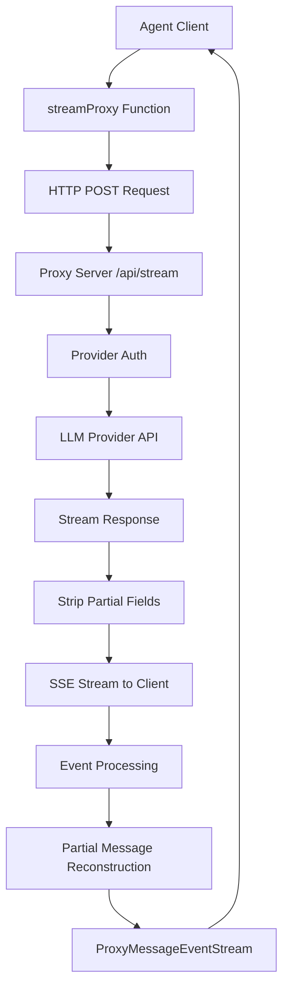
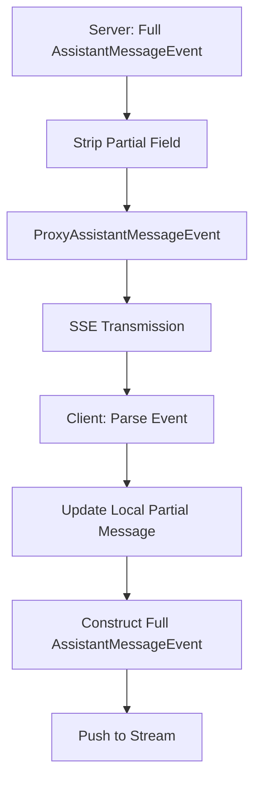
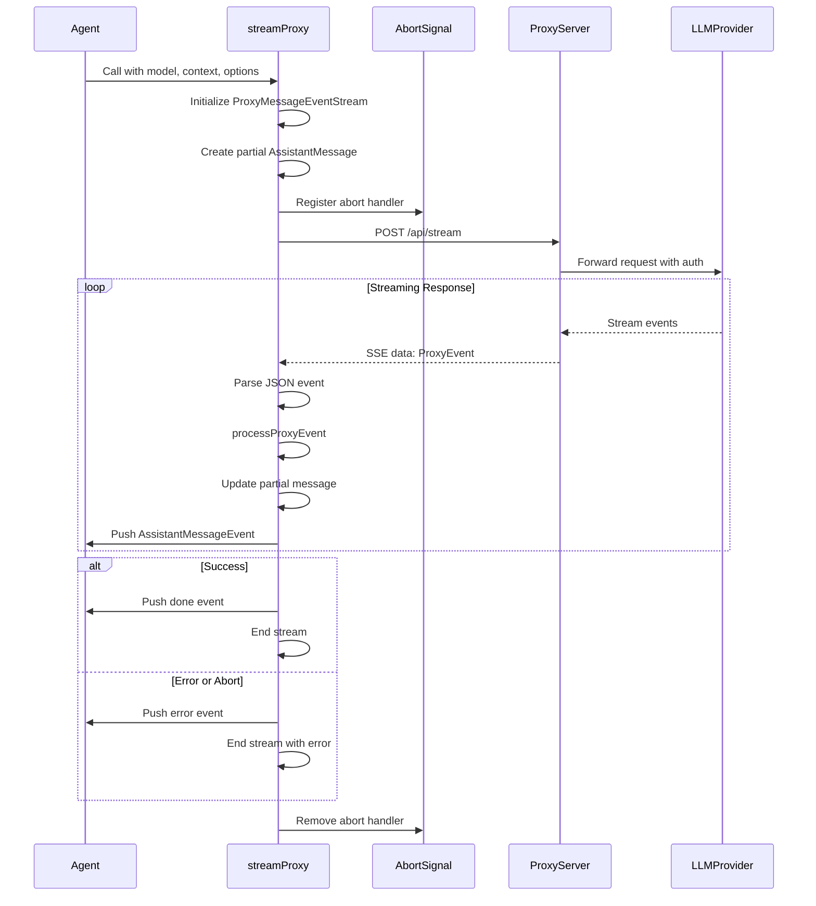
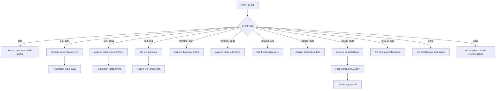
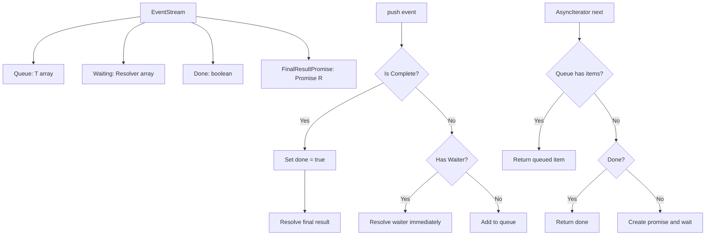

# Proxy Stream for Remote Agent Communication

The Proxy Stream module provides a mechanism for routing LLM (Large Language Model) calls through a remote server instead of making direct API calls to LLM providers. This architecture is particularly useful for applications that need centralized authentication, request logging, rate limiting, or security policies. The server manages provider credentials and proxies requests to LLM providers, while clients receive streaming responses with optimized bandwidth usage through partial message reconstruction.

The proxy stream integrates seamlessly with the Agent Core system by implementing the same `StreamFn` interface used for direct LLM calls, allowing applications to switch between direct and proxied communication modes without changing agent logic. This design enables flexible deployment architectures where sensitive API keys remain server-side while clients maintain real-time streaming capabilities.

Sources: [proxy.ts:1-10](../../../packages/agent/src/proxy.ts#L1-L10), [types.ts:10-20](../../../packages/agent/src/types.ts#L10-L20)

## Architecture Overview

The proxy stream architecture consists of three main components: the client-side proxy stream function, the network protocol for event transmission, and the server-side LLM provider integration. The client reconstructs complete assistant messages from bandwidth-optimized proxy events, while the server handles authentication, provider routing, and request proxying.



The client-side `streamProxy` function accepts the same parameters as direct streaming functions but routes requests through a configured proxy URL. The server strips the `partial` field from delta events to reduce bandwidth consumption, and the client reconstructs the partial message state locally by accumulating deltas.

Sources: [proxy.ts:1-310](../../../packages/agent/src/proxy.ts#L1-L310), [types.ts:10-20](../../../packages/agent/src/types.ts#L10-L20)

## Proxy Event Protocol

The proxy protocol defines a set of event types that represent the lifecycle of an assistant message. These events are transmitted from server to client via Server-Sent Events (SSE) and exclude the `partial` field present in standard `AssistantMessageEvent` types to optimize bandwidth.

### Event Type Definitions

| Event Type | Purpose | Key Fields |
|------------|---------|------------|
| `start` | Signals the beginning of assistant message streaming | None |
| `text_start` | Begins a new text content block | `contentIndex` |
| `text_delta` | Streams incremental text content | `contentIndex`, `delta` |
| `text_end` | Completes a text content block | `contentIndex`, `contentSignature?` |
| `thinking_start` | Begins a reasoning/thinking content block | `contentIndex` |
| `thinking_delta` | Streams incremental thinking content | `contentIndex`, `delta` |
| `thinking_end` | Completes a thinking content block | `contentIndex`, `contentSignature?` |
| `toolcall_start` | Begins a tool call content block | `contentIndex`, `id`, `toolName` |
| `toolcall_delta` | Streams incremental tool call JSON arguments | `contentIndex`, `delta` |
| `toolcall_end` | Completes a tool call content block | `contentIndex` |
| `done` | Successfully completes the assistant message | `reason`, `usage` |
| `error` | Indicates an error or abort condition | `reason`, `errorMessage?`, `usage` |

Sources: [proxy.ts:25-49](../../../packages/agent/src/proxy.ts#L25-L49)

### Bandwidth Optimization Strategy

The key optimization in the proxy protocol is the removal of the `partial` field from delta events. Standard `AssistantMessageEvent` types include a complete `partial` message with every delta event, which becomes redundant and bandwidth-intensive for long responses. The proxy protocol sends only the delta information, and the client reconstructs the partial message by accumulating these deltas locally.



Sources: [proxy.ts:1-10](../../../packages/agent/src/proxy.ts#L1-L10), [proxy.ts:25-49](../../../packages/agent/src/proxy.ts#L25-L49)

## Stream Function Implementation

The `streamProxy` function is the main entry point for proxied LLM communication. It implements the `StreamFn` interface, making it a drop-in replacement for direct streaming functions in agent configurations.

### Function Signature and Options

```typescript
export function streamProxy(
  model: Model<any>, 
  context: Context, 
  options: ProxyStreamOptions
): ProxyMessageEventStream
```

The `ProxyStreamOptions` interface extends the serializable streaming options with proxy-specific configuration:

| Option | Type | Required | Description |
|--------|------|----------|-------------|
| `authToken` | `string` | Yes | Bearer token for proxy server authentication |
| `proxyUrl` | `string` | Yes | Base URL of the proxy server (e.g., "https://genai.example.com") |
| `signal` | `AbortSignal` | No | Local abort signal for canceling the proxy request |
| `temperature` | `number` | No | LLM temperature parameter |
| `maxTokens` | `number` | No | Maximum tokens for the response |
| `reasoning` | `boolean` | No | Enable reasoning/thinking mode |
| `cacheRetention` | `string` | No | Cache retention policy |
| `sessionId` | `string` | No | Session identifier for tracking |
| `headers` | `Record<string, string>` | No | Additional HTTP headers |
| `metadata` | `unknown` | No | Custom metadata for the request |
| `transport` | `string` | No | Transport protocol specification |
| `thinkingBudgets` | `object` | No | Token budgets for thinking phases |
| `maxRetryDelayMs` | `number` | No | Maximum retry delay in milliseconds |

Sources: [proxy.ts:51-73](../../../packages/agent/src/proxy.ts#L51-L73)

### Usage Example

The proxy stream is designed to be used as a custom `streamFn` when creating an Agent instance:

```typescript
const agent = new Agent({
  streamFn: (model, context, options) =>
    streamProxy(model, context, {
      ...options,
      authToken: await getAuthToken(),
      proxyUrl: "https://genai.example.com",
    }),
});
```

This configuration allows the agent to route all LLM calls through the proxy server while maintaining the same event-driven streaming interface.

Sources: [proxy.ts:75-89](../../../packages/agent/src/proxy.ts#L75-L89)

## Request Flow and Error Handling

The proxy stream function manages the complete lifecycle of a proxied LLM request, including request construction, streaming response handling, abort signal propagation, and error recovery.

### Request Lifecycle Sequence



Sources: [proxy.ts:95-191](../../../packages/agent/src/proxy.ts#L95-L191)

### Abort Signal Handling

The proxy stream implements comprehensive abort signal handling to ensure requests can be canceled cleanly:

1. An abort handler is registered on the provided `AbortSignal` before the fetch request
2. The handler cancels the ReadableStream reader when triggered
3. The signal is passed to the fetch request for native cancellation
4. Abort checks are performed during streaming to detect late aborts
5. The handler is removed in the finally block to prevent memory leaks

When an abort is detected, the stream emits an error event with `reason: "aborted"` and the partial message accumulated up to that point.

Sources: [proxy.ts:113-122](../../../packages/agent/src/proxy.ts#L113-L122), [proxy.ts:181-189](../../../packages/agent/src/proxy.ts#L181-L189)

### Error Response Handling

The function handles both HTTP-level errors and streaming errors:

```typescript
if (!response.ok) {
  let errorMessage = `Proxy error: ${response.status} ${response.statusText}`;
  try {
    const errorData = (await response.json()) as { error?: string };
    if (errorData.error) {
      errorMessage = `Proxy error: ${errorData.error}`;
    }
  } catch {
    // Couldn't parse error response
  }
  throw new Error(errorMessage);
}
```

Errors thrown during request or streaming are caught and converted to error events with the appropriate stop reason (`"error"` or `"aborted"`), ensuring the stream contract is maintained.

Sources: [proxy.ts:131-142](../../../packages/agent/src/proxy.ts#L131-L142), [proxy.ts:171-181](../../../packages/agent/src/proxy.ts#L171-L181)

## Event Processing and Message Reconstruction

The `processProxyEvent` function is responsible for converting bandwidth-optimized proxy events into full `AssistantMessageEvent` objects by maintaining and updating a local partial message state.

### Partial Message State Management

The partial message is initialized at the start of streaming with default values:

```typescript
const partial: AssistantMessage = {
  role: "assistant",
  stopReason: "stop",
  content: [],
  api: model.api,
  provider: model.provider,
  model: model.id,
  usage: {
    input: 0,
    output: 0,
    cacheRead: 0,
    cacheWrite: 0,
    totalTokens: 0,
    cost: { input: 0, output: 0, cacheRead: 0, cacheWrite: 0, total: 0 },
  },
  timestamp: Date.now(),
};
```

This partial message is mutated by `processProxyEvent` as delta events arrive, building up the complete message incrementally.

Sources: [proxy.ts:98-112](../../../packages/agent/src/proxy.ts#L98-L112)

### Event Processing Logic

The `processProxyEvent` function uses a switch statement to handle each proxy event type. The function mutates the partial message and returns the corresponding full `AssistantMessageEvent` with the updated partial:



Sources: [proxy.ts:193-310](../../../packages/agent/src/proxy.ts#L193-L310)

### Tool Call JSON Streaming

Tool call argument streaming requires special handling because the arguments are transmitted as incremental JSON fragments. The proxy maintains a `partialJson` field (not part of the standard `ToolCall` type) to accumulate the JSON string, then uses `parseStreamingJson` to extract valid objects from potentially incomplete JSON:

```typescript
case "toolcall_delta": {
  const content = partial.content[proxyEvent.contentIndex];
  if (content?.type === "toolCall") {
    (content as any).partialJson += proxyEvent.delta;
    content.arguments = parseStreamingJson((content as any).partialJson) || {};
    partial.content[proxyEvent.contentIndex] = { ...content }; // Trigger reactivity
    return {
      type: "toolcall_delta",
      contentIndex: proxyEvent.contentIndex,
      delta: proxyEvent.delta,
      partial,
    };
  }
  throw new Error("Received toolcall_delta for non-toolCall content");
}
```

The `parseStreamingJson` utility handles incomplete JSON gracefully, returning an empty object if parsing fails, which allows the UI to display partial tool arguments as they stream in.

Sources: [proxy.ts:265-281](../../../packages/agent/src/proxy.ts#L265-L281), [json-parse.ts:60-78](../../../packages/ai/src/utils/json-parse.ts#L60-L78)

## ProxyMessageEventStream Class

The `ProxyMessageEventStream` extends the generic `EventStream` class to provide typed streaming for assistant message events. This class maintains the same interface as `AssistantMessageEventStream` used in direct LLM calls.

### Class Structure

```typescript
class ProxyMessageEventStream extends EventStream<AssistantMessageEvent, AssistantMessage> {
  constructor() {
    super(
      (event) => event.type === "done" || event.type === "error",
      (event) => {
        if (event.type === "done") return event.message;
        if (event.type === "error") return event.error;
        throw new Error("Unexpected event type");
      },
    );
  }
}
```

The constructor configures the base `EventStream` with:
- A completion predicate that returns true for `done` or `error` events
- A result extractor that returns the final `AssistantMessage` from the terminal event

Sources: [proxy.ts:13-23](../../../packages/agent/src/proxy.ts#L13-L23)

### EventStream Base Class

The `EventStream` class provides the async iteration infrastructure and result promise management:



This design enables both async iteration over events and awaiting the final result via the `result()` method.

Sources: [event-stream.ts:4-57](../../../packages/ai/src/utils/event-stream.ts#L4-L57)

## Integration with Agent Core

The proxy stream integrates with the Agent Core system through the `StreamFn` type, which defines the contract for all streaming functions used by agents.

### StreamFn Contract

```typescript
export type StreamFn = (
  ...args: Parameters<typeof streamSimple>
) => ReturnType<typeof streamSimple> | Promise<ReturnType<typeof streamSimple>>;
```

The contract specifies that stream functions:
- Must not throw or return rejected promises for request/model/runtime failures
- Must return an `AssistantMessageEventStream` (or compatible stream)
- Must encode failures in the returned stream via protocol events
- Must produce a final `AssistantMessage` with `stopReason: "error"` or `"aborted"` and an `errorMessage` for failures

The `streamProxy` function adheres to this contract by catching all errors and converting them to error events, ensuring the agent loop receives a well-formed stream regardless of network or server failures.

Sources: [types.ts:10-20](../../../packages/agent/src/types.ts#L10-L20), [proxy.ts:171-189](../../../packages/agent/src/proxy.ts#L171-L189)

### Module Exports

The proxy functionality is exported from the agent package's main entry point alongside other core components:

```typescript
// Proxy utilities
export * from "./proxy.js";
```

This makes `streamProxy` and `ProxyAssistantMessageEvent` available to applications that import from `@mariozechner/pi-agent`.

Sources: [index.ts:7-8](../../../packages/agent/src/index.ts#L7-L8)

## JSON Parsing Utilities

The proxy stream relies on specialized JSON parsing utilities to handle streaming tool call arguments, which may arrive as incomplete JSON fragments during delta events.

### Streaming JSON Parser

The `parseStreamingJson` function attempts multiple parsing strategies to extract valid objects from potentially malformed or incomplete JSON:

1. Try standard `JSON.parse` with repair for control characters and invalid escapes
2. Fall back to `partial-json` library for incomplete JSON
3. Try `partial-json` with repair if the first attempt fails
4. Return empty object if all parsing attempts fail

```typescript
export function parseStreamingJson<T = Record<string, unknown>>(partialJson: string | undefined): T {
  if (!partialJson || partialJson.trim() === "") {
    return {} as T;
  }

  try {
    return parseJsonWithRepair<T>(partialJson);
  } catch {
    try {
      const result = partialParse(partialJson);
      return (result ?? {}) as T;
    } catch {
      try {
        const result = partialParse(repairJson(partialJson));
        return (result ?? {}) as T;
      } catch {
        return {} as T;
      }
    }
  }
}
```

This defensive parsing strategy ensures the UI can display partial tool arguments without crashing on malformed JSON during streaming.

Sources: [json-parse.ts:60-78](../../../packages/ai/src/utils/json-parse.ts#L60-L78)

### JSON Repair Logic

The `repairJson` function fixes common JSON malformations that can occur during streaming:

- Escapes raw control characters (newlines, tabs, etc.) inside string literals
- Doubles backslashes before invalid escape sequences
- Properly handles Unicode escape sequences (`\uXXXX`)

This repair logic is applied before both standard parsing and partial parsing attempts, maximizing the likelihood of successful JSON extraction from streaming fragments.

Sources: [json-parse.ts:16-57](../../../packages/ai/src/utils/json-parse.ts#L16-L57)

## Summary

The Proxy Stream module provides a production-ready solution for routing LLM calls through a centralized server while maintaining real-time streaming capabilities. By stripping the redundant `partial` field from events and reconstructing it client-side, the protocol achieves significant bandwidth optimization without sacrificing functionality. The implementation adheres to the `StreamFn` contract, making it a seamless drop-in replacement for direct LLM streaming in agent configurations. Comprehensive error handling, abort signal support, and defensive JSON parsing ensure robust operation across network conditions and server failures.

Sources: [proxy.ts:1-310](../../../packages/agent/src/proxy.ts#L1-L310), [types.ts:10-20](../../../packages/agent/src/types.ts#L10-L20), [event-stream.ts:4-57](../../../packages/ai/src/utils/event-stream.ts#L4-L57), [json-parse.ts:1-78](../../../packages/ai/src/utils/json-parse.ts#L1-L78), [index.ts:1-12](../../../packages/agent/src/index.ts#L1-L12)