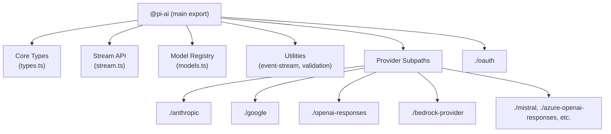
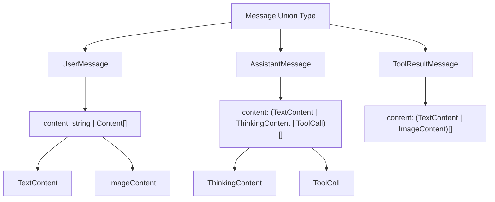
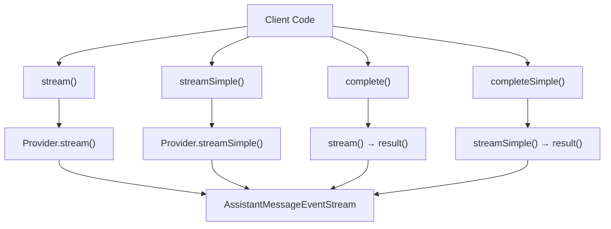
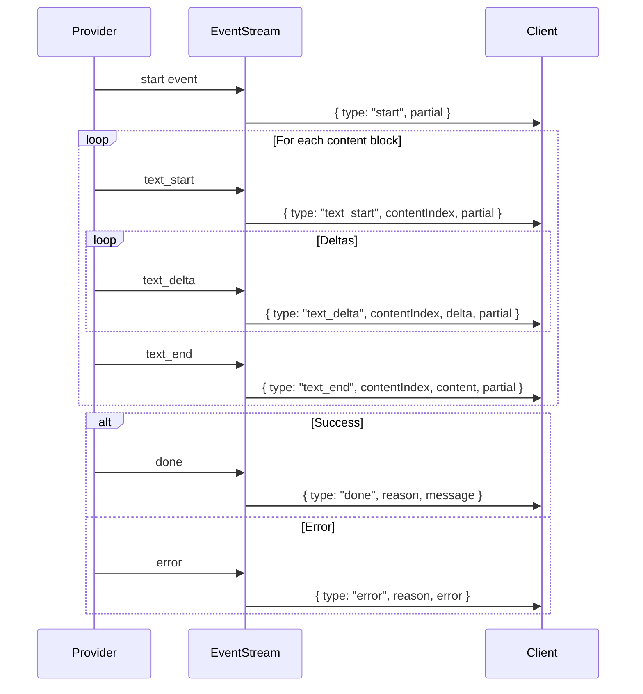

# AI Package Overview & Type System

## Introduction

The `@pi-ai` package (`@mariozechner/pi-ai`) provides a unified abstraction layer for interacting with multiple Large Language Model (LLM) providers through a consistent API. This package enables the pi-mono AI coding agent to seamlessly work with providers like OpenAI, Anthropic, Google, AWS Bedrock, Mistral, and many others without requiring provider-specific code in higher-level application logic. The package features automatic model discovery, provider configuration, streaming support, structured tool calling, and comprehensive type safety through TypeScript.

At its core, the package defines a rich type system that represents messages, contexts, models, and streaming events in a provider-agnostic manner. It exposes high-level functions (`stream`, `complete`, `streamSimple`, `completeSimple`) that accept a model, context, and options, then delegate to registered provider implementations while maintaining a consistent interface and event protocol.

Sources: [packages/ai/package.json](../../../packages/ai/package.json), [packages/ai/src/index.ts](../../../packages/ai/src/index.ts), [packages/ai/src/stream.ts:1-50](../../../packages/ai/src/stream.ts#L1-L50)

## Package Structure and Exports

The `@pi-ai` package is structured as an ES module with multiple entry points for core functionality and provider-specific implementations. The main export (`"."`) provides the unified API and type system, while subpath exports like `"./anthropic"`, `"./google"`, `"./openai-responses"`, etc., expose provider-specific options and implementations.



The package also includes a CLI tool (`pi-ai` binary) and uses a code generation script (`generate-models.ts`) to produce the `models.generated.ts` file containing all registered models across providers.

Sources: [packages/ai/package.json:9-60](../../../packages/ai/package.json#L9-L60), [packages/ai/src/index.ts:1-37](../../../packages/ai/src/index.ts#L1-L37)

## Core Type System

### API and Provider Types

The type system distinguishes between **API protocols** and **providers**. An API represents a specific protocol or endpoint style (e.g., `"openai-completions"`, `"anthropic-messages"`, `"google-vertex"`), while a provider represents a service or organization (e.g., `"openai"`, `"anthropic"`, `"google"`).

| Type | Known Values | Description |
|------|--------------|-------------|
| `KnownApi` | `"openai-completions"`, `"openai-responses"`, `"anthropic-messages"`, `"bedrock-converse-stream"`, `"google-generative-ai"`, `"mistral-conversations"`, etc. | Standard API protocols supported by the package |
| `Api` | `KnownApi \| (string & {})` | Extensible union allowing custom API types |
| `KnownProvider` | `"openai"`, `"anthropic"`, `"google"`, `"amazon-bedrock"`, `"xai"`, `"groq"`, `"mistral"`, `"openrouter"`, etc. | Standard provider identifiers |
| `Provider` | `KnownProvider \| string` | Extensible union allowing custom providers |

Sources: [packages/ai/src/types.ts:4-35](../../../packages/ai/src/types.ts#L4-L35)

### Message Types

The package defines a unified message format that abstracts over provider-specific message structures. All messages include a `role` and `timestamp` (Unix milliseconds).



#### UserMessage

Represents user input, supporting both plain text and structured content with images:

```typescript
interface UserMessage {
  role: "user";
  content: string | (TextContent | ImageContent)[];
  timestamp: number;
}
```

Sources: [packages/ai/src/types.ts:107-112](../../../packages/ai/src/types.ts#L107-L112)

#### AssistantMessage

Represents model responses with rich content types including text, reasoning/thinking blocks, and tool calls:

```typescript
interface AssistantMessage {
  role: "assistant";
  content: (TextContent | ThinkingContent | ToolCall)[];
  api: Api;
  provider: Provider;
  model: string;
  responseId?: string;
  usage: Usage;
  stopReason: StopReason;
  errorMessage?: string;
  timestamp: number;
}
```

The `stopReason` field indicates why generation stopped: `"stop"` (natural completion), `"length"` (max tokens), `"toolUse"` (tool call), `"error"`, or `"aborted"`.

Sources: [packages/ai/src/types.ts:114-126](../../../packages/ai/src/types.ts#L114-L126)

#### ToolResultMessage

Represents the result of a tool execution, supporting both text and image content:

```typescript
interface ToolResultMessage<TDetails = any> {
  role: "toolResult";
  toolCallId: string;
  toolName: string;
  content: (TextContent | ImageContent)[];
  details?: TDetails;
  isError: boolean;
  timestamp: number;
}
```

Sources: [packages/ai/src/types.ts:128-136](../../../packages/ai/src/types.ts#L128-L136)

### Content Types

The package defines several content block types that can appear in messages:

| Content Type | Fields | Description |
|--------------|--------|-------------|
| `TextContent` | `type: "text"`, `text: string`, `textSignature?: string` | Plain text content, optionally with provider-specific signature metadata |
| `ThinkingContent` | `type: "thinking"`, `thinking: string`, `thinkingSignature?: string`, `redacted?: boolean` | Model reasoning/thinking blocks (e.g., from o1 models or Claude with extended thinking) |
| `ImageContent` | `type: "image"`, `data: string`, `mimeType: string` | Base64-encoded image with MIME type |
| `ToolCall` | `type: "toolCall"`, `id: string`, `name: string`, `arguments: Record<string, any>`, `thoughtSignature?: string` | Structured tool invocation request |

The `textSignature` and `thinkingSignature` fields store provider-specific metadata (e.g., OpenAI message IDs, Google thought signatures) that enable multi-turn continuity and caching.

Sources: [packages/ai/src/types.ts:60-88](../../../packages/ai/src/types.ts#L60-L88)

### Model Interface

The `Model<TApi>` interface represents a specific model from a provider, parameterized by its API type:

```typescript
interface Model<TApi extends Api> {
  id: string;                    // Model identifier (e.g., "gpt-4o", "claude-3-5-sonnet-20241022")
  name: string;                  // Human-readable name
  api: TApi;                     // API protocol
  provider: Provider;            // Provider identifier
  baseUrl: string;               // API endpoint base URL
  reasoning: boolean;            // Whether model supports native reasoning
  input: ("text" | "image")[];   // Supported input modalities
  cost: {                        // Pricing per million tokens (USD)
    input: number;
    output: number;
    cacheRead: number;
    cacheWrite: number;
  };
  contextWindow: number;         // Maximum context length in tokens
  maxTokens: number;             // Maximum output tokens
  headers?: Record<string, string>;
  compat?: /* API-specific compatibility overrides */;
}
```

Models are strongly typed by their API, ensuring type-safe usage throughout the codebase.

Sources: [packages/ai/src/types.ts:316-341](../../../packages/ai/src/types.ts#L316-L341)

### Context and Tools

The `Context` interface represents the full conversation state passed to model APIs:

```typescript
interface Context {
  systemPrompt?: string;
  messages: Message[];
  tools?: Tool[];
}
```

Tools are defined using TypeBox schemas for runtime validation:

```typescript
interface Tool<TParameters extends TSchema = TSchema> {
  name: string;
  description: string;
  parameters: TParameters;
}
```

Sources: [packages/ai/src/types.ts:144-148](../../../packages/ai/src/types.ts#L144-L148), [packages/ai/src/types.ts:138-142](../../../packages/ai/src/types.ts#L138-L142)

## Streaming API

### High-Level Stream Functions

The package provides four primary streaming functions that form the public API:



#### stream() and complete()

The `stream()` function accepts provider-specific options and returns an event stream:

```typescript
export function stream<TApi extends Api>(
  model: Model<TApi>,
  context: Context,
  options?: ProviderStreamOptions,
): AssistantMessageEventStream
```

The `complete()` function is a convenience wrapper that waits for the final message:

```typescript
export async function complete<TApi extends Api>(
  model: Model<TApi>,
  context: Context,
  options?: ProviderStreamOptions,
): Promise<AssistantMessage>
```

Sources: [packages/ai/src/stream.ts:23-32](../../../packages/ai/src/stream.ts#L23-L32)

#### streamSimple() and completeSimple()

The "simple" variants accept unified `SimpleStreamOptions` with a `reasoning` level parameter, abstracting over provider-specific reasoning controls:

```typescript
export function streamSimple<TApi extends Api>(
  model: Model<TApi>,
  context: Context,
  options?: SimpleStreamOptions,
): AssistantMessageEventStream
```

The `reasoning` parameter accepts: `"minimal"`, `"low"`, `"medium"`, `"high"`, or `"xhigh"`, which providers map to their native reasoning controls (e.g., OpenAI's `reasoning_effort`, Anthropic's `thinking` budgets).

Sources: [packages/ai/src/stream.ts:34-48](../../../packages/ai/src/stream.ts#L34-L48), [packages/ai/src/types.ts:36](../../../packages/ai/src/types.ts#L36)

### Stream Options

The `StreamOptions` interface defines common parameters supported across providers:

| Option | Type | Description |
|--------|------|-------------|
| `temperature` | `number` | Sampling temperature |
| `maxTokens` | `number` | Maximum output tokens |
| `signal` | `AbortSignal` | Abort controller signal |
| `apiKey` | `string` | Override API key |
| `transport` | `"sse" \| "websocket" \| "auto"` | Preferred transport mechanism |
| `cacheRetention` | `"none" \| "short" \| "long"` | Prompt cache retention preference |
| `sessionId` | `string` | Session identifier for caching/routing |
| `onPayload` | `(payload, model) => unknown` | Inspect/modify request payload before sending |
| `onResponse` | `(response, model) => void` | Callback after HTTP response received |
| `headers` | `Record<string, string>` | Custom HTTP headers |
| `maxRetryDelayMs` | `number` | Maximum retry delay (default: 60000ms) |
| `metadata` | `Record<string, unknown>` | Provider-specific metadata |

The `SimpleStreamOptions` extends this with reasoning parameters:

| Option | Type | Description |
|--------|------|-------------|
| `reasoning` | `ThinkingLevel` | Unified reasoning level |
| `thinkingBudgets` | `ThinkingBudgets` | Custom token budgets per level (token-based providers) |

Sources: [packages/ai/src/types.ts:46-95](../../../packages/ai/src/types.ts#L46-L95), [packages/ai/src/types.ts:97-102](../../../packages/ai/src/types.ts#L97-L102)

### Event Stream Protocol

The `AssistantMessageEventStream` emits typed events representing incremental updates during generation:



Event types include:

- **Start events**: `start`, `text_start`, `thinking_start`, `toolcall_start`
- **Delta events**: `text_delta`, `thinking_delta`, `toolcall_delta`
- **End events**: `text_end`, `thinking_end`, `toolcall_end`
- **Terminal events**: `done` (success) or `error` (failure)

Each event carries a `partial` AssistantMessage representing the current state, and `contentIndex` identifies which content block is being updated.

Sources: [packages/ai/src/types.ts:162-176](../../../packages/ai/src/types.ts#L162-L176)

## Model Registry

The model registry provides functions for discovering and retrieving models at runtime. Models are defined in `models.generated.ts` and loaded into a `Map<string, Map<string, Model<Api>>>` structure indexed by provider and model ID.

### Registry Functions

```typescript
// Get a specific model with full type safety
function getModel<TProvider extends KnownProvider, TModelId extends keyof MODELS[TProvider]>(
  provider: TProvider,
  modelId: TModelId,
): Model<ModelApi<TProvider, TModelId>>

// List all registered providers
function getProviders(): KnownProvider[]

// Get all models for a provider
function getModels<TProvider extends KnownProvider>(
  provider: TProvider
): Model<ModelApi<TProvider, keyof MODELS[TProvider]>>[]
```

The type system ensures that model IDs are validated against the provider's available models at compile time.

Sources: [packages/ai/src/models.ts:5-34](../../../packages/ai/src/models.ts#L5-L34)

### Utility Functions

The registry also provides utility functions for working with models:

#### calculateCost()

Computes the cost of a completion given usage statistics:

```typescript
function calculateCost<TApi extends Api>(model: Model<TApi>, usage: Usage): Usage["cost"]
```

This multiplies token counts by the model's per-million-token pricing and populates the `usage.cost` object.

Sources: [packages/ai/src/models.ts:36-44](../../../packages/ai/src/models.ts#L36-L44)

#### supportsXhigh()

Checks if a model supports the `"xhigh"` reasoning level (GPT-5.x or Opus 4.6+ models):

```typescript
function supportsXhigh<TApi extends Api>(model: Model<TApi>): boolean
```

Sources: [packages/ai/src/models.ts:46-63](../../../packages/ai/src/models.ts#L46-L63)

#### modelsAreEqual()

Compares two models by ID and provider:

```typescript
function modelsAreEqual<TApi extends Api>(
  a: Model<TApi> | null | undefined,
  b: Model<TApi> | null | undefined,
): boolean
```

Sources: [packages/ai/src/models.ts:65-74](../../../packages/ai/src/models.ts#L65-L74)

## Provider Compatibility System

The package includes a sophisticated compatibility system for handling variations in OpenAI-compatible APIs. The `OpenAICompletionsCompat` interface allows fine-grained control over provider-specific behaviors.

### Compatibility Options

| Option | Type | Description |
|--------|------|-------------|
| `supportsStore` | `boolean` | Whether provider supports the `store` field |
| `supportsDeveloperRole` | `boolean` | Whether provider supports `developer` role (vs `system`) |
| `supportsReasoningEffort` | `boolean` | Whether provider supports `reasoning_effort` |
| `reasoningEffortMap` | `Partial<Record<ThinkingLevel, string>>` | Custom mapping from pi-ai levels to provider values |
| `supportsUsageInStreaming` | `boolean` | Whether provider supports `stream_options: { include_usage: true }` |
| `maxTokensField` | `"max_completion_tokens" \| "max_tokens"` | Which field to use for max tokens |
| `requiresToolResultName` | `boolean` | Whether tool results require the `name` field |
| `requiresAssistantAfterToolResult` | `boolean` | Whether assistant message needed between tool result and user message |
| `requiresThinkingAsText` | `boolean` | Whether thinking blocks must be converted to text with delimiters |
| `thinkingFormat` | `"openai" \| "openrouter" \| "zai" \| "qwen" \| "qwen-chat-template"` | Format for reasoning parameter |
| `openRouterRouting` | `OpenRouterRouting` | OpenRouter-specific routing preferences |
| `vercelGatewayRouting` | `VercelGatewayRouting` | Vercel AI Gateway routing preferences |
| `zaiToolStream` | `boolean` | Whether z.ai supports `tool_stream: true` |
| `supportsStrictMode` | `boolean` | Whether provider supports `strict` field in tool definitions |
| `cacheControlFormat` | `"anthropic"` | Cache control convention (Anthropic-style markers) |
| `sendSessionAffinityHeaders` | `boolean` | Whether to send session affinity headers when caching enabled |

These options are auto-detected from the model's `baseUrl` but can be explicitly overridden in the model definition.

Sources: [packages/ai/src/types.ts:181-218](../../../packages/ai/src/types.ts#L181-L218)

### OpenRouter Routing

For OpenRouter-compatible providers, the `OpenRouterRouting` interface provides extensive control over provider selection and routing:

```typescript
interface OpenRouterRouting {
  allow_fallbacks?: boolean;
  require_parameters?: boolean;
  data_collection?: "deny" | "allow";
  zdr?: boolean;
  enforce_distillable_text?: boolean;
  order?: string[];
  only?: string[];
  ignore?: string[];
  quantizations?: string[];
  sort?: string | { by?: string; partition?: string | null };
  max_price?: { prompt?: number | string; completion?: number | string; /* ... */ };
  preferred_min_throughput?: number | { p50?: number; p75?: number; /* ... */ };
  preferred_max_latency?: number | { p50?: number; p75?: number; /* ... */ };
}
```

This allows clients to specify provider preferences, data collection requirements, pricing constraints, and performance requirements.

Sources: [packages/ai/src/types.ts:227-273](../../../packages/ai/src/types.ts#L227-L273)

### Vercel AI Gateway Routing

For Vercel AI Gateway, simpler routing controls are available:

```typescript
interface VercelGatewayRouting {
  only?: string[];   // Exclusive list of provider slugs
  order?: string[];  // Ordered list of providers to try
}
```

Sources: [packages/ai/src/types.ts:279-287](../../../packages/ai/src/types.ts#L279-L287)

## Usage and Cost Tracking

The `Usage` interface tracks token consumption and computed costs for each completion:

```typescript
interface Usage {
  input: number;          // Input tokens
  output: number;         // Output tokens
  cacheRead: number;      // Cache read tokens
  cacheWrite: number;     // Cache write tokens
  totalTokens: number;    // Sum of all tokens
  cost: {
    input: number;        // Cost in USD
    output: number;
    cacheRead: number;
    cacheWrite: number;
    total: number;
  };
}
```

The `calculateCost()` function populates the `cost` object based on the model's pricing and token usage.

Sources: [packages/ai/src/types.ts:90-104](../../../packages/ai/src/types.ts#L90-L104)

## OAuth Support

The package includes OAuth support for providers that require browser-based authentication flows. The OAuth subsystem is exported via the `"./oauth"` subpath.

```typescript
export type {
  OAuthAuthInfo,
  OAuthCredentials,
  OAuthLoginCallbacks,
  OAuthPrompt,
  OAuthProvider,
  OAuthProviderId,
  OAuthProviderInfo,
  OAuthProviderInterface,
} from "./utils/oauth/types.js";
```

This enables providers like Google and GitHub to implement secure authentication flows with token refresh capabilities.

Sources: [packages/ai/src/index.ts:27-35](../../../packages/ai/src/index.ts#L27-L35), [packages/ai/package.json:42-45](../../../packages/ai/package.json#L42-L45)

## Type Utilities

The package re-exports TypeBox for schema definition and validation:

```typescript
export type { Static, TSchema } from "typebox";
export { Type } from "typebox";
```

It also provides custom TypeBox helpers, JSON parsing utilities, overflow handling, and validation utilities through dedicated modules.

Sources: [packages/ai/src/index.ts:1-2](../../../packages/ai/src/index.ts#L1-L2), [packages/ai/src/index.ts:37](../../../packages/ai/src/index.ts#L37)

## Build and Development

The package uses a TypeScript build process with code generation:

1. **Model Generation**: `npm run generate-models` executes `scripts/generate-models.ts` to produce `models.generated.ts`
2. **Build**: `npm run build` runs generation followed by `tsgo` compilation
3. **Development**: `npm run dev` watches for changes and rebuilds incrementally

The package targets Node.js 20+ and is distributed as an ES module with full TypeScript type definitions.

Sources: [packages/ai/package.json:68-75](../../../packages/ai/package.json#L68-L75), [packages/ai/package.json:88-90](../../../packages/ai/package.json#L88-L90)

## Summary

The `@pi-ai` package provides a comprehensive, type-safe abstraction layer for multi-provider LLM interactions. Its core strengths include:

- **Unified Type System**: Provider-agnostic message, context, and model types with strong TypeScript guarantees
- **Flexible Streaming**: Event-based streaming protocol with incremental updates and error handling
- **Model Registry**: Type-safe model discovery and retrieval with automatic cost calculation
- **Provider Compatibility**: Fine-grained compatibility controls for OpenAI-compatible and custom APIs
- **Extensibility**: Support for custom APIs, providers, and routing strategies through open type unions and compatibility interfaces

This architecture enables the pi-mono project to support a wide range of LLM providers while maintaining a consistent developer experience and type safety throughout the application stack.