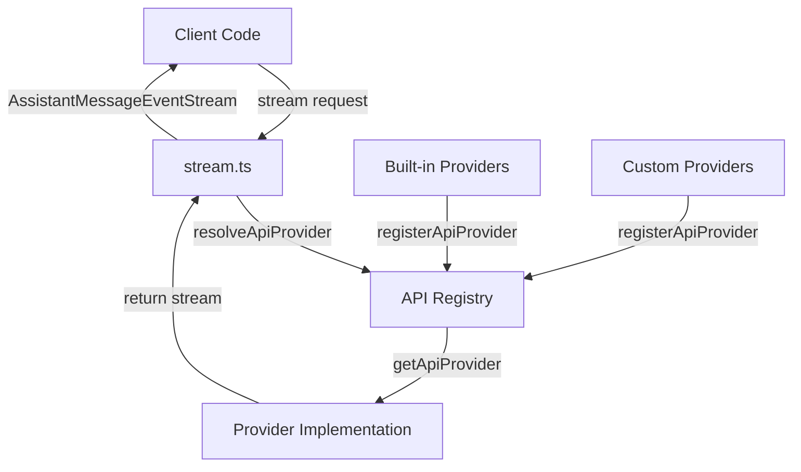
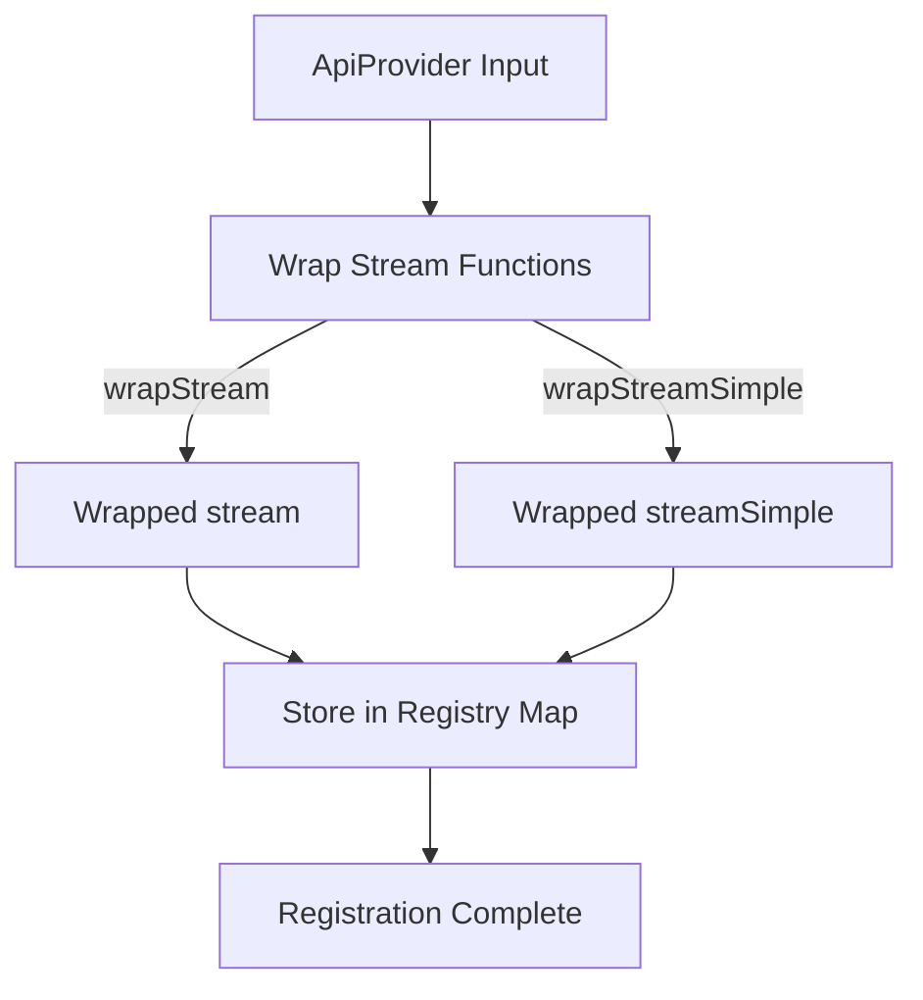
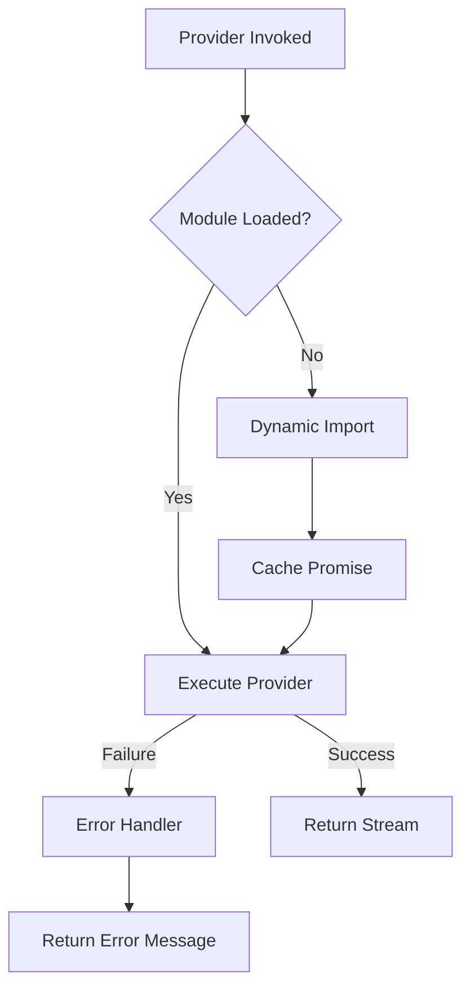
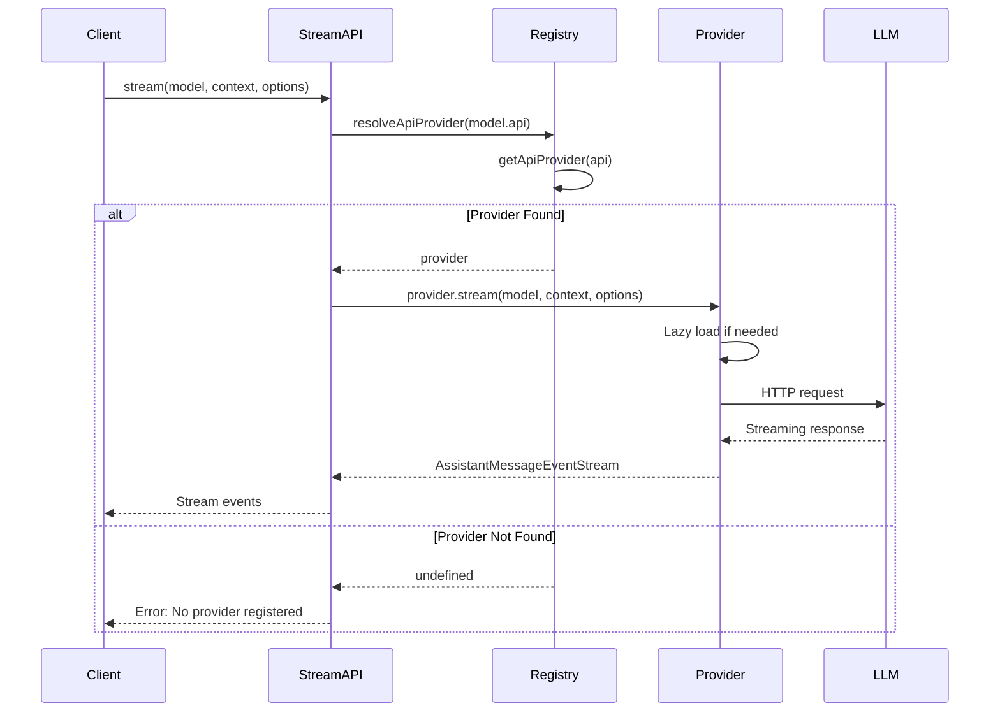

# API Registry & Provider Registration

The API Registry & Provider Registration system serves as the central abstraction layer for managing multiple Large Language Model (LLM) providers within the pi-mono AI coding agent. This system provides a unified interface for registering, retrieving, and managing AI provider implementations, enabling the application to support diverse LLM APIs (OpenAI, Anthropic, Google, AWS Bedrock, etc.) through a consistent streaming interface. The registry implements lazy-loading for provider modules, type-safe provider registration with source tracking, and automatic resolution of provider implementations based on API identifiers.

Sources: [api-registry.ts](../../../packages/ai/src/api-registry.ts), [register-builtins.ts](../../../packages/ai/src/providers/register-builtins.ts)

## Architecture Overview

The API Registry architecture consists of three primary layers: the core registry mechanism, the provider abstraction interface, and the lazy-loading provider registration system. The registry maintains a centralized map of API identifiers to provider implementations, while supporting both built-in and dynamically registered providers with optional source tracking for lifecycle management.



Sources: [api-registry.ts:1-115](../../../packages/ai/src/api-registry.ts#L1-L115), [stream.ts:1-50](../../../packages/ai/src/stream.ts#L1-L50)

## Core Registry Types

The registry defines several key types that establish the contract for provider registration and retrieval:

| Type | Description | Key Properties |
|------|-------------|----------------|
| `ApiProvider<TApi, TOptions>` | Public interface for provider registration | `api`, `stream`, `streamSimple` |
| `ApiProviderInternal` | Internal type-erased provider representation | `api`, `stream`, `streamSimple` |
| `RegisteredApiProvider` | Registry entry with source tracking | `provider`, `sourceId` |
| `ApiStreamFunction` | Type-erased streaming function signature | Returns `AssistantMessageEventStream` |

Sources: [api-registry.ts:13-34](../../../packages/ai/src/api-registry.ts#L13-L34)

### Type Safety Through Wrapping

The registry employs wrapper functions to maintain type safety while supporting a heterogeneous collection of providers. The `wrapStream` and `wrapStreamSimple` functions perform runtime API validation and type casting:

```typescript
function wrapStream<TApi extends Api, TOptions extends StreamOptions>(
	api: TApi,
	stream: StreamFunction<TApi, TOptions>,
): ApiStreamFunction {
	return (model, context, options) => {
		if (model.api !== api) {
			throw new Error(`Mismatched api: ${model.api} expected ${api}`);
		}
		return stream(model as Model<TApi>, context, options as TOptions);
	};
}
```

This approach ensures that providers receive correctly typed models and options while allowing the registry to store all providers in a single map structure.

Sources: [api-registry.ts:38-59](../../../packages/ai/src/api-registry.ts#L38-L59)

## Registry Operations

### Provider Registration

The `registerApiProvider` function adds a provider to the global registry with optional source tracking:



The registration process wraps the provider's streaming functions with type validation and stores them in the `apiProviderRegistry` map keyed by the API identifier. The optional `sourceId` parameter enables bulk unregistration of providers from the same source (e.g., an extension).

Sources: [api-registry.ts:61-73](../../../packages/ai/src/api-registry.ts#L61-L73)

### Provider Retrieval

The registry provides multiple retrieval mechanisms:

| Function | Return Type | Purpose |
|----------|-------------|---------|
| `getApiProvider(api)` | `ApiProviderInternal \| undefined` | Retrieve a single provider by API identifier |
| `getApiProviders()` | `ApiProviderInternal[]` | Retrieve all registered providers |
| `unregisterApiProviders(sourceId)` | `void` | Remove all providers from a specific source |
| `clearApiProviders()` | `void` | Remove all providers from the registry |

Sources: [api-registry.ts:75-89](../../../packages/ai/src/api-registry.ts#L75-L89)

## Built-in Provider Registration

The system includes a comprehensive set of built-in providers that are registered automatically on module initialization. The registration system implements lazy-loading to minimize initial bundle size and defer expensive module imports until providers are actually used.

### Lazy Loading Architecture



The lazy-loading mechanism uses promise caching to ensure each provider module is imported only once, even if multiple concurrent requests are made. The `createLazyStream` and `createLazySimpleStream` functions create wrapper functions that handle the asynchronous loading:

Sources: [register-builtins.ts:128-173](../../../packages/ai/src/providers/register-builtins.ts#L128-L173)

### Built-in Provider List

The following providers are registered by default:

| API Identifier | Provider | Load Function |
|----------------|----------|---------------|
| `anthropic-messages` | Anthropic Claude | `loadAnthropicProviderModule` |
| `openai-completions` | OpenAI Completions API | `loadOpenAICompletionsProviderModule` |
| `openai-responses` | OpenAI Chat Completions | `loadOpenAIResponsesProviderModule` |
| `azure-openai-responses` | Azure OpenAI | `loadAzureOpenAIResponsesProviderModule` |
| `openai-codex-responses` | OpenAI Codex | `loadOpenAICodexResponsesProviderModule` |
| `mistral-conversations` | Mistral AI | `loadMistralProviderModule` |
| `google-generative-ai` | Google Gemini | `loadGoogleProviderModule` |
| `google-gemini-cli` | Google Gemini CLI | `loadGoogleGeminiCliProviderModule` |
| `google-vertex` | Google Vertex AI | `loadGoogleVertexProviderModule` |
| `bedrock-converse-stream` | Amazon Bedrock | `loadBedrockProviderModule` |

Sources: [register-builtins.ts:333-376](../../../packages/ai/src/providers/register-builtins.ts#L333-L376)

### Provider Module Loading

Each provider has a dedicated loader function that performs dynamic imports and normalizes the module interface:

```typescript
function loadAnthropicProviderModule(): Promise<
	LazyProviderModule<"anthropic-messages", AnthropicOptions, SimpleStreamOptions>
> {
	anthropicProviderModulePromise ||= import("./anthropic.js").then((module) => {
		const provider = module as AnthropicProviderModule;
		return {
			stream: provider.streamAnthropic,
			streamSimple: provider.streamSimpleAnthropic,
		};
	});
	return anthropicProviderModulePromise;
}
```

This pattern ensures that the promise is cached in a module-level variable, preventing duplicate imports and maintaining a single source of truth for each provider module.

Sources: [register-builtins.ts:175-187](../../../packages/ai/src/providers/register-builtins.ts#L175-L187)

### Special Case: Bedrock Provider Override

The Bedrock provider supports an override mechanism for testing or alternative implementations:

```typescript
export function setBedrockProviderModule(module: BedrockProviderModule): void {
	bedrockProviderModuleOverride = {
		stream: module.streamBedrock,
		streamSimple: module.streamSimpleBedrock,
	};
}
```

When an override is set, the `loadBedrockProviderModule` function returns it immediately instead of performing a dynamic import, enabling dependency injection for testing scenarios.

Sources: [register-builtins.ts:111-116](../../../packages/ai/src/providers/register-builtins.ts#L111-L116), [register-builtins.ts:309-319](../../../packages/ai/src/providers/register-builtins.ts#L309-L319)

## Stream Invocation Flow

The primary entry point for using registered providers is through the `stream` and `streamSimple` functions in `stream.ts`:



The resolution process validates that a provider exists for the requested API before invoking it. If no provider is registered, an error is thrown immediately:

```typescript
function resolveApiProvider(api: Api) {
	const provider = getApiProvider(api);
	if (!provider) {
		throw new Error(`No API provider registered for api: ${api}`);
	}
	return provider;
}
```

Sources: [stream.ts:12-18](../../../packages/ai/src/stream.ts#L12-L18), [stream.ts:20-26](../../../packages/ai/src/stream.ts#L20-L26)

## Error Handling in Lazy Loading

The lazy-loading system includes comprehensive error handling to gracefully manage module load failures. When a provider module fails to load, the system generates an error event and returns it through the normal streaming interface:

```typescript
function createLazyLoadErrorMessage<TApi extends Api>(model: Model<TApi>, error: unknown): AssistantMessage {
	return {
		role: "assistant",
		content: [],
		api: model.api,
		provider: model.provider,
		model: model.id,
		usage: {
			input: 0,
			output: 0,
			cacheRead: 0,
			cacheWrite: 0,
			totalTokens: 0,
			cost: { input: 0, output: 0, cacheRead: 0, cacheWrite: 0, total: 0 },
		},
		stopReason: "error",
		errorMessage: error instanceof Error ? error.message : String(error),
		timestamp: Date.now(),
	};
}
```

This approach ensures that load failures are treated consistently with runtime errors, providing a uniform error handling experience for client code.

Sources: [register-builtins.ts:118-136](../../../packages/ai/src/providers/register-builtins.ts#L118-L136)

## Environment-Based API Key Resolution

The registry system integrates with environment-based API key resolution through the `getEnvApiKey` function, which provides automatic credential discovery for various providers:

| Provider | Environment Variables (Priority Order) |
|----------|----------------------------------------|
| `anthropic` | `ANTHROPIC_OAUTH_TOKEN`, `ANTHROPIC_API_KEY` |
| `openai` | `OPENAI_API_KEY` |
| `azure-openai-responses` | `AZURE_OPENAI_API_KEY` |
| `google` | `GEMINI_API_KEY` |
| `google-vertex` | `GOOGLE_CLOUD_API_KEY`, ADC credentials |
| `amazon-bedrock` | `AWS_PROFILE`, `AWS_ACCESS_KEY_ID`, `AWS_SECRET_ACCESS_KEY`, etc. |
| `github-copilot` | `COPILOT_GITHUB_TOKEN`, `GH_TOKEN`, `GITHUB_TOKEN` |
| `mistral` | `MISTRAL_API_KEY` |

The function supports multiple authentication mechanisms including OAuth tokens, API keys, and Application Default Credentials (ADC) for cloud providers.

Sources: [env-api-keys.ts:49-123](../../../packages/ai/src/env-api-keys.ts#L49-L123)

### Special Handling: Google Vertex ADC

Google Vertex AI supports Application Default Credentials with lazy detection:

```typescript
function hasVertexAdcCredentials(): boolean {
	if (cachedVertexAdcCredentialsExists === null) {
		if (!_existsSync || !_homedir || !_join) {
			const isNode = typeof process !== "undefined" && (process.versions?.node || process.versions?.bun);
			if (!isNode) {
				cachedVertexAdcCredentialsExists = false;
			}
			return false;
		}

		const gacPath = process.env.GOOGLE_APPLICATION_CREDENTIALS;
		if (gacPath) {
			cachedVertexAdcCredentialsExists = _existsSync(gacPath);
		} else {
			cachedVertexAdcCredentialsExists = _existsSync(
				_join(_homedir(), ".config", "gcloud", "application_default_credentials.json"),
			);
		}
	}
	return cachedVertexAdcCredentialsExists;
}
```

This implementation handles the asynchronous nature of Node.js module imports while avoiding top-level imports that would break browser compatibility.

Sources: [env-api-keys.ts:19-51](../../../packages/ai/src/env-api-keys.ts#L19-L51)

## Simple Stream Options

The registry supports a simplified streaming interface through `SimpleStreamOptions`, which provides a reduced set of configuration options. The `buildBaseOptions` function transforms simple options into full `StreamOptions`:

```typescript
export function buildBaseOptions(model: Model<Api>, options?: SimpleStreamOptions, apiKey?: string): StreamOptions {
	return {
		temperature: options?.temperature,
		maxTokens: options?.maxTokens ?? (model.maxTokens > 0 ? Math.min(model.maxTokens, 32000) : undefined),
		signal: options?.signal,
		apiKey: apiKey || options?.apiKey,
		cacheRetention: options?.cacheRetention,
		sessionId: options?.sessionId,
		headers: options?.headers,
		onPayload: options?.onPayload,
		onResponse: options?.onResponse,
		maxRetryDelayMs: options?.maxRetryDelayMs,
		metadata: options?.metadata,
	};
}
```

This function applies default values, particularly for `maxTokens`, capping it at 32,000 tokens if the model supports higher limits.

Sources: [simple-options.ts:3-18](../../../packages/ai/src/providers/simple-options.ts#L3-L18)

### Reasoning Token Budget Management

For models supporting extended thinking/reasoning capabilities, the system provides token budget management:

```typescript
export function adjustMaxTokensForThinking(
	baseMaxTokens: number,
	modelMaxTokens: number,
	reasoningLevel: ThinkingLevel,
	customBudgets?: ThinkingBudgets,
): { maxTokens: number; thinkingBudget: number } {
	const defaultBudgets: ThinkingBudgets = {
		minimal: 1024,
		low: 2048,
		medium: 8192,
		high: 16384,
	};
	const budgets = { ...defaultBudgets, ...customBudgets };

	const minOutputTokens = 1024;
	const level = clampReasoning(reasoningLevel)!;
	let thinkingBudget = budgets[level]!;
	const maxTokens = Math.min(baseMaxTokens + thinkingBudget, modelMaxTokens);

	if (maxTokens <= thinkingBudget) {
		thinkingBudget = Math.max(0, maxTokens - minOutputTokens);
	}

	return { maxTokens, thinkingBudget };
}
```

This function allocates additional tokens for reasoning while ensuring a minimum number of output tokens remain available.

Sources: [simple-options.ts:24-48](../../../packages/ai/src/providers/simple-options.ts#L24-L48)

## Lifecycle Management

The registry provides lifecycle management functions for dynamic provider registration and cleanup:

### Reset and Initialization

```typescript
export function resetApiProviders(): void {
	clearApiProviders();
	registerBuiltInApiProviders();
}
```

This function clears all registered providers and re-registers the built-in set, useful for testing or reinitializing the system to a known state.

Sources: [register-builtins.ts:378-381](../../../packages/ai/src/providers/register-builtins.ts#L378-L381)

### Source-Based Unregistration

The `unregisterApiProviders` function enables removal of all providers registered with a specific `sourceId`:

```typescript
export function unregisterApiProviders(sourceId: string): void {
	for (const [api, entry] of apiProviderRegistry.entries()) {
		if (entry.sourceId === sourceId) {
			apiProviderRegistry.delete(api);
		}
	}
}
```

This mechanism is essential for extension systems where providers may be dynamically loaded and unloaded based on extension lifecycle events.

Sources: [api-registry.ts:81-87](../../../packages/ai/src/api-registry.ts#L81-L87)

## Summary

The API Registry & Provider Registration system provides a robust, extensible foundation for multi-provider LLM support in the pi-mono project. Through lazy-loading, type-safe registration, and comprehensive lifecycle management, the system enables seamless integration of diverse AI providers while maintaining performance, type safety, and developer ergonomics. The architecture supports both built-in providers and dynamic extension-based providers, with automatic credential discovery and consistent error handling across all provider implementations.

Sources: [api-registry.ts](../../../packages/ai/src/api-registry.ts), [register-builtins.ts](../../../packages/ai/src/providers/register-builtins.ts), [stream.ts](../../../packages/ai/src/stream.ts), [env-api-keys.ts](../../../packages/ai/src/env-api-keys.ts), [simple-options.ts](../../../packages/ai/src/providers/simple-options.ts)