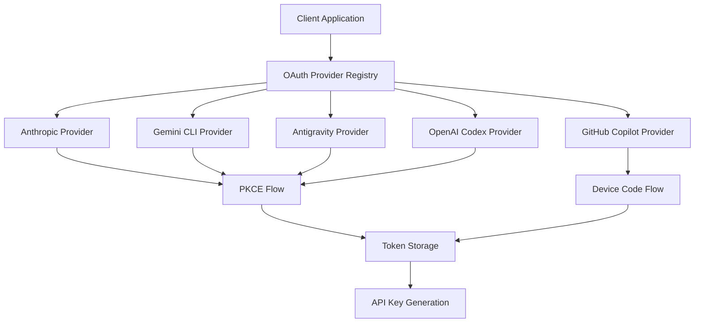
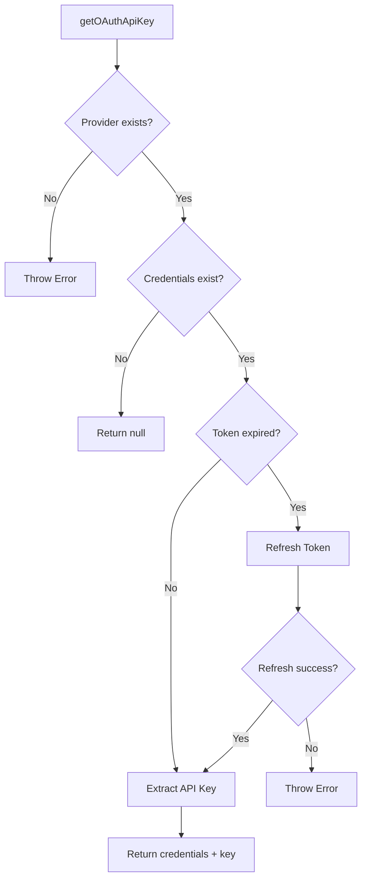
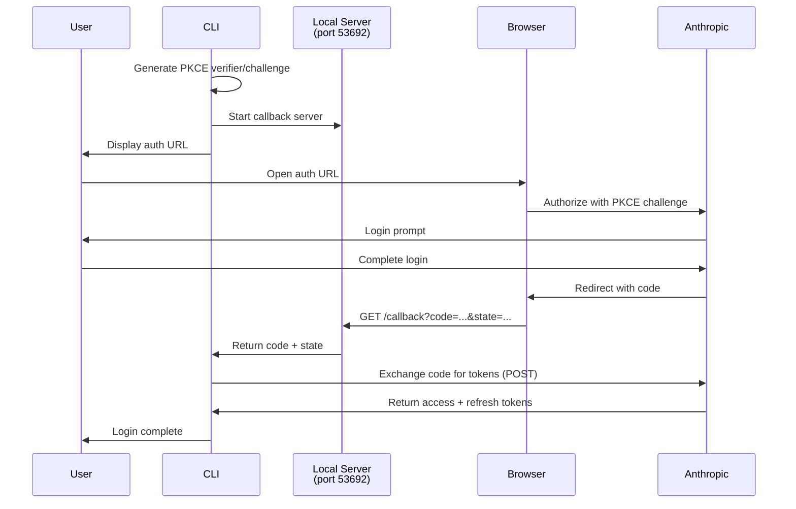
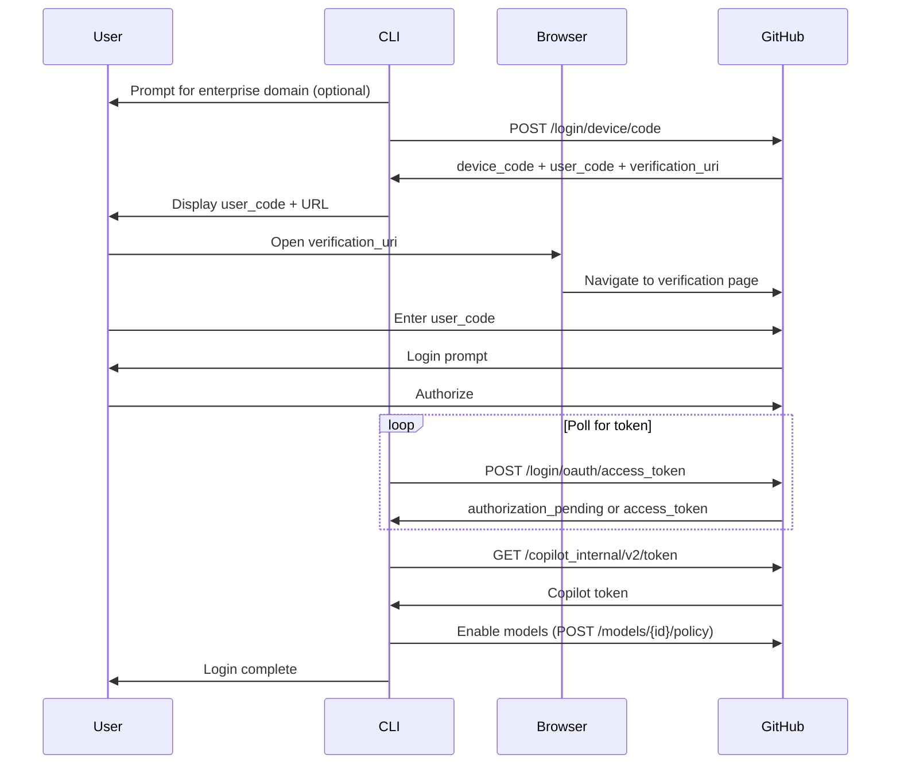
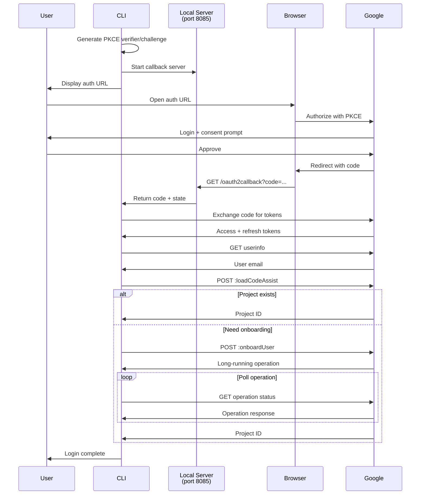
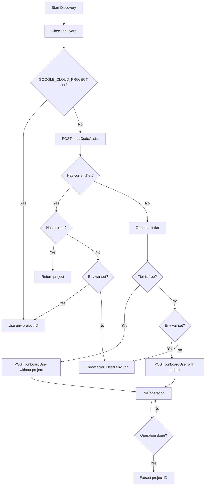
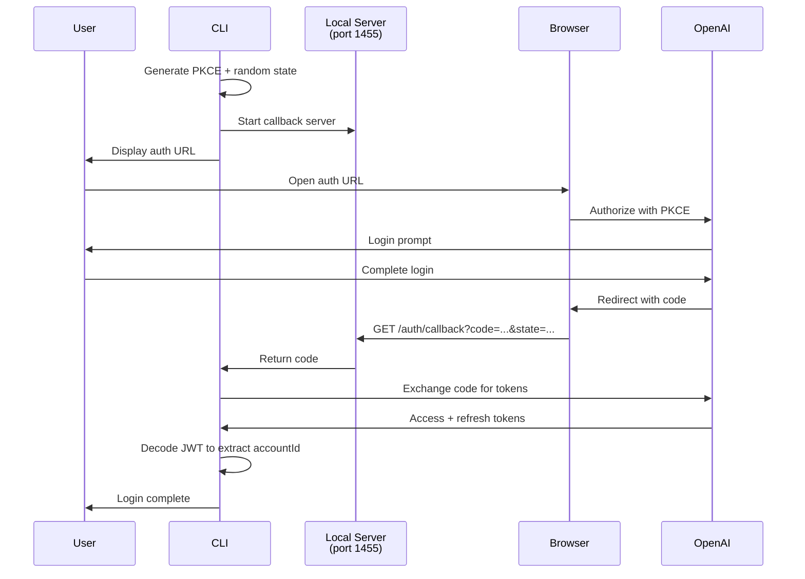
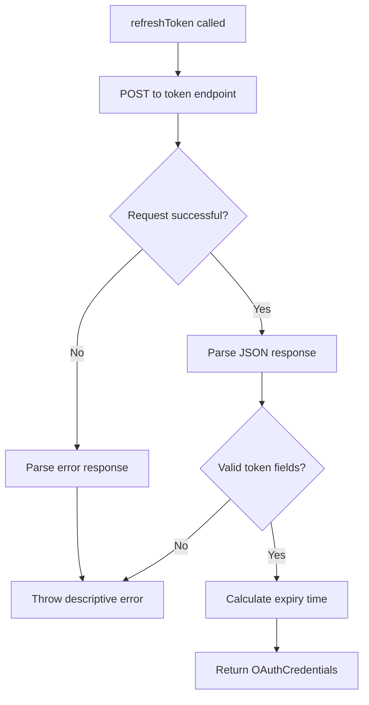

# OAuth Authentication Flows

The OAuth Authentication Flows module provides a unified abstraction layer for authenticating with multiple AI providers that require OAuth 2.0 flows. This system handles login, token refresh, credential storage, and API key generation for providers including Anthropic (Claude Pro/Max), GitHub Copilot, Google Cloud Code Assist (Gemini CLI), Google Antigravity, and OpenAI Codex (ChatGPT OAuth). The module implements provider-specific OAuth flows while exposing a consistent interface through the `OAuthProviderInterface`, enabling seamless integration with the broader pi-mono AI provider system.

Sources: [packages/ai/src/utils/oauth/index.ts:1-11](../../../packages/ai/src/utils/oauth/index.ts#L1-L11), [packages/ai/src/utils/oauth/types.ts:30-47](../../../packages/ai/src/utils/oauth/types.ts#L30-L47)

## Architecture Overview

The OAuth system is built around a provider registry pattern with pluggable implementations. Each provider implements the `OAuthProviderInterface` contract, which defines methods for login, token refresh, API key extraction, and optional model modification.



The registry maintains a map of provider IDs to implementations, allowing dynamic registration and unregistration of custom providers while preserving built-in implementations.

Sources: [packages/ai/src/utils/oauth/index.ts:29-46](../../../packages/ai/src/utils/oauth/index.ts#L29-L46), [packages/ai/src/utils/oauth/index.ts:48-85](../../../packages/ai/src/utils/oauth/index.ts#L48-L85)

## Core Data Types

### OAuthCredentials

The `OAuthCredentials` type represents the token data stored after successful authentication:

| Field | Type | Description |
|-------|------|-------------|
| `refresh` | `string` | Refresh token for obtaining new access tokens |
| `access` | `string` | Current access token for API requests |
| `expires` | `number` | Unix timestamp (milliseconds) when access token expires |
| Additional fields | `unknown` | Provider-specific metadata (e.g., `projectId`, `accountId`, `enterpriseUrl`) |

Sources: [packages/ai/src/utils/oauth/types.ts:3-8](../../../packages/ai/src/utils/oauth/types.ts#L3-L8)

### OAuthProviderInterface

Each OAuth provider must implement this interface:

```typescript
interface OAuthProviderInterface {
  readonly id: OAuthProviderId;
  readonly name: string;
  login(callbacks: OAuthLoginCallbacks): Promise<OAuthCredentials>;
  usesCallbackServer?: boolean;
  refreshToken(credentials: OAuthCredentials): Promise<OAuthCredentials>;
  getApiKey(credentials: OAuthCredentials): string;
  modifyModels?(models: Model<Api>[], credentials: OAuthCredentials): Model<Api>[];
}
```

Sources: [packages/ai/src/utils/oauth/types.ts:30-47](../../../packages/ai/src/utils/oauth/types.ts#L30-L47)

### OAuthLoginCallbacks

Login flows use callbacks to interact with the user interface:

| Callback | Purpose |
|----------|---------|
| `onAuth` | Provide authorization URL and instructions to user |
| `onPrompt` | Request text input from user (e.g., manual code entry) |
| `onProgress` | Display progress messages during multi-step flows |
| `onManualCodeInput` | Optional promise for manual code paste (races with callback server) |
| `signal` | Optional AbortSignal for cancellation |

Sources: [packages/ai/src/utils/oauth/types.ts:19-28](../../../packages/ai/src/utils/oauth/types.ts#L19-L28)

## Provider Registry

### Registration and Discovery

The registry provides functions for managing OAuth providers:

```typescript
// Get a provider by ID
function getOAuthProvider(id: OAuthProviderId): OAuthProviderInterface | undefined

// Register a custom provider
function registerOAuthProvider(provider: OAuthProviderInterface): void

// Unregister a provider (restores built-in if applicable)
function unregisterOAuthProvider(id: string): void

// Reset to built-in providers only
function resetOAuthProviders(): void

// Get all registered providers
function getOAuthProviders(): OAuthProviderInterface[]
```

The built-in providers are initialized from a constant array and loaded into the registry on module initialization:

```typescript
const BUILT_IN_OAUTH_PROVIDERS: OAuthProviderInterface[] = [
  anthropicOAuthProvider,
  githubCopilotOAuthProvider,
  geminiCliOAuthProvider,
  antigravityOAuthProvider,
  openaiCodexOAuthProvider,
];
```

Sources: [packages/ai/src/utils/oauth/index.ts:29-46](../../../packages/ai/src/utils/oauth/index.ts#L29-L46), [packages/ai/src/utils/oauth/index.ts:48-85](../../../packages/ai/src/utils/oauth/index.ts#L48-L85)

### Token Management

The high-level `getOAuthApiKey` function handles automatic token refresh:



The function checks token expiration and automatically refreshes if needed, returning both the updated credentials and the extracted API key.

Sources: [packages/ai/src/utils/oauth/index.ts:115-141](../../../packages/ai/src/utils/oauth/index.ts#L115-L141)

## PKCE Implementation

Proof Key for Code Exchange (PKCE) is implemented using the Web Crypto API for cross-platform compatibility:

```typescript
async function generatePKCE(): Promise<{ verifier: string; challenge: string }> {
  // Generate random verifier
  const verifierBytes = new Uint8Array(32);
  crypto.getRandomValues(verifierBytes);
  const verifier = base64urlEncode(verifierBytes);

  // Compute SHA-256 challenge
  const encoder = new TextEncoder();
  const data = encoder.encode(verifier);
  const hashBuffer = await crypto.subtle.digest("SHA-256", data);
  const challenge = base64urlEncode(new Uint8Array(hashBuffer));

  return { verifier, challenge };
}
```

The implementation generates a 32-byte random verifier, encodes it as base64url, then computes a SHA-256 hash to create the challenge. This works in both Node.js 20+ and browser environments.

Sources: [packages/ai/src/utils/oauth/pkce.ts:1-32](../../../packages/ai/src/utils/oauth/pkce.ts#L1-L32)

## Provider Implementations

### Anthropic OAuth Flow

Anthropic uses the Authorization Code flow with PKCE, running a local callback server on port 53692:



The flow supports manual code input as a fallback if the callback server fails or the browser is on a different machine. The state parameter is set to the PKCE verifier for additional validation.

Sources: [packages/ai/src/utils/oauth/anthropic.ts:1-11](../../../packages/ai/src/utils/oauth/anthropic.ts#L1-L11), [packages/ai/src/utils/oauth/anthropic.ts:33-45](../../../packages/ai/src/utils/oauth/anthropic.ts#L33-L45), [packages/ai/src/utils/oauth/anthropic.ts:144-248](../../../packages/ai/src/utils/oauth/anthropic.ts#L144-L248)

**Configuration:**

| Parameter | Value |
|-----------|-------|
| Client ID | `9d1c250a-e61b-44d9-88ed-5944d1962f5e` (base64 encoded) |
| Authorize URL | `https://claude.ai/oauth/authorize` |
| Token URL | `https://platform.claude.com/v1/oauth/token` |
| Redirect URI | `http://localhost:53692/callback` |
| Scopes | `org:create_api_key user:profile user:inference user:sessions:claude_code user:mcp_servers user:file_upload` |

Sources: [packages/ai/src/utils/oauth/anthropic.ts:25-32](../../../packages/ai/src/utils/oauth/anthropic.ts#L25-L32)

### GitHub Copilot OAuth Flow

GitHub Copilot uses the Device Code flow, which doesn't require a callback server:



After obtaining the GitHub access token, the flow exchanges it for a Copilot-specific token and automatically enables all known models by posting policy acceptance.

Sources: [packages/ai/src/utils/oauth/github-copilot.ts:1-6](../../../packages/ai/src/utils/oauth/github-copilot.ts#L1-L6), [packages/ai/src/utils/oauth/github-copilot.ts:116-173](../../../packages/ai/src/utils/oauth/github-copilot.ts#L116-L173), [packages/ai/src/utils/oauth/github-copilot.ts:212-253](../../../packages/ai/src/utils/oauth/github-copilot.ts#L212-L253)

**Device Flow Polling:**

The implementation uses adaptive polling intervals with two multipliers:
- Initial: 1.2x the server-provided interval
- After `slow_down` response: 1.4x with increased base interval

This prevents excessive polling while handling rate limiting gracefully. The flow also includes special error handling for clock drift issues common in WSL/VM environments.

Sources: [packages/ai/src/utils/oauth/github-copilot.ts:17-19](../../../packages/ai/src/utils/oauth/github-copilot.ts#L17-L19), [packages/ai/src/utils/oauth/github-copilot.ts:125-172](../../../packages/ai/src/utils/oauth/github-copilot.ts#L125-L172)

**Base URL Extraction:**

GitHub Copilot tokens contain a `proxy-ep` field that indicates the API endpoint:

```typescript
function getBaseUrlFromToken(token: string): string | null {
  const match = token.match(/proxy-ep=([^;]+)/);
  if (!match) return null;
  const proxyHost = match[1];
  // Convert proxy.xxx to api.xxx
  const apiHost = proxyHost.replace(/^proxy\./, "api.");
  return `https://${apiHost}`;
}
```

This allows the provider to dynamically set the correct base URL for individual vs. enterprise accounts.

Sources: [packages/ai/src/utils/oauth/github-copilot.ts:50-60](../../../packages/ai/src/utils/oauth/github-copilot.ts#L50-L60), [packages/ai/src/utils/oauth/github-copilot.ts:62-69](../../../packages/ai/src/utils/oauth/github-copilot.ts#L62-L69)

### Google Gemini CLI OAuth Flow

The Gemini CLI flow uses Authorization Code with PKCE and includes automatic project provisioning:



The project discovery phase handles multiple scenarios including free tier provisioning, workspace accounts requiring environment variables, and VPC-SC affected users.

Sources: [packages/ai/src/utils/oauth/google-gemini-cli.ts:1-9](../../../packages/ai/src/utils/oauth/google-gemini-cli.ts#L1-L9), [packages/ai/src/utils/oauth/google-gemini-cli.ts:267-416](../../../packages/ai/src/utils/oauth/google-gemini-cli.ts#L267-L416)

**Project Discovery Logic:**



The discovery process attempts to load an existing project first, falling back to onboarding if needed. Free tier users get automatic provisioning, while workspace users must provide a project ID via environment variables.

Sources: [packages/ai/src/utils/oauth/google-gemini-cli.ts:152-265](../../../packages/ai/src/utils/oauth/google-gemini-cli.ts#L152-L265)

### OpenAI Codex OAuth Flow

OpenAI Codex (ChatGPT OAuth) uses Authorization Code with PKCE on port 1455:



The flow extracts the ChatGPT account ID from the access token JWT by parsing the `https://api.openai.com/auth` claim path.

Sources: [packages/ai/src/utils/oauth/openai-codex.ts:1-8](../../../packages/ai/src/utils/oauth/openai-codex.ts#L1-L8), [packages/ai/src/utils/oauth/openai-codex.ts:356-455](../../../packages/ai/src/utils/oauth/openai-codex.ts#L356-L455)

**JWT Account Extraction:**

```typescript
function decodeJwt(token: string): JwtPayload | null {
  try {
    const parts = token.split(".");
    if (parts.length !== 3) return null;
    const payload = parts[1] ?? "";
    const decoded = atob(payload);
    return JSON.parse(decoded) as JwtPayload;
  } catch {
    return null;
  }
}

function getAccountId(accessToken: string): string | null {
  const payload = decodeJwt(accessToken);
  const auth = payload?.[JWT_CLAIM_PATH];
  const accountId = auth?.chatgpt_account_id;
  return typeof accountId === "string" && accountId.length > 0 ? accountId : null;
}
```

Sources: [packages/ai/src/utils/oauth/openai-codex.ts:77-91](../../../packages/ai/src/utils/oauth/openai-codex.ts#L77-L91), [packages/ai/src/utils/oauth/openai-codex.ts:278-283](../../../packages/ai/src/utils/oauth/openai-codex.ts#L278-L283)

## Callback Server Pattern

Providers that use callback servers (Anthropic, Gemini CLI, OpenAI Codex) follow a consistent pattern:

1. **Start Server:** Create HTTP server on specified port with host from `PI_OAUTH_CALLBACK_HOST` env var (defaults to `127.0.0.1`)
2. **Wait for Code:** Return a promise that resolves when callback receives authorization code
3. **Race Condition:** Support racing between callback server and manual code input
4. **Cleanup:** Always close server in finally block

The server implementations use Node.js `http.createServer` and are explicitly unavailable in browser environments:

```typescript
if (typeof process === "undefined" || (!process.versions?.node && !process.versions?.bun)) {
  throw new Error("OAuth is only available in Node.js environments");
}
```

Sources: [packages/ai/src/utils/oauth/anthropic.ts:50-102](../../../packages/ai/src/utils/oauth/anthropic.ts#L50-L102), [packages/ai/src/utils/oauth/google-gemini-cli.ts:33-89](../../../packages/ai/src/utils/oauth/google-gemini-cli.ts#L33-L89), [packages/ai/src/utils/oauth/openai-codex.ts:195-251](../../../packages/ai/src/utils/oauth/openai-codex.ts#L195-L251)

## Token Refresh

All providers implement token refresh with similar patterns:



Expiry times are calculated as `Date.now() + expires_in * 1000 - 5 * 60 * 1000`, providing a 5-minute buffer before actual expiration to prevent race conditions.

Sources: [packages/ai/src/utils/oauth/anthropic.ts:250-280](../../../packages/ai/src/utils/oauth/anthropic.ts#L250-L280), [packages/ai/src/utils/oauth/github-copilot.ts:175-210](../../../packages/ai/src/utils/oauth/github-copilot.ts#L175-L210), [packages/ai/src/utils/oauth/google-gemini-cli.ts:418-447](../../../packages/ai/src/utils/oauth/google-gemini-cli.ts#L418-L447)

## Error Handling

The OAuth system implements comprehensive error handling:

**Format Error Details:**
```typescript
function formatErrorDetails(error: unknown): string {
  if (error instanceof Error) {
    const details: string[] = [`${error.name}: ${error.message}`];
    const errorWithCode = error as Error & { code?: string; errno?: number | string; cause?: unknown };
    if (errorWithCode.code) details.push(`code=${errorWithCode.code}`);
    if (typeof errorWithCode.errno !== "undefined") details.push(`errno=${String(errorWithCode.errno)}`);
    if (typeof error.cause !== "undefined") {
      details.push(`cause=${formatErrorDetails(error.cause)}`);
    }
    if (error.stack) {
      details.push(`stack=${error.stack}`);
    }
    return details.join("; ");
  }
  return String(error);
}
```

This provides detailed debugging information including error codes, errno values, nested causes, and stack traces.

Sources: [packages/ai/src/utils/oauth/anthropic.ts:104-121](../../../packages/ai/src/utils/oauth/anthropic.ts#L104-L121)

**Abortable Operations:**

Flows support cancellation via AbortSignal:

```typescript
function abortableSleep(ms: number, signal?: AbortSignal): Promise<void> {
  return new Promise((resolve, reject) => {
    if (signal?.aborted) {
      reject(new Error("Login cancelled"));
      return;
    }
    const timeout = setTimeout(resolve, ms);
    signal?.addEventListener('abort', () => {
      clearTimeout(timeout);
      reject(new Error("Login cancelled"));
    }, { once: true });
  });
}
```

Sources: [packages/ai/src/utils/oauth/github-copilot.ts:98-113](../../../packages/ai/src/utils/oauth/github-copilot.ts#L98-L113)

## Summary

The OAuth Authentication Flows module provides a robust, extensible system for authenticating with multiple AI providers. Key features include:

- **Unified Interface:** Consistent `OAuthProviderInterface` across all providers
- **Provider Registry:** Dynamic registration with built-in provider protection
- **Multiple Flow Types:** Support for Authorization Code + PKCE and Device Code flows
- **Automatic Refresh:** Token expiration detection and refresh with 5-minute buffer
- **Flexible UX:** Callback server with manual code input fallback
- **Error Resilience:** Comprehensive error handling with detailed diagnostics
- **Cross-Platform:** Web Crypto API usage for Node.js and browser compatibility
- **Provider-Specific Features:** Model enablement, project provisioning, base URL extraction

The system is designed for CLI environments but maintains clean separation of concerns, allowing individual components to be reused or extended for other contexts.

Sources: [packages/ai/src/utils/oauth/index.ts](../../../packages/ai/src/utils/oauth/index.ts), [packages/ai/src/utils/oauth/types.ts](../../../packages/ai/src/utils/oauth/types.ts)