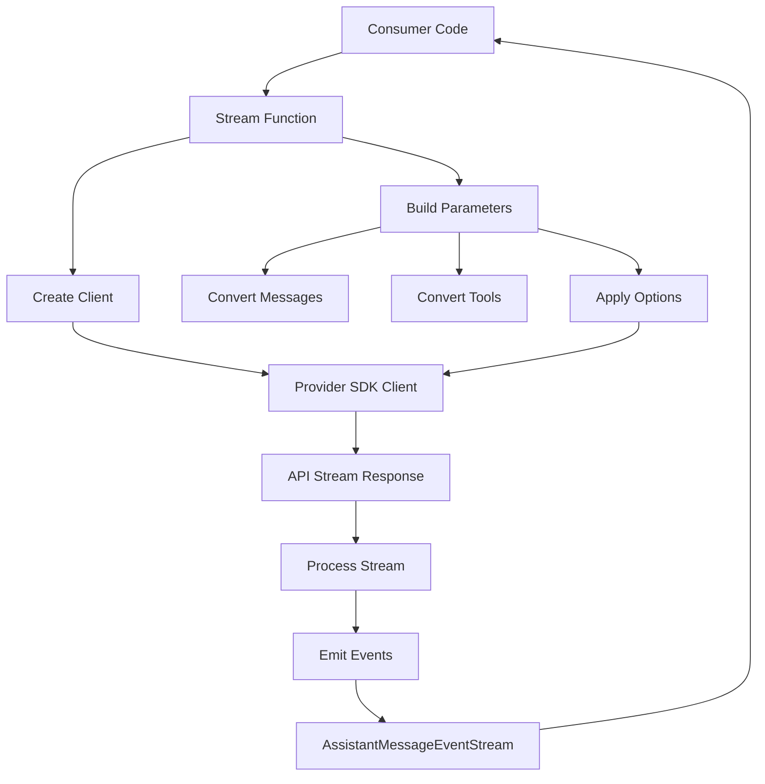
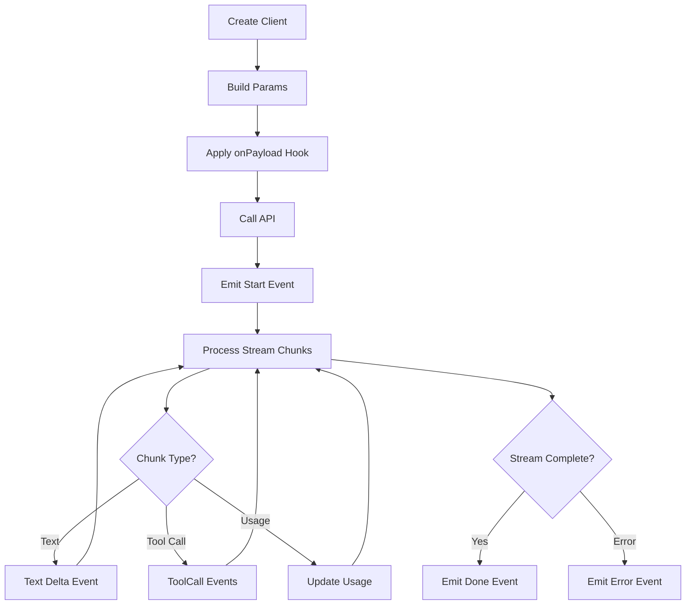
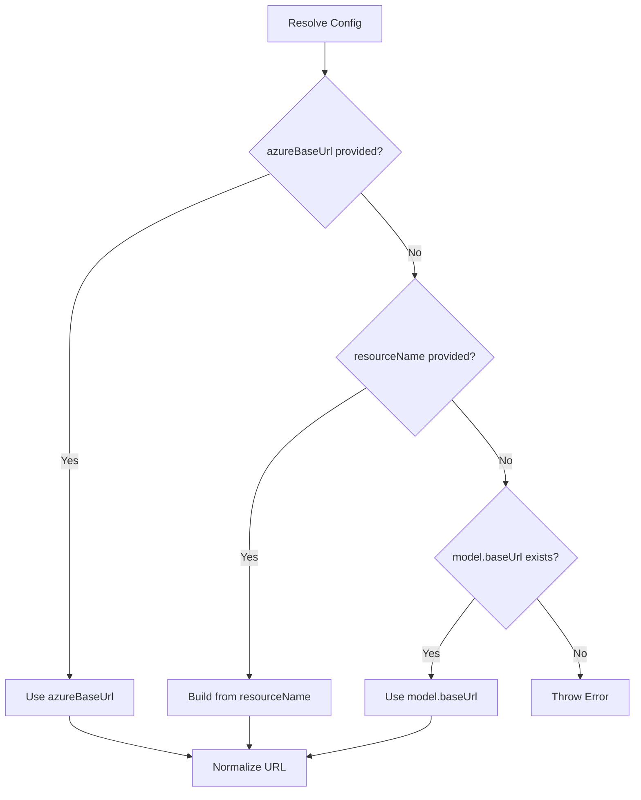
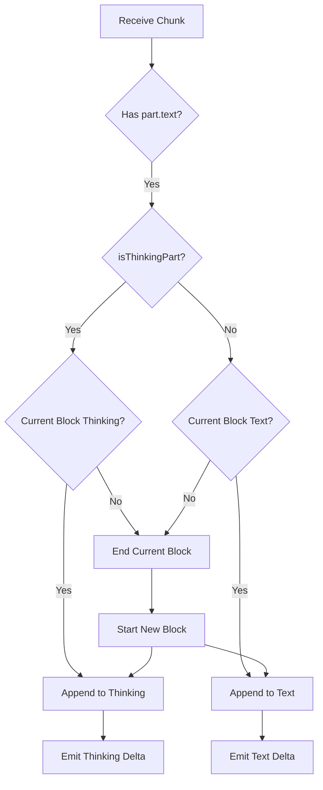
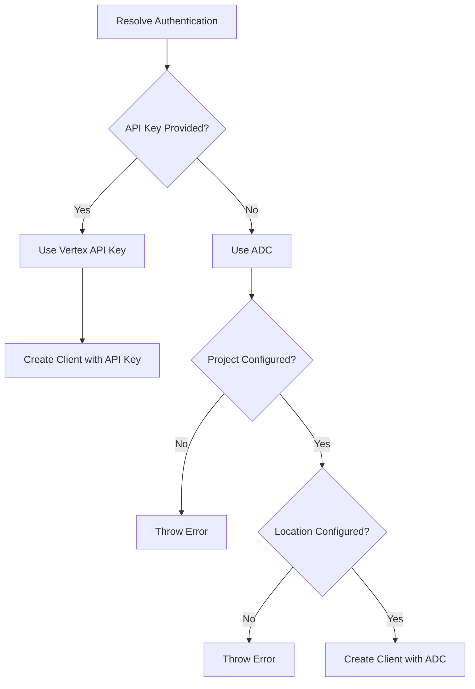

# Provider Implementations

The AI Provider Abstraction Layer in `@pi-ai` implements a unified interface for interacting with multiple LLM providers through specialized provider implementations. Each provider module translates the common `Context` and `StreamOptions` types into provider-specific API calls, handles streaming responses, and normalizes the output into a consistent `AssistantMessage` format. This architecture enables the monorepo to support OpenAI, Anthropic, Google (Gemini/Vertex), Azure OpenAI, Amazon Bedrock, Mistral, and custom providers while presenting a uniform interface to consumers.

Provider implementations follow a consistent pattern: each exports a primary streaming function that accepts a `Model`, `Context`, and provider-specific options, returning an `AssistantMessageEventStream`. The stream emits typed events (`start`, `text_delta`, `thinking_delta`, `toolcall_delta`, `done`, `error`) that consumers can process incrementally. All providers support features like prompt caching, reasoning/thinking modes, tool calling, and cost calculation through this unified event model.

## Provider Architecture



Each provider implementation consists of several key components:

1. **Client Creation**: Initializes the provider's SDK client with authentication, base URLs, and headers
2. **Parameter Building**: Transforms generic `Context` and options into provider-specific request parameters
3. **Message/Tool Conversion**: Maps platform-agnostic message and tool formats to provider schemas
4. **Stream Processing**: Consumes the provider's streaming response and emits normalized events
5. **Usage Tracking**: Calculates token usage and costs based on provider-specific metrics

Sources: [packages/ai/src/providers/openai-responses.ts:1-250](../../../packages/ai/src/providers/openai-responses.ts#L1-L250), [packages/ai/src/providers/google.ts:1-150](../../../packages/ai/src/providers/google.ts#L1-L150)

## OpenAI Responses Provider

The OpenAI Responses provider (`openai-responses.ts`) implements support for OpenAI's Responses API, which provides structured streaming with reasoning capabilities. This provider serves as the foundation for several derivative implementations including GitHub Copilot and OpenAI Codex.

### Key Features

| Feature | Description | Configuration |
|---------|-------------|---------------|
| Prompt Caching | Session-based caching with configurable retention | `prompt_cache_key`, `prompt_cache_retention` |
| Reasoning Support | Structured thinking with effort levels | `reasoningEffort`, `reasoningSummary` |
| Service Tiers | Cost/priority trade-offs (flex/priority) | `serviceTier` |
| Tool Calling | Function calling with automatic conversion | `tools` parameter |
| Dynamic Headers | GitHub Copilot vision detection | `buildCopilotDynamicHeaders` |

Sources: [packages/ai/src/providers/openai-responses.ts:25-40](../../../packages/ai/src/providers/openai-responses.ts#L25-L40)

### Cache Retention Strategy

The provider implements a sophisticated caching strategy that balances performance and cost:

```typescript
function resolveCacheRetention(cacheRetention?: CacheRetention): CacheRetention {
	if (cacheRetention) {
		return cacheRetention;
	}
	if (typeof process !== "undefined" && process.env.PI_CACHE_RETENTION === "long") {
		return "long";
	}
	return "short";
}
```

Cache retention affects the `prompt_cache_retention` parameter sent to OpenAI:
- **"short"**: Default, no explicit retention (ephemeral caching)
- **"long"**: Sets `prompt_cache_retention: "24h"` for extended caching
- **"none"**: Disables caching entirely, omits `prompt_cache_key`

Sources: [packages/ai/src/providers/openai-responses.ts:19-28](../../../packages/ai/src/providers/openai-responses.ts#L19-L28), [packages/ai/src/providers/openai-responses.ts:35-43](../../../packages/ai/src/providers/openai-responses.ts#L35-L43)

### Service Tier Pricing

OpenAI offers service tiers that affect both cost and availability. The provider applies cost multipliers based on the selected tier:

| Service Tier | Cost Multiplier | Use Case |
|--------------|----------------|----------|
| `flex` | 0.5x | Lower cost, variable availability |
| Default | 1.0x | Standard pricing and availability |
| `priority` | 2.0x | Higher cost, guaranteed capacity |

```typescript
function getServiceTierCostMultiplier(serviceTier: ResponseCreateParamsStreaming["service_tier"] | undefined): number {
	switch (serviceTier) {
		case "flex":
			return 0.5;
		case "priority":
			return 2;
		default:
			return 1;
	}
}
```

Sources: [packages/ai/src/providers/openai-responses.ts:227-237](../../../packages/ai/src/providers/openai-responses.ts#L227-L237), [packages/ai/src/providers/openai-responses.ts:239-248](../../../packages/ai/src/providers/openai-responses.ts#L239-L248)

### Stream Processing Flow



The provider uses `processResponsesStream` (shared utility) to handle streaming chunks and emit appropriate events. Each chunk updates the partial `AssistantMessage` and triggers delta events that consumers can process incrementally.

Sources: [packages/ai/src/providers/openai-responses.ts:71-103](../../../packages/ai/src/providers/openai-responses.ts#L71-L103)

## Azure OpenAI Responses Provider

The Azure OpenAI Responses provider (`azure-openai-responses.ts`) extends the OpenAI Responses implementation with Azure-specific configuration and deployment management. It handles Azure's unique authentication and endpoint structure while maintaining API compatibility.

### Configuration Resolution

Azure OpenAI requires careful configuration of base URLs and deployment names. The provider implements a hierarchical resolution strategy:



The base URL construction follows Azure's expected format:

```typescript
function buildDefaultBaseUrl(resourceName: string): string {
	return `https://${resourceName}.openai.azure.com/openai/v1`;
}
```

Sources: [packages/ai/src/providers/azure-openai-responses.ts:63-85](../../../packages/ai/src/providers/azure-openai-responses.ts#L63-L85), [packages/ai/src/providers/azure-openai-responses.ts:58-60](../../../packages/ai/src/providers/azure-openai-responses.ts#L58-L60)

### Deployment Name Mapping

Azure uses deployment names instead of model IDs. The provider supports a mapping mechanism via environment variables:

```typescript
function parseDeploymentNameMap(value: string | undefined): Map<string, string> {
	const map = new Map<string, string>();
	if (!value) return map;
	for (const entry of value.split(",")) {
		const trimmed = entry.trim();
		if (!trimmed) continue;
		const [modelId, deploymentName] = trimmed.split("=", 2);
		if (!modelId || !deploymentName) continue;
		map.set(modelId.trim(), deploymentName.trim());
	}
	return map;
}
```

The deployment name resolution follows this priority:
1. Explicit `azureDeploymentName` in options
2. Mapped deployment from `AZURE_OPENAI_DEPLOYMENT_NAME_MAP` environment variable
3. Fallback to `model.id`

Sources: [packages/ai/src/providers/azure-openai-responses.ts:16-28](../../../packages/ai/src/providers/azure-openai-responses.ts#L16-L28), [packages/ai/src/providers/azure-openai-responses.ts:30-37](../../../packages/ai/src/providers/azure-openai-responses.ts#L30-L37)

### Azure-Specific Options

| Option | Type | Description | Default |
|--------|------|-------------|---------|
| `azureApiVersion` | `string` | Azure API version | `"v1"` |
| `azureResourceName` | `string` | Azure resource name for URL construction | From env |
| `azureBaseUrl` | `string` | Complete base URL override | From env |
| `azureDeploymentName` | `string` | Model deployment name | Model ID |

Sources: [packages/ai/src/providers/azure-openai-responses.ts:40-47](../../../packages/ai/src/providers/azure-openai-responses.ts#L40-L47)

## Google Generative AI Provider

The Google provider (`google.ts`) implements support for Google's Gemini models through the `@google/genai` SDK. It provides comprehensive thinking/reasoning capabilities with both token budget and level-based controls.

### Thinking Configuration

Google models support two distinct thinking configuration approaches:

**Token Budget Approach** (Gemini 2.x):
```typescript
const thinkingConfig: ThinkingConfig = {
	includeThoughts: true,
	thinkingBudget: options.thinking.budgetTokens // -1 for dynamic, 0 to disable
};
```

**Level-Based Approach** (Gemini 3.x, Gemma 4):
```typescript
const thinkingConfig: ThinkingConfig = {
	includeThoughts: true,
	thinkingLevel: options.thinking.level // "MINIMAL" | "LOW" | "MEDIUM" | "HIGH"
};
```

Sources: [packages/ai/src/providers/google.ts:253-267](../../../packages/ai/src/providers/google.ts#L253-L267)

### Model-Specific Thinking Budgets

Different Gemini models have different optimal thinking budgets for each effort level:

| Model | Minimal | Low | Medium | High |
|-------|---------|-----|--------|------|
| `gemini-2.5-pro` | 128 | 2048 | 8192 | 32768 |
| `gemini-2.5-flash` | 128 | 2048 | 8192 | 24576 |
| `gemini-2.5-flash-lite` | 512 | 2048 | 8192 | 24576 |

```typescript
function getGoogleBudget(
	model: Model<"google-generative-ai">,
	effort: ClampedThinkingLevel,
	customBudgets?: ThinkingBudgets,
): number {
	if (customBudgets?.[effort] !== undefined) {
		return customBudgets[effort]!;
	}
	// Model-specific budget tables...
}
```

Sources: [packages/ai/src/providers/google.ts:319-355](../../../packages/ai/src/providers/google.ts#L319-L355)

### Stream Processing with Thinking

The Google provider processes both text and thinking content, distinguishing them using metadata:



The provider tracks `thoughtSignature` metadata to preserve thinking provenance throughout the streaming process.

Sources: [packages/ai/src/providers/google.ts:85-148](../../../packages/ai/src/providers/google.ts#L85-L148)

### Tool Call ID Generation

Google's API may not provide unique tool call IDs. The provider ensures uniqueness:

```typescript
let toolCallCounter = 0;

// In stream processing:
const providedId = part.functionCall.id;
const needsNewId = !providedId || output.content.some((b) => b.type === "toolCall" && b.id === providedId);
const toolCallId = needsNewId
	? `${part.functionCall.name}_${Date.now()}_${++toolCallCounter}`
	: providedId;
```

Sources: [packages/ai/src/providers/google.ts:29-30](../../../packages/ai/src/providers/google.ts#L29-L30), [packages/ai/src/providers/google.ts:149-156](../../../packages/ai/src/providers/google.ts#L149-L156)

## Google Vertex AI Provider

The Vertex AI provider (`google-vertex.ts`) implements Google Cloud's Vertex AI platform, which offers the same Gemini models as the Generative AI provider but with enterprise features and authentication options.

### Authentication Strategies

Vertex AI supports two authentication approaches:



**API Key Authentication**:
```typescript
function createClientWithApiKey(
	model: Model<"google-vertex">,
	apiKey: string,
	optionsHeaders?: Record<string, string>,
): GoogleGenAI {
	return new GoogleGenAI({
		vertexai: true,
		apiKey,
		apiVersion: API_VERSION,
		httpOptions: hasHttpOptions ? httpOptions : undefined,
	});
}
```

**Application Default Credentials (ADC)**:
```typescript
function createClient(
	model: Model<"google-vertex">,
	project: string,
	location: string,
	optionsHeaders?: Record<string, string>,
): GoogleGenAI {
	return new GoogleGenAI({
		vertexai: true,
		project,
		location,
		apiVersion: API_VERSION,
		httpOptions: hasHttpOptions ? httpOptions : undefined,
	});
}
```

Sources: [packages/ai/src/providers/google-vertex.ts:195-217](../../../packages/ai/src/providers/google-vertex.ts#L195-L217), [packages/ai/src/providers/google-vertex.ts:219-237](../../../packages/ai/src/providers/google-vertex.ts#L219-L237)

### Configuration Resolution

Vertex AI requires project and location configuration when using ADC:

| Configuration | Environment Variables | Required When |
|---------------|----------------------|---------------|
| Project | `GOOGLE_CLOUD_PROJECT`, `GCLOUD_PROJECT` | Using ADC |
| Location | `GOOGLE_CLOUD_LOCATION` | Using ADC |
| API Key | `GOOGLE_CLOUD_API_KEY` | Using API key auth |

The provider validates that placeholder keys (e.g., `<your-key-here>`) and the special marker `gcp-vertex-credentials` are treated as absent, forcing ADC usage.

Sources: [packages/ai/src/providers/google-vertex.ts:239-247](../../../packages/ai/src/providers/google-vertex.ts#L239-L247), [packages/ai/src/providers/google-vertex.ts:253-262](../../../packages/ai/src/providers/google-vertex.ts#L253-L262), [packages/ai/src/providers/google-vertex.ts:264-275](../../../packages/ai/src/providers/google-vertex.ts#L264-L275)

### Gemini 3 Thinking Level Mapping

Vertex AI uses the same `@google/genai` SDK types but requires explicit mapping to the `ThinkingLevel` enum:

```typescript
const THINKING_LEVEL_MAP: Record<GoogleThinkingLevel, ThinkingLevel> = {
	THINKING_LEVEL_UNSPECIFIED: ThinkingLevel.THINKING_LEVEL_UNSPECIFIED,
	MINIMAL: ThinkingLevel.MINIMAL,
	LOW: ThinkingLevel.LOW,
	MEDIUM: ThinkingLevel.MEDIUM,
	HIGH: ThinkingLevel.HIGH,
};
```

For Gemini 3 models, the provider maps simplified thinking levels:

```typescript
function getGemini3ThinkingLevel(
	effort: ClampedThinkingLevel,
	model: Model<"google-generative-ai">,
): GoogleThinkingLevel {
	if (isGemini3ProModel(model)) {
		switch (effort) {
			case "minimal":
			case "low":
				return "LOW";
			case "medium":
			case "high":
				return "HIGH";
		}
	}
	// Flash and other models support full range...
}
```

Sources: [packages/ai/src/providers/google-vertex.ts:24-30](../../../packages/ai/src/providers/google-vertex.ts#L24-L30), [packages/ai/src/providers/google-vertex.ts:360-378](../../../packages/ai/src/providers/google-vertex.ts#L360-L378)

## Faux Provider (Testing)

The Faux provider (`faux.ts`) is a sophisticated testing utility that simulates LLM responses without making actual API calls. It's designed for unit testing, integration testing, and development scenarios.

### Provider Registration

The Faux provider uses a dynamic registration system:

```typescript
export interface FauxProviderRegistration {
	api: string;
	models: [Model<string>, ...Model<string>[]];
	getModel(): Model<string>;
	getModel(modelId: string): Model<string> | undefined;
	state: { callCount: number };
	setResponses: (responses: FauxResponseStep[]) => void;
	appendResponses: (responses: FauxResponseStep[]) => void;
	getPendingResponseCount: () => number;
	unregister: () => void;
}
```

This allows tests to configure multiple providers with different behaviors and track their usage.

Sources: [packages/ai/src/providers/faux.ts:69-80](../../../packages/ai/src/providers/faux.ts#L69-L80)

### Response Factories

Responses can be static messages or dynamic factories that receive context:

```typescript
export type FauxResponseFactory = (
	context: Context,
	options: StreamOptions | undefined,
	state: { callCount: number },
	model: Model<string>,
) => AssistantMessage | Promise<AssistantMessage>;

export type FauxResponseStep = AssistantMessage | FauxResponseFactory;
```

This enables sophisticated testing scenarios where responses depend on the input context or call count.

Sources: [packages/ai/src/providers/faux.ts:59-67](../../../packages/ai/src/providers/faux.ts#L59-L67)

### Usage Estimation

The Faux provider estimates token usage based on text length and simulates prompt caching:

```typescript
function withUsageEstimate(
	message: AssistantMessage,
	context: Context,
	options: StreamOptions | undefined,
	promptCache: Map<string, string>,
): AssistantMessage {
	const promptText = serializeContext(context);
	const promptTokens = estimateTokens(promptText);
	const outputTokens = estimateTokens(assistantContentToText(message.content));
	let input = promptTokens;
	let cacheRead = 0;
	let cacheWrite = 0;
	const sessionId = options?.sessionId;

	if (sessionId && options?.cacheRetention !== "none") {
		const previousPrompt = promptCache.get(sessionId);
		if (previousPrompt) {
			const cachedChars = commonPrefixLength(previousPrompt, promptText);
			cacheRead = estimateTokens(previousPrompt.slice(0, cachedChars));
			cacheWrite = estimateTokens(promptText.slice(cachedChars));
			input = Math.max(0, promptTokens - cacheRead);
		} else {
			cacheWrite = promptTokens;
		}
		promptCache.set(sessionId, promptText);
	}
	// ...
}
```

The estimation uses a common prefix algorithm to simulate cache hits across sequential requests with the same session ID.

Sources: [packages/ai/src/providers/faux.ts:145-177](../../../packages/ai/src/providers/faux.ts#L145-L177)

### Streaming Simulation

The Faux provider simulates realistic streaming behavior with configurable token rates:

```typescript
function scheduleChunk(chunk: string, tokensPerSecond: number | undefined): Promise<void> {
	if (!tokensPerSecond || tokensPerSecond <= 0) {
		return new Promise((resolve) => queueMicrotask(resolve));
	}
	const delayMs = (estimateTokens(chunk) / tokensPerSecond) * 1000;
	return new Promise((resolve) => setTimeout(resolve, delayMs));
}
```

Text is split into variable-sized chunks to simulate realistic token-by-token streaming:

```typescript
function splitStringByTokenSize(text: string, minTokenSize: number, maxTokenSize: number): string[] {
	const chunks: string[] = [];
	let index = 0;
	while (index < text.length) {
		const tokenSize = minTokenSize + Math.floor(Math.random() * (maxTokenSize - minTokenSize + 1));
		const charSize = Math.max(1, tokenSize * 4);
		chunks.push(text.slice(index, index + charSize));
		index += charSize;
	}
	return chunks.length > 0 ? chunks : [""];
}
```

Sources: [packages/ai/src/providers/faux.ts:207-213](../../../packages/ai/src/providers/faux.ts#L207-L213), [packages/ai/src/providers/faux.ts:179-191](../../../packages/ai/src/providers/faux.ts#L179-L191)

## Simple Stream Interface

All providers implement a simplified streaming interface (`streamSimple*`) that abstracts provider-specific options into a common `SimpleStreamOptions` type:

```typescript
export const streamSimpleOpenAIResponses: StreamFunction<"openai-responses", SimpleStreamOptions> = (
	model: Model<"openai-responses">,
	context: Context,
	options?: SimpleStreamOptions,
): AssistantMessageEventStream => {
	const apiKey = options?.apiKey || getEnvApiKey(model.provider);
	if (!apiKey) {
		throw new Error(`No API key for provider: ${model.provider}`);
	}

	const base = buildBaseOptions(model, options, apiKey);
	const reasoningEffort = supportsXhigh(model) ? options?.reasoning : clampReasoning(options?.reasoning);

	return streamOpenAIResponses(model, context, {
		...base,
		reasoningEffort,
	} satisfies OpenAIResponsesOptions);
};
```

The `buildBaseOptions` utility extracts common options, while `clampReasoning` ensures reasoning levels are compatible with the model's capabilities (e.g., removing "xhigh" for models that don't support it).

Sources: [packages/ai/src/providers/openai-responses.ts:129-143](../../../packages/ai/src/providers/openai-responses.ts#L129-L143), [packages/ai/src/providers/google.ts:197-215](../../../packages/ai/src/providers/google.ts#L197-L215)

## Summary

The provider implementations in `@pi-ai` demonstrate a well-architected abstraction layer that balances uniformity with provider-specific capabilities. Each provider follows consistent patterns for client creation, parameter building, stream processing, and event emission while accommodating unique features like Azure's deployment names, Google's thinking levels, or OpenAI's service tiers. The Faux provider enables comprehensive testing without external dependencies, while the Simple Stream interface provides a high-level API that hides provider complexity. This architecture allows the monorepo to support diverse LLM providers through a single, type-safe interface that consumers can use without understanding provider-specific details.