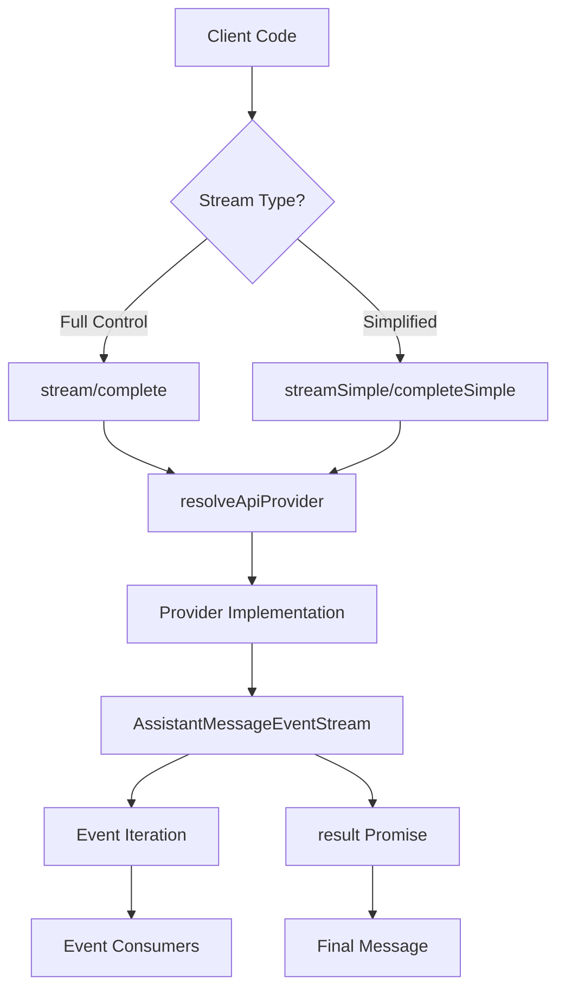
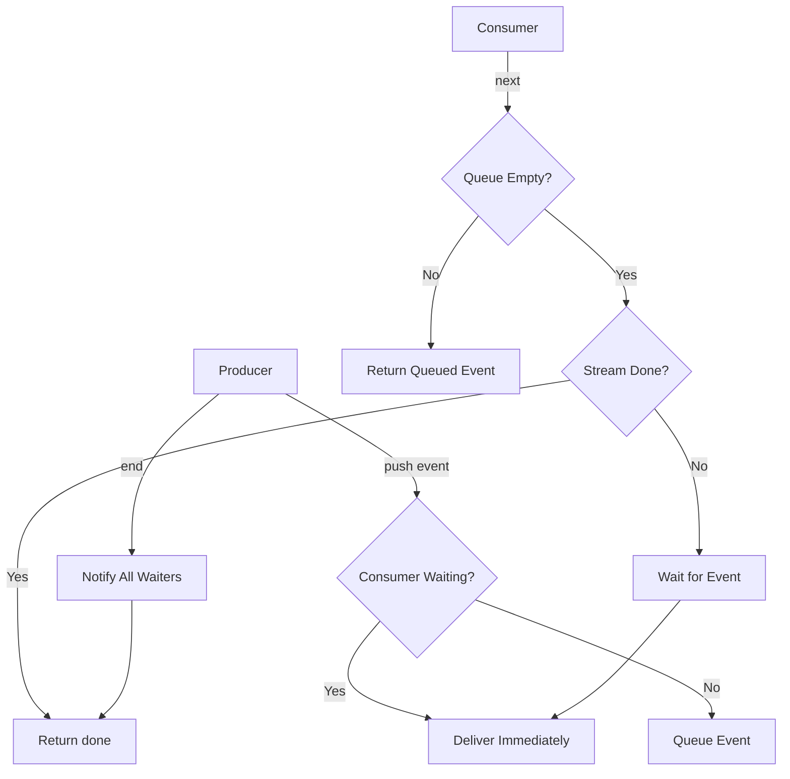
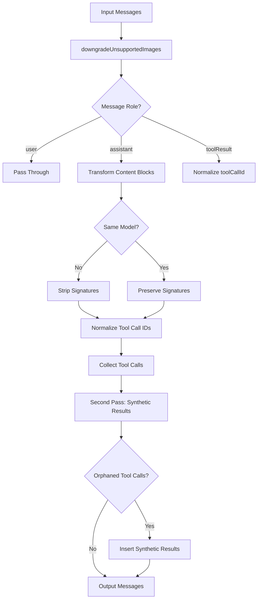
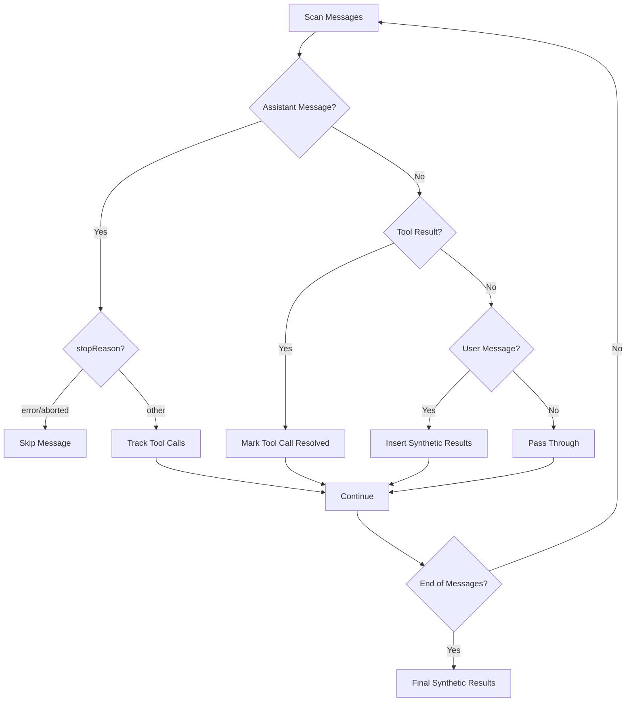
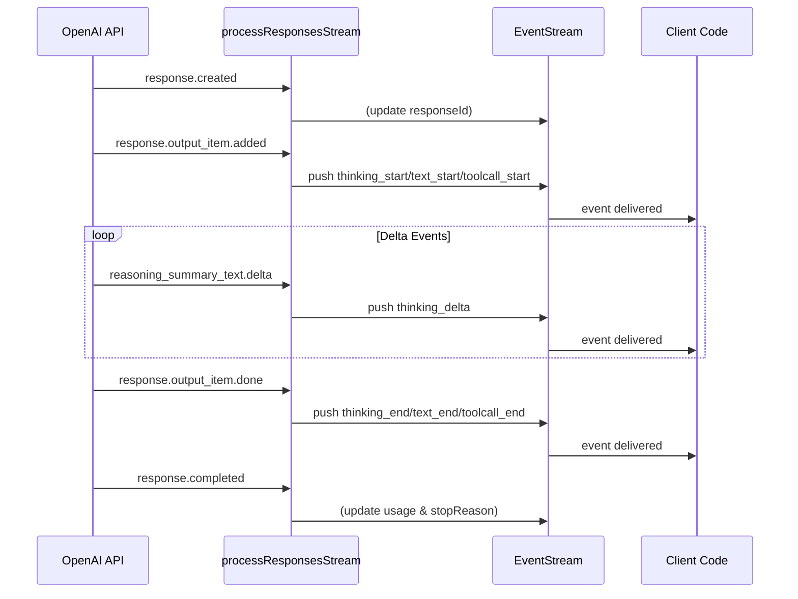

# Streaming, Events & Message Transformation

The Streaming, Events & Message Transformation layer provides the core infrastructure for real-time communication with LLM providers in the `@pi-ai` package. This system handles asynchronous event streams from various AI providers, transforms messages for cross-provider compatibility, and manages the lifecycle of assistant responses including reasoning, text generation, and tool calls. The architecture supports both simple completion-based interactions and advanced streaming scenarios with granular event handling.

Sources: [stream.ts](../../../packages/ai/src/stream.ts), [event-stream.ts](../../../packages/ai/src/utils/event-stream.ts)

## Stream API Overview

The package exposes four primary streaming functions that provide different levels of control over AI interactions:

| Function | Return Type | Description |
|----------|-------------|-------------|
| `stream()` | `AssistantMessageEventStream` | Full provider-specific streaming with all events |
| `complete()` | `Promise<AssistantMessage>` | Awaits stream completion and returns final message |
| `streamSimple()` | `AssistantMessageEventStream` | Simplified streaming interface |
| `completeSimple()` | `Promise<AssistantMessage>` | Simplified completion interface |

All streaming functions accept a generic `Model<TApi>` type parameter, a `Context` containing messages and system prompt, and optional provider-specific options. The functions resolve the appropriate API provider from the registry and delegate to provider-specific implementations.

Sources: [stream.ts:19-52](../../../packages/ai/src/stream.ts#L19-L52)



Sources: [stream.ts:19-52](../../../packages/ai/src/stream.ts#L19-L52)

## Event Stream Architecture

### EventStream Base Class

The `EventStream<T, R>` class implements an async iterable pattern for managing event flows with backpressure handling. It maintains an internal queue for events and a waiting list for consumers, enabling efficient producer-consumer coordination without blocking.

**Key Features:**
- **Async Iteration**: Implements `AsyncIterable<T>` for `for await...of` loops
- **Backpressure Management**: Queues events when no consumer is waiting
- **Result Promise**: Separate promise for final result extraction
- **Completion Detection**: Configurable predicate for identifying terminal events

Sources: [event-stream.ts:4-51](../../../packages/ai/src/utils/event-stream.ts#L4-L51)



Sources: [event-stream.ts:15-48](../../../packages/ai/src/utils/event-stream.ts#L15-L48)

### AssistantMessageEventStream

`AssistantMessageEventStream` extends `EventStream` with specialized handling for assistant message events. It automatically detects completion based on "done" or "error" event types and extracts the final message or error from these terminal events.

```typescript
constructor() {
  super(
    (event) => event.type === "done" || event.type === "error",
    (event) => {
      if (event.type === "done") {
        return event.message;
      } else if (event.type === "error") {
        return event.error;
      }
      throw new Error("Unexpected event type for final result");
    },
  );
}
```

Sources: [event-stream.ts:53-67](../../../packages/ai/src/utils/event-stream.ts#L53-L67)

## Message Transformation Pipeline

### Cross-Provider Compatibility

The `transformMessages()` function normalizes message formats for cross-provider and cross-model compatibility. It performs multiple transformation passes to ensure messages conform to target provider requirements while preserving semantic meaning.

**Transformation Stages:**

1. **Image Downgrade**: Replaces images with placeholder text for non-vision models
2. **Thinking Block Normalization**: Converts or removes thinking blocks based on model compatibility
3. **Tool Call ID Normalization**: Transforms tool call IDs to meet provider-specific constraints
4. **Synthetic Tool Results**: Inserts placeholder results for orphaned tool calls

Sources: [transform-messages.ts:50-181](../../../packages/ai/src/providers/transform-messages.ts#L50-L181)



Sources: [transform-messages.ts:50-181](../../../packages/ai/src/providers/transform-messages.ts#L50-L181)

### Image Handling for Non-Vision Models

When a model doesn't support image inputs, the transformation pipeline replaces image content blocks with descriptive placeholder text. This prevents API errors while maintaining message structure.

| Context | Placeholder Text |
|---------|-----------------|
| User Messages | `(image omitted: model does not support images)` |
| Tool Results | `(tool image omitted: model does not support images)` |

The function deduplicates consecutive placeholders to avoid repetitive text in the transformed output.

Sources: [transform-messages.ts:7-31](../../../packages/ai/src/providers/transform-messages.ts#L7-L31)

### Tool Call ID Normalization

Tool call IDs often need normalization for cross-provider compatibility. For example, OpenAI Responses API generates IDs exceeding 450 characters with special characters like `|`, while Anthropic requires IDs matching `^[a-zA-Z0-9_-]+$` with a 64-character maximum.

The transformation pipeline accepts an optional `normalizeToolCallId` function that:
1. Builds a mapping of original IDs to normalized IDs
2. Applies normalization to assistant message tool calls
3. Updates corresponding `toolResult` messages with normalized IDs

Sources: [transform-messages.ts:38-48](../../../packages/ai/src/providers/transform-messages.ts#L38-L48)

### Handling Incomplete Conversations

The transformation pipeline includes sophisticated logic for handling incomplete conversations:

**Errored/Aborted Messages**: Assistant messages with `stopReason` of "error" or "aborted" are completely removed from the transformed output. These represent incomplete turns that may contain partial content (reasoning without message, incomplete tool calls) and can cause API errors if replayed.

**Orphaned Tool Calls**: When tool calls exist without corresponding results, the pipeline inserts synthetic error results with the message "No result provided". This ensures API requirements are satisfied while preserving thinking signatures for replay scenarios.

Sources: [transform-messages.ts:119-180](../../../packages/ai/src/providers/transform-messages.ts#L119-L180)



Sources: [transform-messages.ts:119-180](../../../packages/ai/src/providers/transform-messages.ts#L119-L180)

## OpenAI Responses API Integration

### Message Conversion

The `convertResponsesMessages()` function transforms the unified message format into OpenAI Responses API format. This involves special handling for reasoning models, tool calls, and multi-modal content.

**Key Conversions:**

- **System Prompts**: Converted to "developer" role for reasoning models, "system" for others
- **User Content**: Text and images mapped to `input_text` and `input_image` types
- **Assistant Content**: Thinking blocks preserved as `ResponseReasoningItem`, text as `ResponseOutputMessage`, tool calls as `function_call`
- **Tool Results**: Mapped to `function_call_output` with support for text and image content

Sources: [openai-responses-shared.ts:78-233](../../../packages/ai/src/providers/openai-responses-shared.ts#L78-L233)

### Tool Call ID Normalization

OpenAI Responses API has specific requirements for tool call IDs:

1. **Format**: `{call_id}|{item_id}` where item_id must start with "fc_"
2. **Length**: Maximum 64 characters per component
3. **Characters**: Only alphanumeric, underscore, and hyphen allowed
4. **Pairing Validation**: OpenAI tracks which `fc_xxx` IDs were paired with `rs_xxx` reasoning items

For cross-model messages, the function omits item IDs to avoid pairing validation errors. For cross-provider messages, it generates deterministic hashes to ensure ID uniqueness.

Sources: [openai-responses-shared.ts:88-115](../../../packages/ai/src/providers/openai-responses-shared.ts#L88-L115)

### Text Signature Protocol

The system uses a versioned signature protocol to track message identity and phases:

```typescript
interface TextSignatureV1 {
  v: 1;
  id: string;
  phase?: "commentary" | "final_answer";
}
```

Signatures are JSON-encoded and stored in the `textSignature` field of text content blocks. This enables:
- **Message Identity Preservation**: Track messages across transformations
- **Phase Tracking**: Distinguish between commentary and final answer phases
- **Replay Support**: Reconstruct original message structure during replay

Sources: [openai-responses-shared.ts:20-45](../../../packages/ai/src/providers/openai-responses-shared.ts#L20-L45)

## Stream Event Processing

### OpenAI Responses Stream Events

The `processResponsesStream()` function processes the OpenAI Responses API event stream and emits normalized events through the `AssistantMessageEventStream`. It maintains state for the current item and content block being processed.

**Event Flow:**



Sources: [openai-responses-shared.ts:258-415](../../../packages/ai/src/providers/openai-responses-shared.ts#L258-L415)

### Event Types

The system emits granular events for each stage of content generation:

| Event Type | Trigger | Payload |
|------------|---------|---------|
| `thinking_start` | Reasoning item added | `contentIndex`, `partial` |
| `thinking_delta` | Reasoning summary text delta | `contentIndex`, `delta`, `partial` |
| `thinking_end` | Reasoning item done | `contentIndex`, `content`, `partial` |
| `text_start` | Message item added | `contentIndex`, `partial` |
| `text_delta` | Output text delta | `contentIndex`, `delta`, `partial` |
| `text_end` | Message item done | `contentIndex`, `content`, `partial` |
| `toolcall_start` | Function call item added | `contentIndex`, `partial` |
| `toolcall_delta` | Function arguments delta | `contentIndex`, `delta`, `partial` |
| `toolcall_end` | Function call done | `contentIndex`, `toolCall`, `partial` |

Each event includes a `partial` field containing the in-progress `AssistantMessage`, enabling real-time UI updates.

Sources: [openai-responses-shared.ts:269-395](../../../packages/ai/src/providers/openai-responses-shared.ts#L269-L395)

### Streaming JSON Parsing

Tool call arguments arrive as incremental JSON fragments during streaming. The system uses `parseStreamingJson()` to parse partial JSON, handling incomplete objects gracefully. When the final arguments arrive via `response.function_call_arguments.done`, the system computes the delta and emits a final `toolcall_delta` event if additional content was received.

Sources: [openai-responses-shared.ts:354-370](../../../packages/ai/src/providers/openai-responses-shared.ts#L354-L370)

### Usage and Cost Tracking

When the stream completes, the processor extracts usage information and calculates costs:

1. **Token Accounting**: Separates cached tokens from input tokens (OpenAI includes cached in input_tokens)
2. **Cost Calculation**: Applies model-specific pricing via `calculateCost()`
3. **Service Tier Pricing**: Optionally applies service tier adjustments for scale tier pricing

The usage object includes separate tracking for input, output, cache read, and cache write tokens with corresponding cost breakdowns.

Sources: [openai-responses-shared.ts:396-411](../../../packages/ai/src/providers/openai-responses-shared.ts#L396-L411)

## Provider-Specific Headers

### GitHub Copilot Integration

The GitHub Copilot provider requires special headers to indicate request context and capabilities:

**X-Initiator Header**: Indicates whether the request is user-initiated or agent-initiated (following assistant/tool messages). The system infers this by checking if the last message in the conversation is from the user.

**Copilot-Vision-Request Header**: Required when sending image content in user or tool result messages. The system scans all messages to detect image content blocks.

**Openai-Intent Header**: Set to "conversation-edits" for all requests to indicate the interaction type.

Sources: [github-copilot-headers.ts:3-39](../../../packages/ai/src/providers/github-copilot-headers.ts#L3-L39)

```typescript
function inferCopilotInitiator(messages: Message[]): "user" | "agent" {
  const last = messages[messages.length - 1];
  return last && last.role !== "user" ? "agent" : "user";
}
```

Sources: [github-copilot-headers.ts:4-7](../../../packages/ai/src/providers/github-copilot-headers.ts#L4-L7)

## Summary

The Streaming, Events & Message Transformation layer provides a robust foundation for real-time AI interactions with comprehensive cross-provider compatibility. The event stream architecture enables efficient backpressure handling and granular progress tracking, while the message transformation pipeline ensures seamless interoperability between different LLM providers and models. Special handling for thinking blocks, tool calls, and multi-modal content preserves semantic meaning across transformations, and provider-specific integrations like OpenAI Responses API and GitHub Copilot demonstrate the system's flexibility in adapting to diverse API requirements.