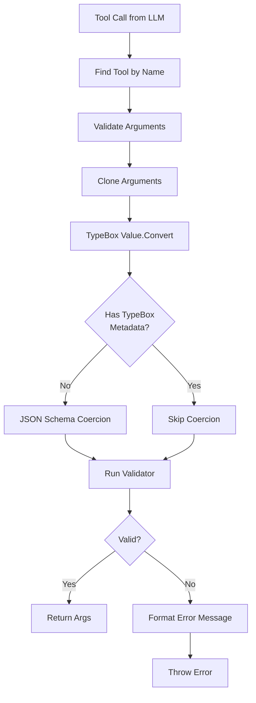
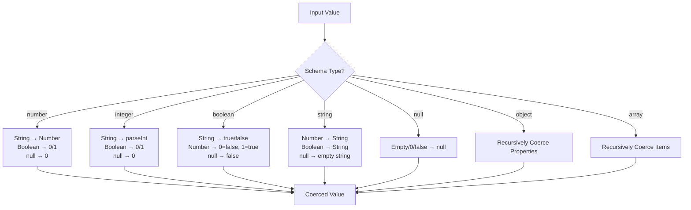
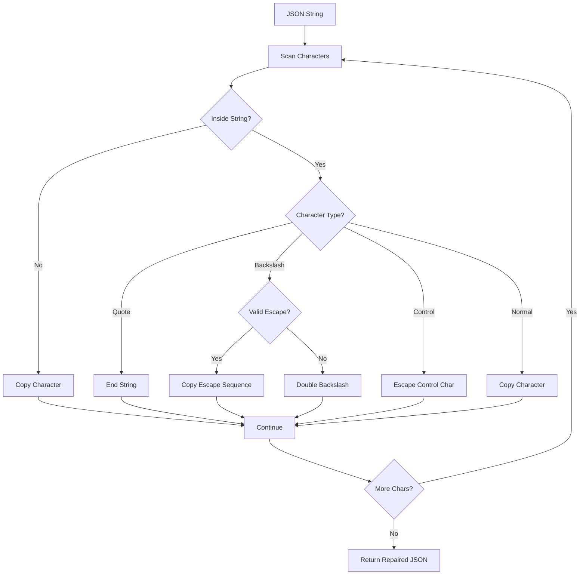
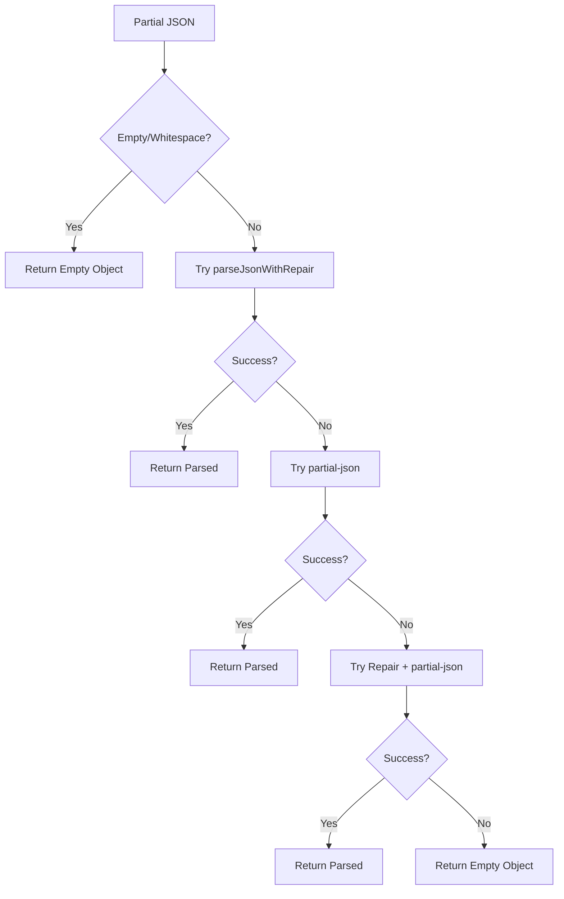
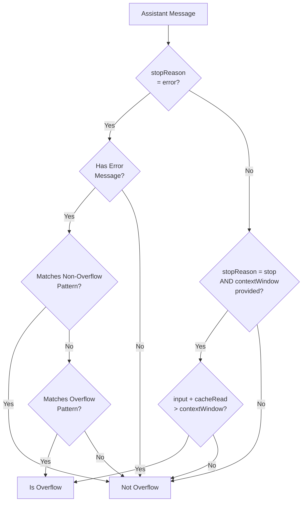
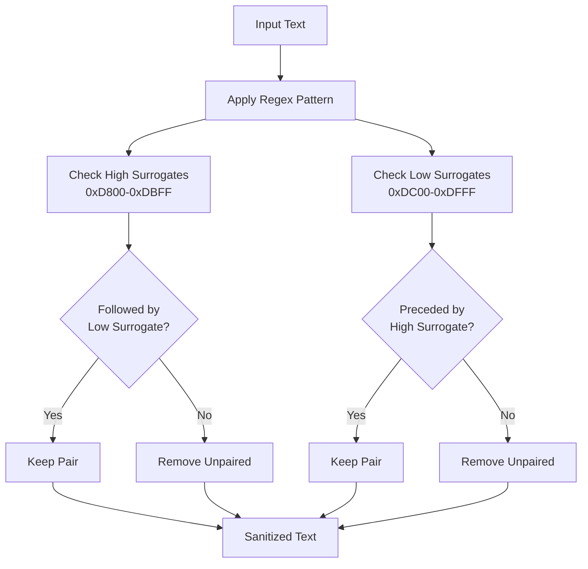

# Tool Validation & Utility Functions

The Tool Validation & Utility Functions module provides a comprehensive suite of utilities that support the AI provider abstraction layer in the pi-mono project. This module handles critical tasks including tool call validation, JSON parsing and repair, context overflow detection, Unicode sanitization, and various helper functions. These utilities ensure robust communication between the AI coding agent and multiple LLM providers by handling edge cases, malformed data, and provider-specific error patterns.

The module is designed to be provider-agnostic, offering consistent validation and data processing capabilities regardless of which LLM backend is being used. It includes sophisticated type coercion, schema validation using TypeBox, and error detection mechanisms that handle the nuances of different AI provider APIs.

## Tool Validation System

The tool validation system ensures that arguments passed to AI tools conform to their defined schemas. This is critical for maintaining type safety and catching errors before tool execution.

### Architecture Overview



The validation process follows a multi-stage pipeline that handles both TypeBox schemas and plain JSON schemas, with intelligent coercion for type mismatches.

Sources: [validation.ts:1-227](../../../packages/ai/src/utils/validation.ts#L1-L227)

### Key Functions

| Function | Purpose | Return Type |
|----------|---------|-------------|
| `validateToolCall()` | Finds tool by name and validates arguments | `any` |
| `validateToolArguments()` | Validates arguments against tool schema | `any` |
| `getValidator()` | Retrieves or creates cached TypeBox validator | `ReturnType<typeof Compile>` |
| `coerceWithJsonSchema()` | Coerces values to match JSON schema types | `unknown` |
| `formatValidationPath()` | Formats validation error paths for readability | `string` |

Sources: [validation.ts:183-227](../../../packages/ai/src/utils/validation.ts#L183-L227)

### Type Coercion Logic

The validation system implements sophisticated type coercion to handle common type mismatches from LLM responses:



The coercion system handles primitive types, objects, arrays, and complex union types (anyOf, oneOf, allOf).

Sources: [validation.ts:52-140](../../../packages/ai/src/utils/validation.ts#L52-L140)

### Validation Error Formatting

When validation fails, the system provides detailed error messages with formatted paths and received values:

```typescript
// Example error output:
// Validation failed for tool "calculate":
//   - operation: must be one of ["add", "subtract", "multiply", "divide"]
//   - numbers.0: must be number
//
// Received arguments:
// {
//   "operation": "modulo",
//   "numbers": ["5", 10]
// }
```

The error formatter converts JSON pointer paths (e.g., `/numbers/0`) into dot notation (e.g., `numbers.0`) and handles special cases like required property errors.

Sources: [validation.ts:167-180](../../../packages/ai/src/utils/validation.ts#L167-L180)

### Validator Caching

To optimize performance, compiled TypeBox validators are cached using a WeakMap:

```typescript
const validatorCache = new WeakMap<object, ReturnType<typeof Compile>>();
```

This ensures that schemas are only compiled once, significantly improving validation speed for repeated tool calls.

Sources: [validation.ts:6-7](../../../packages/ai/src/utils/validation.ts#L6-L7), [validation.ts:153-162](../../../packages/ai/src/utils/validation.ts#L153-L162)

## JSON Parsing and Repair

The JSON parsing utilities handle malformed JSON from LLM responses, including streaming scenarios where JSON may be incomplete.

### JSON Repair Mechanism



The repair function handles three main categories of JSON errors:
1. **Invalid escape sequences**: Doubles backslashes before invalid escape characters
2. **Control characters**: Escapes raw control characters (0x00-0x1F) inside strings
3. **Unicode sequences**: Validates and preserves proper Unicode escape sequences

Sources: [json-parse.ts:1-75](../../../packages/ai/src/utils/json-parse.ts#L1-L75)

### Streaming JSON Parsing

The `parseStreamingJson()` function handles incomplete JSON during streaming responses:



This multi-stage approach ensures that streaming JSON is always parseable, even when incomplete, by falling back to progressively more lenient parsing strategies.

Sources: [json-parse.ts:62-83](../../../packages/ai/src/utils/json-parse.ts#L62-L83)

### Valid JSON Escape Sequences

The repair system recognizes the following valid JSON escape sequences:

| Escape | Meaning |
|--------|---------|
| `\"` | Double quote |
| `\\` | Backslash |
| `\/` | Forward slash |
| `\b` | Backspace |
| `\f` | Form feed |
| `\n` | Newline |
| `\r` | Carriage return |
| `\t` | Tab |
| `\uXXXX` | Unicode code point (4 hex digits) |

Any other escape sequence is treated as invalid and the backslash is doubled.

Sources: [json-parse.ts:3-4](../../../packages/ai/src/utils/json-parse.ts#L3-L4)

## Context Overflow Detection

The overflow detection system identifies when LLM requests exceed model context windows, handling both explicit errors and silent overflows across multiple providers.

### Detection Strategy



The detection system handles two distinct scenarios:
1. **Error-based overflow**: Most providers return explicit errors with detectable patterns
2. **Silent overflow**: Some providers (e.g., z.ai) accept overflow requests and return successfully, requiring usage-based detection

Sources: [overflow.ts:1-129](../../../packages/ai/src/utils/overflow.ts#L1-L129)

### Provider-Specific Patterns

The system includes overflow detection patterns for numerous providers:

| Provider | Pattern Example | Detection Type |
|----------|----------------|----------------|
| Anthropic | "prompt is too long: X tokens > Y maximum" | Error message |
| Anthropic | "request_too_large" (HTTP 413) | Error message |
| OpenAI | "exceeds the context window" | Error message |
| Google Gemini | "input token count exceeds the maximum" | Error message |
| xAI (Grok) | "maximum prompt length is X" | Error message |
| Groq | "reduce the length of the messages" | Error message |
| Cerebras | "400/413 (no body)" | Status code |
| Mistral | "too large for model with X maximum context length" | Error message |
| z.ai | Silent (usage > contextWindow) | Usage-based |
| Ollama | "exceeded max context length by X tokens" | Error message |

Sources: [overflow.ts:10-51](../../../packages/ai/src/utils/overflow.ts#L10-L51)

### Non-Overflow Exclusions

To prevent false positives, the system excludes patterns that indicate other error types:

```typescript
const NON_OVERFLOW_PATTERNS = [
	/^(Throttling error|Service unavailable):/i,
	/rate limit/i,
	/too many requests/i,
];
```

This prevents throttling errors from AWS Bedrock (e.g., "Too many tokens, please wait") from being misclassified as overflow errors.

Sources: [overflow.ts:53-65](../../../packages/ai/src/utils/overflow.ts#L53-L65)

### Usage-Based Detection

For providers that silently accept overflow, the function accepts an optional `contextWindow` parameter:

```typescript
if (contextWindow && message.stopReason === "stop") {
    const inputTokens = message.usage.input + message.usage.cacheRead;
    if (inputTokens > contextWindow) {
        return true;
    }
}
```

This detects cases where the request succeeded but exceeded the model's actual context window.

Sources: [overflow.ts:119-125](../../../packages/ai/src/utils/overflow.ts#L119-L125)

## Unicode Sanitization

The Unicode sanitization utility removes unpaired surrogate characters that cause JSON serialization errors in API requests.

### Surrogate Pair Handling



Valid emoji and characters outside the Basic Multilingual Plane use properly paired surrogates (high surrogate 0xD800-0xDBFF followed by low surrogate 0xDC00-0xDFFF) and are preserved. Only unpaired surrogates are removed.

Sources: [sanitize-unicode.ts:1-25](../../../packages/ai/src/utils/sanitize-unicode.ts#L1-L25)

### Regex Pattern

The sanitization uses a single regex pattern to detect both types of unpaired surrogates:

```typescript
/[\uD800-\uDBFF](?![\uDC00-\uDFFF])|(?<![\uD800-\uDBFF])[\uDC00-\uDFFF]/g
```

This pattern uses negative lookahead and lookbehind assertions to identify:
- High surrogates NOT followed by low surrogates
- Low surrogates NOT preceded by high surrogates

Sources: [sanitize-unicode.ts:23](../../../packages/ai/src/utils/sanitize-unicode.ts#L23)

## Additional Utility Functions

### TypeBox Helpers

The `StringEnum` helper creates string enum schemas compatible with providers that don't support TypeBox's anyOf/const patterns:

```typescript
export function StringEnum<T extends readonly string[]>(
	values: T,
	options?: { description?: string; default?: T[number] },
): TUnsafe<T[number]>
```

This generates a plain JSON schema with an `enum` field, ensuring compatibility with Google's API and other restrictive providers.

Sources: [typebox-helpers.ts:1-19](../../../packages/ai/src/utils/typebox-helpers.ts#L1-L19)

### Header Conversion

The `headersToRecord` function converts Web API Headers objects to plain JavaScript objects:

```typescript
export function headersToRecord(headers: Headers): Record<string, string> {
	const result: Record<string, string> = {};
	for (const [key, value] of headers.entries()) {
		result[key] = value;
	}
	return result;
}
```

This is useful for logging, debugging, and passing headers to systems that expect plain objects.

Sources: [headers.ts:1-7](../../../packages/ai/src/utils/headers.ts#L1-L7)

### String Hashing

The `shortHash` function provides fast deterministic hashing for shortening long strings:

```typescript
export function shortHash(str: string): string {
	let h1 = 0xdeadbeef;
	let h2 = 0x41c6ce57;
	// ... MurmurHash3-style implementation
	return (h2 >>> 0).toString(36) + (h1 >>> 0).toString(36);
}
```

This uses a MurmurHash3-inspired algorithm to generate compact base-36 hash strings, useful for creating short identifiers from longer inputs.

Sources: [hash.ts:1-13](../../../packages/ai/src/utils/hash.ts#L1-L13)

## Summary

The Tool Validation & Utility Functions module provides essential infrastructure for the AI provider abstraction layer, handling the complexities of multi-provider LLM integration. The validation system ensures type safety with intelligent coercion and detailed error reporting. The JSON utilities handle malformed and streaming data gracefully. The overflow detection system supports 15+ providers with both explicit and silent overflow handling. Combined with Unicode sanitization and various helper functions, this module creates a robust foundation for reliable AI tool execution across diverse provider ecosystems.

The module's design philosophy emphasizes resilience, provider-agnostic operation, and comprehensive error handling, making it a critical component of the pi-mono AI coding agent infrastructure.

Sources: [validation.ts](../../../packages/ai/src/utils/validation.ts), [json-parse.ts](../../../packages/ai/src/utils/json-parse.ts), [overflow.ts](../../../packages/ai/src/utils/overflow.ts), [sanitize-unicode.ts](../../../packages/ai/src/utils/sanitize-unicode.ts), [typebox-helpers.ts](../../../packages/ai/src/utils/typebox-helpers.ts), [headers.ts](../../../packages/ai/src/utils/headers.ts), [hash.ts](../../../packages/ai/src/utils/hash.ts)