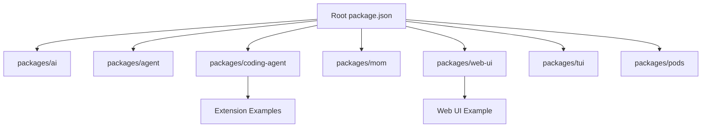
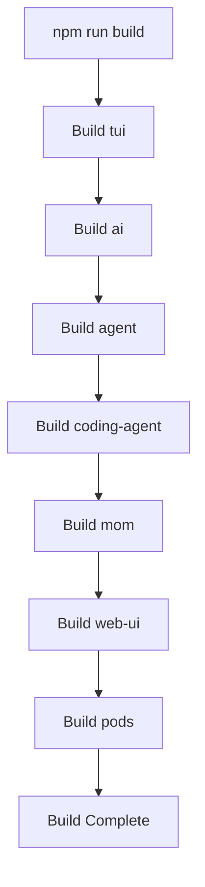
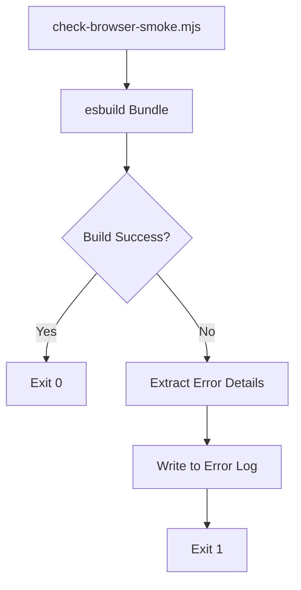
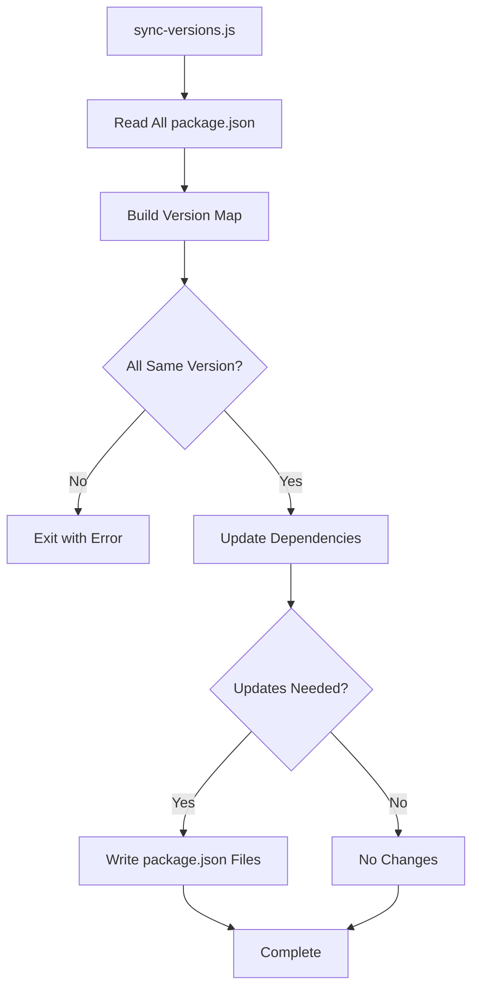
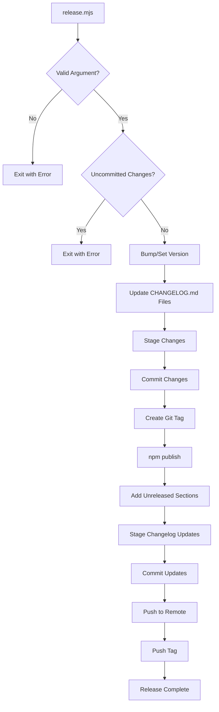
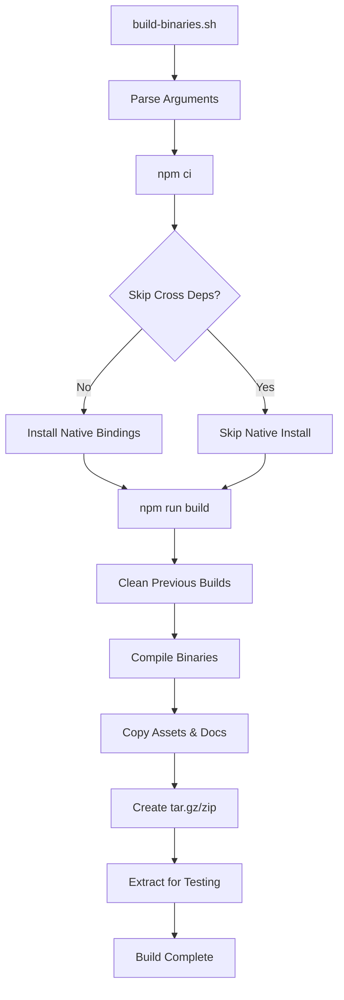

# Build, Test & Release Pipeline

## Introduction

The pi-mono project employs a comprehensive build, test, and release pipeline that orchestrates the development lifecycle of a TypeScript monorepo containing multiple interdependent packages. The pipeline is designed to support lockstep versioning across all packages, automated dependency synchronization, cross-platform binary compilation, and a streamlined release process. The build system leverages npm workspaces for package management, Biome for linting and formatting, TypeScript for type checking, and custom scripts for versioning, testing, and releasing. Additionally, the project includes specialized tooling for compiling standalone binaries for multiple platforms (macOS, Linux, Windows) with different architectures, ensuring the coding agent can be distributed as self-contained executables.

Sources: [package.json:1-68](../../../package.json#L1-L68), [biome.json:1-35](../../../biome.json#L1-L35)

## Monorepo Structure and Workspaces

The pi-mono repository is organized as an npm workspaces-based monorepo with the following structure:

- **Core packages** located in `packages/*`
- **Example applications** including `packages/web-ui/example`
- **Extension examples** for the coding agent in `packages/coding-agent/examples/extensions/*`

The monorepo configuration enables unified dependency management and coordinated builds across all packages. All packages follow a lockstep versioning strategy, meaning they share the same version number and are released together.

Sources: [package.json:5-13](../../../package.json#L5-L13)



## Build Pipeline

### Build Order and Dependencies

The build process follows a strict dependency order to ensure that packages are compiled in the correct sequence. The build script executes sequentially through each package:

1. **tui** - Terminal UI components
2. **ai** - AI provider abstractions and integrations
3. **agent** - Core agent functionality
4. **coding-agent** - Coding-specific agent implementation
5. **mom** - Model of models functionality
6. **web-ui** - Web interface components
7. **pods** - Pod management system

Sources: [package.json:16](../../../package.json#L16)



### Development Mode

The development mode uses `concurrently` to run multiple package build watchers in parallel, enabling hot-reload during development. Each package runs its own `dev` script with color-coded output for easy identification:

| Package | Color | Purpose |
|---------|-------|---------|
| ai | cyan | AI provider development |
| agent | yellow | Core agent development |
| coding-agent | red | Coding agent development |
| mom | white | Model management development |
| web-ui | green | Web interface development |
| tui | magenta | Terminal UI development |

Sources: [package.json:17](../../../package.json#L17)

### TypeScript Development Mode

A specialized TypeScript-only development mode is available that focuses on type checking for the `ai` and `web-ui` packages without full builds:

Sources: [package.json:18](../../../package.json#L18)

### Clean Operation

The monorepo provides a workspace-wide clean operation that removes build artifacts from all packages:

Sources: [package.json:15](../../../package.json#L15)

## Code Quality and Linting

### Biome Configuration

The project uses Biome as its primary linting and formatting tool. The configuration enforces consistent code style across the monorepo:

**Formatter Settings:**
- **Indent Style:** Tabs
- **Indent Width:** 3 spaces
- **Line Width:** 120 characters
- **Format with Errors:** Disabled (prevents formatting of files with syntax errors)

**Linter Rules:**
- Base ruleset: `recommended` (enabled)
- Style rules:
  - `noNonNullAssertion`: off (allows TypeScript non-null assertions)
  - `useConst`: error (enforces const over let where possible)
  - `useNodejsImportProtocol`: off (allows imports without `node:` prefix)
- Suspicious rules:
  - `noExplicitAny`: off (allows explicit `any` types)
  - `noControlCharactersInRegex`: off
  - `noEmptyInterface`: off

Sources: [biome.json:3-21](../../../biome.json#L3-L21)

### File Inclusion Patterns

Biome is configured to check specific file patterns while excluding generated files and dependencies:

**Included:**
- `packages/*/src/**/*.ts` - Source files
- `packages/*/test/**/*.ts` - Test files
- `packages/coding-agent/examples/**/*.ts` - Example code
- `packages/web-ui/src/**/*.ts` - Web UI source
- `packages/web-ui/example/**/*.ts` - Web UI examples

**Excluded:**
- `**/node_modules/**/*` - Dependencies
- `**/test-sessions.ts` - Test session data
- `**/models.generated.ts` - Generated model files
- `packages/web-ui/src/app.css` - CSS files
- `packages/mom/data/**/*` - Data files

Sources: [biome.json:22-35](../../../biome.json#L22-L35)

### Check Command

The comprehensive check command runs multiple validation steps:

```bash
npm run check
```

This command executes:
1. Biome check with auto-fix and error-on-warnings
2. TypeScript compilation check (noEmit mode)
3. Browser smoke test
4. Web UI specific checks

Sources: [package.json:19](../../../package.json#L19)

### Browser Smoke Test

The browser smoke test validates that the codebase can be bundled for browser environments. It uses esbuild to attempt a browser-platform bundle and logs detailed errors if the build fails:



The smoke test creates a temporary bundle and writes detailed error information to a log file if bundling fails, making it easy to identify browser compatibility issues.

Sources: [scripts/check-browser-smoke.mjs:1-31](../../../scripts/check-browser-smoke.mjs#L1-L31)

## Testing Pipeline

### Test Execution

The test pipeline is designed to run tests across all workspace packages that define a test script:

```bash
npm run test
```

This command executes tests in all packages with a `test` script defined, using the `--if-present` flag to skip packages without tests.

Sources: [package.json:22](../../../package.json#L22)

### Test Isolation Script

The project includes a specialized test script (`test.sh`) that ensures tests run in a clean environment without API credentials:

**Key Features:**
1. **Auth File Backup:** Temporarily moves `~/.pi/agent/auth.json` and restores it after tests
2. **Environment Variable Cleanup:** Unsets all API keys and cloud provider credentials
3. **Local LLM Skip:** Sets `PI_NO_LOCAL_LLM=1` to skip Ollama and LM Studio tests
4. **Automatic Cleanup:** Uses trap to restore auth.json on exit (success or failure)

**Unset Environment Variables:**
- LLM Provider Keys: `ANTHROPIC_API_KEY`, `OPENAI_API_KEY`, `GEMINI_API_KEY`, `GROQ_API_KEY`, `CEREBRAS_API_KEY`, `XAI_API_KEY`, `OPENROUTER_API_KEY`, `MISTRAL_API_KEY`, `MINIMAX_API_KEY`, `KIMI_API_KEY`, etc.
- OAuth Tokens: `ANTHROPIC_OAUTH_TOKEN`, `COPILOT_GITHUB_TOKEN`
- Cloud Provider Credentials: AWS, Google Cloud, Azure credentials
- Gateway Keys: `AI_GATEWAY_API_KEY`, `OPENCODE_API_KEY`

Sources: [test.sh:1-50](../../../test.sh#L1-L50)

### CLI Testing Script

The `pi-test.sh` script provides a way to test the coding agent CLI without API credentials:

**Usage:**
```bash
./pi-test.sh [--no-env] [args...]
```

The `--no-env` flag unsets all API keys and cloud credentials before running the CLI, enabling testing of error handling and offline functionality.

Sources: [pi-test.sh:1-56](../../../pi-test.sh#L1-L56)

## Version Management

### Lockstep Versioning

The monorepo enforces lockstep versioning, meaning all packages share the same version number. This approach simplifies dependency management and ensures compatibility across packages.

### Version Bumping

Three npm scripts handle version bumping:

| Command | Purpose | Effect |
|---------|---------|--------|
| `npm run version:patch` | Patch release (0.0.x) | Increments patch version |
| `npm run version:minor` | Minor release (0.x.0) | Increments minor version |
| `npm run version:major` | Major release (x.0.0) | Increments major version |

Each version command:
1. Bumps version in all workspace packages
2. Runs `sync-versions.js` to update inter-package dependencies
3. Removes all node_modules and package-lock.json
4. Reinstalls dependencies with the new versions

Sources: [package.json:23-25](../../../package.json#L23-L25)

### Version Synchronization

The `sync-versions.js` script ensures all inter-package dependencies use consistent versions:



**Process:**
1. Reads all package.json files from `packages/*`
2. Builds a version map of all `@mariozechner/*` packages
3. Verifies lockstep versioning (all packages have the same version)
4. Updates both `dependencies` and `devDependencies` to use `^version` format
5. Writes updated package.json files

The script exits with an error if packages have different versions, enforcing the lockstep versioning policy.

Sources: [scripts/sync-versions.js:1-79](../../../scripts/sync-versions.js#L1-L79)

## Release Pipeline

### Automated Release Process

The release pipeline is orchestrated by the `release.mjs` script, which handles the complete release workflow:

**Usage:**
```bash
npm run release:patch  # or release:minor, release:major
```

Sources: [package.json:28-30](../../../package.json#L28-L30)

### Release Workflow



### Release Steps

The release script executes the following steps in sequence:

1. **Argument Validation:** Accepts `major`, `minor`, `patch`, or explicit version (e.g., `1.2.3`)
2. **Git Status Check:** Ensures working directory is clean
3. **Version Bump:** Calls version scripts or sets explicit version
4. **Changelog Update:** Replaces `[Unreleased]` with `[version] - date` in all CHANGELOG.md files
5. **Commit and Tag:** Creates commit with message "Release vX.Y.Z" and tags it
6. **Publish:** Runs `npm run publish` to publish all packages to npm
7. **Post-Release Changelog:** Adds new `[Unreleased]` sections for the next development cycle
8. **Final Commit:** Commits changelog updates with message "Add [Unreleased] section for next cycle"
9. **Push:** Pushes main branch and version tag to remote

Sources: [scripts/release.mjs:1-167](../../../scripts/release.mjs#L1-L167)

### Version Comparison

The release script includes a version comparison function to validate explicit versions:

- Parses semantic versions into numeric components
- Compares major, minor, and patch numbers in order
- Ensures explicit versions are greater than the current version
- Prevents accidental downgrades or duplicate releases

Sources: [scripts/release.mjs:37-48](../../../scripts/release.mjs#L37-L48)

### Changelog Management

The script automatically manages CHANGELOG.md files across all packages:

**Release Phase:**
- Finds all `packages/*/CHANGELOG.md` files
- Replaces `## [Unreleased]` with `## [version] - YYYY-MM-DD`
- Skips files without an Unreleased section

**Post-Release Phase:**
- Adds new `## [Unreleased]` section at the top of each changelog
- Prepares changelogs for the next development cycle

Sources: [scripts/release.mjs:72-105](../../../scripts/release.mjs#L72-L105)

### Pre-Publish Checks

Before publishing, the `prepublishOnly` script ensures code quality:

```bash
npm run prepublishOnly
```

This command:
1. Cleans all build artifacts
2. Rebuilds all packages
3. Runs the comprehensive check command (linting, type checking, smoke tests)

Sources: [package.json:27](../../../package.json#L27)

### Publish Commands

| Command | Purpose |
|---------|---------|
| `npm run publish` | Publishes all packages to npm with public access |
| `npm run publish:dry` | Dry-run publish to validate without actually publishing |

Both commands run `prepublishOnly` first to ensure code quality.

Sources: [package.json:28-29](../../../package.json#L28-L29)

## Binary Build Pipeline

### Cross-Platform Binary Compilation

The project includes a sophisticated binary build system that creates standalone executables for multiple platforms. The `build-binaries.sh` script mirrors the GitHub Actions workflow for local builds.

**Supported Platforms:**
- `darwin-arm64` (macOS Apple Silicon)
- `darwin-x64` (macOS Intel)
- `linux-x64` (Linux x86_64)
- `linux-arm64` (Linux ARM64)
- `windows-x64` (Windows x86_64)

Sources: [scripts/build-binaries.sh:1-19](../../../scripts/build-binaries.sh#L1-L19)

### Binary Build Process



### Native Dependencies

The build script installs platform-specific native bindings for cross-compilation:

**Clipboard Bindings:**
- `@mariozechner/clipboard-darwin-arm64@0.3.0`
- `@mariozechner/clipboard-darwin-x64@0.3.0`
- `@mariozechner/clipboard-linux-x64-gnu@0.3.0`
- `@mariozechner/clipboard-linux-arm64-gnu@0.3.0`
- `@mariozechner/clipboard-win32-x64-msvc@0.3.0`

**Image Processing (Sharp):**
- `@img/sharp-darwin-arm64@0.34.5`
- `@img/sharp-darwin-x64@0.34.5`
- `@img/sharp-linux-x64@0.34.5`
- `@img/sharp-linux-arm64@0.34.5`
- `@img/sharp-win32-x64@0.34.5`
- `@img/sharp-libvips-*` libraries for each platform

The script uses `npm install --no-save --force` to bypass platform checks and install all bindings regardless of the current platform.

Sources: [scripts/build-binaries.sh:37-54](../../../scripts/build-binaries.sh#L37-L54)

### Bun Compilation

The script uses Bun's compile feature to create standalone binaries:

```bash
bun build --compile --external koffi --target=bun-$platform ./dist/bun/cli.js --outfile binaries/$platform/pi
```

**Key Options:**
- `--compile`: Creates a standalone executable
- `--external koffi`: Excludes koffi library to avoid embedding all 18 platform .node files (~74MB)
- `--target=bun-$platform`: Specifies the target platform
- Windows builds output to `pi.exe`, Unix platforms to `pi`

Sources: [scripts/build-binaries.sh:70-77](../../../scripts/build-binaries.sh#L70-L77)

### Binary Assets

Each binary distribution includes:

| Asset | Purpose |
|-------|---------|
| `package.json` | Package metadata |
| `README.md` | Documentation |
| `CHANGELOG.md` | Version history |
| `photon_rs_bg.wasm` | Image processing WASM module |
| `theme/*.json` | TUI theme files |
| `assets/*` | Static assets |
| `export-html/` | HTML export templates |
| `docs/` | Documentation |
| `examples/` | Example code |
| `node_modules/koffi/` | Windows VT input support (Windows only) |

Sources: [scripts/build-binaries.sh:81-95](../../../scripts/build-binaries.sh#L81-L95)

### Archive Creation

The script creates platform-appropriate archives:

**Unix Platforms (tar.gz):**
- Creates a wrapper directory named `pi` for mise compatibility
- Uses `tar -czf` to create compressed archives
- Format: `pi-$platform.tar.gz`

**Windows (zip):**
- Uses `zip -r` to create archives
- Format: `pi-$platform.zip`

After creating archives, the script extracts them into platform-specific directories for local testing.

Sources: [scripts/build-binaries.sh:99-121](../../../scripts/build-binaries.sh#L99-L121)

### Build Script Options

| Option | Description |
|--------|-------------|
| `--skip-deps` | Skip installing cross-platform native dependencies |
| `--platform <name>` | Build only for the specified platform |

These options enable faster incremental builds during development.

Sources: [scripts/build-binaries.sh:5-12](../../../scripts/build-binaries.sh#L5-L12)

## Development Tools

### Git Hooks

The project uses Husky for Git hook management. The `prepare` script automatically sets up Git hooks when dependencies are installed:

Sources: [package.json:31](../../../package.json#L31)

### Profiling Scripts

The monorepo includes profiling scripts for performance analysis:

- `npm run profile:tui` - Profile the TUI mode
- `npm run profile:rpc` - Profile the RPC mode

Sources: [package.json:20-21](../../../package.json#L20-L21)

## Dependency Management

### Engine Requirements

The project requires Node.js version 20.0.0 or higher:

Sources: [package.json:65-67](../../../package.json#L65-L67)

### Dependency Overrides

The root package.json includes overrides to ensure consistent dependency versions:

```json
"overrides": {
  "rimraf": "6.1.2",
  "gaxios": {
    "rimraf": "6.1.2"
  }
}
```

This prevents version conflicts in transitive dependencies.

Sources: [package.json:73-78](../../../package.json#L73-L78)

### Root Dependencies

The monorepo root includes shared dependencies:

- `@mariozechner/jiti@^2.6.5` - JIT TypeScript execution
- `@mariozechner/pi-coding-agent@^0.30.2` - Coding agent package
- `get-east-asian-width@^1.4.0` - Unicode width calculation

Sources: [package.json:69-72](../../../package.json#L69-L72)

## Summary

The pi-mono build, test, and release pipeline provides a comprehensive and automated workflow for managing a complex TypeScript monorepo. Key features include lockstep versioning across all packages, automated dependency synchronization, cross-platform binary compilation with native dependency management, comprehensive code quality checks using Biome and TypeScript, isolated testing environments, and a fully automated release process with changelog management. The pipeline is designed to ensure consistency, quality, and ease of distribution across multiple platforms while maintaining developer productivity through parallel development builds and extensive automation.

Sources: [package.json:1-78](../../../package.json#L1-L78), [scripts/release.mjs:1-167](../../../scripts/release.mjs#L1-L167), [scripts/build-binaries.sh:1-121](../../../scripts/build-binaries.sh#L1-L121), [scripts/sync-versions.js:1-79](../../../scripts/sync-versions.js#L1-L79), [test.sh:1-50](../../../test.sh#L1-L50)