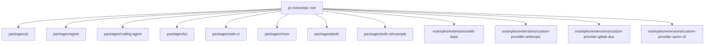
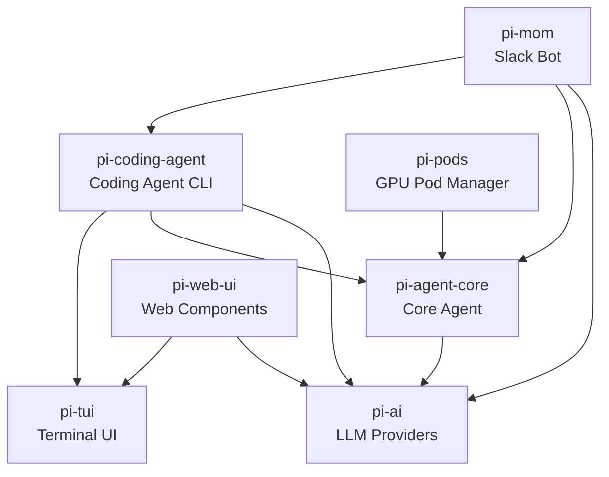
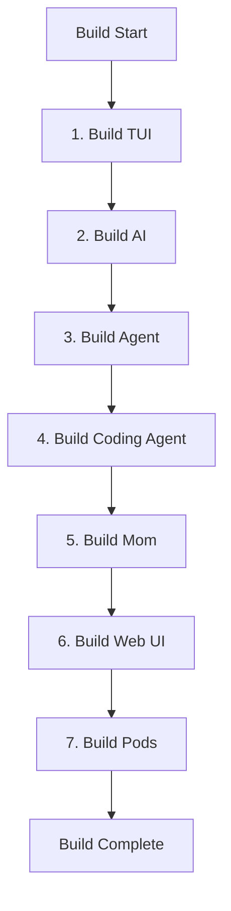
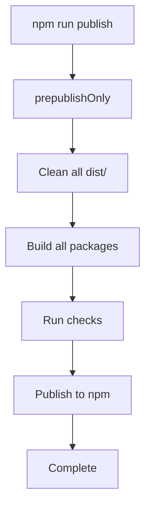

# Monorepo Structure & Package Dependencies

The `pi-mono` repository is organized as a TypeScript monorepo containing multiple interconnected packages that together provide an AI coding agent platform. The monorepo leverages npm workspaces for package management and implements a layered architecture where foundational packages (AI providers, TUI, core agent) support higher-level applications (coding agent, web UI, Slack bot, pod management). This structure enables code reuse, consistent versioning, and coordinated development across all components while maintaining clear separation of concerns.

The monorepo uses a shared TypeScript configuration, unified build tooling, and path aliases to facilitate seamless cross-package imports during development. All packages are published under the `@mariozechner` scope and maintain synchronized versioning across releases.

Sources: [package.json:1-72](../../../package.json#L1-L72), [tsconfig.json:1-30](../../../tsconfig.json#L1-L30)

## Workspace Configuration

The monorepo defines its workspace structure in the root `package.json`, specifying eight primary packages and four example extension directories:



The workspace configuration enables npm to manage dependencies across all packages, allowing for cross-package development and coordinated builds. Each workspace can have its own dependencies while sharing common devDependencies at the root level.

Sources: [package.json:4-13](../../../package.json#L4-L13)

## Package Dependency Graph

The packages form a clear dependency hierarchy, with foundational packages at the bottom and application-level packages at the top:



This architecture ensures that:
- **Foundation Layer**: `pi-ai` and `pi-tui` have no internal dependencies
- **Core Layer**: `pi-agent-core` depends only on `pi-ai`
- **Application Layer**: Higher-level packages consume core functionality

Sources: [packages/agent/package.json:24-26](../../../packages/agent/package.json#L24-L26), [packages/coding-agent/package.json:39-43](../../../packages/coding-agent/package.json#L39-L43), [packages/mom/package.json:23-28](../../../packages/mom/package.json#L23-L28), [packages/web-ui/package.json:21-26](../../../packages/web-ui/package.json#L21-L26), [packages/pods/package.json:32-34](../../../packages/pods/package.json#L32-L34)

## Core Packages

### @mariozechner/pi-ai

The AI package provides a unified interface for multiple LLM providers with automatic model discovery and provider configuration. It serves as the foundational abstraction layer for all AI interactions in the monorepo.

| Feature | Description |
|---------|-------------|
| **Version** | 0.69.0 |
| **Main Export** | Unified LLM API |
| **Provider Support** | Anthropic, OpenAI, Google (Gemini/Vertex), Mistral, AWS Bedrock, Azure OpenAI |
| **CLI Tool** | `pi-ai` binary for testing providers |
| **Key Dependencies** | `@anthropic-ai/sdk`, `openai`, `@google/genai`, `@mistralai/mistralai`, `@aws-sdk/client-bedrock-runtime` |

The package exports multiple subpaths for different providers and utilities:

```typescript
// Main unified API
import { ... } from '@mariozechner/pi-ai';

// Provider-specific implementations
import { ... } from '@mariozechner/pi-ai/anthropic';
import { ... } from '@mariozechner/pi-ai/google';
import { ... } from '@mariozechner/pi-ai/oauth';
```

Sources: [packages/ai/package.json:1-81](../../../packages/ai/package.json#L1-L81)

### @mariozechner/pi-agent-core

The agent core package provides general-purpose agent functionality with transport abstraction, state management, and attachment support. It builds directly on top of `pi-ai` to provide structured agent interactions.

| Component | Purpose |
|-----------|---------|
| **Transport Layer** | Abstracts communication mechanisms for agent interactions |
| **State Management** | Handles agent conversation state and history |
| **Attachment Support** | Enables file and media attachments in agent conversations |

This package serves as the foundation for both the coding agent and the Slack bot (mom), providing shared agent infrastructure.

Sources: [packages/agent/package.json:1-48](../../../packages/agent/package.json#L1-L48)

### @mariozechner/pi-tui

The TUI package implements a Terminal User Interface library with differential rendering for efficient text-based applications. It provides the rendering engine for the coding agent's interactive mode.

**Key Features:**
- Differential rendering to minimize terminal updates
- Text editor components
- Markdown rendering support
- Image rendering in terminals (via optional `koffi` dependency)
- Wide character support (East Asian width handling)

The package includes optional native dependencies for enhanced functionality while maintaining cross-platform compatibility.

Sources: [packages/tui/package.json:1-50](../../../packages/tui/package.json#L1-L50)

## Application Packages

### @mariozechner/pi-coding-agent

The coding agent is the flagship application package, providing a CLI tool with read, bash, edit, and write tools for AI-assisted development. It implements session management and supports multiple interaction modes.

| Feature | Implementation |
|---------|----------------|
| **CLI Binary** | `pi` command |
| **Tool System** | Read, write, edit, bash execution |
| **Session Management** | Persistent conversation sessions |
| **Export Formats** | HTML with syntax highlighting |
| **Extension System** | Hook-based customization via `@mariozechner/pi-coding-agent/hooks` |
| **Image Processing** | Optional `@silvia-odwyer/photon-node` for image manipulation |

The package includes extensive asset copying during build to bundle themes, templates, and vendor libraries:

```bash
# Asset structure in dist/
dist/
  modes/interactive/theme/*.json    # UI themes
  modes/interactive/assets/*.png    # Image assets
  core/export-html/                 # HTML export templates
    template.html
    template.css
    template.js
    vendor/*.js                     # Syntax highlighting libraries
```

Sources: [packages/coding-agent/package.json:1-108](../../../packages/coding-agent/package.json#L1-L108)

### @mariozechner/pi-web-ui

The web UI package provides reusable web components for AI chat interfaces, built with `mini-lit` and styled with Tailwind CSS. It enables web-based interactions with the AI system.

**Dependencies:**
- **Runtime**: `@mariozechner/pi-ai`, `@mariozechner/pi-tui`, `@lmstudio/sdk`, `ollama`
- **Document Processing**: `docx-preview`, `pdfjs-dist`, `xlsx`, `jszip`
- **Peer Dependencies**: `lit` or `@mariozechner/mini-lit` for web component framework

The package exports both JavaScript modules and compiled CSS:

```javascript
import { ... } from '@mariozechner/pi-web-ui';
import '@mariozechner/pi-web-ui/app.css';
```

Sources: [packages/web-ui/package.json:1-49](../../../packages/web-ui/package.json#L1-L49)

### @mariozechner/pi-mom

The "mom" package implements a Slack bot that delegates messages to the pi coding agent, enabling team collaboration through Slack channels.

**Architecture:**
- Uses Slack Socket Mode for real-time communication
- Integrates `pi-coding-agent` for AI-powered responses
- Supports scheduled tasks via `croner`
- Includes Anthropic sandbox runtime for code execution

Sources: [packages/mom/package.json:1-53](../../../packages/mom/package.json#L1-L53)

### @mariozechner/pi-pods

The pods package provides a CLI tool for managing vLLM deployments on GPU pods, enabling infrastructure management for LLM hosting.

**Key Components:**
- Pod provisioning and management
- vLLM deployment automation
- Model configuration management (via `models.json`)
- Deployment scripts bundled in `dist/scripts/`

Sources: [packages/pods/package.json:1-39](../../../packages/pods/package.json#L1-L39)

## TypeScript Configuration

The monorepo uses a layered TypeScript configuration strategy with a base configuration and path aliases for development-time imports.

### Base Configuration

The `tsconfig.base.json` establishes common compiler options across all packages:

| Option | Value | Purpose |
|--------|-------|---------|
| `target` | ES2022 | Modern JavaScript features |
| `module` | Node16 | Native ESM support |
| `strict` | true | Maximum type safety |
| `declaration` | true | Generate `.d.ts` files |
| `sourceMap` | true | Enable debugging |
| `moduleResolution` | Node16 | ESM-aware resolution |

Sources: [tsconfig.base.json:1-20](../../../tsconfig.base.json#L1-L20)

### Path Aliases

The root `tsconfig.json` defines path aliases for all packages, enabling seamless cross-package imports during development:

```json
{
  "@mariozechner/pi-ai": ["./packages/ai/src/index.ts"],
  "@mariozechner/pi-ai/oauth": ["./packages/ai/src/oauth.ts"],
  "@mariozechner/pi-agent-core": ["./packages/agent/src/index.ts"],
  "@mariozechner/pi-coding-agent": ["./packages/coding-agent/src/index.ts"],
  "@mariozechner/pi-coding-agent/hooks": ["./packages/coding-agent/src/core/hooks/index.ts"],
  "@mariozechner/pi-tui": ["./packages/tui/src/index.ts"],
  "@mariozechner/pi-web-ui": ["./packages/web-ui/src/index.ts"],
  "@mariozechner/pi-mom": ["./packages/mom/src/index.ts"],
  "@mariozechner/pi": ["./packages/pods/src/index.ts"]
}
```

These aliases map published package names to source files, allowing TypeScript to resolve imports correctly during development without requiring packages to be built first.

Sources: [tsconfig.json:5-26](../../../tsconfig.json#L5-L26)

## Build System

The monorepo implements a coordinated build system with specific ordering to handle inter-package dependencies:



The build script enforces this order explicitly:

```bash
cd packages/tui && npm run build && \
cd ../ai && npm run build && \
cd ../agent && npm run build && \
cd ../coding-agent && npm run build && \
cd ../mom && npm run build && \
cd ../web-ui && npm run build && \
cd ../pods && npm run build
```

This sequential approach ensures that dependencies are built before their consumers, preventing build failures from missing type definitions or compiled outputs.

Sources: [package.json:15](../../../package.json#L15)

### Development Workflow

For development, the monorepo uses `concurrently` to run watch mode builds in parallel:

```bash
npm run dev  # Starts all package watchers simultaneously
```

This command launches TypeScript compilation in watch mode for six packages (ai, agent, coding-agent, mom, web-ui, tui), with color-coded output for easy identification:

| Package | Color |
|---------|-------|
| ai | cyan |
| agent | yellow |
| coding-agent | red |
| mom | white |
| web-ui | green |
| tui | magenta |

Sources: [package.json:16](../../../package.json#L16)

## Versioning and Publishing

The monorepo maintains synchronized versioning across all packages, currently at version `0.69.0`. Version management scripts automate the process of updating versions consistently:

| Script | Purpose |
|--------|---------|
| `version:patch` | Increment patch version (0.0.x) |
| `version:minor` | Increment minor version (0.x.0) |
| `version:major` | Increment major version (x.0.0) |
| `version:set` | Manually set versions |

After version updates, the scripts synchronize versions across all packages and reinstall dependencies to ensure consistency:

```bash
npm version patch -ws --no-git-tag-version && \
node scripts/sync-versions.js && \
shx rm -rf node_modules packages/*/node_modules package-lock.json && \
npm install
```

Sources: [package.json:20-24](../../../package.json#L20-L24)

### Publishing Workflow

The publishing process includes pre-publish validation:



All packages are published with public access under the `@mariozechner` scope to npm.

Sources: [package.json:25-27](../../../package.json#L25-L27)

## Engine Requirements

The monorepo enforces Node.js version constraints at both the root and package levels:

- **Root requirement**: Node.js >= 20.0.0
- **Most packages**: Node.js >= 20.0.0
- **Coding agent**: Node.js >= 20.6.0 (requires newer features)

This ensures compatibility with modern JavaScript features (ES2022) and native ESM support across the entire codebase.

Sources: [package.json:37-39](../../../package.json#L37-L39), [packages/coding-agent/package.json:105-107](../../../packages/coding-agent/package.json#L105-L107)

## Summary

The pi-mono monorepo architecture provides a well-structured foundation for an AI coding agent platform through clear package boundaries, explicit dependency management, and coordinated build processes. The layered architecture—from foundational AI/TUI packages through core agent functionality to application-level tools—enables code reuse while maintaining separation of concerns. TypeScript path aliases and npm workspaces facilitate seamless development across packages, while synchronized versioning and automated build scripts ensure consistency across releases. This structure supports multiple deployment targets (CLI, web, Slack bot, infrastructure management) from a single, maintainable codebase.