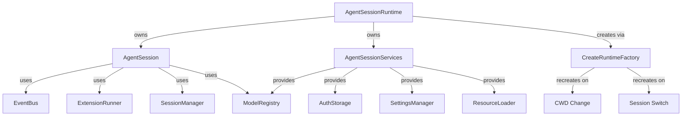
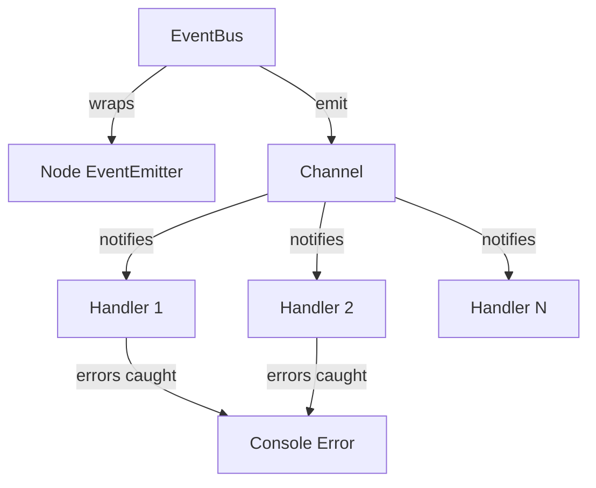
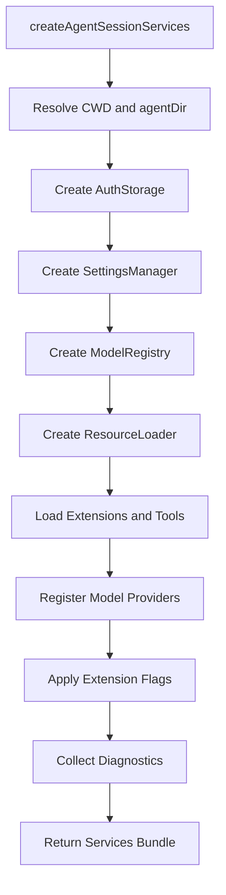
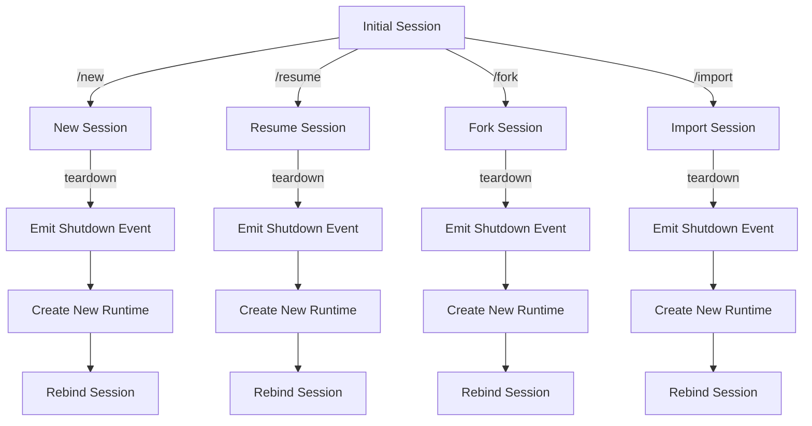
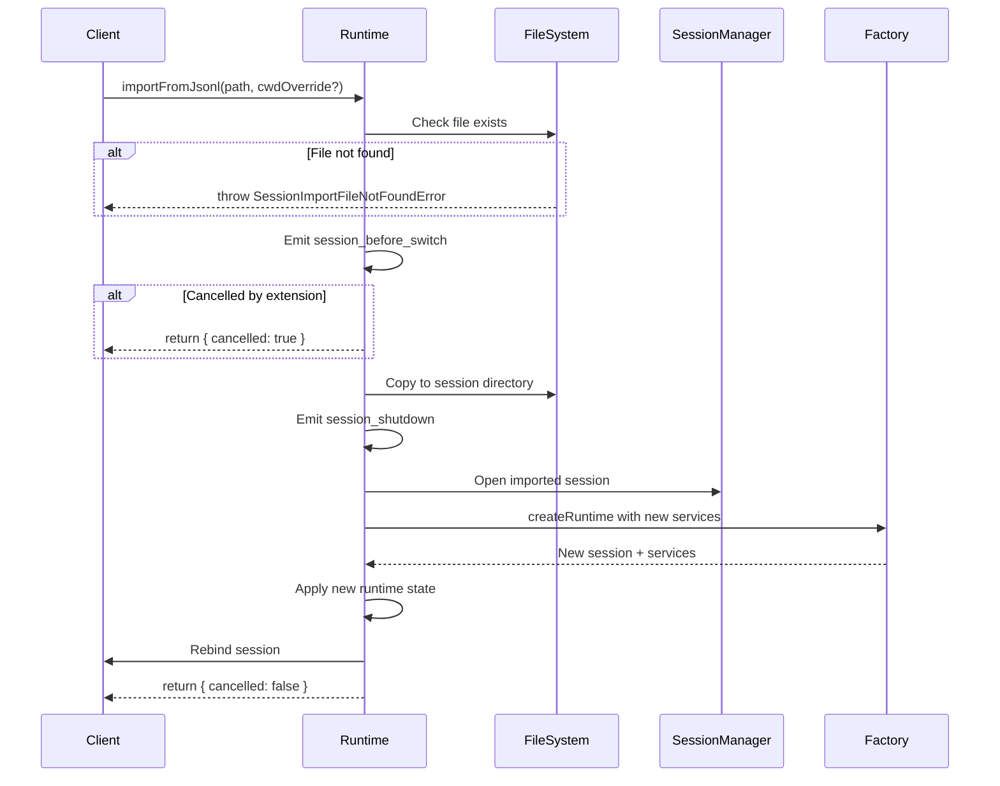
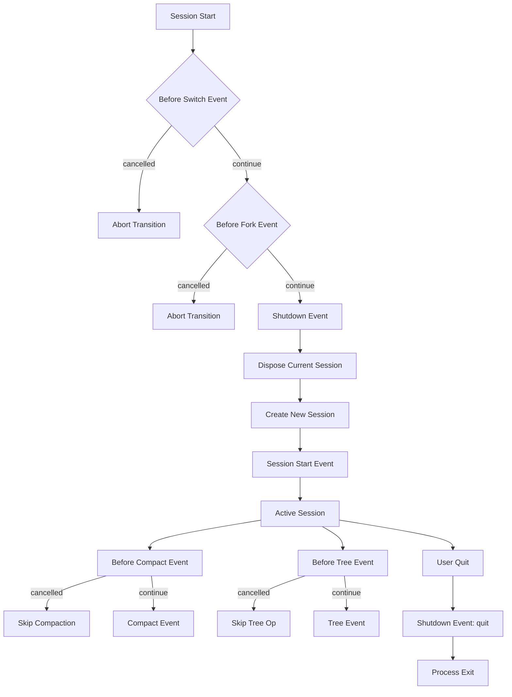

# AgentSession: Core Session Orchestration

The `AgentSession` is the central orchestration component of the pi-coding-agent, managing the complete lifecycle of an AI coding agent's interaction session. It coordinates between multiple subsystems including LLM communication, tool execution, extension management, event handling, and session persistence. The session acts as the primary interface for all agent operations, maintaining conversation state, managing model cycles, and providing a unified API for both programmatic and interactive use cases.

This orchestration layer integrates with the broader runtime architecture through `AgentSessionRuntime`, which handles session lifecycle transitions (creation, switching, forking, importing), and `AgentSessionServices`, which provides cwd-bound infrastructure services. Together, these components enable sophisticated session management including branching conversation trees, session persistence in JSONL format, and dynamic runtime reconfiguration.

Sources: [agent-session-runtime.ts](../../../packages/coding-agent/src/core/agent-session-runtime.ts), [agent-session-services.ts](../../../packages/coding-agent/src/core/agent-session-services.ts)

## Architecture Overview

The session orchestration system is composed of three primary architectural layers:

1. **AgentSession**: The core session object managing agent state, model interaction, and tool execution
2. **AgentSessionRuntime**: The runtime container managing session lifecycle, transitions, and service binding
3. **AgentSessionServices**: Infrastructure services scoped to the effective working directory



Sources: [agent-session-runtime.ts:42-75](../../../packages/coding-agent/src/core/agent-session-runtime.ts#L42-L75), [agent-session-services.ts:40-75](../../../packages/coding-agent/src/core/agent-session-services.ts#L40-L75)

### Core Components

| Component | Responsibility | Lifecycle |
|-----------|---------------|-----------|
| `AgentSession` | Manages agent state, model cycles, tool execution | Per session instance |
| `AgentSessionRuntime` | Owns session and services, handles transitions | Process-global singleton |
| `AgentSessionServices` | Provides cwd-bound infrastructure | Recreated on cwd change |
| `EventBus` | Pub/sub event coordination | Per session instance |
| `ExtensionRunner` | Extension lifecycle and event handling | Per session instance |
| `SessionManager` | Conversation persistence and tree navigation | Per session instance |

Sources: [agent-session-runtime.ts:77-91](../../../packages/coding-agent/src/core/agent-session-runtime.ts#L77-L91), [agent-session-services.ts:40-56](../../../packages/coding-agent/src/core/agent-session-services.ts#L40-L56)

## Event Bus System

The event bus provides decoupled communication between session components using a pub/sub pattern built on Node.js EventEmitter.



### EventBus Interface

The event bus exposes three core operations:

```typescript
export interface EventBus {
	emit(channel: string, data: unknown): void;
	on(channel: string, handler: (data: unknown) => void): () => void;
}

export interface EventBusController extends EventBus {
	clear(): void;
}
```

**Key Features:**
- **Error Isolation**: Handler errors are caught and logged without affecting other handlers or the emitter
- **Cleanup Support**: The `on()` method returns an unsubscribe function for resource management
- **Async-Safe**: Handlers are wrapped in async-safe error boundaries

Sources: [event-bus.ts:1-35](../../../packages/coding-agent/src/core/event-bus.ts#L1-L35)

### Event Handler Safety

All event handlers are automatically wrapped with error handling to prevent cascading failures:

```typescript
on: (channel, handler) => {
	const safeHandler = async (data: unknown) => {
		try {
			await handler(data);
		} catch (err) {
			console.error(`Event handler error (${channel}):`, err);
		}
	};
	emitter.on(channel, safeHandler);
	return () => emitter.off(channel, safeHandler);
}
```

This ensures that a failing handler in one extension or component cannot crash the entire session.

Sources: [event-bus.ts:16-28](../../../packages/coding-agent/src/core/event-bus.ts#L16-L28)

## AgentSessionServices: Infrastructure Layer

`AgentSessionServices` encapsulates all cwd-bound infrastructure that must be recreated when the effective working directory changes. This design ensures that configuration, extensions, and models are always resolved relative to the correct project context.

### Service Creation Flow



Sources: [agent-session-services.ts:98-133](../../../packages/coding-agent/src/core/agent-session-services.ts#L98-L133)

### Service Components

| Service | Purpose | Configuration Source |
|---------|---------|---------------------|
| `AuthStorage` | Stores API keys and provider credentials | `{agentDir}/auth.json` |
| `SettingsManager` | Manages user and project settings | `{cwd}/.pi/`, `{agentDir}/settings.json` |
| `ModelRegistry` | Registers and configures LLM providers | `{agentDir}/models.json` |
| `ResourceLoader` | Loads extensions, tools, and prompts | `{cwd}/.pi/extensions/`, `{agentDir}/extensions/` |

Sources: [agent-session-services.ts:98-112](../../../packages/coding-agent/src/core/agent-session-services.ts#L98-L112)

### Extension Flag Validation

Extension flags are validated against registered extensions before being applied to the runtime:

```typescript
function applyExtensionFlagValues(
	resourceLoader: ResourceLoader,
	extensionFlagValues: Map<string, boolean | string> | undefined,
): AgentSessionRuntimeDiagnostic[] {
	if (!extensionFlagValues) {
		return [];
	}

	const diagnostics: AgentSessionRuntimeDiagnostic[] = [];
	const extensionsResult = resourceLoader.getExtensions();
	const registeredFlags = new Map<string, { type: "boolean" | "string" }>();
	for (const extension of extensionsResult.extensions) {
		for (const [name, flag] of extension.flags) {
			registeredFlags.set(name, { type: flag.type });
		}
	}

	const unknownFlags: string[] = [];
	for (const [name, value] of extensionFlagValues) {
		const flag = registeredFlags.get(name);
		if (!flag) {
			unknownFlags.push(name);
			continue;
		}
		// Type validation logic...
	}
}
```

This validation ensures that CLI-provided flags match declared extension flags and have appropriate types.

Sources: [agent-session-services.ts:58-96](../../../packages/coding-agent/src/core/agent-session-services.ts#L58-L96)

### Diagnostic Collection

Services creation collects non-fatal diagnostics instead of throwing errors, allowing the application layer to decide how to handle issues:

```typescript
export interface AgentSessionRuntimeDiagnostic {
	type: "info" | "warning" | "error";
	message: string;
}
```

**Common Diagnostic Scenarios:**
- Unknown extension flags provided via CLI
- Extension flag type mismatches (boolean vs string)
- Model provider registration failures from extensions
- Missing or invalid extension configurations

Sources: [agent-session-services.ts:13-19](../../../packages/coding-agent/src/core/agent-session-services.ts#L13-L19), [agent-session-services.ts:114-128](../../../packages/coding-agent/src/core/agent-session-services.ts#L114-L128)

## AgentSessionRuntime: Lifecycle Management

The `AgentSessionRuntime` owns the current session and its services, managing all session lifecycle transitions while maintaining consistency between the session state and bound infrastructure.

### Runtime State Model



Sources: [agent-session-runtime.ts:77-144](../../../packages/coding-agent/src/core/agent-session-runtime.ts#L77-L144)

### Session Transition Protocol

Every session transition follows a strict protocol to ensure clean state management:

1. **Before Event**: Emit `session_before_switch` or `session_before_fork` event
2. **Cancellation Check**: Extensions can cancel the transition by returning `{ cancel: true }`
3. **Teardown**: Emit `session_shutdown` event and dispose current session
4. **Recreation**: Create new services and session via runtime factory
5. **Rebind**: Optionally rebind UI or other stateful components to new session
6. **Post-Transition**: Execute optional `withSession` callback for initialization

Sources: [agent-session-runtime.ts:145-166](../../../packages/coding-agent/src/core/agent-session-runtime.ts#L145-L166)

### Session Transition Methods

| Method | Purpose | Before Event | Shutdown Reason |
|--------|---------|--------------|-----------------|
| `switchSession()` | Load existing session from path | `session_before_switch` (resume) | `resume` |
| `newSession()` | Create fresh session in same directory | `session_before_switch` (new) | `new` |
| `fork()` | Branch conversation at entry point | `session_before_fork` | `fork` |
| `importFromJsonl()` | Import external JSONL session file | `session_before_switch` (resume) | `resume` |

Sources: [agent-session-runtime.ts:168-273](../../../packages/coding-agent/src/core/agent-session-runtime.ts#L168-L273)

### Fork Operation Details

The fork operation supports two positioning modes for creating conversation branches:

```typescript
async fork(
	entryId: string,
	options?: { 
		position?: "before" | "at"; 
		withSession?: (ctx: ReplacedSessionContext) => Promise<void> 
	},
): Promise<{ cancelled: boolean; selectedText?: string }>
```

**Position Modes:**
- **"before"**: Fork before the selected entry (excludes the entry from new branch)
- **"at"**: Fork at the selected entry (includes the entry in new branch)

When forking "before" a user message, the text content is extracted and returned for potential reuse:

```typescript
function extractUserMessageText(content: string | Array<{ type: string; text?: string }>): string {
	if (typeof content === "string") {
		return content;
	}

	return content
		.filter((part): part is { type: "text"; text: string } => 
			part.type === "text" && typeof part.text === "string")
		.map((part) => part.text)
		.join("");
}
```

Sources: [agent-session-runtime.ts:48-60](../../../packages/coding-agent/src/core/agent-session-runtime.ts#L48-L60), [agent-session-runtime.ts:218-273](../../../packages/coding-agent/src/core/agent-session-runtime.ts#L218-L273)

### Session Import Flow

The import operation handles external JSONL session files with automatic file management:



Sources: [agent-session-runtime.ts:275-312](../../../packages/coding-agent/src/core/agent-session-runtime.ts#L275-L312)

### Runtime Factory Pattern

The runtime uses a factory pattern to enable consistent session recreation across different trigger scenarios:

```typescript
export type CreateAgentSessionRuntimeFactory = (options: {
	cwd: string;
	agentDir: string;
	sessionManager: SessionManager;
	sessionStartEvent?: SessionStartEvent;
}) => Promise<CreateAgentSessionRuntimeResult>;
```

The factory is created once at application startup and closes over process-global configuration (CLI args, environment variables). It's then reused for all session transitions, ensuring consistent behavior while allowing cwd-specific service recreation.

Sources: [agent-session-runtime.ts:35-40](../../../packages/coding-agent/src/core/agent-session-runtime.ts#L35-L40), [agent-session-runtime.ts:318-333](../../../packages/coding-agent/src/core/agent-session-runtime.ts#L318-L333)

## Session Lifecycle Events

The session orchestration system emits structured lifecycle events that extensions can observe and respond to, enabling sophisticated workflow customization.

### Event Types and Timing



Sources: [core/index.ts:36-67](../../../packages/coding-agent/src/core/index.ts#L36-L67), [agent-session-runtime.ts:145-166](../../../packages/coding-agent/src/core/agent-session-runtime.ts#L145-L166)

### Cancellable Events

Several events support cancellation, allowing extensions to prevent operations:

| Event Type | Cancellation Effect | Return Value |
|------------|-------------------|--------------|
| `session_before_switch` | Prevents session switch/import | `{ cancel: true }` |
| `session_before_fork` | Prevents fork operation | `{ cancel: true }` |
| `session_before_compact` | Skips message compaction | `{ cancel: true }` |
| `session_before_tree` | Prevents tree visualization | `{ cancel: true }` |

Extensions implement cancellation by returning an object with `cancel: true` from their event handler.

Sources: [agent-session-runtime.ts:145-166](../../../packages/coding-agent/src/core/agent-session-runtime.ts#L145-L166)

### SessionStartEvent Structure

The `SessionStartEvent` provides context about why a new session was created:

```typescript
export interface SessionStartEvent {
	type: "session_start";
	reason: "new" | "resume" | "fork";
	previousSessionFile?: string;
}
```

**Reason Values:**
- **"new"**: Fresh session created via `/new` command
- **"resume"**: Existing session loaded via `/resume` or `/import`
- **"fork"**: Branched session created via `/fork` command

The `previousSessionFile` field links the new session to its predecessor, enabling session history tracking.

Sources: [core/index.ts:57](../../../packages/coding-agent/src/core/index.ts#L57), [agent-session-runtime.ts:195-204](../../../packages/coding-agent/src/core/agent-session-runtime.ts#L195-L204)

## Error Handling and Diagnostics

The orchestration layer uses a diagnostic collection pattern rather than throwing errors during initialization, allowing graceful degradation and user-friendly error reporting.

### Diagnostic Types

```typescript
export interface AgentSessionRuntimeDiagnostic {
	type: "info" | "warning" | "error";
	message: string;
}
```

**Severity Levels:**
- **info**: Informational messages about runtime configuration
- **warning**: Non-fatal issues that don't prevent operation
- **error**: Serious issues that may require user intervention

Sources: [agent-session-services.ts:13-19](../../../packages/coding-agent/src/core/agent-session-services.ts#L13-L19)

### Error Scenarios

| Error Type | Trigger | Handling |
|-----------|---------|----------|
| `SessionImportFileNotFoundError` | Import path doesn't exist | Thrown immediately, caught by caller |
| `MissingSessionCwdError` | Session cwd cannot be resolved | Thrown during session creation |
| Extension provider registration failure | Invalid provider config | Collected as diagnostic |
| Unknown extension flag | CLI flag not declared by extension | Collected as diagnostic |
| Flag type mismatch | Boolean flag given string value | Collected as diagnostic |

Sources: [agent-session-runtime.ts:62-70](../../../packages/coding-agent/src/core/agent-session-runtime.ts#L62-L70), [agent-session-services.ts:114-128](../../../packages/coding-agent/src/core/agent-session-services.ts#L114-L128)

### Custom Error Classes

The runtime defines specific error classes for common failure scenarios:

```typescript
export class SessionImportFileNotFoundError extends Error {
	readonly filePath: string;

	constructor(filePath: string) {
		super(`File not found: ${filePath}`);
		this.name = "SessionImportFileNotFoundError";
		this.filePath = filePath;
	}
}
```

These typed errors enable precise error handling in the application layer while providing structured error information.

Sources: [agent-session-runtime.ts:62-70](../../../packages/coding-agent/src/core/agent-session-runtime.ts#L62-L70)

## Integration Points

The session orchestration system integrates with multiple subsystems through well-defined interfaces:

### Extension System Integration

- **ExtensionRunner**: Manages extension lifecycle and event emission
- **Extension Events**: Session lifecycle events propagate to all registered extensions
- **Tool Registration**: Extensions can register custom tools via the resource loader
- **Model Providers**: Extensions can register new LLM providers via the model registry

Sources: [agent-session-services.ts:114-128](../../../packages/coding-agent/src/core/agent-session-services.ts#L114-L128), [core/index.ts:36-67](../../../packages/coding-agent/src/core/index.ts#L36-L67)

### Session Persistence Integration

- **SessionManager**: Handles JSONL serialization and conversation tree navigation
- **Session Files**: Stored in `{sessionDir}/*.jsonl` with metadata
- **Tree Operations**: Fork, branch, and navigation maintain referential integrity
- **CWD Tracking**: Each session records its working directory for restoration

Sources: [agent-session-runtime.ts:195-217](../../../packages/coding-agent/src/core/agent-session-runtime.ts#L195-L217)

### Model Registry Integration

- **Provider Registration**: Extensions register providers during service creation
- **Model Resolution**: Session creation resolves model names to provider instances
- **Scoped Models**: Multiple models can be configured with different thinking levels
- **Fallback Handling**: Model resolution failures generate diagnostics instead of crashing

Sources: [agent-session-services.ts:114-128](../../../packages/coding-agent/src/core/agent-session-services.ts#L114-L128)

## Exported API Surface

The core orchestration module exports a comprehensive API for building agent applications:

```typescript
export {
	AgentSession,
	type AgentSessionConfig,
	type AgentSessionEvent,
	type AgentSessionEventListener,
	type ModelCycleResult,
	type PromptOptions,
	type SessionStats,
} from "./agent-session.js";

export {
	AgentSessionRuntime,
	type CreateAgentSessionRuntimeFactory,
	type CreateAgentSessionRuntimeResult,
	createAgentSessionRuntime,
} from "./agent-session-runtime.js";

export {
	type AgentSessionRuntimeDiagnostic,
	type AgentSessionServices,
	type CreateAgentSessionFromServicesOptions,
	type CreateAgentSessionServicesOptions,
	createAgentSessionFromServices,
	createAgentSessionServices,
} from "./agent-session-services.js";
```

This API enables both high-level runtime management and low-level service composition for different deployment scenarios (CLI, TUI, web server).

Sources: [core/index.ts:1-68](../../../packages/coding-agent/src/core/index.ts#L1-L68)

## Summary

The AgentSession orchestration system provides a robust, extensible foundation for managing AI coding agent sessions. Through its layered architecture separating runtime lifecycle (AgentSessionRuntime), infrastructure services (AgentSessionServices), and core session logic (AgentSession), it enables sophisticated features like conversation branching, session persistence, and dynamic reconfiguration while maintaining clean separation of concerns.

Key architectural strengths include the event bus for decoupled communication, the diagnostic collection pattern for graceful error handling, the factory pattern for consistent session recreation, and comprehensive lifecycle events that enable powerful extension capabilities. This design supports the diverse deployment modes (CLI, TUI, web) required by the pi-mono project while maintaining consistency and reliability across all interaction patterns.

Sources: [agent-session-runtime.ts](../../../packages/coding-agent/src/core/agent-session-runtime.ts), [agent-session-services.ts](../../../packages/coding-agent/src/core/agent-session-services.ts), [event-bus.ts](../../../packages/coding-agent/src/core/event-bus.ts), [core/index.ts](../../../packages/coding-agent/src/core/index.ts)