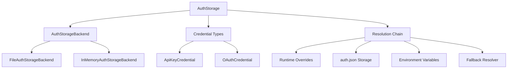
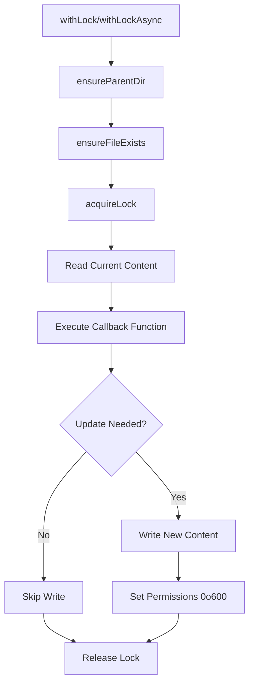
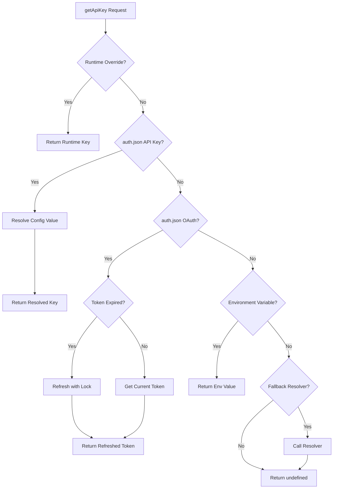
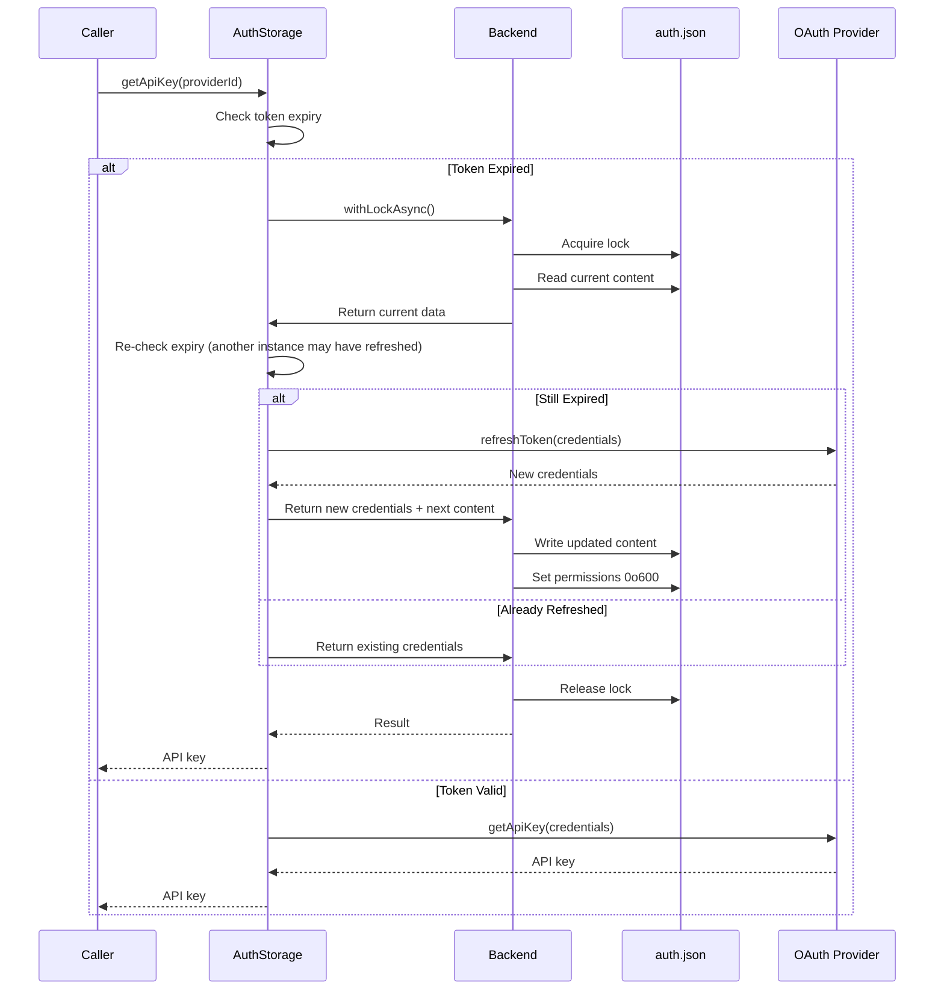

# Authentication & Credential Storage

The Authentication & Credential Storage system in `@pi-coding-agent` manages API keys and OAuth tokens for multiple LLM providers. It provides a secure, file-based credential storage mechanism with support for environment variables, command execution for secret retrieval, and automatic OAuth token refresh. The system uses file locking to prevent race conditions when multiple `pi` instances attempt to refresh tokens simultaneously, ensuring credential integrity across concurrent operations.

The primary storage backend is `auth.json` located in the agent configuration directory (`~/.pi/agent/` by default), with permissions automatically set to `0o600` for security. The system supports multiple authentication methods per provider with a well-defined priority order, and includes both synchronous and asynchronous locking mechanisms for safe concurrent access.

Sources: [packages/coding-agent/src/core/auth-storage.ts:1-10](../../../packages/coding-agent/src/core/auth-storage.ts#L1-L10), [packages/coding-agent/src/config.ts:149-152](../../../packages/coding-agent/src/config.ts#L149-L152)

## Architecture Overview

The authentication system is built around three main components: storage backends, credential types, and resolution logic. The architecture supports both file-based and in-memory storage, enabling production use and testing scenarios.



Sources: [packages/coding-agent/src/core/auth-storage.ts:30-47](../../../packages/coding-agent/src/core/auth-storage.ts#L30-L47), [packages/coding-agent/src/core/auth-storage.ts:155-162](../../../packages/coding-agent/src/core/auth-storage.ts#L155-L162)

### Storage Backend Interface

The `AuthStorageBackend` interface defines the contract for credential persistence, providing both synchronous and asynchronous locking mechanisms:

| Method | Purpose | Return Type |
|--------|---------|-------------|
| `withLock<T>` | Execute function with synchronous file lock | `T` |
| `withLockAsync<T>` | Execute function with asynchronous file lock | `Promise<T>` |

Both methods accept a function that receives the current file content and returns a `LockResult<T>` containing the result and optionally updated content to persist. This pattern ensures atomic read-modify-write operations.

Sources: [packages/coding-agent/src/core/auth-storage.ts:36-40](../../../packages/coding-agent/src/core/auth-storage.ts#L36-L40)

### Credential Types

The system supports two credential types, represented as a discriminated union:

```typescript
export type ApiKeyCredential = {
	type: "api_key";
	key: string;
};

export type OAuthCredential = {
	type: "oauth";
} & OAuthCredentials;

export type AuthCredential = ApiKeyCredential | OAuthCredential;
```

**API Key Credentials** store static or dynamically-resolved keys, while **OAuth Credentials** include refresh tokens, access tokens, and expiration timestamps. The storage format is a simple JSON object mapping provider IDs to credentials:

```typescript
export type AuthStorageData = Record<string, AuthCredential>;
```

Sources: [packages/coding-agent/src/core/auth-storage.ts:22-30](../../../packages/coding-agent/src/core/auth-storage.ts#L22-L30), [packages/ai/src/utils/oauth/types.ts:3-8](../../../packages/ai/src/utils/oauth/types.ts#L3-L8)

## File-Based Storage Backend

The `FileAuthStorageBackend` implements secure, concurrent access to the `auth.json` file using the `proper-lockfile` library. It handles directory creation, file initialization, and permission management automatically.



### Directory and File Initialization

The backend ensures the parent directory exists with secure permissions (`0o700`) and creates an empty `auth.json` file with `0o600` permissions if it doesn't exist:

```typescript
private ensureParentDir(): void {
    const dir = dirname(this.authPath);
    if (!existsSync(dir)) {
        mkdirSync(dir, { recursive: true, mode: 0o700 });
    }
}

private ensureFileExists(): void {
    if (!existsSync(this.authPath)) {
        writeFileSync(this.authPath, "{}", "utf-8");
        chmodSync(this.authPath, 0o600);
    }
}
```

Sources: [packages/coding-agent/src/core/auth-storage.ts:49-61](../../../packages/coding-agent/src/core/auth-storage.ts#L49-L61)

### Lock Acquisition with Retry

The synchronous lock acquisition includes retry logic to handle transient `ELOCKED` errors:

```typescript
private acquireLockSyncWithRetry(path: string): () => void {
    const maxAttempts = 10;
    const delayMs = 20;
    let lastError: unknown;

    for (let attempt = 1; attempt <= maxAttempts; attempt++) {
        try {
            return lockfile.lockSync(path, { realpath: false });
        } catch (error) {
            const code = /* extract error code */;
            if (code !== "ELOCKED" || attempt === maxAttempts) {
                throw error;
            }
            lastError = error;
            // Busy-wait for delayMs
        }
    }
    throw lastError ?? new Error("Failed to acquire auth storage lock");
}
```

The asynchronous version uses exponential backoff with randomization and includes a stale lock timeout (30 seconds) with compromise detection:

Sources: [packages/coding-agent/src/core/auth-storage.ts:63-85](../../../packages/coding-agent/src/core/auth-storage.ts#L63-L85), [packages/coding-agent/src/core/auth-storage.ts:101-132](../../../packages/coding-agent/src/core/auth-storage.ts#L101-L132)

### Lock Compromise Handling

When an asynchronous lock is compromised (stale threshold exceeded), the system throws an error to prevent data corruption:

```typescript
let lockCompromised = false;
let lockCompromisedError: Error | undefined;
const throwIfCompromised = () => {
    if (lockCompromised) {
        throw lockCompromisedError ?? new Error("Auth storage lock was compromised");
    }
};

release = await lockfile.lock(this.authPath, {
    stale: 30000,
    onCompromised: (err) => {
        lockCompromised = true;
        lockCompromisedError = err;
    },
});
```

This ensures that if the lock becomes stale during a long-running operation (e.g., OAuth refresh), the operation fails safely rather than potentially corrupting credentials.

Sources: [packages/coding-agent/src/core/auth-storage.ts:103-119](../../../packages/coding-agent/src/core/auth-storage.ts#L103-L119), [packages/coding-agent/test/auth-storage.test.ts:117-137](../../../packages/coding-agent/test/auth-storage.test.ts#L117-L137)

## API Key Resolution

The `getApiKey()` method implements a five-tier resolution chain for retrieving API keys, allowing flexible credential management across different deployment scenarios.



### Resolution Priority

The resolution chain is executed in strict priority order:

1. **Runtime Override**: CLI `--api-key` flag or programmatic override
2. **API Key from auth.json**: Static key, environment variable reference, or command
3. **OAuth Token from auth.json**: Auto-refreshed with file locking
4. **Environment Variable**: Standard `PROVIDER_API_KEY` format
5. **Fallback Resolver**: Custom provider keys from `models.json`

Sources: [packages/coding-agent/src/core/auth-storage.ts:351-398](../../../packages/coding-agent/src/core/auth-storage.ts#L351-L398)

### Config Value Resolution

API keys stored in `auth.json` support three formats:

| Format | Example | Behavior |
|--------|---------|----------|
| Literal | `"sk-ant-literal-key"` | Returned as-is |
| Environment Variable | `"ANTHROPIC_API_KEY"` | Resolved from `process.env` |
| Command Execution | `"!echo secret-key"` | Executed via shell, stdout returned |

Commands are executed with `sh -c` and support shell features like pipes. Results are trimmed of whitespace, and failures return `undefined`. Command results are cached per process to avoid repeated execution.

Sources: [packages/coding-agent/src/core/resolve-config-value.ts](../../../packages/coding-agent/src/core/resolve-config-value.ts), [packages/coding-agent/test/auth-storage.test.ts:32-102](../../../packages/coding-agent/test/auth-storage.test.ts#L32-L102)

### Command Execution Caching

The config value resolver caches command execution results to prevent redundant shell invocations:

```typescript
test("command is only executed once per process", async () => {
    const command = `!sh -c 'count=$(cat "${counterPath}"); 
                     echo $((count + 1)) > "${counterPath}"; 
                     echo "key-value"'`;
    
    await authStorage.getApiKey("anthropic");
    await authStorage.getApiKey("anthropic");
    await authStorage.getApiKey("anthropic");
    
    // Command should have only run once
    const count = parseInt(readFileSync(counterFile, "utf-8").trim(), 10);
    expect(count).toBe(1);
});
```

Failed command executions are also cached, preventing repeated failures. The cache can be cleared using `clearConfigValueCache()` for testing or when credentials change.

Sources: [packages/coding-agent/test/auth-storage.test.ts:104-147](../../../packages/coding-agent/test/auth-storage.test.ts#L104-L147)

## OAuth Token Management

OAuth credentials include refresh tokens, access tokens, and expiration timestamps. The system automatically refreshes expired tokens using provider-specific refresh logic with file locking to prevent race conditions.

### OAuth Credential Structure

OAuth credentials extend the base `OAuthCredentials` type from the AI package:

```typescript
export type OAuthCredentials = {
	refresh: string;    // Refresh token for obtaining new access tokens
	access: string;     // Current access token
	expires: number;    // Unix timestamp (ms) when access token expires
	[key: string]: unknown;  // Provider-specific fields
};
```

Sources: [packages/ai/src/utils/oauth/types.ts:3-8](../../../packages/ai/src/utils/oauth/types.ts#L3-L8)

### Token Refresh Flow

When an OAuth access token is expired, the system uses a locked refresh operation to prevent multiple concurrent refresh attempts:



### Refresh Lock Implementation

The locked refresh operation re-reads the file after acquiring the lock to check if another instance already refreshed the token:

```typescript
private async refreshOAuthTokenWithLock(
    providerId: OAuthProviderId,
): Promise<{ apiKey: string; newCredentials: OAuthCredentials } | null> {
    const result = await this.storage.withLockAsync(async (current) => {
        const currentData = this.parseStorageData(current);
        this.data = currentData;
        
        const cred = currentData[providerId];
        if (cred?.type !== "oauth") {
            return { result: null };
        }

        // Check if already refreshed by another instance
        if (Date.now() < cred.expires) {
            return { result: { apiKey: provider.getApiKey(cred), newCredentials: cred } };
        }

        // Perform refresh
        const refreshed = await getOAuthApiKey(providerId, oauthCreds);
        if (!refreshed) {
            return { result: null };
        }

        // Persist updated credentials
        const merged: AuthStorageData = {
            ...currentData,
            [providerId]: { type: "oauth", ...refreshed.newCredentials },
        };
        return { result: refreshed, next: JSON.stringify(merged, null, 2) };
    });

    return result;
}
```

Sources: [packages/coding-agent/src/core/auth-storage.ts:297-349](../../../packages/coding-agent/src/core/auth-storage.ts#L297-L349)

### Refresh Failure Handling

When token refresh fails (network error, invalid refresh token, etc.), the system:

1. Records the error for later retrieval via `drainErrors()`
2. Reloads `auth.json` to check if another instance succeeded
3. Returns `undefined` if refresh truly failed, causing model discovery to skip the provider
4. Preserves credentials in `auth.json` for manual retry via `/login` command

This graceful degradation ensures that transient failures don't permanently disable providers, while persistent failures (e.g., revoked refresh tokens) require user intervention.

Sources: [packages/coding-agent/src/core/auth-storage.ts:376-392](../../../packages/coding-agent/src/core/auth-storage.ts#L376-L392)

## OAuth Provider Interface

OAuth providers implement the `OAuthProviderInterface`, which defines the contract for login, token refresh, and API key extraction:

```typescript
export interface OAuthProviderInterface {
	readonly id: OAuthProviderId;
	readonly name: string;

	login(callbacks: OAuthLoginCallbacks): Promise<OAuthCredentials>;
	usesCallbackServer?: boolean;
	refreshToken(credentials: OAuthCredentials): Promise<OAuthCredentials>;
	getApiKey(credentials: OAuthCredentials): string;
	modifyModels?(models: Model<Api>[], credentials: OAuthCredentials): Model<Api>[];
}
```

### Login Callbacks

The login flow uses callbacks to interact with the user interface:

| Callback | Purpose | Required |
|----------|---------|----------|
| `onAuth` | Display authorization URL and instructions | Yes |
| `onPrompt` | Prompt user for input (e.g., verification code) | Yes |
| `onProgress` | Show progress messages during login | No |
| `onManualCodeInput` | Fallback for manual code entry if callback server fails | No |
| `signal` | AbortSignal for cancellation | No |

Sources: [packages/ai/src/utils/oauth/types.ts:21-27](../../../packages/ai/src/utils/oauth/types.ts#L21-L27), [packages/ai/src/utils/oauth/types.ts:29-42](../../../packages/ai/src/utils/oauth/types.ts#L29-L42)

### Provider Registration

OAuth providers are registered using `registerOAuthProvider()` from the `@mariozechner/pi-ai/oauth` module. The AuthStorage class exposes registered providers via `getOAuthProviders()`:

```typescript
getOAuthProviders() {
    return getOAuthProviders();
}
```

Sources: [packages/coding-agent/src/core/auth-storage.ts:405-407](../../../packages/coding-agent/src/core/auth-storage.ts#L405-L407), [packages/coding-agent/test/auth-storage.test.ts:120-137](../../../packages/coding-agent/test/auth-storage.test.ts#L120-L137)

## Persistence Semantics

The AuthStorage class implements careful persistence semantics to handle concurrent modifications and error conditions gracefully.

### Merge-on-Write Strategy

When modifying a single provider's credentials, the system reads the current file content within the lock, merges the change, and writes back the entire object. This preserves external edits made by other processes:

```typescript
private persistProviderChange(provider: string, credential: AuthCredential | undefined): void {
    if (this.loadError) {
        return;  // Don't overwrite malformed file
    }

    try {
        this.storage.withLock((current) => {
            const currentData = this.parseStorageData(current);
            const merged: AuthStorageData = { ...currentData };
            if (credential) {
                merged[provider] = credential;
            } else {
                delete merged[provider];
            }
            return { result: undefined, next: JSON.stringify(merged, null, 2) };
        });
    } catch (error) {
        this.recordError(error);
    }
}
```

This ensures that if another process adds a provider while this instance is running, the new provider's credentials are preserved when this instance updates its own provider.

Sources: [packages/coding-agent/src/core/auth-storage.ts:224-240](../../../packages/coding-agent/src/core/auth-storage.ts#L224-L240)

### Error Handling

The system maintains an error buffer that accumulates errors from file operations and token refresh attempts:

```typescript
private errors: Error[] = [];

private recordError(error: unknown): void {
    const normalizedError = error instanceof Error ? error : new Error(String(error));
    this.errors.push(normalizedError);
}

drainErrors(): Error[] {
    const drained = [...this.errors];
    this.errors = [];
    return drained;
}
```

Errors can be retrieved and cleared using `drainErrors()`, allowing the application to display accumulated errors to the user without losing them across multiple operations.

Sources: [packages/coding-agent/src/core/auth-storage.ts:169-171](../../../packages/coding-agent/src/core/auth-storage.ts#L169-L171), [packages/coding-agent/src/core/auth-storage.ts:185-188](../../../packages/coding-agent/src/core/auth-storage.ts#L185-L188), [packages/coding-agent/src/core/auth-storage.ts:276-280](../../../packages/coding-agent/src/core/auth-storage.ts#L276-L280)

### Malformed File Protection

If `auth.json` becomes malformed (invalid JSON), the system:

1. Records the parse error
2. Retains the previous in-memory state
3. Refuses to write changes until the file is manually fixed or reloaded successfully

This prevents accidental data loss when the file is temporarily corrupted:

```typescript
reload(): void {
    let content: string | undefined;
    try {
        this.storage.withLock((current) => {
            content = current;
            return { result: undefined };
        });
        this.data = this.parseStorageData(content);
        this.loadError = null;
    } catch (error) {
        this.loadError = error as Error;
        this.recordError(error);
    }
}
```

Sources: [packages/coding-agent/src/core/auth-storage.ts:210-222](../../../packages/coding-agent/src/core/auth-storage.ts#L210-L222), [packages/coding-agent/test/auth-storage.test.ts:181-194](../../../packages/coding-agent/test/auth-storage.test.ts#L181-L194)

## Runtime Overrides

Runtime overrides provide a mechanism to temporarily use different credentials without modifying `auth.json`. This is primarily used for the CLI `--api-key` flag:

```typescript
setRuntimeApiKey(provider: string, apiKey: string): void {
    this.runtimeOverrides.set(provider, apiKey);
}

removeRuntimeApiKey(provider: string): void {
    this.runtimeOverrides.delete(provider);
}
```

Runtime overrides take precedence over all other credential sources, including `auth.json` and environment variables. They are not persisted to disk and are lost when the process exits.

Sources: [packages/coding-agent/src/core/auth-storage.ts:196-205](../../../packages/coding-agent/src/core/auth-storage.ts#L196-L205), [packages/coding-agent/test/auth-storage.test.ts:208-229](../../../packages/coding-agent/test/auth-storage.test.ts#L208-L229)

## Fallback Resolver

The fallback resolver allows custom credential resolution for providers not in `auth.json`. This is used to support custom provider API keys defined in `models.json`:

```typescript
setFallbackResolver(resolver: (provider: string) => string | undefined): void {
    this.fallbackResolver = resolver;
}
```

The fallback resolver is invoked as the last step in the resolution chain, after checking runtime overrides, `auth.json`, and environment variables. It can be disabled for specific calls using the `includeFallback: false` option:

```typescript
await authStorage.getApiKey("custom-provider", { includeFallback: false });
```

Sources: [packages/coding-agent/src/core/auth-storage.ts:207-212](../../../packages/coding-agent/src/core/auth-storage.ts#L207-L212), [packages/coding-agent/src/core/auth-storage.ts:394-396](../../../packages/coding-agent/src/core/auth-storage.ts#L394-L396)

## Configuration Integration

The AuthStorage system integrates with the broader configuration system defined in `config.ts`, which provides path resolution and environment variable support.

### Agent Directory Resolution

The default `auth.json` location is determined by `getAgentDir()`, which supports environment variable override:

```typescript
export function getAgentDir(): string {
	const envDir = process.env[ENV_AGENT_DIR];
	if (envDir) {
		if (envDir === "~") return homedir();
		if (envDir.startsWith("~/")) return homedir() + envDir.slice(1);
		return envDir;
	}
	return join(homedir(), CONFIG_DIR_NAME, "agent");
}
```

The environment variable name is derived from the app name in `package.json` (e.g., `PI_CODING_AGENT_DIR` for the default "pi" app).

Sources: [packages/coding-agent/src/config.ts:131-141](../../../packages/coding-agent/src/config.ts#L131-L141), [packages/coding-agent/src/config.ts:114-115](../../../packages/coding-agent/src/config.ts#L114-L115)

### Path Helpers

The config module provides dedicated helpers for auth-related paths:

```typescript
export function getAuthPath(): string {
	return join(getAgentDir(), "auth.json");
}
```

These helpers ensure consistent path resolution across the codebase and support custom agent directories via environment variables.

Sources: [packages/coding-agent/src/config.ts:149-152](../../../packages/coding-agent/src/config.ts#L149-L152)

## Testing Support

The system includes an in-memory storage backend for testing, avoiding file I/O and lock contention:

```typescript
export class InMemoryAuthStorageBackend implements AuthStorageBackend {
	private value: string | undefined;

	withLock<T>(fn: (current: string | undefined) => LockResult<T>): T {
		const { result, next } = fn(this.value);
		if (next !== undefined) {
			this.value = next;
		}
		return result;
	}

	async withLockAsync<T>(fn: (current: string | undefined) => Promise<LockResult<T>>): Promise<T> {
		const { result, next } = await fn(this.value);
		if (next !== undefined) {
			this.value = next;
		}
		return result;
	}
}
```

The `AuthStorage.inMemory()` factory creates an instance with pre-populated test data:

```typescript
static inMemory(data: AuthStorageData = {}): AuthStorage {
    const storage = new InMemoryAuthStorageBackend();
    storage.withLock(() => ({ result: undefined, next: JSON.stringify(data, null, 2) }));
    return AuthStorage.fromStorage(storage);
}
```

Sources: [packages/coding-agent/src/core/auth-storage.ts:134-152](../../../packages/coding-agent/src/core/auth-storage.ts#L134-L152), [packages/coding-agent/src/core/auth-storage.ts:171-175](../../../packages/coding-agent/src/core/auth-storage.ts#L171-L175)

## Summary

The Authentication & Credential Storage system provides a robust, secure, and flexible mechanism for managing LLM provider credentials. Its key strengths include:

- **Multiple credential sources** with well-defined priority order
- **Automatic OAuth token refresh** with file locking to prevent race conditions
- **Command execution support** for dynamic secret retrieval from password managers
- **Graceful error handling** that preserves credentials and allows retry
- **Concurrent access safety** through proper file locking and lock compromise detection
- **Merge-on-write semantics** that preserve external edits
- **Testing support** via in-memory backend

The system balances security (file permissions, no plaintext storage of refresh tokens in logs), usability (multiple resolution methods, automatic refresh), and reliability (lock-based concurrency control, error buffering) to provide a production-ready credential management solution for the pi-mono coding agent.

Sources: [packages/coding-agent/src/core/auth-storage.ts](../../../packages/coding-agent/src/core/auth-storage.ts), [packages/coding-agent/test/auth-storage.test.ts](../../../packages/coding-agent/test/auth-storage.test.ts)