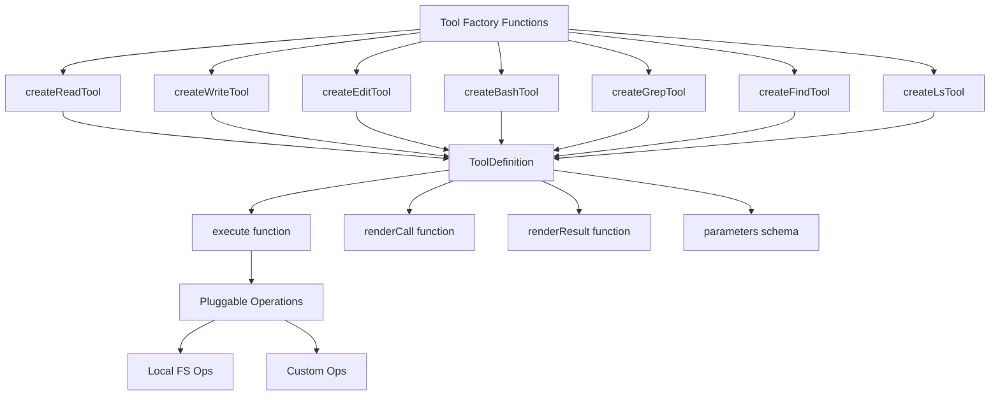
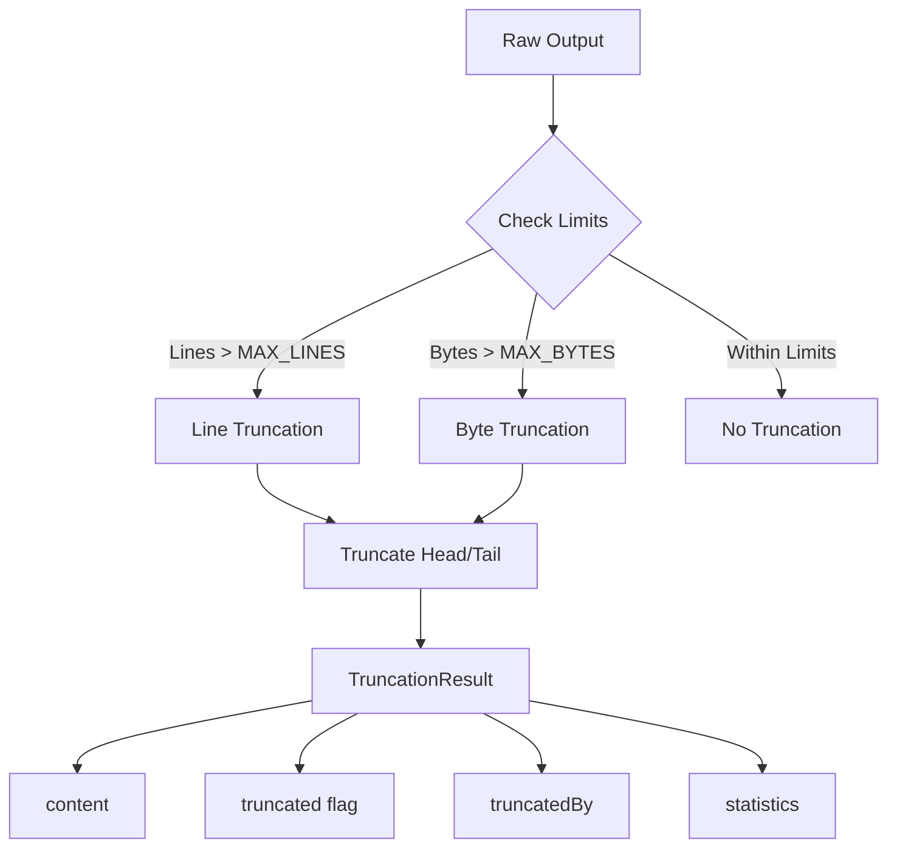
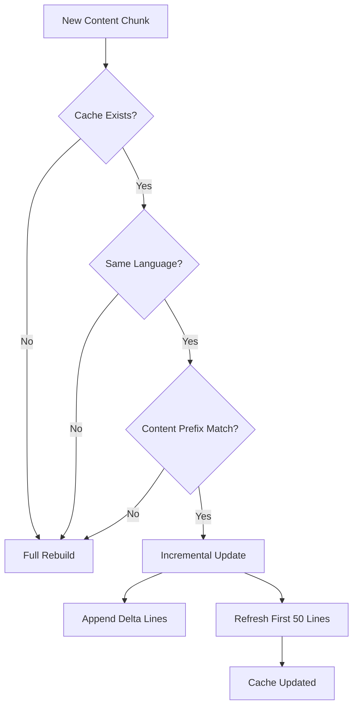
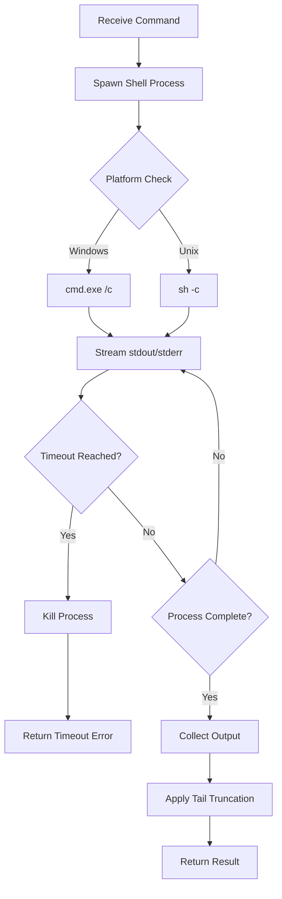
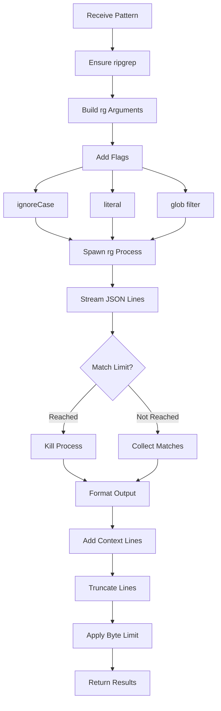
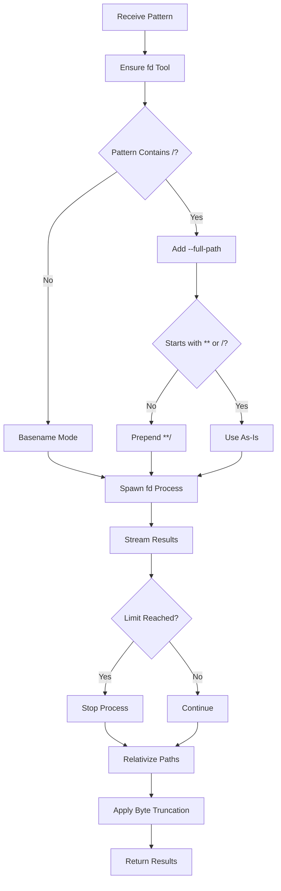
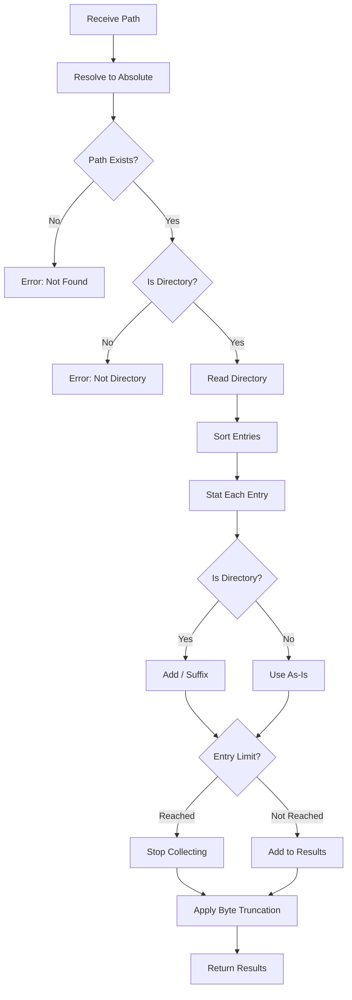

# Built-in Tools: Bash, Read, Write, Edit, Grep, Find, Ls

The `@pi-coding-agent` package provides a comprehensive suite of built-in tools that enable AI agents to interact with the filesystem and execute shell commands. These tools form the core capabilities for code manipulation, file exploration, and system interaction. The toolkit includes seven primary tools: **Read** (file reading with image support), **Write** (file creation/overwriting), **Edit** (precise file modifications), **Bash** (shell command execution), **Grep** (content search), **Find** (file discovery), and **Ls** (directory listing). Each tool is designed with safety mechanisms, output truncation, and extensibility in mind, allowing custom operations to delegate functionality to remote systems like SSH.

All tools share common design principles: they operate relative to a configurable working directory (`cwd`), implement output truncation to prevent token overflow, respect `.gitignore` patterns where applicable, and provide both tool definitions (for LLM integration) and executable implementations. The tools are exported through a unified interface that supports creating individual tools or predefined tool sets (coding tools, read-only tools, or all tools).

Sources: [packages/coding-agent/src/core/tools/index.ts:1-150](../../../packages/coding-agent/src/core/tools/index.ts#L1-L150)

## Tool Architecture Overview



Each tool follows a consistent factory pattern where `createXToolDefinition()` functions return a `ToolDefinition` object containing the tool's schema, execution logic, and rendering functions. These definitions can be wrapped into `AgentTool` instances using `wrapToolDefinition()`. The architecture separates tool logic from operation implementation through pluggable operation interfaces, enabling remote execution scenarios.

Sources: [packages/coding-agent/src/core/tools/index.ts:46-150](../../../packages/coding-agent/src/core/tools/index.ts#L46-L150), [packages/coding-agent/src/core/tools/read.ts:1-50](../../../packages/coding-agent/src/core/tools/read.ts#L1-L50)

## Common Infrastructure

### Path Resolution and Normalization

The path utilities module provides cross-platform path handling with special support for macOS filesystem quirks:

| Function | Purpose | Special Handling |
|----------|---------|------------------|
| `expandPath()` | Expands `~` to home directory | Removes `@` prefix, normalizes Unicode spaces |
| `resolveToCwd()` | Resolves paths relative to working directory | Handles absolute paths and tilde expansion |
| `resolveReadPath()` | Resolves with macOS compatibility | Tries NFD normalization, curly quote variants, AM/PM spacing |

The `resolveReadPath()` function implements multiple fallback strategies to handle macOS screenshot naming conventions, including trying Unicode NFD normalization (macOS stores filenames in decomposed form) and curly quote variants (U+2019 vs U+0027).

Sources: [packages/coding-agent/src/core/tools/path-utils.ts:1-95](../../../packages/coding-agent/src/core/tools/path-utils.ts#L1-L95)

### Output Truncation System

All tools implement a two-dimensional truncation strategy to prevent excessive token usage:



The truncation system operates with two independent limits (whichever is hit first):

- **Line Limit**: Default 2000 lines (`DEFAULT_MAX_LINES`)
- **Byte Limit**: Default 50KB (`DEFAULT_MAX_BYTES`)

Two truncation modes are available:

- **`truncateHead()`**: Keeps first N lines/bytes (for file reads, showing file beginning)
- **`truncateTail()`**: Keeps last N lines/bytes (for bash output, showing recent errors)

The system never returns partial lines except in the tail truncation edge case where the last line alone exceeds the byte limit. In that scenario, the end of the line is taken as a partial result.

Sources: [packages/coding-agent/src/core/tools/truncate.ts:1-180](../../../packages/coding-agent/src/core/tools/truncate.ts#L1-L180)

### File Mutation Queue

To prevent race conditions when multiple operations target the same file, a serialization mechanism ensures sequential execution:

```typescript
export async function withFileMutationQueue<T>(filePath: string, fn: () => Promise<T>): Promise<T>
```

The queue uses a Map keyed by resolved file paths (using `realpathSync.native` to handle symlinks). Operations on different files still run in parallel, but operations on the same file are serialized. The queue automatically cleans itself up when all operations for a file complete.

Sources: [packages/coding-agent/src/core/tools/file-mutation-queue.ts:1-42](../../../packages/coding-agent/src/core/tools/file-mutation-queue.ts#L1-L42)

## Read Tool

The Read tool reads file contents with automatic image detection and support for partial file reading through offset/limit parameters.

### Schema and Parameters

```typescript
{
  path: string;           // File path (relative or absolute)
  offset?: number;        // Starting line number (1-indexed)
  limit?: number;         // Maximum lines to read
}
```

### Features and Behavior

| Feature | Description | Default |
|---------|-------------|---------|
| Text File Reading | UTF-8 text with syntax highlighting | Enabled |
| Image Support | JPEG, PNG, GIF, WebP detection and base64 encoding | Enabled |
| Auto-resize Images | Resize to 2000x2000 max before sending to model | Enabled |
| Truncation | Head truncation (first N lines/bytes) | 2000 lines / 50KB |
| Offset/Limit | Partial file reading for large files | Optional |
| Path Variants | macOS screenshot name normalization | Automatic |

The tool automatically detects supported image MIME types and returns them as `ImageContent` blocks. For text files, it applies `truncateHead()` and provides actionable continuation instructions when truncated.

### Truncation Handling

When truncation occurs, the tool appends contextual notices to guide the agent:

- **First line exceeds limit**: Suggests using bash with `sed` and `head -c`
- **Line limit hit**: Shows line range and suggests using `offset` parameter to continue
- **Byte limit hit**: Shows byte limit and suggests continuation with `offset`
- **User limit exhausted**: Shows remaining lines and next offset value

Sources: [packages/coding-agent/src/core/tools/read.ts:1-220](../../../packages/coding-agent/src/core/tools/read.ts#L1-L220)

### Pluggable Operations

```typescript
export interface ReadOperations {
  readFile: (absolutePath: string) => Promise<Buffer>;
  access: (absolutePath: string) => Promise<void>;
  detectImageMimeType?: (absolutePath: string) => Promise<string | null | undefined>;
}
```

Custom operations enable delegating file reading to remote systems. The default implementation uses Node.js `fs` module functions.

Sources: [packages/coding-agent/src/core/tools/read.ts:25-35](../../../packages/coding-agent/src/core/tools/read.ts#L25-L35)

## Write Tool

The Write tool creates new files or completely overwrites existing files with provided content. It automatically creates parent directories as needed.

### Schema and Parameters

```typescript
{
  path: string;      // File path (relative or absolute)
  content: string;   // Content to write
}
```

### Key Characteristics

- **Atomic Operations**: Uses `withFileMutationQueue()` to serialize writes to the same file
- **Directory Creation**: Automatically creates parent directories with `mkdir -p` semantics
- **Overwrite Behavior**: Completely replaces existing file contents
- **Syntax Highlighting**: Renders file content with language-specific highlighting in UI
- **Incremental Rendering**: Caches highlighted content during streaming for performance

### Rendering Optimization

The Write tool implements an incremental highlighting cache to optimize rendering during streaming tool calls:



The cache tracks the raw content, language, normalized lines, and highlighted lines. When new content arrives during streaming, it checks if it can incrementally append rather than re-highlighting the entire content. The first 50 lines are always re-highlighted as a block for better syntax accuracy.

Sources: [packages/coding-agent/src/core/tools/write.ts:1-250](../../../packages/coding-agent/src/core/tools/write.ts#L1-L250)

### Pluggable Operations

```typescript
export interface WriteOperations {
  writeFile: (absolutePath: string, content: string) => Promise<void>;
  mkdir: (dir: string) => Promise<void>;
}
```

Sources: [packages/coding-agent/src/core/tools/write.ts:15-22](../../../packages/coding-agent/src/core/tools/write.ts#L15-L22)

## Edit Tool

The Edit tool performs precise, line-based modifications to existing files using a search-and-replace mechanism. It is designed for surgical changes rather than complete file rewrites.

### Schema and Parameters

```typescript
{
  path: string;              // File path (relative or absolute)
  old_str: string;           // Exact text to search for (must match exactly)
  new_str: string;           // Replacement text
  occurrence?: number;       // Which occurrence to replace (1-indexed, default: 1)
}
```

### Edit Mechanism

The edit operation follows a strict matching algorithm:

1. **Read File**: Load current file contents
2. **Search**: Find exact match of `old_str` (whitespace-sensitive)
3. **Occurrence Selection**: If multiple matches exist, select specified occurrence
4. **Replace**: Substitute matched text with `new_str`
5. **Write Back**: Save modified content using `withFileMutationQueue()`

### Diff Visualization

The tool generates a unified diff format output showing the changes:

```
--- original
+++ modified
@@ -10,3 +10,3 @@
 context line
-old content
+new content
 context line
```

The diff includes 3 lines of context before and after the change for clarity. Diff generation is handled by the `generateUnifiedDiff()` function which implements the unified diff format specification.

Sources: [packages/coding-agent/src/core/tools/edit.ts:1-350](../../../packages/coding-agent/src/core/tools/edit.ts#L1-L350), [packages/coding-agent/src/core/tools/edit-diff.ts:1-150](../../../packages/coding-agent/src/core/tools/edit-diff.ts#L1-L150)

### Error Handling

Common error scenarios:

| Error Condition | Message Pattern |
|----------------|-----------------|
| File not found | `File not found: {path}` |
| No match found | `Could not find exact match for old_str in {path}` |
| Invalid occurrence | `Occurrence {n} requested but only {m} matches found` |
| Multiple matches | Diff shows all matches with occurrence numbers |

## Bash Tool

The Bash tool executes shell commands in a subprocess with streaming output support and timeout protection.

### Schema and Parameters

```typescript
{
  command: string;        // Shell command to execute
  timeout?: number;       // Timeout in seconds (default: 300)
}
```

### Execution Flow



### Key Features

| Feature | Implementation | Default |
|---------|---------------|---------|
| Shell Selection | `sh -c` on Unix, `cmd.exe /c` on Windows | Platform-specific |
| Output Streaming | Real-time stdout/stderr capture | Enabled |
| Timeout Protection | Kills process after timeout | 300 seconds |
| Truncation | Tail truncation (keeps last N lines/bytes) | 2000 lines / 50KB |
| Signal Handling | Respects AbortSignal for cancellation | Enabled |
| Exit Code | Captured and reported | Always included |

### Tail Truncation Rationale

Bash output uses `truncateTail()` instead of `truncateHead()` because the end of command output typically contains the most relevant information (errors, final results, exit status). This is especially important for long-running commands.

Sources: [packages/coding-agent/src/core/tools/bash.ts:1-400](../../../packages/coding-agent/src/core/tools/bash.ts#L1-L400)

### Pluggable Operations

```typescript
export interface BashOperations {
  spawn: (command: string, options: BashSpawnContext) => Promise<{
    stdout: string;
    stderr: string;
    exitCode: number | null;
    signal: string | null;
    timedOut: boolean;
  }>;
}
```

The spawn operation can be overridden to execute commands on remote systems. The context includes timeout, working directory, signal, and optional spawn hooks for custom process management.

Sources: [packages/coding-agent/src/core/tools/bash.ts:20-45](../../../packages/coding-agent/src/core/tools/bash.ts#L20-L45)

## Grep Tool

The Grep tool searches file contents for patterns using ripgrep (`rg`) with support for regex, glob filtering, and context lines.

### Schema and Parameters

```typescript
{
  pattern: string;          // Search pattern (regex or literal)
  path?: string;            // Directory or file to search (default: cwd)
  glob?: string;            // Filter files by glob (e.g., '*.ts')
  ignoreCase?: boolean;     // Case-insensitive search
  literal?: boolean;        // Treat pattern as literal string
  context?: number;         // Lines of context before/after match
  limit?: number;           // Maximum matches to return (default: 100)
}
```

### Search Process



### Output Format

Match lines follow the format: `{file}:{line}: {content}`  
Context lines follow the format: `{file}-{line}- {content}`

Long lines are truncated to 500 characters with a `[truncated]` suffix to keep output compact.

### Features

| Feature | Implementation | Notes |
|---------|---------------|-------|
| Regex Support | Native ripgrep regex | Default mode |
| Literal Search | `--fixed-strings` flag | Via `literal` parameter |
| Case Sensitivity | `--ignore-case` flag | Via `ignoreCase` parameter |
| Glob Filtering | `--glob` flag | Filters by file pattern |
| Context Lines | Custom formatting | Reads file to show context |
| `.gitignore` Respect | ripgrep default | Automatic |
| Match Limit | Process termination | Default: 100 matches |
| Line Truncation | 500 chars max | `GREP_MAX_LINE_LENGTH` |

Sources: [packages/coding-agent/src/core/tools/grep.ts:1-300](../../../packages/coding-agent/src/core/tools/grep.ts#L1-L300)

### Context Line Formatting

When `context` is specified, the tool reads the original file to retrieve surrounding lines. This is necessary because ripgrep's JSON output doesn't include full context. The formatting logic:

1. Collects matches during streaming (file path, line number, line text)
2. After ripgrep exits, reads each file from cache
3. Extracts context lines (N before and after)
4. Formats with `:` for match lines, `-` for context lines
5. Truncates long lines to prevent token overflow

Sources: [packages/coding-agent/src/core/tools/grep.ts:150-250](../../../packages/coding-agent/src/core/tools/grep.ts#L150-L250)

### Pluggable Operations

```typescript
export interface GrepOperations {
  isDirectory: (absolutePath: string) => Promise<boolean> | boolean;
  readFile: (absolutePath: string) => Promise<string> | string;
}
```

Sources: [packages/coding-agent/src/core/tools/grep.ts:30-38](../../../packages/coding-agent/src/core/tools/grep.ts#L30-L38)

## Find Tool

The Find tool searches for files matching glob patterns using `fd` with `.gitignore` respect and recursive search.

### Schema and Parameters

```typescript
{
  pattern: string;      // Glob pattern (e.g., '*.ts', '**/*.json')
  path?: string;        // Directory to search (default: cwd)
  limit?: number;       // Maximum results (default: 1000)
}
```

### Pattern Matching Modes

The tool automatically selects the appropriate `fd` mode based on pattern structure:

| Pattern Type | Mode | Example | fd Flags |
|-------------|------|---------|----------|
| Basename | `--glob` only | `*.ts` | Matches against filename |
| Path-containing | `--glob --full-path` | `src/**/*.ts` | Matches against full path with `**/` prefix |

When the pattern contains `/`, the tool adds `--full-path` and prepends `**/` to ensure proper matching against the full candidate path.

### Search Flow



### Output Processing

Results are post-processed to ensure consistent output:

1. **Path Relativization**: Converts absolute paths to relative paths against search directory
2. **POSIX Normalization**: Converts backslashes to forward slashes for cross-platform consistency
3. **Directory Suffix Preservation**: Maintains trailing `/` for directories if present in fd output

Sources: [packages/coding-agent/src/core/tools/find.ts:1-280](../../../packages/coding-agent/src/core/tools/find.ts#L1-L280)

### fd Configuration

The tool uses these `fd` flags:

- `--glob`: Enable glob pattern matching
- `--color=never`: Disable ANSI color codes
- `--hidden`: Include hidden files (respects `.gitignore`)
- `--no-require-git`: Apply `.gitignore` rules even outside git repos
- `--max-results`: Hard limit on result count
- `--full-path`: Match against full path (when pattern contains `/`)

Sources: [packages/coding-agent/src/core/tools/find.ts:120-145](../../../packages/coding-agent/src/core/tools/find.ts#L120-L145)

### Pluggable Operations

```typescript
export interface FindOperations {
  exists: (absolutePath: string) => Promise<boolean> | boolean;
  glob: (pattern: string, cwd: string, options: { ignore: string[]; limit: number }) 
    => Promise<string[]> | string[];
}
```

Custom glob implementations can replace the fd-based search for remote filesystem scenarios.

Sources: [packages/coding-agent/src/core/tools/find.ts:35-43](../../../packages/coding-agent/src/core/tools/find.ts#L35-L43)

## Ls Tool

The Ls tool lists directory contents with directory indicators and alphabetical sorting.

### Schema and Parameters

```typescript
{
  path?: string;        // Directory to list (default: cwd)
  limit?: number;       // Maximum entries (default: 500)
}
```

### Features

| Feature | Implementation | Notes |
|---------|---------------|-------|
| Sorting | Case-insensitive alphabetical | `toLowerCase()` comparison |
| Directory Indicator | Trailing `/` suffix | Added to directory names |
| Dotfiles | Included | No filtering |
| Entry Limit | Configurable cap | Default: 500 entries |
| Truncation | Byte limit only | 50KB max output |
| Error Handling | Path validation | Checks existence and directory status |

### Output Format

Each entry is listed on a separate line:
```
file1.txt
file2.js
subdirectory/
.hidden-file
```

Directories are distinguished by the trailing `/` character.

### Execution Logic



The tool skips entries it cannot stat (permission errors, broken symlinks) rather than failing the entire operation.

Sources: [packages/coding-agent/src/core/tools/ls.ts:1-180](../../../packages/coding-agent/src/core/tools/ls.ts#L1-L180)

### Pluggable Operations

```typescript
export interface LsOperations {
  exists: (absolutePath: string) => Promise<boolean> | boolean;
  stat: (absolutePath: string) => Promise<{ isDirectory: () => boolean }> | { isDirectory: () => boolean };
  readdir: (absolutePath: string) => Promise<string[]> | string[];
}
```

Sources: [packages/coding-agent/src/core/tools/ls.ts:25-33](../../../packages/coding-agent/src/core/tools/ls.ts#L25-L33)

## Tool Sets and Factory Functions

The tools module provides convenience functions for creating common tool combinations:

### Predefined Tool Sets

| Function | Tools Included | Use Case |
|----------|---------------|----------|
| `createCodingTools()` | read, bash, edit, write | Full coding agent capabilities |
| `createReadOnlyTools()` | read, grep, find, ls | Safe exploration without modification |
| `createAllTools()` | All 7 tools | Complete toolkit |

### Factory Patterns

```typescript
// Create individual tool
const readTool = createReadTool(cwd, { autoResizeImages: true });

// Create tool definition (for LLM schema)
const readDef = createReadToolDefinition(cwd, options);

// Create tool set
const codingTools = createCodingTools(cwd, {
  read: { autoResizeImages: false },
  bash: { timeout: 600 }
});

// Create all tool definitions as record
const allDefs = createAllToolDefinitions(cwd, options);
```

Each factory function accepts a `cwd` parameter (working directory) and optional tool-specific options. The options are typed per-tool and passed through to the respective tool constructors.

Sources: [packages/coding-agent/src/core/tools/index.ts:80-150](../../../packages/coding-agent/src/core/tools/index.ts#L80-L150)

## Rendering System

All tools implement a dual rendering system for terminal UI display:

### Render Functions

1. **`renderCall(args, theme, context)`**: Renders the tool invocation with arguments
2. **`renderResult(result, options, theme, context)`**: Renders the tool output

### Rendering Features

- **Syntax Highlighting**: File content displayed with language-specific colors
- **Expandable Output**: Truncated output can be expanded with keyboard shortcut
- **Streaming Support**: Incremental updates during tool execution
- **Theme Integration**: Uses project theme system for consistent colors
- **Component Reuse**: Caches TUI components for performance

### Render Context

The `context` parameter provides:

- `lastComponent`: Previous render component for reuse
- `expanded`: Whether output should be fully expanded
- `isPartial`: Whether this is an intermediate streaming update
- `argsComplete`: Whether all arguments have been received
- `showImages`: Whether to display image content
- `isError`: Whether the result is an error

Sources: [packages/coding-agent/src/core/tools/read.ts:180-220](../../../packages/coding-agent/src/core/tools/read.ts#L180-L220), [packages/coding-agent/src/core/tools/write.ts:150-200](../../../packages/coding-agent/src/core/tools/write.ts#L150-L200)

## Summary

The built-in tools provide a robust, extensible foundation for AI coding agents to interact with filesystems and execute commands. The architecture emphasizes safety through output truncation, race condition prevention via mutation queues, and extensibility through pluggable operations. Each tool is carefully designed with specific use cases in mind: Read for file examination, Write for creation, Edit for precision changes, Bash for command execution, Grep for content search, Find for file discovery, and Ls for directory exploration. The consistent API design, comprehensive error handling, and thoughtful UX features (like actionable truncation notices) make these tools both powerful and user-friendly for AI-assisted development workflows.