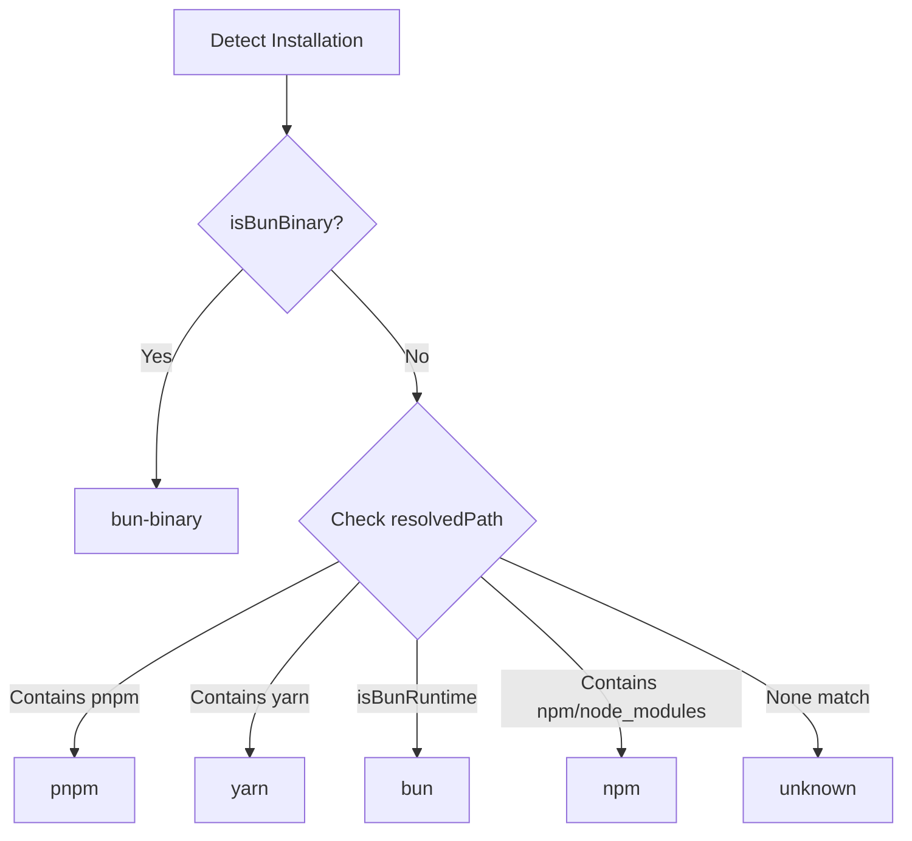
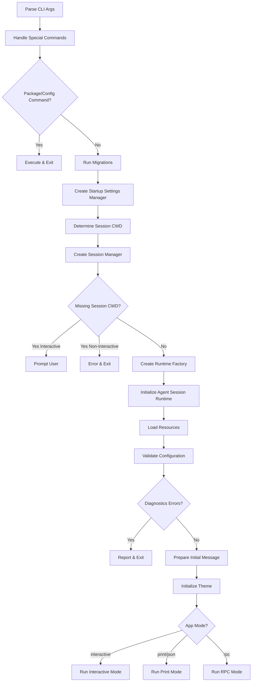
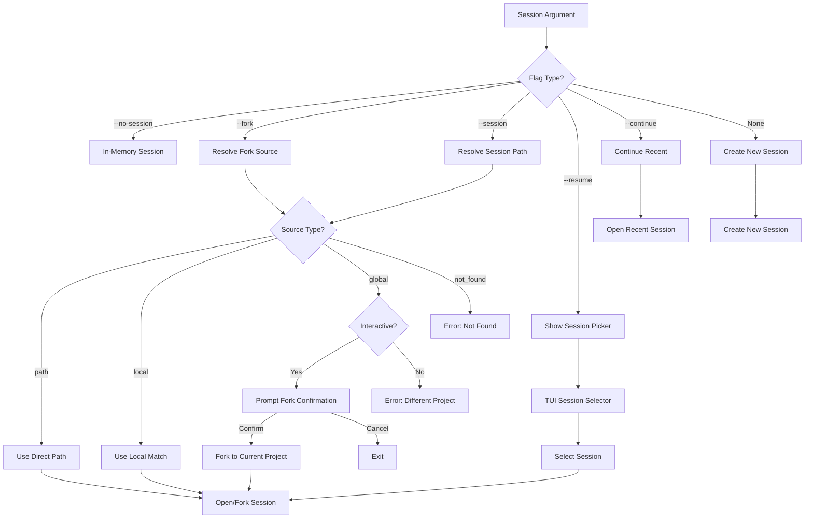
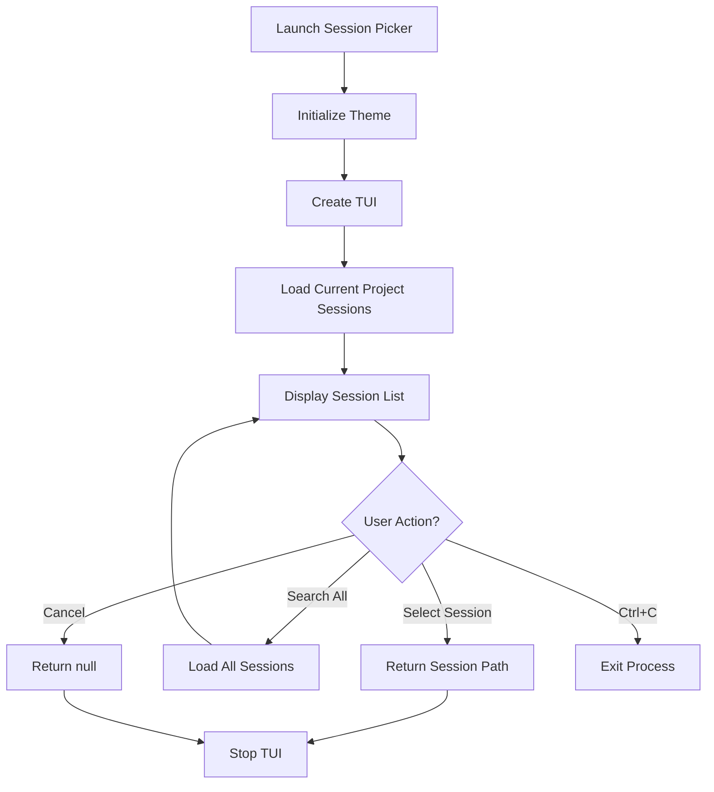

# CLI Arguments, Configuration & Startup

The Coding Agent CLI provides a comprehensive command-line interface for interacting with the AI coding assistant. The startup process handles argument parsing, configuration loading, session management, and runtime initialization. This system supports multiple execution modes (interactive, print, JSON, RPC), flexible model selection, session persistence, and an extensible architecture for tools and extensions. The CLI is designed to work as both a standalone binary (Bun-compiled) and as an npm-installed package, with automatic detection of the installation method and appropriate asset path resolution.

The startup sequence orchestrates several key subsystems: argument parsing, migration execution, settings management, session resolution, authentication storage, model registry initialization, resource loading (extensions, skills, themes), and runtime creation. The architecture is designed to support both project-local and global configurations, with careful handling of session context and working directory resolution.

Sources: [packages/coding-agent/src/main.ts](../../../packages/coding-agent/src/main.ts), [packages/coding-agent/src/cli/args.ts](../../../packages/coding-agent/src/cli/args.ts), [packages/coding-agent/src/config.ts](../../../packages/coding-agent/src/config.ts)

---

## CLI Argument Parsing

The argument parser handles a comprehensive set of command-line options for controlling the agent's behavior, model selection, session management, and resource loading. The parser supports both short and long flag formats, handles unknown flags for extension compatibility, and provides detailed diagnostics for invalid inputs.

### Argument Structure

The `Args` interface defines all supported CLI arguments:

| Category | Argument | Type | Description |
|----------|----------|------|-------------|
| **Model Selection** | `--provider` | string | Provider name (default: google) |
| | `--model` | string | Model pattern or ID (supports "provider/id" and ":<thinking>") |
| | `--api-key` | string | API key override |
| | `--models` | string[] | Comma-separated model patterns for Ctrl+P cycling |
| | `--thinking` | ThinkingLevel | Thinking level: off, minimal, low, medium, high, xhigh |
| **Session Management** | `--continue, -c` | boolean | Continue previous session |
| | `--resume, -r` | boolean | Select a session to resume |
| | `--session` | string | Use specific session file or partial UUID |
| | `--fork` | string | Fork specific session into a new session |
| | `--session-dir` | string | Directory for session storage and lookup |
| | `--no-session` | boolean | Don't save session (ephemeral) |
| **Mode & Output** | `--mode` | Mode | Output mode: text, json, or rpc |
| | `--print, -p` | boolean | Non-interactive mode: process prompt and exit |
| | `--export` | string | Export session file to HTML and exit |
| **Tools & Resources** | `--tools` | string[] | Comma-separated allowlist of tool names |
| | `--no-tools` | boolean | Disable all tools by default |
| | `--extension, -e` | string[] | Load extension file(s) |
| | `--no-extensions, -ne` | boolean | Disable extension discovery |
| | `--skill` | string[] | Load skill file(s) or directory |
| | `--no-skills, -ns` | boolean | Disable skills discovery |
| | `--prompt-template` | string[] | Load prompt template file(s) |
| | `--no-prompt-templates, -np` | boolean | Disable prompt template discovery |
| | `--theme` | string[] | Load theme file(s) |
| | `--no-themes` | boolean | Disable theme discovery |
| | `--no-context-files, -nc` | boolean | Disable AGENTS.md and CLAUDE.md discovery |
| **System Prompts** | `--system-prompt` | string | System prompt override |
| | `--append-system-prompt` | string[] | Append text or file contents to system prompt |
| **Utility** | `--list-models` | string \| true | List available models with optional fuzzy search |
| | `--verbose` | boolean | Force verbose startup |
| | `--offline` | boolean | Disable startup network operations |
| | `--help, -h` | boolean | Show help |
| | `--version, -v` | boolean | Show version number |

Sources: [packages/coding-agent/src/cli/args.ts:14-47](../../../packages/coding-agent/src/cli/args.ts#L14-L47)

### Parsing Logic

The `parseArgs` function processes command-line arguments with special handling for:

- **File arguments**: Arguments prefixed with `@` are treated as file references (e.g., `@prompt.md`)
- **Unknown flags**: Flags not recognized by the parser are stored in `unknownFlags` for extension processing
- **Value extraction**: Supports both `--flag=value` and `--flag value` syntax
- **Diagnostics**: Collects warnings and errors for invalid arguments

```typescript
export function parseArgs(args: string[]): Args {
	const result: Args = {
		messages: [],
		fileArgs: [],
		unknownFlags: new Map(),
		diagnostics: [],
	};

	for (let i = 0; i < args.length; i++) {
		const arg = args[i];
		// ... parsing logic for each flag type
		if (arg.startsWith("@")) {
			result.fileArgs.push(arg.slice(1)); // Remove @ prefix
		} else if (arg.startsWith("--")) {
			// Handle unknown flags for extensions
			const eqIndex = arg.indexOf("=");
			if (eqIndex !== -1) {
				result.unknownFlags.set(arg.slice(2, eqIndex), arg.slice(eqIndex + 1));
			} else {
				const flagName = arg.slice(2);
				const next = args[i + 1];
				if (next !== undefined && !next.startsWith("-") && !next.startsWith("@")) {
					result.unknownFlags.set(flagName, next);
					i++;
				} else {
					result.unknownFlags.set(flagName, true);
				}
			}
		}
	}

	return result;
}
```

Sources: [packages/coding-agent/src/cli/args.ts:54-148](../../../packages/coding-agent/src/cli/args.ts#L54-L148)

---

## Configuration System

The configuration system manages paths for both package assets (bundled with the executable) and user-specific configuration files. It automatically detects the installation method and execution environment to resolve paths correctly.

### Installation Detection

The system detects how the agent was installed to provide appropriate update instructions and path resolution:



Sources: [packages/coding-agent/src/config.ts:17-58](../../../packages/coding-agent/src/config.ts#L17-L58)

### Package Asset Paths

The `getPackageDir()` function resolves the base directory for package assets with support for multiple deployment scenarios:

- **Bun binary**: Returns directory containing the executable
- **Node.js (dist/)**: Returns `__dirname` (the dist/ directory)
- **tsx (src/)**: Returns parent directory (package root)
- **Environment override**: `PI_PACKAGE_DIR` can override for Nix/Guix store paths

Key asset directories:

| Asset Type | Function | Default Location |
|------------|----------|------------------|
| Themes | `getThemesDir()` | `theme/` (binary) or `dist/modes/interactive/theme/` |
| Export Templates | `getExportTemplateDir()` | `export-html/` (binary) or `dist/core/export-html/` |
| Interactive Assets | `getInteractiveAssetsDir()` | `assets/` (binary) or `dist/modes/interactive/assets/` |
| Package Metadata | `getPackageJsonPath()` | `package.json` in package root |
| Documentation | `getReadmePath()`, `getDocsPath()` | `README.md`, `docs/` in package root |

Sources: [packages/coding-agent/src/config.ts:60-153](../../../packages/coding-agent/src/config.ts#L60-L153)

### User Configuration Paths

User-specific configuration is stored in the agent directory (default: `~/.pi/agent/`), configurable via the `PI_CODING_AGENT_DIR` environment variable:

| File/Directory | Function | Purpose |
|----------------|----------|---------|
| `themes/` | `getCustomThemesDir()` | User's custom themes |
| `models.json` | `getModelsPath()` | Model registry configuration |
| `auth.json` | `getAuthPath()` | Authentication credentials |
| `settings.json` | `getSettingsPath()` | User settings |
| `tools/` | `getToolsDir()` | Custom tool definitions |
| `bin/` | `getBinDir()` | Managed binaries (fd, rg) |
| `prompts/` | `getPromptsDir()` | Prompt templates |
| `sessions/` | `getSessionsDir()` | Session storage |
| `pi-debug.log` | `getDebugLogPath()` | Debug log file |

Sources: [packages/coding-agent/src/config.ts:180-216](../../../packages/coding-agent/src/config.ts#L180-L216)

---

## Startup Sequence

The main startup sequence orchestrates initialization of all subsystems in a carefully ordered flow to handle dependencies between components.



Sources: [packages/coding-agent/src/main.ts:170-413](../../../packages/coding-agent/src/main.ts#L170-L413)

### Key Initialization Steps

1. **Argument Parsing**: Parse CLI arguments and validate flags
2. **Offline Mode Detection**: Check `--offline` flag or `PI_OFFLINE` environment variable
3. **Special Command Handling**: Process `install`, `remove`, `update`, `list`, `config` commands
4. **Migration Execution**: Run data migrations and collect deprecation warnings
5. **Settings Manager Creation**: Load project-local and global settings
6. **Session Resolution**: Handle `--continue`, `--resume`, `--session`, `--fork` flags
7. **Runtime Factory Creation**: Build factory for creating agent session runtime
8. **Resource Loading**: Load extensions, skills, themes, prompt templates
9. **Diagnostic Collection**: Gather warnings and errors from all subsystems
10. **Mode Selection**: Determine execution mode (interactive, print, json, rpc)

Sources: [packages/coding-agent/src/main.ts:233-413](../../../packages/coding-agent/src/main.ts#L233-L413)

---

## Session Management

The session management system handles session creation, continuation, resumption, and forking with support for both project-local and global session lookup.

### Session Resolution Flow



Sources: [packages/coding-agent/src/main.ts:96-170](../../../packages/coding-agent/src/main.ts#L96-L170)

### Session Path Resolution

The `resolveSessionPath` function matches session arguments against available sessions:

1. **Direct Path**: If argument contains `/`, `\`, or ends with `.jsonl`, treat as file path
2. **Local Match**: Search current project's sessions for ID prefix match
3. **Global Match**: Search all projects for ID prefix match
4. **Not Found**: Return error result

When a session from a different project is selected in interactive mode, the user is prompted to fork it into the current project. In non-interactive mode, this results in an error.

Sources: [packages/coding-agent/src/main.ts:96-130](../../../packages/coding-agent/src/main.ts#L96-L130)

### Fork Validation

The `--fork` flag is mutually exclusive with other session flags:

```typescript
function validateForkFlags(parsed: Args): void {
	if (!parsed.fork) return;

	const conflictingFlags = [
		parsed.session ? "--session" : undefined,
		parsed.continue ? "--continue" : undefined,
		parsed.resume ? "--resume" : undefined,
		parsed.noSession ? "--no-session" : undefined,
	].filter((flag): flag is string => flag !== undefined);

	if (conflictingFlags.length > 0) {
		console.error(chalk.red(`Error: --fork cannot be combined with ${conflictingFlags.join(", ")}`));
		process.exit(1);
	}
}
```

Sources: [packages/coding-agent/src/main.ts:145-159](../../../packages/coding-agent/src/main.ts#L145-L159)

---

## Model Resolution

The model resolution system handles model selection from CLI arguments, settings, and scoped model patterns with support for provider prefixes, thinking level shortcuts, and fuzzy matching.

### Model Selection Priority

The system resolves the initial model using the following priority:

1. **CLI Model**: `--model <pattern>` with optional `--provider <name>` or `<provider>/<pattern>` syntax
2. **Scoped Models**: First model from `--models` patterns if no CLI model specified
3. **Settings Default**: Saved default provider/model from settings
4. **Session History**: Existing model from continued/resumed session

### Model Pattern Syntax

The `--model` flag supports multiple formats:

| Format | Example | Description |
|--------|---------|-------------|
| Simple pattern | `sonnet` | Fuzzy match against model IDs |
| Provider prefix | `anthropic/sonnet` | Match within specific provider |
| Thinking shorthand | `sonnet:high` | Model pattern with thinking level |
| Full ID | `claude-3-5-sonnet-20241022` | Exact model ID |

Sources: [packages/coding-agent/src/main.ts:283-322](../../../packages/coding-agent/src/main.ts#L283-L322)

### Scoped Models for Cycling

The `--models` flag defines the set of models available for Ctrl+P cycling:

```typescript
const modelPatterns = parsed.models ?? settingsManager.getEnabledModels();
const scopedModels =
	modelPatterns && modelPatterns.length > 0 
		? await resolveModelScope(modelPatterns, modelRegistry) 
		: [];
```

Scoped models support:
- **Glob patterns**: `anthropic/*`, `*sonnet*`
- **Fuzzy matching**: `sonnet` matches `claude-3-5-sonnet-20241022`
- **Thinking levels**: `sonnet:high`, `haiku:low` for fixed thinking per model
- **Multiple patterns**: Comma-separated list

Sources: [packages/coding-agent/src/main.ts:286-288](../../../packages/coding-agent/src/main.ts#L286-L288)

---

## File Argument Processing

The CLI supports `@file` syntax for including file contents and images in prompts. The file processor handles text files, images, and automatic image resizing.

### Processing Flow

```mermaid
graph TD
    A[@file Argument] --> B[Remove @ Prefix]
    B --> C[Expand Path]
    C --> D[Resolve Absolute Path]
    D --> E{File Exists?}
    E -->|No| F[Error & Exit]
    E -->|Yes| G{File Empty?}
    G -->|Yes| H[Skip File]
    G -->|No| I[Detect MIME Type]
    I --> J{Image?}
    J -->|Yes| K{Auto-Resize?}
    K -->|Yes| L[Resize Image]
    K -->|No| M[Read Raw Image]
    L --> N{Resize Success?}
    N -->|Yes| O[Add to Images]
    N -->|No| P[Add Omission Note]
    M --> O
    O --> Q[Add File Reference]
    J -->|No| R[Read as Text]
    R --> S[Wrap in file Tags]
```

Sources: [packages/coding-agent/src/cli/file-processor.ts:18-82](../../../packages/coding-agent/src/cli/file-processor.ts#L18-L82)

### Image Handling

Images are automatically detected by MIME type and processed:

- **Supported formats**: JPEG, PNG, GIF, WebP
- **Auto-resize**: Images are resized to 2000x2000 max (configurable via settings)
- **Base64 encoding**: Images are encoded as base64 for API transmission
- **Dimension notes**: Resized images include dimension information in file reference

```typescript
if (mimeType) {
	const content = await readFile(absolutePath);
	const base64Content = content.toString("base64");

	if (autoResizeImages) {
		const resized = await resizeImage({ type: "image", data: base64Content, mimeType });
		if (!resized) {
			text += `<file name="${absolutePath}">[Image omitted: could not be resized below the inline image size limit.]</file>\n`;
			continue;
		}
		dimensionNote = formatDimensionNote(resized);
		attachment = {
			type: "image",
			mimeType: resized.mimeType,
			data: resized.data,
		};
	}
	images.push(attachment);
}
```

Sources: [packages/coding-agent/src/cli/file-processor.ts:49-71](../../../packages/coding-agent/src/cli/file-processor.ts#L49-L71)

---

## Initial Message Construction

The initial message builder combines multiple input sources into a single prompt for non-interactive mode or the first message in interactive mode.

### Input Sources

The system combines inputs in the following order:

1. **Piped stdin**: Content piped to the command via stdin
2. **File arguments**: Text and image content from `@file` arguments
3. **CLI messages**: First positional argument as the main prompt

```typescript
export function buildInitialMessage({
	parsed,
	fileText,
	fileImages,
	stdinContent,
}: InitialMessageInput): InitialMessageResult {
	const parts: string[] = [];
	if (stdinContent !== undefined) {
		parts.push(stdinContent);
	}
	if (fileText) {
		parts.push(fileText);
	}

	if (parsed.messages.length > 0) {
		parts.push(parsed.messages[0]);
		parsed.messages.shift();
	}

	return {
		initialMessage: parts.length > 0 ? parts.join("") : undefined,
		initialImages: fileImages && fileImages.length > 0 ? fileImages : undefined,
	};
}
```

Sources: [packages/coding-agent/src/cli/initial-message.ts:10-36](../../../packages/coding-agent/src/cli/initial-message.ts#L10-L36)

### Stdin Detection

The system detects piped stdin by checking if stdin is a TTY:

```typescript
async function readPipedStdin(): Promise<string | undefined> {
	// If stdin is a TTY, we're running interactively - don't read stdin
	if (process.stdin.isTTY) {
		return undefined;
	}

	return new Promise((resolve) => {
		let data = "";
		process.stdin.setEncoding("utf8");
		process.stdin.on("data", (chunk) => {
			data += chunk;
		});
		process.stdin.on("end", () => {
			resolve(data.trim() || undefined);
		});
		process.stdin.resume();
	});
}
```

When stdin is piped, the app mode automatically switches to "print" mode (non-interactive).

Sources: [packages/coding-agent/src/main.ts:59-77](../../../packages/coding-agent/src/main.ts#L59-L77)

---

## Environment Variables

The CLI supports extensive environment variable configuration for API keys, runtime behavior, and path overrides.

### API Keys

| Variable | Provider | Description |
|----------|----------|-------------|
| `ANTHROPIC_API_KEY` | Anthropic | Claude API key |
| `ANTHROPIC_OAUTH_TOKEN` | Anthropic | OAuth token (alternative to API key) |
| `OPENAI_API_KEY` | OpenAI | GPT API key |
| `AZURE_OPENAI_API_KEY` | Azure OpenAI | Azure OpenAI API key |
| `AZURE_OPENAI_BASE_URL` | Azure OpenAI | Base URL (https://{resource}.openai.azure.com/openai/v1) |
| `AZURE_OPENAI_RESOURCE_NAME` | Azure OpenAI | Resource name (alternative to base URL) |
| `AZURE_OPENAI_API_VERSION` | Azure OpenAI | API version (default: v1) |
| `AZURE_OPENAI_DEPLOYMENT_NAME_MAP` | Azure OpenAI | Model=deployment map (comma-separated) |
| `GEMINI_API_KEY` | Google | Gemini API key |
| `GROQ_API_KEY` | Groq | Groq API key |
| `CEREBRAS_API_KEY` | Cerebras | Cerebras API key |
| `XAI_API_KEY` | xAI | Grok API key |
| `FIREWORKS_API_KEY` | Fireworks | Fireworks API key |
| `OPENROUTER_API_KEY` | OpenRouter | OpenRouter API key |
| `AI_GATEWAY_API_KEY` | Vercel | AI Gateway API key |
| `ZAI_API_KEY` | ZAI | ZAI API key |
| `MISTRAL_API_KEY` | Mistral | Mistral API key |
| `MINIMAX_API_KEY` | MiniMax | MiniMax API key |
| `OPENCODE_API_KEY` | OpenCode | OpenCode Zen/OpenCode Go API key |
| `KIMI_API_KEY` | Kimi | Kimi For Coding API key |
| `AWS_PROFILE` | Amazon Bedrock | AWS profile |
| `AWS_ACCESS_KEY_ID` | Amazon Bedrock | AWS access key |
| `AWS_SECRET_ACCESS_KEY` | Amazon Bedrock | AWS secret key |
| `AWS_BEARER_TOKEN_BEDROCK` | Amazon Bedrock | Bedrock API key (bearer token) |
| `AWS_REGION` | Amazon Bedrock | AWS region (e.g., us-east-1) |

Sources: [packages/coding-agent/src/cli/args.ts:255-282](../../../packages/coding-agent/src/cli/args.ts#L255-L282)

### Runtime Configuration

| Variable | Default | Description |
|----------|---------|-------------|
| `PI_CODING_AGENT_DIR` | `~/.pi/agent` | Session storage directory |
| `PI_PACKAGE_DIR` | (auto-detected) | Override package directory (for Nix/Guix) |
| `PI_OFFLINE` | (none) | Disable startup network operations (1/true/yes) |
| `PI_TELEMETRY` | (none) | Override install telemetry (1/true/yes or 0/false/no) |
| `PI_SHARE_VIEWER_URL` | `https://pi.dev/session/` | Base URL for /share command |
| `PI_AI_ANTIGRAVITY_VERSION` | (auto) | Override Antigravity User-Agent version |

Sources: [packages/coding-agent/src/cli/args.ts:283-290](../../../packages/coding-agent/src/cli/args.ts#L283-L290), [packages/coding-agent/src/config.ts:166-178](../../../packages/coding-agent/src/config.ts#L166-L178)

---

## Model Listing

The `--list-models` command provides a formatted table of available models with optional fuzzy search filtering.

### Output Format

```
provider  model                       context  max-out  thinking  images
anthropic claude-3-5-sonnet-20241022  200K     8K       yes       yes
anthropic claude-3-5-haiku-20241022   200K     8K       no        yes
openai    gpt-4o                      128K     16K      no        yes
openai    gpt-4o-mini                 128K     16K      no        yes
google    gemini-2.0-flash-exp        1M       8K       yes       yes
```

The table includes:
- **Provider**: Model provider name
- **Model**: Model ID
- **Context**: Context window size (formatted as K/M)
- **Max-out**: Maximum output tokens (formatted as K/M)
- **Thinking**: Whether model supports reasoning/thinking
- **Images**: Whether model accepts image inputs

### Fuzzy Search

When a search pattern is provided, models are filtered using fuzzy matching against both provider and model ID:

```typescript
let filteredModels: Model<Api>[] = models;
if (searchPattern) {
	filteredModels = fuzzyFilter(models, searchPattern, (m) => `${m.provider} ${m.id}`);
}
```

Sources: [packages/coding-agent/src/cli/list-models.ts:18-90](../../../packages/coding-agent/src/cli/list-models.ts#L18-L90)

---

## Session Picker UI

The `--resume` flag launches an interactive TUI for selecting a session to resume. The picker supports both current project sessions and global session search.

### Session Selection Flow



The session picker displays:
- Session ID (first 8 characters)
- Last modified timestamp
- Session working directory
- Message count
- Model used

Sources: [packages/coding-agent/src/cli/session-picker.ts:1-39](../../../packages/coding-agent/src/cli/session-picker.ts#L1-L39)

---

## Diagnostic Reporting

The startup process collects diagnostics from multiple subsystems and reports them before execution begins. Diagnostics are categorized as errors, warnings, or info messages.

### Diagnostic Sources

1. **Argument Parser**: Invalid flag values, unknown short flags
2. **Settings Manager**: JSON parsing errors, invalid setting values
3. **Resource Loader**: Extension loading failures, skill parsing errors
4. **Model Registry**: Model configuration errors, provider initialization failures
5. **Session Manager**: Session file corruption, missing working directory

### Reporting Flow

```typescript
function reportDiagnostics(diagnostics: readonly AgentSessionRuntimeDiagnostic[]): void {
	for (const diagnostic of diagnostics) {
		const color = diagnostic.type === "error" ? chalk.red : diagnostic.type === "warning" ? chalk.yellow : chalk.dim;
		const prefix = diagnostic.type === "error" ? "Error: " : diagnostic.type === "warning" ? "Warning: " : "";
		console.error(color(`${prefix}${diagnostic.message}`));
	}
}
```

If any diagnostics have type "error", the process exits with code 1 after reporting all diagnostics.

Sources: [packages/coding-agent/src/main.ts:79-86](../../../packages/coding-agent/src/main.ts#L79-L86), [packages/coding-agent/src/main.ts:358-361](../../../packages/coding-agent/src/main.ts#L358-L361)

---

## Summary

The CLI Arguments, Configuration & Startup system provides a robust foundation for the coding agent's execution. It handles complex scenarios including multiple installation methods, session persistence across projects, flexible model selection with thinking level control, and comprehensive resource loading. The architecture separates concerns between argument parsing, configuration management, session resolution, and runtime initialization, allowing each subsystem to evolve independently while maintaining a cohesive startup experience. The diagnostic reporting system ensures users receive clear feedback about configuration issues, and the support for both interactive and non-interactive modes makes the agent suitable for both human interaction and automation workflows.