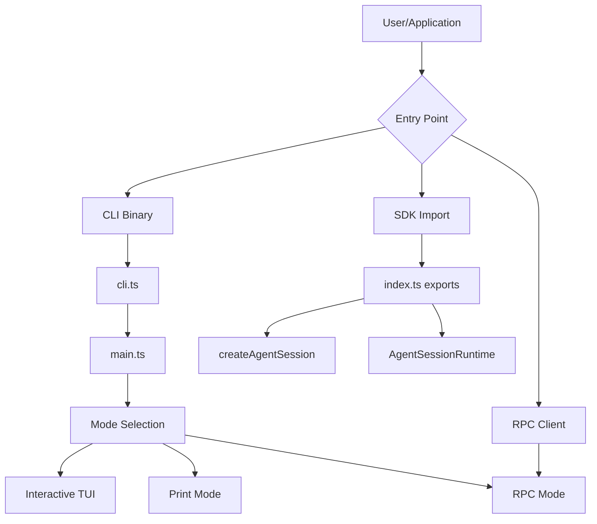
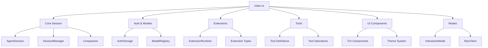
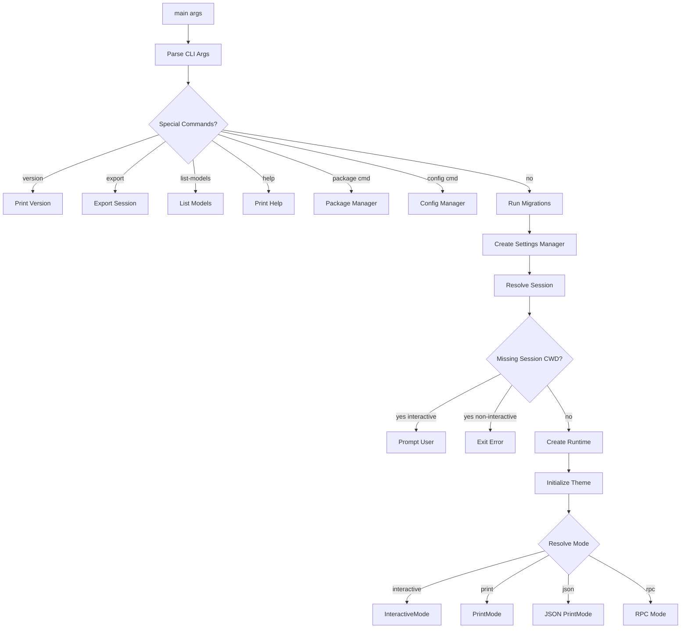
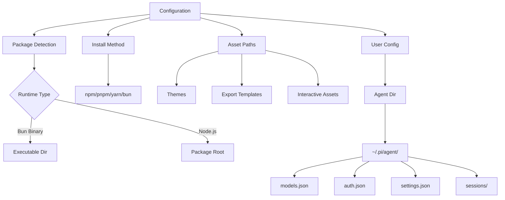
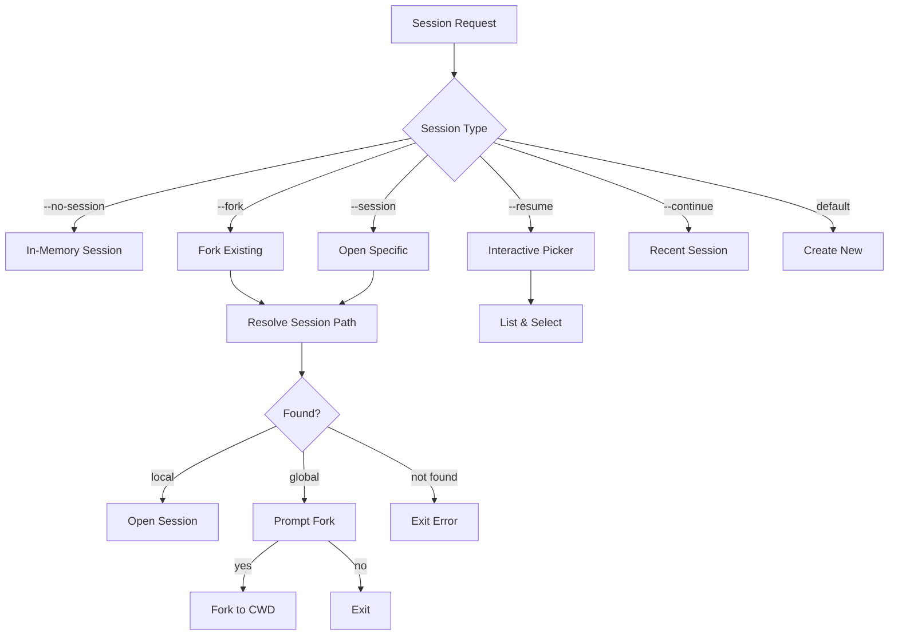
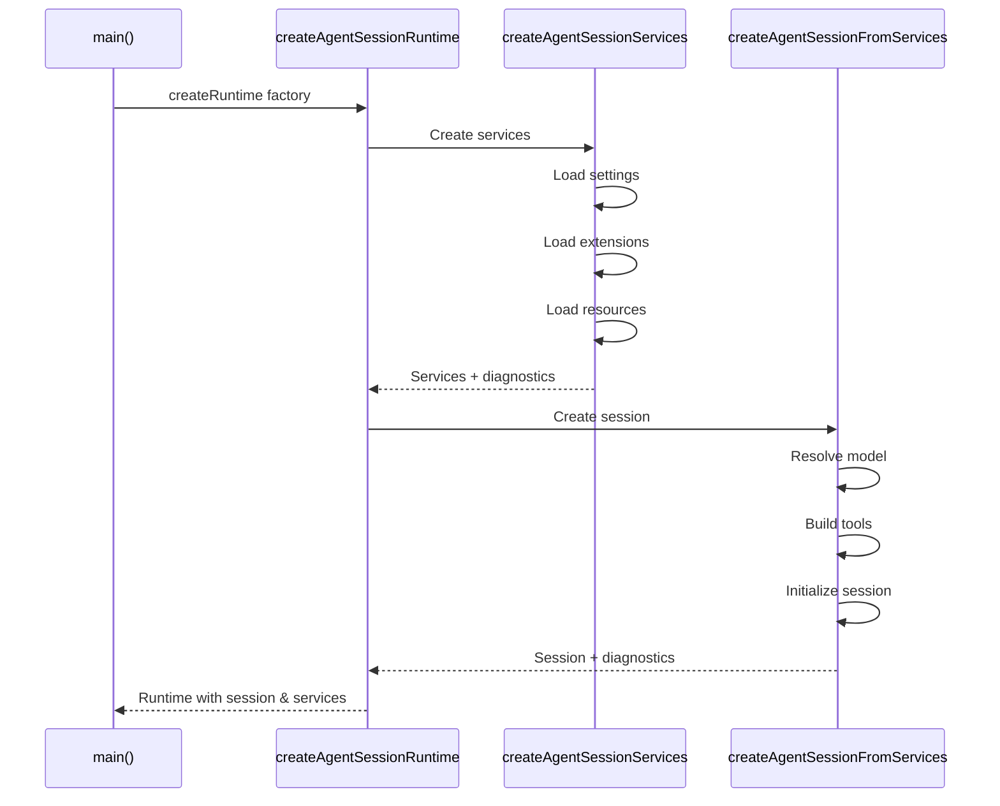
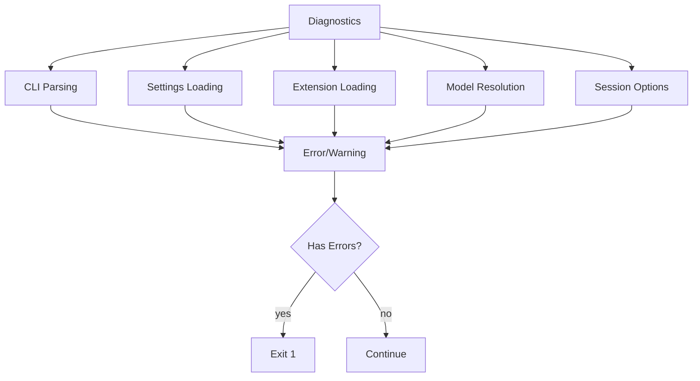

# Coding Agent Overview & Entry Points

The `@mariozechner/pi-coding-agent` package provides a comprehensive AI-powered coding assistant with multi-provider LLM support, session management, and extensible tooling. The package exposes multiple entry points for different use cases: a CLI binary for terminal usage, an interactive TUI mode, programmatic SDK access, and an RPC mode for integration with other applications. The architecture is built around a core `AgentSession` that orchestrates LLM interactions, tool execution, context management, and conversation history persistence.

This page documents the main entry points, initialization flow, configuration system, and the overall architecture of how the coding agent bootstraps and operates across different modes.

## Package Structure and Entry Points

The coding agent provides several entry points depending on the usage scenario:



**Sources:** [packages/coding-agent/src/index.ts:1-400](../../../packages/coding-agent/src/index.ts#L1-L400), [packages/coding-agent/src/cli.ts:1-17](../../../packages/coding-agent/src/cli.ts#L1-L17), [packages/coding-agent/src/main.ts:1-50](../../../packages/coding-agent/src/main.ts#L1-L50)

### CLI Entry Point

The primary CLI entry point is `cli.ts`, which sets up the Node.js process environment and invokes the main function:

| Component | Purpose |
|-----------|---------|
| `process.title` | Sets process name to `APP_NAME` for system monitoring |
| `PI_CODING_AGENT` env | Marks process as coding agent for feature detection |
| `process.emitWarning` | Suppressed to reduce noise from dependencies |
| `EnvHttpProxyAgent` | Configures HTTP proxy support from environment |

The CLI parses `process.argv.slice(2)` and delegates to `main()` for all logic.

**Sources:** [packages/coding-agent/src/cli.ts:1-17](../../../packages/coding-agent/src/cli.ts#L1-L17)

### Bun Binary Entry Point

For Bun-compiled binaries, a separate entry point handles Bedrock provider registration:

```typescript
await import("./register-bedrock.js");
await import("../cli.js");
```

This ensures AWS Bedrock support is available in the standalone binary.

**Sources:** [packages/coding-agent/src/bun/cli.ts:1-10](../../../packages/coding-agent/src/bun/cli.ts#L1-L10)

### SDK Entry Point

The `index.ts` file exports a comprehensive SDK for programmatic usage, organized into logical groups:



The SDK provides factory functions for creating agent sessions, runtimes, and services:

- `createAgentSession()` - High-level session creation
- `createAgentSessionRuntime()` - Runtime with services and session
- `createAgentSessionServices()` - Individual service creation
- `createAgentSessionFromServices()` - Session from pre-configured services

**Sources:** [packages/coding-agent/src/index.ts:1-400](../../../packages/coding-agent/src/index.ts#L1-L400)

## Main Entry Flow

The `main()` function in `main.ts` orchestrates the entire initialization and mode selection process:



**Sources:** [packages/coding-agent/src/main.ts:1-700](../../../packages/coding-agent/src/main.ts#L1-L700)

### Argument Parsing

The CLI uses a custom argument parser that supports:

- Model selection: `--model`, `--provider`, `--models`
- Session management: `--session`, `--continue`, `--resume`, `--fork`, `--no-session`
- Tool configuration: `--tools`, `--no-tools`
- Extension flags: `--extensions`, `--no-extensions`
- Input sources: file arguments, stdin, `--messages`
- Output modes: `--print`, `--mode json`, `--mode rpc`

**Sources:** [packages/coding-agent/src/main.ts:50-100](../../../packages/coding-agent/src/main.ts#L50-L100)

### Mode Resolution

The application mode is determined by analyzing CLI flags and stdin status:

```typescript
function resolveAppMode(parsed: Args, stdinIsTTY: boolean): AppMode {
	if (parsed.mode === "rpc") {
		return "rpc";
	}
	if (parsed.mode === "json") {
		return "json";
	}
	if (parsed.print || !stdinIsTTY) {
		return "print";
	}
	return "interactive";
}
```

| Mode | Trigger | Purpose |
|------|---------|---------|
| `interactive` | Default with TTY | Full TUI interface |
| `print` | `--print` or piped input | Single-shot text output |
| `json` | `--mode json` | Structured JSON output |
| `rpc` | `--mode rpc` | JSON-RPC server |

**Sources:** [packages/coding-agent/src/main.ts:100-120](../../../packages/coding-agent/src/main.ts#L100-L120)

## Configuration System

The configuration system manages paths, settings, and environment-specific behavior:



**Sources:** [packages/coding-agent/src/config.ts:1-200](../../../packages/coding-agent/src/config.ts#L1-L200)

### Package Detection

The system detects whether it's running as a Bun binary or Node.js package:

```typescript
export const isBunBinary =
	import.meta.url.includes("$bunfs") || 
	import.meta.url.includes("~BUN") || 
	import.meta.url.includes("%7EBUN");

export const isBunRuntime = !!process.versions.bun;
```

This detection drives path resolution for bundled assets.

**Sources:** [packages/coding-agent/src/config.ts:13-23](../../../packages/coding-agent/src/config.ts#L13-L23)

### Asset Path Resolution

Different asset types are resolved based on runtime environment:

| Asset Type | Bun Binary Path | Node.js Path |
|------------|----------------|--------------|
| Themes | `./theme/` | `dist/modes/interactive/theme/` |
| Export Templates | `./export-html/` | `dist/core/export-html/` |
| Interactive Assets | `./assets/` | `dist/modes/interactive/assets/` |

The `getPackageDir()` function provides the base directory:

```typescript
export function getPackageDir(): string {
	const envDir = process.env.PI_PACKAGE_DIR;
	if (envDir) {
		if (envDir === "~") return homedir();
		if (envDir.startsWith("~/")) return homedir() + envDir.slice(1);
		return envDir;
	}
	if (isBunBinary) {
		return dirname(process.execPath);
	}
	// Walk up from __dirname to find package.json
	let dir = __dirname;
	while (dir !== dirname(dir)) {
		if (existsSync(join(dir, "package.json"))) {
			return dir;
		}
		dir = dirname(dir);
	}
	return __dirname;
}
```

**Sources:** [packages/coding-agent/src/config.ts:40-100](../../../packages/coding-agent/src/config.ts#L40-L100)

### User Configuration Paths

User-specific configuration lives in the agent directory:

```typescript
export function getAgentDir(): string {
	const envDir = process.env[ENV_AGENT_DIR];
	if (envDir) {
		if (envDir === "~") return homedir();
		if (envDir.startsWith("~/")) return homedir() + envDir.slice(1);
		return envDir;
	}
	return join(homedir(), CONFIG_DIR_NAME, "agent");
}
```

The `CONFIG_DIR_NAME` and `APP_NAME` are read from `package.json` `piConfig` section, allowing customization for different distributions.

**Sources:** [packages/coding-agent/src/config.ts:150-200](../../../packages/coding-agent/src/config.ts#L150-L200)

## Session Management

The session management system handles conversation persistence, forking, and restoration:



**Sources:** [packages/coding-agent/src/main.ts:200-350](../../../packages/coding-agent/src/main.ts#L200-L350)

### Session Resolution

The `resolveSessionPath()` function handles session argument resolution:

```typescript
async function resolveSessionPath(
	sessionArg: string, 
	cwd: string, 
	sessionDir?: string
): Promise<ResolvedSession>
```

It returns one of four result types:

| Result Type | Description |
|-------------|-------------|
| `path` | Direct file path provided |
| `local` | Session found in current project |
| `global` | Session found in different project |
| `not_found` | No matching session |

For global sessions in interactive mode, the user is prompted to fork into the current directory.

**Sources:** [packages/coding-agent/src/main.ts:150-200](../../../packages/coding-agent/src/main.ts#L150-L200)

### Session Fork Validation

The `--fork` flag has strict validation to prevent conflicting operations:

```typescript
function validateForkFlags(parsed: Args): void {
	if (!parsed.fork) return;
	
	const conflictingFlags = [
		parsed.session ? "--session" : undefined,
		parsed.continue ? "--continue" : undefined,
		parsed.resume ? "--resume" : undefined,
		parsed.noSession ? "--no-session" : undefined,
	].filter((flag): flag is string => flag !== undefined);
	
	if (conflictingFlags.length > 0) {
		console.error(chalk.red(
			`Error: --fork cannot be combined with ${conflictingFlags.join(", ")}`
		));
		process.exit(1);
	}
}
```

**Sources:** [packages/coding-agent/src/main.ts:220-240](../../../packages/coding-agent/src/main.ts#L220-L240)

## Runtime Creation

The runtime creation process builds the complete service stack:



**Sources:** [packages/coding-agent/src/main.ts:400-500](../../../packages/coding-agent/src/main.ts#L400-L500)

### Service Creation

The `createAgentSessionServices()` function creates:

- `SettingsManager` - User and project settings
- `ModelRegistry` - Available LLM models
- `AuthStorage` - API credentials
- `ResourceLoader` - Extensions, skills, templates
- `ExtensionRuntime` - Extension execution environment
- `PackageManager` - Dependency resolution
- `FooterDataProvider` - UI status information

All services are scoped to the session's `cwd`, ensuring project-local configurations are respected.

**Sources:** [packages/coding-agent/src/main.ts:450-480](../../../packages/coding-agent/src/main.ts#L450-L480)

### Model Resolution

Model selection follows a priority chain:

1. CLI `--model` flag (with optional `:thinking` suffix)
2. CLI `--provider` + `--model` flags
3. Scoped models from `--models` (for Ctrl+P cycling)
4. Saved default from settings
5. First available model

```typescript
const {
	options: sessionOptions,
	cliThinkingFromModel,
	diagnostics: sessionOptionDiagnostics,
} = buildSessionOptions(
	parsed,
	scopedModels,
	hasExistingSession,
	modelRegistry,
	settingsManager,
);
```

The thinking level can be specified inline with the model pattern (e.g., `claude-3-5-sonnet:high`) or via the `--thinking` flag.

**Sources:** [packages/coding-agent/src/main.ts:500-550](../../../packages/coding-agent/src/main.ts#L500-L550)

### Initial Message Preparation

The initial message is built from multiple sources:

```typescript
async function prepareInitialMessage(
	parsed: Args,
	autoResizeImages: boolean,
	stdinContent?: string,
): Promise<{
	initialMessage?: string;
	initialImages?: ImageContent[];
}>
```

Message sources (in order of processing):

1. File arguments (`@file.txt`, `@image.png`)
2. Explicit `--messages` flag
3. Piped stdin content

Images are automatically resized if `autoResizeImages` setting is enabled.

**Sources:** [packages/coding-agent/src/main.ts:120-150](../../../packages/coding-agent/src/main.ts#L120-L150)

## Diagnostic and Error Reporting

The initialization process collects diagnostics from multiple sources:



Diagnostics are reported with color-coded severity:

```typescript
function reportDiagnostics(diagnostics: readonly AgentSessionRuntimeDiagnostic[]): void {
	for (const diagnostic of diagnostics) {
		const color = diagnostic.type === "error" 
			? chalk.red 
			: diagnostic.type === "warning" 
			? chalk.yellow 
			: chalk.dim;
		const prefix = diagnostic.type === "error" 
			? "Error: " 
			: diagnostic.type === "warning" 
			? "Warning: " 
			: "";
		console.error(color(`${prefix}${diagnostic.message}`));
	}
}
```

**Sources:** [packages/coding-agent/src/main.ts:80-100](../../../packages/coding-agent/src/main.ts#L80-L100)

## Offline and Performance Modes

The system supports special operational modes:

### Offline Mode

Triggered by `--offline` flag or `PI_OFFLINE=1` environment variable:

```typescript
const offlineMode = args.includes("--offline") || isTruthyEnvFlag(process.env.PI_OFFLINE);
if (offlineMode) {
	process.env.PI_OFFLINE = "1";
	process.env.PI_SKIP_VERSION_CHECK = "1";
}
```

This disables network-dependent features like version checks and online model registry updates.

**Sources:** [packages/coding-agent/src/main.ts:600-610](../../../packages/coding-agent/src/main.ts#L600-L610)

### Startup Benchmark Mode

For performance profiling, `PI_STARTUP_BENCHMARK=1` measures initialization timing:

```typescript
const startupBenchmark = isTruthyEnvFlag(process.env.PI_STARTUP_BENCHMARK);
if (startupBenchmark && appMode !== "interactive") {
	console.error(chalk.red("Error: PI_STARTUP_BENCHMARK only supports interactive mode"));
	process.exit(1);
}
```

In benchmark mode, the interactive UI initializes but immediately stops after printing timing information.

**Sources:** [packages/coding-agent/src/main.ts:650-680](../../../packages/coding-agent/src/main.ts#L650-L680)

## Package Configuration

The `package.json` defines the package structure and entry points:

```json
{
	"name": "@mariozechner/pi-coding-agent",
	"version": "0.69.0",
	"type": "module",
	"piConfig": {
		"configDir": ".pi"
	},
	"bin": {
		"pi": "dist/cli.js"
	},
	"main": "./dist/index.js",
	"types": "./dist/index.d.ts",
	"exports": {
		".": {
			"types": "./dist/index.d.ts",
			"import": "./dist/index.js"
		},
		"./hooks": {
			"types": "./dist/core/hooks/index.d.ts",
			"import": "./dist/core/hooks/index.js"
		}
	}
}
```

The `piConfig.configDir` allows custom distributions to use different config directory names (e.g., `.tau` instead of `.pi`).

**Sources:** [packages/coding-agent/package.json:1-30](../../../packages/coding-agent/package.json#L1-L30)

## Summary

The coding agent provides a flexible architecture with multiple entry points serving different use cases. The CLI entry point (`cli.ts`) delegates to a comprehensive `main()` function that handles argument parsing, session resolution, runtime creation, and mode selection. Configuration is managed through a combination of package assets, user-specific files in `~/.pi/agent/`, and project-local settings. The system supports interactive TUI mode, print mode for scripting, JSON mode for structured output, and RPC mode for programmatic integration. All components are also exposed through a comprehensive SDK (`index.ts`) for programmatic usage, enabling embedding the coding agent in other applications.