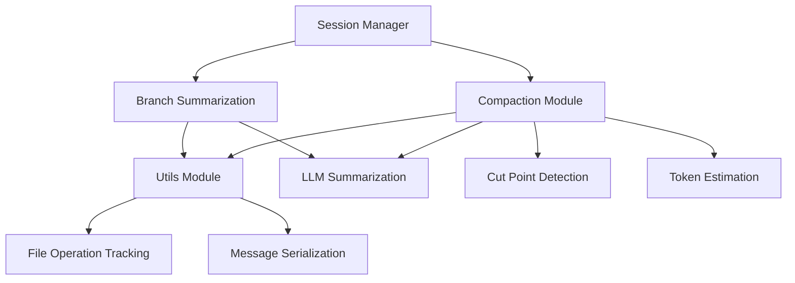
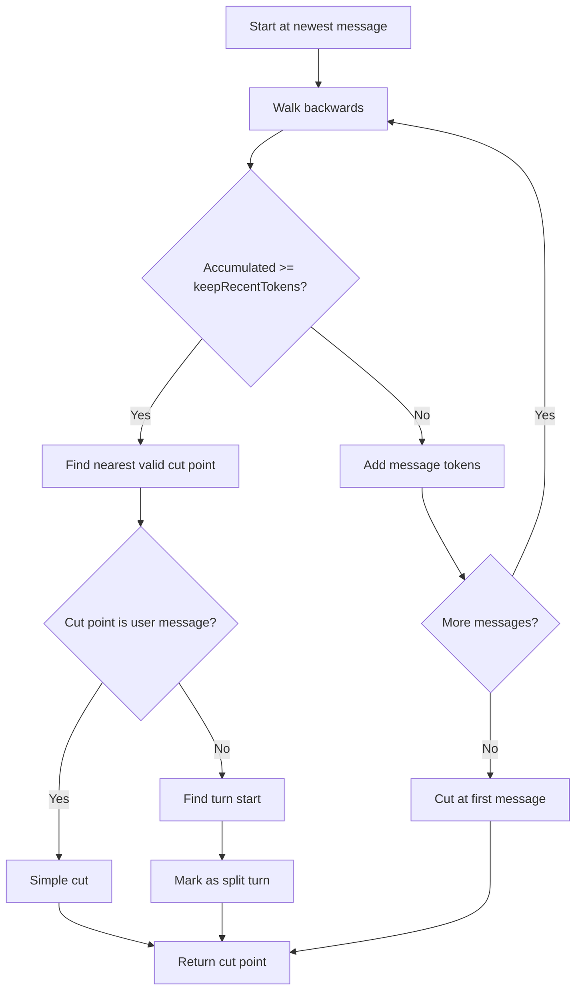
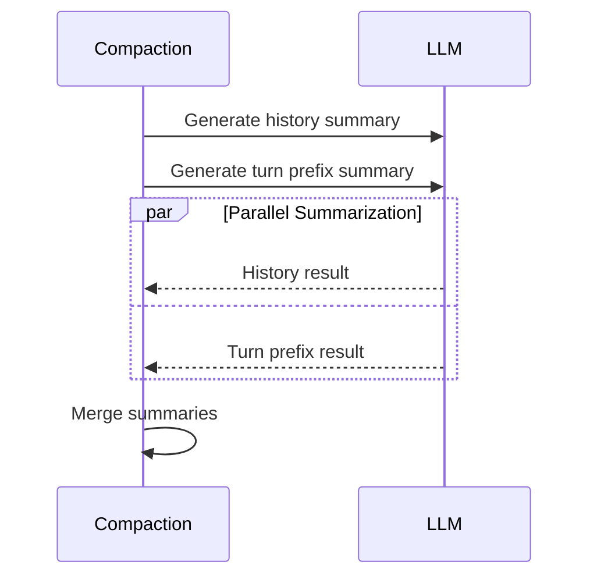
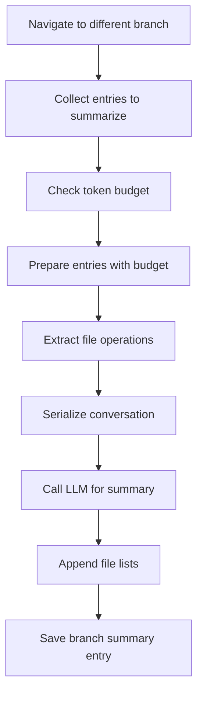

# Compaction & Context Management

The Compaction & Context Management system in `@pi-coding-agent` provides automatic and manual context window management for long-running AI coding sessions. As conversations grow, they eventually exceed the model's context window. This system addresses that challenge through two primary mechanisms: **compaction** (summarizing and discarding old messages while preserving recent context) and **branch summarization** (capturing work from abandoned conversation branches when navigating the session tree). The system is designed with pure functions for compaction logic, with I/O handled by the session manager, and supports both automatic threshold-based compaction and manual user-initiated compaction. Extensions can intercept and customize the compaction process through lifecycle hooks.

Sources: [packages/coding-agent/src/core/compaction/compaction.ts:1-10](../../../packages/coding-agent/src/core/compaction/compaction.ts#L1-L10), [packages/coding-agent/src/core/compaction/branch-summarization.ts:1-8](../../../packages/coding-agent/src/core/compaction/branch-summarization.ts#L1-L8)

## Architecture Overview

The compaction system is organized into three main modules, each with distinct responsibilities:

| Module | File | Purpose |
|--------|------|---------|
| **Compaction** | `compaction.ts` | Core compaction logic: token calculation, cut point detection, summarization, and file operation tracking |
| **Branch Summarization** | `branch-summarization.ts` | Summarizes abandoned conversation branches when navigating the session tree |
| **Shared Utilities** | `utils.ts` | Common utilities for file operation tracking, message serialization, and formatting |

Sources: [packages/coding-agent/src/core/compaction/compaction.ts](../../../packages/coding-agent/src/core/compaction/compaction.ts), [packages/coding-agent/src/core/compaction/branch-summarization.ts](../../../packages/coding-agent/src/core/compaction/branch-summarization.ts), [packages/coding-agent/src/core/compaction/utils.ts](../../../packages/coding-agent/src/core/compaction/utils.ts)



Sources: [packages/coding-agent/src/core/compaction/index.ts:1-7](../../../packages/coding-agent/src/core/compaction/index.ts#L1-L7)

## Compaction Settings

Compaction behavior is controlled by settings that determine when and how aggressively to compact the session history:

| Setting | Type | Default | Description |
|---------|------|---------|-------------|
| `enabled` | boolean | `true` | Whether automatic compaction is enabled |
| `reserveTokens` | number | `16384` | Tokens to reserve for prompt overhead and LLM response |
| `keepRecentTokens` | number | `20000` | Target token count to keep from recent messages |

Sources: [packages/coding-agent/src/core/compaction/compaction.ts:164-173](../../../packages/coding-agent/src/core/compaction/compaction.ts#L164-L173)

The compaction threshold is calculated as `contextWindow - reserveTokens`. When the estimated context tokens exceed this threshold, automatic compaction is triggered. The `keepRecentTokens` setting determines how much recent conversation history to preserve after compaction.

Sources: [packages/coding-agent/src/core/compaction/compaction.ts:213-217](../../../packages/coding-agent/src/core/compaction/compaction.ts#L213-L217)

## Token Calculation and Estimation

### Usage-Based Token Tracking

The system tracks actual token usage from LLM responses when available. Each assistant message includes a `Usage` object with detailed token counts:

```typescript
export function calculateContextTokens(usage: Usage): number {
	return usage.totalTokens || usage.input + usage.output + usage.cacheRead + usage.cacheWrite;
}
```

Sources: [packages/coding-agent/src/core/compaction/compaction.ts:180-182](../../../packages/coding-agent/src/core/compaction/compaction.ts#L180-L182)

The system finds the last non-aborted assistant message to get the most recent accurate token count:

```typescript
export function getLastAssistantUsage(entries: SessionEntry[]): Usage | undefined {
	for (let i = entries.length - 1; i >= 0; i--) {
		const entry = entries[i];
		if (entry.type === "message") {
			const usage = getAssistantUsage(entry.message);
			if (usage) return usage;
		}
	}
	return undefined;
}
```

Sources: [packages/coding-agent/src/core/compaction/compaction.ts:196-206](../../../packages/coding-agent/src/core/compaction/compaction.ts#L196-L196)

### Heuristic Token Estimation

For messages without usage data (user messages, custom messages, etc.), the system uses a conservative character-to-token ratio of 4:1:

```typescript
export function estimateTokens(message: AgentMessage): number {
	let chars = 0;
	// ... extract characters from message content
	return Math.ceil(chars / 4);
}
```

Sources: [packages/coding-agent/src/core/compaction/compaction.ts:227-279](../../../packages/coding-agent/src/core/compaction/compaction.ts#L227-L279)

This heuristic intentionally overestimates tokens to provide a safety margin. Special handling includes:
- Text content: counted directly
- Tool calls: name + JSON-stringified arguments
- Images: estimated at 4800 characters (1200 tokens)
- Tool results: truncated to 2000 characters for summarization

Sources: [packages/coding-agent/src/core/compaction/compaction.ts:227-279](../../../packages/coding-agent/src/core/compaction/compaction.ts#L227-L279), [packages/coding-agent/src/core/compaction/utils.ts:51-54](../../../packages/coding-agent/src/core/compaction/utils.ts#L51-L54)

### Context Estimation Strategy

The system combines actual usage with estimates for trailing messages:

```typescript
export function estimateContextTokens(messages: AgentMessage[]): ContextUsageEstimate {
	const usageInfo = getLastAssistantUsageInfo(messages);
	
	if (!usageInfo) {
		// No usage data - estimate all messages
		let estimated = 0;
		for (const message of messages) {
			estimated += estimateTokens(message);
		}
		return { tokens: estimated, usageTokens: 0, trailingTokens: estimated, lastUsageIndex: null };
	}
	
	// Use actual usage + estimate trailing messages
	const usageTokens = calculateContextTokens(usageInfo.usage);
	let trailingTokens = 0;
	for (let i = usageInfo.index + 1; i < messages.length; i++) {
		trailingTokens += estimateTokens(messages[i]);
	}
	
	return { tokens: usageTokens + trailingTokens, usageTokens, trailingTokens, lastUsageIndex: usageInfo.index };
}
```

Sources: [packages/coding-agent/src/core/compaction/compaction.ts:221-248](../../../packages/coding-agent/src/core/compaction/compaction.ts#L221-L248)

## Cut Point Detection

The cut point algorithm determines where to split the conversation history, keeping recent messages and summarizing older ones.

### Valid Cut Points

Cut points can only occur at specific message types to maintain conversation coherence:

- User messages
- Assistant messages (including those with tool calls)
- Custom messages (user-role)
- Bash execution messages (user-initiated)
- Branch summary messages

Tool result messages are **never** valid cut points, as they must follow their corresponding tool call.

Sources: [packages/coding-agent/src/core/compaction/compaction.ts:283-316](../../../packages/coding-agent/src/core/compaction/compaction.ts#L283-L316)

### Turn Boundary Detection

The system tracks conversation "turns" - sequences starting with a user message and continuing through assistant responses and tool results. When cutting mid-turn, the system generates a separate turn prefix summary:

```typescript
export function findTurnStartIndex(entries: SessionEntry[], entryIndex: number, startIndex: number): number {
	for (let i = entryIndex; i >= startIndex; i--) {
		const entry = entries[i];
		if (entry.type === "branch_summary" || entry.type === "custom_message") {
			return i;
		}
		if (entry.type === "message") {
			const role = entry.message.role;
			if (role === "user" || role === "bashExecution") {
				return i;
			}
		}
	}
	return -1;
}
```

Sources: [packages/coding-agent/src/core/compaction/compaction.ts:323-338](../../../packages/coding-agent/src/core/compaction/compaction.ts#L323-L338)

### Cut Point Algorithm

The algorithm walks backwards from the newest messages, accumulating tokens until reaching the `keepRecentTokens` budget:



Sources: [packages/coding-agent/src/core/compaction/compaction.ts:361-428](../../../packages/coding-agent/src/core/compaction/compaction.ts#L361-L428)

The algorithm also scans backwards from the cut point to include adjacent non-message entries (model changes, thinking level changes) that should stay with the kept messages:

```typescript
// Scan backwards from cutIndex to include any non-message entries
while (cutIndex > startIndex) {
	const prevEntry = entries[cutIndex - 1];
	if (prevEntry.type === "compaction") break;
	if (prevEntry.type === "message") break;
	cutIndex--;
}
```

Sources: [packages/coding-agent/src/core/compaction/compaction.ts:416-424](../../../packages/coding-agent/src/core/compaction/compaction.ts#L416-L424)

## File Operation Tracking

The system tracks which files were read and modified during the summarized conversation, preserving this information across compactions.

### File Operation Types

```typescript
export interface FileOperations {
	read: Set<string>;      // Files read via read tool
	written: Set<string>;   // Files created via write tool
	edited: Set<string>;    // Files modified via edit tool
}
```

Sources: [packages/coding-agent/src/core/compaction/utils.ts:10-14](../../../packages/coding-agent/src/core/compaction/utils.ts#L10-L14)

### Extraction from Tool Calls

File operations are extracted from assistant messages by inspecting tool calls:

```typescript
export function extractFileOpsFromMessage(message: AgentMessage, fileOps: FileOperations): void {
	if (message.role !== "assistant") return;
	
	for (const block of message.content) {
		if (block.type !== "toolCall") continue;
		const args = block.arguments as Record<string, unknown>;
		const path = typeof args.path === "string" ? args.path : undefined;
		if (!path) continue;
		
		switch (block.name) {
			case "read": fileOps.read.add(path); break;
			case "write": fileOps.written.add(path); break;
			case "edit": fileOps.edited.add(path); break;
		}
	}
}
```

Sources: [packages/coding-agent/src/core/compaction/utils.ts:20-41](../../../packages/coding-agent/src/core/compaction/utils.ts#L20-L41)

### Cumulative Tracking Across Compactions

When compacting, the system preserves file operations from previous compactions to maintain a cumulative record:

```typescript
function extractFileOperations(
	messages: AgentMessage[],
	entries: SessionEntry[],
	prevCompactionIndex: number,
): FileOperations {
	const fileOps = createFileOps();
	
	// Collect from previous compaction's details
	if (prevCompactionIndex >= 0) {
		const prevCompaction = entries[prevCompactionIndex] as CompactionEntry;
		if (!prevCompaction.fromHook && prevCompaction.details) {
			const details = prevCompaction.details as CompactionDetails;
			if (Array.isArray(details.readFiles)) {
				for (const f of details.readFiles) fileOps.read.add(f);
			}
			if (Array.isArray(details.modifiedFiles)) {
				for (const f of details.modifiedFiles) fileOps.edited.add(f);
			}
		}
	}
	
	// Extract from tool calls in messages
	for (const msg of messages) {
		extractFileOpsFromMessage(msg, fileOps);
	}
	
	return fileOps;
}
```

Sources: [packages/coding-agent/src/core/compaction/compaction.ts:30-61](../../../packages/coding-agent/src/core/compaction/compaction.ts#L30-L61)

### File List Computation

The final file lists distinguish between read-only files and modified files:

```typescript
export function computeFileLists(fileOps: FileOperations): { readFiles: string[]; modifiedFiles: string[] } {
	const modified = new Set([...fileOps.edited, ...fileOps.written]);
	const readOnly = [...fileOps.read].filter((f) => !modified.has(f)).sort();
	const modifiedFiles = [...modified].sort();
	return { readFiles: readOnly, modifiedFiles };
}
```

Sources: [packages/coding-agent/src/core/compaction/utils.ts:47-52](../../../packages/coding-agent/src/core/compaction/utils.ts#L47-L52)

These lists are appended to summaries in XML format:

```typescript
export function formatFileOperations(readFiles: string[], modifiedFiles: string[]): string {
	const sections: string[] = [];
	if (readFiles.length > 0) {
		sections.push(`<read-files>\n${readFiles.join("\n")}\n</read-files>`);
	}
	if (modifiedFiles.length > 0) {
		sections.push(`<modified-files>\n${modifiedFiles.join("\n")}\n</modified-files>`);
	}
	if (sections.length === 0) return "";
	return `\n\n${sections.join("\n\n")}`;
}
```

Sources: [packages/coding-agent/src/core/compaction/utils.ts:57-68](../../../packages/coding-agent/src/core/compaction/utils.ts#L57-L68)

## Compaction Process

### Preparation Phase

The `prepareCompaction` function analyzes the session and determines what to compact:

```typescript
export interface CompactionPreparation {
	firstKeptEntryId: string;           // UUID of first entry to keep
	messagesToSummarize: AgentMessage[]; // Messages to be summarized
	turnPrefixMessages: AgentMessage[];  // Turn prefix (if splitting)
	isSplitTurn: boolean;                // Whether cutting mid-turn
	tokensBefore: number;                // Total tokens before compaction
	previousSummary?: string;            // Previous summary for iterative update
	fileOps: FileOperations;             // Extracted file operations
	settings: CompactionSettings;        // Compaction settings
}
```

Sources: [packages/coding-agent/src/core/compaction/compaction.ts:503-516](../../../packages/coding-agent/src/core/compaction/compaction.ts#L503-L516)

The preparation process:

1. Finds the previous compaction boundary (if any)
2. Calculates total tokens before compaction
3. Determines the cut point using `findCutPoint`
4. Collects messages to summarize
5. Extracts file operations
6. Identifies turn prefix messages if splitting a turn

Sources: [packages/coding-agent/src/core/compaction/compaction.ts:518-577](../../../packages/coding-agent/src/core/compaction/compaction.ts#L518-L577)

### Message Serialization

Before summarization, messages are converted to text format to prevent the LLM from treating them as a conversation to continue:

```typescript
export function serializeConversation(messages: Message[]): string {
	const parts: string[] = [];
	
	for (const msg of messages) {
		if (msg.role === "user") {
			const content = /* extract text */;
			if (content) parts.push(`[User]: ${content}`);
		} else if (msg.role === "assistant") {
			// Separate thinking, text, and tool calls
			if (thinkingParts.length > 0) {
				parts.push(`[Assistant thinking]: ${thinkingParts.join("\n")}`);
			}
			if (textParts.length > 0) {
				parts.push(`[Assistant]: ${textParts.join("\n")}`);
			}
			if (toolCalls.length > 0) {
				parts.push(`[Assistant tool calls]: ${toolCalls.join("; ")}`);
			}
		} else if (msg.role === "toolResult") {
			parts.push(`[Tool result]: ${truncateForSummary(content, TOOL_RESULT_MAX_CHARS)}`);
		}
	}
	
	return parts.join("\n\n");
}
```

Sources: [packages/coding-agent/src/core/compaction/utils.ts:73-115](../../../packages/coding-agent/src/core/compaction/utils.ts#L73-L115)

Tool results are truncated to 2000 characters to keep summarization requests within reasonable token budgets, as full content is not needed for summarization.

Sources: [packages/coding-agent/src/core/compaction/utils.ts:51-59](../../../packages/coding-agent/src/core/compaction/utils.ts#L51-L59)

### LLM Summarization

The system generates structured summaries using the LLM with a specific format:

```
## Goal
[What is the user trying to accomplish?]

## Constraints & Preferences
- [Any constraints or requirements]

## Progress
### Done
- [x] [Completed tasks]

### In Progress
- [ ] [Current work]

### Blocked
- [Issues preventing progress]

## Key Decisions
- **[Decision]**: [Rationale]

## Next Steps
1. [What should happen next]

## Critical Context
- [Data, examples, or references needed]
```

Sources: [packages/coding-agent/src/core/compaction/compaction.ts:586-615](../../../packages/coding-agent/src/core/compaction/compaction.ts#L586-L615)

### Iterative Summary Updates

When a previous compaction exists, the system uses an update prompt that merges new information into the existing summary:

```typescript
const UPDATE_SUMMARIZATION_PROMPT = `The messages above are NEW conversation messages to incorporate into the existing summary provided in <previous-summary> tags.

Update the existing structured summary with new information. RULES:
- PRESERVE all existing information from the previous summary
- ADD new progress, decisions, and context from the new messages
- UPDATE the Progress section: move items from "In Progress" to "Done" when completed
- UPDATE "Next Steps" based on what was accomplished
...
```

Sources: [packages/coding-agent/src/core/compaction/compaction.ts:617-643](../../../packages/coding-agent/src/core/compaction/compaction.ts#L617-L643)

### Split Turn Handling

When cutting mid-turn, the system generates two summaries in parallel:

1. **History summary**: Covers all messages before the turn
2. **Turn prefix summary**: Covers the early part of the split turn



Sources: [packages/coding-agent/src/core/compaction/compaction.ts:727-759](../../../packages/coding-agent/src/core/compaction/compaction.ts#L727-L759)

The turn prefix uses a specialized prompt:

```
This is the PREFIX of a turn that was too large to keep. The SUFFIX (recent work) is retained.

Summarize the prefix to provide context for the retained suffix:

## Original Request
[What did the user ask for in this turn?]

## Early Progress
- [Key decisions and work done in the prefix]

## Context for Suffix
- [Information needed to understand the retained recent work]
```

Sources: [packages/coding-agent/src/core/compaction/compaction.ts:761-774](../../../packages/coding-agent/src/core/compaction/compaction.ts#L761-L774)

### Compaction Result

The `compact` function returns a result that the session manager saves as a compaction entry:

```typescript
export interface CompactionResult<T = unknown> {
	summary: string;              // Generated summary with file lists
	firstKeptEntryId: string;     // UUID of first kept entry
	tokensBefore: number;         // Tokens before compaction
	details?: T;                  // Extension-specific data
}
```

Sources: [packages/coding-agent/src/core/compaction/compaction.ts:92-98](../../../packages/coding-agent/src/core/compaction/compaction.ts#L92-L98)

## Branch Summarization

When navigating to a different point in the session tree, the system can summarize the branch being abandoned to preserve context.

### Branch Entry Collection

The system walks from the old position back to the common ancestor with the target position:

```typescript
export function collectEntriesForBranchSummary(
	session: ReadonlySessionManager,
	oldLeafId: string | null,
	targetId: string,
): CollectEntriesResult {
	if (!oldLeafId) {
		return { entries: [], commonAncestorId: null };
	}
	
	// Find common ancestor
	const oldPath = new Set(session.getBranch(oldLeafId).map((e) => e.id));
	const targetPath = session.getBranch(targetId);
	
	let commonAncestorId: string | null = null;
	for (let i = targetPath.length - 1; i >= 0; i--) {
		if (oldPath.has(targetPath[i].id)) {
			commonAncestorId = targetPath[i].id;
			break;
		}
	}
	
	// Collect entries from old leaf back to common ancestor
	const entries: SessionEntry[] = [];
	let current: string | null = oldLeafId;
	
	while (current && current !== commonAncestorId) {
		const entry = session.getEntry(current);
		if (!entry) break;
		entries.push(entry);
		current = entry.parentId;
	}
	
	entries.reverse(); // Chronological order
	return { entries, commonAncestorId };
}
```

Sources: [packages/coding-agent/src/core/compaction/branch-summarization.ts:67-105](../../../packages/coding-agent/src/core/compaction/branch-summarization.ts#L67-L105)

### Token Budget Management

Branch summarization respects a token budget, keeping the most recent messages when the branch is too long:

```typescript
export function prepareBranchEntries(entries: SessionEntry[], tokenBudget: number = 0): BranchPreparation {
	const messages: AgentMessage[] = [];
	const fileOps = createFileOps();
	let totalTokens = 0;
	
	// First pass: collect file ops from ALL entries
	for (const entry of entries) {
		if (entry.type === "branch_summary" && !entry.fromHook && entry.details) {
			// Extract cumulative file tracking
		}
	}
	
	// Second pass: walk from newest to oldest, adding messages until token budget
	for (let i = entries.length - 1; i >= 0; i--) {
		const entry = entries[i];
		const message = getMessageFromEntry(entry);
		if (!message) continue;
		
		extractFileOpsFromMessage(message, fileOps);
		const tokens = estimateTokens(message);
		
		if (tokenBudget > 0 && totalTokens + tokens > tokenBudget) {
			// Try to fit summary entries anyway as they're important
			if (entry.type === "compaction" || entry.type === "branch_summary") {
				if (totalTokens < tokenBudget * 0.9) {
					messages.unshift(message);
					totalTokens += tokens;
				}
			}
			break;
		}
		
		messages.unshift(message);
		totalTokens += tokens;
	}
	
	return { messages, fileOps, totalTokens };
}
```

Sources: [packages/coding-agent/src/core/compaction/branch-summarization.ts:143-193](../../../packages/coding-agent/src/core/compaction/branch-summarization.ts#L143-L193)

### Branch Summary Format

Branch summaries use a similar structured format to compaction summaries, with a preamble indicating the context:

```
The user explored a different conversation branch before returning here.
Summary of that exploration:

## Goal
[What was the user trying to accomplish in this branch?]

## Constraints & Preferences
...

## Progress
### Done
- [x] [Completed tasks]
...
```

Sources: [packages/coding-agent/src/core/compaction/branch-summarization.ts:195-226](../../../packages/coding-agent/src/core/compaction/branch-summarization.ts#L195-L226)

### Branch Summary Generation



Sources: [packages/coding-agent/src/core/compaction/branch-summarization.ts:228-283](../../../packages/coding-agent/src/core/compaction/branch-summarization.ts#L228-L283)

## Automatic Compaction Triggers

The session manager checks for compaction after each assistant message:

### Threshold-Based Compaction

Triggered when context tokens exceed `contextWindow - reserveTokens`:

```typescript
export function shouldCompact(contextTokens: number, contextWindow: number, settings: CompactionSettings): boolean {
	if (!settings.enabled) return false;
	return contextTokens > contextWindow - settings.reserveTokens;
}
```

Sources: [packages/coding-agent/src/core/compaction/compaction.ts:213-217](../../../packages/coding-agent/src/core/compaction/compaction.ts#L213-L217)

### Overflow Recovery

When the LLM returns an error indicating the prompt is too long, the system attempts automatic compaction and retries once:

```typescript
it("does not retry overflow recovery more than once", async () => {
	const overflowMessage = createAssistant(harness, {
		stopReason: "error",
		errorMessage: "prompt is too long",
		timestamp: Date.now(),
	});
	
	await sessionInternals._checkCompaction(overflowMessage);
	await sessionInternals._checkCompaction({ ...overflowMessage, timestamp: Date.now() + 1 });
	
	expect(runAutoCompactionSpy).toHaveBeenCalledTimes(1);
	expect(compactionErrors).toContain(
		"Context overflow recovery failed after one compact-and-retry attempt..."
	);
});
```

Sources: [packages/coding-agent/test/suite/agent-session-compaction.test.ts:85-99](../../../packages/coding-agent/test/suite/agent-session-compaction.test.ts#L85-L99)

### Handling Error Messages

For error messages (like 529 overloaded), the system uses the last successful assistant usage to determine if compaction is needed:

```typescript
it("triggers threshold compaction for error messages using the last successful usage", async () => {
	const successfulAssistant = createAssistant(harness, {
		stopReason: "stop",
		totalTokens: 190_000,
		timestamp: Date.now(),
	});
	const errorAssistant = createAssistant(harness, {
		stopReason: "error",
		errorMessage: "529 overloaded",
		timestamp: Date.now() + 1000,
	});
	harness.session.agent.state.messages = [
		{ role: "user", content: [{ type: "text", text: "hello" }], timestamp: Date.now() - 1000 },
		successfulAssistant,
		{ role: "user", content: [{ type: "text", text: "retry" }], timestamp: Date.now() + 500 },
		errorAssistant,
	];
	
	await sessionInternals._checkCompaction(errorAssistant);
	
	expect(runAutoCompactionSpy).toHaveBeenCalledWith("threshold", false);
});
```

Sources: [packages/coding-agent/test/suite/agent-session-compaction.test.ts:142-164](../../../packages/coding-agent/test/suite/agent-session-compaction.test.ts#L142-L164)

## Extension Integration

Extensions can intercept and customize the compaction process through the `session_before_compact` event:

```typescript
it("manually compacts using an extension-provided summary", async () => {
	const harness = await createHarness({
		extensionFactories: [
			(pi) => {
				pi.on("session_before_compact", async (event) => ({
					compaction: {
						summary: "summary from extension",
						firstKeptEntryId: event.preparation.firstKeptEntryId,
						tokensBefore: event.preparation.tokensBefore,
						details: { source: "extension" },
					},
				}));
			},
		],
	});
	
	await harness.session.prompt("one");
	await harness.session.prompt("two");
	
	const result = await harness.session.compact();
	
	expect(result.summary).toBe("summary from extension");
});
```

Sources: [packages/coding-agent/test/suite/agent-session-compaction.test.ts:27-48](../../../packages/coding-agent/test/suite/agent-session-compaction.test.ts#L27-L48)

Extensions receive a `CompactionPreparation` object containing all the information needed to generate a custom summary, including:
- Messages to summarize
- Turn prefix messages (if splitting)
- Extracted file operations
- Previous summary (for iterative updates)
- Token counts

The extension can return a custom `CompactionResult` with its own summary and details, or return `{ cancel: true }` to abort compaction.

Sources: [packages/coding-agent/src/core/compaction/compaction.ts:503-577](../../../packages/coding-agent/src/core/compaction/compaction.ts#L503-L577)

## Session Context Loading

After compaction, the session context is rebuilt using only the compaction summary and kept entries:

```typescript
export function buildSessionContext(entries: SessionEntry[]): SessionContext {
	// Find last compaction
	let lastCompactionIndex = -1;
	for (let i = entries.length - 1; i >= 0; i--) {
		if (entries[i].type === "compaction") {
			lastCompactionIndex = i;
			break;
		}
	}
	
	let startIndex = 0;
	if (lastCompactionIndex >= 0) {
		const compaction = entries[lastCompactionIndex] as CompactionEntry;
		// Find firstKeptEntryId
		const firstKeptIndex = entries.findIndex(e => e.id === compaction.firstKeptEntryId);
		if (firstKeptIndex >= 0) {
			startIndex = firstKeptIndex;
		} else {
			startIndex = lastCompactionIndex + 1;
		}
	}
	
	// Load messages from startIndex onwards
	// ...
}
```

Sources: [packages/coding-agent/test/compaction.test.ts:181-201](../../../packages/coding-agent/test/compaction.test.ts#L181-L201)

This ensures that:
1. Old messages before the compaction are not loaded
2. The compaction summary appears as a `compactionSummary` message
3. Kept messages after the cut point are preserved
4. New messages after the compaction are included

Sources: [packages/coding-agent/test/compaction.test.ts:181-224](../../../packages/coding-agent/test/compaction.test.ts#L181-L224)

## Testing and Validation

The compaction system includes comprehensive tests covering:

### Unit Tests

- Token calculation from usage data
- Last assistant usage retrieval (skipping aborted messages)
- Compaction threshold detection
- Cut point detection with token budgets
- Message serialization
- File operation extraction and deduplication

Sources: [packages/coding-agent/test/compaction.test.ts:96-173](../../../packages/coding-agent/test/compaction.test.ts#L96-L173)

### Integration Tests

- Large session fixture parsing and loading
- Cut point detection in real sessions
- Session context loading with multiple compactions
- Preservation of kept messages across repeated compactions
- Re-summarization when recent window moves past kept messages

Sources: [packages/coding-agent/test/compaction.test.ts:367-446](../../../packages/coding-agent/test/compaction.test.ts#L367-L446)

### LLM Integration Tests

Tests that require an API key and call the actual LLM:

- Summary generation for large sessions
- Session validity after compaction
- Token reduction verification

Sources: [packages/coding-agent/test/compaction.test.ts:462-502](../../../packages/coding-agent/test/compaction.test.ts#L462-L502)

### Characterization Tests

Tests that document actual system behavior:

- Manual compaction with extension-provided summaries
- Automatic threshold-based compaction
- Overflow recovery with retry limits
- Error message handling with fallback to last successful usage
- Pre-compaction usage staleness detection

Sources: [packages/coding-agent/test/suite/agent-session-compaction.test.ts](../../../packages/coding-agent/test/suite/agent-session-compaction.test.ts)

## Summary

The Compaction & Context Management system provides robust, automatic management of conversation context in long-running AI coding sessions. Key features include:

- **Dual summarization mechanisms**: Compaction for linear history and branch summarization for tree navigation
- **Smart cut point detection**: Preserves conversation coherence by respecting turn boundaries and never cutting at tool results
- **Hybrid token tracking**: Combines actual usage data with conservative estimation for accurate context management
- **Cumulative file tracking**: Maintains a complete record of file operations across multiple compactions
- **Iterative summary updates**: Efficiently updates existing summaries rather than re-summarizing from scratch
- **Split turn handling**: Generates specialized summaries when cutting mid-turn to preserve context
- **Extension integration**: Allows extensions to customize or replace the compaction process
- **Automatic triggers**: Threshold-based compaction and overflow recovery with retry logic

The system is designed with pure functions for compaction logic, making it testable and predictable, while the session manager handles all I/O operations. This separation of concerns enables extensions to intercept the compaction process at the preparation stage and provide custom summaries or additional processing.

Sources: [packages/coding-agent/src/core/compaction/compaction.ts:1-10](../../../packages/coding-agent/src/core/compaction/compaction.ts#L1-L10), [packages/coding-agent/src/core/compaction/branch-summarization.ts:1-8](../../../packages/coding-agent/src/core/compaction/branch-summarization.ts#L1-L8), [packages/coding-agent/test/compaction.test.ts](../../../packages/coding-agent/test/compaction.test.ts), [packages/coding-agent/test/suite/agent-session-compaction.test.ts](../../../packages/coding-agent/test/suite/agent-session-compaction.test.ts)