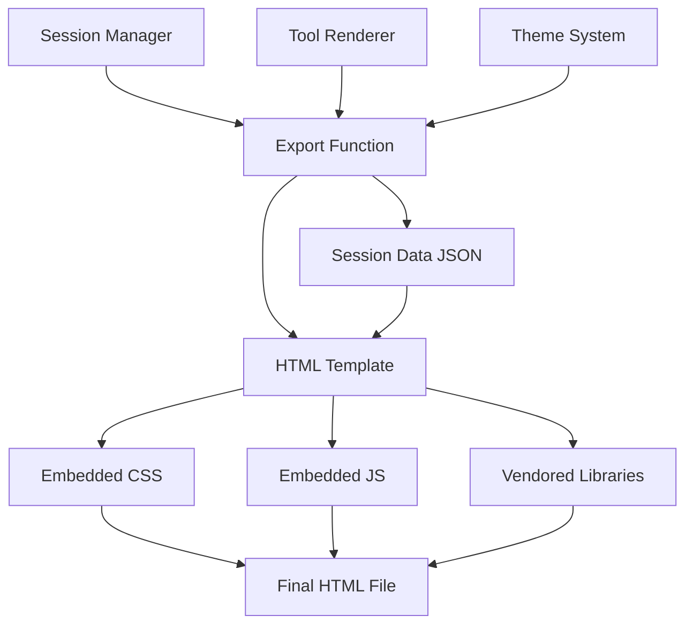
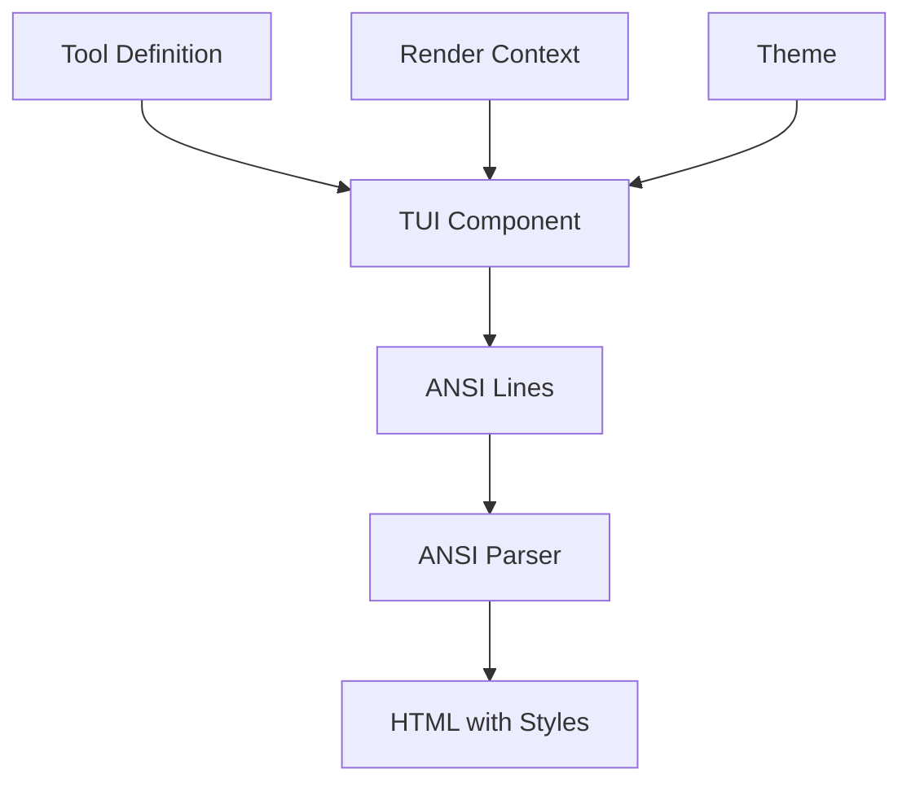
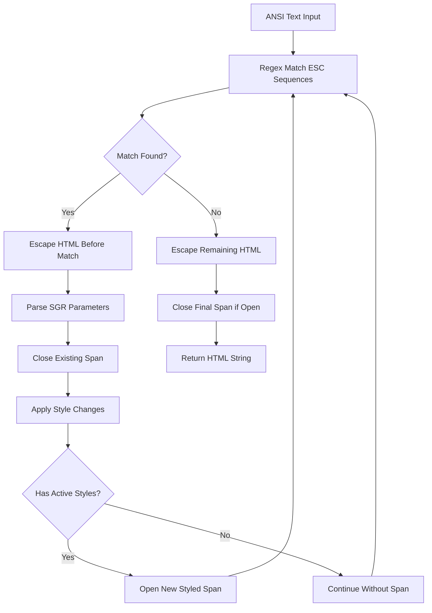
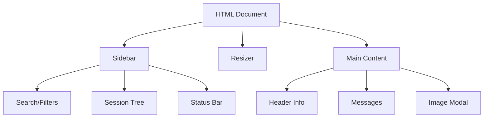

# HTML Export & Session Sharing

The HTML Export & Session Sharing feature enables users to export coding agent sessions as self-contained, interactive HTML files. These exports preserve the complete conversation history, tool executions, and visual formatting, making them ideal for sharing, archiving, or reviewing sessions offline. The system supports custom tool rendering through ANSI-to-HTML conversion, theme customization, and includes an interactive session tree navigator with filtering capabilities.

The export functionality is designed to work both from within the TUI (via the `/export` command) and as a standalone CLI tool for batch processing session files. All necessary assets (CSS, JavaScript, syntax highlighting) are embedded directly into the HTML file, ensuring portability without external dependencies.

Sources: [packages/coding-agent/src/core/export-html/index.ts:1-250](../../../packages/coding-agent/src/core/export-html/index.ts#L1-L250)

---

## Architecture Overview

The HTML export system consists of several coordinated components that transform session data into a standalone HTML document:



The export process begins with either a `SessionManager` instance (for active sessions) or a session file path (for standalone exports). The system then:

1. Extracts session entries, header metadata, and optional agent state (system prompt, tools)
2. Pre-renders custom tool calls and results using the tool renderer (if provided)
3. Injects theme colors and derives export-specific color schemes
4. Embeds all assets (CSS, JavaScript, libraries) into a single HTML file
5. Base64-encodes the session data to avoid escaping issues

Sources: [packages/coding-agent/src/core/export-html/index.ts:108-154](../../../packages/coding-agent/src/core/export-html/index.ts#L108-L154), [packages/coding-agent/src/core/export-html/template.html:1-45](../../../packages/coding-agent/src/core/export-html/template.html#L1-L45)

---

## Export Functions

### Primary Export Methods

The system provides two main export functions to accommodate different use cases:

| Function | Purpose | Required Input | Agent State Support |
|----------|---------|----------------|---------------------|
| `exportSessionToHtml` | Export from active TUI session | `SessionManager` instance | Yes (includes system prompt & tools) |
| `exportFromFile` | Export arbitrary session file | File path (`.jsonl`) | No (standalone export) |

**exportSessionToHtml** is used by the TUI's `/export` command and requires an active session manager. It can optionally include the current agent state (system prompt and tool definitions) and supports custom tool rendering via the `toolRenderer` option.

**exportFromFile** operates independently of the agent runtime, making it suitable for CLI batch processing or archival workflows. It only exports the raw session data without agent state information.

Sources: [packages/coding-agent/src/core/export-html/index.ts:158-188](../../../packages/coding-agent/src/core/export-html/index.ts#L158-L188), [packages/coding-agent/src/core/export-html/index.ts:193-220](../../../packages/coding-agent/src/core/export-html/index.ts#L193-L220)

### Export Options

```typescript
interface ExportOptions {
  outputPath?: string;
  themeName?: string;
  toolRenderer?: ToolHtmlRenderer;
}
```

- **outputPath**: Destination file path (defaults to `${APP_NAME}-session-${basename}.html`)
- **themeName**: Theme to apply for color scheme (defaults to current theme)
- **toolRenderer**: Optional renderer for custom tool visualization

Sources: [packages/coding-agent/src/core/export-html/index.ts:18-22](../../../packages/coding-agent/src/core/export-html/index.ts#L18-L22)

---

## Custom Tool Rendering

### Tool HTML Renderer Architecture

The tool rendering system converts custom tool calls and results from their TUI (terminal) representation to HTML. This is accomplished through a multi-stage pipeline:



The `createToolHtmlRenderer` function creates a renderer that:

1. Looks up tool definitions by name
2. Invokes their `renderCall` or `renderResult` methods to produce TUI components
3. Renders components to ANSI-escaped text lines
4. Converts ANSI codes to HTML with inline styles

Sources: [packages/coding-agent/src/core/export-html/tool-renderer.ts:36-116](../../../packages/coding-agent/src/core/export-html/tool-renderer.ts#L36-L116)

### Tool Render Context

The `ToolRenderContext` provides necessary state for rendering tools:

```typescript
interface ToolRenderContext {
  args: unknown;                    // Tool call arguments
  toolCallId: string;               // Unique call identifier
  invalidate: () => void;           // No-op in export context
  lastComponent: Component | undefined;
  state: any;                       // Stateful rendering support
  cwd: string;                      // Working directory
  executionStarted: boolean;
  argsComplete: boolean;
  isPartial: boolean;
  expanded: boolean;
  showImages: boolean;
  isError: boolean;
}
```

The renderer maintains state maps (`renderedCallComponents`, `renderedResultComponents`, `renderedStates`, `renderedArgs`) to support stateful tool rendering across multiple invocations.

Sources: [packages/coding-agent/src/core/export-html/tool-renderer.ts:38-60](../../../packages/coding-agent/src/core/export-html/tool-renderer.ts#L38-L60)

### Pre-Rendering Custom Tools

Only tools without built-in template support are pre-rendered. The system identifies these by excluding a hardcoded set of template-rendered tools:

```typescript
const TEMPLATE_RENDERED_TOOLS = new Set(["bash", "read", "write", "edit", "ls"]);
```

The `preRenderCustomTools` function iterates through all session entries, identifies custom tool calls and results, and invokes the tool renderer to generate both collapsed and expanded HTML representations. These are stored in a `renderedTools` map keyed by tool call ID.

Sources: [packages/coding-agent/src/core/export-html/index.ts:222-265](../../../packages/coding-agent/src/core/export-html/index.ts#L222-L265)

### Error Handling

Tool rendering is wrapped in try-catch blocks that return `undefined` on failure. This allows the HTML template to gracefully fall back to structured result rendering (displaying raw JSON data) when custom rendering fails.

Sources: [packages/coding-agent/src/core/export-html/tool-renderer.ts:67-76](../../../packages/coding-agent/src/core/export-html/tool-renderer.ts#L67-L76), [packages/coding-agent/src/core/export-html/tool-renderer.ts:81-117](../../../packages/coding-agent/src/core/export-html/tool-renderer.ts#L81-L117)

---

## ANSI to HTML Conversion

### Color Support

The ANSI-to-HTML converter supports a comprehensive range of terminal color codes:

| Color Type | Code Range | Example | Description |
|------------|-----------|---------|-------------|
| Standard FG | 30-37 | `\x1b[31m` | 8 basic foreground colors |
| Bright FG | 90-97 | `\x1b[91m` | 8 bright foreground colors |
| Standard BG | 40-47 | `\x1b[41m` | 8 basic background colors |
| Bright BG | 100-107 | `\x1b[101m` | 8 bright background colors |
| 256-color FG | 38;5;N | `\x1b[38;5;196m` | 256-color palette foreground |
| 256-color BG | 48;5;N | `\x1b[48;5;196m` | 256-color palette background |
| RGB FG | 38;2;R;G;B | `\x1b[38;2;255;0;0m` | True color foreground |
| RGB BG | 48;2;R;G;B | `\x1b[48;2;255;0;0m` | True color background |

The 256-color palette includes:
- Colors 0-15: Standard ANSI colors
- Colors 16-231: 6×6×6 RGB color cube (216 colors)
- Colors 232-255: 24-shade grayscale ramp

Sources: [packages/coding-agent/src/core/export-html/ansi-to-html.ts:15-32](../../../packages/coding-agent/src/core/export-html/ansi-to-html.ts#L15-L32), [packages/coding-agent/src/core/export-html/ansi-to-html.ts:37-58](../../../packages/coding-agent/src/core/export-html/ansi-to-html.ts#L37-L58)

### Text Style Support

The converter supports standard SGR (Select Graphic Rendition) text styling codes:

- **Bold** (1): `font-weight: bold`
- **Dim** (2): `opacity: 0.6`
- **Italic** (3): `font-style: italic`
- **Underline** (4): `text-decoration: underline`
- **Reset** (0): Clears all styling
- **Individual resets**: 22 (bold/dim), 23 (italic), 24 (underline)

Sources: [packages/coding-agent/src/core/export-html/ansi-to-html.ts:76-88](../../../packages/coding-agent/src/core/export-html/ansi-to-html.ts#L76-L88)

### Conversion Algorithm

The ANSI-to-HTML conversion process follows this sequence:



The converter maintains a `TextStyle` state object tracking current foreground/background colors and active text styles. As it encounters ANSI escape sequences, it:

1. Outputs any text before the sequence (HTML-escaped)
2. Closes the current `<span>` if one is open
3. Updates the style state based on SGR parameters
4. Opens a new `<span>` with inline CSS if styles are active

Sources: [packages/coding-agent/src/core/export-html/ansi-to-html.ts:144-190](../../../packages/coding-agent/src/core/export-html/ansi-to-html.ts#L144-L190)

### Line-Based Rendering

The `ansiLinesToHtml` function wraps each line in a `<div class="ansi-line">` element, ensuring proper line breaks and handling empty lines with `&nbsp;`:

```typescript
export function ansiLinesToHtml(lines: string[]): string {
  return lines.map((line) => 
    `<div class="ansi-line">${ansiToHtml(line) || "&nbsp;"}</div>`
  ).join("\n");
}
```

Sources: [packages/coding-agent/src/core/export-html/ansi-to-html.ts:195-200](../../../packages/coding-agent/src/core/export-html/ansi-to-html.ts#L195-L200)

---

## Theme System Integration

### Theme Color Injection

The export system extracts theme colors using `getResolvedThemeColors(themeName)` and injects them as CSS custom properties in the `:root` selector:

```css
:root {
  --text: #e4e4e7;
  --dim: #71717a;
  --accent: #60a5fa;
  --userMessageBg: #343541;
  /* ... additional theme colors ... */
}
```

Sources: [packages/coding-agent/src/core/export-html/index.ts:89-99](../../../packages/coding-agent/src/core/export-html/index.ts#L89-L99), [packages/coding-agent/src/core/export-html/template.css:1-5](../../../packages/coding-agent/src/core/export-html/template.css#L1-L5)

### Export-Specific Color Derivation

For optimal readability in exported HTML, the system derives three additional colors from the theme's `userMessageBg`:

1. **pageBg**: Overall page background (70% brightness of base)
2. **cardBg**: Message card background (85% brightness of base)
3. **infoBg**: Info/status background (adjusted RGB values)

The derivation algorithm calculates relative luminance to determine if the theme is light or dark, then applies appropriate brightness adjustments:

```typescript
function deriveExportColors(baseColor: string): {
  pageBg: string;
  cardBg: string;
  infoBg: string;
} {
  const parsed = parseColor(baseColor);
  const luminance = getLuminance(parsed.r, parsed.g, parsed.b);
  const isLight = luminance > 0.5;
  
  if (isLight) {
    return {
      pageBg: adjustBrightness(baseColor, 0.96),
      cardBg: baseColor,
      infoBg: /* adjusted RGB */
    };
  }
  return {
    pageBg: adjustBrightness(baseColor, 0.7),
    cardBg: adjustBrightness(baseColor, 0.85),
    infoBg: /* adjusted RGB */
  };
}
```

Themes can optionally provide explicit export colors via `getThemeExportColors()`, which take precedence over derived values.

Sources: [packages/coding-agent/src/core/export-html/index.ts:24-73](../../../packages/coding-agent/src/core/export-html/index.ts#L24-L73)

---

## HTML Template Structure

### Document Layout

The exported HTML follows a three-panel layout with responsive behavior:



The template uses flexbox for layout with these key containers:

- **#sidebar**: Fixed-width collapsible panel (default 400px, resizable 240-840px)
- **#sidebar-resizer**: Draggable separator for width adjustment
- **#content**: Flexible main area with centered, max-width content (800px)

Sources: [packages/coding-agent/src/core/export-html/template.html:11-40](../../../packages/coding-agent/src/core/export-html/template.html#L11-L40), [packages/coding-agent/src/core/export-html/template.css:12-17](../../../packages/coding-agent/src/core/export-html/template.css#L12-L17)

### Embedded Assets

All dependencies are embedded directly in the HTML to ensure portability:

| Asset | Purpose | Embedding Method |
|-------|---------|------------------|
| template.css | Styling and theme | Injected into `<style>` tag via `{{CSS}}` placeholder |
| template.js | Interactive behavior | Injected into `<script>` tag via `{{JS}}` placeholder |
| marked.min.js | Markdown rendering | Vendored library via `{{MARKED_JS}}` placeholder |
| highlight.min.js | Syntax highlighting | Vendored library via `{{HIGHLIGHT_JS}}` placeholder |
| Session data | Messages and metadata | Base64-encoded JSON in `<script id="session-data">` tag |

Sources: [packages/coding-agent/src/core/export-html/template.html:3-9](../../../packages/coding-agent/src/core/export-html/template.html#L3-L9), [packages/coding-agent/src/core/export-html/template.html:32-42](../../../packages/coding-agent/src/core/export-html/template.html#L32-L42), [packages/coding-agent/src/core/export-html/index.ts:108-121](../../../packages/coding-agent/src/core/export-html/index.ts#L108-L121)

### Session Tree Navigator

The sidebar provides an interactive tree view of the session with filtering capabilities:

**Filter Modes:**
- **Default**: Hides settings/configuration entries
- **No-tools**: Default view minus tool result entries
- **User**: Shows only user messages
- **Labeled**: Shows only entries with custom labels
- **All**: Shows complete session without filtering

The tree uses visual indicators for different message types:
- User messages: Accent color
- Assistant messages: Success color
- Tool executions: Muted color
- Errors: Error color
- Custom messages: Custom message label color

Sources: [packages/coding-agent/src/core/export-html/template.html:14-28](../../../packages/coding-agent/src/core/export-html/template.html#L14-L28), [packages/coding-agent/src/core/export-html/template.css:78-96](../../../packages/coding-agent/src/core/export-html/template.css#L78-L96)

---

## Message Rendering

### Message Types and Styling

The export system supports various message types with distinct visual styling:

| Message Type | CSS Class | Background Variable | Description |
|--------------|-----------|---------------------|-------------|
| User | `.user-message` | `--userMessageBg` | User input messages |
| Assistant | `.assistant-message` | Transparent | AI responses with text/thinking |
| Tool Execution | `.tool-execution` | Status-dependent | Tool calls and results |
| Model Change | `.model-change` | Transparent | Model switch notifications |
| Compaction | `.compaction` | `--customMessageBg` | Conversation compaction markers |
| Branch Summary | `.branch-summary` | `--customMessageBg` | Branch navigation summaries |
| Hook/Custom | `.hook-message` | `--customMessageBg` | Extension hook messages |

Sources: [packages/coding-agent/src/core/export-html/template.css:210-217](../../../packages/coding-agent/src/core/export-html/template.css#L210-L217), [packages/coding-agent/src/core/export-html/template.css:258-266](../../../packages/coding-agent/src/core/export-html/template.css#L258-L266)

### Tool Execution Rendering

Tool executions display with state-based styling:

```css
.tool-execution.pending { background: var(--toolPendingBg); }
.tool-execution.success { background: var(--toolSuccessBg); }
.tool-execution.error { background: var(--toolErrorBg); }
```

Each tool execution includes:
- **Tool header**: Name and status indicator
- **Tool call**: Arguments/parameters (may be pre-rendered via custom renderer)
- **Tool output**: Results with expandable/collapsible behavior for large outputs
- **Tool images**: Embedded images from tool results

The template supports special rendering for built-in tools (bash, read, write, edit, ls) with syntax highlighting and diff visualization.

Sources: [packages/coding-agent/src/core/export-html/template.css:268-280](../../../packages/coding-agent/src/core/export-html/template.css#L268-L280), [packages/coding-agent/src/core/export-html/template.css:296-349](../../../packages/coding-agent/src/core/export-html/template.css#L296-L349)

### Markdown and Syntax Highlighting

Assistant text content is rendered as Markdown with syntax highlighting for code blocks:

- **Markdown processing**: Uses marked.js library for parsing
- **Code highlighting**: highlight.js provides language-aware syntax coloring
- **Theme integration**: Syntax colors derived from theme variables (e.g., `--syntaxKeyword`, `--syntaxString`, `--syntaxFunction`)

The CSS defines comprehensive syntax highlighting rules for various token types:

```css
.hljs-keyword, .hljs-selector-tag { color: var(--syntaxKeyword); }
.hljs-string, .hljs-doctag { color: var(--syntaxString); }
.hljs-title.function_, .hljs-section { color: var(--syntaxFunction); }
.hljs-type, .hljs-title.class_ { color: var(--syntaxType); }
```

Sources: [packages/coding-agent/src/core/export-html/template.css:462-480](../../../packages/coding-agent/src/core/export-html/template.css#L462-L480)

---

## Interactive Features

### Deep Linking and Navigation

The export supports URL-based deep linking to specific messages using hash fragments (`#msg-{entryId}`). When a message is linked:

1. The page scrolls to the target message
2. A highlight animation pulses around the message
3. The sidebar tree automatically expands to show the message's position

```css
.user-message.highlight,
.assistant-message.highlight {
  animation: highlight-pulse 2s ease-out;
}

@keyframes highlight-pulse {
  0% { box-shadow: 0 0 0 3px var(--accent); }
  100% { box-shadow: 0 0 0 0 transparent; }
}
```

Each message includes a "copy link" button that appears on hover, allowing users to generate and copy deep links.

Sources: [packages/coding-agent/src/core/export-html/template.css:236-254](../../../packages/coding-agent/src/core/export-html/template.css#L236-L254)

### Expandable Content

Several content types support expand/collapse interactions:

- **Tool outputs**: Large outputs show preview with "click to expand" hint
- **Thinking blocks**: Assistant reasoning can be toggled between collapsed/expanded
- **System prompt**: Shows preview with full content on click
- **Tool parameters**: Tool definitions show/hide parameter schemas
- **Compaction markers**: Expand to show compacted conversation summary

The expandable state is managed via CSS classes (`.expanded`) toggled by JavaScript click handlers.

Sources: [packages/coding-agent/src/core/export-html/template.css:320-340](../../../packages/coding-agent/src/core/export-html/template.css#L320-L340), [packages/coding-agent/src/core/export-html/template.css:369-394](../../../packages/coding-agent/src/core/export-html/template.css#L369-L394)

### Sidebar Resizing

The sidebar width is adjustable via drag-and-drop on the resizer element:

1. Mouse/touch down on `#sidebar-resizer` starts resize
2. Move events update `--sidebar-width` CSS variable
3. Width constrained between `--sidebar-min-width` (240px) and `--sidebar-max-width` (840px)
4. Body gets `.sidebar-resizing` class to apply `col-resize` cursor

The resize state persists for the session but is not saved across page loads.

Sources: [packages/coding-agent/src/core/export-html/template.css:37-50](../../../packages/coding-agent/src/core/export-html/template.css#L37-L50)

### Mobile Responsiveness

On screens narrower than 900px, the layout adapts:

- Sidebar becomes a slide-out overlay panel
- Hamburger menu button appears in top-left corner
- Sidebar can be toggled via hamburger or close button
- Overlay backdrop dismisses sidebar on click
- Content area uses full width with reduced padding

```css
@media (max-width: 900px) {
  #sidebar {
    position: fixed;
    transform: translateX(-100%);
    transition: transform 0.3s;
  }
  
  #sidebar.open {
    transform: translateX(0);
  }
}
```

Sources: [packages/coding-agent/src/core/export-html/template.css:520-560](../../../packages/coding-agent/src/core/export-html/template.css#L520-L560)

---

## Session Data Structure

### SessionData Interface

The exported session data includes comprehensive metadata and message history:

```typescript
interface SessionData {
  header: {
    sessionId: string;
    createdAt: string;
    updatedAt: string;
    // ... additional metadata
  };
  entries: SessionEntry[];
  leafId: string | null;
  systemPrompt?: string;
  tools?: Array<{
    name: string;
    description: string;
    parameters: object;
  }>;
  renderedTools?: Record<string, RenderedToolHtml>;
}
```

The `renderedTools` map stores pre-rendered HTML for custom tools, keyed by tool call ID. This allows the template to use pre-rendered content when available, falling back to structured rendering for built-in tools or when custom rendering fails.

Sources: [packages/coding-agent/src/core/export-html/index.ts:101-111](../../../packages/coding-agent/src/core/export-html/index.ts#L101-L111)

### Base64 Encoding

Session data is Base64-encoded before embedding to avoid HTML escaping issues with special characters in JSON:

```typescript
const sessionDataBase64 = Buffer.from(JSON.stringify(sessionData)).toString("base64");
```

The JavaScript template decodes this on page load:

```javascript
const sessionDataEl = document.getElementById('session-data');
const sessionDataJson = atob(sessionDataEl.textContent);
const sessionData = JSON.parse(sessionDataJson);
```

Sources: [packages/coding-agent/src/core/export-html/index.ts:116](../../../packages/coding-agent/src/core/export-html/index.ts#L116)

---

## Summary

The HTML Export & Session Sharing system provides a robust solution for creating portable, interactive session archives. By embedding all assets, supporting custom tool rendering through ANSI-to-HTML conversion, and providing theme-aware styling, the exports maintain visual fidelity with the TUI experience while adding web-specific enhancements like deep linking and responsive design. The dual export paths (active session vs. file-based) accommodate both interactive and batch workflows, making the system versatile for various use cases from documentation to debugging to knowledge sharing.