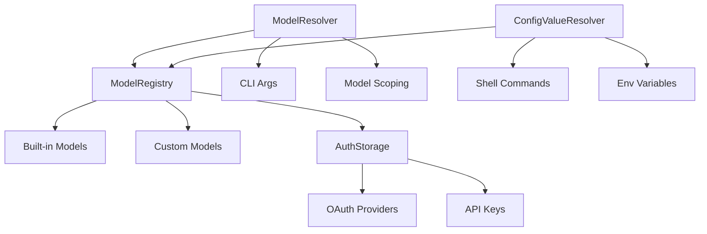
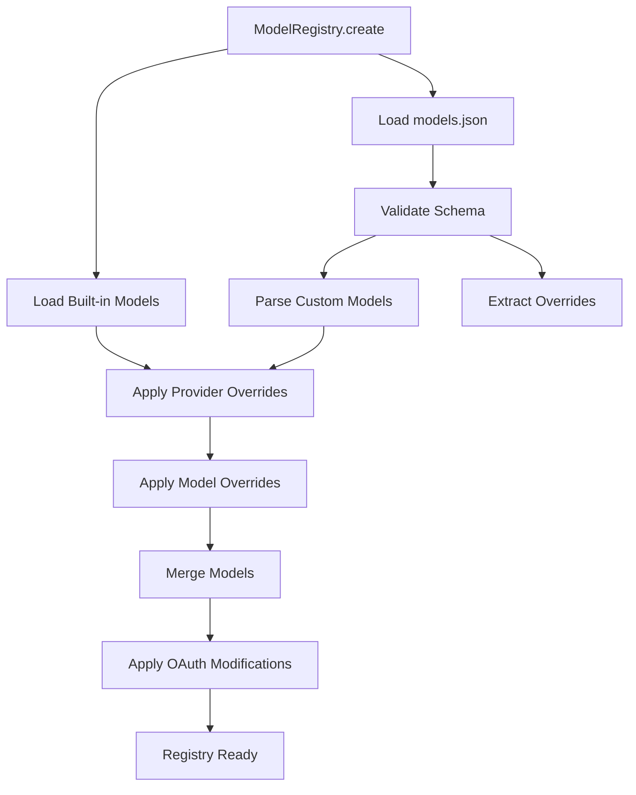
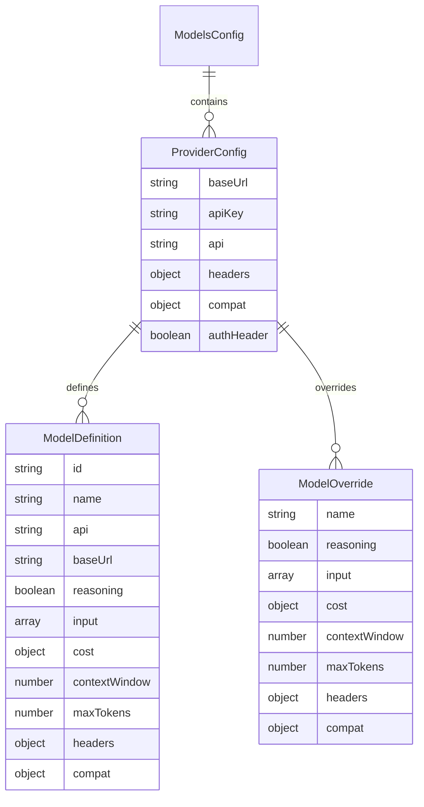
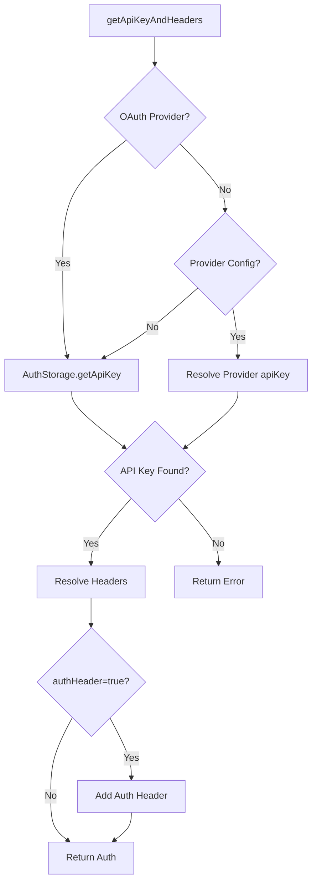
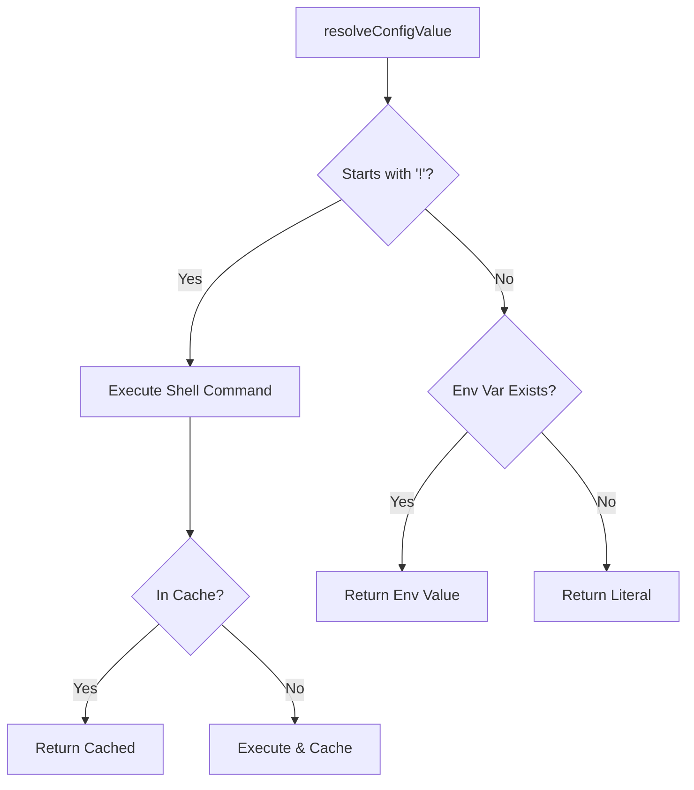
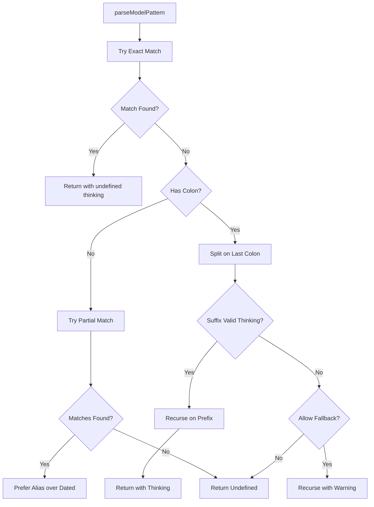
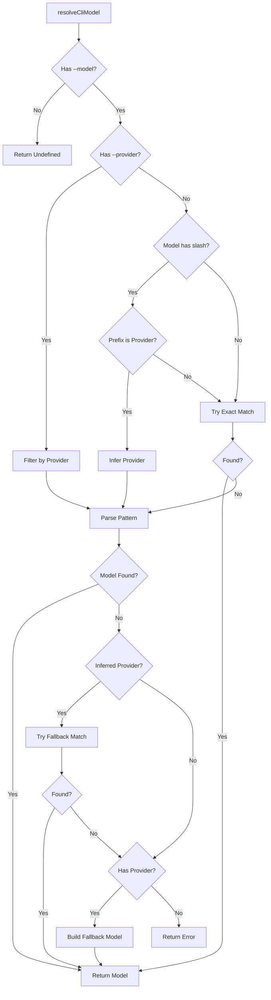
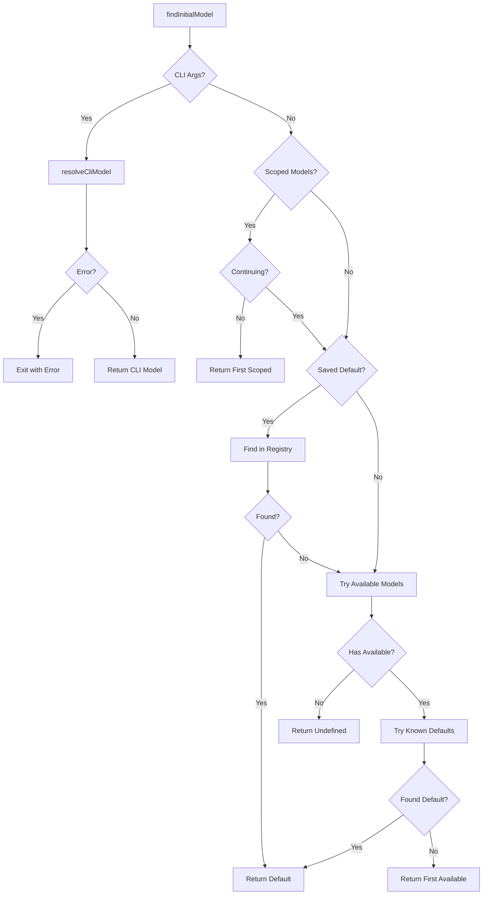
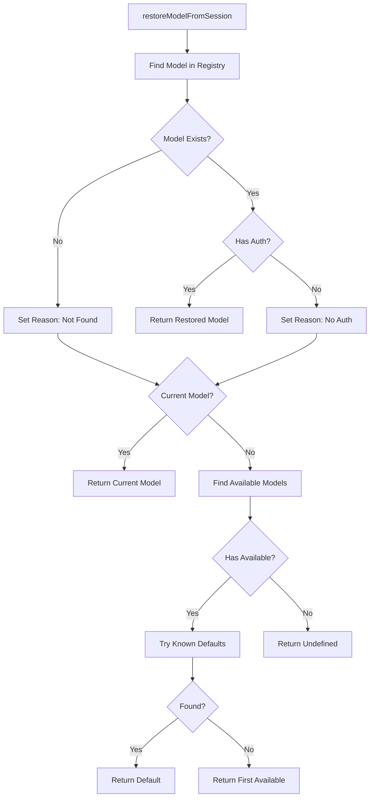

# Model Registry & Model Resolution

The Model Registry and Model Resolution system provides a centralized mechanism for managing AI models across multiple providers, resolving model selection from CLI arguments and configuration files, and handling authentication for model access. This system supports both built-in models from known providers (Anthropic, OpenAI, Google, etc.) and custom models defined in `models.json`, with flexible authentication via API keys, environment variables, shell commands, and OAuth.

The registry maintains a unified view of all available models, applies provider and model-level configuration overrides, and provides intelligent model resolution with fuzzy matching, pattern-based scoping, and thinking level specification. It serves as the foundation for model selection throughout the coding agent's lifecycle.

Sources: [model-registry.ts:1-600](../../../packages/coding-agent/src/core/model-registry.ts#L1-L600), [model-resolver.ts:1-50](../../../packages/coding-agent/src/core/model-resolver.ts#L1-L50)

## Architecture Overview

The model management system consists of three primary components working together:



**Key Components:**

| Component | Purpose | Key Responsibilities |
|-----------|---------|---------------------|
| `ModelRegistry` | Central model management | Load models, manage auth, apply overrides |
| `ModelResolver` | Model selection logic | Pattern matching, CLI resolution, initial model selection |
| `ConfigValueResolver` | Configuration resolution | Execute shell commands, resolve env vars, cache results |
| `AuthStorage` | Authentication management | Store/retrieve API keys, manage OAuth credentials |

Sources: [model-registry.ts:119-136](../../../packages/coding-agent/src/core/model-registry.ts#L119-L136), [model-resolver.ts:1-30](../../../packages/coding-agent/src/core/model-resolver.ts#L1-L30), [resolve-config-value.ts:1-20](../../../packages/coding-agent/src/core/resolve-config-value.ts#L1-L20)

## Model Registry

### Core Functionality

The `ModelRegistry` class manages the complete lifecycle of model definitions, from loading and merging to authentication resolution. It maintains separate collections for built-in models, custom models, provider configurations, and per-model request headers.



The registry provides methods to query models based on availability (with configured auth) versus all models, and handles dynamic provider registration from extensions.

Sources: [model-registry.ts:119-156](../../../packages/coding-agent/src/core/model-registry.ts#L119-L156)

### Model Loading and Merging

Models are loaded from two sources and merged with a conflict resolution strategy:

1. **Built-in Models**: Loaded from `@mariozechner/pi-ai` package via `getProviders()` and `getModels()`
2. **Custom Models**: Defined in `models.json` with full model specifications

**Merge Strategy:**
- Custom models with matching `provider` and `id` replace built-in models
- Provider-level overrides (baseUrl, compat) apply to all models from that provider
- Per-model overrides merge deeply with base model properties (cost, compat fields merged rather than replaced)

```typescript
// Deep merge example from source
function applyModelOverride(model: Model<Api>, override: ModelOverride): Model<Api> {
	const result = { ...model };
	if (override.cost) {
		result.cost = {
			input: override.cost.input ?? model.cost.input,
			output: override.cost.output ?? model.cost.output,
			cacheRead: override.cost.cacheRead ?? model.cost.cacheRead,
			cacheWrite: override.cost.cacheWrite ?? model.cost.cacheWrite,
		};
	}
	result.compat = mergeCompat(model.compat, override.compat);
	return result;
}
```

Sources: [model-registry.ts:157-203](../../../packages/coding-agent/src/core/model-registry.ts#L157-L203), [model-registry.ts:204-219](../../../packages/coding-agent/src/core/model-registry.ts#L204-L219)

### Configuration Schema

The `models.json` schema supports comprehensive provider and model configuration:



**Validation Rules:**
- Provider with custom models requires `baseUrl` and `apiKey`
- Provider without models must specify at least one of: `baseUrl`, `headers`, `compat`, `modelOverrides`
- Model `api` can be specified at provider or model level
- Custom models require valid `contextWindow` and `maxTokens` (if provided)

Sources: [model-registry.ts:13-68](../../../packages/coding-agent/src/core/model-registry.ts#L13-L68), [model-registry.ts:263-310](../../../packages/coding-agent/src/core/model-registry.ts#L263-L310)

### Authentication Resolution

The registry resolves authentication through a priority chain:



**Resolution Order:**
1. OAuth credentials from `AuthStorage` (highest priority)
2. Provider-level `apiKey` from `models.json` (resolved via `resolveConfigValue`)
3. Model-level headers merged with provider headers
4. If `authHeader: true`, API key added as `Authorization: Bearer` header

Sources: [model-registry.ts:469-507](../../../packages/coding-agent/src/core/model-registry.ts#L469-L507)

### Dynamic Provider Registration

Extensions can register providers at runtime via `registerProvider()`:

```typescript
interface ProviderConfigInput {
	baseUrl?: string;
	apiKey?: string;
	api?: Api;
	streamSimple?: (model, context, options) => AssistantMessageEventStream;
	headers?: Record<string, string>;
	authHeader?: boolean;
	oauth?: Omit<OAuthProviderInterface, "id">;
	models?: Array<ModelDefinition>;
}
```

**Registration Behavior:**
- If `models` provided: replaces all existing models for that provider
- If only `baseUrl`/`headers`: overrides existing models' URLs/headers
- If `oauth` provided: registers OAuth provider for `/login` support
- If `streamSimple` provided: registers custom API stream handler

Sources: [model-registry.ts:563-621](../../../packages/coding-agent/src/core/model-registry.ts#L563-L621), [model-registry.ts:623-663](../../../packages/coding-agent/src/core/model-registry.ts#L623-L663)

## Configuration Value Resolution

### Resolution Strategy

The `resolveConfigValue` function supports three formats for configuration values (API keys, headers):

| Format | Example | Behavior |
|--------|---------|----------|
| Shell Command | `!op read "op://vault/item/field"` | Execute command, cache result |
| Environment Variable | `MY_API_KEY` | Check `process.env`, fallback to literal |
| Literal | `sk-1234567890` | Use value directly |



**Caching Behavior:**
- Shell command results cached for process lifetime
- Environment variable lookups not cached (allows runtime changes)
- Cache cleared on registry refresh

Sources: [resolve-config-value.ts:12-29](../../../packages/coding-agent/src/core/resolve-config-value.ts#L12-L29), [resolve-config-value.ts:31-71](../../../packages/coding-agent/src/core/resolve-config-value.ts#L31-L71)

### Shell Command Execution

Shell commands execute with platform-specific handling:

**Windows:**
1. Try configured shell from `getShellConfig()` (PowerShell, cmd.exe)
2. Fallback to `execSync` with default shell

**Unix/macOS:**
- Direct execution via `execSync` with default shell

**Safety Features:**
- 10-second timeout
- Stderr ignored (only stdout captured)
- Trimmed output (empty strings become undefined)
- Error handling returns undefined (no exceptions thrown)

Sources: [resolve-config-value.ts:31-71](../../../packages/coding-agent/src/core/resolve-config-value.ts#L31-L71), [resolve-config-value.ts:73-83](../../../packages/coding-agent/src/core/resolve-config-value.ts#L73-L83)

### Header Resolution

Headers support the same resolution logic with deep merging:

```typescript
function resolveHeaders(headers: Record<string, string> | undefined): Record<string, string> | undefined {
	if (!headers) return undefined;
	const resolved: Record<string, string> = {};
	for (const [key, value] of Object.entries(headers)) {
		const resolvedValue = resolveConfigValue(value);
		if (resolvedValue) {
			resolved[key] = resolvedValue;
		}
	}
	return Object.keys(resolved).length > 0 ? resolved : undefined;
}
```

**Merge Order (lowest to highest priority):**
1. Model-level `headers` field
2. Provider-level `headers` from config
3. Model-level `headers` from config
4. `authHeader` injection (if enabled)

Sources: [resolve-config-value.ts:109-121](../../../packages/coding-agent/src/core/resolve-config-value.ts#L109-L121), [model-registry.ts:485-495](../../../packages/coding-agent/src/core/model-registry.ts#L485-L495)

## Model Resolution

### Pattern Matching Algorithm

The `parseModelPattern` function handles complex model IDs with colons (e.g., OpenRouter's `qwen/qwen3-coder:exacto`) and thinking level suffixes:



**Matching Priority:**
1. Exact ID match (`claude-sonnet-4-5`)
2. Canonical reference match (`anthropic/claude-sonnet-4-5`)
3. Partial ID/name match (case-insensitive)
4. Among partial matches: prefer alias over dated versions (e.g., `claude-sonnet-4-5` over `claude-sonnet-4-5-20241022`)

Sources: [model-resolver.ts:119-187](../../../packages/coding-agent/src/core/model-resolver.ts#L119-L187), [model-resolver.ts:189-243](../../../packages/coding-agent/src/core/model-resolver.ts#L189-L243)

### Thinking Level Specification

Thinking levels can be specified inline with model patterns using colon syntax:

| Pattern | Model | Thinking Level | Notes |
|---------|-------|----------------|-------|
| `sonnet:high` | `claude-sonnet-4-5` | `high` | Valid thinking level |
| `gpt-4o:medium` | `gpt-4o` | `medium` | Valid thinking level |
| `qwen/qwen3-coder:exacto` | `qwen/qwen3-coder:exacto` | `undefined` | Colon part of model ID |
| `qwen/qwen3-coder:exacto:high` | `qwen/qwen3-coder:exacto` | `high` | Thinking level after model ID |
| `sonnet:invalid` | `claude-sonnet-4-5` | `undefined` | Warning issued, uses default |

**Valid Thinking Levels:** `off`, `minimal`, `low`, `medium`, `high`, `xhigh`

Sources: [model-resolver.ts:189-243](../../../packages/coding-agent/src/core/model-resolver.ts#L189-L243), [model-resolver.test.ts:51-75](../../../packages/coding-agent/test/model-resolver.test.ts#L51-L75)

### CLI Model Resolution

The `resolveCliModel` function handles various CLI input formats with intelligent fallback:



**Resolution Examples:**

| CLI Input | Provider Flag | Resolved Provider | Resolved Model ID |
|-----------|---------------|-------------------|-------------------|
| `gpt-4o` | - | `openai` | `gpt-4o` |
| `openai/gpt-4o` | - | `openai` | `gpt-4o` |
| `4o` | `--provider openai` | `openai` | `gpt-4o` |
| `zai/glm-5` | - | `zai` | `glm-5` |
| `openrouter/qwen` | - | `openrouter` | `qwen/qwen3-coder:exacto` |
| `custom-model` | `--provider openai` | `openai` | `custom-model` (fallback) |

Sources: [model-resolver.ts:266-412](../../../packages/coding-agent/src/core/model-resolver.ts#L266-L412), [model-resolver.test.ts:127-235](../../../packages/coding-agent/test/model-resolver.test.ts#L127-L235)

### Model Scoping

The `resolveModelScope` function converts patterns to scoped models with optional thinking levels:

**Supported Patterns:**
- Exact match: `claude-sonnet-4-5`
- Partial match: `sonnet`
- Provider prefix: `anthropic/opus`
- Glob patterns: `anthropic/*`, `*sonnet*`, `provider/*:high`
- With thinking: `sonnet:high`, `anthropic/*:medium`

**Glob Matching:**
- Uses `minimatch` library with case-insensitive matching
- Matches against both `provider/modelId` and bare `modelId`
- Supports `*` (any chars), `?` (single char), `[abc]` (char class)

```typescript
// Glob matching example from source
const matchingModels = availableModels.filter((m) => {
	const fullId = `${m.provider}/${m.id}`;
	return minimatch(fullId, globPattern, { nocase: true }) || 
	       minimatch(m.id, globPattern, { nocase: true });
});
```

Sources: [model-resolver.ts:245-294](../../../packages/coding-agent/src/core/model-resolver.ts#L245-L294), [model-resolver.test.ts:1-50](../../../packages/coding-agent/test/model-resolver.test.ts#L1-L50)

### Initial Model Selection

The `findInitialModel` function determines the starting model using a priority chain:



**Priority Order:**
1. CLI args (`--provider` + `--model`)
2. First scoped model (if not continuing/resuming)
3. Saved default from settings
4. First available model matching known provider defaults
5. First available model with auth

Sources: [model-resolver.ts:414-479](../../../packages/coding-agent/src/core/model-resolver.ts#L414-L479)

### Default Models per Provider

The system maintains default model preferences for each provider:

| Provider | Default Model ID |
|----------|------------------|
| `anthropic` | `claude-opus-4-6` |
| `openai` | `gpt-5.4` |
| `openai-codex` | `gpt-5.4` |
| `google` | `gemini-2.5-pro` |
| `google-antigravity` | `gemini-3.1-pro-high` |
| `openrouter` | `openai/gpt-5.1-codex` |
| `vercel-ai-gateway` | `anthropic/claude-opus-4-6` |
| `xai` | `grok-4-fast-non-reasoning` |
| `zai` | `glm-5` |
| `cerebras` | `zai-glm-4.7` |
| `minimax` | `MiniMax-M2.7` |

These defaults guide initial model selection when no explicit choice is made.

Sources: [model-resolver.ts:16-37](../../../packages/coding-agent/src/core/model-resolver.ts#L16-L37)

## Session Model Restoration

When continuing or resuming a session, the system attempts to restore the previously used model:



**Fallback Strategy:**
1. Try to find saved model by provider + ID
2. Verify model still has configured auth
3. If not found/no auth, use current model (if available)
4. Otherwise, find any available model (prefer known defaults)
5. If no models available, return undefined

The function returns both the model and a fallback message to inform the user if restoration failed.

Sources: [model-resolver.ts:481-537](../../../packages/coding-agent/src/core/model-resolver.ts#L481-L537)

## Extension Integration

Extensions can dynamically register providers and models at runtime, enabling custom model support without modifying core configuration:

```typescript
// Extension registration example
modelRegistry.registerProvider("my-custom-provider", {
	baseUrl: "https://api.example.com/v1",
	apiKey: "MY_API_KEY",
	api: "openai-completions",
	models: [{
		id: "custom-model-1",
		name: "Custom Model 1",
		reasoning: true,
		input: ["text"],
		cost: { input: 1, output: 2, cacheRead: 0.1, cacheWrite: 1 },
		contextWindow: 128000,
		maxTokens: 8192,
	}],
	oauth: {
		authUrl: "https://auth.example.com/oauth",
		tokenUrl: "https://auth.example.com/token",
		// ... other OAuth config
	}
});
```

**Registration Capabilities:**
- Add new providers with custom models
- Override existing provider baseUrl/headers
- Register OAuth providers for subscription-based access
- Provide custom `streamSimple` implementations for non-standard APIs
- Unregister providers to restore original state

Sources: [model-registry.ts:538-561](../../../packages/coding-agent/src/core/model-registry.ts#L538-L561), [model-registry.ts:623-663](../../../packages/coding-agent/src/core/model-registry.ts#L623-L663)

## Error Handling

The system provides comprehensive error handling with user-friendly messages:

**Schema Validation Errors:**
- Detailed path-based error messages for invalid `models.json`
- Format: `providers.openai.models[0].contextWindow: must be number`

**Resolution Errors:**
- Shell command execution failures return undefined (no exceptions)
- Missing API keys reported with provider context
- Invalid thinking levels warn but continue with default
- Model not found errors suggest `--list-models` command

**Fallback Behavior:**
- Built-in models always available even if `models.json` fails
- Custom model loading errors don't prevent agent startup
- Registry refresh recovers from transient errors

Sources: [model-registry.ts:220-262](../../../packages/coding-agent/src/core/model-registry.ts#L220-L262), [resolve-config-value.ts:85-107](../../../packages/coding-agent/src/core/resolve-config-value.ts#L85-L107)

## Summary

The Model Registry and Model Resolution system provides a robust foundation for managing AI models across the coding agent. It supports flexible authentication methods (API keys, OAuth, shell commands), intelligent model selection with fuzzy matching and pattern-based scoping, and extensibility through dynamic provider registration. The system's deep merge semantics for overrides, comprehensive error handling, and fallback strategies ensure reliable operation even with partial configuration or transient failures. This architecture enables users to seamlessly work with both built-in and custom models while maintaining a consistent interface throughout the agent's lifecycle.