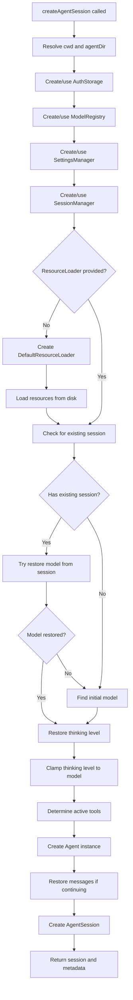
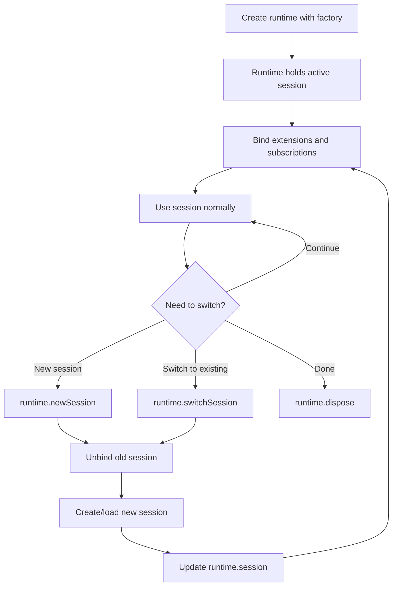

# SDK API for Programmatic Usage

The `@mariozechner/pi-coding-agent` package provides a comprehensive SDK for programmatically creating and controlling AI coding agent sessions. This SDK enables developers to integrate the coding agent into custom applications, scripts, and workflows without requiring the interactive TUI or web interfaces. The primary entry point is the `createAgentSession()` function, which handles initialization, configuration, and lifecycle management of agent sessions with extensive customization options.

The SDK supports flexible configuration of models, tools, extensions, resource loading, session persistence, and authentication. It provides both high-level convenience (using sensible defaults with automatic discovery) and low-level control (explicit configuration of all components). This makes it suitable for scenarios ranging from simple one-off scripts to complex multi-session applications with custom tooling and provider integrations.

Sources: [packages/coding-agent/src/core/sdk.ts:1-400](../../../packages/coding-agent/src/core/sdk.ts#L1-L400)

---

## Core API: `createAgentSession()`

The `createAgentSession()` function is the main entry point for SDK usage. It creates and initializes an `AgentSession` instance with all necessary dependencies, returning both the session and metadata about loaded extensions.

### Function Signature

```typescript
async function createAgentSession(
  options: CreateAgentSessionOptions = {}
): Promise<CreateAgentSessionResult>
```

Sources: [packages/coding-agent/src/core/sdk.ts:123-125](../../../packages/coding-agent/src/core/sdk.ts#L123-L125)

### Options Interface

| Option | Type | Description | Default |
|--------|------|-------------|---------|
| `cwd` | `string` | Working directory for project-local discovery | `process.cwd()` |
| `agentDir` | `string` | Global config directory | `~/.pi/agent` |
| `authStorage` | `AuthStorage` | Auth storage for credentials | `AuthStorage.create(agentDir/auth.json)` |
| `modelRegistry` | `ModelRegistry` | Model registry instance | `ModelRegistry.create(authStorage, agentDir/models.json)` |
| `model` | `Model<any>` | Model to use | From settings or first available |
| `thinkingLevel` | `ThinkingLevel` | Thinking level (off/low/medium/high) | From settings or 'medium', clamped to model capabilities |
| `scopedModels` | `Array<{model, thinkingLevel?}>` | Models available for cycling | `[]` |
| `tools` | `string[]` | Allowlist of tool names | Default built-in tools enabled |
| `customTools` | `ToolDefinition[]` | Custom tools to register | `[]` |
| `resourceLoader` | `ResourceLoader` | Resource loader instance | `DefaultResourceLoader` |
| `sessionManager` | `SessionManager` | Session manager instance | `SessionManager.create(cwd)` |
| `settingsManager` | `SettingsManager` | Settings manager instance | `SettingsManager.create(cwd, agentDir)` |
| `sessionStartEvent` | `SessionStartEvent` | Extension runtime startup metadata | `undefined` |

Sources: [packages/coding-agent/src/core/sdk.ts:17-53](../../../packages/coding-agent/src/core/sdk.ts#L17-L53)

### Return Value

The function returns a `CreateAgentSessionResult` object:

```typescript
interface CreateAgentSessionResult {
  session: AgentSession;
  extensionsResult: LoadExtensionsResult;
  modelFallbackMessage?: string;
}
```

- `session`: The created `AgentSession` instance ready for use
- `extensionsResult`: Metadata about loaded extensions (for UI context setup)
- `modelFallbackMessage`: Warning if session was restored with a different model than saved

Sources: [packages/coding-agent/src/core/sdk.ts:56-62](../../../packages/coding-agent/src/core/sdk.ts#L56-L62)

---

## Session Initialization Flow

The initialization process follows a multi-stage flow that handles defaults, discovery, restoration, and validation:



Sources: [packages/coding-agent/src/core/sdk.ts:126-318](../../../packages/coding-agent/src/core/sdk.ts#L126-L318)

### Model Selection Logic

Model selection follows a prioritized fallback chain:

1. **Explicit option**: If `options.model` is provided, use it
2. **Session restoration**: If continuing a session with existing messages, attempt to restore the saved model from `sessionManager.buildSessionContext().model`
3. **Settings default**: Use `settingsManager.getDefaultProvider()` and `settingsManager.getDefaultModel()`
4. **First available**: Use the first model from `modelRegistry.getAvailable()`

If a session model cannot be restored (e.g., provider no longer configured), a fallback message is generated and an alternative model is selected.

Sources: [packages/coding-agent/src/core/sdk.ts:165-190](../../../packages/coding-agent/src/core/sdk.ts#L165-L190)

### Thinking Level Resolution

Thinking level is determined through this sequence:

1. **Explicit option**: If `options.thinkingLevel` is provided, use it
2. **Session restoration**: If continuing a session, restore from session history (checking for `thinking_level_change` entries)
3. **Settings default**: Use `settingsManager.getDefaultThinkingLevel()`
4. **Hardcoded default**: Fall back to `DEFAULT_THINKING_LEVEL` (medium)
5. **Model clamping**: If the selected model doesn't support reasoning, force to "off"

Sources: [packages/coding-agent/src/core/sdk.ts:192-208](../../../packages/coding-agent/src/core/sdk.ts#L192-L208)

---

## Usage Patterns

### Minimal Usage

The simplest usage relies entirely on defaults, discovering configuration from the current working directory and `~/.pi/agent`:

```typescript
const { session } = await createAgentSession();

session.subscribe((event) => {
  if (event.type === "message_update" && 
      event.assistantMessageEvent.type === "text_delta") {
    process.stdout.write(event.assistantMessageEvent.delta);
  }
});

await session.prompt("What files are in the current directory?");
```

This pattern automatically:
- Discovers skills, extensions, tools, and context files from standard locations
- Selects a model from settings or uses the first available model with valid credentials
- Enables default built-in tools: `read`, `bash`, `edit`, `write`

Sources: [packages/coding-agent/examples/sdk/01-minimal.ts:1-20](../../../packages/coding-agent/examples/sdk/01-minimal.ts#L1-L20)

### Custom Model Selection

Explicit model selection allows control over which LLM provider and model to use:

```typescript
import { getModel } from "@mariozechner/pi-ai";
import { AuthStorage, createAgentSession, ModelRegistry } from "@mariozechner/pi-coding-agent";

const authStorage = AuthStorage.create();
const modelRegistry = ModelRegistry.create(authStorage);

// Option 1: Find a specific built-in model
const opus = getModel("anthropic", "claude-opus-4-5");

// Option 2: Find model via registry (includes custom models)
const customModel = modelRegistry.find("my-provider", "my-model");

// Option 3: Pick from available models
const available = await modelRegistry.getAvailable();

const { session } = await createAgentSession({
  model: available[0],
  thinkingLevel: "medium",
  authStorage,
  modelRegistry,
});
```

Sources: [packages/coding-agent/examples/sdk/02-custom-model.ts:1-45](../../../packages/coding-agent/examples/sdk/02-custom-model.ts#L1-L45)

### Tools Configuration

The `tools` option controls which built-in tools are enabled. When omitted, the default set (`read`, `bash`, `edit`, `write`) is used:

```typescript
// Read-only mode
await createAgentSession({
  tools: ["read", "grep", "find", "ls"],
  sessionManager: SessionManager.inMemory(),
});

// Custom tool selection
await createAgentSession({
  tools: ["read", "bash", "grep"],
  sessionManager: SessionManager.inMemory(),
});

// With custom working directory
await createAgentSession({
  cwd: "/path/to/project",
  tools: ["read", "bash", "edit", "write"],
  sessionManager: SessionManager.inMemory("/path/to/project"),
});
```

Tool names are matched against all available built-in tools. The `cwd` option is applied when building the actual tool implementations, ensuring file operations target the correct directory.

Sources: [packages/coding-agent/examples/sdk/05-tools.ts:1-43](../../../packages/coding-agent/examples/sdk/05-tools.ts#L1-L43)

### Extensions and Custom Tools

Extensions provide a unified system for intercepting agent events and registering custom tools. By default, extension files are discovered from:
- `~/.pi/agent/extensions/`
- `<cwd>/.pi/extensions/`
- Paths specified in `settings.json` "extensions" array

```typescript
import { createAgentSession, DefaultResourceLoader, getAgentDir, SessionManager } from "@mariozechner/pi-coding-agent";

const resourceLoader = new DefaultResourceLoader({
  cwd: process.cwd(),
  agentDir: getAgentDir(),
  additionalExtensionPaths: [
    "./my-logging-extension.ts",
    "./my-safety-extension.ts"
  ],
  extensionFactories: [
    (pi) => {
      pi.on("agent_start", () => {
        console.log("[Inline Extension] Agent starting");
      });
    },
  ],
});
await resourceLoader.reload();

const { session } = await createAgentSession({
  resourceLoader,
  sessionManager: SessionManager.inMemory(),
});
```

Extensions can register custom tools using `pi.registerTool()`, listen to events like `agent_start`, `tool_call`, and `agent_end`, and register slash commands.

Sources: [packages/coding-agent/examples/sdk/06-extensions.ts:1-67](../../../packages/coding-agent/examples/sdk/06-extensions.ts#L1-L67)

### Full Control Configuration

For complete control, all components can be explicitly configured with no automatic discovery:

```typescript
import { getModel } from "@mariozechner/pi-ai";
import {
  AuthStorage,
  createAgentSession,
  createExtensionRuntime,
  ModelRegistry,
  SessionManager,
  SettingsManager,
} from "@mariozechner/pi-coding-agent";

const authStorage = AuthStorage.create("/tmp/my-agent/auth.json");
authStorage.setRuntimeApiKey("anthropic", process.env.MY_ANTHROPIC_KEY);

const modelRegistry = ModelRegistry.inMemory(authStorage);
const model = getModel("anthropic", "claude-sonnet-4-20250514");

const settingsManager = SettingsManager.inMemory({
  compaction: { enabled: false },
  retry: { enabled: true, maxRetries: 2 },
});

const resourceLoader = {
  getExtensions: () => ({ extensions: [], errors: [], runtime: createExtensionRuntime() }),
  getSkills: () => ({ skills: [], diagnostics: [] }),
  getPrompts: () => ({ prompts: [], diagnostics: [] }),
  getThemes: () => ({ themes: [], diagnostics: [] }),
  getAgentsFiles: () => ({ agentsFiles: [] }),
  getSystemPrompt: () => `You are a minimal assistant. Available: read, bash.`,
  getAppendSystemPrompt: () => [],
  extendResources: () => {},
  reload: async () => {},
};

const { session } = await createAgentSession({
  cwd: process.cwd(),
  agentDir: "/tmp/my-agent",
  model,
  thinkingLevel: "off",
  authStorage,
  modelRegistry,
  resourceLoader,
  tools: ["read", "bash"],
  sessionManager: SessionManager.inMemory(),
  settingsManager,
});
```

This pattern is useful for testing, embedded scenarios, or applications with custom configuration management.

Sources: [packages/coding-agent/examples/sdk/12-full-control.ts:1-68](../../../packages/coding-agent/examples/sdk/12-full-control.ts#L1-L68)

---

## Agent Instance Configuration

The `Agent` instance created within `createAgentSession()` is configured with several key behaviors:

### Message Conversion and Image Blocking

A custom `convertToLlm` function wraps the standard message conversion to implement defense-in-depth image blocking:

```typescript
const convertToLlmWithBlockImages = (messages: AgentMessage[]): Message[] => {
  const converted = convertToLlm(messages);
  if (!settingsManager.getBlockImages()) {
    return converted;
  }
  // Filter out ImageContent, replacing with text placeholder
  return converted.map((msg) => {
    if (msg.role === "user" || msg.role === "toolResult") {
      const content = msg.content;
      if (Array.isArray(content)) {
        const hasImages = content.some((c) => c.type === "image");
        if (hasImages) {
          const filteredContent = content
            .map((c) => c.type === "image" 
              ? { type: "text" as const, text: "Image reading is disabled." } 
              : c)
            .filter(/* dedupe consecutive placeholders */);
          return { ...msg, content: filteredContent };
        }
      }
    }
    return msg;
  });
};
```

This ensures that even if images are included in the message history, they won't be sent to the provider when `blockImages` is enabled.

Sources: [packages/coding-agent/src/core/sdk.ts:216-243](../../../packages/coding-agent/src/core/sdk.ts#L216-L243)

### Stream Function and Authentication

The `streamFn` handles authentication and provider-specific headers:

```typescript
streamFn: async (model, context, options) => {
  const auth = await modelRegistry.getApiKeyAndHeaders(model);
  if (!auth.ok) {
    throw new Error(auth.error);
  }
  const openRouterAttributionHeaders = getOpenRouterAttributionHeaders(model, settingsManager);
  return streamSimple(model, context, {
    ...options,
    apiKey: auth.apiKey,
    headers: openRouterAttributionHeaders || auth.headers || options?.headers
      ? { ...openRouterAttributionHeaders, ...auth.headers, ...options?.headers }
      : undefined,
  });
}
```

OpenRouter attribution headers are added when telemetry is enabled and the provider is OpenRouter, including `HTTP-Referer`, `X-OpenRouter-Title`, and `X-OpenRouter-Categories`.

Sources: [packages/coding-agent/src/core/sdk.ts:248-262](../../../packages/coding-agent/src/core/sdk.ts#L248-L262), [packages/coding-agent/src/core/sdk.ts:95-106](../../../packages/coding-agent/src/core/sdk.ts#L95-L106)

### Extension Hooks

The agent configuration includes hooks for extensions to intercept requests and responses:

```typescript
onPayload: async (payload, _model) => {
  const runner = extensionRunnerRef.current;
  if (!runner?.hasHandlers("before_provider_request")) {
    return payload;
  }
  return runner.emitBeforeProviderRequest(payload);
},
onResponse: async (response, _model) => {
  const runner = extensionRunnerRef.current;
  if (!runner?.hasHandlers("after_provider_response")) {
    return;
  }
  await runner.emit({
    type: "after_provider_response",
    status: response.status,
    headers: response.headers,
  });
}
```

This allows extensions to modify outgoing requests or observe incoming responses.

Sources: [packages/coding-agent/src/core/sdk.ts:263-280](../../../packages/coding-agent/src/core/sdk.ts#L263-L280)

---

## Session Runtime Management

For applications that need to replace the active session (e.g., new-session, resume, fork, or import flows), the SDK provides `AgentSessionRuntime`:



### Runtime Factory Pattern

```typescript
import {
  createAgentSessionRuntime,
  createAgentSessionFromServices,
  createAgentSessionServices,
} from "@mariozechner/pi-coding-agent";

const createRuntime = async ({ cwd, sessionManager, sessionStartEvent }) => {
  const services = await createAgentSessionServices({ cwd });
  return {
    ...(await createAgentSessionFromServices({
      services,
      sessionManager,
      sessionStartEvent,
    })),
    services,
    diagnostics: services.diagnostics,
  };
};

const runtime = await createAgentSessionRuntime(createRuntime, {
  cwd: process.cwd(),
  agentDir: getAgentDir(),
  sessionManager: SessionManager.create(process.cwd()),
});
```

Sources: [packages/coding-agent/examples/sdk/13-session-runtime.ts:1-30](../../../packages/coding-agent/examples/sdk/13-session-runtime.ts#L1-L30)

### Rebinding After Session Replacement

After replacing the session, session-local subscriptions and extension bindings must be rebound:

```typescript
let unsubscribe: (() => void) | undefined;

async function bindSession() {
  unsubscribe?.();
  const session = runtime.session;
  await session.bindExtensions({});
  unsubscribe = session.subscribe((event) => {
    if (event.type === "queue_update") {
      console.log("Queued:", event.steering.length + event.followUp.length);
    }
  });
  return session;
}

let session = await bindSession();

// Switch to new session
await runtime.newSession();
session = await bindSession();  // Rebind to new session

// Switch back to original
await runtime.switchSession(originalSessionFile);
session = await bindSession();  // Rebind again
```

This pattern ensures that event handlers and extension state are correctly associated with the active session.

Sources: [packages/coding-agent/examples/sdk/13-session-runtime.ts:32-58](../../../packages/coding-agent/examples/sdk/13-session-runtime.ts#L32-L58)

---

## Exported Types and Utilities

The SDK re-exports key types and utility functions for convenience:

### Type Exports

```typescript
export * from "./agent-session-runtime.js";
export type {
  ExtensionAPI,
  ExtensionCommandContext,
  ExtensionContext,
  ExtensionFactory,
  SlashCommandInfo,
  SlashCommandSource,
  ToolDefinition,
} from "./extensions/index.js";
export type { PromptTemplate } from "./prompt-templates.js";
export type { Skill } from "./skills.js";
export type { Tool } from "./tools/index.js";
```

Sources: [packages/coding-agent/src/core/sdk.ts:64-76](../../../packages/coding-agent/src/core/sdk.ts#L64-L76)

### Tool Factory Exports

For creating tools with custom working directories:

```typescript
export {
  withFileMutationQueue,
  createCodingTools,
  createReadOnlyTools,
  createReadTool,
  createBashTool,
  createEditTool,
  createWriteTool,
  createGrepTool,
  createFindTool,
  createLsTool,
};
```

These factories allow applications to instantiate tools independently, useful for advanced scenarios where tools need to be created outside the standard session initialization flow.

Sources: [packages/coding-agent/src/core/sdk.ts:78-90](../../../packages/coding-agent/src/core/sdk.ts#L78-L90)

---

## Summary

The SDK API provides a flexible and powerful interface for programmatic control of the pi coding agent. It supports a spectrum of use cases from minimal one-line initialization to complete low-level control of all components. Key capabilities include:

- **Flexible initialization**: Defaults with discovery or explicit configuration
- **Model management**: Support for multiple providers, custom models, and dynamic model selection
- **Tool customization**: Built-in tool selection and custom tool registration via extensions
- **Session persistence**: Automatic session restoration and multi-session management
- **Extension system**: Unified event interception and custom tool registration
- **Runtime management**: Session replacement and rebinding for complex application flows

This design enables integration into scripts, custom UIs, testing frameworks, and embedded applications while maintaining compatibility with the interactive TUI and web interfaces.

Sources: [packages/coding-agent/src/core/sdk.ts](../../../packages/coding-agent/src/core/sdk.ts), [packages/coding-agent/examples/sdk/](../../../packages/coding-agent/examples/sdk/)