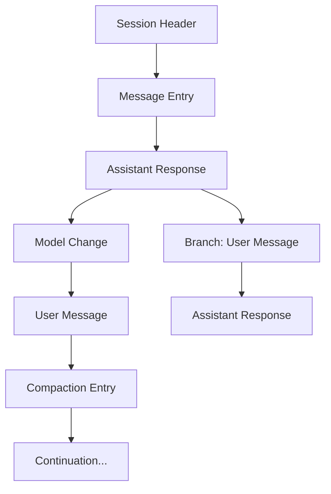
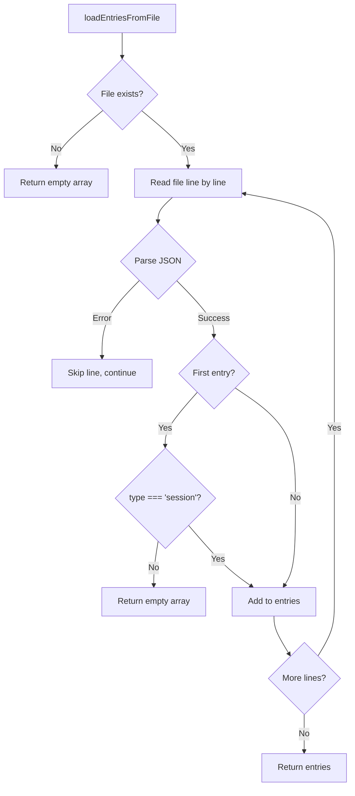
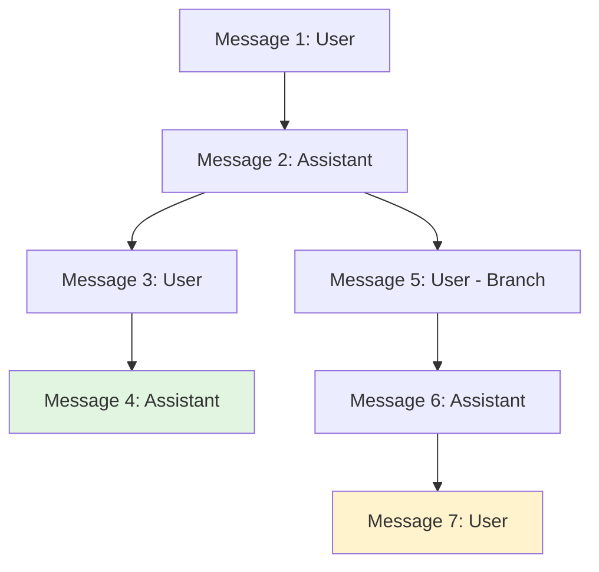
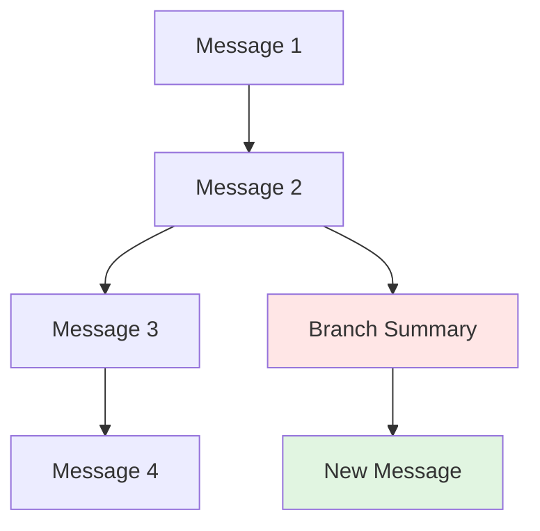
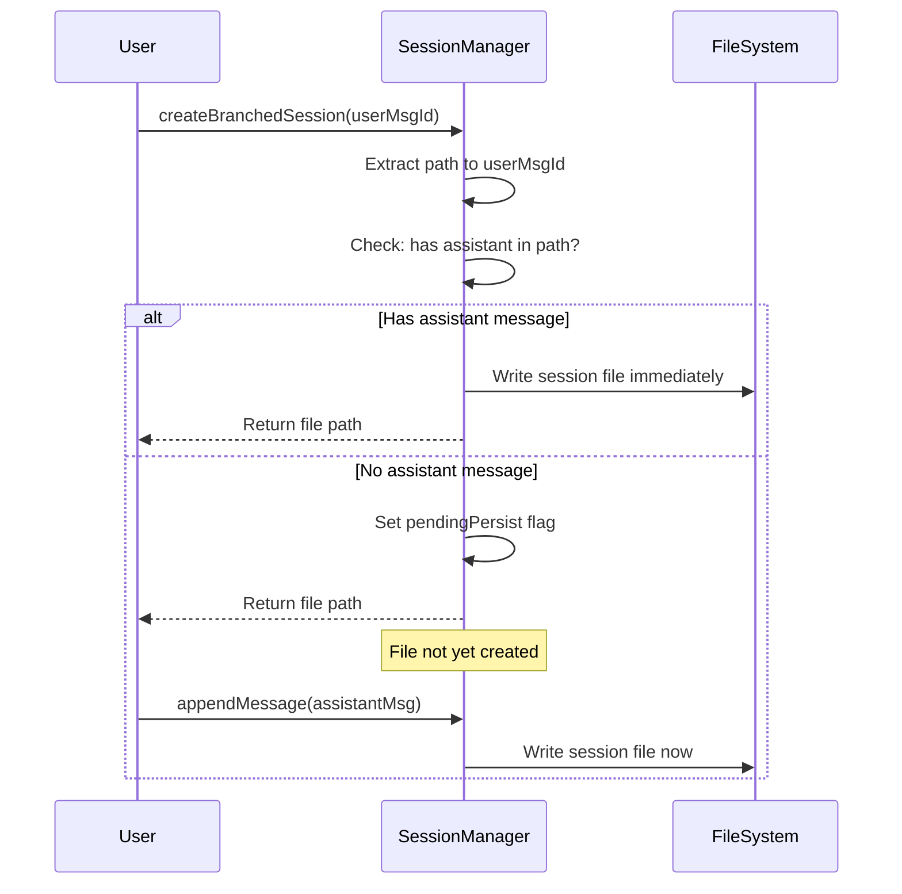
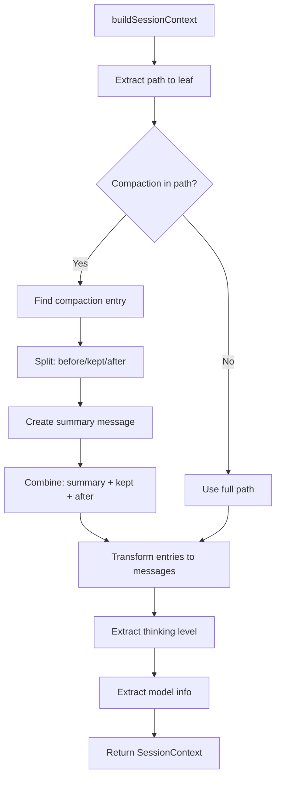
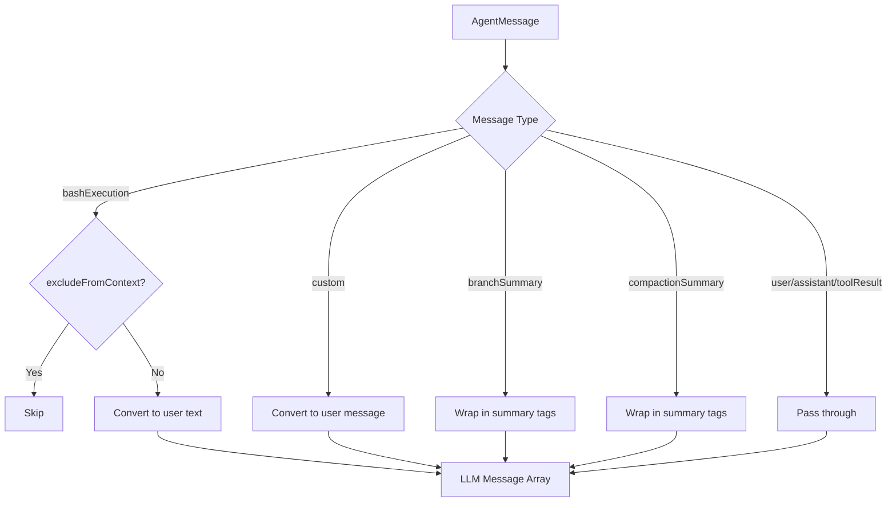

# Session Manager: Persistence, Branching & Tree Navigation

The Session Manager is a core component of the `@pi-coding-agent` package responsible for managing conversation state through a persistent, append-only event log architecture. It provides sophisticated branching capabilities that allow users to explore alternative conversation paths while maintaining a complete history tree. The system supports both in-memory and file-based persistence, enabling session recovery, tree navigation, and the ability to fork conversations at any point in the history.

The Session Manager implements an immutable event sourcing pattern where all changes (messages, model switches, compaction events, labels, etc.) are stored as sequential entries with parent-child relationships, forming a directed acyclic graph (DAG). This architecture enables powerful features like branching from any point in history, creating summaries of abandoned paths, and reconstructing conversation context for any leaf node in the tree.

Sources: [session-manager.ts](../../../packages/coding-agent/src/core/session-manager.ts)

---

## Architecture Overview

### Entry-Based Event Log

The Session Manager stores all conversation state as a sequence of typed entries in an append-only log. Each entry has a unique ID, optional parent ID, and timestamp, forming a tree structure where multiple entries can share the same parent (creating branches).



**Entry Types:**

| Entry Type | Purpose | Key Fields |
|------------|---------|------------|
| `session` | Session initialization header | `id`, `timestamp`, `cwd`, `forkedFrom` |
| `message` | User or assistant messages | `message` (AgentMessage), `parentId` |
| `thinking_level_change` | Extended thinking mode toggle | `thinkingLevel` |
| `model_change` | LLM provider/model switch | `provider`, `modelId` |
| `compaction` | History summarization event | `summary`, `firstKeptEntryId`, `tokensBefore` |
| `branch_summary` | Summary of abandoned branch | `summary`, `fromId` |
| `label` | User-defined checkpoint label | `targetId`, `label` |
| `custom` | Extension-injected metadata | `customType`, `data` |

Sources: [session-manager.ts](../../../packages/coding-agent/src/core/session-manager.ts), [tree-traversal.test.ts:1-50](../../../packages/coding-agent/test/session-manager/tree-traversal.test.ts#L1-L50)

### Persistence Modes

The Session Manager operates in two modes:

1. **In-Memory Mode**: All entries stored in RAM only, used for testing or ephemeral sessions
2. **File-Backed Mode**: Entries written to `.jsonl` (JSON Lines) format with immediate persistence

```typescript
// In-memory session (no file persistence)
const session = SessionManager.inMemory();

// File-backed session (auto-persists to disk)
const session = SessionManager.create(sessionDir, cwd);

// Load existing session
const session = SessionManager.open(sessionFile, cwd);
```

Sources: [session-manager.ts](../../../packages/coding-agent/src/core/session-manager.ts), [tree-traversal.test.ts:14-20](../../../packages/coding-agent/test/session-manager/tree-traversal.test.ts#L14-L20)

---

## File Format and Persistence

### JSONL File Structure

Sessions are stored as newline-delimited JSON (`.jsonl`), where each line is a complete JSON object representing one entry. The first line must always be a session header.

```jsonl
{"type":"session","id":"abc123","timestamp":"2025-01-01T00:00:00Z","cwd":"/project"}
{"type":"message","id":"msg1","parentId":null,"timestamp":"2025-01-01T00:00:01Z","message":{...}}
{"type":"message","id":"msg2","parentId":"msg1","timestamp":"2025-01-01T00:00:02Z","message":{...}}
{"type":"thinking_level_change","id":"think1","parentId":"msg2","timestamp":"2025-01-01T00:00:03Z","thinkingLevel":"high"}
```

Sources: [file-operations.test.ts:35-43](../../../packages/coding-agent/test/session-manager/file-operations.test.ts#L35-L43)

### Loading and Validation

The `loadEntriesFromFile` function reads session files with robust error handling:

- Returns empty array for non-existent files
- Validates session header presence (first entry must be `type: "session"`)
- Skips malformed JSON lines while preserving valid entries
- Returns empty array if no valid session header found



Sources: [file-operations.test.ts:12-68](../../../packages/coding-agent/test/session-manager/file-operations.test.ts#L12-L68)

### Session File Discovery

The `findMostRecentSession` function locates the most recently modified session in a directory:

- Filters for `.jsonl` files only
- Validates each file has a proper session header
- Returns the file with the most recent modification time
- Returns `null` if no valid sessions found

Sources: [file-operations.test.ts:70-132](../../../packages/coding-agent/test/session-manager/file-operations.test.ts#L70-L132)

### Corruption Recovery

When opening a file without a valid session header or an empty file, the Session Manager automatically recovers by truncating and rewriting with a new session header:

```typescript
// Empty or corrupted file gets rewritten with valid header
const sm = SessionManager.open(corruptedFile, cwd);
// File now contains: {"type":"session","id":"...","timestamp":"...","cwd":"..."}
```

This ensures session integrity while preserving the explicit file path for subsequent operations.

Sources: [file-operations.test.ts:134-207](../../../packages/coding-agent/test/session-manager/file-operations.test.ts#L134-L207)

---

## Tree Structure and Navigation

### Entry Parent-Child Relationships

Every entry (except the first) has a `parentId` field that references its parent, forming a tree structure. The Session Manager maintains a "leaf pointer" (`_leafId`) that tracks the current position in the tree.



In this tree:
- Messages 1→2→3→4 form the main branch
- Messages 1→2→5→6→7 form an alternative branch
- Both branches share the common ancestor path 1→2

Sources: [tree-traversal.test.ts:11-39](../../../packages/coding-agent/test/session-manager/tree-traversal.test.ts#L11-L39)

### Tree Node Structure

The `getTree()` method converts the flat entry list into a hierarchical tree structure:

```typescript
interface TreeNode {
  entry: SessionEntry;           // The entry data
  children: TreeNode[];          // Child nodes
  label?: string;                // Optional user label
  labelTimestamp?: number;       // When label was set
}
```

Each node represents one entry and contains references to its children, enabling recursive tree traversal and visualization.

Sources: [labels.test.ts:70-90](../../../packages/coding-agent/test/session-manager/labels.test.ts#L70-L90)

### Path Extraction

The `getBranch(entryId?)` method extracts the linear path from the root to a specific entry (or current leaf if not specified):

```typescript
// Get path to current leaf
const path = session.getBranch();
// Returns: [entry1, entry2, entry3, ...]

// Get path to specific entry
const path = session.getBranch("msg5");
// Returns: [root, ..., msg5]
```

This is used for building conversation context and determining which entries are relevant for the current branch.

Sources: [tree-traversal.test.ts:104-141](../../../packages/coding-agent/test/session-manager/tree-traversal.test.ts#L104-L141)

---

## Branching Operations

### Simple Branching

The `branch(entryId)` method moves the leaf pointer to any existing entry, making it the new "current position":

```typescript
const id1 = session.appendMessage(userMsg("first"));
const id2 = session.appendMessage(assistantMsg("response"));
session.appendMessage(userMsg("continue"));

// Go back to id2 and start a new branch
session.branch(id2);
session.appendMessage(userMsg("alternative path"));
```

After branching, new entries become children of the branch point, creating sibling branches.

Sources: [tree-traversal.test.ts:237-261](../../../packages/coding-agent/test/session-manager/tree-traversal.test.ts#L237-L261)

### Branching with Summary

The `branchWithSummary(entryId, summary)` method creates a branch with a summary of the abandoned path:

```typescript
// Current path: 1 → 2 → 3 → 4
const summaryId = session.branchWithSummary(
  id2,
  "Tried approach X but hit performance issues"
);
// New path: 1 → 2 → [branch_summary] → (new entries)
```

The branch summary entry is injected into the conversation context as a user message, providing the LLM with information about the abandoned exploration.



Sources: [tree-traversal.test.ts:263-285](../../../packages/coding-agent/test/session-manager/tree-traversal.test.ts#L263-L285), [messages.ts:28-34](../../../packages/coding-agent/src/core/messages.ts#L28-L34)

### Creating Forked Sessions

The `createBranchedSession(entryId)` method creates an entirely new session file containing only the path from root to the specified entry:

```typescript
// Original session: 1 → 2 → 3 → 4
//                        ↘ 5 → 6

// Fork from entry 5
const newFile = session.createBranchedSession("5");
// New session file contains: 1 → 2 → 5
// Original session is replaced with the forked content
```

This is useful for:
- Isolating a specific conversation branch as a standalone session
- Cleaning up abandoned branches
- Creating checkpoints before risky operations

**Deferred Persistence Behavior:**

When forking from a point that contains no assistant messages (e.g., just user messages), the new file is NOT written immediately. Instead, persistence is deferred until the first assistant response is appended. This matches the behavior of `SessionManager.create()` and prevents premature file creation.



Sources: [tree-traversal.test.ts:313-401](../../../packages/coding-agent/test/session-manager/tree-traversal.test.ts#L313-L401)

---

## Context Building

### Building Session Context

The `buildSessionContext(entries, leafId?)` function reconstructs the conversation state for a specific branch:

1. **Path Extraction**: Determines the path from root to the specified leaf (or last entry)
2. **Compaction Handling**: If a compaction entry exists, replaces earlier messages with a summary
3. **Branch Summary Inclusion**: Inserts branch summaries as user messages
4. **Message Transformation**: Converts all entries to LLM-compatible message format
5. **State Tracking**: Extracts current thinking level and model configuration



Sources: [build-context.test.ts:1-30](../../../packages/coding-agent/test/session-manager/build-context.test.ts#L1-L30)

### Compaction Support

Compaction entries enable token reduction by summarizing earlier conversation history:

```typescript
interface CompactionEntry {
  type: "compaction";
  id: string;
  parentId: string | null;
  timestamp: string;
  summary: string;              // LLM-generated summary
  firstKeptEntryId: string;     // First message to keep unsummarized
  tokensBefore: number;         // Original token count
}
```

When building context with compaction:
- Messages before `firstKeptEntryId` are replaced with a summary message
- Messages from `firstKeptEntryId` onward are included verbatim
- The summary is prefixed with a delimiter for LLM clarity

```typescript
const COMPACTION_SUMMARY_PREFIX = `The conversation history before this point was compacted into the following summary:

<summary>
`;
```

Sources: [build-context.test.ts:72-104](../../../packages/coding-agent/test/session-manager/build-context.test.ts#L72-L104), [messages.ts:7-13](../../../packages/coding-agent/src/core/messages.ts#L7-L13)

### Branch Summary Integration

Branch summaries are included in the context as user messages with special formatting:

```typescript
const BRANCH_SUMMARY_PREFIX = `The following is a summary of a branch that this conversation came back from:

<summary>
`;

const BRANCH_SUMMARY_SUFFIX = `</summary>`;
```

This provides the LLM with context about alternative approaches that were explored and abandoned.

Sources: [messages.ts:15-20](../../../packages/coding-agent/src/core/messages.ts#L15-L20), [build-context.test.ts:123-146](../../../packages/coding-agent/test/session-manager/build-context.test.ts#L123-L146)

---

## Labels and Checkpoints

### Label System

Users can attach text labels to any entry in the session tree, creating named checkpoints for easy navigation:

```typescript
const msgId = session.appendMessage(userMsg("important point"));
session.appendLabelChange(msgId, "checkpoint-before-refactor");

// Later, retrieve the label
const label = session.getLabel(msgId); // "checkpoint-before-refactor"

// Clear the label
session.appendLabelChange(msgId, undefined);
```

Labels are stored as separate `LabelEntry` records, allowing multiple label changes over time. The most recent label for an entry is the active one.

Sources: [labels.test.ts:6-31](../../../packages/coding-agent/test/session-manager/labels.test.ts#L6-L31)

### Label Persistence in Trees

Labels are included in tree nodes for UI display:

```typescript
interface TreeNode {
  entry: SessionEntry;
  children: TreeNode[];
  label?: string;           // Current label text
  labelTimestamp?: number;  // When label was last set
}
```

When multiple labels are set on the same entry, the last one wins:

```typescript
session.appendLabelChange(msgId, "first");
session.appendLabelChange(msgId, "second");
session.appendLabelChange(msgId, "third");

session.getLabel(msgId); // "third"
```

Sources: [labels.test.ts:33-67](../../../packages/coding-agent/test/session-manager/labels.test.ts#L33-L67)

### Label Preservation During Branching

When creating a branched session, labels are preserved only for entries that are in the extracted path:

```typescript
// Session: 1 → 2 → 3
// Labels: 1="first", 2="second", 3="third"

session.createBranchedSession(id2);
// New session: 1 → 2
// Labels preserved: 1="first", 2="second"
// Label for 3 is discarded (not in path)
```

Sources: [labels.test.ts:92-133](../../../packages/coding-agent/test/session-manager/labels.test.ts#L92-L133)

---

## Session Working Directory Validation

### CWD Issue Detection

The Session Manager validates that the stored working directory (`cwd`) still exists when loading a session. If the directory is missing, it provides structured error information:

```typescript
interface SessionCwdIssue {
  sessionFile?: string;    // Path to session file
  sessionCwd: string;      // Stored cwd (missing)
  fallbackCwd: string;     // Current working directory
}
```

The `getMissingSessionCwdIssue` function checks for this condition:

```typescript
const issue = getMissingSessionCwdIssue(sessionManager, fallbackCwd);
if (issue) {
  // Handle missing directory (prompt user, throw error, etc.)
}
```

Sources: [session-cwd.ts:1-32](../../../packages/coding-agent/src/core/session-cwd.ts#L1-L32)

### Error Handling

The system provides three levels of handling for missing directories:

1. **Detection**: `getMissingSessionCwdIssue` returns issue details or `undefined`
2. **Formatting**: Helper functions format user-friendly messages
3. **Assertion**: `assertSessionCwdExists` throws `MissingSessionCwdError` if directory is missing

```typescript
// Format error message
const errorMsg = formatMissingSessionCwdError(issue);
// "Stored session working directory does not exist: /old/path
//  Session file: /sessions/session.jsonl
//  Current working directory: /new/path"

// Format prompt for user
const prompt = formatMissingSessionCwdPrompt(issue);
// "cwd from session file does not exist
//  /old/path
//  
//  continue in current cwd
//  /new/path"
```

Sources: [session-cwd.ts:34-60](../../../packages/coding-agent/src/core/session-cwd.ts#L34-L60)

---

## Message Type Extensions

### Custom Message Types

The Session Manager extends the base `AgentMessage` type system with coding-agent-specific message types through TypeScript declaration merging:

```typescript
declare module "@mariozechner/pi-agent-core" {
  interface CustomAgentMessages {
    bashExecution: BashExecutionMessage;
    custom: CustomMessage;
    branchSummary: BranchSummaryMessage;
    compactionSummary: CompactionSummaryMessage;
  }
}
```

Sources: [messages.ts:48-55](../../../packages/coding-agent/src/core/messages.ts#L48-L55)

### Bash Execution Messages

Bash execution messages record shell command results:

```typescript
interface BashExecutionMessage {
  role: "bashExecution";
  command: string;
  output: string;
  exitCode: number | undefined;
  cancelled: boolean;
  truncated: boolean;
  fullOutputPath?: string;
  timestamp: number;
  excludeFromContext?: boolean;  // If true, excluded from LLM context
}
```

These are transformed to user messages when included in LLM context:

```typescript
function bashExecutionToText(msg: BashExecutionMessage): string {
  let text = `Ran \`${msg.command}\`\n`;
  if (msg.output) {
    text += `\`\`\`\n${msg.output}\n\`\`\``;
  }
  // ... includes exit code, cancellation status, truncation info
}
```

Sources: [messages.ts:22-38](../../../packages/coding-agent/src/core/messages.ts#L22-L38), [messages.ts:57-76](../../../packages/coding-agent/src/core/messages.ts#L57-L76)

### Custom Extension Messages

Extensions can inject custom messages into the conversation:

```typescript
interface CustomMessage<T = unknown> {
  role: "custom";
  customType: string;                           // Extension-defined type
  content: string | (TextContent | ImageContent)[];
  display: boolean;                             // Show in UI?
  details?: T;                                  // Type-safe metadata
  timestamp: number;
}
```

Sources: [messages.ts:40-48](../../../packages/coding-agent/src/core/messages.ts#L40-L48)

### Message Transformation to LLM Format

The `convertToLlm` function transforms all custom message types to standard LLM message format:



Sources: [messages.ts:106-136](../../../packages/coding-agent/src/core/messages.ts#L106-L136)

---

## Summary

The Session Manager provides a robust foundation for conversation state management in the PI Coding Agent through its immutable event log architecture. By representing all state changes as typed entries with parent-child relationships, it enables sophisticated features like:

- **Persistent History**: All conversation state survives restarts through JSONL file storage
- **Flexible Branching**: Users can explore alternative approaches without losing previous work
- **Tree Navigation**: Full conversation history is preserved as a navigable tree structure
- **Context Reconstruction**: Any point in the conversation can be reconstructed with proper context
- **Corruption Recovery**: Automatic handling of invalid or empty session files
- **Label System**: Named checkpoints for easy navigation to important conversation points
- **Extension Integration**: Custom entry types allow extensions to inject metadata and custom messages

The append-only, immutable design ensures conversation integrity while the branching capabilities enable exploratory workflows that are essential for effective AI-assisted development.

Sources: [session-manager.ts](../../../packages/coding-agent/src/core/session-manager.ts), [tree-traversal.test.ts](../../../packages/coding-agent/test/session-manager/tree-traversal.test.ts), [build-context.test.ts](../../../packages/coding-agent/test/session-manager/build-context.test.ts), [file-operations.test.ts](../../../packages/coding-agent/test/session-manager/file-operations.test.ts), [labels.test.ts](../../../packages/coding-agent/test/session-manager/labels.test.ts)