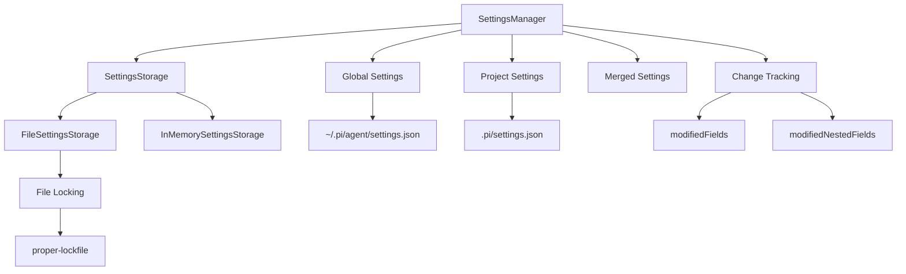
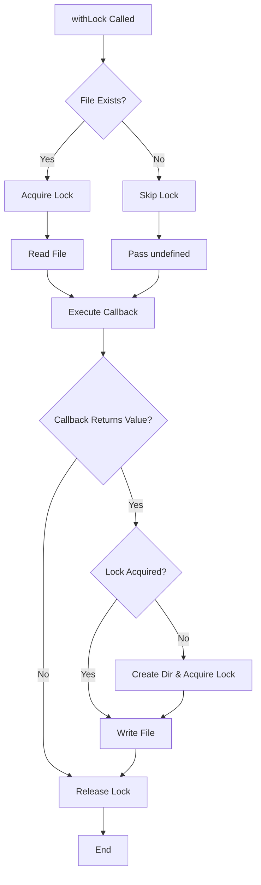
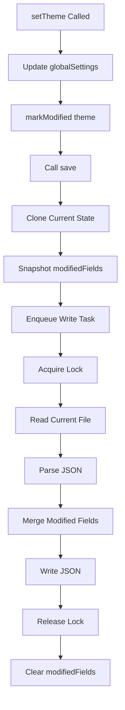
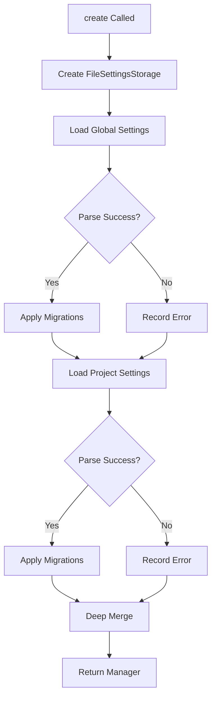

# Settings Manager

The Settings Manager is a core component of the `@pi-coding-agent` package responsible for managing user and project-level configuration settings. It provides a robust persistence layer with file-based storage, concurrent access protection via file locking, and intelligent merging of global and project-scoped settings. The manager supports both in-memory and file-backed storage implementations, enabling flexible testing and production deployments.

The Settings Manager handles a wide range of configuration options including LLM provider preferences, UI customization, feature toggles, resource paths (extensions, skills, prompts, themes), and behavioral settings for compaction, retries, and terminal rendering. It implements a sophisticated change tracking system that preserves externally modified settings while allowing programmatic updates, preventing data loss when settings files are edited outside the application.

Sources: [packages/coding-agent/src/core/settings-manager.ts:1-960](../../../packages/coding-agent/src/core/settings-manager.ts#L1-L960)

## Architecture Overview



The Settings Manager employs a layered architecture with three primary storage scopes:

1. **Global Settings**: Stored in the user's home directory (`~/.pi/agent/settings.json`), containing user-wide preferences
2. **Project Settings**: Stored in the project's `.pi/settings.json` directory, containing project-specific overrides
3. **Merged Settings**: Runtime combination where project settings take precedence over global settings

The storage abstraction (`SettingsStorage` interface) enables different backend implementations, with `FileSettingsStorage` for production use and `InMemorySettingsStorage` for testing.

Sources: [packages/coding-agent/src/core/settings-manager.ts:65-125](../../../packages/coding-agent/src/core/settings-manager.ts#L65-L125), [packages/coding-agent/src/core/settings-manager.ts:127-177](../../../packages/coding-agent/src/core/settings-manager.ts#L127-L177)

## Core Data Structures

### Settings Interface

The `Settings` interface defines all available configuration options. Key setting categories include:

| Category | Settings | Description |
|----------|----------|-------------|
| **LLM Configuration** | `defaultProvider`, `defaultModel`, `defaultThinkingLevel` | Provider and model selection, thinking level defaults |
| **Transport** | `transport` | Communication protocol (SSE, WebSocket) |
| **UI Behavior** | `steeringMode`, `followUpMode`, `theme`, `hideThinkingBlock` | User interface and interaction modes |
| **Compaction** | `compaction.enabled`, `compaction.reserveTokens`, `compaction.keepRecentTokens` | Token budget management for context windows |
| **Branch Summary** | `branchSummary.reserveTokens`, `branchSummary.skipPrompt` | Branch summarization behavior |
| **Retry Logic** | `retry.enabled`, `retry.maxRetries`, `retry.baseDelayMs`, `retry.maxDelayMs` | Error recovery configuration |
| **Terminal** | `terminal.showImages`, `terminal.imageWidthCells`, `terminal.clearOnShrink`, `terminal.showTerminalProgress` | Terminal rendering options |
| **Images** | `images.autoResize`, `images.blockImages` | Image processing settings |
| **Resources** | `packages`, `extensions`, `skills`, `prompts`, `themes` | Custom resource paths and package sources |
| **Shell** | `shellPath`, `shellCommandPrefix`, `npmCommand` | Shell execution configuration |
| **Session** | `sessionDir` | Custom session storage location |

Sources: [packages/coding-agent/src/core/settings-manager.ts:7-72](../../../packages/coding-agent/src/core/settings-manager.ts#L7-L72)

### Package Source Types

The `PackageSource` type supports flexible package loading with optional resource filtering:

```typescript
export type PackageSource =
	| string
	| {
			source: string;
			extensions?: string[];
			skills?: string[];
			prompts?: string[];
			themes?: string[];
	  };
```

String form loads all resources from a package, while object form enables selective loading of specific resource types.

Sources: [packages/coding-agent/src/core/settings-manager.ts:54-63](../../../packages/coding-agent/src/core/settings-manager.ts#L54-L63)

## Storage Abstraction

### SettingsStorage Interface

The storage layer is abstracted through a simple interface supporting transactional operations:

```typescript
export interface SettingsStorage {
	withLock(scope: SettingsScope, fn: (current: string | undefined) => string | undefined): void;
}
```

The `withLock` method provides atomic read-modify-write operations with file locking, preventing concurrent modification conflicts. The callback receives the current JSON content (or `undefined` if the file doesn't exist) and returns the updated content (or `undefined` to skip writing).

Sources: [packages/coding-agent/src/core/settings-manager.ts:119-121](../../../packages/coding-agent/src/core/settings-manager.ts#L119-L121)

### File-Based Storage



The `FileSettingsStorage` implementation handles filesystem operations with retry logic for lock acquisition:

- **Lock Retry**: Up to 10 attempts with 20ms delays between retries
- **Directory Creation**: Only creates directories when writing is necessary
- **Lock Lifecycle**: Acquires lock before reading existing files, defers lock acquisition until write time for new files

Sources: [packages/coding-agent/src/core/settings-manager.ts:127-177](../../../packages/coding-agent/src/core/settings-manager.ts#L127-L177)

### In-Memory Storage

The `InMemorySettingsStorage` class provides a testing-friendly implementation that maintains settings in memory without filesystem I/O:

```typescript
export class InMemorySettingsStorage implements SettingsStorage {
	private global: string | undefined;
	private project: string | undefined;

	withLock(scope: SettingsScope, fn: (current: string | undefined) => string | undefined): void {
		const current = scope === "global" ? this.global : this.project;
		const next = fn(current);
		if (next !== undefined) {
			if (scope === "global") {
				this.global = next;
			} else {
				this.project = next;
			}
		}
	}
}
```

Sources: [packages/coding-agent/src/core/settings-manager.ts:179-194](../../../packages/coding-agent/src/core/settings-manager.ts#L179-L194)

## Settings Merging Strategy

### Deep Merge Algorithm

The `deepMergeSettings` function implements recursive merging where project settings override global settings:

```typescript
function deepMergeSettings(base: Settings, overrides: Settings): Settings {
	const result: Settings = { ...base };

	for (const key of Object.keys(overrides) as (keyof Settings)[]) {
		const overrideValue = overrides[key];
		const baseValue = base[key];

		if (overrideValue === undefined) {
			continue;
		}

		// For nested objects, merge recursively
		if (
			typeof overrideValue === "object" &&
			overrideValue !== null &&
			!Array.isArray(overrideValue) &&
			typeof baseValue === "object" &&
			baseValue !== null &&
			!Array.isArray(baseValue)
		) {
			(result as Record<string, unknown>)[key] = { ...baseValue, ...overrideValue };
		} else {
			// For primitives and arrays, override value wins
			(result as Record<string, unknown>)[key] = overrideValue;
		}
	}

	return result;
}
```

**Merge Rules**:
- Nested objects are merged recursively (e.g., `compaction.enabled` can override while preserving `compaction.reserveTokens`)
- Arrays and primitives are replaced entirely (no array merging)
- `undefined` values are ignored

Sources: [packages/coding-agent/src/core/settings-manager.ts:74-104](../../../packages/coding-agent/src/core/settings-manager.ts#L74-L104)

## Change Tracking System

### Modification Tracking

The Settings Manager maintains separate tracking for global and project settings modifications:

```typescript
private modifiedFields = new Set<keyof Settings>();
private modifiedNestedFields = new Map<keyof Settings, Set<string>>();
private modifiedProjectFields = new Set<keyof Settings>();
private modifiedProjectNestedFields = new Map<keyof Settings, Set<string>>();
```

This granular tracking enables:
1. **Preservation of External Edits**: Only fields modified during the session are written back, preserving concurrent external file changes
2. **Nested Field Tracking**: Individual nested properties (e.g., `terminal.showImages`) can be updated without overwriting unmodified siblings
3. **Scope Isolation**: Global and project modifications are tracked independently

Sources: [packages/coding-agent/src/core/settings-manager.ts:196-202](../../../packages/coding-agent/src/core/settings-manager.ts#L196-L202)

### Persistence Flow



The persistence flow implements asynchronous write queuing to prevent race conditions:

1. **Synchronous Update**: Settings are updated in memory immediately
2. **Snapshot Creation**: Current state and modification tracking are cloned
3. **Write Queuing**: Write operations are queued sequentially via promise chaining
4. **File Merge**: On write, the current file is read, modified fields are merged in, and the result is written back
5. **Cleanup**: Modification tracking is cleared after successful write

Sources: [packages/coding-agent/src/core/settings-manager.ts:279-295](../../../packages/coding-agent/src/core/settings-manager.ts#L279-L295), [packages/coding-agent/src/core/settings-manager.ts:297-336](../../../packages/coding-agent/src/core/settings-manager.ts#L297-L336)

## Initialization and Loading

### Factory Methods

The Settings Manager provides multiple initialization strategies:

| Method | Use Case | Description |
|--------|----------|-------------|
| `create(cwd, agentDir)` | Production | Loads from file system with specified directories |
| `fromStorage(storage)` | Custom Backend | Uses provided storage implementation |
| `inMemory(settings)` | Testing | Creates in-memory instance with initial settings |

Sources: [packages/coding-agent/src/core/settings-manager.ts:219-241](../../../packages/coding-agent/src/core/settings-manager.ts#L219-L241)

### Loading and Migration



The loading process includes automatic migration of deprecated settings:

- **queueMode → steeringMode**: Renames the obsolete `queueMode` setting
- **websockets → transport**: Converts boolean `websockets` to enum `transport`
- **skills object → skills array**: Migrates old nested skills configuration to flat array format

Sources: [packages/coding-agent/src/core/settings-manager.ts:261-277](../../../packages/coding-agent/src/core/settings-manager.ts#L261-L277)

## Error Handling

### Error Tracking

Settings errors are accumulated and can be drained by consumers:

```typescript
export interface SettingsError {
	scope: SettingsScope;
	error: Error;
}

drainErrors(): SettingsError[] {
	const drained = [...this.errors];
	this.errors = [];
	return drained;
}
```

Errors are recorded during:
- Initial load (parse errors)
- Reload operations
- Write operations (via write queue)

When a settings file has parse errors, the manager continues with empty settings for that scope and tracks the error for later reporting.

Sources: [packages/coding-agent/src/core/settings-manager.ts:123-125](../../../packages/coding-agent/src/core/settings-manager.ts#L123-L125), [packages/coding-agent/src/core/settings-manager.ts:359-363](../../../packages/coding-agent/src/core/settings-manager.ts#L359-L363)

## Key Settings Categories

### LLM Configuration

Default provider and model settings control which LLM is used when not explicitly specified:

```typescript
getDefaultProvider(): string | undefined
setDefaultProvider(provider: string): void
getDefaultModel(): string | undefined
setDefaultModel(modelId: string): void
setDefaultModelAndProvider(provider: string, modelId: string): void
```

The `setDefaultModelAndProvider` method atomically updates both settings in a single write operation, avoiding intermediate states.

Sources: [packages/coding-agent/src/core/settings-manager.ts:382-406](../../../packages/coding-agent/src/core/settings-manager.ts#L382-L406)

### Compaction Settings

Compaction manages context window usage by summarizing or removing old messages:

| Setting | Default | Description |
|---------|---------|-------------|
| `enabled` | `true` | Whether compaction is active |
| `reserveTokens` | `16384` | Tokens reserved for prompt and response |
| `keepRecentTokens` | `20000` | Recent tokens to preserve uncompacted |

Sources: [packages/coding-agent/src/core/settings-manager.ts:7-11](../../../packages/coding-agent/src/core/settings-manager.ts#L7-L11), [packages/coding-agent/src/core/settings-manager.ts:454-471](../../../packages/coding-agent/src/core/settings-manager.ts#L454-L471)

### Retry Configuration

Retry settings control automatic recovery from transient errors:

| Setting | Default | Description |
|---------|---------|-------------|
| `enabled` | `true` | Whether retries are enabled |
| `maxRetries` | `3` | Maximum retry attempts |
| `baseDelayMs` | `2000` | Initial delay (exponential backoff: 2s, 4s, 8s) |
| `maxDelayMs` | `60000` | Maximum server-requested delay before failing |

Sources: [packages/coding-agent/src/core/settings-manager.ts:18-23](../../../packages/coding-agent/src/core/settings-manager.ts#L18-L23), [packages/coding-agent/src/core/settings-manager.ts:485-497](../../../packages/coding-agent/src/core/settings-manager.ts#L485-L497)

### Terminal and Image Settings

Terminal settings control rendering behavior in TUI mode:

```typescript
export interface TerminalSettings {
	showImages?: boolean; // default: true
	imageWidthCells?: number; // default: 60
	clearOnShrink?: boolean; // default: false
	showTerminalProgress?: boolean; // default: false (OSC 9;4 indicators)
}

export interface ImageSettings {
	autoResize?: boolean; // default: true (resize to 2000x2000 max)
	blockImages?: boolean; // default: false (prevent all images from being sent)
}
```

The `getClearOnShrink` method demonstrates precedence handling, checking settings first, then falling back to the `PI_CLEAR_ON_SHRINK` environment variable.

Sources: [packages/coding-agent/src/core/settings-manager.ts:25-32](../../../packages/coding-agent/src/core/settings-manager.ts#L25-L32), [packages/coding-agent/src/core/settings-manager.ts:34-38](../../../packages/coding-agent/src/core/settings-manager.ts#L34-L38), [packages/coding-agent/src/core/settings-manager.ts:779-787](../../../packages/coding-agent/src/core/settings-manager.ts#L779-L787)

## Resource Management

### Package Sources

The Settings Manager supports loading resources from npm/git packages with optional filtering:

```typescript
getPackages(): PackageSource[]
setPackages(packages: PackageSource[]): void
setProjectPackages(packages: PackageSource[]): void
```

Package sources can be specified as simple strings (`"npm:package-name"`) or objects with resource filters:

```typescript
{
  source: "npm:shitty-extensions",
  extensions: ["extensions/oracle.ts"],
  skills: []
}
```

Sources: [packages/coding-agent/src/core/settings-manager.ts:54-63](../../../packages/coding-agent/src/core/settings-manager.ts#L54-L63), [packages/coding-agent/src/core/settings-manager.ts:555-570](../../../packages/coding-agent/src/core/settings-manager.ts#L555-L570)

### Local Resource Paths

Settings provide arrays for local filesystem paths to custom resources:

- **Extensions**: `extensions?: string[]` - TypeScript extension files or directories
- **Skills**: `skills?: string[]` - Skill definition files or directories
- **Prompts**: `prompts?: string[]` - Prompt template files or directories
- **Themes**: `themes?: string[]` - Theme definition files or directories

Each resource type has both global and project-scoped setters (e.g., `setExtensionPaths` and `setProjectExtensionPaths`).

Sources: [packages/coding-agent/src/core/settings-manager.ts:572-622](../../../packages/coding-agent/src/core/settings-manager.ts#L572-L622)

## Session Directory Resolution

The `getSessionDir` method implements path expansion for custom session storage locations:

```typescript
getSessionDir(): string | undefined {
	const sessionDir = this.settings.sessionDir;
	if (!sessionDir) {
		return sessionDir;
	}
	if (sessionDir === "~") {
		return homedir();
	}
	if (sessionDir.startsWith("~/")) {
		return join(homedir(), sessionDir.slice(2));
	}
	return sessionDir;
}
```

This enables users to specify session directories relative to their home directory using `~` notation, matching shell conventions.

Sources: [packages/coding-agent/src/core/settings-manager.ts:373-380](../../../packages/coding-agent/src/core/settings-manager.ts#L373-L380), [packages/coding-agent/test/settings-manager.test.ts:196-217](../../../packages/coding-agent/test/settings-manager.test.ts#L196-L217)

## Testing Strategy

The test suite validates critical behaviors including external edit preservation, migration logic, and scope isolation:

### External Edit Preservation Tests

The bug fix tests verify that external file changes are preserved when unrelated settings are modified:

```typescript
it("should preserve file changes to packages array when changing unrelated setting", async () => {
	// Setup: Pi starts with packages: ["npm:pi-mcp-adapter"]
	// User externally edits file to packages: []
	// User changes theme via UI
	// Result: packages should remain [], not revert to startup value
});
```

This prevents data loss when users manually edit settings files while the application is running.

Sources: [packages/coding-agent/test/settings-manager-bug.test.ts:1-155](../../../packages/coding-agent/test/settings-manager-bug.test.ts#L1-L155)

### Directory Creation Tests

Tests validate that the `.pi` directory is only created when writing project settings, not during read operations:

```typescript
it("should not create .pi folder when only reading project settings", () => {
	// Verify .pi folder doesn't exist after SettingsManager.create()
});

it("should create .pi folder when writing project settings", async () => {
	// Verify .pi folder is created when setProjectPackages() is called
});
```

Sources: [packages/coding-agent/test/settings-manager.test.ts:117-156](../../../packages/coding-agent/test/settings-manager.test.ts#L117-L156)

## Integration with Config System

The Settings Manager integrates with the broader configuration system defined in `config.ts`:

- **Agent Directory**: Retrieved via `getAgentDir()`, defaulting to `~/.pi/agent/` or overridable via `PI_CODING_AGENT_DIR` environment variable
- **Project Config**: Located in `<project>/.pi/` directory (configurable via `piConfig.configDir` in package.json)
- **Settings Path**: Global settings at `<agentDir>/settings.json`, project settings at `<project>/.pi/settings.json`

Sources: [packages/coding-agent/src/config.ts:1-241](../../../packages/coding-agent/src/config.ts#L1-L241), [packages/coding-agent/src/core/settings-manager.ts:2](../../../packages/coding-agent/src/core/settings-manager.ts#L2)

## Summary

The Settings Manager provides a robust, thread-safe configuration system with support for hierarchical settings (global and project), intelligent merging, change tracking, and automatic migration. Its design prioritizes data integrity through file locking, preserves external edits via granular modification tracking, and supports flexible storage backends for testing and production use. The manager serves as the central configuration authority for the coding agent, managing everything from LLM preferences to resource paths and behavioral toggles.