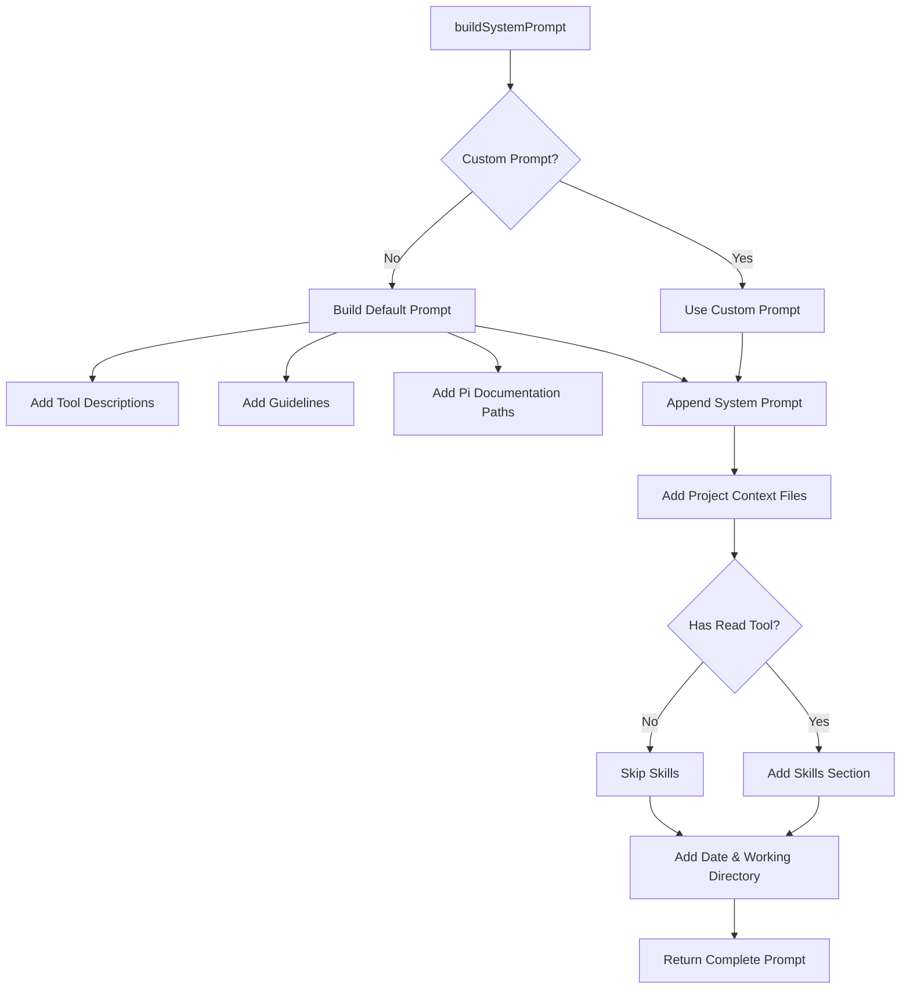
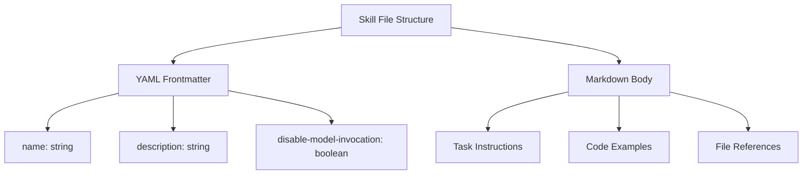
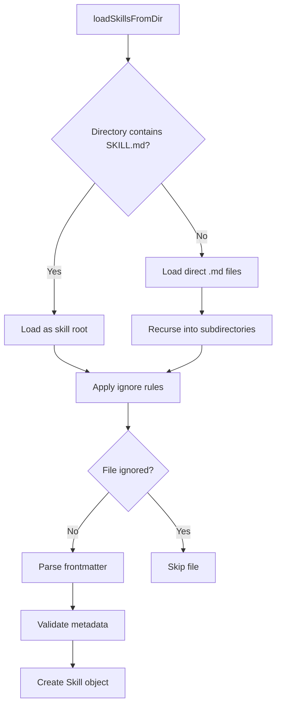
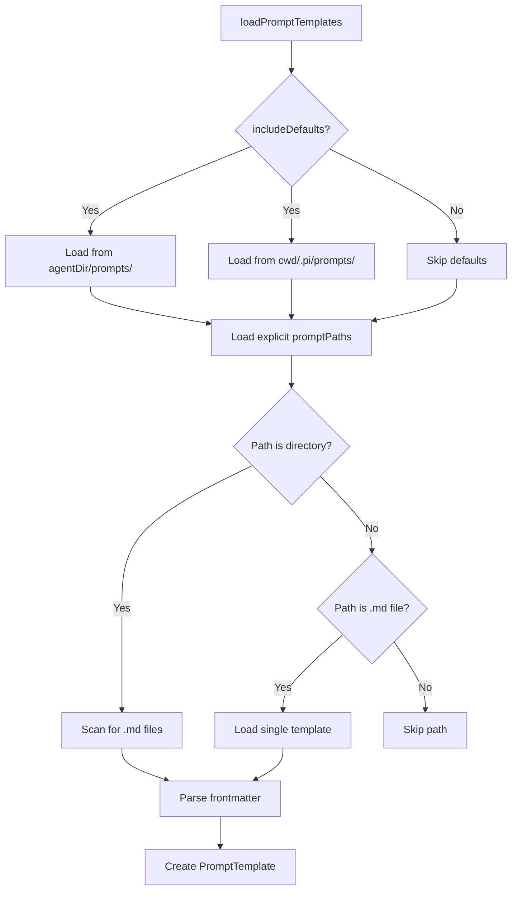

# System Prompt, Skills & Prompt Templates

The `@pi-coding-agent` package implements a sophisticated prompt management system that combines three key components: **system prompts** (instructions defining the agent's behavior), **skills** (reusable task-specific instructions loaded from markdown files), and **prompt templates** (user-defined command shortcuts with argument substitution). Together, these components enable flexible, context-aware AI agent configuration that adapts to project requirements while maintaining consistency across sessions.

This architecture allows users to customize agent behavior at multiple levels: globally through system prompts, contextually through skills, and interactively through templates. The system supports both default configurations and project-specific overrides, with comprehensive validation and collision detection to ensure reliable operation.

## System Prompt Construction

### Overview

The system prompt is the foundational instruction set provided to the LLM at the start of each conversation. It defines the agent's role, available tools, operational guidelines, and contextual information about the current environment.

Sources: [packages/coding-agent/src/core/system-prompt.ts:1-180](../../../packages/coding-agent/src/core/system-prompt.ts#L1-L180)

### Architecture



The `buildSystemPrompt` function orchestrates prompt construction through a multi-stage pipeline that conditionally includes components based on configuration and available tools.

Sources: [packages/coding-agent/src/core/system-prompt.ts:31-180](../../../packages/coding-agent/src/core/system-prompt.ts#L31-L180)

### Configuration Options

| Option | Type | Description |
|--------|------|-------------|
| `customPrompt` | `string?` | Replaces entire default prompt with custom instructions |
| `selectedTools` | `string[]?` | Tools to include in prompt (default: read, bash, edit, write) |
| `toolSnippets` | `Record<string, string>?` | One-line descriptions for each tool |
| `promptGuidelines` | `string[]?` | Additional guideline bullets appended to defaults |
| `appendSystemPrompt` | `string?` | Text appended after main prompt body |
| `cwd` | `string` | Working directory for path resolution |
| `contextFiles` | `Array<{path: string; content: string}>?` | Project-specific context documents |
| `skills` | `Skill[]?` | Pre-loaded skills to include |

Sources: [packages/coding-agent/src/core/system-prompt.ts:12-29](../../../packages/coding-agent/src/core/system-prompt.ts#L12-L29)

### Tool Visibility and Guidelines

Tools appear in the "Available tools" section only when a `toolSnippets` entry is provided. This allows dynamic tool registration without cluttering the prompt with undocumented tools:

```typescript
const tools = selectedTools || ["read", "bash", "edit", "write"];
const visibleTools = tools.filter((name) => !!toolSnippets?.[name]);
const toolsList =
    visibleTools.length > 0 
        ? visibleTools.map((name) => `- ${name}: ${toolSnippets![name]}`).join("\n") 
        : "(none)";
```

Guidelines are generated conditionally based on available tools. For example, if `bash` is available but specialized tools like `grep`, `find`, and `ls` are not, the system advises using bash for file operations. If specialized tools are present, it recommends preferring them over bash for better performance and `.gitignore` respect.

Sources: [packages/coding-agent/src/core/system-prompt.ts:96-128](../../../packages/coding-agent/src/core/system-prompt.ts#L96-L128)

### Project Context Integration

Project-specific instructions from markdown files are appended under a "# Project Context" section. Each context file is rendered with its path as a heading:

```typescript
if (contextFiles.length > 0) {
    prompt += "\n\n# Project Context\n\n";
    prompt += "Project-specific instructions and guidelines:\n\n";
    for (const { path: filePath, content } of contextFiles) {
        prompt += `## ${filePath}\n\n${content}\n\n`;
    }
}
```

This mechanism allows projects to inject custom guidelines, architectural constraints, or coding standards directly into the agent's context without modifying the core system prompt.

Sources: [packages/coding-agent/src/core/system-prompt.ts:154-161](../../../packages/coding-agent/src/core/system-prompt.ts#L154-L161)

### Skills Integration in System Prompt

Skills are conditionally included only when the `read` tool is available, since the agent must be able to read skill files to utilize them. The integration uses the `formatSkillsForPrompt` function to generate XML-formatted skill listings:

```typescript
if (hasRead && skills.length > 0) {
    prompt += formatSkillsForPrompt(skills);
}
```

Sources: [packages/coding-agent/src/core/system-prompt.ts:164-166](../../../packages/coding-agent/src/core/system-prompt.ts#L164-L166)

## Skills System

### Skill Definition and Structure

Skills are specialized instruction sets stored as markdown files that provide task-specific guidance to the AI agent. Each skill follows the Agent Skills specification (https://agentskills.io) with YAML frontmatter for metadata and markdown body for instructions.



Sources: [packages/coding-agent/src/core/skills.ts:1-420](../../../packages/coding-agent/src/core/skills.ts#L1-L420)

### Skill Frontmatter Schema

| Field | Type | Required | Description | Validation |
|-------|------|----------|-------------|------------|
| `name` | string | No | Skill identifier (defaults to parent directory name) | Max 64 chars, lowercase a-z/0-9/hyphens, must match parent dir |
| `description` | string | Yes | Brief explanation of skill purpose | Max 1024 chars |
| `disable-model-invocation` | boolean | No | If true, skill only invocable via `/skill:name` commands | Default: false |

The validation rules enforce the Agent Skills specification:

```typescript
function validateName(name: string, parentDirName: string): string[] {
    const errors: string[] = [];
    if (name !== parentDirName) {
        errors.push(`name "${name}" does not match parent directory "${parentDirName}"`);
    }
    if (name.length > MAX_NAME_LENGTH) {
        errors.push(`name exceeds ${MAX_NAME_LENGTH} characters (${name.length})`);
    }
    if (!/^[a-z0-9-]+$/.test(name)) {
        errors.push(`name contains invalid characters (must be lowercase a-z, 0-9, hyphens only)`);
    }
    // ... additional checks for hyphens at start/end, consecutive hyphens
}
```

Sources: [packages/coding-agent/src/core/skills.ts:44-74](../../../packages/coding-agent/src/core/skills.ts#L44-L74), [packages/coding-agent/test/skills.test.ts:1-400](../../../packages/coding-agent/test/skills.test.ts#L1-L400)

### Skill Discovery and Loading

Skills are discovered through a recursive directory scan with intelligent traversal rules:

1. If a directory contains `SKILL.md`, treat it as a skill root and do not recurse further
2. Otherwise, load direct `.md` children in the root directory
3. Recurse into subdirectories to find `SKILL.md` files

This strategy supports both flat skill collections and nested skill hierarchies while preventing duplicate loading.



The loader respects `.gitignore`, `.ignore`, and `.fdignore` files to exclude unwanted directories (e.g., `node_modules`, build artifacts). Ignore patterns are prefixed with the relative directory path to maintain correct matching semantics:

```typescript
function prefixIgnorePattern(line: string, prefix: string): string | null {
    const trimmed = line.trim();
    if (!trimmed || (trimmed.startsWith("#") && !trimmed.startsWith("\\#"))) return null;
    
    let pattern = line;
    let negated = false;
    
    if (pattern.startsWith("!")) {
        negated = true;
        pattern = pattern.slice(1);
    }
    
    if (pattern.startsWith("/")) {
        pattern = pattern.slice(1);
    }
    
    const prefixed = prefix ? `${prefix}${pattern}` : pattern;
    return negated ? `!${prefixed}` : prefixed;
}
```

Sources: [packages/coding-agent/src/core/skills.ts:140-230](../../../packages/coding-agent/src/core/skills.ts#L140-L230)

### Skill Loading Locations

Skills are loaded from multiple locations with a defined precedence order:

| Source | Path | Scope | Priority |
|--------|------|-------|----------|
| User-global | `~/.pi/agent/skills/` | User | 1 (first loaded) |
| Project-local | `<cwd>/.pi/skills/` | Project | 2 |
| Explicit paths | Configured via `skillPaths` | Temporary | 3 (last loaded, can override) |

When skills with identical names are found, the first-loaded skill wins and subsequent collisions generate diagnostic warnings:

```typescript
const existing = skillMap.get(skill.name);
if (existing) {
    collisionDiagnostics.push({
        type: "collision",
        message: `name "${skill.name}" collision`,
        path: skill.filePath,
        collision: {
            resourceType: "skill",
            name: skill.name,
            winnerPath: existing.filePath,
            loserPath: skill.filePath,
        },
    });
}
```

Sources: [packages/coding-agent/src/core/skills.ts:340-420](../../../packages/coding-agent/src/core/skills.ts#L340-L420)

### Skills Prompt Formatting

Skills are formatted as XML for inclusion in the system prompt, following the Agent Skills integration standard. Skills with `disableModelInvocation: true` are excluded from the prompt (they can only be invoked explicitly via commands):

```typescript
export function formatSkillsForPrompt(skills: Skill[]): string {
    const visibleSkills = skills.filter((s) => !s.disableModelInvocation);
    
    if (visibleSkills.length === 0) {
        return "";
    }
    
    const lines = [
        "\n\nThe following skills provide specialized instructions for specific tasks.",
        "Use the read tool to load a skill's file when the task matches its description.",
        "When a skill file references a relative path, resolve it against the skill directory...",
        "",
        "<available_skills>",
    ];
    
    for (const skill of visibleSkills) {
        lines.push("  <skill>");
        lines.push(`    <name>${escapeXml(skill.name)}</name>`);
        lines.push(`    <description>${escapeXml(skill.description)}</description>`);
        lines.push(`    <location>${escapeXml(skill.filePath)}</location>`);
        lines.push("  </skill>");
    }
    
    lines.push("</available_skills>");
    return lines.join("\n");
}
```

The XML format provides clear structure for the LLM to parse and understand available skills, with proper escaping to prevent injection attacks.

Sources: [packages/coding-agent/src/core/skills.ts:280-320](../../../packages/coding-agent/src/core/skills.ts#L280-L320)

## Prompt Templates

### Template Definition and Purpose

Prompt templates are user-defined command shortcuts stored as markdown files that support bash-style argument substitution. They enable users to create reusable prompt patterns with placeholders for dynamic content, reducing repetitive typing and ensuring consistency.

A template file consists of YAML frontmatter for metadata and a markdown body containing the template text with placeholders:

```yaml
---
description: Review PRs from URLs with structured issue and code analysis
argument-hint: "<PR-URL>"
---
You are given one or more GitHub PR URLs: $@
Analyze each PR for code quality, potential issues, and suggest improvements.
```

Sources: [packages/coding-agent/src/core/prompt-templates.ts:1-350](../../../packages/coding-agent/src/core/prompt-templates.ts#L1-L350)

### Template Metadata Schema

| Field | Type | Required | Description |
|-------|------|----------|-------------|
| `description` | string | No | Brief description (defaults to first line of body) |
| `argument-hint` | string | No | Usage hint shown in help text (e.g., `"<PR-URL>"`, `"[instructions]"`) |

The `argument-hint` field provides user-facing documentation about expected arguments. It uses angle brackets `<arg>` for required arguments and square brackets `[arg]` for optional ones, following common CLI conventions.

Sources: [packages/coding-agent/src/core/prompt-templates.ts:15-23](../../../packages/coding-agent/src/core/prompt-templates.ts#L15-L23), [packages/coding-agent/test/prompt-templates.test.ts:320-410](../../../packages/coding-agent/test/prompt-templates.test.ts#L320-L410)

### Argument Substitution Syntax

Prompt templates support multiple substitution patterns inspired by bash scripting:

| Pattern | Description | Example |
|---------|-------------|---------|
| `$1`, `$2`, ... `$N` | Positional arguments (1-indexed) | `$1` → first arg |
| `$@` | All arguments joined with spaces | `$@` → "arg1 arg2 arg3" |
| `$ARGUMENTS` | All arguments joined (same as `$@`) | `$ARGUMENTS` → "arg1 arg2 arg3" |
| `${@:N}` | Arguments from Nth position onwards | `${@:2}` → "arg2 arg3 arg4" |
| `${@:N:L}` | L arguments starting from Nth | `${@:2:2}` → "arg2 arg3" |

**Critical substitution behavior**: Argument values containing substitution patterns (like `$1`, `$@`) are NOT recursively substituted. This prevents injection attacks and unexpected behavior:

```typescript
// Template: $ARGUMENTS
// Args: ["$1", "$ARGUMENTS"]
// Result: "$1 $ARGUMENTS" (literal, not recursively expanded)
```

Sources: [packages/coding-agent/src/core/prompt-templates.ts:40-100](../../../packages/coding-agent/src/core/prompt-templates.ts#L40-L100), [packages/coding-agent/test/prompt-templates.test.ts:20-150](../../../packages/coding-agent/test/prompt-templates.test.ts#L20-L150)

### Substitution Implementation

The substitution process follows a specific order to prevent conflicts and ensure predictable behavior:

```mermaid
graph TD
    A[substituteArgs] --> B[Replace positional $1, $2, etc.]
    B --> C[Replace array slices ${@:N} and ${@:N:L}]
    C --> D[Replace $ARGUMENTS]
    D --> E[Replace $@]
    E --> F[Return final string]
```

Positional arguments are replaced first to prevent wildcard patterns in the template from matching partial substitutions. Array slicing is processed before simple wildcards to avoid pattern conflicts:

```typescript
export function substituteArgs(content: string, args: string[]): string {
    let result = content;
    
    // 1. Replace $1, $2, etc. FIRST
    result = result.replace(/\$(\d+)/g, (_, num) => {
        const index = parseInt(num, 10) - 1;
        return args[index] ?? "";
    });
    
    // 2. Replace ${@:start} or ${@:start:length}
    result = result.replace(/\$\{@:(\d+)(?::(\d+))?\}/g, (_, startStr, lengthStr) => {
        let start = parseInt(startStr, 10) - 1;
        if (start < 0) start = 0;
        
        if (lengthStr) {
            const length = parseInt(lengthStr, 10);
            return args.slice(start, start + length).join(" ");
        }
        return args.slice(start).join(" ");
    });
    
    // 3. Replace $ARGUMENTS and $@
    const allArgs = args.join(" ");
    result = result.replace(/\$ARGUMENTS/g, allArgs);
    result = result.replace(/\$@/g, allArgs);
    
    return result;
}
```

Sources: [packages/coding-agent/src/core/prompt-templates.ts:50-95](../../../packages/coding-agent/src/core/prompt-templates.ts#L50-L95)

### Argument Parsing

Template arguments are parsed using a bash-style quote-aware parser that handles single quotes, double quotes, and whitespace:

```typescript
export function parseCommandArgs(argsString: string): string[] {
    const args: string[] = [];
    let current = "";
    let inQuote: string | null = null;
    
    for (let i = 0; i < argsString.length; i++) {
        const char = argsString[i];
        
        if (inQuote) {
            if (char === inQuote) {
                inQuote = null;
            } else {
                current += char;
            }
        } else if (char === '"' || char === "'") {
            inQuote = char;
        } else if (char === " " || char === "\t") {
            if (current) {
                args.push(current);
                current = "";
            }
        } else {
            current += char;
        }
    }
    
    if (current) {
        args.push(current);
    }
    
    return args;
}
```

This allows users to pass arguments containing spaces by quoting them: `/template "first arg" second` → `["first arg", "second"]`.

Sources: [packages/coding-agent/src/core/prompt-templates.ts:28-48](../../../packages/coding-agent/src/core/prompt-templates.ts#L28-L48), [packages/coding-agent/test/prompt-templates.test.ts:160-220](../../../packages/coding-agent/test/prompt-templates.test.ts#L160-L220)

### Template Discovery and Loading

Templates are loaded from multiple locations with configurable precedence:



| Source | Path | Scope | When Loaded |
|--------|------|-------|-------------|
| Global | `<agentDir>/prompts/` | User | When `includeDefaults: true` |
| Project | `<cwd>/.pi/prompts/` | Project | When `includeDefaults: true` |
| Explicit | Configured via `promptPaths` | Temporary | Always |

Templates support tilde expansion (`~` → home directory) and relative path resolution. Symlinks are followed transparently during discovery.

Sources: [packages/coding-agent/src/core/prompt-templates.ts:140-250](../../../packages/coding-agent/src/core/prompt-templates.ts#L140-L250)

### Template Expansion

Templates are invoked using slash-command syntax: `/template-name arg1 arg2 ...`. The expansion process:

1. Check if input starts with `/`
2. Extract template name (text between `/` and first space)
3. Parse remaining text as arguments
4. Find matching template by name
5. Substitute arguments into template body

```typescript
export function expandPromptTemplate(text: string, templates: PromptTemplate[]): string {
    if (!text.startsWith("/")) return text;
    
    const spaceIndex = text.indexOf(" ");
    const templateName = spaceIndex === -1 ? text.slice(1) : text.slice(1, spaceIndex);
    const argsString = spaceIndex === -1 ? "" : text.slice(spaceIndex + 1);
    
    const template = templates.find((t) => t.name === templateName);
    if (template) {
        const args = parseCommandArgs(argsString);
        return substituteArgs(template.content, args);
    }
    
    return text; // Not a template, return unchanged
}
```

If no matching template is found, the original text is returned unchanged, allowing other command handlers to process it.

Sources: [packages/coding-agent/src/core/prompt-templates.ts:280-300](../../../packages/coding-agent/src/core/prompt-templates.ts#L280-L300)

## Integration and Testing

### System Prompt Testing

The system prompt builder is tested for correct tool visibility, guideline generation, and context integration:

```typescript
test("includes all default tools when snippets are provided", () => {
    const prompt = buildSystemPrompt({
        toolSnippets: {
            read: "Read file contents",
            bash: "Execute bash commands",
            edit: "Make surgical edits",
            write: "Create or overwrite files",
        },
        contextFiles: [],
        skills: [],
        cwd: process.cwd(),
    });
    
    expect(prompt).toContain("- read:");
    expect(prompt).toContain("- bash:");
    expect(prompt).toContain("- edit:");
    expect(prompt).toContain("- write:");
});
```

Tests verify that custom guidelines are deduplicated and appended correctly, and that skills are only included when the `read` tool is available.

Sources: [packages/coding-agent/test/system-prompt.test.ts:1-100](../../../packages/coding-agent/test/system-prompt.test.ts#L1-L100)

### Skills Validation Testing

Comprehensive tests ensure skill metadata validation catches specification violations:

```typescript
it("should warn when name doesn't match parent directory", () => {
    const { skills, diagnostics } = loadSkillsFromDir({
        dir: join(fixturesDir, "name-mismatch"),
        source: "test",
    });
    
    expect(skills).toHaveLength(1);
    expect(
        diagnostics.some((d: ResourceDiagnostic) => 
            d.message.includes("does not match parent directory")
        )
    ).toBe(true);
});
```

Tests cover invalid characters, length limits, missing descriptions, malformed YAML, and collision detection across multiple skill directories.

Sources: [packages/coding-agent/test/skills.test.ts:50-250](../../../packages/coding-agent/test/skills.test.ts#L50-L250)

### Template Substitution Testing

Extensive tests verify substitution behavior, especially the critical non-recursive substitution guarantee:

```typescript
test("should NOT recursively substitute patterns in argument values", () => {
    expect(substituteArgs("$ARGUMENTS", ["$1", "$ARGUMENTS"])).toBe("$1 $ARGUMENTS");
    expect(substituteArgs("$@", ["$100", "$1"])).toBe("$100 $1");
    expect(substituteArgs("$ARGUMENTS", ["$100", "$1"])).toBe("$100 $1");
});
```

Tests also validate array slicing, quote parsing, unicode handling, and integration between parsing and substitution.

Sources: [packages/coding-agent/test/prompt-templates.test.ts:30-320](../../../packages/coding-agent/test/prompt-templates.test.ts#L30-L320)

## Summary

The system prompt, skills, and prompt templates architecture provides a flexible, layered approach to AI agent configuration. System prompts establish foundational behavior and context, skills enable task-specific expertise through reusable instruction files, and prompt templates offer interactive command shortcuts with powerful argument substitution. Together, these components support both novice users (through sensible defaults) and advanced users (through extensive customization options) while maintaining validation, collision detection, and comprehensive test coverage to ensure reliable operation across diverse project environments.