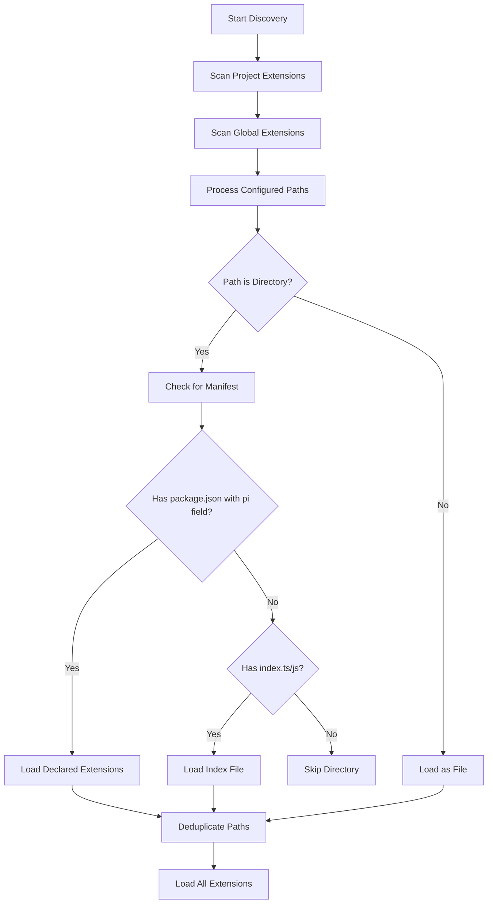
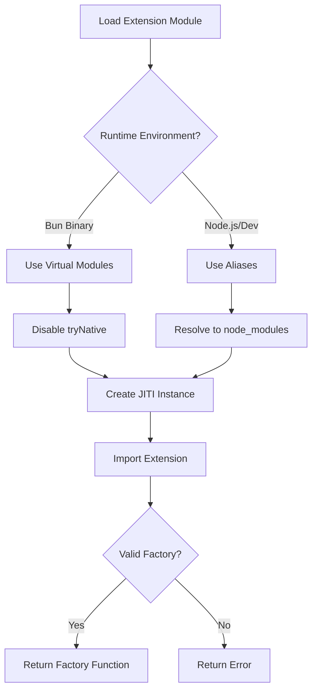
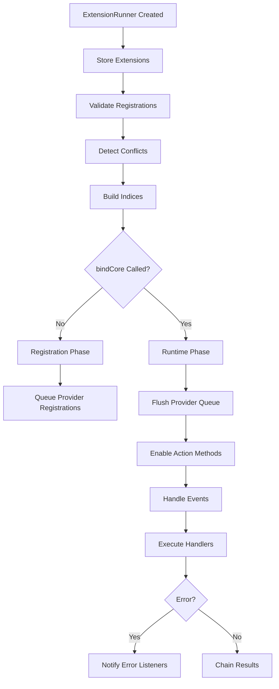
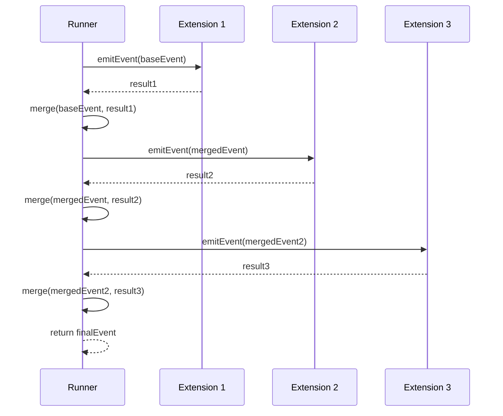
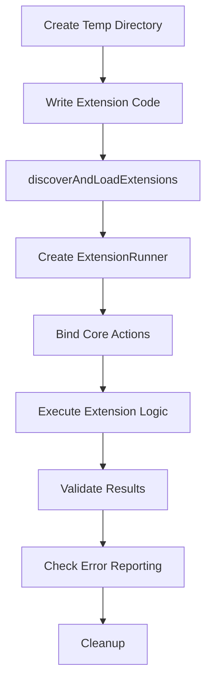

# Extension Architecture: Loader, Runner & Types

The extension system in pi-mono provides a powerful mechanism for extending the coding agent's functionality through dynamically loaded TypeScript/JavaScript modules. The architecture is built around three core components: the **Loader** (responsible for discovering and loading extension modules), the **Runner** (managing extension lifecycle, event handling, and runtime actions), and a comprehensive **Type System** (defining contracts for extensions, events, and APIs). Extensions can register custom tools, commands, shortcuts, event handlers, message renderers, and even AI providers, all while maintaining isolation and proper error handling.

This architecture enables both local (project-specific) and global extensions, supports package-based extensions with manifests, and provides a rich API for extensions to interact with the agent's core functionality. The system is designed to work in both development mode (Node.js with dynamic imports) and compiled binary mode (Bun with virtual modules).

Sources: [packages/coding-agent/src/core/extensions/loader.ts:1-10](../../../packages/coding-agent/src/core/extensions/loader.ts#L1-L10), [packages/coding-agent/src/core/extensions/runner.ts](../../../packages/coding-agent/src/core/extensions/runner.ts), [packages/coding-agent/src/core/extensions/index.ts:1-5](../../../packages/coding-agent/src/core/extensions/index.ts#L1-L5)

## Extension Discovery and Loading

### Discovery Strategy

The loader implements a multi-layered discovery strategy that searches for extensions in multiple locations with specific precedence rules:

1. **Project-local extensions**: `cwd/${CONFIG_DIR_NAME}/extensions/`
2. **Global extensions**: `agentDir/extensions/`
3. **Explicitly configured paths**: Provided via configuration



Sources: [packages/coding-agent/src/core/extensions/loader.ts:315-357](../../../packages/coding-agent/src/core/extensions/loader.ts#L315-L357)

### File-Based Discovery

Within an extensions directory, the loader recognizes three patterns:

| Pattern | Description | Example |
|---------|-------------|---------|
| Direct files | `.ts` or `.js` files in the extensions root | `extensions/my-tool.ts` |
| Index-based | Subdirectory with `index.ts` or `index.js` (`.ts` preferred) | `extensions/my-extension/index.ts` |
| Manifest-based | Subdirectory with `package.json` containing `pi.extensions` field | `extensions/my-package/package.json` |

The discovery process does **not** recurse beyond one level. Complex packages must use a package.json manifest to declare their extension entry points.

Sources: [packages/coding-agent/src/core/extensions/loader.ts:251-276](../../../packages/coding-agent/src/core/extensions/loader.ts#L251-L276), [packages/coding-agent/test/extensions-discovery.test.ts:19-88](../../../packages/coding-agent/test/extensions-discovery.test.ts#L19-L88)

### Package Manifest Format

Extensions packaged as npm-style directories can declare multiple entry points via `package.json`:

```json
{
  "name": "my-extension-package",
  "pi": {
    "extensions": ["./src/main.ts", "./src/secondary.ts"]
  }
}
```

The manifest takes precedence over `index.ts/js` files. Paths are resolved relative to the package directory.

Sources: [packages/coding-agent/src/core/extensions/loader.ts:234-247](../../../packages/coding-agent/src/core/extensions/loader.ts#L234-L247), [packages/coding-agent/test/extensions-discovery.test.ts:116-141](../../../packages/coding-agent/test/extensions-discovery.test.ts#L116-L141)

### Module Loading with JITI

The loader uses `@mariozechner/jiti` to dynamically load TypeScript and JavaScript modules. This fork includes `virtualModules` support for compiled Bun binaries:



Virtual modules bundle common dependencies directly into the compiled binary, making them available to extensions without filesystem access:

```typescript
const VIRTUAL_MODULES: Record<string, unknown> = {
	typebox: _bundledTypebox,
	"typebox/compile": _bundledTypeboxCompile,
	"typebox/value": _bundledTypeboxValue,
	"@mariozechner/pi-agent-core": _bundledPiAgentCore,
	"@mariozechner/pi-tui": _bundledPiTui,
	"@mariozechner/pi-ai": _bundledPiAi,
	"@mariozechner/pi-coding-agent": _bundledPiCodingAgent,
};
```

Sources: [packages/coding-agent/src/core/extensions/loader.ts:11-30](../../../packages/coding-agent/src/core/extensions/loader.ts#L11-L30), [packages/coding-agent/src/core/extensions/loader.ts:190-203](../../../packages/coding-agent/src/core/extensions/loader.ts#L190-L203)

### Extension Factory Pattern

Each extension must export a default function (the factory) that receives the ExtensionAPI:

```typescript
export default function(pi: ExtensionAPI) {
	pi.registerTool({
		name: "my_tool",
		// ... tool definition
	});
	
	pi.on("agent_start", async (event, ctx) => {
		// ... event handler
	});
}
```

The factory is invoked during loading, allowing extensions to register their components. Invalid exports (non-function defaults) result in load errors.

Sources: [packages/coding-agent/src/core/extensions/loader.ts:204-228](../../../packages/coding-agent/src/core/extensions/loader.ts#L204-L228), [packages/coding-agent/test/extensions-discovery.test.ts:309-324](../../../packages/coding-agent/test/extensions-discovery.test.ts#L309-L324)

## Extension Runtime and API

### Runtime Initialization

The `ExtensionRuntime` object provides the shared state and action methods that extensions use to interact with the agent. It's created with stub implementations that throw errors until bound to the core:

```typescript
export function createExtensionRuntime(): ExtensionRuntime {
	const notInitialized = () => {
		throw new Error("Extension runtime not initialized...");
	};
	
	const runtime: ExtensionRuntime = {
		sendMessage: notInitialized,
		sendUserMessage: notInitialized,
		// ... other actions
		flagValues: new Map(),
		pendingProviderRegistrations: [],
		assertActive: () => { /* ... */ },
		invalidate: (message) => { /* ... */ },
	};
	
	return runtime;
}
```

This design ensures extensions cannot call action methods during the loading phase, only during event handlers or command execution.

Sources: [packages/coding-agent/src/core/extensions/loader.ts:105-146](../../../packages/coding-agent/src/core/extensions/loader.ts#L105-L146)

### ExtensionAPI Structure

The `ExtensionAPI` delegates to the shared runtime while maintaining extension-specific state:

| Method Category | Purpose | Examples |
|----------------|---------|----------|
| Registration | Register components | `registerTool()`, `registerCommand()`, `registerShortcut()` |
| Event Handling | Subscribe to events | `on("agent_start", handler)` |
| Actions | Interact with agent | `sendMessage()`, `setActiveTools()` |
| Flags | Access extension flags | `getFlag()`, `registerFlag()` |
| Providers | Register AI providers | `registerProvider()`, `unregisterProvider()` |
| Utilities | Helper functions | `exec()`, `events` (EventBus) |

Sources: [packages/coding-agent/src/core/extensions/loader.ts:152-265](../../../packages/coding-agent/src/core/extensions/loader.ts#L152-L265)

### Context Lifecycle Management

The runtime includes an `assertActive()` guard and `invalidate()` method to prevent stale extension instances from executing after session replacement or reload:

```typescript
assertActive: () => {
	if (state.staleMessage) {
		throw new Error(state.staleMessage);
	}
},
invalidate: (message) => {
	state.staleMessage ??= message ?? "This extension instance is stale...";
}
```

All API methods call `assertActive()` before execution, ensuring extensions receive appropriate errors when attempting to use invalidated contexts.

Sources: [packages/coding-agent/src/core/extensions/loader.ts:112-122](../../../packages/coding-agent/src/core/extensions/loader.ts#L112-L122), [packages/coding-agent/src/core/extensions/loader.ts:157-159](../../../packages/coding-agent/src/core/extensions/loader.ts#L157-L159)

## Extension Runner

### Runner Responsibilities

The `ExtensionRunner` class manages the complete lifecycle of loaded extensions:



Sources: [packages/coding-agent/src/core/extensions/runner.ts](../../../packages/coding-agent/src/core/extensions/runner.ts)

### Tool and Command Collection

The runner aggregates tools and commands from all extensions, handling conflicts with a "first wins" policy:

```typescript
getAllRegisteredTools(): RegisteredTool[] {
	const seen = new Set<string>();
	const tools: RegisteredTool[] = [];
	
	for (const ext of this.extensions) {
		for (const [name, tool] of ext.tools) {
			if (!seen.has(name)) {
				seen.add(name);
				tools.push(tool);
			}
		}
	}
	
	return tools;
}
```

For commands, duplicate names are suffixed with `:N` to maintain uniqueness while preserving all registrations:

Sources: [packages/coding-agent/test/extensions-runner.test.ts:106-164](../../../packages/coding-agent/test/extensions-runner.test.ts#L106-L164)

### Shortcut Conflict Detection

The runner validates extension shortcuts against built-in keybindings, distinguishing between reserved (critical) and non-reserved actions:

| Conflict Type | Behavior | Example |
|--------------|----------|---------|
| Reserved action | Block extension shortcut, warn | `ctrl+c` (interrupt) |
| Non-reserved action | Allow extension shortcut, warn | Paste image |
| No conflict | Allow silently | Custom keys |
| Extension-to-extension | Allow last, warn | Two extensions use same key |

The validation considers both default keybindings and user customizations, blocking reserved keys even when rebound.

Sources: [packages/coding-agent/test/extensions-runner.test.ts:48-189](../../../packages/coding-agent/test/extensions-runner.test.ts#L48-L189)

### Event Emission and Chaining

Event handlers are executed sequentially, with results chained through a progressive merge strategy:



For events like `tool_result`, each handler receives the accumulated modifications from previous handlers, allowing extensions to build upon each other's changes:

```typescript
// Extension 1 adds content
return {
	content: [...event.content, { type: "text", text: "ext1" }]
};

// Extension 2 receives modified event and adds more
return {
	content: [...event.content, { type: "text", text: "ext2" }]
};
```

Sources: [packages/coding-agent/test/extensions-runner.test.ts:382-467](../../../packages/coding-agent/test/extensions-runner.test.ts#L382-L467)

### Error Handling

The runner catches exceptions from handlers and notifies registered error listeners without interrupting other extensions:

```typescript
runner.onError((err) => {
	console.error(`Extension ${err.extensionPath} error in ${err.event}:`, err.error);
});
```

Errors during initialization are captured in the load result, while runtime errors are reported through the error listener mechanism.

Sources: [packages/coding-agent/test/extensions-runner.test.ts:235-257](../../../packages/coding-agent/test/extensions-runner.test.ts#L235-L257)

## Tool Wrapper Integration

### Tool Context Injection

Extension-registered tools are wrapped to receive the runner's context, ensuring consistent access to the abort signal and other runtime state:

```typescript
export function wrapRegisteredTool(
	registeredTool: RegisteredTool,
	runner: ExtensionRunner
): AgentTool {
	return wrapToolDefinition(
		registeredTool.definition,
		() => runner.createContext()
	);
}
```

This wrapper layer sits between the agent core and extension tools, injecting context without requiring extensions to manage it explicitly.

Sources: [packages/coding-agent/src/core/extensions/wrapper.ts:1-27](../../../packages/coding-agent/src/core/extensions/wrapper.ts#L1-L27)

### Separation of Concerns

Tool execution wrapping is distinct from tool call/result interception:

- **Wrapper** (this module): Adapts tool execution to receive runner context
- **AgentSession hooks** (elsewhere): Intercepts tool calls and results for event emission

This separation allows extensions to focus on tool logic while the framework handles context management and event propagation.

Sources: [packages/coding-agent/src/core/extensions/wrapper.ts:1-7](../../../packages/coding-agent/src/core/extensions/wrapper.ts#L1-L7)

## Type System

### Extension Structure

The `Extension` type represents a loaded extension with all its registered components:

```typescript
interface Extension {
	path: string;                          // Original extension path
	resolvedPath: string;                  // Resolved filesystem path
	sourceInfo: SourceInfo;                // Metadata for error reporting
	handlers: Map<string, HandlerFn[]>;    // Event handlers by type
	tools: Map<string, RegisteredTool>;    // Tool definitions
	messageRenderers: Map<string, MessageRenderer>;
	commands: Map<string, RegisteredCommand>;
	flags: Map<string, ExtensionFlag>;
	shortcuts: Map<KeyId, ExtensionShortcut>;
}
```

Sources: [packages/coding-agent/src/core/extensions/loader.ts:209-222](../../../packages/coding-agent/src/core/extensions/loader.ts#L209-L222)

### Event Types

The type system defines numerous event types for different lifecycle stages:

| Event Category | Events | Purpose |
|---------------|--------|---------|
| Agent Lifecycle | `before_agent_start`, `agent_start`, `agent_end` | Hook into agent execution |
| Tool Events | `tool_call`, `tool_result`, `tool_execution_*` | Monitor and modify tool usage |
| Message Events | `message_start`, `message_update`, `message_end` | Track LLM streaming |
| Session Events | `session_start`, `session_shutdown`, `session_compact` | Manage session lifecycle |
| Input Events | `input`, `user_bash` | Intercept user input |
| Context Events | `context`, `resources_discover` | Modify agent context |

Sources: [packages/coding-agent/src/core/extensions/types.ts](../../../packages/coding-agent/src/core/extensions/types.ts), [packages/coding-agent/src/core/extensions/index.ts:24-111](../../../packages/coding-agent/src/core/extensions/index.ts#L24-L111)

### Provider Registration

Extensions can register custom AI providers with full model configurations:

```typescript
interface ProviderConfig {
	baseUrl?: string;
	apiKey?: string;
	api: "openai-completions" | "anthropic-messages";
	models: ProviderModelConfig[];
	streamSimple?: (request, signal) => AsyncIterable<chunk>;
	// ... other optional methods
}
```

The runner queues provider registrations during load and flushes them to the `ModelRegistry` when `bindCore()` is called, ensuring proper initialization order.

Sources: [packages/coding-agent/test/extensions-runner.test.ts:469-532](../../../packages/coding-agent/test/extensions-runner.test.ts#L469-L532), [packages/coding-agent/src/core/extensions/loader.ts:123-146](../../../packages/coding-agent/src/core/extensions/loader.ts#L123-L146)

## Testing and Validation

### Discovery Tests

The test suite validates all discovery patterns:

- Direct `.ts` and `.js` files
- Subdirectories with `index.ts` (preferred over `index.js`)
- Package manifests with `pi.extensions` field
- Explicit path resolution (absolute and relative)
- Dependency resolution from extension's own `node_modules`

Sources: [packages/coding-agent/test/extensions-discovery.test.ts:1-15](../../../packages/coding-agent/test/extensions-discovery.test.ts#L1-L15)

### Runner Tests

Runner tests cover:

- Shortcut conflict detection across all scenarios
- Tool and command collection with deduplication
- Event chaining with progressive merges
- Error handling and listener notification
- Provider registration lifecycle
- Context invalidation after session replacement

Sources: [packages/coding-agent/test/extensions-runner.test.ts:1-20](../../../packages/coding-agent/test/extensions-runner.test.ts#L1-L20)

### Integration Validation

Tests verify the complete flow from discovery through execution:



This ensures extensions work correctly in both isolated and integrated scenarios.

Sources: [packages/coding-agent/test/extensions-discovery.test.ts:13-24](../../../packages/coding-agent/test/extensions-discovery.test.ts#L13-L24), [packages/coding-agent/test/extensions-runner.test.ts:22-46](../../../packages/coding-agent/test/extensions-runner.test.ts#L22-L46)

## Summary

The extension architecture in pi-mono provides a robust, well-tested system for extending agent functionality through dynamically loaded modules. The **Loader** handles discovery across multiple locations and loading strategies, the **Runner** manages lifecycle and execution with proper conflict detection and error handling, and the **Type System** ensures type-safe interactions between extensions and the core. This architecture enables powerful customization while maintaining isolation, proper error boundaries, and consistent behavior across development and production environments.