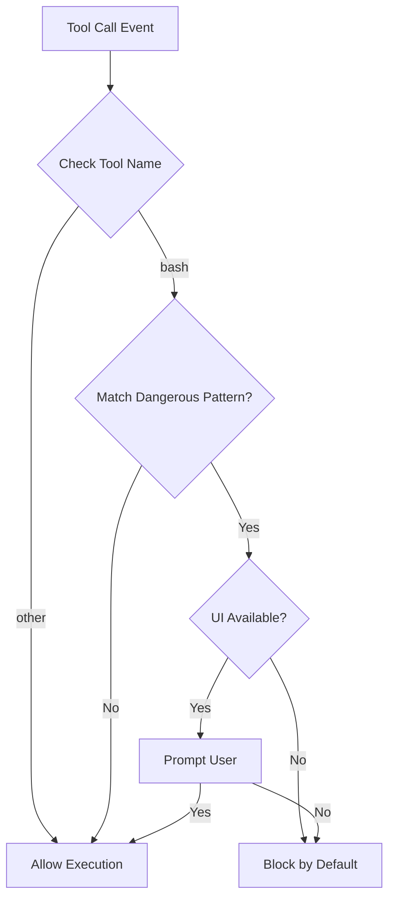
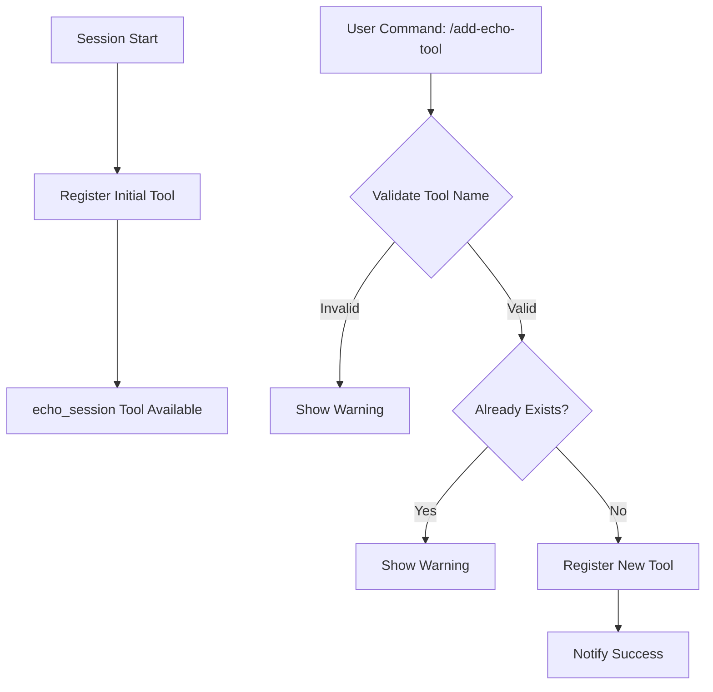
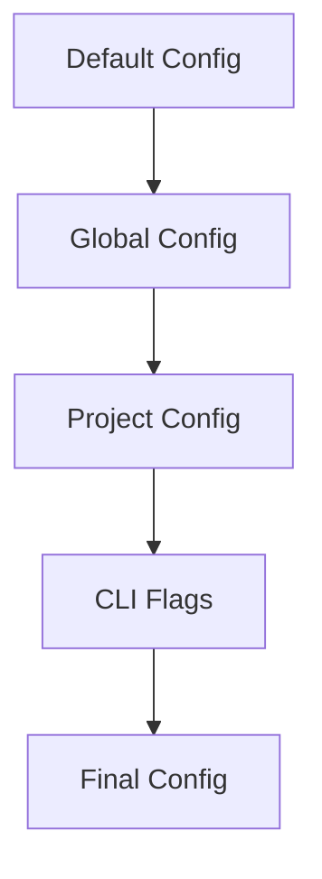
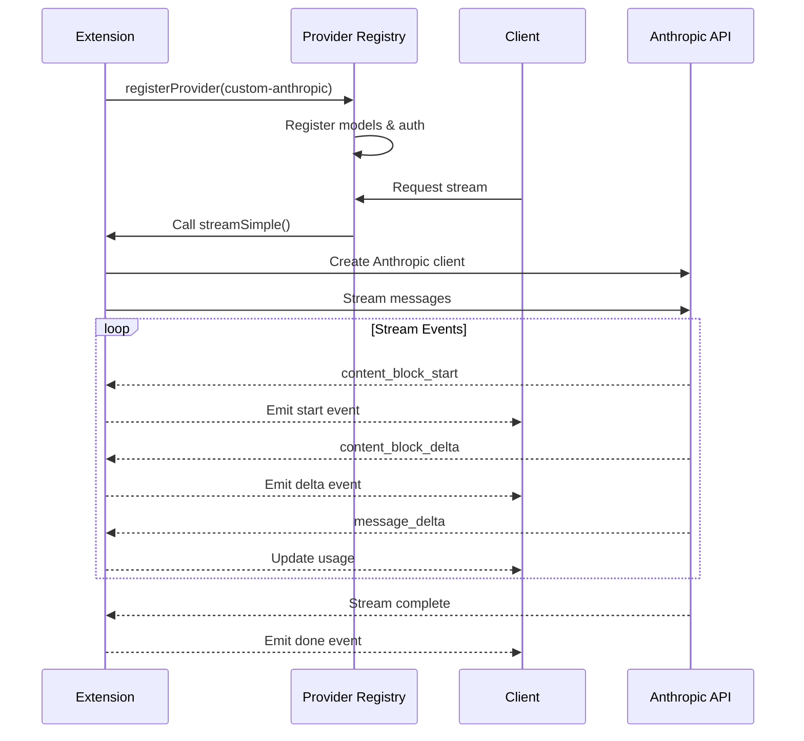
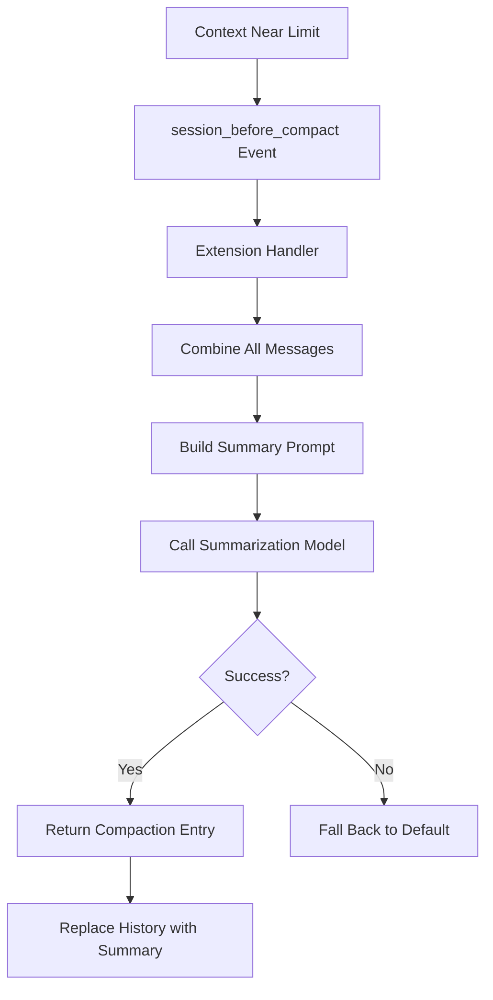

# Extension Examples & Patterns

This page provides a comprehensive guide to extension development patterns in the pi-mono coding agent. Extensions allow developers to customize and extend the agent's capabilities through tools, commands, event handlers, and integrations. The examples demonstrate common patterns ranging from simple tool registration to complex features like OS-level sandboxing, custom LLM providers, and dynamic tool management.

Extensions are TypeScript modules that export a default function receiving an `ExtensionAPI` instance, providing access to the agent's core functionality. These examples serve as both documentation and starting points for building custom extensions.

Sources: [examples/extensions/hello.ts](../../../packages/coding-agent/examples/extensions/hello.ts), [examples/extensions/permission-gate.ts](../../../packages/coding-agent/examples/extensions/permission-gate.ts)

---

## Basic Tool Registration

### Minimal Tool Example

The simplest extension pattern involves registering a custom tool using `defineTool()` and the `ExtensionAPI.registerTool()` method.

```typescript
const helloTool = defineTool({
	name: "hello",
	label: "Hello",
	description: "A simple greeting tool",
	parameters: Type.Object({
		name: Type.String({ description: "Name to greet" }),
	}),

	async execute(_toolCallId, params, _signal, _onUpdate, _ctx) {
		return {
			content: [{ type: "text", text: `Hello, ${params.name}!` }],
			details: { greeted: params.name },
		};
	},
});

export default function (pi: ExtensionAPI) {
	pi.registerTool(helloTool);
}
```

**Key Components:**
- **name**: Unique identifier for the tool
- **parameters**: TypeBox schema defining input structure
- **execute**: Async function returning tool results with content and optional details
- **ExtensionAPI**: Provides `registerTool()` for tool registration

Sources: [examples/extensions/hello.ts:8-25](../../../packages/coding-agent/examples/extensions/hello.ts#L8-L25)

---

## Event-Based Patterns

### Tool Call Interception

Extensions can intercept and modify tool execution through event handlers. The permission gate pattern demonstrates blocking dangerous commands before execution.



**Dangerous Patterns Checked:**
- `rm -rf` or `rm --recursive`
- `sudo` commands
- `chmod/chown 777` permission changes

Sources: [examples/extensions/permission-gate.ts:10-30](../../../packages/coding-agent/examples/extensions/permission-gate.ts#L10-L30)

### Inter-Extension Communication

The event bus pattern enables extensions to communicate through custom events using `pi.events`.

```typescript
// Listener extension
pi.events.on("my:notification", (data) => {
	const { message, from } = data as { message: string; from: string };
	currentCtx?.ui.notify(`Event from ${from}: ${message}`, "info");
});

// Emitter extension
pi.events.emit("my:notification", { 
	message: "Session started", 
	from: "event-bus-example" 
});
```

**Use Cases:**
- Cross-extension notifications
- State synchronization
- Workflow coordination

Sources: [examples/extensions/event-bus.ts:21-27](../../../packages/coding-agent/examples/extensions/event-bus.ts#L21-L27), [examples/extensions/event-bus.ts:36-40](../../../packages/coding-agent/examples/extensions/event-bus.ts#L36-L40)

---

## Dynamic Tool Management

### Runtime Tool Registration

Extensions can register tools dynamically during session lifecycle, enabling adaptive toolsets based on context.



**Tool Registration Flow:**

| Phase | Event | Action |
|-------|-------|--------|
| Initialization | `session_start` | Register `echo_session` tool |
| Runtime | `/add-echo-tool` command | Register user-specified tool |
| Validation | Tool name check | Ensure lowercase, alphanumeric + underscore |

```typescript
const registerEchoTool = (name: string, label: string, prefix: string): boolean => {
	if (registeredToolNames.has(name)) {
		return false;
	}

	registeredToolNames.add(name);
	pi.registerTool({
		name,
		label,
		description: `Echo a message with prefix: ${prefix}`,
		parameters: ECHO_PARAMS,
		async execute(_toolCallId, params) {
			return {
				content: [{ type: "text", text: `${prefix}${params.message}` }],
				details: { tool: name, prefix },
			};
		},
	});

	return true;
};
```

Sources: [examples/extensions/dynamic-tools.ts:27-51](../../../packages/coding-agent/examples/extensions/dynamic-tools.ts#L27-L51), [examples/extensions/dynamic-tools.ts:53-57](../../../packages/coding-agent/examples/extensions/dynamic-tools.ts#L53-L57)

---

## Command Registration Patterns

### Command Introspection

Extensions can query and display available commands using `pi.getCommands()`.

**Command Sources:**

| Source | Description |
|--------|-------------|
| `extension` | Commands registered by extensions |
| `prompt` | Commands from prompt files |
| `skill` | Commands from skill modules |

```typescript
pi.registerCommand("commands", {
	description: "List available slash commands",
	getArgumentCompletions: (prefix) => {
		const sources = ["extension", "prompt", "skill"];
		const filtered = sources.filter((s) => s.startsWith(prefix));
		return filtered.length > 0 ? filtered.map((s) => ({ value: s, label: s })) : null;
	},
	handler: async (args, ctx) => {
		const commands = pi.getCommands();
		const sourceFilter = args.trim() as "extension" | "prompt" | "skill" | "";
		const filtered = sourceFilter ? commands.filter((c) => c.source === sourceFilter) : commands;
		// ... display logic
	},
});
```

**Features:**
- Argument auto-completion for source filtering
- Interactive command selection
- Source path viewing for debugging

Sources: [examples/extensions/commands.ts:20-66](../../../packages/coding-agent/examples/extensions/commands.ts#L20-L66)

### Interactive Tool Configuration

The tools extension provides persistent tool enable/disable functionality through a TUI settings interface.

```mermaid
graph TD
    A[/tools Command] --> B[Load Current State]
    B --> C[Build Settings UI]
    C --> D[User Toggles Tool]
    D --> E[Update Enabled Set]
    E --> F[Apply to Session]
    F --> G[Persist to Entry]
    G --> H{More Changes?}
    H -->|Yes| D
    H -->|No| I[Close Dialog]
```

**State Persistence:**
- State stored in custom session entries (`tools-config`)
- Restored on session start and branch navigation
- Synchronized with active tool set

Sources: [examples/extensions/tools.ts:33-42](../../../packages/coding-agent/examples/extensions/tools.ts#L33-L42), [examples/extensions/tools.ts:45-63](../../../packages/coding-agent/examples/extensions/tools.ts#L45-L63)

---

## Advanced Integration Patterns

### OS-Level Sandboxing

The sandbox extension demonstrates replacing built-in tools with security-enhanced versions using external libraries.

**Configuration Hierarchy:**



**Sandbox Configuration Schema:**

| Field | Type | Description |
|-------|------|-------------|
| `enabled` | boolean | Master enable/disable flag |
| `network.allowedDomains` | string[] | Whitelisted domains (supports wildcards) |
| `network.deniedDomains` | string[] | Blacklisted domains |
| `filesystem.denyRead` | string[] | Paths blocked from reading |
| `filesystem.allowWrite` | string[] | Paths allowed for writing |
| `filesystem.denyWrite` | string[] | Files/patterns blocked from writing |

```typescript
const DEFAULT_CONFIG: SandboxConfig = {
	enabled: true,
	network: {
		allowedDomains: [
			"npmjs.org", "*.npmjs.org", "registry.npmjs.org",
			"github.com", "*.github.com", "api.github.com"
		],
		deniedDomains: [],
	},
	filesystem: {
		denyRead: ["~/.ssh", "~/.aws", "~/.gnupg"],
		allowWrite: [".", "/tmp"],
		denyWrite: [".env", ".env.*", "*.pem", "*.key"],
	},
};
```

**Tool Override Pattern:**
- Register tool with same name as built-in (`bash`)
- Intercept `user_bash` event to modify operations
- Wrap commands with `SandboxManager.wrapWithSandbox()`

Sources: [examples/extensions/sandbox/index.ts:43-60](../../../packages/coding-agent/examples/extensions/sandbox/index.ts#L43-L60), [examples/extensions/sandbox/index.ts:103-111](../../../packages/coding-agent/examples/extensions/sandbox/index.ts#L103-L111)

### Custom LLM Provider

Extensions can register entirely new LLM providers with custom streaming implementations and authentication.

**Provider Registration Components:**

| Component | Purpose |
|-----------|---------|
| `api` | Unique API identifier |
| `baseUrl` | Provider endpoint |
| `apiKey` | Environment variable name |
| `models` | Model definitions with pricing |
| `oauth` | Optional OAuth configuration |
| `streamSimple` | Streaming implementation function |



**OAuth Support:**
- PKCE flow implementation
- Token refresh handling
- Claude Code identity for stealth mode

Sources: [examples/extensions/custom-provider-anthropic/index.ts:259-284](../../../packages/coding-agent/examples/extensions/custom-provider-anthropic/index.ts#L259-L284), [examples/extensions/custom-provider-anthropic/index.ts:50-94](../../../packages/coding-agent/examples/extensions/custom-provider-anthropic/index.ts#L50-L94)

---

## Session Lifecycle Patterns

### Custom Compaction Strategy

Extensions can override default context compaction with custom summarization logic.



**Compaction Parameters:**

| Parameter | Description |
|-----------|-------------|
| `messagesToSummarize` | Messages to be compacted |
| `turnPrefixMessages` | Recent messages to include in summary context |
| `tokensBefore` | Total tokens before compaction |
| `firstKeptEntryId` | ID of first entry to preserve |
| `previousSummary` | Previous compaction summary for continuity |

**Summary Requirements:**
1. Main goals and objectives
2. Key decisions and rationale
3. Code changes and technical details
4. Current work state
5. Blockers and open questions
6. Planned next steps

Sources: [examples/extensions/custom-compaction.ts:22-32](../../../packages/coding-agent/examples/extensions/custom-compaction.ts#L22-L32), [examples/extensions/custom-compaction.ts:53-87](../../../packages/coding-agent/examples/extensions/custom-compaction.ts#L53-L87)

---

## Extension Lifecycle Events

### Available Event Hooks

Extensions can register handlers for various session lifecycle events:

| Event | Trigger | Use Case |
|-------|---------|----------|
| `session_start` | Session initialization | Load state, register dynamic tools |
| `session_shutdown` | Session termination | Cleanup resources |
| `session_tree` | Branch navigation | Restore branch-specific state |
| `tool_call` | Before tool execution | Validate, block, or modify calls |
| `user_bash` | User bash command | Override bash operations |
| `session_before_compact` | Before context compaction | Custom summarization |

**State Restoration Pattern:**

```typescript
function restoreFromBranch(ctx: ExtensionContext) {
	const branchEntries = ctx.sessionManager.getBranch();
	let savedTools: string[] | undefined;

	for (const entry of branchEntries) {
		if (entry.type === "custom" && entry.customType === "tools-config") {
			const data = entry.data as ToolsState | undefined;
			if (data?.enabledTools) {
				savedTools = data.enabledTools;
			}
		}
	}

	if (savedTools) {
		enabledTools = new Set(savedTools.filter((t: string) => allToolNames.includes(t)));
		applyTools();
	}
}
```

Sources: [examples/extensions/tools.ts:45-63](../../../packages/coding-agent/examples/extensions/tools.ts#L45-L63), [examples/extensions/event-bus.ts:18-20](../../../packages/coding-agent/examples/extensions/event-bus.ts#L18-L20)

---

## Best Practices

### Extension Structure

1. **Default Export**: Always export a function accepting `ExtensionAPI`
2. **Type Safety**: Use TypeBox for parameter schemas
3. **Error Handling**: Handle failures gracefully with fallbacks
4. **State Management**: Use session entries for persistent state
5. **UI Integration**: Check `ctx.hasUI` before interactive operations

### Configuration Management

**Recommended Configuration Hierarchy:**
```
1. Hard-coded defaults (in extension)
2. Global config (~/.pi/agent/extensions/<name>.json)
3. Project config (<cwd>/.pi/<name>.json)
4. CLI flags (--flag)
```

### Tool Naming Conventions

- Use lowercase with underscores: `echo_session`
- Validate names: `/^[a-z0-9_]+$/`
- Track registered names to prevent duplicates
- Consider OAuth stealth mode for Anthropic providers

Sources: [examples/extensions/dynamic-tools.ts:13-18](../../../packages/coding-agent/examples/extensions/dynamic-tools.ts#L13-L18), [examples/extensions/sandbox/index.ts:62-88](../../../packages/coding-agent/examples/extensions/sandbox/index.ts#L62-L88)

---

## Summary

The extension system provides powerful customization capabilities through multiple integration points: tool registration, command handlers, event interception, and lifecycle hooks. The examples demonstrate patterns ranging from simple tool additions to complex features like OS sandboxing and custom LLM providers. Key patterns include event-based interception, dynamic tool management, state persistence through session entries, and hierarchical configuration management. Extensions can modify agent behavior at multiple levels while maintaining type safety and proper error handling.