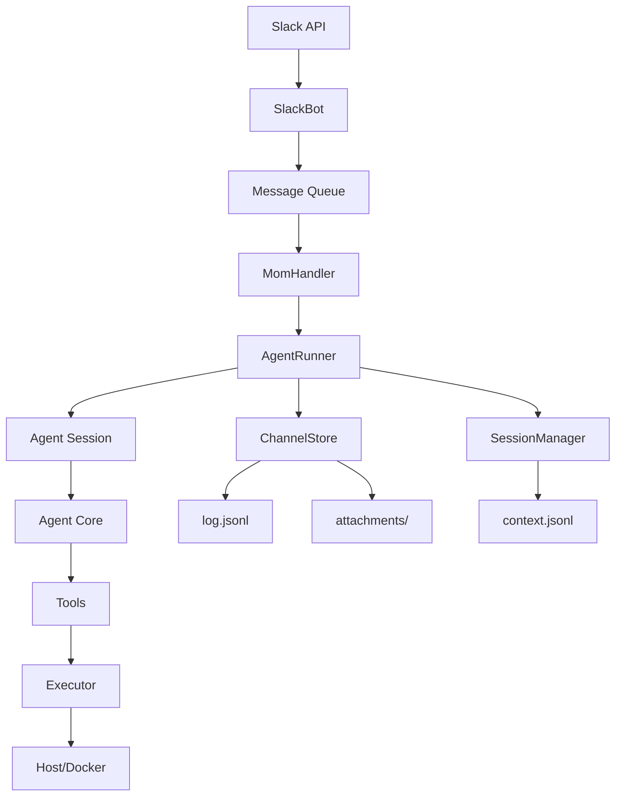
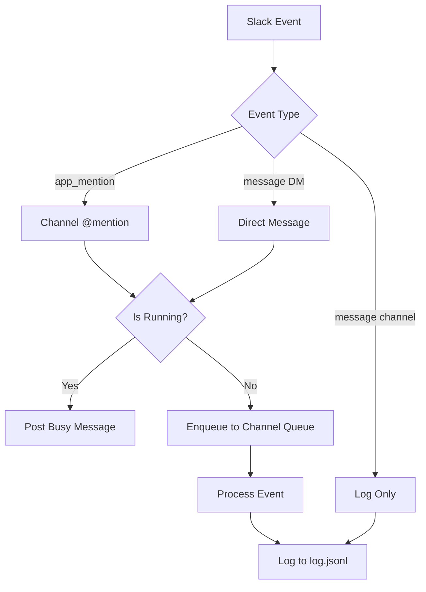
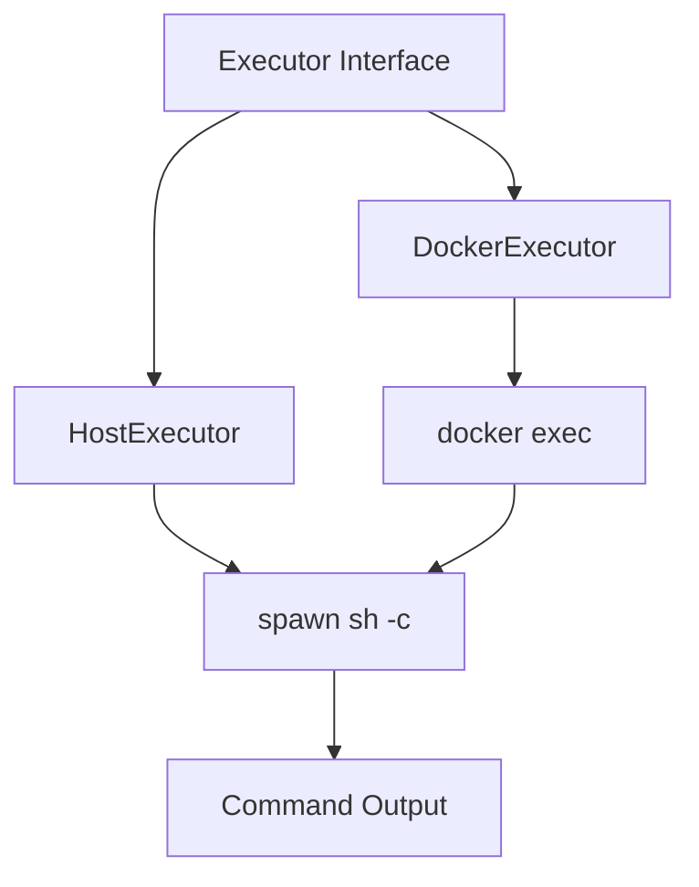
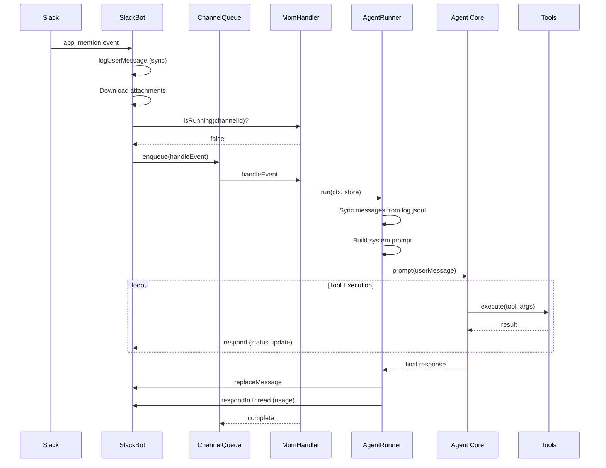
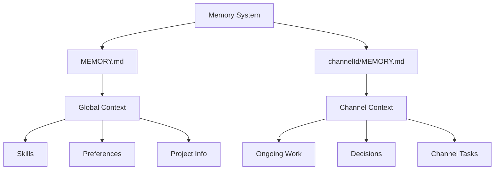
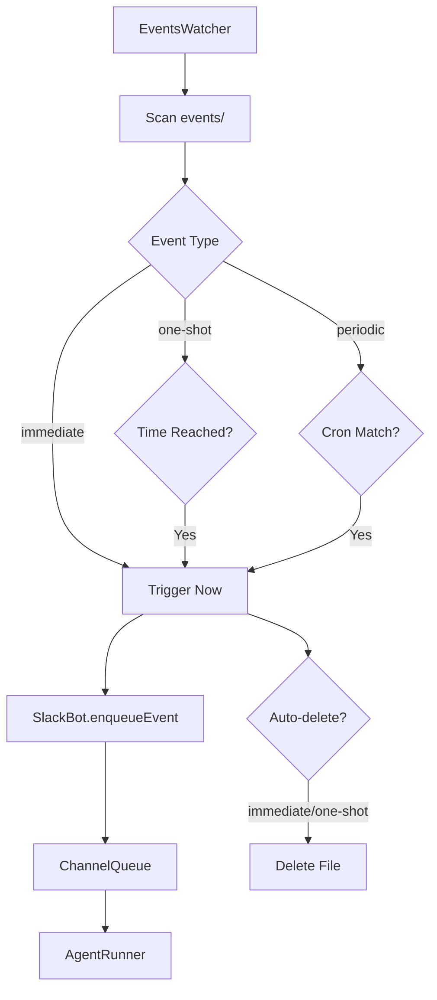
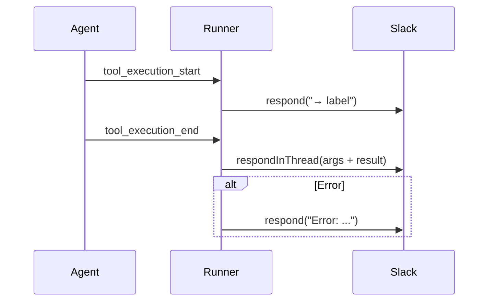
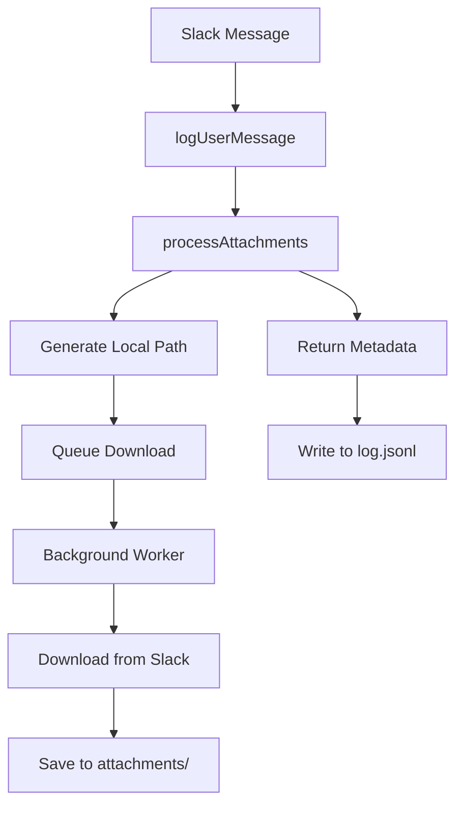

# Mom: Slack-Integrated Agent Service

**Mom** is a Slack bot service that integrates the pi coding agent into Slack workspaces, enabling users to interact with AI-powered coding assistance directly through Slack channels and direct messages. The service manages per-channel agent sessions, handles message queuing, supports file attachments, and provides event scheduling capabilities. Mom operates in either host mode (running commands directly on the host machine) or Docker mode (executing commands within an isolated container), making it suitable for both development and production environments.

The service maintains conversation history, supports custom skills (reusable CLI tools), manages working memory across sessions, and provides sophisticated context management to ensure the agent has access to relevant information while staying within token limits. Mom is designed to be a persistent, always-available coding assistant that can handle multiple concurrent conversations across different Slack channels.

*Sources: [packages/mom/package.json](../../../packages/mom/package.json), [packages/mom/src/main.ts:1-10](../../../packages/mom/src/main.ts#L1-L10)*

## Architecture Overview

Mom follows a modular architecture with clear separation of concerns between Slack integration, agent management, sandbox execution, and storage:



The architecture ensures that each Slack channel gets its own isolated agent runner with persistent context, while the SlackBot manages all incoming events and routes them to appropriate handlers. The per-channel queue system prevents concurrent execution conflicts and ensures messages are processed sequentially.

*Sources: [packages/mom/src/main.ts:90-150](../../../packages/mom/src/main.ts#L90-L150), [packages/mom/src/slack.ts:1-50](../../../packages/mom/src/slack.ts#L1-L50)*

## Core Components

### SlackBot

The `SlackBot` class manages all Slack API interactions, including:

| Component | Description |
|-----------|-------------|
| Socket Mode Client | Maintains real-time connection to Slack for receiving events |
| Web API Client | Handles REST API calls for posting messages, uploading files |
| User/Channel Cache | Stores mappings of IDs to names for efficient lookups |
| Per-Channel Queues | Ensures sequential message processing per channel |
| Backfill System | Syncs historical messages on startup |

The bot listens for two types of events: `app_mention` (for @mentions in channels) and `message` (for direct messages and logging all channel activity). Each event is processed through a per-channel queue to prevent race conditions.



*Sources: [packages/mom/src/slack.ts:100-250](../../../packages/mom/src/slack.ts#L100-L250), [packages/mom/src/slack.ts:300-400](../../../packages/mom/src/slack.ts#L300-L400)*

### AgentRunner

Each Slack channel has a dedicated `AgentRunner` instance that persists across messages. The runner maintains:

- **Agent Session**: Wraps the core agent with session management
- **Message History**: Loads from `context.jsonl` on initialization
- **System Prompt**: Dynamically generated with current memory, skills, and context
- **Event Subscriptions**: Listens to agent events for real-time UI updates

Runners are cached in a `Map<string, AgentRunner>` keyed by channel ID, ensuring the same agent instance handles all messages in a channel.

```typescript
const channelRunners = new Map<string, AgentRunner>();

export function getOrCreateRunner(
    sandboxConfig: SandboxConfig, 
    channelId: string, 
    channelDir: string
): AgentRunner {
    const existing = channelRunners.get(channelId);
    if (existing) return existing;
    
    const runner = createRunner(sandboxConfig, channelId, channelDir);
    channelRunners.set(channelId, runner);
    return runner;
}
```

*Sources: [packages/mom/src/agent.ts:45-65](../../../packages/mom/src/agent.ts#L45-L65), [packages/mom/src/agent.ts:350-370](../../../packages/mom/src/agent.ts#L350-L370)*

### Sandbox Execution

Mom supports two execution modes controlled by the `SandboxConfig`:

| Mode | Description | Use Case |
|------|-------------|----------|
| `host` | Runs commands directly on host machine | Development, trusted environments |
| `docker:<container>` | Executes in isolated Docker container | Production, untrusted code |

The `Executor` interface abstracts the execution environment:



Docker mode wraps commands with `docker exec <container> sh -c '<command>'`, providing isolation while maintaining the same API. The executor also handles path translation between host paths and container paths (`/workspace`).

*Sources: [packages/mom/src/sandbox.ts:1-150](../../../packages/mom/src/sandbox.ts#L1-L150)*

## Message Processing Flow

The complete flow from Slack message to agent response involves multiple stages:



### Message Logging

All messages (user and bot) are logged to `<channelId>/log.jsonl` for history tracking:

```typescript
interface LoggedMessage {
    date: string;        // ISO 8601 timestamp
    ts: string;          // Slack message timestamp
    user: string;        // User ID or "bot"
    userName?: string;   // User handle (e.g., "mario")
    displayName?: string;// Full name
    text: string;        // Message content
    attachments: Attachment[];
    isBot: boolean;
}
```

The `ChannelStore` handles deduplication using a timestamp-based cache to prevent logging the same message multiple times during backfill operations.

*Sources: [packages/mom/src/main.ts:200-300](../../../packages/mom/src/main.ts#L200-L300), [packages/mom/src/store.ts:10-30](../../../packages/mom/src/store.ts#L10-L30), [packages/mom/src/slack.ts:450-500](../../../packages/mom/src/slack.ts#L450-L500)*

## Context Management

### System Prompt Generation

The system prompt is dynamically generated for each run with fresh context:

```typescript
function buildSystemPrompt(
    workspacePath: string,
    channelId: string,
    memory: string,
    sandboxConfig: SandboxConfig,
    channels: ChannelInfo[],
    users: UserInfo[],
    skills: Skill[]
): string
```

The prompt includes:

1. **Identity and Guidelines**: Bot behavior, formatting rules (Slack mrkdwn)
2. **Environment Info**: Docker vs host, working directory, package manager
3. **Workspace Layout**: Directory structure, file purposes
4. **Slack Mappings**: Channel IDs to names, user IDs to handles
5. **Skills**: Available custom CLI tools with usage instructions
6. **Events**: How to create scheduled/immediate events
7. **Memory**: Current workspace and channel-specific memory
8. **Log Queries**: Examples for searching conversation history

*Sources: [packages/mom/src/agent.ts:150-250](../../../packages/mom/src/agent.ts#L150-L250)*

### Memory System

Mom maintains two levels of memory:



Memory is loaded at the start of each run and included in the system prompt:

```typescript
function getMemory(channelDir: string): string {
    const parts: string[] = [];
    
    // Workspace-level memory
    const workspaceMemoryPath = join(channelDir, "..", "MEMORY.md");
    if (existsSync(workspaceMemoryPath)) {
        const content = readFileSync(workspaceMemoryPath, "utf-8").trim();
        if (content) {
            parts.push(`### Global Workspace Memory\n${content}`);
        }
    }
    
    // Channel-specific memory
    const channelMemoryPath = join(channelDir, "MEMORY.md");
    if (existsSync(channelMemoryPath)) {
        const content = readFileSync(channelMemoryPath, "utf-8").trim();
        if (content) {
            parts.push(`### Channel-Specific Memory\n${content}`);
        }
    }
    
    return parts.length === 0 ? "(no working memory yet)" : parts.join("\n\n");
}
```

*Sources: [packages/mom/src/agent.ts:90-130](../../../packages/mom/src/agent.ts#L90-L130)*

### Session Synchronization

Before each run, Mom syncs messages from `log.jsonl` that may have arrived while offline:

```typescript
// Sync messages from log.jsonl that arrived while we were offline or busy
// Exclude the current message (it will be added via prompt())
const syncedCount = syncLogToSessionManager(sessionManager, channelDir, ctx.message.ts);
if (syncedCount > 0) {
    log.logInfo(`[${channelId}] Synced ${syncedCount} messages from log.jsonl`);
}

// Reload messages from context.jsonl
const reloadedSession = sessionManager.buildSessionContext();
if (reloadedSession.messages.length > 0) {
    agent.state.messages = reloadedSession.messages;
    log.logInfo(`[${channelId}] Reloaded ${reloadedSession.messages.length} messages from context`);
}
```

This ensures the agent always has complete conversation history, even if it was stopped and restarted.

*Sources: [packages/mom/src/agent.ts:550-570](../../../packages/mom/src/agent.ts#L550-L570)*

## Skills System

Skills are custom CLI tools that extend Mom's capabilities. They're stored in two locations:

```
workspace/
├── skills/              # Global skills (all channels)
│   └── <skill-name>/
│       ├── SKILL.md     # Metadata + documentation
│       └── *.sh|*.py    # Implementation scripts
└── <channelId>/
    └── skills/          # Channel-specific skills
        └── <skill-name>/
```

### Skill Definition

Each skill requires a `SKILL.md` file with YAML frontmatter:

```markdown
---
name: skill-name
description: Short description of what this skill does
---

# Skill Name

Usage instructions, examples, etc.
Scripts are in: {baseDir}/
```

The `{baseDir}` placeholder is replaced with the skill's container path during system prompt generation.

### Skill Loading

Skills are loaded hierarchically with channel-specific skills overriding workspace skills:

```typescript
function loadMomSkills(channelDir: string, workspacePath: string): Skill[] {
    const skillMap = new Map<string, Skill>();
    
    // Load workspace-level skills (global)
    const workspaceSkillsDir = join(hostWorkspacePath, "skills");
    for (const skill of loadSkillsFromDir({ dir: workspaceSkillsDir, source: "workspace" }).skills) {
        skill.filePath = translatePath(skill.filePath);
        skill.baseDir = translatePath(skill.baseDir);
        skillMap.set(skill.name, skill);
    }
    
    // Load channel-specific skills (override workspace skills on collision)
    const channelSkillsDir = join(channelDir, "skills");
    for (const skill of loadSkillsFromDir({ dir: channelSkillsDir, source: "channel" }).skills) {
        skill.filePath = translatePath(skill.filePath);
        skill.baseDir = translatePath(skill.baseDir);
        skillMap.set(skill.name, skill);
    }
    
    return Array.from(skillMap.values());
}
```

*Sources: [packages/mom/src/agent.ts:130-150](../../../packages/mom/src/agent.ts#L130-L150)*

## Event System

Mom supports scheduled and immediate events through JSON files in `workspace/events/`:

### Event Types

| Type | Description | Behavior |
|------|-------------|----------|
| `immediate` | Triggers as soon as detected | Auto-deletes after trigger |
| `one-shot` | Triggers at specific time | Auto-deletes after trigger |
| `periodic` | Triggers on cron schedule | Persists until manually deleted |

### Event Format

```typescript
// Immediate
{
    "type": "immediate",
    "channelId": "C12345",
    "text": "New GitHub issue opened"
}

// One-shot
{
    "type": "one-shot",
    "channelId": "C12345",
    "text": "Remind Mario about dentist",
    "at": "2025-12-15T09:00:00+01:00"
}

// Periodic
{
    "type": "periodic",
    "channelId": "C12345",
    "text": "Check inbox and summarize",
    "schedule": "0 9 * * 1-5",
    "timezone": "Europe/Berlin"
}
```

### Event Processing

The `EventsWatcher` monitors the events directory and triggers events by enqueueing them through the SlackBot:



Events are subject to a queue limit of 5 per channel to prevent flooding.

*Sources: [packages/mom/src/events.ts](../../../packages/mom/src/events.ts), [packages/mom/src/slack.ts:280-300](../../../packages/mom/src/slack.ts#L280-L300)*

## Tool Execution

Mom provides five core tools to the agent:

| Tool | Purpose | Label Parameter |
|------|---------|-----------------|
| `bash` | Execute shell commands | User-visible action description |
| `read` | Read file contents | File path or description |
| `write` | Create/overwrite files | File path |
| `edit` | Surgical file edits | Edit description |
| `attach` | Upload files to Slack | File description |

### Tool Event Flow

Tool execution is tracked through agent events and reported to Slack in real-time:



Tool results are posted to thread messages to keep the main channel clean while providing full transparency.

### Tool Arguments

All tools require a `label` parameter for user-facing descriptions:

```typescript
{
    label: "Check if Docker is running",
    command: "docker ps"
}
```

The label is displayed in the main channel ("_→ Check if Docker is running_"), while full arguments and results go to the thread.

*Sources: [packages/mom/src/tools/index.ts](../../../packages/mom/src/tools/index.ts), [packages/mom/src/agent.ts:400-450](../../../packages/mom/src/agent.ts#L400-L450)*

## Attachment Handling

File attachments are processed asynchronously through the `ChannelStore`:



Attachments are stored in `<channelId>/attachments/` with timestamped filenames:

```typescript
generateLocalFilename(originalName: string, timestamp: string): string {
    const ts = Math.floor(parseFloat(timestamp) * 1000);
    const sanitized = originalName.replace(/[^a-zA-Z0-9._-]/g, "_");
    return `${ts}_${sanitized}`;
}
```

Images are automatically included in the agent's prompt as base64-encoded `ImageContent`, while other files are listed in an `<slack_attachments>` block.

*Sources: [packages/mom/src/store.ts:50-120](../../../packages/mom/src/store.ts#L50-L120), [packages/mom/src/agent.ts:600-650](../../../packages/mom/src/agent.ts#L600-L650)*

## Backfill System

On startup, Mom backfills recent history for channels it has previously interacted with:

```typescript
private async backfillChannel(channelId: string): Promise<number> {
    const existingTs = this.getExistingTimestamps(channelId);
    
    // Find the biggest ts in log.jsonl
    let latestTs: string | undefined;
    for (const ts of existingTs) {
        if (!latestTs || parseFloat(ts) > parseFloat(latestTs)) latestTs = ts;
    }
    
    // Fetch messages newer than latestTs
    const result = await this.webClient.conversations.history({
        channel: channelId,
        oldest: latestTs,
        inclusive: false,
        limit: 1000
    });
    
    // Filter and log relevant messages
    // ...
}
```

This ensures conversation continuity even if Mom was offline for a period. Only channels with existing `log.jsonl` files are backfilled (channels Mom has interacted with before).

*Sources: [packages/mom/src/slack.ts:500-600](../../../packages/mom/src/slack.ts#L500-L600)*

## Configuration

### Environment Variables

| Variable | Required | Purpose |
|----------|----------|---------|
| `MOM_SLACK_APP_TOKEN` | Yes | Socket Mode app token (starts with `xapp-`) |
| `MOM_SLACK_BOT_TOKEN` | Yes | Bot user OAuth token (starts with `xoxb-`) |

### Command Line Arguments

```bash
# Normal bot mode
mom [--sandbox=host|docker:<name>] <working-directory>

# Download channel history
mom --download <channel-id>
```

The `--sandbox` option controls execution mode:
- `host`: Run commands on host machine
- `docker:<container>`: Run commands in Docker container

*Sources: [packages/mom/src/main.ts:15-60](../../../packages/mom/src/main.ts#L15-L60)*

## Workspace Structure

Each Mom deployment maintains a structured workspace:

```
<working-dir>/
├── MEMORY.md              # Global memory
├── SYSTEM.md              # Environment setup log
├── skills/                # Global skills
├── events/                # Event definitions
└── <channelId>/
    ├── MEMORY.md          # Channel memory
    ├── log.jsonl          # Message history
    ├── context.jsonl      # Agent conversation state
    ├── last_prompt.jsonl  # Debug: last system prompt
    ├── attachments/       # Downloaded files
    ├── scratch/           # Agent working directory
    └── skills/            # Channel-specific skills
```

The workspace path is translated for Docker mode:
- Host: Actual filesystem path
- Docker: `/workspace` (mounted volume)

*Sources: [packages/mom/src/agent.ts:200-250](../../../packages/mom/src/agent.ts#L200-L250)*

## Usage Tracking

After each run, Mom logs token usage and cost information:

```typescript
if (runState.totalUsage.cost.total > 0) {
    const contextTokens = lastAssistantMessage
        ? lastAssistantMessage.usage.input +
          lastAssistantMessage.usage.output +
          lastAssistantMessage.usage.cacheRead +
          lastAssistantMessage.usage.cacheWrite
        : 0;
    const contextWindow = model.contextWindow || 200000;
    
    const summary = log.logUsageSummary(
        runState.logCtx!, 
        runState.totalUsage, 
        contextTokens, 
        contextWindow
    );
    runState.queue.enqueue(() => ctx.respondInThread(summary), "usage summary");
}
```

The summary includes input/output tokens, cache statistics, costs, and context window utilization percentage.

*Sources: [packages/mom/src/agent.ts:700-720](../../../packages/mom/src/agent.ts#L700-L720)*

## Summary

Mom provides a production-ready Slack integration for the pi coding agent with sophisticated features including per-channel session management, event scheduling, custom skills, persistent memory, and flexible execution environments. The architecture ensures reliable message processing through queuing, maintains conversation history across restarts, and provides real-time feedback during tool execution. With support for both host and Docker execution modes, Mom can be deployed in various environments while maintaining consistent functionality and isolation guarantees.