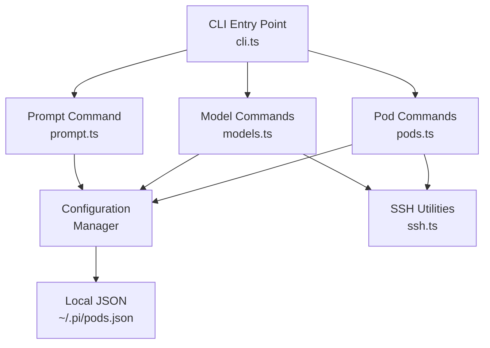
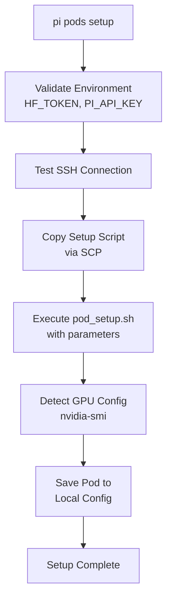
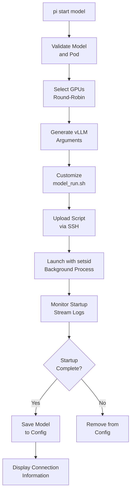
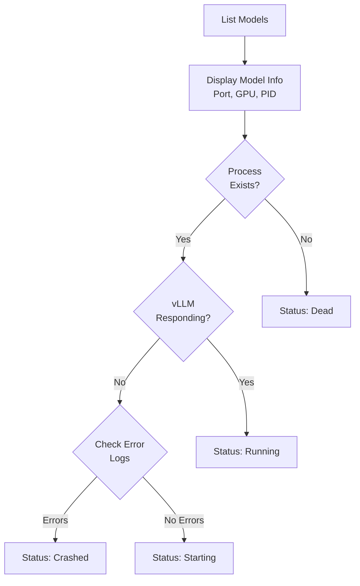
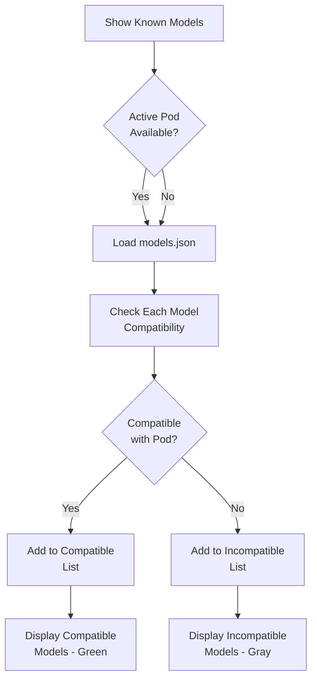

# Pods: GPU Pod & Model Management CLI

## Introduction

The Pods package (`@mariozechner/pi`) is a comprehensive CLI tool designed to manage vLLM (Large Language Model) deployments on remote GPU pods. It provides a unified interface for setting up GPU infrastructure, deploying and managing AI models, and interacting with running model instances. The CLI handles the complete lifecycle of model deployments including SSH connectivity, GPU resource allocation, vLLM configuration, process management, and health monitoring. This package serves as the infrastructure management layer for the pi-mono project, enabling seamless deployment and operation of LLM services across distributed GPU resources.

Sources: [packages/pods/package.json:2-4](../../../packages/pods/package.json#L2-L4), [packages/pods/src/cli.ts:1-10](../../../packages/pods/src/cli.ts#L1-L10)

## Architecture Overview

The Pods CLI is structured around three main functional areas: pod management, model lifecycle operations, and SSH communication utilities. The architecture follows a command-based pattern where the CLI entry point routes commands to specialized handler modules.



Sources: [packages/pods/src/cli.ts:8-11](../../../packages/pods/src/cli.ts#L8-L11), [packages/pods/src/config.ts:1-6](../../../packages/pods/src/config.ts#L1-L6)

## Configuration Management

### Configuration Structure

The configuration system manages pod definitions, active pod selection, and running model registrations. All configuration is stored in a local JSON file at `~/.pi/pods.json`.

| Configuration Element | Type | Description |
|----------------------|------|-------------|
| `pods` | Object | Dictionary mapping pod names to Pod configurations |
| `active` | String (optional) | Name of the currently active pod |
| Pod.ssh | String | SSH connection command (e.g., "ssh root@host") |
| Pod.gpus | GPU[] | Array of detected GPU resources |
| Pod.models | Object | Dictionary of running models on this pod |
| Pod.modelsPath | String (optional) | Path to model storage directory |
| Pod.vllmVersion | String (optional) | vLLM version type: "release", "nightly", or "gpt-oss" |

Sources: [packages/pods/src/types.ts](../../../packages/pods/src/types.ts), [packages/pods/src/config.ts:8-17](../../../packages/pods/src/config.ts#L8-L17)

### Configuration API

The configuration module provides a functional API for managing pod configurations:

```typescript
// Load configuration from disk
export const loadConfig = (): Config => {
	const configPath = getConfigPath();
	if (!existsSync(configPath)) {
		return { pods: {} };
	}
	try {
		const data = readFileSync(configPath, "utf-8");
		return JSON.parse(data);
	} catch (e) {
		console.error(`Error reading config: ${e}`);
		return { pods: {} };
	}
};
```

Sources: [packages/pods/src/config.ts:19-31](../../../packages/pods/src/config.ts#L19-L31)

Key configuration functions include:
- `loadConfig()`: Loads configuration from disk, returns empty config if file doesn't exist
- `saveConfig(config)`: Persists configuration to disk
- `getActivePod()`: Returns the currently active pod and its configuration
- `addPod(name, pod)`: Adds a new pod, sets as active if no active pod exists
- `removePod(name)`: Removes a pod and clears active if it was active
- `setActivePod(name)`: Sets the active pod for subsequent operations

Sources: [packages/pods/src/config.ts:19-75](../../../packages/pods/src/config.ts#L19-L75)

## Pod Management Commands

### Pod Setup

The `pi pods setup` command initializes a new GPU pod by establishing SSH connectivity, installing dependencies, configuring vLLM, and detecting GPU resources.



The setup process requires two environment variables:
- `HF_TOKEN`: HuggingFace token for model downloads
- `PI_API_KEY`: API key for securing vLLM endpoints

Sources: [packages/pods/src/commands/pods.ts:42-63](../../../packages/pods/src/commands/pods.ts#L42-L63)

Setup command options:

| Option | Description | Example |
|--------|-------------|---------|
| `--mount "<cmd>"` | Mount command to execute (e.g., NFS mount) | `--mount "mount -t nfs server:/path /mnt/sfs"` |
| `--models-path <path>` | Path to model storage directory | `--models-path /mnt/sfs/models` |
| `--vllm release` | Install vLLM >=0.10.0 release (default) | `--vllm release` |
| `--vllm nightly` | Install vLLM nightly build | `--vllm nightly` |
| `--vllm gpt-oss` | Install vLLM 0.10.1+gptoss with PyTorch nightly | `--vllm gpt-oss` |

Sources: [packages/pods/src/cli.ts:24-28](../../../packages/pods/src/cli.ts#L24-L28), [packages/pods/src/commands/pods.ts:42-82](../../../packages/pods/src/commands/pods.ts#L42-L82)

### Pod Listing and Switching

The `pi pods` command lists all configured pods with their GPU configurations and vLLM versions. The active pod is marked with a green asterisk.

```typescript
export const listPods = () => {
	const config = loadConfig();
	const podNames = Object.keys(config.pods);
	
	for (const name of podNames) {
		const pod = config.pods[name];
		const isActive = config.active === name;
		const marker = isActive ? chalk.green("*") : " ";
		const gpuCount = pod.gpus?.length || 0;
		const gpuInfo = gpuCount > 0 ? `${gpuCount}x ${pod.gpus[0].name}` : "no GPUs detected";
		const vllmInfo = pod.vllmVersion ? ` (vLLM: ${pod.vllmVersion})` : "";
		console.log(`${marker} ${chalk.bold(name)} - ${gpuInfo}${vllmInfo} - ${pod.ssh}`);
	}
};
```

Sources: [packages/pods/src/commands/pods.ts:13-31](../../../packages/pods/src/commands/pods.ts#L13-L31)

## SSH Communication Layer

The SSH utilities module provides three core functions for remote command execution and file transfer:

### SSH Execution Functions

| Function | Purpose | Return Type | Options |
|----------|---------|-------------|---------|
| `sshExec` | Execute command, capture output | `Promise<SSHResult>` | `keepAlive` for long operations |
| `sshExecStream` | Execute command, stream to console | `Promise<number>` | `silent`, `forceTTY`, `keepAlive` |
| `scpFile` | Copy local file to remote | `Promise<boolean>` | None |

Sources: [packages/pods/src/ssh.ts:1-10](../../../packages/pods/src/ssh.ts#L1-L10)

### SSH Keep-Alive Configuration

For long-running operations, the SSH layer supports keep-alive options to prevent connection timeouts:

```typescript
if (options?.keepAlive) {
	// ServerAliveInterval=30 sends keepalive every 30 seconds
	// ServerAliveCountMax=120 allows up to 120 failures (60 minutes total)
	sshArgs = ["-o", "ServerAliveInterval=30", "-o", "ServerAliveCountMax=120", ...sshArgs];
}
```

This configuration allows operations to run for up to 60 minutes without timing out.

Sources: [packages/pods/src/ssh.ts:25-30](../../../packages/pods/src/ssh.ts#L25-L30), [packages/pods/src/ssh.ts:75-80](../../../packages/pods/src/ssh.ts#L75-L80)

## Model Lifecycle Management

### Model Deployment

The `pi start` command deploys a model to a GPU pod with automatic GPU allocation and vLLM configuration.



Sources: [packages/pods/src/commands/models.ts:69-115](../../../packages/pods/src/commands/models.ts#L69-L115)

### GPU Selection Strategy

The system uses a round-robin GPU allocation strategy to distribute models across available GPUs:

```typescript
const selectGPUs = (pod: Pod, count: number = 1): number[] => {
	if (count === pod.gpus.length) {
		return pod.gpus.map((g) => g.id);
	}
	
	// Count GPU usage across all models
	const gpuUsage = new Map<number, number>();
	for (const gpu of pod.gpus) {
		gpuUsage.set(gpu.id, 0);
	}
	
	for (const model of Object.values(pod.models)) {
		for (const gpuId of model.gpu) {
			gpuUsage.set(gpuId, (gpuUsage.get(gpuId) || 0) + 1);
		}
	}
	
	// Sort GPUs by usage (least used first)
	const sortedGPUs = Array.from(gpuUsage.entries())
		.sort((a, b) => a[1] - b[1])
		.map((entry) => entry[0]);
	
	return sortedGPUs.slice(0, count);
};
```

Sources: [packages/pods/src/commands/models.ts:36-62](../../../packages/pods/src/commands/models.ts#L36-L62)

### Model Start Options

| Option | Description | Example |
|--------|-------------|---------|
| `--name <name>` | Required deployment name | `--name my-model` |
| `--memory <percent>` | GPU memory utilization | `--memory 50%` |
| `--context <size>` | Context window size | `--context 16k` |
| `--gpus <count>` | Number of GPUs (predefined models) | `--gpus 2` |
| `--vllm <args...>` | Custom vLLM arguments (overrides all) | `--vllm --tensor-parallel-size 4` |
| `--pod <name>` | Override active pod | `--pod gpu-cluster-2` |

Sources: [packages/pods/src/cli.ts:30-35](../../../packages/pods/src/cli.ts#L30-L35), [packages/pods/src/commands/models.ts:117-163](../../../packages/pods/src/commands/models.ts#L117-L163)

### Startup Monitoring and Error Handling

The deployment process monitors model startup logs in real-time and detects various failure conditions:

```typescript
// Check for startup complete message
if (line.includes("Application startup complete")) {
	startupComplete = true;
	logProcess.kill();
}

// Check for failure indicators
if (line.includes("Model runner exiting with code") && !line.includes("code 0")) {
	startupFailed = true;
	failureReason = "Model runner failed to start";
}
if (line.includes("torch.OutOfMemoryError") || line.includes("CUDA out of memory")) {
	startupFailed = true;
	failureReason = "Out of GPU memory (OOM)";
}
```

When an OOM error is detected, the system provides helpful suggestions:
- Reduce GPU memory utilization with `--memory 50%`
- Use a smaller context window with `--context 4k`
- Use quantized model versions (e.g., FP8)
- Increase GPU count with tensor parallelism
- Try a smaller model variant

Sources: [packages/pods/src/commands/models.ts:265-297](../../../packages/pods/src/commands/models.ts#L265-L297), [packages/pods/src/commands/models.ts:303-323](../../../packages/pods/src/commands/models.ts#L303-L323)

### Model Stopping

Models can be stopped individually or all at once. The stop operation kills the process and all its children, then removes the model from the configuration:

```typescript
export const stopModel = async (name: string, options: { pod?: string }) => {
	const { name: podName, pod } = getPod(options.pod);
	const model = pod.models[name];
	
	const killCmd = `
		# Kill the script process and all its children
		pkill -TERM -P ${model.pid} 2>/dev/null || true
		kill ${model.pid} 2>/dev/null || true
	`;
	await sshExec(pod.ssh, killCmd);
	
	// Remove from config
	const config = loadConfig();
	delete config.pods[podName].models[name];
	saveConfig(config);
};
```

Sources: [packages/pods/src/commands/models.ts:367-393](../../../packages/pods/src/commands/models.ts#L367-L393)

### Model Listing and Health Checks

The `pi list` command displays all running models and verifies their health status:



The health check verifies:
1. Process existence via `ps -p ${pid}`
2. vLLM health endpoint via `curl http://localhost:${port}/health`
3. Log file analysis for error patterns (ERROR, Failed, CUDA errors)

Sources: [packages/pods/src/commands/models.ts:416-477](../../../packages/pods/src/commands/models.ts#L416-L477)

## Model Configuration System

### Known Models Registry

The system maintains a registry of predefined model configurations in `models.json`, providing optimized vLLM arguments for different hardware configurations. Each model can have multiple configurations for different GPU counts:

```typescript
export const getModelConfig = (modelId: string, availableGPUs: GPU[], requestedGPUs?: number) => {
	const model = models[modelId];
	if (!model?.configs) return null;
	
	for (const config of model.configs) {
		const gpuCount = config.gpuCount || 1;
		
		// Check if requested GPU count matches
		if (requestedGPUs && gpuCount !== requestedGPUs) continue;
		
		// Check GPU type compatibility
		if (config.gpuTypes?.length) {
			const hasCompatibleGPU = availableGPUs.some(gpu =>
				config.gpuTypes.some(type => gpu.name.includes(type))
			);
			if (!hasCompatibleGPU) continue;
		}
		
		return config;
	}
	
	return null;
};
```

Sources: [packages/pods/src/model-configs.ts](../../../packages/pods/src/model-configs.ts)

### Model Display and Filtering

The `pi start` command without arguments displays all known models, filtered by compatibility with the active pod:



Compatible models are displayed in green with their configuration details, while incompatible models are shown in gray with minimum hardware requirements.

Sources: [packages/pods/src/commands/models.ts:495-614](../../../packages/pods/src/commands/models.ts#L495-L614)

## Interactive Agent Integration

The `pi agent` command enables interactive chat with deployed models by spawning the pi-agent CLI with appropriate configuration:

```typescript
export const promptModel = async (
	name: string,
	agentArgs: string[],
	options: { pod?: string; apiKey?: string }
) => {
	const { name: podName, pod } = getPod(options.pod);
	const model = pod.models[name];
	
	const sshParts = pod.ssh.split(" ");
	const host = sshParts.find((p) => p.includes("@"))?.split("@")[1] || "localhost";
	const baseUrl = `http://${host}:${model.port}/v1`;
	
	// Spawn pi-agent with environment variables
	const agentProcess = spawn("pi-agent", agentArgs, {
		stdio: "inherit",
		env: {
			...process.env,
			OPENAI_BASE_URL: baseUrl,
			OPENAI_API_KEY: options.apiKey || process.env.PI_API_KEY || "",
			OPENAI_MODEL: model.model,
		},
	});
};
```

The agent command supports all pi-agent options including:
- `--continue, -c`: Continue previous session
- `--json`: Output as JSONL
- Interactive mode when no message is provided

Sources: [packages/pods/src/commands/prompt.ts](../../../packages/pods/src/commands/prompt.ts), [packages/pods/src/cli.ts:37-43](../../../packages/pods/src/cli.ts#L37-L43)

## Command-Line Interface

### Command Structure

The CLI follows a hierarchical command structure with pod management and model operations:

| Command | Subcommand | Description |
|---------|------------|-------------|
| `pi pods` | - | List all configured pods |
| `pi pods setup` | `<name> "<ssh>"` | Setup new pod with SSH command |
| `pi pods active` | `<name>` | Switch active pod |
| `pi pods remove` | `<name>` | Remove pod from configuration |
| `pi shell` | `[<name>]` | Open interactive shell on pod |
| `pi ssh` | `[<name>] "<cmd>"` | Execute SSH command on pod |
| `pi start` | `<model> --name <name>` | Start model deployment |
| `pi stop` | `[<name>]` | Stop model (or all if no name) |
| `pi list` | - | List running models |
| `pi logs` | `<name>` | Stream model logs |
| `pi agent` | `<name> [messages]` | Chat with model using agent |

Sources: [packages/pods/src/cli.ts:16-45](../../../packages/pods/src/cli.ts#L16-L45)

### Command Routing

The CLI entry point parses arguments and routes to appropriate command handlers:

```typescript
const command = args[0];
const subcommand = args[1];

if (command === "pods") {
	if (!subcommand) {
		listPods();
	} else if (subcommand === "setup") {
		await setupPod(name, sshCmd, options);
	} else if (subcommand === "active") {
		switchActivePod(name);
	}
} else {
	// Parse --pod override for model commands
	let podOverride: string | undefined;
	const podIndex = args.indexOf("--pod");
	if (podIndex !== -1 && podIndex + 1 < args.length) {
		podOverride = args[podIndex + 1];
		args.splice(podIndex, 2);
	}
	
	// Route to model commands
	switch (command) {
		case "start":
			await startModel(modelId, name, options);
			break;
		case "stop":
			await stopModel(name, { pod: podOverride });
			break;
		// ... other commands
	}
}
```

Sources: [packages/pods/src/cli.ts:62-230](../../../packages/pods/src/cli.ts#L62-L230)

## Environment Variables

The Pods CLI relies on several environment variables for configuration and authentication:

| Variable | Purpose | Required | Default |
|----------|---------|----------|---------|
| `HF_TOKEN` | HuggingFace token for model downloads | Yes (setup) | None |
| `PI_API_KEY` | API key for vLLM endpoint security | Yes (setup) | None |
| `PI_CONFIG_DIR` | Configuration directory location | No | `~/.pi` |
| `OPENAI_BASE_URL` | Set by agent command for model access | No | Generated |
| `OPENAI_API_KEY` | Set by agent command for authentication | No | From PI_API_KEY |
| `OPENAI_MODEL` | Set by agent command for model selection | No | From deployment |

Sources: [packages/pods/src/cli.ts:46-47](../../../packages/pods/src/cli.ts#L46-L47), [packages/pods/src/commands/pods.ts:44-61](../../../packages/pods/src/commands/pods.ts#L44-L61)

## Summary

The Pods package provides a complete infrastructure management solution for deploying and operating vLLM-based language models on remote GPU resources. It abstracts the complexity of SSH connectivity, GPU allocation, vLLM configuration, and process management behind a simple command-line interface. The system supports multiple pod configurations, automatic GPU selection, health monitoring, and seamless integration with the pi-agent for interactive model usage. With features like startup monitoring, error detection, and compatibility checking, it enables reliable deployment and operation of large language models across distributed GPU infrastructure.