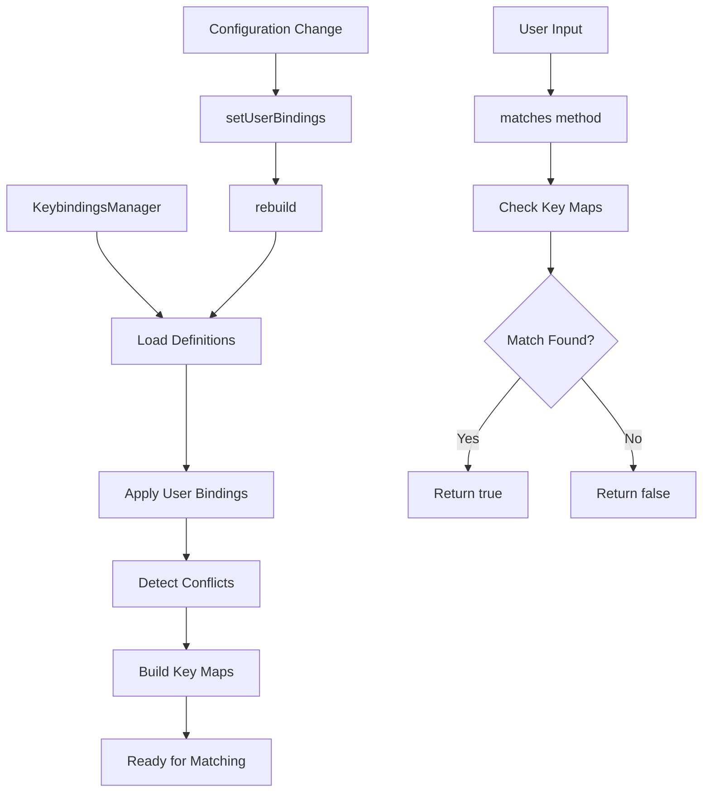
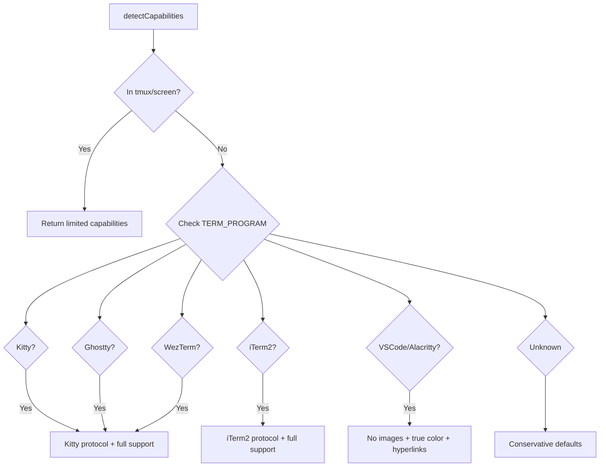
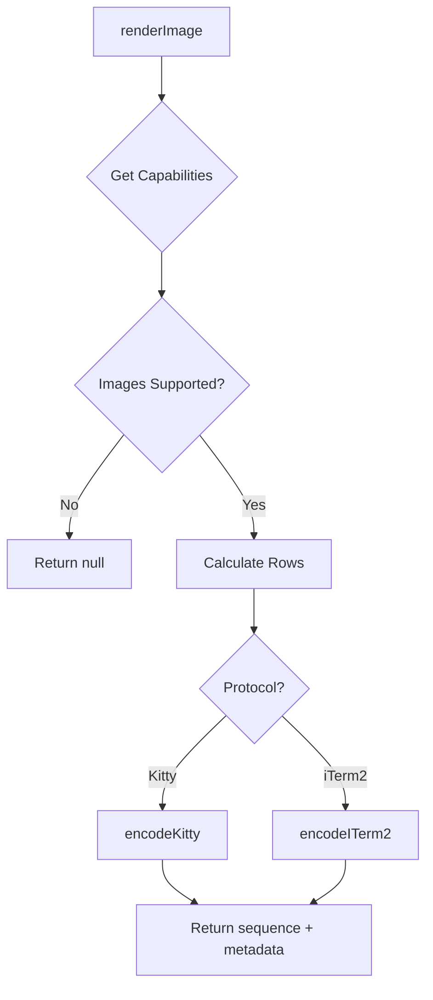

# Key Handling, Keybindings & Terminal Image Support

The `@pi-tui` package provides comprehensive infrastructure for handling keyboard input, managing keybindings, and rendering images in terminal environments. This system enables rich text editing capabilities with Emacs-style keybindings, configurable command shortcuts, and protocol-aware image rendering that adapts to terminal capabilities. The framework includes specialized data structures for undo/redo operations and kill-ring management, fuzzy matching utilities for autocomplete, and robust terminal capability detection for images and hyperlinks.

This module serves as the foundation for interactive TUI components, providing standardized key handling patterns, flexible keybinding configuration with conflict detection, and cross-terminal image support through multiple protocols (Kitty, iTerm2). The architecture supports both default keybindings and user customization through a centralized registry that downstream packages can extend via TypeScript declaration merging.

## Key Handling Architecture

### Key Identification System

The key handling system provides a type-safe mechanism for identifying and matching keyboard input sequences. The `KeyId` type represents all supported key combinations including special keys, control sequences, and modifier combinations.

Sources: [keybindings.ts:1-8](../../../packages/tui/src/keybindings.ts#L1-L8)

### Key Matching

The `matchesKey` function compares raw terminal input data against defined key identifiers, handling various terminal encoding schemes and escape sequences. This abstraction layer normalizes differences across terminal emulators and provides a consistent API for key detection.

Sources: [keybindings.ts:1-8](../../../packages/tui/src/keybindings.ts#L1-L8)

## Keybindings System

### Keybinding Registry

The keybindings system uses TypeScript declaration merging to create an extensible registry of application commands. The core `Keybindings` interface defines all available actions, which downstream packages can augment with additional commands.

```typescript
export interface Keybindings {
	// Editor navigation and editing
	"tui.editor.cursorUp": true;
	"tui.editor.cursorDown": true;
	"tui.editor.cursorLeft": true;
	"tui.editor.cursorRight": true;
	"tui.editor.cursorWordLeft": true;
	"tui.editor.cursorWordRight": true;
	// ... additional keybindings
}
```

Sources: [keybindings.ts:6-42](../../../packages/tui/src/keybindings.ts#L6-L42)

### Keybinding Categories

The framework organizes keybindings into logical categories:

| Category | Purpose | Example Commands |
|----------|---------|------------------|
| Editor Navigation | Cursor movement within text | `cursorUp`, `cursorDown`, `cursorWordLeft`, `cursorLineEnd` |
| Editor Editing | Text manipulation | `deleteCharBackward`, `deleteWordForward`, `deleteToLineEnd` |
| Editor Advanced | Jump operations, undo, kill-ring | `jumpForward`, `undo`, `yank`, `yankPop` |
| Input Actions | Text entry controls | `newLine`, `submit`, `tab`, `copy` |
| Selection | List/menu navigation | `up`, `down`, `pageUp`, `pageDown`, `confirm`, `cancel` |

Sources: [keybindings.ts:11-40](../../../packages/tui/src/keybindings.ts#L11-L40)

### Default Keybinding Definitions

Each keybinding has a definition that specifies default key combinations and optional descriptions. Multiple keys can map to the same command to support different user preferences (e.g., Emacs vs arrow keys).

```typescript
export const TUI_KEYBINDINGS = {
	"tui.editor.cursorLeft": {
		defaultKeys: ["left", "ctrl+b"],
		description: "Move cursor left",
	},
	"tui.editor.cursorWordLeft": {
		defaultKeys: ["alt+left", "ctrl+left", "alt+b"],
		description: "Move cursor word left",
	},
	// ... additional definitions
} as const satisfies KeybindingDefinitions;
```

Sources: [keybindings.ts:54-105](../../../packages/tui/src/keybindings.ts#L54-L105)

### KeybindingsManager Class

The `KeybindingsManager` class manages the runtime keybinding configuration, merging user customizations with defaults and detecting conflicts.



Sources: [keybindings.ts:117-197](../../../packages/tui/src/keybindings.ts#L117-L197)

#### Conflict Detection

The manager detects when multiple keybindings claim the same key combination, storing conflicts for user notification or resolution:

```typescript
export interface KeybindingConflict {
	key: KeyId;
	keybindings: string[];
}
```

During the rebuild process, user-defined bindings are analyzed to identify keys claimed by multiple commands. These conflicts are exposed via `getConflicts()` for UI presentation.

Sources: [keybindings.ts:107-111](../../../packages/tui/src/keybindings.ts#L107-L111), [keybindings.ts:129-147](../../../packages/tui/src/keybindings.ts#L129-L147)

#### Key Normalization

The `normalizeKeys` function ensures key lists are deduplicated and consistently formatted, handling both single key strings and arrays:

```typescript
function normalizeKeys(keys: KeyId | KeyId[] | undefined): KeyId[] {
	if (keys === undefined) return [];
	const keyList = Array.isArray(keys) ? keys : [keys];
	const seen = new Set<KeyId>();
	const result: KeyId[] = [];
	for (const key of keyList) {
		if (!seen.has(key)) {
			seen.add(key);
			result.push(key);
		}
	}
	return result;
}
```

Sources: [keybindings.ts:113-125](../../../packages/tui/src/keybindings.ts#L113-L125)

### Global Keybindings Instance

The module maintains a singleton `KeybindingsManager` instance accessible via `getKeybindings()`, which lazily initializes with default TUI keybindings if not explicitly configured:

```typescript
let globalKeybindings: KeybindingsManager | null = null;

export function setKeybindings(keybindings: KeybindingsManager): void {
	globalKeybindings = keybindings;
}

export function getKeybindings(): KeybindingsManager {
	if (!globalKeybindings) {
		globalKeybindings = new KeybindingsManager(TUI_KEYBINDINGS);
	}
	return globalKeybindings;
}
```

Sources: [keybindings.ts:199-211](../../../packages/tui/src/keybindings.ts#L199-L211)

## Terminal Image Support

### Capability Detection

The terminal image system automatically detects terminal capabilities including image protocol support, true color support, and hyperlink (OSC 8) support. Detection is based on environment variables and terminal identifiers.



Sources: [terminal-image.ts:34-95](../../../packages/tui/src/terminal-image.ts#L34-L95)

#### Supported Terminal Emulators

| Terminal | Image Protocol | True Color | Hyperlinks | Notes |
|----------|----------------|------------|------------|-------|
| Kitty | Kitty | ✓ | ✓ | Native graphics protocol |
| Ghostty | Kitty | ✓ | ✓ | Kitty-compatible |
| WezTerm | Kitty | ✓ | ✓ | Kitty-compatible |
| iTerm2 | iTerm2 | ✓ | ✓ | Inline images protocol |
| VSCode | None | ✓ | ✓ | Terminal emulator |
| Alacritty | None | ✓ | ✓ | No image support |
| tmux/screen | None | varies | ✗ | Escape sequence issues |

Sources: [terminal-image.ts:47-90](../../../packages/tui/src/terminal-image.ts#L47-L90)

#### tmux and screen Handling

The system explicitly disables hyperlinks and image protocols when running under tmux or screen, as these multiplexers swallow or corrupt OSC sequences by default:

```typescript
const inTmuxOrScreen = !!process.env.TMUX || term.startsWith("tmux") || term.startsWith("screen");
if (inTmuxOrScreen) {
	const trueColor = colorTerm === "truecolor" || colorTerm === "24bit";
	return { images: null, trueColor, hyperlinks: false };
}
```

Sources: [terminal-image.ts:54-60](../../../packages/tui/src/terminal-image.ts#L54-L60)

### Cell Dimension Management

The system tracks terminal cell dimensions (width and height in pixels) to accurately calculate image sizing. These dimensions are updated when the TUI receives terminal responses to dimension queries:

```typescript
let cellDimensions: CellDimensions = { widthPx: 9, heightPx: 18 };

export function getCellDimensions(): CellDimensions {
	return cellDimensions;
}

export function setCellDimensions(dims: CellDimensions): void {
	cellDimensions = dims;
}
```

Sources: [terminal-image.ts:27-37](../../../packages/tui/src/terminal-image.ts#L27-L37)

### Kitty Graphics Protocol

The Kitty graphics protocol uses escape sequences to transmit base64-encoded image data with metadata parameters. The implementation supports chunked transmission for large images and image ID management for updates.

#### Image Encoding

```typescript
export function encodeKitty(
	base64Data: string,
	options: {
		columns?: number;
		rows?: number;
		imageId?: number;
	} = {},
): string {
	const CHUNK_SIZE = 4096;
	const params: string[] = ["a=T", "f=100", "q=2"];
	
	if (options.columns) params.push(`c=${options.columns}`);
	if (options.rows) params.push(`r=${options.rows}`);
	if (options.imageId) params.push(`i=${options.imageId}`);
	
	// Chunked transmission for large images...
}
```

Sources: [terminal-image.ts:133-169](../../../packages/tui/src/terminal-image.ts#L133-L169)

#### Image Management

The protocol supports image deletion by ID or bulk deletion of all images:

```typescript
export function deleteKittyImage(imageId: number): string {
	return `\x1b_Ga=d,d=I,i=${imageId}\x1b\\`;
}

export function deleteAllKittyImages(): string {
	return `\x1b_Ga=d,d=A\x1b\\`;
}
```

Sources: [terminal-image.ts:175-184](../../../packages/tui/src/terminal-image.ts#L175-L184)

#### Image ID Allocation

Random image IDs prevent collisions between different module instances:

```typescript
export function allocateImageId(): number {
	// Use random ID in range [1, 0xffffffff] to avoid collisions
	return Math.floor(Math.random() * 0xfffffffe) + 1;
}
```

Sources: [terminal-image.ts:125-131](../../../packages/tui/src/terminal-image.ts#L125-L131)

### iTerm2 Inline Images Protocol

The iTerm2 protocol embeds base64 image data directly in escape sequences with metadata:

```typescript
export function encodeITerm2(
	base64Data: string,
	options: {
		width?: number | string;
		height?: number | string;
		name?: string;
		preserveAspectRatio?: boolean;
		inline?: boolean;
	} = {},
): string {
	const params: string[] = [`inline=${options.inline !== false ? 1 : 0}`];
	
	if (options.width !== undefined) params.push(`width=${options.width}`);
	if (options.height !== undefined) params.push(`height=${options.height}`);
	// ... additional parameters
	
	return `\x1b]1337;File=${params.join(";")}:${base64Data}\x07`;
}
```

Sources: [terminal-image.ts:186-209](../../../packages/tui/src/terminal-image.ts#L186-L209)

### Image Dimension Detection

The system includes parsers for extracting dimensions from base64-encoded images in multiple formats without external dependencies:

| Format | Function | Detection Method |
|--------|----------|------------------|
| PNG | `getPngDimensions` | Read IHDR chunk at offset 16 |
| JPEG | `getJpegDimensions` | Scan for SOF markers (0xC0-0xC2) |
| GIF | `getGifDimensions` | Read logical screen descriptor |
| WebP | `getWebpDimensions` | Parse VP8/VP8L/VP8X chunks |

Sources: [terminal-image.ts:223-334](../../../packages/tui/src/terminal-image.ts#L223-L334)

#### PNG Dimension Extraction

```typescript
export function getPngDimensions(base64Data: string): ImageDimensions | null {
	try {
		const buffer = Buffer.from(base64Data, "base64");
		if (buffer.length < 24) return null;
		
		// Check PNG signature
		if (buffer[0] !== 0x89 || buffer[1] !== 0x50 || 
		    buffer[2] !== 0x4e || buffer[3] !== 0x47) {
			return null;
		}
		
		const width = buffer.readUInt32BE(16);
		const height = buffer.readUInt32BE(20);
		return { widthPx: width, heightPx: height };
	} catch {
		return null;
	}
}
```

Sources: [terminal-image.ts:223-241](../../../packages/tui/src/terminal-image.ts#L223-L241)

### Image Rendering

The `renderImage` function provides a unified interface for rendering images, automatically selecting the appropriate protocol based on terminal capabilities:



Sources: [terminal-image.ts:347-373](../../../packages/tui/src/terminal-image.ts#L347-L373)

### Hyperlink Support

The system provides OSC 8 hyperlink rendering with automatic fallback for unsupported terminals:

```typescript
export function hyperlink(text: string, url: string): string {
	return `\x1b]8;;${url}\x1b\\${text}\x1b]8;;\x1b\\`;
}
```

Hyperlinks are rendered invisibly as plain text on terminals that don't support OSC 8, making the conservative default important for preserving URL visibility.

Sources: [terminal-image.ts:383-391](../../../packages/tui/src/terminal-image.ts#L383-L391)

### Image Line Detection

The `isImageLine` function efficiently detects whether a line contains image escape sequences, supporting both single-row and multi-row image rendering:

```typescript
export function isImageLine(line: string): boolean {
	// Fast path: sequence at line start (single-row images)
	if (line.startsWith(KITTY_PREFIX) || line.startsWith(ITERM2_PREFIX)) {
		return true;
	}
	// Slow path: sequence elsewhere (multi-row images have cursor-up prefix)
	return line.includes(KITTY_PREFIX) || line.includes(ITERM2_PREFIX);
}
```

Sources: [terminal-image.ts:117-123](../../../packages/tui/src/terminal-image.ts#L117-L123)

## Supporting Data Structures

### UndoStack

The `UndoStack` class provides generic undo functionality with clone-on-push semantics, storing deep clones of state snapshots:

```typescript
export class UndoStack<S> {
	private stack: S[] = [];

	/** Push a deep clone of the given state onto the stack. */
	push(state: S): void {
		this.stack.push(structuredClone(state));
	}

	/** Pop and return the most recent snapshot, or undefined if empty. */
	pop(): S | undefined {
		return this.stack.pop();
	}
}
```

The use of `structuredClone` ensures state snapshots are fully independent, preventing accidental mutation of historical states.

Sources: [undo-stack.ts:1-26](../../../packages/tui/src/undo-stack.ts#L1-L26)

### KillRing

The `KillRing` class implements Emacs-style kill/yank operations, maintaining a ring buffer of deleted text entries:

```typescript
export class KillRing {
	private ring: string[] = [];

	push(text: string, opts: { prepend: boolean; accumulate?: boolean }): void {
		if (!text) return;

		if (opts.accumulate && this.ring.length > 0) {
			const last = this.ring.pop()!;
			this.ring.push(opts.prepend ? text + last : last + text);
		} else {
			this.ring.push(text);
		}
	}
}
```

The accumulate option enables consecutive deletions to merge into a single entry, while the prepend flag controls whether new text is added before or after the existing entry (for backward vs forward deletion).

Sources: [kill-ring.ts:1-42](../../../packages/tui/src/kill-ring.ts#L1-L42)

#### Yank Operations

The kill ring supports both yank (paste most recent) and yank-pop (cycle through older entries):

```typescript
/** Get most recent entry without modifying the ring. */
peek(): string | undefined {
	return this.ring.length > 0 ? this.ring[this.ring.length - 1] : undefined;
}

/** Move last entry to front (for yank-pop cycling). */
rotate(): void {
	if (this.ring.length > 1) {
		const last = this.ring.pop()!;
		this.ring.unshift(last);
	}
}
```

Sources: [kill-ring.ts:27-37](../../../packages/tui/src/kill-ring.ts#L27-L37)

## Fuzzy Matching

### Fuzzy Match Algorithm

The fuzzy matching system enables flexible text search by matching queries where characters appear in order but not necessarily consecutively. The algorithm assigns scores based on match quality:

```typescript
export function fuzzyMatch(query: string, text: string): FuzzyMatch {
	const queryLower = query.toLowerCase();
	const textLower = text.toLowerCase();
	
	// Scoring factors:
	// - Consecutive matches: -5 per consecutive character
	// - Word boundaries: -10 bonus
	// - Gaps: +2 penalty per character gap
	// - Position: +0.1 penalty per character position
}
```

Sources: [fuzzy.ts:1-89](../../../packages/tui/src/fuzzy.ts#L1-L89)

#### Scoring System

| Factor | Score Impact | Purpose |
|--------|--------------|---------|
| Consecutive matches | -5 per character | Reward contiguous sequences |
| Word boundary match | -10 | Prioritize matches at word starts |
| Gap between matches | +2 per character | Penalize scattered matches |
| Match position | +0.1 per index | Slight preference for earlier matches |

Sources: [fuzzy.ts:21-49](../../../packages/tui/src/fuzzy.ts#L21-L49)

### Token Swapping

The algorithm includes special handling for queries with mixed alphanumeric patterns, attempting both the original order and swapped order:

```typescript
const alphaNumericMatch = queryLower.match(/^(?<letters>[a-z]+)(?<digits>[0-9]+)$/);
const numericAlphaMatch = queryLower.match(/^(?<digits>[0-9]+)(?<letters>[a-z]+)$/);
const swappedQuery = alphaNumericMatch
	? `${alphaNumericMatch.groups?.digits ?? ""}${alphaNumericMatch.groups?.letters ?? ""}`
	: numericAlphaMatch
		? `${numericAlphaMatch.groups?.letters ?? ""}${numericAlphaMatch.groups?.digits ?? ""}`
		: "";
```

This enables matching "abc123" with query "123abc" (with a small penalty).

Sources: [fuzzy.ts:61-79](../../../packages/tui/src/fuzzy.ts#L61-L79)

### Fuzzy Filter

The `fuzzyFilter` function applies fuzzy matching to collections, supporting multi-token queries where all tokens must match:

```typescript
export function fuzzyFilter<T>(items: T[], query: string, getText: (item: T) => string): T[] {
	if (!query.trim()) {
		return items;
	}

	const tokens = query
		.trim()
		.split(/\s+/)
		.filter((t) => t.length > 0);
	
	// All tokens must match, total score is sum of individual scores
}
```

Results are sorted by total score (lower is better), with best matches appearing first.

Sources: [fuzzy.ts:91-124](../../../packages/tui/src/fuzzy.ts#L91-L124)

## Autocomplete System

### Autocomplete Provider Interface

The autocomplete system defines a provider interface for pluggable completion sources:

```typescript
export interface AutocompleteProvider {
	getSuggestions(
		lines: string[],
		cursorLine: number,
		cursorCol: number,
		options: { signal: AbortSignal; force?: boolean },
	): Promise<AutocompleteSuggestions | null>;

	applyCompletion(
		lines: string[],
		cursorLine: number,
		cursorCol: number,
		item: AutocompleteItem,
		prefix: string,
	): {
		lines: string[];
		cursorLine: number;
		cursorCol: number;
	};
}
```

Sources: [autocomplete.ts:96-115](../../../packages/tui/src/autocomplete.ts#L96-L115)

### Combined Autocomplete Provider

The `CombinedAutocompleteProvider` implements multi-mode completion supporting slash commands, file attachments (@ prefix), and path completion:

```mermaid
graph TD
    A[User Input] --> B{Prefix Type?}
    B -->|@ prefix| C[Fuzzy File Search]
    B -->|/ command| D{Has Space?}
    D -->|No| E[Command Name Completion]
    D -->|Yes| F[Command Argument Completion]
    B -->|Path-like| G[Directory Walk]
    
    C --> H[fd Process]
    H --> I[Score & Sort Results]
    
    E --> J[Fuzzy Filter Commands]
    
    F --> K{Command Has getArgumentCompletions?}
    K -->|Yes| L[Call Custom Handler]
    K -->|No| M[Return null]
    
    G --> N[readdirSync]
    N --> O[Filter by Prefix]
```

Sources: [autocomplete.ts:118-293](../../../packages/tui/src/autocomplete.ts#L118-L293)

### File Path Completion

The provider includes sophisticated path completion with support for home directory expansion, quoted paths, and directory traversal:

```typescript
private expandHomePath(path: string): string {
	if (path.startsWith("~/")) {
		const expandedPath = join(homedir(), path.slice(2));
		return path.endsWith("/") && !expandedPath.endsWith("/") 
			? `${expandedPath}/` 
			: expandedPath;
	} else if (path === "~") {
		return homedir();
	}
	return path;
}
```

Sources: [autocomplete.ts:336-347](../../../packages/tui/src/autocomplete.ts#L336-L347)

### Fuzzy File Search with fd

For @ prefix completions, the provider uses the `fd` utility for fast, gitignore-aware file searching:

```typescript
async function walkDirectoryWithFd(
	baseDir: string,
	fdPath: string,
	query: string,
	maxResults: number,
	signal: AbortSignal,
): Promise<Array<{ path: string; isDirectory: boolean }>> {
	const args = [
		"--base-directory", baseDir,
		"--max-results", String(maxResults),
		"--type", "f",
		"--type", "d",
		"--follow",
		"--hidden",
		"--exclude", ".git",
		// ... additional arguments
	];
}
```

The implementation spawns `fd` as a child process, streams results, and respects abort signals for cancellation.

Sources: [autocomplete.ts:74-149](../../../packages/tui/src/autocomplete.ts#L74-L149)

### Slash Command Support

Slash commands are defined with optional argument completion handlers:

```typescript
export interface SlashCommand {
	name: string;
	description?: string;
	argumentHint?: string;
	getArgumentCompletions?(argumentPrefix: string): Awaitable<AutocompleteItem[] | null>;
}
```

The provider automatically handles command name completion and delegates to custom handlers for argument completion.

Sources: [autocomplete.ts:87-94](../../../packages/tui/src/autocomplete.ts#L87-L94)

## Summary

The key handling, keybindings, and terminal image support infrastructure provides a comprehensive foundation for building rich terminal user interfaces. The keybinding system offers flexible, conflict-aware configuration with Emacs-style editing support through specialized data structures like `KillRing` and `UndoStack`. Terminal image support adapts seamlessly across multiple protocols (Kitty, iTerm2) with robust capability detection and fallback handling. The fuzzy matching and autocomplete systems enable intuitive file navigation and command completion, leveraging external tools like `fd` for performance while maintaining pure TypeScript fallbacks. Together, these components create a cohesive framework that handles the complexity of terminal interaction while exposing clean, type-safe APIs for application developers.